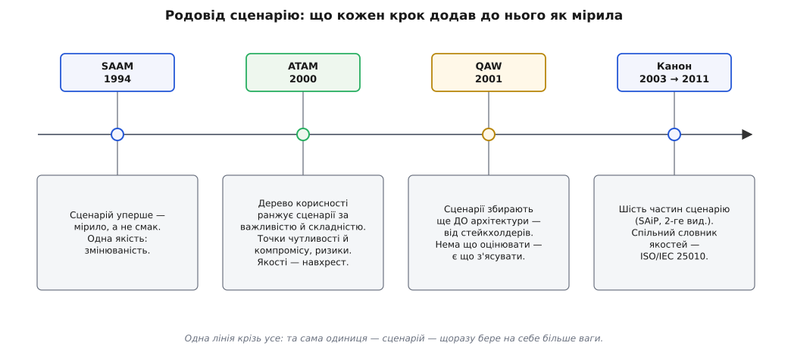

# 📜 Родовід сценарного оцінювання: від «рев'ю на око» до QAW

Уяви кімнату десь на початку 1990-х. За столом — найдосвідченіші інженери великого проєкту, на дошці — прямокутники й стрілки, і головне питання зустрічі: чи витримає ця структура те, заради чого її малюють? Далі відбувається щось, що всі називали «рев'ю архітектури», а насправді це був турнір авторитетів. Хтось казав «мені здається, тут буде вузько», хтось відповідав «за моїм досвідом — норм», і перемагав зазвичай не найточніший аргумент, а найгучніший голос або найвища посада. Рішення про структуру — те, що потім коштуватиме місяці на переробку, — ухвалювали **на око**.

Проблема «рев'ю на око» не в тому, що інженери були дурні. Навпаки: досвід у тій кімнаті був справжній, і чуття часто не підводило. Проблема в тому, що чуття **не можна пред'явити на суді**. Коли двоє однаково досвідчених розходяться, немає до чого апелювати — немає процедури, яку можна повторити й отримати той самий висновок, немає артефакту, який переживе саму нараду. Рев'ю на око не масштабується на команду, не передається новачкові, не перевіряється заднім числом. Воно лишає по собі відчуття «начебто обговорили» — і структуру, збудовану на здогадах. Історія, яку варто розказати, — це історія про те, як софтверна інженерія намагалася замінити цей турнір смаку на щось, що можна покласти на стіл, повторити й оскаржити. І в центрі тієї заміни стоїть одна маленька одиниця — **сценарій**.

## Місце дії: SEI при Карнеґі — Меллона

Не випадково, що метод визрів саме там, де ціна структурної помилки була видна найгостріше. Дія розгортається в **Інституті програмної інженерії** (Software Engineering Institute, SEI) при Університеті Карнеґі — Меллона (Carnegie Mellon University) у Пітсбурзі. SEI — не звичайна університетська лабораторія, а федерально фінансований дослідний центр, який Міністерство оборони США заснувало 1984 року саме тому, що великі військові програмні системи виходили дорогими, ненадійними й непідйомними в супроводі. Замовник, який роками платить за підтримку, гостро хоче знати про ваду **до** того, як за неї заплачено грошима й часом. Тому питання «чи можна перевірити структуру, поки вона ще на папері» тут стояло не академічно, а на рівні бюджету.

І щоб таку перевірку взагалі можна було задумати, спершу треба було домовитися, **що ми перевіряємо**. Поняття «якість системи» довго лишалося туманом прикметників — швидка, надійна, зручна. Кожен вкладав у ці слова своє, а перевірити прикметник неможливо. Тут потрібна річ, про яку сценарії й розказують окремо: [набір якісних атрибутів](topic:sf-apps/quality-attributes) — продуктивність, доступність, змінюваність, безпека як окремі виміри, кожен зі своєю мовою й своїми мірами. Без цього словника оцінювати нема чого; зі словником з'являється предмет, який сценарій може взяти й зробити перевірним.

## SAAM (1994): сценарій уперше стає мірилом

Перший робочий метод народився 1994 року й називався **SAAM** (Software Architecture Analysis Method — метод аналізу програмної архітектури). Його представили Рік Казман (Rick Kazman), Лен Басс (Len Bass), Майк Вебб (Mike Webb) та Ґреґорі Ебовд (Gregory Abowd) доповіддю «SAAM: A Method for Analyzing the Properties of Software Architectures» на 16-й Міжнародній конференції з програмної інженерії (ICSE) у Сорренто 16–21 травня 1994 року (сторінки 81–90). Це усталений факт — він стоїть на самій публікації, і SAAM справедливо називають **першим задокументованим** методом аналізу програмної архітектури.

Головний хід SAAM простий настільки, що аж дивно, чому до нього дійшли так пізно. Замість питати структуру абстрактно — «ти хороша?» — їй ставлять **конкретні ситуації**. «Додати новий тип звіту.» «Перенести на іншу базу даних.» «Підключити ще один канал вводу.» Кожну таку ситуацію проганяють крізь структуру й дивляться, скільки місць вона зачіпає: якщо зміна проходить наскрізь легко й локально — структура її витримує; якщо ж вона розповзається на десяток модулів — це видно, і це вже не чиясь думка, а спостереження, під яким може підписатися будь-хто в кімнаті. Оце й є та маленька одиниця — сценарій: короткий конкретний акт, який структура або вбирає легко, або кричить під ним. Рев'ю на око перетворилося на **рев'ю за сценаріями**: не «мені здається», а «прожени ось це і подивись».

> 🔧 **Навіщо це.** Сценарій забирає суперечку з поля авторитету на поле факту. Поки предметом розмови є прикметник «гнучка», перемагає той, хто переконливіше говорить. Щойно предметом стає конкретний акт «додати підтримку нової валюти за два дні, не чіпаючи ядра платежів» — переконливість ні до чого: структуру або можна так змінити, або ні, і це перевіряється, а не виголошується.

## Межа першого методу: одна якість за раз

У SAAM була чітка межа, і назвати її треба точно, щоб не сплутати з тим, що прийшло далі. SAAM цілив насамперед у **змінюваність** (modifiability) — наскільки легко систему переробляти. Вибір не випадковий: саме зміни й з'їдають бюджет супроводу, тож почати з них розумно, і метод із цією якістю впорався добре — його встигли прикласти до архітектур із найрізноманітніших галузей. Формально сценарний підхід годиться для будь-якої нефункційної властивості, але сам метод дивився на якості **поодинці**, по одній за захід.

А реальна система мусить бути змінюваною, швидкою, доступною й безпечною **одночасно** — і отут ховається пастка, якої SAAM не бачив. Якості не лежать поруч мирно; вони **тягнуться навхрест**. Синхронна репліка бази підносить надійність — і садить швидкодію. Товстий шар шифрування зміцнює безпеку — і крадькома точить зручність. Дивитися на кожну якість окремо означає не помічати саме того місця, де ухвалюється справжнє інженерне рішення: **чим пожертвувати заради чого**. Одна якість за раз — це лише половина картини, і наступний крок мусив узяти в кадр усю решту разом із перехрестями між ними.

## ATAM (2000): дерево корисності й перехрестя якостей

Стрибок стався наприкінці 1990-х і закріпився методом на ім'я **ATAM** (Architecture Tradeoff Analysis Method — метод аналізу архітектурних компромісів). Слово *tradeoff* (розмін, компроміс) у назві — не прикраса, а вся суть: цей метод перший узявся дивитися саме на зв'язки між кількома атрибутами й на розміни, що з цих зв'язків неминуче постають. Ранню, ще «незрілу» форму метод дістав у технічному звіті SEI 1998 року (CMU/SEI-98-TR-008), а свою канонічну, зрілу форму — у звіті **CMU/SEI-2000-TR-004 «ATAM: Method for Architecture Evaluation»** за серпень 2000 року; його автори — **Рік Казман (Rick Kazman), Марк Кляйн (Mark Klein) і Пол Клементс (Paul Clements)**, а формування методу тягли разом із ними Маріо Барбаччі (Mario Barbacci), Том Лонґстафф (Tom Longstaff), Говард Ліпсон (Howard Lipson) та Джеромі Кар'єр (Jeromy Carriere). Це усталено за титульними сторінками самих звітів.

Що ATAM зробив зі сценарієм? Він дав йому **порядок і вагу**. Сценаріїв для великої системи набирається сотні, і кидати їх у купу безглуздо. ATAM вішає їх на **дерево корисності** (utility tree): корінь — «корисність системи», гілки — якісні атрибути (продуктивність, доступність, змінюваність…), а листя — конкретні сценарії. Кожен лист дістає дві позначки: наскільки він **важливий** для успіху й наскільки **важко** його втримати архітектурно. Ця пара — і є фільтр. Сценарії, помічені (високо, високо) — важливі й водночас важкі, — це ті кілька, навколо яких і крутиться все рішення; решта осідає нижче як довідка.

```
Лист дерева корисності: (Важливість, Складність)

  профіль за 200 мс у пік (95%)   → (В, В)   ← драйвер
  переживає втрату вузла БД        → (В, В)   ← драйвер
  сторінка «про нас» < 3 с         → (Н, Н)   ← шум
  нова валюта без правки ядра      → (В, С)

  В — високо · С — середньо · Н — низько
```

А далі, проганяючи ці відібрані сценарії крізь структуру, ATAM шукає три роди місць — і кожне з них має точну назву. **Точка чутливості** (sensitivity point) — параметр структури, від якого гостро залежить один атрибут: крутнеш його трохи — якість помітно поїде. **Точка компромісу** (tradeoff point) — той самий параметр, але такий, що тягне **кілька** атрибутів у різні боки одночасно: додаси реплік — доступність угору, вартість і складність теж угору. І **ризики** — рішення, наслідки яких ніхто до пуття не прорахував. Ось де народжується головна відмінність ATAM від усього попереднього: інші методи бачили якості нарізно, а ATAM явно кладе на стіл їхні **перехрестя** — і дозволяє міркувати про розмін дисципліновано, а не тримати всю мережу взаємодій у голові одного найдосвідченішого інженера, сподіваючись, що він нічого не проґавив. Сам обряд ATAM за кілька років обріс двофазною процедурою на дев'ять кроків і багатоденними сесіями з десятками стейкхолдерів — той важкий ритуал і його полегшена версія докладно розібрані окремо, у [методі ATAM-lite](topic:sf-apps/atam-lite); тут важливий сам поворот, а не хореографія кроків.

## Дійові особи, названі точно

За абревіатурами стоять живі люди з простежуваним внеском, і чесніше назвати їх точно, ніж звести до безликих «розробників SEI». **Рік Казман** — постать наскрізна для всієї історії: співавтор і SAAM, і ATAM, він забезпечив тяглість від першого методу до другого. Фахову освіту почав в Університеті Ватерлоо в Канаді, докторський ступінь здобув у Карнеґі — Меллона (1991), згодом став професором в Університеті Гаваїв, лишаючись пов'язаним із SEI. **Пол Клементс** і **Лен Басс** — багаторічні дослідники SEI; саме їхні імена стоятимуть на книзі, що закріпить сценарій як канон. **Марк Кляйн** — співавтор зрілого ATAM.

Окремо варто спинитися на **Маріо Барбаччі**, бо його випадок — гарна ілюстрація того, чому не можна вгадувати походження за прізвищем. Прізвище звучить італійсько, і легко було б наліпити ярлик; але документовано інше — і точніше. Барбаччі здобув бакалаврський та інженерний ступені з електротехніки в **Національному інженерному університеті (Universidad Nacional de Ingeniería) у Лімі, Перу**, а докторат з інформатики — уже в Карнеґі — Меллона; він один зі співзасновників SEI і багаторічний старший науковець інституту. Тобто в цій, американській за місцем дії, історії стоїть інженер із перуанською вищою освітою — деталь, яку варто тримати як є, документованою, а не підмінювати зручним припущенням про національність.

## QAW (2001): а звідки взагалі беруться сценарії

Тут визріває питання, яке ATAM залишав відкритим. Дерево корисності впорядковує сценарії — але хтось же має їх **спочатку назбирати**. У класичному ATAM сценарії народжуються на самій сесії, коли архітектура-кандидат уже намальована. А що, як її ще нема? Що, як замовник тільки формує вимоги й хоче зрозуміти, які якості для нього критичні, ще до того, як з'явиться бодай перший прямокутник структури?

Відповіддю став **QAW** (Quality Attribute Workshop — семінар якісних атрибутів). Засадничий звіт — **CMU/SEI-2001-TR-010** за травень 2001 року; його підписали Маріо Барбаччі (Mario Barbacci), Роберт Еллісон (Robert Ellison), Джудіт Стаффорд (Judith Stafford), Чарльз Вайнсток (Charles Weinstock) та Вільям Вуд (William Wood). Наступні редакції уточнили метод: друга (CMU/SEI-2002-TR-019, червень 2002) додала до складу Ентоні Латтанце (Anthony Lattanze), третя вийшла 2003 року. Усе це усталено за самими звітами SEI.

Ключова риса QAW, заради якої він і постав, — **він не припускає, що архітектура вже існує**. Його зробили як доповнення до ATAM, прямо у відповідь на прохання замовників: дайте спосіб визначити важливі якісні атрибути й прояснити вимоги ще **до** того, як з'явиться архітектура, до якої можна прикласти ATAM. QAW садить за стіл **стейкхолдерів** — тих, чиї несумісні бажання й формують якість системи, — і систематично витягує з них сценарії. Хто такі ці люди й чому їхні інтереси конфліктують, розказано в темі про [стейкхолдерів системи](topic:sf-apps/stakeholders); тут головне, що QAW перетворює їхній розрізнений гомін вимог на впорядкований набір сценаріїв. Найпріоритетніші з них семінар доводить до готовності: додає контекст, зачеплені активи, послідовність дій — по суті доліплює сценарій до стану, з якого вже прямо виростає перевірний тест.

І ось тут коло замикається. SAAM навчив ганяти сценарії крізь структуру. ATAM навчив їх ранжувати й ловити на них перехрестя якостей. А QAW відповів на найраніше питання — **звідки сценарії беруться**: не з голови архітектора наприкінці, а зі стейкхолдерів на самому початку, ще до першої лінії структури.

## Канон, що закріпив форму: книга і стандарт

Метод — це процедура; але щоб сценарій став спільною мовою галузі, його форму треба було **записати канонічно**. Це зробила книга, яку в цеху звуть просто «Басс, Клементс і Казман»: **Software Architecture in Practice** (Len Bass, Paul Clements, Rick Kazman). Вона витримала чотири видання — 1998, 2003, 2012 і 2021 років, — і саме в **другому виданні (2003)** викристалізувалася форма, що стала стандартом де-факто: **сценарій якісного атрибута з шести частин** — джерело стимулу, стимул, артефакт, середовище, відповідь і міра відповіді, — а також поділ на загальний сценарій-шаблон і конкретний сценарій цієї системи. Ці ж автори стоять і за самими методами: та сама трійця, що писала SAAM і ATAM, узялася закріпити їхній плід у підручнику. Датування видань усталене за самими книгами.

Лишалася одна прогалина. Сценарій вимірює якість — але **яку саме** якість, з фіксованим значенням слова? Поки «надійність» і «безпека» кожен розумів по-своєму, сценарії різних команд не складалися в спільну картину. Цю дірку закрив міжнародний стандарт **ISO/IEC 25010:2011** — модель якості програмного продукту з родини SQuaRE (Systems and software Quality Requirements and Evaluation). Він прийшов на зміну старішому ISO/IEC 9126 і дав галузі **спільний словник** якостей — назви й означення, від яких сценарій відштовхується. Еволюцію цього словника корисно бачити в числах:

```
Скільки характеристик якості в моделі:

  ISO/IEC 9126           → 6   функційність, надійність, зручність,
                               ефективність, супроводжуваність, переносність
  ISO/IEC 25010:2011     → 8   +безпека, +сумісність;
                               «функційність» → «функційна придатність»,
                               «ефективність» → «продуктивність»
  ISO/IEC 25010:2023     → 9   +безпечність (safety) окремо;
                               «зручність» → «здатність до взаємодії»,
                               «переносність» → «гнучкість»
```

Тобто 25010 у редакції 2011 року розширив шістку 9126 до **восьми** характеристик, додавши безпеку й сумісність і перейменувавши дві старі; а редакція 2023 року (яка разом із ISO/IEC 25002 і 25019 скасувала й замінила версію 2011-го) довела їх до **дев'яти**, виокремивши безпечність. Для сценарію все це — не бюрократія, а вибір гілки: коли пишеш «джерело робить стимул над артефактом», ти мовчки називаєш, **яку** якість цей сценарій випробовує, — і 25010 дає тій якості усталене ім'я, спільне для замовника, аудитора й інженера.

## Що з цього роду лишається робочим

Відступи на крок — і крізь усі дати, звіти й абревіатури проступає **одна лінія**. Її несе та сама маленька одиниця, і на кожному кроці вона бере на себе більше ваги.


*Не метод з'явився готовим, а сценарій дозрівав як інструмент: спершу — просто мірило замість смаку (SAAM), тоді — ранжований і зведений у перехрестя якостей (ATAM), далі — зібраний зі стейкхолдерів ще до архітектури (QAW), і нарешті — закріплений у канонічній формі та спільному словнику (книга й стандарт).*

**SAAM** зробив головний, майже непомітний крок: перевів рев'ю архітектури зі змагання авторитетів на прогін конкретних сценаріїв — і тим дав розмові про структуру перевірний предмет замість прикметника. **ATAM** побачив, що якості тягнуться навхрест, тож сценарії мало ганяти — їх треба зважити (дерево корисності) і на них знайти точки чутливості й компромісу, де ховається справжнє рішення. **QAW** відповів, звідки сценарії беруться, посадивши їхнє збирання на самий початок, до архітектури, і в руки стейкхолдерів. А **книга й стандарт** закріпили форму: шість частин сценарію та спільний словник якостей, аби один інженер міг узяти сценарій іншого й точно зрозуміти, що той міряв.

Прибери історичні дати, тренованих оцінювачів і дев'ятикрокові обряди — і робочою лишиться саме ця тяглість: **невидиму якість роблять видимою, назвавши її сценарієм**, і що зрозуміліше стає, звідки сценарій береться й у якій формі його записати, то менше рішень про структуру ухвалюють на око. Та потреба, з якої все почалося — не втопити місяці в структуру, яку можна було перевірити думкою за пів дня, — нікуди не поділася й досі та сама.
