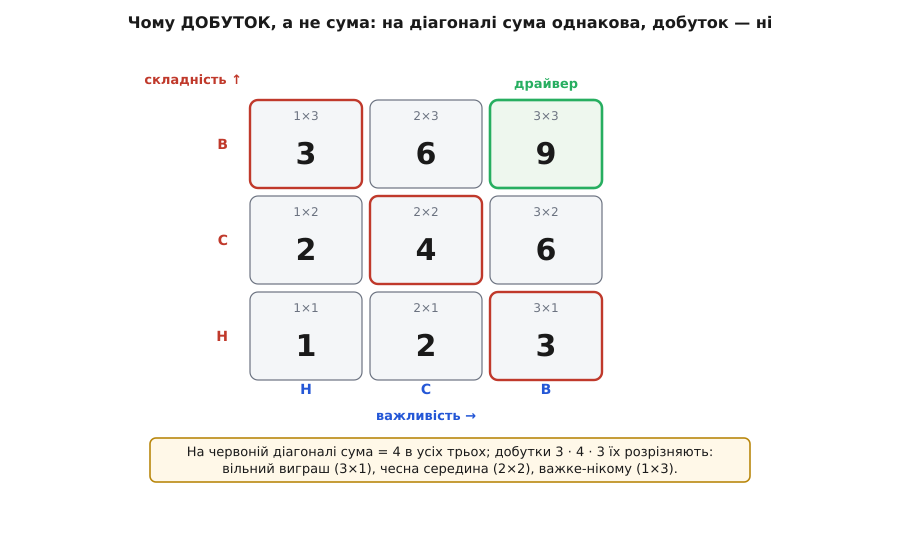
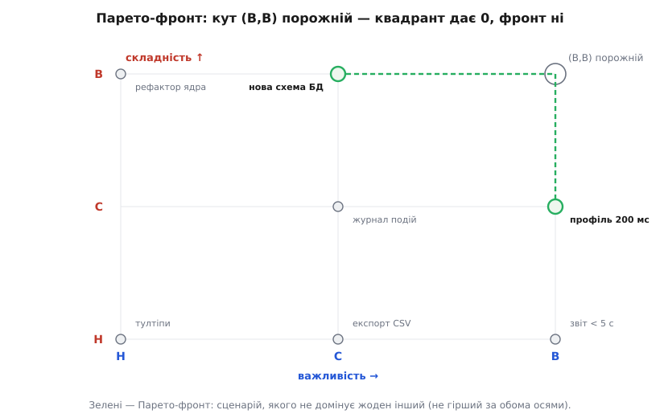

# ⚙️ Дерево корисності: зі ста сценаріїв — жменя драйверів

<preknowlist>
- [Архітектурні драйвери](root:sf-apps/architectural-drivers) — жменя сценаріїв, що справді формують структуру системи (найцінніші й найважчі водночас); саме їх цей код і має видобути з-поміж решти.
- [Якісні атрибути («-ilities»)](root:sf-apps/quality-attributes) — продуктивність, доступність, змінюваність, безпека як окремі виміри якості; у дереві це гілки, а сценарії — листя на них.
</preknowlist>

Чесно виписаний перелік сценаріїв великої системи — це сотні рядків. Кожен хтось назвав важливим, інакше б не писав. Але архітектуру не можна однаково пильно будувати навколо двохсот вимог: увага скінченна, час скінченний, а спроба вгодити всім однаково дає систему, повільну, дорогу й незрозумілу — таку, що програє в усьому. Отже, потрібна машина, яка бере купу сценаріїв і чесно, повторювано, без «перемагає найгучніший» стискає її до **жмені драйверів** — тих кількох, задля яких і тримають архітектора.

Ця машина відома й проста. Її структура даних — **дерево корисності** (*utility tree*), артефакт методу оцінювання архітектури ATAM, який у Software Engineering Institute при Університеті Карнеґі — Меллона запропонували Рік Казман, Марк Кляйн і Пол Клементс наприкінці 1990-х. Її алгоритм — двадцять рядків: сплющити, оцінити, відсортувати, відсікти. Уся інженерія — в одному нетривіальному рішенні всередині: чому оцінка сценарію є **добутком** двох чисел, а не їхньою сумою. Розберімо машину до ґвинтика, у робочому коді, і разом із пастками, через які вона тихо перестає працювати.

## Структура даних: чому саме дерево

Найпростіше було б тримати сценарії плоским списком і сортувати. Дерево дає дві речі, яких список не дає, і обидві виявляться потрібними далі.

Перша — **видимість покриття**. Дерево росте від кореня «корисність системи» до гілок-атрибутів (продуктивність, доступність, змінюваність, безпека), а вже від них — до листя-сценаріїв. Коли сценарії згруповані під атрибутами, порожня гілка кричить: «а про доступність ми не написали жодного сценарію?» У плоскому списку така діра невидима — ти просто не помічаєш того, чого немає.

Друга — **відносність оцінок**. Пріоритет листка природно судити серед його сусідів по гілці, а не в загальному казані. «Найважливіший сценарій продуктивності» — питання, на яке команда відповість; «найважливіший сценарій взагалі» — привід для бійки. Ця деталь стане рятівною, коли дійдемо до пастки інфляції оцінок.

Кожен листок несе дві позначки в трибальній шкалі **В / С / Н** (високо / середньо / низько), яку в коді кодуємо цілими **3 / 2 / 1**:

- **важливість** — наскільки сценарій цінний для успіху системи (бізнес-вартість);
- **складність** — наскільки важко досягти його архітектурно (скільки структури він вимагає, наскільки легко тут помилитися).

Кодування саме цілими 1–3, а не мітками — не косметика: воно дає осям арифметику. Добуток двох таких оцінок лежить у діапазоні 1…9, і саме на цьому діапазоні побудований відбір. Задача — загальна (обхід дерева, сортування, фільтр), тож показуємо її кількома мовами — від системної C++ до скриптових стеку.

**Умова: описати дерево корисності й наповнити його жменею сценаріїв двох-трьох атрибутів.**

:::tabs
```typescript
// Трибальна шкала: Н=1, С=2, В=3 (низько / середньо / високо).
type Rank = 1 | 2 | 3;

interface Scenario {
  title: string;
  importance: Rank;   // цінність для успіху системи
  difficulty: Rank;   // архітектурна складність досягти
}

interface Attribute {
  name: string;            // якісний атрибут — гілка дерева
  scenarios: Scenario[];   // листя цієї гілки
}

interface UtilityTree {
  root: string;            // «Корисність системи»
  attributes: Attribute[];
}

const tree: UtilityTree = {
  root: "Корисність системи",
  attributes: [
    { name: "Продуктивність", scenarios: [
      { title: "Профіль за 200 мс у пік, p95",   importance: 3, difficulty: 3 },
      { title: "Річний звіт рахується за < 5 с",  importance: 2, difficulty: 1 },
      { title: "Пошук у піку віддає за < 300 мс", importance: 3, difficulty: 2 },
    ]},
    { name: "Доступність", scenarios: [
      { title: "Переживає втрату вузла БД, перерва ≤ 30 с", importance: 3, difficulty: 3 },
      { title: "Переживає втрату дата-центру без втрати даних", importance: 3, difficulty: 3 },
      { title: "Подія в журналі не губиться", importance: 2, difficulty: 2 },
    ]},
    { name: "Змінюваність", scenarios: [
      { title: "Нова валюта за ≤ 2 дні, без правки ядра платежів", importance: 3, difficulty: 2 },
      { title: "Новий канал сповіщень за ≤ тиждень", importance: 1, difficulty: 2 },
    ]},
  ],
};
```
```python
from dataclasses import dataclass

# Трибальна шкала: Н=1, С=2, В=3 (низько / середньо / високо).

@dataclass(frozen=True)
class Scenario:
    title: str
    importance: int   # цінність для успіху системи (1..3)
    difficulty: int   # архітектурна складність досягти (1..3)

@dataclass
class Attribute:
    name: str                    # якісний атрибут — гілка дерева
    scenarios: list[Scenario]    # листя цієї гілки

@dataclass
class UtilityTree:
    root: str                    # «Корисність системи»
    attributes: list[Attribute]

tree = UtilityTree(
    root="Корисність системи",
    attributes=[
        Attribute("Продуктивність", [
            Scenario("Профіль за 200 мс у пік, p95",   importance=3, difficulty=3),
            Scenario("Річний звіт рахується за < 5 с",  importance=2, difficulty=1),
            Scenario("Пошук у піку віддає за < 300 мс", importance=3, difficulty=2),
        ]),
        Attribute("Доступність", [
            Scenario("Переживає втрату вузла БД, перерва <= 30 с", importance=3, difficulty=3),
            Scenario("Переживає втрату дата-центру без втрати даних", importance=3, difficulty=3),
            Scenario("Подія в журналі не губиться", importance=2, difficulty=2),
        ]),
        Attribute("Змінюваність", [
            Scenario("Нова валюта за <= 2 дні, без правки ядра платежів", importance=3, difficulty=2),
            Scenario("Новий канал сповіщень за <= тиждень", importance=1, difficulty=2),
        ]),
    ],
)
```
```cpp
#include <string>
#include <vector>

// Трибальна шкала: Н=1, С=2, В=3 (низько / середньо / високо).
struct Scenario {
    std::string title;
    int importance;   // цінність для успіху системи (1..3)
    int difficulty;   // архітектурна складність досягти (1..3)
};

struct Attribute {
    std::string name;                  // якісний атрибут — гілка дерева
    std::vector<Scenario> scenarios;   // листя цієї гілки
};

struct UtilityTree {
    std::string root;                  // «Корисність системи»
    std::vector<Attribute> attributes;
};

const UtilityTree tree{
    "Корисність системи",
    {
        {"Продуктивність", {
            {"Профіль за 200 мс у пік, p95",   3, 3},
            {"Річний звіт рахується за < 5 с",  2, 1},
            {"Пошук у піку віддає за < 300 мс", 3, 2},
        }},
        {"Доступність", {
            {"Переживає втрату вузла БД, перерва <= 30 с",    3, 3},
            {"Переживає втрату дата-центру без втрати даних", 3, 3},
            {"Подія в журналі не губиться",                   2, 2},
        }},
        {"Змінюваність", {
            {"Нова валюта за <= 2 дні, без правки ядра платежів", 3, 2},
            {"Новий канал сповіщень за <= тиждень",               1, 2},
        }},
    },
};
```
:::

Вісім сценаріїв, три гілки. Далі вся робота — над листям.

## Чому оцінок дві й чому їх перемножують

Ось серце машини. Драйвер за означенням — сценарій, який **і цінний, і важкий одночасно**. Не «цінний або важкий», а саме **і…і**. Це логічне «І», і вся хитрість — правильно перекласти його в число.

Погляньмо, що буває на кожному з чотирьох кутів двовимірного поля. Сценарій **важливий, але тривіальний** (В, Н) — «сторінка про нас відкривається швидко»: цінно, та його виконає будь-яке рішення, архітектуру він не формує. Це **вільний виграш**, не драйвер. Сценарій **страшенно складний, але нікому не потрібний** (Н, В) — героїчна інженерія заради того, чого ніхто не просив: теж не драйвер, бо навіщо труд. Сценарій **і важливий, і важкий** (В, В) — «переживаємо втрату дата-центру без втрати даних»: цінно **і** вимагає реплікації між регіонами, тобто формує всю систему. Ось він, драйвер. А (Н, Н) — шум, про який не варто й говорити.

Тепер спроба-приманка: оцінити сценарій **сумою** двох позначок. Вона миттєво провалюється, і провал повчальний.

```
пара (важл, склад)   сума   добуток   що це насправді
────────────────────────────────────────────────────────────────
(В, Н) = (3, 1)        4       3       вільний виграш: цінно, будь-що впорається
(С, С) = (2, 2)        4       4       чесна середина
(Н, В) = (1, 3)        4       3       важке, та нікому не потрібне
(В, В) = (3, 3)        6       9       драйвер: і цінно, і важко
```

Дивіться на перші три рядки. **Сума злітає всі три в одне число — 4**, не розрізняючи вільний виграш, чесну середину й нікому-не-потрібне-важке. А це три геть різні речі: перше нам байдуже (впорається будь-хто), третє байдуже теж (нікому не треба), і лише середнє чогось варте. Сума їх зрівняла, бо вона дозволяє **високому балу за однією віссю компенсувати провал за іншою**: величезна важливість (3) затуляє тривіальну складність (1), і разом виходить пристойна на вигляд четвірка. Це логіка «АБО», а нам потрібна «І».

Добуток компенсацію забороняє. Будь-яка вісь на дні — оцінка Н, тобто 1 — тягне добуток донизу, бо множення на одиницю не дає числу піднятися. Щоб добуток виріс, мусять піднятися **обидві** осі. Тому добуток розводить ту саму трійку на 3 · 4 · 3: чесна середина (2×2 = 4) чесно стає **вищою** за обидва перекошені краї (3×1 = 1×3 = 3), а не рівною їм. І, головне, справжній драйвер (3×3 = 9) **височіє** над усім: найближчий суперник — 6, розрив у півтора раза, чіткий і видимий. Сума ж драйвера (6) від сусіда (5) майже не відрізняє — верхівка змазана саме там, де рішення найдорожче.

*Сітка важливість × складність: на анти-діагоналі сума однакова (4), а добуток (3 · 4 · 3) розводить вільний виграш, чесну середину й важке-нікому; кут (В, В) = 9 височіє як драйвер.*


> 🔧 **Навіщо це.** Добуток важливість × складність — не випадкова формула, а знайоме з ризик-мислення **мірило наражання** (*exposure* — виставленість під удар): наскільки нам не байдуже, помножене на те, наскільки легко тут схибити. Те саме множення «ймовірність × вплив» дає [оцінку ризику](root:sf-apps/risk-thinking): драйвер — це сценарій із найбільшою величиною втрати, якщо архітектура його не втримає. Сума такого сенсу не має: ніхто не рахує ризик як «ймовірність плюс вплив».

Тут варто бути чесним про родовід. Канонічний ATAM сценарії **не перемножує** — він просто читає з дерева квадрант (В, В) і оголошує його листя драйверами. Добуток — це наше уточнення тієї самої думки: він (1) формалізує логіку «І» одним числом і (2) дає **повний порядок** там, де квадрант мовчить, — коли драйверів забагато чи замало й треба ще й ранжувати середину. У коді житимуть обидва: чіткий квадрант як тест «драйвер / не драйвер» і добуток як лінійка пріоритету.

## Алгоритм: сплющити, оцінити, відсортувати, відсікти

Тепер, коли оцінка визначена, решта — механіка. Чотири кроки. **Сплющуємо** дерево в список листя, дорогою запам'ятовуючи, з якої гілки кожен листок (щоб не втратити атрибут). **Оцінюємо** кожен листок добутком. **Сортуємо** за спаданням добутку — і тут важлива деталь: за рівних добутків треба **детермінований** тайбрейк, інакше два прогони дадуть різний порядок і рецензенти сперечатимуться про шум. Беремо спершу важливіший, потім складніший. **Відсікаємо** драйвери — крайній квадрант (В, В).

**Умова: перетворити дерево на впорядкований короткий список і виділити драйвери.**

:::tabs
```typescript
interface Ranked extends Scenario {
  attribute: string;
  score: number;      // важливість × складність
}

// Ключова ухвала — ДОБУТОК, не сума.
const score = (s: Scenario): number => s.importance * s.difficulty;

function rank(tree: UtilityTree): Ranked[] {
  const flat: Ranked[] = [];
  for (const attr of tree.attributes)
    for (const s of attr.scenarios)
      flat.push({ ...s, attribute: attr.name, score: score(s) });

  // Спад за добутком; за рівних — важливіший наперед, тоді складніший.
  // Три ключі поспіль роблять порядок цілком детермінованим.
  flat.sort((a, b) =>
    b.score - a.score ||
    b.importance - a.importance ||
    b.difficulty - a.difficulty);
  return flat;
}

// Драйвери — крайній квадрант (В, В): і найцінніше, і найважче.
const drivers = (ranked: Ranked[]): Ranked[] =>
  ranked.filter(s => s.importance === 3 && s.difficulty === 3);
```
```python
from dataclasses import dataclass

@dataclass(frozen=True)
class Ranked:
    scenario: Scenario
    attribute: str
    score: int          # важливість × складність

def score(s: Scenario) -> int:
    return s.importance * s.difficulty   # ключова ухвала — ДОБУТОК, не сума

def rank(tree: UtilityTree) -> list[Ranked]:
    flat = [Ranked(s, attr.name, score(s))
            for attr in tree.attributes
            for s in attr.scenarios]
    # Спад за добутком; за рівних — важливіший, тоді складніший (детермінізм).
    flat.sort(key=lambda r: (r.score, r.scenario.importance, r.scenario.difficulty),
              reverse=True)
    return flat

def drivers(ranked: list[Ranked]) -> list[Ranked]:
    # Крайній квадрант (В, В): і найцінніше, і найважче.
    return [r for r in ranked
            if r.scenario.importance == 3 and r.scenario.difficulty == 3]
```
```cpp
#include <algorithm>
#include <iterator>

struct Ranked {
    Scenario scenario;
    std::string attribute;
    int score;          // важливість × складність
};

// Ключова ухвала — ДОБУТОК, не сума.
int score(const Scenario& s) { return s.importance * s.difficulty; }

std::vector<Ranked> rank(const UtilityTree& tree) {
    std::vector<Ranked> flat;
    for (const auto& attr : tree.attributes)
        for (const auto& s : attr.scenarios)
            flat.push_back({s, attr.name, score(s)});

    // Спад за добутком; за рівних — важливіший наперед, тоді складніший.
    // Три ключі поспіль роблять порядок цілком детермінованим.
    std::sort(flat.begin(), flat.end(), [](const Ranked& a, const Ranked& b) {
        if (a.score != b.score) return a.score > b.score;
        if (a.scenario.importance != b.scenario.importance)
            return a.scenario.importance > b.scenario.importance;
        return a.scenario.difficulty > b.scenario.difficulty;
    });
    return flat;
}

// Драйвери — крайній квадрант (В, В): і найцінніше, і найважче.
std::vector<Ranked> drivers(const std::vector<Ranked>& ranked) {
    std::vector<Ranked> out;
    std::copy_if(ranked.begin(), ranked.end(), std::back_inserter(out),
                 [](const Ranked& r) {
                     return r.scenario.importance == 3 && r.scenario.difficulty == 3;
                 });
    return out;
}
```
:::

Проженімо нашу вісімку крізь машину. `rank` дає впорядкований список, `drivers` відсікає верхівку:

```
ранг  добуток  (важл, склад)  атрибут          сценарій
──────────────────────────────────────────────────────────────────────
 1        9        (В, В)      Продуктивність   Профіль 200 мс, p95        ◀ драйвер
 2        9        (В, В)      Доступність      Втрата вузла БД ≤ 30 с      ◀ драйвер
 3        9        (В, В)      Доступність      Втрата дата-центру          ◀ драйвер
 4        6        (В, С)      Продуктивність   Пошук у піку < 300 мс
 5        6        (В, С)      Змінюваність     Нова валюта ≤ 2 дні
 6        4        (С, С)      Доступність      Подія в журналі не губиться
 7        2        (С, Н)      Продуктивність   Річний звіт < 5 с
 8        2        (Н, С)      Змінюваність     Новий канал сповіщень
```

З восьми сценаріїв машина видала **три драйвери** — рівно ту жменю, навколо якої формують систему. Решта не зникла: вона лишилася відсортованим хвостом, довідкою на потім. І помітьте розрив між ранґом 3 (добуток 9) і ранґом 4 (добуток 6) — той самий чіткий уступ, який дає добуток і змазала б сума. Уступ і є сигналом «ось тут проходить межа драйверів».

Постає питання: якщо драйвери — це просто квадрант (В, В), навіщо взагалі сортувати весь список? Бо фільтр сам собою крихкий. Він відповідає «так / ні», але не каже, що робити, коли «так» сказали двадцять сценаріїв (забагато, щоб усі були драйверами) або жоден (порожній кут). Відсортований список — це **розгін**: коли квадрант завеликий, береш його верх; коли порожній — його верх усе одно називає найкращих кандидатів. Сортування коштує дешево, а рятує саме в некрайніх випадках, які в реальному житті трапляються частіше за чистий підручниковий.

## Парето-фронт: коли кут порожній

Крихкість квадранта варто розібрати окремо, бо на ній машина найчастіше й спотикається. Уявіть реальну сесію оцінювання, де жоден сценарій не дістав чесних (В, В): найважливіші виявилися лише середньо-складними, а найскладніші — лише середньо-важливими. Кут (3, 3) порожній. Фільтр `drivers` повертає **порожній список** — нуль драйверів, — хоча сценарії (В, С) і (С, В) явно заслуговують уваги. Машина мовчить саме тоді, коли потрібна.

Ліки — **Парето-фронт**, поняття з праці італійського економіста Вільфредо Парето (*Manuale di economia politica*, 1906). Ідея: сценарій **домінує** над іншим, якщо він не гірший за обома осями й строго кращий хоч за однією. «Кращий» тут означає «драйверніший» — більша важливість **і** більша складність (так, більша складність бажана: висока складність — це саме той важіль, через який сценарій тисне на структуру). Парето-фронт — це множина сценаріїв, яких **не домінує ніхто**: верхня оболонка поля. Вона ніколи не порожня для непорожнього входу й тому не ламається на межі, а плавно вироджується: коли кутовий (3, 3) є, вона стягується рівно до нього; коли кута немає, вона віддає зовнішній обід — (3, 2) і (2, 3), які фільтр проґавив.

**Умова: знайти сценарії, яких не домінує жоден інший (стійка заміна крихкому квадранту).**

:::tabs
```typescript
// A домінує над B: A не гірший за обома осями й строго кращий хоч за однією.
// «Кращий» = більший: більша важливість І більша складність — «драйверніший».
const dominates = (a: Scenario, b: Scenario): boolean =>
  a.importance >= b.importance && a.difficulty >= b.difficulty &&
  (a.importance > b.importance || a.difficulty > b.difficulty);

// Парето-фронт: сценарії, яких не домінує жоден інший.
function paretoFront(items: Scenario[]): Scenario[] {
  return items.filter(a => !items.some(b => dominates(b, a)));
}
```
```python
def dominates(a: Scenario, b: Scenario) -> bool:
    # A «драйверніший» за B: не гірший за обома осями й строго за однією.
    return (a.importance >= b.importance and a.difficulty >= b.difficulty
            and (a.importance > b.importance or a.difficulty > b.difficulty))

def pareto_front(items: list[Scenario]) -> list[Scenario]:
    return [a for a in items if not any(dominates(b, a) for b in items)]
```
```cpp
// A домінує над B: A не гірший за обома осями й строго кращий хоч за однією.
// «Кращий» = більший: більша важливість І більша складність — «драйверніший».
bool dominates(const Scenario& a, const Scenario& b) {
    return a.importance >= b.importance && a.difficulty >= b.difficulty &&
           (a.importance > b.importance || a.difficulty > b.difficulty);
}

// Парето-фронт: сценарії, яких не домінує жоден інший.
std::vector<Scenario> paretoFront(const std::vector<Scenario>& items) {
    std::vector<Scenario> front;
    std::copy_if(items.begin(), items.end(), std::back_inserter(front),
                 [&](const Scenario& a) {
                     return std::none_of(items.begin(), items.end(),
                         [&](const Scenario& b) { return dominates(b, a); });
                 });
    return front;
}
```
:::

*Поле важливість × складність без жодного (В, В): квадрант дав би 0 драйверів, а Парето-фронт віддає верхню оболонку — (В, С) і (С, В).*


Три лінзи доповнюють одна одну, і в зрілому пріоритезаторі варто мати всі три: **добуток** дає повний порядок і чіткий уступ; **квадрант (В, В)** — категоричний тест «драйвер», коли кут заселений; **Парето-фронт** — стійкий запасний план, що не порожніє й коректно поводиться, коли ідеального кута немає. Машина не мусить обирати одну — вона рахує три погляди на ту саму купу.

## Складність

Полічимо ціну, бо навіть двадцятирядкова машина заслуговує чесного розбору. Позначмо `n` — кількість листя-сценаріїв (не гілок: гілок жменя, а вся вага в листі).

```
сплющити дерево   O(n)         кожен листок торкаємо раз
оцінити (добуток) O(1) на лист → O(n)
відсортувати      O(n · log n) ← панівний доданок
квадрант / фільтр O(n)         один прохід
──────────────────────────────
разом             O(n · log n)
```

Панує сортування — `O(n · log n)`. Усе інше лінійне, тож саме воно задає асимптотику. Число атрибутів і глибина дерева на неї не впливають: обхід дерева коштує стільки ж, скільки листя в ньому. Пам'ять — `O(n)` на сплющений список.

Практично `n` — це сотні, зрідка тисячі; `n · log n` для тисячі — це десяток тисяч операцій, тобто мить. Сенс аналізу не в швидкодії (її тут з надлишком), а в тому, що метод **масштабується тривіально й лишається детермінованим**: подвоїш кількість сценаріїв — час майже не зміниться, а порядок на виході не «попливе» між прогонами.

Один нюанс варто назвати. Наївний Парето-фронт вище — `O(n²)`: кожен сценарій звіряється з кожним. Для сотень це так само мить, і код читабельний, тому в реальному пріоритезаторі його лишають як є. Але це єдиний надлінійний крок, і якби купа колись розрослася до десятків тисяч, його варто замінити на двовимірний Парето за `O(n · log n)`: відсортувати за важливістю спадно й пройти один раз, тримаючи максимальну бачену складність, — точка на фронті рівно тоді, коли її складність перевершує цей максимум. Свідомий вибір «наївне й ясне проти швидкого й хитрого» тут падає на боці ясного — але знати другий бік корисно.

## Пастки

Машина точна, та її легко нагодувати так, що точність стане марною. П'ять типових способів.

**Інфляція оцінок — і той самий параліч, від якого тікали.** Найпідступніша пастка. Коли кожен виставляє своєму сценарію (В, В), бо «мій же важливий і непростий», квадрант драйверів роздувається назад до майже всієї купи. Добуток тут безсилий: він чесно перемножить сорок дев'яток і поверне сорок драйверів — тобто жодного, бо **коли драйвер усе, драйвер ніщо**, і архітектуру знову тягне вгодити всім. Арифметика не рятує від нечесного входу. Рятують три звички. Перша — **відносне ранжування всередині гілки**: не «чи важливий цей сценарій продуктивності взагалі», а «важливіший він чи менш важливий за інші сценарії продуктивності»; саме заради цього дерево й групує листя за атрибутами. Друга — **бюджет драйверів**: домовитися заздалегідь, що драйверів буде, скажімо, не більш як десяток, і брати верх відсортованого списку, хоч би скільки виявилося номінальних (В, В). Третя — **вимушений розподіл**: дозволити оцінку В по важливості лише, приміром, п'ятій частині сценаріїв, щоб «високо» знову щось означало. Без однієї з цих звичок пріоритезатор перетворюється на дзеркало, що відбиває оптимізм команди, а не на сито.

**Сортувати сумою (або будь-яким компенсаторним балом).** Якщо піддатися й замінити добуток на суму, короткий список набереться з вільних виграшів (В, Н) і нікому-не-потрібного-важкого (Н, В), що затесалися поперед чесних середняків. Ти витратиш дорогу архітектурну увагу на сценарії, які або впорається будь-хто, або не треба нікому. Добуток не з естетики — він єдиний кодує «І», на якому стоїть саме поняття драйвера.

**Згорнути до одного числа й забути осі.** Спокусливо відсортувати за `score` і викинути пару (важливість, складність). Не можна: добуток 6 — це або (3, 2), або (2, 3), і це **різні** сценарії — цінний-помірно-складний проти помірного-але-важкого, що ведуть до різних архітектурних ходів. Тому `Ranked` носить осі поряд зі `score`, і квадрант дивиться на осі, а не на добуток. Число — для порядку; пара — для сенсу.

**Складність — здогад, поки немає дизайну.** Важливість команда оцінить одразу — це про бізнес. А складність — це вже архітектурне судження, і на старті, до жодного прототипу, воно часто хибне. Сценарій, що виглядав (В, С), стає (В, В), щойно розвідувальний шпичак (*spike*) покаже, де ховається справжня труднота. Тому дерево корисності — **живий** артефакт: складність переоцінюють після кожної розвідки, і драйвери можуть перетасуватися. Пріоритезатор, прогнаний раз і забутий, застаріває рівно тоді, коли система починає відкривати свої справжні важкі місця.

**Нестабільне сортування.** За рівних добутків (а дев'яток і шісток буває багато) без детермінованого тайбрейку два прогони дають різний порядок верхівки. Команда починає сперечатися про шум перестановок замість суті. Три ключі поспіль — добуток, тоді важливість, тоді складність — прибивають порядок намертво; за потреби додають четвертим ключем позицію в дереві, щоб навіть повні близнюки завжди йшли однаково.

## Що лишається в руках

Дерево корисності — це структура даних плюс функція на два десятки рядків, що перетворює купу сценаріїв на короткий список драйверів. Уся її інженерна вага зібрана в одному неочевидному рішенні: оцінка сценарію — **добуток** важливості й складності, а не сума. Добуток кодує «важливо **І** важко», відмовляє високому балу за однією віссю компенсувати провал за іншою й змушує справжній драйвер височіти над рештою чітким уступом — тим самим, який каже, де провести межу. Квадрант (В, В) дає категоричний тест, Парето-фронт — стійкий запасний план на випадок порожнього кута, а сортування — розгін для випадків «забагато» й «замало».

І остання, найтверезіша думка: машина ранжує лише те, що в неї поклали, і рівно так, як його оцінили. Жодна арифметика не врятує від інфляції оцінок чи забутої гілки — сито відсіює чесний пісок, але безсиле проти піску, назвати якого золотом. Тому пріоритезатор працює не сам по собі, а в парі з дисципліною: оцінки — відносні, дерево — живе, а бюджет драйверів названо наперед. За цих умов сотня сценаріїв справді стискається до жмені, навколо якої й будують систему.
