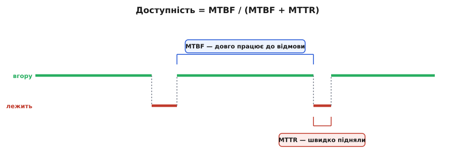
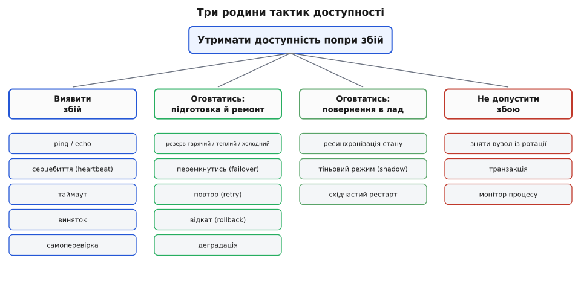
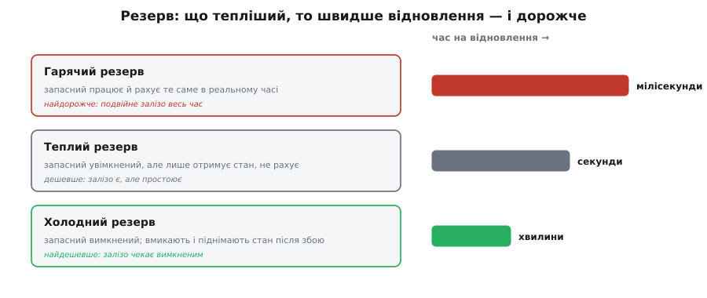

# Тактики доступності

<preknowlist>
- [Якісні атрибути («-ilities»)](topic:sf-apps/quality-attributes) — що таке нефункціональна властивість системи (доступність, продуктивність, змінюваність) і чому вона окрема від функцій.
- [Сценарії атрибутів](topic:sf-apps/attribute-scenarios) — як розмита вимога («має бути надійним») стає перевірним реченням: стимул → артефакт → реакція → **вимірна** міра.
- [Тактика проти патерна](topic:sf-apps/architectural-tactics) — тактика як одне точкове рішення на один атрибут, на відміну від патерна як готового пакета структур.
- [Trade-off-аналіз](topic:sf-apps/tradeoff-analysis) — будь-яке рішення платить одним атрибутом за інший; як цю ціну помічати.
</preknowlist>

Система, якою ніхто не може скористатися саме тоді, коли вона потрібна, — марна, хоч би якою розумною була всередині. Тому в архітектора є окрема турбота: **доступність (англ. *availability*, від лат. *valēre* — бути сильним, бути придатним, мати силу)** — властивість системи бути готовою виконати запит у ту мить, коли він приходить. І перше, що треба відчути про доступність: це не «є / нема», а **число**. Бо збої трапляються завжди — питання лише, наскільки рідко система падає й наскільки швидко підводиться.

## Доступність — це частка часу, коли система вгору

Виміряти доступність можна двома величинами. Перша — **середній час між відмовами** (англ. *Mean Time Between Failures*, MTBF): як довго система в середньому працює, поки щось не зламається. Друга — **середній час на відновлення** (англ. *Mean Time To Repair*, MTTR): як швидко її після відмови підводять назад. Тоді доступність — це просто частка життя, проведена «вгору»:

```
                    MTBF
доступність = ─────────────────
                MTBF + MTTR
```


*Доступність — частка часу вгору. Її піднімають з двох боків: рідше падати (більший MTBF) або швидше вставати (менший MTTR).*

Ця формула — не формальність, а компас. Вона показує, що доступність можна купувати **двома різними способами**, і це дві різні інженерні задачі. Можна робити систему такою, що ламається рідше (більший MTBF): дублювати вузли, прибирати єдині точки відмови. А можна робити так, щоб після падіння вона вставала швидше (менший MTTR): миттєво помічати збій і за секунди перемикатися на резерв. Часто **другий шлях дешевший**: змиритися, що зламатися колись зламається, але зробити відновлення настільки швидким, що користувач майже нічого не помітить.

Ще одну річ формула показує одразу: коли MTBF набагато більший за MTTR, доступність підповзає до одиниці, і рахунок іде на **«дев'ятки»**. 99% (дві дев'ятки) — це майже чотири доби простою на рік. 99.9% (три) — майже дев'ять годин. 99.999% (п'ять, «п'ять дев'яток») — трохи більше **п'яти хвилин на рік**. Кожна додаткова дев'ятка коштує на порядок дорожче за попередню, тому чесний [сценарій доступності](topic:sf-apps/attribute-scenarios) завжди називає **конкретну** ціль у дев'ятках, а не «щоб працювало завжди»: остання дев'ятка може вартувати більше, ніж уся система до неї.

> 🔧 **Навіщо це.** Коли замовник каже «хочу, щоб не падало ніколи», переклади це на дев'ятки й покажи ціну кожної. «Ніколи» не існує; існує «п'ять хвилин на рік за оцю суму» або «дев'ять годин на рік за вдесятеро меншу». Розмова про доступність без числа дев'яток — це розмова ні про що: не видно ні цілі, ні ціни.

## Спершу збій треба помітити: ланцюг «дефект → похибка → відмова»

Щоб узятися до доступності методично, треба спершу розібратися, **що саме** ми відбиваємо. Тут інженери надійності виробили точний словник із трьох слів, який легко сплутати, а сплутувати не можна. Його виточила міжнародна робоча група з надійних обчислень (IFIP WG 10.4) під проводом Жана-Клода Лапрі; канонічне зведення — стаття Авіженіса, Лапрі, Ренделла й Ландвера про базові поняття надійних систем ([усталене джерело термінології](topic:sf-apps/availability-tactics/hist-dependability-taxonomy.md)).

**Дефект (англ. *fault*)** — прихована причина, як-от рядок коду з помилкою чи транзистор, що ось-ось перегріється. Дефект може роками дрімати. Коли він спрацьовує, він псує стан системи — з'являється **похибка (англ. *error*)**: неправильне значення в пам'яті, зіпсований запис, зависла черга. Похибка ще всередині; користувач її не бачить. Але якщо вона доходить до межі системи й та починає віддавати не той сервіс, який обіцяла, — це вже **відмова (англ. *failure*)**: те, що видно ззовні. Дефект → похибка → відмова: причина, її прояв усередині, зрив назовні.

Цей ланцюг — не педантизм, а вказівник, **де встромити важіль**. Якщо ти вловив дефект, поки він дрімає, — відмови не буде взагалі. Якщо перехопив похибку, поки вона всередині, — не дав їй вирватися назовні. А якщо не встиг — лишається швидко оговтатись після відмови, щоб скоротити MTTR. Три місця для втручання — і саме на них лягають **три родини тактик доступності**.


*Три родини — не довільний список, а по одному ходу на кожне місце в ланцюгу: помітити збій, оговтатись від нього, не допустити його наперед.*

Ця класифікація — не самодіяльність: три родини (виявити збій, оговтатись від нього, не допустити його) і всі тактики під ними походять із канонічного дерева тактик доступності в книзі Лена Басса, Пола Клементса й Ріка Казмана *Software Architecture in Practice* (3-є вид., 2012, розділ 5) — усталене джерело, на яке спираються програми навчання архітекторів. Розберімо кожну родину — не як список для запам'ятовування, а як наслідок того, звідки береться недоступність.

## Родина перша: виявити збій

Поки ти **не знаєш**, що вузол упав, ти безсилий: не перемкнешся на резерв, бо не бачив, що пора; не повториш запит, бо не помітив, що перший пропав. Тому виявлення — корінь усього, і головна його мірка — **час до виявлення**: скільки минає від моменту, коли вузол насправді помер, до моменту, коли система це усвідомила. Кожна секунда тут прямо додається до MTTR.

Найпростіша тактика — **таймаут (англ. *time-out*)**: постав виклику межу терпіння, і якщо відповіді нема за той час — вважай, що збій стався. Без таймауту потік чекав би мертвий вузол вічно, тримаючи ресурс і не даючи оговтатись. Далі йдуть дві класичні тактики опитування живості. **ping/echo** — активна: опитувач шле сигнал і чекає відлуння; є відлуння — вузол живий, нема за таймаут — мертвий. **Серцебиття (англ. *heartbeat*)** — пасивна, дзеркальна: вузол сам, без запиту, періодично подає короткий сигнал «я живий», а монітор лише слухає; замовкло серцебиття — вважаємо, що вузол помер. Ще одна тактика — **виняток (англ. *exception*)**: сам код у місці, де виявив неможливий стан, негайно сигналить про похибку, не чекаючи, поки вона розповзеться.

Ось серцебиття в коді монітора — вузол б'ється кожні 500 мс, і якщо три удари підряд пропали, монітор оголошує його мертвим:

**Тактика «серцебиття»: помітити смерть вузла за пропущеними ударами.**
:::tabs
```cpp
// Монітор слухає удари від вузла. Три пропущені підряд = вузол мертвий.
// Тактика купує ВИЯВЛЕННЯ (дізнаємось про смерть за ~1.5 с, а не від
// розлюченого користувача), але платить ТРАФІКОМ і РИЗИКОМ хибної тривоги.
constexpr uint32_t BEAT_PERIOD_MS = 500;   // як часто вузол має битися
constexpr int      MISS_LIMIT     = 3;     // скільки пропусків терпимо до вироку

struct Monitor {
    uint32_t last_beat_ms = 0;  // коли прийшов останній удар
    int      missed       = 0;  // скільки періодів поспіль тиша
    bool     alive        = true;  // наш поточний присуд про вузол
};

// Викликається раз на BEAT_PERIOD_MS з таймера монітора.
void monitor_tick(Monitor &m, uint32_t now_ms) {
    if (now_ms - m.last_beat_ms < BEAT_PERIOD_MS)
        return;                            // удар устиг — усе гаразд

    m.missed++;                            // період минув, а удару не було
    if (m.missed >= MISS_LIMIT && m.alive) {
        m.alive = false;                   // вирок: вузол мертвий
        on_node_down();                    // штовхаємо родину оговтання
    }
}

// Викликається, коли фізично прийшов удар від вузла.
void monitor_on_beat(Monitor &m, uint32_t now_ms) {
    m.last_beat_ms = now_ms;
    m.missed = 0;                          // тиша скинута — вузол живий
    m.alive = true;
}
```
```python
# Монітор слухає удари від вузла. Три пропущені підряд = вузол мертвий.
# Тактика купує ВИЯВЛЕННЯ (дізнаємось про смерть за ~1.5 с, а не від
# розлюченого користувача), але платить ТРАФІКОМ і РИЗИКОМ хибної тривоги.
BEAT_PERIOD_MS = 500   # як часто вузол має битися
MISS_LIMIT     = 3     # скільки пропусків терпимо до вироку


class Monitor:
    def __init__(self):
        self.last_beat_ms = 0     # коли прийшов останній удар
        self.missed = 0           # скільки періодів поспіль тиша
        self.alive = True         # наш поточний присуд про вузол


# Викликається раз на BEAT_PERIOD_MS з таймера монітора.
def monitor_tick(m, now_ms):
    if now_ms - m.last_beat_ms < BEAT_PERIOD_MS:
        return                    # удар устиг — усе гаразд

    m.missed += 1                 # період минув, а удару не було
    if m.missed >= MISS_LIMIT and m.alive:
        m.alive = False           # вирок: вузол мертвий
        on_node_down()            # штовхаємо родину оговтання


# Викликається, коли фізично прийшов удар від вузла.
def monitor_on_beat(m, now_ms):
    m.last_beat_ms = now_ms
    m.missed = 0                  # тиша скинута — вузол живий
    m.alive = True
```
:::

Тут одразу видно компроміс, зашитий у число `MISS_LIMIT`. Постав його малим (терпимо один пропуск) — виявлятимеш смерть швидко, але через будь-яке моргання мережі оголосиш живий вузол мертвим і дарма перемкнешся: **хибна тривога**. Постав великим — хибних тривог менше, але справжню смерть помітиш пізно, і MTTR виросте. Це і є жива архітектурна робота: `MISS_LIMIT` не «правильне» саме по собі — воно наслідок сценарію, який каже, за скільки секунд смерть має бути помічена і скільки хибних перемикань на добу ми стерпимо.

> 🔧 **Навіщо це.** Порогом `MISS_LIMIT` ти прямо крутиш ручку «швидкість виявлення проти хибних тривог». Немає значення, добра воно чи погана в порожнечі — є лише «добре для цього сценарію». Саме тому виявлення не можна «просто ввімкнути»: його треба **налаштувати під ціль** і потім **виміряти** на реальному трафіку, бо занадто чутливий монітор шкодить доступності не менше, ніж сліпий.

## Родина друга: оговтатись від збою

Помітили — тепер треба **вижити**. Ця родина найбільша, бо способів оговтатись багато, і канон ділить її надвоє: спершу **підготуватись і полагодити** (як пережити сам збій), а тоді **повернути в лад** уцілілий вузол (як безпечно ввести назад того, хто був упав).

Серце підготовки — **надлишок (англ. *redundancy*)**: тримай запасний вузол, готовий підхопити роботу, коли головний помре. Але «готовий» буває різного ступеня, і тут ховається важливий компроміс між ціною й швидкістю відновлення.


*Що «тепліший» резерв, то швидше він підхоплює — і то дорожче обходиться. Гарячий дає мілісекунди ціною подвійного заліза, холодний — хвилини ціною майже задарма.*

**Гарячий резерв (англ. *active redundancy*)** — запасний працює паралельно й обробляє ті самі вхідні дані, що й головний, тримаючи свій стан день у день синхронним. Помер головний — запасний уже готовий, перемикання займає мілісекунди. Ціна найвища: подвійне залізо весь час зайняте однією роботою. **Теплий резерв (англ. *passive redundancy*)** — запасний увімкнений і **отримує** свіжий стан від головного, але сам роботу не виконує; підхоплення займає секунди (треба ще ввімкнутись у роботу). Дешевше, бо запасний майже простоює. **Холодний резерв (англ. *spare*)** — запасний вимкнений; після смерті головного його вмикають, піднімають стан і лише тоді пускають у діло — це хвилини. Найдешевше, бо залізо чекає вимкненим.

Сам момент, коли роботу віддають від мертвого головного до живого запасного, називають **перемиканням (англ. *failover*)**. Це найтонше місце всієї родини, бо тут легко влаштувати катастрофу: якщо монітор помилково вирішив, що головний мертвий (а той лише завис на мить), і підняв запасний — на світі стане **два** вузли, що вважають себе головними, обидва пишуть у базу й псують дані. Це **розкол мозку (англ. *split-brain*)**, класична пастка перемикання, яку треба гасити окремо. Повний робочий каркас «серцебиття + перемикання» з усіма пастками — розколом мозку й «ляпанням» (коли вузол смикається туди-сюди на межі порога) — розібрано в [окремому проєкті](topic:sf-apps/availability-tactics/proj-failover-with-heartbeat.md).

Крім надлишку, у цій родині є ходи, що не тримають другого вузла. **Повтор (англ. *retry*)** — просто пробуємо невдалий виклик ще раз, бо збій міг бути миттєвим (докладний розбір компромісів повтору — ідемпотентність, лавина, затримка — у статті про [тактику проти патерна](topic:sf-apps/architectural-tactics)). **Відкат (англ. *rollback*)** — повертаємо систему до останнього завідомо доброго стану, збереженого наперед (**контрольної точки**, англ. *checkpoint*), і починаємо від нього. **Деградація (англ. *graceful degradation*)** — коли частина системи впала, свідомо вимикаємо другорядне, аби живим лишилося головне: не можеш показати рекомендації — покажи хоч кошик; головне, щоб замовлення оформлялося.

Друга половина родини — **повернути в лад** того, хто оговтався. Коли впалий вузол полагодили й хочуть повернути в роботу, його не можна просто вмикати «в бій»: його стан застарів, поки він лежав. Тактика **ресинхронізації стану (англ. *state resynchronization*)** спершу підтягує йому свіжий стан від того, хто працював увесь цей час. Обережніший хід — **тіньовий режим (англ. *shadow mode*)**: повернутий вузол якийсь час працює «в тіні» (отримує реальні запити, рахує відповіді, але їх нікуди не віддають), і лише коли видно, що він рахує правильно, його пускають у справжню роботу. А **східчастий рестарт (англ. *escalating restart*)** відновлює якнайдрібнішою дією: спершу перезапусти лише впалий потік; не помогло — цілий процес; аж потім, як край, весь вузол — щоб не рубати з плеча там, де вистачило б малого.

## Родина третя: не допустити збою

Найдешевша відмова — та, якої не сталося. Ця родина втручається **до** збою: прибирає дефект, поки він ще дрімає, або не дає похибці народитися. Мірка тут — знову MTBF: кожен відвернений збій робить проміжки між відмовами довшими.

**Зняти вузол із ротації (англ. *removal from service*)** — якщо вузол поводиться підозріло (росте пам'ять, частішають дрібні помилки), його свідомо виводять із роботи й перезапускають **наперед**, поки він не впав сам у найгіршу мить. Класичний приклад — плановий нічний перезапуск, що скидає накопичені за день витоки пам'яті, доки їх мало. **Транзакція (англ. *transaction*)** не дає народитися пошкодженому стану: група дій виконується за принципом «усе або нічого», тож збій посеред неї не лишає систему в напівзміненому, зіпсованому стані — вона відкочується, ніби нічого й не було. **Монітор процесу (англ. *process monitor*)** — окремий сторож, що стежить за самим процесом і, помітивши, що той завис чи зжер забагато, гасить його й підіймає наново, не чекаючи повної відмови.

Усі три ходи мають спільну рису: вони жертвують дрібним **зараз**, щоб не отримати велике **потім**. Плановий рестарт — це маленький керований простій замість раптового падіння в пікову годину. Транзакція — трохи повільніший запис замість ризику зіпсувати дані. У цьому й суть запобігання: маленька відома ціна проти великої невідомої.

## Кожна тактика має ціну — тому це рішення, а не догма

І тут — головне, без чого тактики доступності перетворюються на карго-культ. **Жодна не безкоштовна.** Це саме той компроміс, який ловить [trade-off-аналіз](topic:sf-apps/tradeoff-analysis): піднімаючи доступність, ти майже завжди чимось платиш — і ця плата мусить бути названа й прийнята свідомо.

Подивись, чим платить кожна родина. **Виявлення** платить трафіком (серцебиття й ping/echo безперервно шлють службові пакети) і, головне, ризиком хибної тривоги, яка сама валить доступність дарма. **Оговтання через надлишок** платить прямими грішми — гарячий резерв подвоює залізо, — а перемикання тягне за собою розкол мозку й ляпання, які треба гасити окремою механікою. **Запобігання** платить дрібними плановими простоями й повільнішими транзакціями. А ще майже всі ці тактики точаться об **продуктивність** і **простоту**: кожен зайвий вузол, монітор і шар синхронізації — це те, що хтось має написати, тестувати й супроводжувати, і кожен додає системі рухомих частин, які самі можуть зламатися.

Тому тактику доступності ставлять не «щоб було надійніше взагалі», а під **записаний сценарій**: «коли головний вузол платежів помирає, система перемикається на резерв і втрачає не більше 2 секунд запитів, не більше одного разу на добу хибно». Такий сценарій одразу підказує і родину (виявлення серцебиттям + гарячий резерв із перемиканням), і міру успіху (перемкнутись за 2 секунди), і межу ціни (не більше однієї хибної тривоги на добу — отже поріг монітора не можна робити надто чутливим). Без числа дев'яток і без сценарію будь-яка з цих тактик — просто дорога прикраса: ти платиш грішми, трафіком і складністю за надійність, якої, може, ніхто й не потребував саме тут.

Ось як три родини складаються в один хід думки. Прийшла вимога доступності — спитай про неї три речі, за ланцюгом «дефект → похибка → відмова». Чи ми взагалі **помітимо** збій — і за скільки секунд? — постав таймаут, серцебиття, налаштуй поріг під ціль. Що робити, коли він **уже стався**? — обери резерв рівно настільки гарячий, наскільки вимагає дозволений MTTR, і безпечно перемкнись. І чи можна було збою **не допустити** наперед? — зніми підозрілий вузол, загорни небезпечне в транзакцію. А тоді, над кожним обраним ходом, — назви ціну й перевір її на сценарії. Доступність — не про те, щоб нічого ніколи не ламалося; вона про те, щоб система **вставала швидше, ніж користувач устигає помітити**, і щоб кожна дев'ятка, за яку ти заплатив, справді комусь була потрібна.
