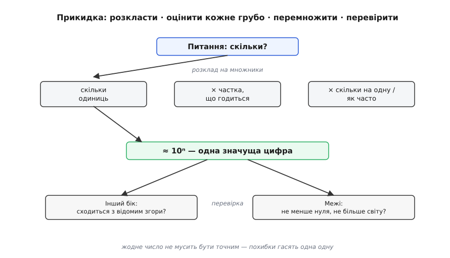
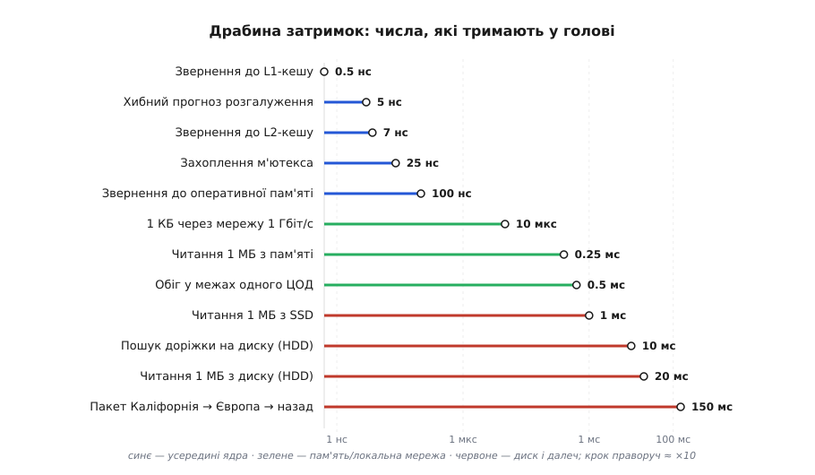
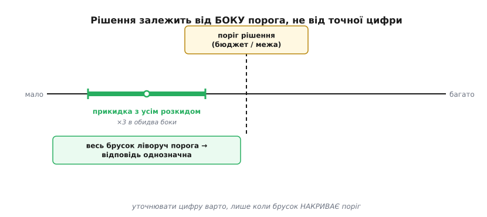

# Прикидка «на серветці»

<preknowlist>
- [Наукова та інженерна нотація](topic:math-numeric/scientific-notation) — записувати число як 10ⁿ і вільно перемножувати порядки величини (10³ · 10⁶ = 10⁹).
- [Кеш](topic:hw-arch/cache) — чому звернення до різних рівнів пам'яті коштують у тисячі разів по-різному; без цього не відчути «драбину затримок».
</preknowlist>

Уявіть суперечку на планерці. Хтось каже: «А давайте на кожен запит користувача ходити в базу — там же лічені мілісекунди». Ви можете сперечатися смаком і досвідом, а можете за півхвилини на клапті паперу прикинути: мільйон користувачів, кожен робить десяток дій за сеанс, кожна дія — п'ять походів у базу, база на іншому кінці дата-центру. Помножили — і виходить, що ваша «лічені мілісекунди» перетворюється на затримку, за якої сторінка думає секунду. Рішення ухвалене, і не смаком, а числом, яке будь-хто поруч може перевірити на тому ж папірці.

Оце і є **прикидка «на серветці»** (англ. *back-of-the-envelope calculation* — «обчислення на звороті конверта»): груба оцінка величини за кілька рядків, зроблена **до** того, як писати код, купувати залізо чи сперечатися годину. Назва буквальна — так робили інженери й фізики, коли поруч не було нічого, крім конверта від листа. Батько жанру — фізик [Енріко Фермі](topic:sf-apps/back-of-envelope/hist-fermi.md), який умів вражаюче точно оцінювати величини майже без даних; його ім'ям і звуть цілий клас таких задач.

Мета — не точна цифра. Мета — за хвилину відповісти на питання, від якого залежить рішення: **це взагалі можливо? це в тисячу разів більше за бюджет чи в тисячу разів менше? нам потрібен один сервер чи тисяча?** Архітектору це найдешевший інструмент з усіх: він коштує півхвилини, а рятує тижні праці, витраченої не в той бік.

> 🔧 **Навіщо це.** Найдорожча помилка в архітектурі — побудувати не те, і зрозуміти це через півроку. Прикидка ловить таку помилку **до** першого рядка коду: якщо груба оцінка каже, що задум вимагає в сто разів більше пам'яті, ніж є в машині, ви дізнаєтеся про це за півхвилини, а не за квартал.

## Чому груба оцінка взагалі працює

Здоровий глузд опирається: як можна довіряти числу, зібраному з відвертих здогадів? Відповідь — у тому, як **гасяться похибки**. Ви розкладаєте велике незнане на кілька менших множників, і кожен окремо оцінюєте грубо — «десь так». Одні ваші здогади вийдуть завеликими, інші — замалими, і при перемноженні вони тягнуть результат у різні боки й почасти взаємно скорочуються. Тому добуток десятка грубих оцінок зазвичай точніший, ніж будь-яка з них поодинці.

Ключова домовленість жанру: ми ловимо **порядок величини** — саму цифру перед нулями, а не решту. Нас цікавить, це «близько тисячі» чи «близько мільйона», бо архітектурні рішення різняться саме на порядках. Чи вийшло 3·10⁶ чи 7·10⁶ — байдуже: обидва означають «мільйони, один сервер не потягне». А от різниця між 10⁶ і 10⁹ — це різниця між ноутбуком і кластером. Тому в прикидці лишають **одну значущу цифру** й округлюють нещадно: π — це 3, рік — це 3·10⁷ секунд, «майже всі» — це 1, «мало хто» — це 0.1.


*Анатомія прикидки. Питання «скільки?» розкладають на кілька множників, кожен з яких оцінити грубо простіше, ніж ціле: скільки одиниць · яка частка з них годиться · скільки припадає на одну. Порядки перемножують і лишають одну значущу цифру (≈ 10ⁿ). Далі — обов'язкова перевірка здоровим глуздом двома шляхами: підійти з іншого боку (чи сходиться з чимось відомим згори) і перевірити межі (відповідь не буває від'ємною чи більшою за цілий світ). Похибки окремих множників тягнуть у різні боки й почасти гасять одна одну — тому добуток надійніший за будь-який окремий здогад.*

Класичний приклад Фермі, яким він мучив студентів у Чикаго: **скільки в місті настроювачів піаніно?** Прямих даних нема, але розкласти можна. Місто — близько 3 мільйонів людей, тобто десь мільйон помешкань. Піаніно є, скажімо, в кожній двадцятій родині — це 50 тисяч інструментів. Кожне настроюють раз на рік. Один настроювач за день робить чотири настройки, працює 250 днів — тисяча настройок на рік. Отже, 50 000 / 1000 ≈ **50 настроювачів**. Жоден множник не був точний, а відповідь виходить на диво близькою до реальності — і, головне, тепер ви знаєте, що їх десятки, а не одиниці й не тисячі.

## Числа, які тримають у голові

Прикидка добра рівно настільки, наскільки добрі ваші вхідні величини. Тому інженер тримає в голові невеликий набір **опорних чисел** — таких, що самі по собі важко піддаються здогаду, а без них не порахуєш нічого. Рік — це π·10⁷ секунд. У дні — 86 400 секунд. Сторінка тексту — кілобайти, фото — мегабайти, фільм — гігабайти. А для архітектора програм найважливіший набір — **затримки операцій**: скільки часу коштує звернутися до кешу, до пам'яті, до диска, до мережі.

Ці числа зібрав і популяризував інженер Google Джеф Дін (спираючись на давнішу добірку Пітера Норвіга) під назвою «Числа, які має знати кожен» (*Numbers Everyone Should Know*). Вони не про конкретне залізо — вони про **співвідношення порядків**, яке тримається роками, хоч абсолютні значення й повзуть.


*Драбина затримок (порядки за добіркою Діна/Норвіга, ~2012). Звернення до L1-кешу — 0.5 нс; до оперативної пам'яті — 100 нс, тобто у 200 разів довше; обіг у межах одного дата-центру — 0.5 мс; пошук доріжки на обертовому диску — 10 мс; пакет через океан і назад — 150 мс. Від верху до низу — вісім порядків: та сама різниця, що між секундою й трьома роками. Головне не абсолютні цифри (вони застарівають), а **розриви між рівнями**: пам'ять у сотні разів дорожча за кеш, мережа — у тисячі разів дорожча за пам'ять, диск і далеч — ще на порядки далі.*

Саме розриви на цій драбині й ухвалюють архітектурні рішення. Чому кеш узагалі рятує? Бо пропущене звернення до пам'яті коштує в двісті разів дорожче за влучення в кеш. Чому «просто сходити ще раз у базу» на іншому континенті — погана думка в циклі? Бо 150 мс на обіг — це вічність поруч зі 100 нс на звернення до локальної пам'яті: різниця в мільйон разів. Тримаючи цю драбину в голові, ви миттєво чуєте фальш у фразі «та це ж швидко» — і можете перевірити її числом.

**Приклад: чи встигнемо обробити відеопотік?** Камера дає 1080p, 30 кадрів на секунду. Питання архітектора: чи можна обробляти кожен кадр на льоту, чи треба буферизувати й губити кадри?

:::tabs
```c
// Один кадр 1080p: ширина × висота × 3 байти (RGB)
#define W 1920
#define H 1080
size_t frame_bytes = (size_t)W * H * 3;      // ≈ 6.2 · 10⁶ байтів ≈ 6 МБ
double fps         = 30.0;
double budget_ms   = 1000.0 / fps;           // 33 мс на кадр

// Наш алгоритм торкається кожного пікселя кілька разів — читаємо кадр із пам'яті.
// Читання 1 МБ з пам'яті ≈ 0.25 мс (з драбини затримок), тож 6 МБ ≈ 1.5 мс.
double mem_read_ms = 6.0 * 0.25;             // ≈ 1.5 мс на прохід
```
```python
# Один кадр 1080p: ширина × висота × 3 байти (RGB)
W = 1920
H = 1080
frame_bytes = W * H * 3          # ≈ 6.2 · 10⁶ байтів ≈ 6 МБ
fps         = 30.0
budget_ms   = 1000.0 / fps       # 33 мс на кадр

# Наш алгоритм торкається кожного пікселя кілька разів — читаємо кадр із пам'яті.
# Читання 1 МБ з пам'яті ≈ 0.25 мс (з драбини затримок), тож 6 МБ ≈ 1.5 мс.
mem_read_ms = 6.0 * 0.25         # ≈ 1.5 мс на прохід
```
:::

Півтори мілісекунди на прохід проти бюджету в 33 мс — запас у двадцять разів. Отже, послідовний алгоритм у кілька проходів по пам'яті встигне легко; вузьким місцем буде не пам'ять, а сам алгоритм, якщо він на піксель робить щось важче за арифметику. А якби той самий кадр довелося щоразу **читати з диска** (20 мс на мегабайт), 6 МБ забрали б 120 мс — і потік на 30 кадрів став би неможливим без буфера. Прикидка за п'ять рядків показала, де межа.

> 🔧 **Навіщо це.** Коли постачальник обіцяє «обробку в реальному часі», ви маєте за хвилину перевірити обіцянку його ж числами: узяти обсяг даних на такт, поділити на бюджет часу, звірити з драбиною затримок. Якщо не сходиться на порядок — обіцянка порожня, і це видно **до** підписання контракту.

## Точність не потрібна — потрібен бік від порога

Тут ховається головна причина, чому груба прикидка **достатня**, а не «краще, ніж нічого». Майже кожне архітектурне питання насправді бінарне: **вистачить чи ні? влізе чи ні? один сервер чи багато?** Є **поріг** — бюджет пам'яті, ліміт затримки, вартість на місяць, — і рішення залежить лише від того, з якого **боку** порога лежить ваша оцінка. А щоб упевнено назвати бік, точна цифра не потрібна.


*Рішення залежить від боку порога. Прикидка дає не точку, а брусок — діапазон із усім розкидом невизначеності (тут ×3 в обидва боки). Якщо весь брусок лежить по один бік порога рішення, відповідь однозначна, хоч точної цифри ви й не знаєте: «влазить із запасом» або «не влазить нізащо». Уточнювати число до другої-третьої значущої цифри варто **лише тоді**, коли брусок накриває поріг — тобто коли розкид не дає впевнено назвати бік. У решті випадків це змарнований час.*

Це і є критерій, коли зупинятися. Порахували, вийшло, що задум просить 4 ГБ, а в машині — 512 МБ: брусок цілком праворуч порога, навіть якщо ви помилилися втричі — не влазить, крапка, задум треба міняти. Порахували інакше — виходить 20 МБ проти тих самих 512: цілком ліворуч, влазить із величезним запасом, більше рахувати нічого. І лише коли вийшло, скажімо, 400 МБ проти 512 — ось тоді груба прикидка вичерпалася: розкид накриває поріг, і треба або точніший розрахунок, або вимір на реальних даних. Груба оцінка не замінює виміру — вона каже, **чи варто взагалі за вимір братися**.

**Приклад: помістити індекс у пам'ять?** Проектуємо пошук по 50 мільйонах записів. Спокуса — тримати індекс цілком в оперативній пам'яті заради швидкості. Питання: скільки він важить і чи це реально?

:::tabs
```c
uint64_t records   = 50000000ULL;        // 50 млн записів
uint64_t key_bytes = 16;                  // ключ ≈ 16 байтів
uint64_t ptr_bytes = 8;                   // покажчик на запис
uint64_t overhead  = 2;                   // грубий коефіцієнт на структуру (×2)

uint64_t index_bytes = records * (key_bytes + ptr_bytes) * overhead;
// = 5·10⁷ · 24 · 2 = 2.4·10⁹ байтів ≈ 2.4 ГБ
```
```python
records   = 50_000_000        # 50 млн записів
key_bytes = 16                # ключ ≈ 16 байтів
ptr_bytes = 8                 # покажчик на запис
overhead  = 2                 # грубий коефіцієнт на структуру (×2)

index_bytes = records * (key_bytes + ptr_bytes) * overhead
# = 5·10⁷ · 24 · 2 = 2.4·10⁹ байтів ≈ 2.4 ГБ
```
:::

Приблизно 2.4 гігабайти. Тепер бік від порога очевидний: на сервері з 64 ГБ пам'яті це дрібниця — тримаємо в пам'яті, не думаючи. На вбудованому пристрої з 256 МБ — і мріяти нема про що, потрібна зовсім інша схема (індекс на диску, дерево з підкачуванням сторінок). Той самий задум, а рішення протилежні — і прикидка розводить їх за півхвилини, без жодного прототипу. Коефіцієнт `overhead ×2` тут навмисно грубий: навіть якби структура давала не подвоєння, а вчетверо, це 4.8 ГБ — усе одно дрібниця проти 64 ГБ і безнадія проти 256 МБ. Бік від порога не змінюється, тож точнити коефіцієнт немає сенсу.

## Дисципліна оцінки: як не збрехати собі

Груба не означає недбала. У прикидки є свої правила гігієни, без яких вона перетворюється на самообман.

**Стежте за одиницями.** Найчастіша помилка — не в множенні, а в тому, що переплутали біти з байтами чи мілісекунди з мікросекундами, і відповідь поїхала на три порядки. Дописуйте одиниці до кожного числа й скорочуйте їх, як у фізиці: якщо після скорочення лишилися не ті одиниці, десь помилка в самій постановці.

**Перевіряйте з іншого боку.** Добра оцінка робиться двічі, різними шляхами, і збігається за порядком. Порахували обсяг трафіку «згори» (користувачі × запити) — перевірте «знизу» (пропускна здатність каналу × час). Якщо два незалежні підходи дали той самий порядок — оцінці можна вірити; якщо розійшлися в сто разів — одна з ваших моделей хибна, і це сигнал шукати помилку, а не всереднювати два неправильні числа.

**Перевіряйте межі.** Відповідь не буває від'ємною, не буває більшою за цілий світ. Якщо прикидка каже, що серверу треба обслуговувати більше запитів, ніж людей на планеті, — ви десь помилилися на порядок. Грубе відчуття «а це взагалі схоже на правду?» ловить більшість арифметичних зривів.

**Записуйте припущення поруч із числом.** Оцінка «10 серверів» нічого не варта без рядка «за умови 1000 запитів на секунду й 50 мс на запит». Записані припущення роблять прикидку **чесною**: коли реальність зміниться (навантаження зросте вдесятеро), ви одразу побачите, яке число перерахувати, а не почнете з нуля. Це та сама причина, чому прикидку варто лишати в тексті рішення, а не викидати папірець: [запис архітектурного рішення](topic:sf-apps/back-of-envelope/proj-estimation-record.md) з його числами й припущеннями — це те, до чого команда повертається, коли через рік хтось питає «а чому ми тоді обрали саме так».

> 🔧 **Навіщо це.** Записана прикидка з припущеннями — це запобіжник проти найгіршого сценарію: рішення ухвалили за числом, число застаріло, а всі про це забули. Коли припущення лежать поруч із висновком, будь-хто за рік бачить, що умова «1000 запитів на секунду» вже не тримається, — і знає, що саме перерахувати, замість наосліп перебудовувати систему.

Прикидка «на серветці» — це не про математичну майстерність, а про **звичку рахувати замість вірити на слово**. Вона нічого не доводить остаточно й нічого не замінює з точних вимірів. Але вона робить головне для архітектора: за півхвилини й кілька рядків показує, куди варто вкладати тижні, а куди — точно ні. Найдорожчі рішення в архітектурі ухвалюються рано, коли даних найменше; саме тоді вміння прикинути порядок величини на клапті паперу коштує дорожче за будь-який інструмент.
