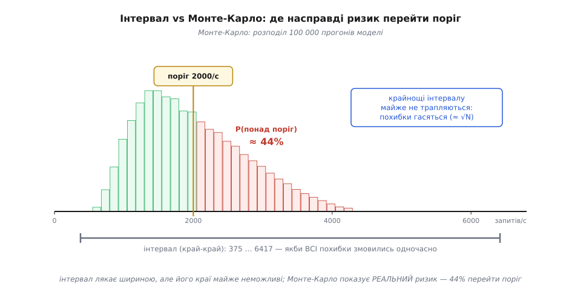
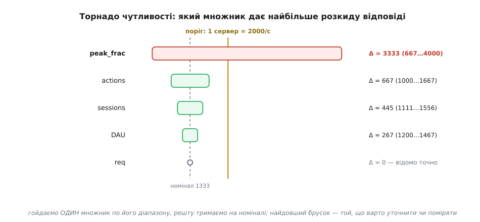

# ⚙️ Аналіз чутливості: що уточнювати першим

Прикидка ніколи не складається з точних чисел — кожен множник у ній це здогад із діапазоном. Здебільшого діапазони не мають значення: добуток лягає так далеко від порога рішення, що навіть найгірше поєднання здогадів лишається по один бік, і ви впевнено вирішуєте. Але інколи діапазон **накриває** поріг. Ось тоді прикидка вичерпалась, і звична порада — «піди поміряй». Поміряй **що**? У вас п'ять припущень, кожне взяте зі стелі. Поміряти всі п'ять — це тиждень збору статистики й навантажувальний тест, тобто рівно та дорога робота, від якої прикидка мала врятувати.

Справжнє питання інше. Не «поміряти все», а: **яке одне припущення тримає майже весь розкид відповіді?** Якщо діапазон одного множника пояснює майже всю невизначеність результату, то, притиснувши саме це число, ви обвалюєте невизначеність цілком — а решта чотири вже не важать. Виміряти той єдиний потрібний множник часто можна за півдня, і його одного досить, щоб перекинути рішення на впевнений бік. Знайти цей множник — і є робота **аналізу чутливості** (англ. *sensitivity analysis*), і вона дешева: жодних нових даних, лише той самий добуток, прогнаний із діапазонами замість точок. Цю вставку присвячено робочому інструменту, що таку прогонку робить.

> 🔧 **Навіщо це.** Коли оцінка накриває поріг, вибір здається бінарним: угадати (нечесно) або поміряти все (дорого). Аналіз чутливості додає третій, дешевий хід — обчислити, яке саме одне припущення варто піти поміряти. Часто той єдиний вимір вирішує все питання; інструмент каже, який множник це буде, **до** того, як ви згаяли день не на той.

## Задача: діапазони замість точок

Візьмімо конкретне рішення. Сервіс росте, і питання: **чи вистачить одного сервера на піковий трафік, чи вже треба два й балансувальник?** Пікове навантаження розкладається на множники так само, як будь-яка прикидка:

```
запитів у пікову секунду = DAU · сеанси · дії · запити_на_дію · частка_в_пік / 3600
```

де `DAU` — активні за добу, `частка_в_пік` — яка доля добового трафіку припадає на найзавантаженішу годину. Підставте номінали — «найімовірніші» значення — і вийде заспокійлива цифра:

```
200 000 · 3 · 20 · 4 · 0.10 / 3600 ≈ 1333 запити/с
```

Поріг одного сервера — хай `2000` запитів/с (стільки він тягне, поки завантаження не заганяє чергу за коліно). 1333 проти 2000 — влазить із запасом ×1.5. Здається, питання закрите. Але кожен множник тут — діапазон, не точка:

| множник | номінал | діапазон | звідки такий діапазон |
|---|---|---|---|
| `DAU` | 200 000 | 180 000 … 220 000 | аналітика за місяць, вузько |
| `sessions` | 3 | 2.5 … 3.5 | сеансів на користувача за добу |
| `actions` | 20 | 15 … 25 | дій за сеанс |
| `req` | 4 | 4 … 4 | запитів на дію — **фіксовано дизайном API** |
| `peak_frac` | 0.10 | 0.05 … 0.30 | частка в пік. годину — **ми її не міряли** |

Придивіться до останнього рядка. Частку в пікову годину ніхто не вимірював: трафік може бути рівним (0.05) або дуже колючим (0.30) — діапазон у шість разів. А `req` навпаки відомий точно: він зашитий у дизайн. Питання: чи переживе висновок «влазить» ці діапазони — і якщо ні, який множник за це відповідає?

## Ідея: три лінзи на той самий добуток

Один і той самий добуток можна прогнати трьома способами, що дають дедалі більше. Кожен варто розуміти від причини.

**Інтервальна арифметика — крайні кути.** Найдешевша лінза: узяти для кожного множника лише кінці діапазону й порахувати найменший і найбільший можливий добуток. Для добутку **додатних** діапазонів це тривіально: результат монотонний за кожним множником (більший множник — більший добуток, завжди в один бік), тож мінімум дає поєднання всіх нижніх кінців, максимум — усіх верхніх. Це прямо втілює правило порога: якщо весь відрізок `[мін, макс]` лежить по один бік — вирішуйте й спиняйтесь; якщо накриває поріг — прикидка вичерпалась. Але треба чесно бачити ваду: інтервал — це **цілком корельований найгірший випадок**, він припускає, що всі множники схибили в один бік **одночасно**. Така змова здогадів майже не трапляється — незалежні відхилення тягнуть урізнобіч і почасти гасяться. Тому широкий інтервал, що накриває поріг, ще не означає, що рішення справді «п'ятдесят на п'ятдесят».

**Монте-Карло — розподіл.** Друга лінза бачить не кути, а **форму**. Тягнемо кожен множник із правдоподібного розподілу (трикутного: нижній кінець, найімовірніший номінал, верхній кінець), рахуємо добуток — і повторюємо десятки тисяч разів. Тепер видно не «від 375 до 6417», а де відповідь **насправді** купчиться. Крайнощі інтервалу виявляються майже неможливими, а маса горнеться до середини. Чому так? Бо сума багатьох незалежних дрібних відхилень тим щільніше збирається навколо середнього, чим доданків більше — це [центральна гранична теорема](topic:math-probability/central-limit): додаючи незалежні промахи, ви отримуєте вузький дзвін, а не рівномірну ковдру від краю до краю. І головне — Монте-Карло дає число, якого не дасть жодна точкова оцінка: **ймовірність перейти поріг**, тобто ризик, що одного сервера не вистачить.

**Торнадо — ранжування.** Третя лінза відповідає на питання «що міряти». Для кожного множника заморозьте решту на номіналі й **гойдніть лише його** по всьому діапазону — подивіться, наскільки зрушиться відповідь. Відсортуйте ці розмахи, найдовший згори: обриси й дали діаграмі назву «торнадо». Верхній брусок — **домінантний множник**, той, чия невизначеність тримає розкид відповіді. Його й треба міряти. А множник, відомий точно (`req`), дає брусок нульової довжини — міряти його немає сенсу, бо він і так не додає розкиду.

## Робочий код

Зберемо всі три лінзи в один невеликий інструмент. Основа — припущення як дані: кожне з нижнім кінцем, номіналом, верхнім кінцем і одиницею.

:::tabs
```c
#include <stdio.h>
#include <stdlib.h>
#include <math.h>
#include <stdint.h>
#include <string.h>

// припущення як дані: нижній кінець, номінал, верхній кінець і одиниця
typedef struct { const char *name; double lo, nom, hi; const char *unit; } Factor;

enum { DAU, SESSIONS, ACTIONS, REQ, PEAK_FRAC, NF };   // NF — скільки множників

// ── модель: піковий трафік (запитів/с) як добуток припущень ──
static double peak_rps(const double v[NF]) {
    double daily = v[DAU] * v[SESSIONS] * v[ACTIONS] * v[REQ];   // запитів на добу
    return daily * v[PEAK_FRAC] / 3600.0;                        // у пікову секунду
}

static const Factor FACTORS[NF] = {
    { "DAU",       180000, 200000, 220000, "корист./добу" },
    { "sessions",     2.5,    3.0,    3.5, "сеансів/корист." },
    { "actions",       15,     20,     25, "дій/сеанс" },
    { "req",            4,      4,      4, "запитів/дію" },
    { "peak_frac",   0.05,   0.10,   0.30, "частка в пік. годину" },
};
#define THRESHOLD 2000.0    // запитів/с — стеля одного сервера
```
```python
import random, bisect
from dataclasses import dataclass

@dataclass
class Factor:
    name: str
    lo: float          # нижній кінець діапазону
    nom: float         # найімовірніше (номінал)
    hi: float          # верхній кінець
    unit: str = ""

# ── модель: піковий трафік (запитів/с) як добуток припущень ──
def peak_rps(v):
    daily = v["DAU"] * v["sessions"] * v["actions"] * v["req"]   # запитів на добу
    return daily * v["peak_frac"] / 3600.0                        # у пікову секунду

FACTORS = [
    Factor("DAU",       180_000, 200_000, 220_000, "корист./добу"),
    Factor("sessions",      2.5,     3.0,     3.5, "сеансів/корист."),
    Factor("actions",        15,      20,      25, "дій/сеанс"),
    Factor("req",             4,       4,       4, "запитів/дію"),
    Factor("peak_frac",    0.05,    0.10,    0.30, "частка в пік. годину"),
]
THRESHOLD = 2000.0    # запитів/с — стеля одного сервера
```
:::

Модель — **чиста функція** від набору значень: та сама `peak_rps` обслуговує всі чотири режими (точку, інтервал, Монте-Карло, торнадо), тож розклад описано один раз і не розсинхронізується між лінзами.

Перша й друга лінзи — точка й інтервал:

:::tabs
```c
// заповнити вектор значень номіналами всіх множників
static void nominal(double v[NF]) {
    for (int i = 0; i < NF; i++) v[i] = FACTORS[i].nom;
}

// ── 1) точкова оцінка: усе на номіналі ──
static double point(void) {
    double v[NF]; nominal(v);
    return peak_rps(v);
}

// ── 2) інтервал: добуток додатних діапазонів монотонний → досить кінців ──
static void interval(double *lo, double *hi) {
    double vlo[NF], vhi[NF];
    for (int i = 0; i < NF; i++) { vlo[i] = FACTORS[i].lo; vhi[i] = FACTORS[i].hi; }
    *lo = peak_rps(vlo);   // усі нижні кінці
    *hi = peak_rps(vhi);   // усі верхні кінці
}
```
```python
def nominal(factors):
    return {f.name: f.nom for f in factors}

# ── 1) точкова оцінка: усе на номіналі ──
def point(factors):
    return peak_rps(nominal(factors))

# ── 2) інтервал: добуток додатних діапазонів монотонний → досить кінців ──
def interval(factors):
    lo = peak_rps({f.name: f.lo for f in factors})   # усі нижні кінці
    hi = peak_rps({f.name: f.hi for f in factors})   # усі верхні кінці
    return lo, hi
```
:::

Зверніть увагу, чому `interval` бере просто «всі lo» та «всі hi», не перебираючи 2⁵ кутів: коли функція монотонно зростає за кожним входом, найменше значення сидить у куті всіх мінімумів, найбільше — у куті всіх максимумів. Це працює саме тому, що модель — чистий добуток додатних чисел; ця зручність ламається, щойно той самий множник входить у формулу двічі (окрема пастка серед граблів наприкінці).

Третя лінза — Монте-Карло. Тягнемо кожен множник із трикутного розподілу (він поважає номінал як найімовірніший, а кінці — як межі), багато разів:

:::tabs
```c
// відтворюваний ГПВЧ (LCG) — щоб не залежати від системного rand(); seed=0 теж коректний
static double rng_unit(uint64_t *st) {
    *st = *st * 6364136223846793005ULL + 1442695040888963407ULL;
    return (*st >> 11) * (1.0 / 9007199254740992.0);   // 53 біти → [0,1)
}

// трикутний розподіл: номінал — мода, кінці — межі
static double triangular(double lo, double nom, double hi, uint64_t *st) {
    double u = rng_unit(st);
    double c = (nom - lo) / (hi - lo);
    if (u < c) return lo + sqrt(u * (hi - lo) * (nom - lo));
    return hi - sqrt((1.0 - u) * (hi - lo) * (hi - nom));
}

static double draw(const Factor *f, uint64_t *st) {
    if (f->lo == f->hi) return f->nom;            // відоме точно → без розкиду
    return triangular(f->lo, f->nom, f->hi, st);
}

static int cmp_asc(const void *a, const void *b) {
    double x = *(const double *)a, y = *(const double *)b;
    return (x > y) - (x < y);
}

// ── 3) Монте-Карло: тягнемо кожен множник багато разів і сортуємо ──
static void monte_carlo(double *out, int n, uint64_t seed) {
    uint64_t st = seed;                           // фіксований seed → відтворювано
    for (int k = 0; k < n; k++) {
        double v[NF];
        for (int i = 0; i < NF; i++) v[i] = draw(&FACTORS[i], &st);
        out[k] = peak_rps(v);
    }
    qsort(out, n, sizeof *out, cmp_asc);
}

static double pct(const double *s, int n, double p) {         // p-й перцентиль
    int i = (int)(p / 100.0 * n);
    return s[i < n ? i : n - 1];
}

static double frac_over(const double *s, int n, double thr) { // частка прогонів над порогом
    int lo = 0, hi = n;                           // перший індекс, де s[i] > thr
    while (lo < hi) { int m = (lo + hi) / 2; if (s[m] <= thr) lo = m + 1; else hi = m; }
    return 1.0 - (double)lo / n;
}
```
```python
# ── 3) Монте-Карло: тягнемо кожен множник із трикутного розподілу ──
def draw(f, rng):
    if f.lo == f.hi:                          # відоме точно → без розкиду
        return f.nom
    return rng.triangular(f.lo, f.hi, f.nom)  # (low, high, mode)

def monte_carlo(factors, n=100_000, seed=0):
    rng = random.Random(seed)                 # фіксований seed → відтворювано
    out = [peak_rps({f.name: draw(f, rng) for f in factors}) for _ in range(n)]
    out.sort()
    return out

def pct(sorted_out, p):                       # p-й перцентиль із відсортованого
    return sorted_out[min(len(sorted_out) - 1, int(p / 100 * len(sorted_out)))]

def frac_over(sorted_out, thr):               # частка прогонів, що перейшли поріг
    return 1.0 - bisect.bisect_right(sorted_out, thr) / len(sorted_out)
```
:::

І торнадо: гойдаємо кожен множник поодинці, тримаючи решту на номіналі, міряємо розмах відповіді й сортуємо:

:::tabs
```c
typedef struct { const char *name; double o_lo, o_hi, swing; } Bar;

static int cmp_swing_desc(const void *a, const void *b) {     // спад за розмахом
    double x = ((const Bar *)a)->swing, y = ((const Bar *)b)->swing;
    return (x < y) - (x > y);
}

// ── 4) торнадо: гойдаємо один множник, решту тримаємо на номіналі ──
static void tornado(Bar bars[NF]) {
    for (int i = 0; i < NF; i++) {
        double v[NF]; nominal(v);
        v[i] = FACTORS[i].lo; double o_lo = peak_rps(v);
        v[i] = FACTORS[i].hi; double o_hi = peak_rps(v);
        bars[i] = (Bar){ FACTORS[i].name, o_lo, o_hi, fabs(o_hi - o_lo) };
    }
    qsort(bars, NF, sizeof *bars, cmp_swing_desc);   // найдовший розмах згори
}
```
```python
# ── 4) торнадо: гойдаємо один множник, решту тримаємо на номіналі ──
def tornado(factors):
    bars = []
    for f in factors:
        v_lo = nominal(factors); v_lo[f.name] = f.lo
        v_hi = nominal(factors); v_hi[f.name] = f.hi
        o_lo, o_hi = peak_rps(v_lo), peak_rps(v_hi)
        bars.append((f.name, o_lo, o_hi, abs(o_hi - o_lo)))
    bars.sort(key=lambda b: b[3], reverse=True)   # найдовший розмах згори
    return bars
```
:::

Лишилось зібрати звіт, що друкує всі три лінзи разом:

:::tabs
```c
int main(void) {
    double p = point();
    double lo, hi; interval(&lo, &hi);

    int n = 100000;
    double *mc = malloc((size_t)n * sizeof *mc);
    monte_carlo(mc, n, 0);

    printf("поріг (1 сервер):     %.0f запитів/с\n", THRESHOLD);
    printf("точкова (номінал):    %.0f запитів/с   (запас x%.2f)\n", p, THRESHOLD / p);
    printf("інтервал (край-край): %.0f .. %.0f запитів/с\n", lo, hi);
    const char *side = hi <= THRESHOLD ? "весь ЛІВОРУЧ порога"
                     : lo >= THRESHOLD ? "весь ПРАВОРУЧ порога"
                     : "НАКРИВАЄ поріг";
    printf("  -> %s\n\n", side);

    double sum = 0; for (int k = 0; k < n; k++) sum += mc[k];
    printf("Монте-Карло (n=%d):\n", n);
    printf("  P50=%.0f  P90=%.0f  P95=%.0f  середнє=%.0f\n",
           pct(mc, n, 50), pct(mc, n, 90), pct(mc, n, 95), sum / n);
    printf("  P(перевищить поріг) = %.0f%%\n\n", 100 * frac_over(mc, n, THRESHOLD));

    Bar bars[NF]; tornado(bars);
    double widest = 0;
    for (int i = 0; i < NF; i++) if (bars[i].swing > widest) widest = bars[i].swing;
    if (widest == 0) widest = 1.0;
    printf("Торнадо (внесок у розкид):\n");
    for (int i = 0; i < NF; i++) {
        int len = (int)(bars[i].swing / widest * 36 + 0.5);
        char bar[37]; memset(bar, '#', (size_t)len); bar[len] = '\0';
        const char *mark = bars[i].o_lo < THRESHOLD && THRESHOLD < bars[i].o_hi
                           ? "  <-- накриває поріг" : "";
        printf("  %-10s %5.0f..%-5.0f |%-36s| Δ=%5.0f%s\n",
               bars[i].name, bars[i].o_lo, bars[i].o_hi, bar, bars[i].swing, mark);
    }
    free(mc);
    return 0;
}
```
```python
if __name__ == "__main__":
    p = point(FACTORS)
    lo, hi = interval(FACTORS)
    mc = monte_carlo(FACTORS)

    print(f"поріг (1 сервер):     {THRESHOLD:.0f} запитів/с")
    print(f"точкова (номінал):    {p:.0f} запитів/с   (запас x{THRESHOLD/p:.2f})")
    print(f"інтервал (край-край): {lo:.0f} .. {hi:.0f} запитів/с")
    side = ("весь ЛІВОРУЧ порога" if hi <= THRESHOLD
            else "весь ПРАВОРУЧ порога" if lo >= THRESHOLD
            else "НАКРИВАЄ поріг")
    print(f"  -> {side}\n")

    print("Монте-Карло (n=100000):")
    print(f"  P50={pct(mc,50):.0f}  P90={pct(mc,90):.0f}  P95={pct(mc,95):.0f}  "
          f"середнє={sum(mc)/len(mc):.0f}")
    print(f"  P(перевищить поріг) = {100*frac_over(mc, THRESHOLD):.0f}%\n")

    print("Торнадо (внесок у розкид):")
    widest = max(b[3] for b in tornado(FACTORS)) or 1.0
    for name, o_lo, o_hi, sw in tornado(FACTORS):
        bar = "#" * int(round(sw / widest * 36))
        mark = "  <-- накриває поріг" if o_lo < THRESHOLD < o_hi else ""
        print(f"  {name:10s} {o_lo:5.0f}..{o_hi:<5.0f} |{bar:36s}| Δ={sw:5.0f}{mark}")
```
:::

Прогін друкує:

```
поріг (1 сервер):     2000 запитів/с
точкова (номінал):    1333 запитів/с   (запас x1.50)
інтервал (край-край): 375 .. 6417 запитів/с
  -> НАКРИВАЄ поріг

Монте-Карло (n=100000):
  P50=1877  P90=3100  P95=3437  середнє=2002
  P(перевищить поріг) = 44%

Торнадо (внесок у розкид):
  peak_frac    667..4000  |####################################| Δ= 3333  <-- накриває поріг
  actions     1000..1667  |#######                             | Δ=  667
  sessions    1111..1556  |#####                               | Δ=  444
  DAU         1200..1467  |###                                 | Δ=  267
  req         1333..1333  |                                    | Δ=    0
```

Прочитаймо це згори вниз — тут кожен рядок каже щось, чого точкова оцінка не казала.

**Точка бреше заспокійливо.** 1333 проти 2000, запас ×1.5 — «влазить». Якби на цьому спинились, поїхали б на одному сервері спокійні.

**Інтервал чесно лякає — і майже марний.** 375 … 6417: могло б бути вп'ятеро нижче порога, а могло б утричі вище. Відрізок накриває поріг, тож за правилом порога прикидка тут вичерпалась. Але сам по собі цей відрізок не дає діяти: 375 і 6417 — це «якби всі п'ять здогадів схибили в один бік разом», а так майже не буває.


*Інтервал проти Монте-Карло. Сірий відрізок унизу — інтервальні край-край (375 … 6417): він припускає, що всі похибки змовились одночасно, тому такий широкий. Гістограма — 100 000 прогонів Монте-Карло: справжня маса відповіді збирається біля 1300–1900, а крайнощі інтервалу практично не трапляються, бо незалежні відхилення гасяться (розкид росте як √N, а не як N). Червоний хвіст праворуч від порога — 44% прогонів, що перейшли 2000: це і є справжній ризик, якого не видно ні з точки, ні з інтервалу.*

**Монте-Карло дає число, за яким можна діяти.** Маса відповіді сидить біля 1300–1900, а не розмазана по всьому інтервалу. Але P95 = 3437, і — головне — **44% прогонів переходять поріг**. Ось несподіванка, яку ховала точка: серединне значення (P50 = 1877) і середнє (2002) лежать **вище** номіналу 1333. Це не помилка — це скіс. Домінантний множник `peak_frac` тягнеться далеко вгору (до 0.30) і лише трохи вниз (до 0.05), тож його типова витяжка вища за моду 0.10 — і весь добуток зсувається вгору. Номінал, порахований за модою, виявився оптимістичним: «типовий» день гірший, ніж він обіцяв. Сорок чотири відсотки — це вже не «влазить із запасом», це «підкидання монети, чи впораємось у пік».

**Торнадо каже, що з цим робити.** І ось нагорода. Брусок `peak_frac` (Δ = 3333) не просто найдовший — він **єдиний, що сам перетинає поріг**: гойднувши лише частку в пікову годину, ми женемо відповідь від 667 аж до 4000. Усі інші множники, навіть у своїх крайнощах, лишають нас **під** порогом: найгірше, що робить `actions` — це 1667, а `DAU` — 1467. А `req` дає нульовий брусок: він відомий точно, міряти його — марнувати день на число, що й так не хитається.


*Торнадо чутливості. Кожен брусок — розмах відповіді, коли гойдаємо один множник по його діапазону, а решту тримаємо на номіналі. `peak_frac` домінує з відривом і єдиний перетинає поріг (червоний): уся невизначеність рішення сидить у ньому. `req` відомий точно — нульовий брусок, міряти нічого. Висновок читається прямо з картинки: не міряй усе підряд — піди виміряй частку трафіку в пікову годину, і питання про сервер вирішиться.*

Оце і є те, заради чого будувався інструмент. Він не просто сказав «непевно» — він показав пальцем: **уся непевність в одному множнику**. Це операційна форма того самого «домінантного множника» з математики похибок: коли розкид одного входу набагато більший за решту, чарівне гасіння `×√N` не рятує, бо точність добутку падає до точності найгіршої ланки. Торнадо цю ланку знаходить.

## Найдешевший наступний крок

Тепер порада «піди поміряй» стала конкретною й дешевою: піди поміряй **частку трафіку в пікову годину** — і тільки її. Не DAU, не дії, не сеанси: їхні діапазони, навіть у крайнощах, не перекидають рішення. Ставимо лічильник запитів на тиждень, дивимось на найзавантаженішу годину — і, скажімо, з'ясовується, що трафік рівніший, ніж боялись: пік тримає 6–8% доби, не 30. Підставляємо тепер вузький діапазон лише в один множник:

:::tabs
```c
    { "peak_frac", 0.06, 0.07, 0.08, "частка в пік. годину" },  // ← поміряно
```
```python
    Factor("peak_frac", 0.06, 0.07, 0.08, "частка в пік. годину"),  # ← поміряно
```
:::

і прогін оновлюється сам:

```
точкова (номінал):    933 запитів/с   (запас x2.14)
інтервал (край-край): 450 .. 1711 запитів/с
  -> весь ЛІВОРУЧ порога
```

Відрізок стиснувся до `450 … 1711` — і **весь ліг ліворуч порога**. За правилом порога тут можна спинятись: навіть найгірший кут (усі п'ять множників схибили вгору разом) дає 1711 < 2000. А отже ймовірність перейти поріг тепер **точно нуль** — це видно з самого інтервалу, Монте-Карло навіть не потрібне: якщо максимум цілком корельованого найгіршого випадку під порогом, то жодна витяжка його не перевищить. Рішення «одного сервера вистачить» ухвалене впевнено — і ми заплатили за це **один** вимір, не п'ять.

> 🔧 **Навіщо це.** Аналіз чутливості перетворює «прикидка вичерпалась» із глухого кута на дороговказ. Замість міряти все (дорого) чи вгадувати (нечесно) ви витрачаєте наступну годину на той **єдиний** множник, що володіє невизначеністю, — і часто той один вимір перекидає рішення на впевнений бік. Це і є місток між прикидкою і фактами: [коли ще можна вирішувати під невизначеністю, а коли час іти по дані](topic:sf-apps/deciding-under-uncertainty) — торнадо дає точну відповідь, якого саме факту бракує.

## Складність і пастки

Прийом простий, але між «зрозумів» і «не збрехав собі» лежать граблі — і майже всі вони про те, що модель невизначеності сама тримається на припущеннях.

**Корельовані входи — найтихіший убивця.** Монте-Карло вище тягнув кожен множник **незалежно**, і саме на незалежності стоїть усе гасіння похибок. Але уяви, що `DAU` і `sessions` ростуть разом (маркетингова кампанія жене і нових людей, і активність), або що всі п'ять чисел ти взяв з одного оптимістичного звіту. Тоді відхилення вже не тягнуть урізнобіч — вони складаються, хвіст ризику товщає, а незалежне Монте-Карло його **занижує**. Інтервальна арифметика — протилежна крайність: вона припускає повну кореляцію (всі схибили разом) і хвіст **завищує**. Правда між ними. Найчесніший хід — прогнати обидві межі: якщо рішення тримається і за незалежним Монте-Карло, і за цілком корельованим інтервалом, воно надійне; якщо лише за Монте-Карло — ти мовчки поставив на незалежність, і це припущення варто виписати поруч із числом. Грубу кореляцію легко змоделювати: тягни один спільний випадковий чинник і домнож на нього кілька корельованих множників.

**Домінантний множник, що ламає гасіння.** Уся довіра до прикидки трималася на тому, що промахи незалежні й приблизно однакові за розкидом — тоді вони гасяться, і добуток десятка грубих оцінок точний до ×3–4. У лог-просторі це видно як суму незалежних відхилень, чий розкид росте як √N, а не N (чому множення стає додаванням саме через [логарифм](topic:math-analysis/logarithms) — окрема, але варта хвилини думка). Та щойно **один** множник відомий у межах ×6, а решта в межах ×1.2, уся невизначеність сідає в нього, і корінь із суми вже не рятує: точність добутку дорівнює точності найгіршої ланки. Саме цей випадок і показав наш торнадо — `peak_frac` проти решти. Пастка тут подвійна. Якщо дивитись лише на зведення Монте-Карло (P95 «якось терпимо»), можна проґавити, що крихкість **сконцентрована** й лікується одним виміром. І навпаки: якщо торнадо показує, що домінантного немає — усі бруски приблизно рівні, — то дешевого виграшу нема, доведеться притискати кілька множників або свідомо прийняти ризик.

**Проблема залежності в інтервалі.** Наш `interval` брав «усі lo» та «усі hi» — і це було точно лише тому, що кожен множник з'являється у формулі **один раз**. Щойно та сама змінна входить двічі, наївна інтервальна арифметика роздуває межі: класичне `x − x` вона рахує не як 0, а як `[lo−hi, hi−lo]`, бо «забуває», що це та сама величина. Якщо в моделі навантаження стоїть і в чисельнику, і в знаменнику (скажімо, `ρ` у формулі черги), інтервал по кінцях дасть фальшиво широкий розкид. Ліки: або тримати модель добутком без повторів, або рахувати межі, семплюючи саму функцію (те саме Монте-Карло), а не арифметику інтервалів.

**Форма розподілу важить менше, ніж скіс.** Трикутник — добра напівстелева заготовка, і точна форма розподілу мало впливає на висновок «яку міряти». А от **скіс** впливає помітно: права асиметрія `peak_frac` підняла медіану й середнє вище номіналу, тож «типова» відповідь гірша за ту, що дає мода. Не переускладнюй розподіл — це все ще серветка, не вимір; але пам'ятай, що рівномірний розподіл завищить хвіст, а номінал за модою при скошеному вході буде оптимістичним.

**Сміття на вході — сміття на виході, і воно бреше впевнено.** Діапазони самі є здогадами. Найпідступніше — фальшиво **вузький** діапазон: постав `lo = hi` там, де насправді не знаєш, — і торнадо занулить цей множник та вкаже пальцем не туди. Тому чесно розрізняй, що ти справді знаєш (вузько), а що вгадав (широко); ширина діапазону — теж припущення, яке варто виписати.

**Випадковість треба приборкати.** Монте-Карло дає щоразу трохи інші числа, тож для звіту фіксуй `seed` (вище — `seed=0`) і бери досить прогонів (10⁴–10⁵), щоб P95 не стрибав; для чорнової прикидки вистачить і кількох тисяч. І не читай третю значущу цифру перцентиля як істину — це серветка.

**Хибна точність.** Найспокусливіша пастка, щойно з'явився код: почати уточнювати діапазони до третьої цифри, ганяти мільйон прогонів, милуватись гладкою гістограмою. Інструмент **автоматизує розклад, а не підвищує його клас**: він каже, яку одну річ піти поміряти, а не видає виміряну відповідь. Щойно домінантний множник притиснуто й відрізок ліг на один бік порога — спиняйся, як спинилась би будь-яка прикидка. Уся сила прийому в тому, що він за кілька рядків перетворює безпорадне «десь від 375 до 6417» на дію «виміряй частку в пікову годину» — найдешевший можливий наступний крок, і цей крок він обчислює сам.
