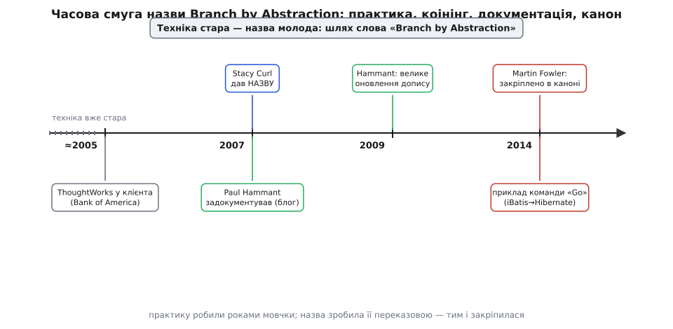

# 📜 Як прийом отримав ім'я

Є прийоми, які спершу роблять — і лише згодом називають. Так було з цим. Задовго до того, як хтось вимовив словосполучення «branch by abstraction», інженери вже робили рівно те саме: коли треба було замінити глибоко вросту деталь у живій системі, вони ставили між клієнтами й деталлю абстракцію, підводили під неї другу реалізацію, а тоді потихеньку перемикали. Робили — але **мовчки**. Прийом не мав назви, а отже, його не можна було ні порадити колезі одним словом, ні згадати в доповіді, ні внести до списку практик. Він жив як безіменна звичка добрих команд.

Ця вставка — про те, як безіменна звичка стала терміном: хто дав слово, хто його записав і рознюхав, і хто нарешті вписав у канон так, що тепер його «найчастіше й чуєш». Історія повчальна саме тим, що **техніка тут набагато старша за назву** — і це не дрібна деталь біографії, а ключ до того, чому назва взагалі знадобилася.


*Техніка стара, назва молода: практику застосовували роками без імені, аж поки слово не зробило її переказовою — тим вона й закріпилася.*

## Чому безіменний прийом — це прийом, якого наче й немає

Спершу варто відчути, **навіщо взагалі імена прийомам**. Здавалося б, роби добре — і байдуже, як воно зветься. Але без назви техніка не поширюється. Її не можна коротко порекомендувати: доводиться щоразу переказувати всю механіку — «ну, знаєш, встав інтерфейс, підклади під нього другу реалізацію, перемкни прапорцем…» — замість одного слова, яке викликає в голові співрозмовника всю картину одразу. Її не можна протиставити альтернативі в суперечці, бо в суперечці оперують названими позиціями. Її важко знайти: не знаючи, як воно зветься, ти не нагуглиш ні статті, ні доповіді, ні чужого досвіду.

Назва — це **ручка**, за яку ідею можна взяти й передати. Поки прийом безіменний, кожна команда винаходить його наново, з нуля, не підозрюючи, що сусідня команда за стіною робить те саме. Саме тому момент, коли безіменна практика отримує влучне ім'я, — це не косметика, а перехід: ідея з приватної звички стає **спільним надбанням цеху**. Ім'я не змінює механіки ані на йоту, але змінює її долю — з невидимої робить переказовою.

Ця історія — гарний приклад того, як воно стається насправді: не одним героєм-винахідником, а ланцюжком людей, де один **зробив**, другий **назвав**, третій **записав і рознюхав**, а четвертий **вписав у канон**. Роз'єднати ці ролі важливо — бо якщо злити їх в одну й сказати «X винайшов branch by abstraction», вийде саме той міф про єдиного автора, якого історія техніки раз у раз народжує на порожньому місці.

> 🔧 **Навіщо це.** Розрізняти «зробив», «назвав», «записав» і «вписав у канон» — не педантизм, а щеплення від фальшивих пріоритетів. Технічні прийоми майже ніколи не мають одного автора: їх намацують багато рук паралельно, а слава дістається тому, хто вчасно дав слово або гучно розповів. Хто це розуміє, той і чужі «X винайшов Y» читає обережно, і власний внесок описує чесно — «я не винайшов, я назвав» чи «я не назвав, я задокументував».

## Stacy Curl дав слово (близько 2007)

Саму назву — «branch by abstraction» — за наявними свідченнями пустив у обіг **Stacy Curl** (Стейсі Керл), британський інженер із кола ThoughtWorks. Це важлива й водночас делікатна деталь, бо людину, яку найчастіше пов'язують із цим прийомом, звати інакше, — а слово дав саме Curl.

Тут корисно спинитися на статусі доказовості. Що назву приписують Curl-у — усталено: на нього прямо посилається той, хто прийом задокументував, і це посилання відтоді повторюють усі, зокрема й канонічні джерела. А от **де саме й коли точно** народилося словосполучення — не задокументовано твердо. Схоже, воно виникло в живій розмові чи листуванні всередині ThoughtWorks десь близько 2007 року, а не в опублікованій статті з датою. Тобто «хто» ми знаємо доволі впевнено, а «де і в яку хвилину» лишається переказом — ось чесна межа того, що можна стверджувати.

І це геть типова доля вдалих назв. Терміни рідко народжуються в урочистій публікації — частіше вони зринають у балачці біля дошки, у гілці листування, у кулуарній суперечці, і лише потім хтось інший їх ловить і записує. «Хто вимовив уперше» тут майже завжди губиться в усному тумані, бо в ту мить ніхто не веде протоколу — це ж просто вдале слово, а не подія. Тому цілком у дусі жанру, що момент коінінгу лишився неточним: назва спершу побутувала, і аж згодом хтось усвідомив, що її варто закріпити на письмі.

## Paul Hammant записав і рознюхав (2007, оновлено 2009)

Тим, хто **витяг назву з усного туману на письмо** і зробив її відомою, був **Paul Hammant** (Пол Геммант), англійський інженер, теж із ThoughtWorks. У квітні 2007 року він опублікував допис під назвою «Introducing Branch By Abstraction», а у травні 2009-го суттєво його оновив. Саме цей текст зазвичай і мають на увазі, коли шукають першоджерело назви.

Найцінніше в тому дописі — не механіка (її Hammant якраз описує стисло), а **чесність про авторство**. Він одразу знімає з себе лаври винахідника. Його власні слова: «It is not my invention, and has been best practice for many years» — «Це не мій винахід, і воно було доброю практикою багато років». І окремо, майже мимохідь, віддає належне тому, хто дав слово: назву, мовляв, придумав Curl. Тобто автор документа сам, добровільно, розводить дві ролі — «я лише записую й пропоную дати цьому ім'я» проти «винайшов не я, а робили це давно й багато хто».

Ця фраза — маленький взірець того, як **годилося б** описувати внесок у техніку. Дуже легко було б написати «представляю мій новий підхід» — і за пару переказів Hammant став би «винахідником branch by abstraction» назавжди. Він свідомо цього не зробив. І тому історія назви лишилася чесною: ми знаємо, що прийом старий, знаємо, хто дав слово, і знаємо, хто це слово розніс, — саме тому, що розповсюджувач не привласнив собі перших двох ролей.

### Навіщо Hammant це просував: війна за стовбур

Тут не обійтися без мотиву. Hammant тягнув назву в люди **не заради самої назви** — вона була набоєм у ширшій кампанії. Він роками обстоював **trunk-based development** — розробку на спільному стовбурі, коли вся команда комітить у `main`, а не розповзається по довгих гілках репозиторію. І тут-таки ставало руба стандартне заперечення: «А як же велика зміна? Її ж без окремої довгої гілки не зробиш — треба ж десь спокійно переробляти пів системи!».

Ось на це заперечення branch by abstraction і був відповіддю. Прийом показував, що навіть **найбільшу** заміну можна протягти прямо на стовбурі, ніде не відгалужуючись, — бо «гілку» роблять в коді, за абстракцією, а не в гіллі системи контролю версій. Тому Hammant не просто описував акуратну техніку заради неї самої: він **вибивав з-під ніг опонентів їхній головний аргумент** проти життя на одному стовбурі. Назва була потрібна саме тому, що в суперечці оперують названими речами: щоб сказати «велику зміну роби ось так, а не довгою гілкою», цьому «ось так» конче треба було ім'я.

Тут корінь того, чому прийом від початку зрісся з ідеєю [прапорців функцій](root:sf-release/feature-flags) і [безперервної інтеграції](root:sf-release/ci-cd): усе це — частини однієї позиції «живемо на стовбурі, інтегруємося постійно, а великі зміни котимо дрібними безпечними кроками». Branch by abstraction був у цій позиції тим цвяхом, що тримав відповідь на найважче запитання.

### Досвід ThoughtWorks: клієнт Bank of America (близько 2005)

Звідки Hammant узяв упевненість, що так можна робити навіть із дуже великими системами? З практики. За його власними розповідями, коріння тягнеться до консалтингової роботи ThoughtWorks у великих клієнтів десь від середини 2000-х — зокрема згадують проєкт у **Bank of America** близько 2005 року, де на масштабній кодовій базі відпрацьовували життя на стовбурі й підхід до великих замін без довгих гілок. Приблизно тоді ж, 2005-го, власник ThoughtWorks Roy Singham (Рой Сінгем) організував Hammant-ові виступ в офісі CollabNet — розповісти інженерам продажу про Subversion і про те, чому варто триматися стовбура замість розгалуженого ClearCase-у. Тобто на момент, коли з'явилася назва, за нею вже стояли **реальні тижні роботи на живих великих системах**, а не кабінетна вигадка.

Статус цих деталей познач чесно: сам факт, що ThoughtWorks у ті роки активно обстоював trunk-based development і відпрацьовував великі зміни в корпоративних клієнтів, — добре задокументований у виступах і текстах Hammant-а. А от точна прив'язка «саме Bank of America, саме 2005-й, саме branch by abstraction» тримається насамперед на **його власних спогадах** — це надійне свідчення учасника, але не незалежно підтверджений публічний запис із тих років. Тому це радше добре засвідчений епізод, ніж документально завірена дата: важить тут не рік як такий, а те, що прийом виріс із поля, а не з теорії.

## Martin Fowler і Jez Humble вписали в канон (2014)

Назва, яку дав Curl і розніс Hammant, могла б лишитися внутрішнім жаргоном одного цеху. У широкий обіг її вивів **Martin Fowler** (Мартін Фаулер): 7 січня 2014 року він опублікував у своєму «bliki» статтю «Branch By Abstraction». Bliki Фаулера — місце, куди інженерна спільнота роками ходить по канонічні означення взірців проєктування, тож потрапити туди означало для прийому «отримати паспорт».

Фаулер і тут не привласнив авторства, а **відтворив ланцюжок**: він прямо пише, що термін «branch by abstraction» ввів Paul Hammant, обстоюючи trunk-based development, і що Hammant віддає першість Stacy Curl-у. І додає промовисте про долю слова: «This name seems to have caught on and is now the term I most commonly hear» — «Схоже, ця назва прижилася й тепер це той термін, що я чую найчастіше». Тобто до 2014-го слово вже перемогло в мовному сенсі — Фаулер лише засвідчив перемогу й закарбував її.

> 🔧 **Навіщо це.** Зверни увагу, як тримається ланцюжок атрибуції: Fowler посилається на Hammant-а, Hammant — на Curl-а, і жоден не обриває нитку на собі. Саме так і має виглядати чесна історія техніки — кожна ланка називає попередню. Варто хоч одному сказати «це моє» — і за кілька переказів попередники стерлися б, а прийом дістав би фальшивого єдиного «винахідника». Тут цього не сталося, і тому ми досі можемо назвати всіх трьох.

### Приклад, що зробив назву відчутною: команда «Go»

Канонічна стаття потребувала **живого прикладу**, і Фаулер узяв його зблизька — з власної фірми. Він переказує, як **Jez Humble** (Джез Гамбл, один з авторів книжки про безперервне постачання) розповідав, що його команда застосувала branch by abstraction у розробці ThoughtWorks-ового інструмента безперервного постачання під назвою «Go», щоб замінити **дві** глибокі підсистеми одразу:

```
підсистема доступу до бази:   iBatis      →  Hibernate
підсистема шаблонів веб-UI:   Velocity/JsTemplate  →  Ruby on Rails
```

Обидві заміни — це не косметика, а вирвати з-під працюючого продукту фундамент і підставити інший: змінити те, як застосунок узагалі спілкується з базою даних, і те, як він малює свій інтерфейс. І зробити це так, щоб продукт весь час лишався придатним до випуску, — бо це ж інструмент, яким користуються, його не заморозиш на пів року. Прийом дав саме це: під спільною абстракцією стара й нова підсистеми співіснували, а команда перемикалася, коли нове дозрівало, ніде не спиняючи розвитку самого продукту.

Приклад промовистий ще й тим, що показує **межу масштабу** прийому: не «підмінити один клас», а перекласти цілий застосунок з однієї ORM на іншу і з одного двигуна шаблонів на цілком інший стек. Коли така заміна проходить дрібними кроками на стовбурі, без місяців у довгій гілці, — стає видно, заради чого весь цей танець з абстракцією й прапорцем узагалі затівається.

Варто одну річ уточнити чесно, щоб не переказати легенду замість факту. Фаулер наводить це як приклад **застосування** прийому Humble-овою командою; що обидві заміни велися саме на живому, активно оновлюваному продукті — це природа й пряме призначення branch by abstraction (він для того й існує, щоб не спиняти випуск), але сам Фаулер у тій статті не розписує подробиць релізного графіка «Go» під час міграції. Тож бери це як засвідчений приклад використання техніки на серйозній заміні цілих підсистем, а деталі «скільки саме релізів вийшло по дорозі» — поза межами того, що стверджує джерело.

### На берегах: як звався той інструмент

Дрібна, але показова плутанина, якщо колись підеш перевіряти першоджерела. Інструмент, що в статті Фаулера зветься «Go», за життя міняв ім'я кілька разів: спершу він був **Cruise** (комерційний продукт ThoughtWorks Studios десь від 2007–2008), тоді близько 2010 року його перейменували на **Go**, а коли 2014-го його відкрили як вільне ПЗ, він став **GoCD** (нинішня назва). Стаття Фаулера 2014 року застала його ще під іменем «Go» — тому там саме «Go», хоча сьогодні ти знайдеш той самий інструмент під назвою GoCD. Це той випадок, коли одна річ під різними іменами в різні роки збиває з пантелику дужче за будь-яку складну теорію: не сама техніка тут заплутана, а історія назв навколо неї.

## Що з цієї історії варто винести

Складімо докупи — не як перелік дат, а як одну думку. Branch by abstraction — **старий прийом із молодою назвою**, і майже все повчальне в його історії росте саме з цього розриву.

Техніка існувала й працювала роками, поки була безіменною, — і саме тому лишалася невидимою, приватною звичкою окремих команд. Слово, яке дав Curl близько 2007-го, нічого не додало до механіки, але зробило прийом **переказовим**: тепер його можна було порадити, знайти, протиставити довгій гілці в суперечці. Hammant це слово записав і, головне, **зарядив ним аргумент** за життя на стовбурі, спираючись на реальний досвід великих клієнтів, — назва була йому потрібна як зброя в кампанії за trunk-based development, а не як прикраса. А Fowler за сім років по тому **вписав слово в канон** і засвідчив, що воно вже перемогло, підперши це живим прикладом заміни цілих підсистем у робочому продукті.

І наскрізна мораль — про **чесність атрибуції**. Тут ланцюжок жодного разу не обірвався на собі: Hammant прямо сказав «це не мій винахід» і назвав Curl-а; Fowler назвав Hammant-а, а через нього — Curl-а. Якби бодай один привласнив авторство, за кілька переказів народився б звичний міф про «винахідника branch by abstraction», а два справжні попередники розчинилися б. Не народився — і саме тому ми досі можемо чесно розкласти всі ролі: хто **зробив** (безіменні команди, роками), хто **назвав** (Curl), хто **записав і рознюхав** (Hammant), хто **вписав у канон** (Fowler). Це і є те щеплення, заради якого історію назви взагалі варто знати: техніки народжуються багатьма руками, а слово й слава дістаються тим, хто вчасно дав ім'я або гучно розповів, — і плутати ці ролі означає щоразу вигадувати неправдивого єдиного героя.

Той самий урок стане в пригоді щоразу, коли зустрінеш «X винайшов Y» про будь-який прийом розробки: спитай себе, чи не сплутано тут «зробив», «назвав» і «розповів», — і чи не стоїть за одним гучним іменем тихий ланцюжок попередників, як тут за назвою «branch by abstraction» стоять і Hammant, і Curl, і безліч безіменних команд, що робили це задовго до того, як воно отримало слово.
