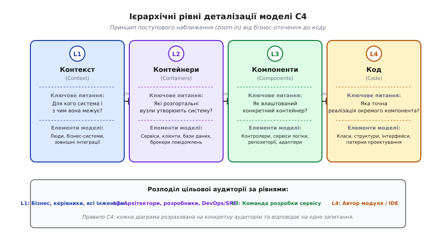
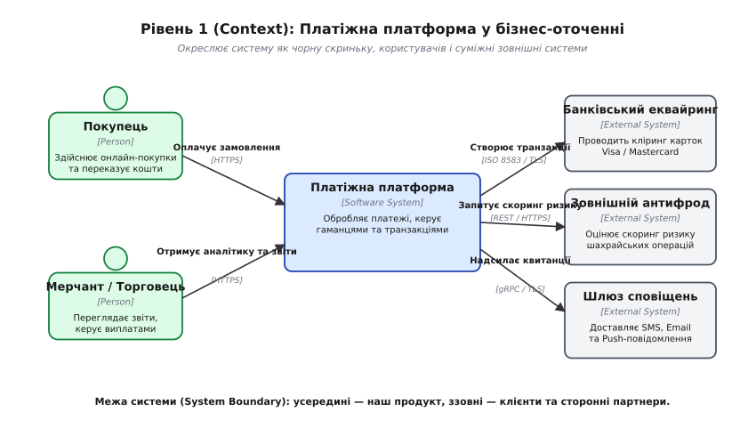
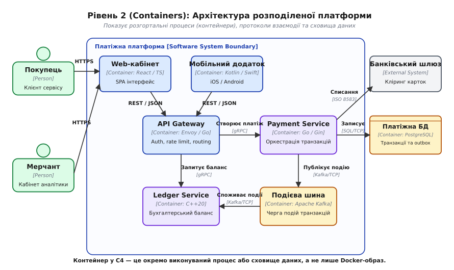
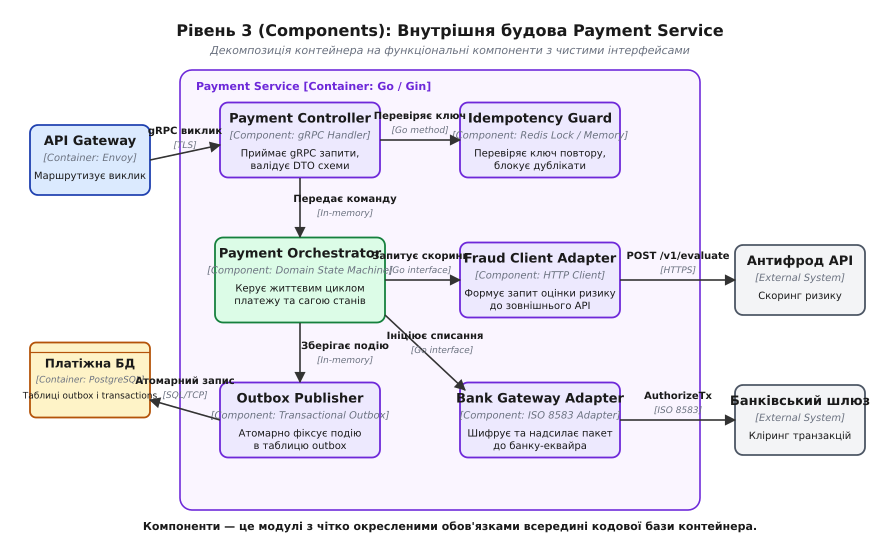
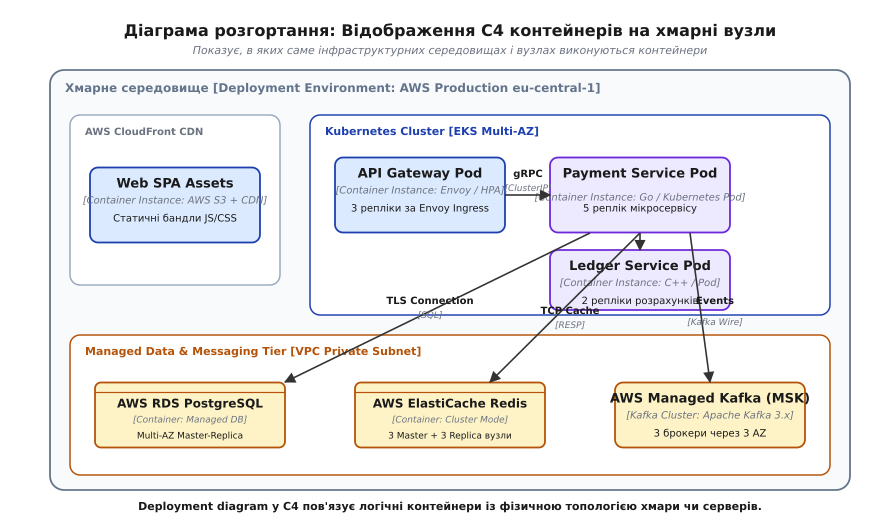
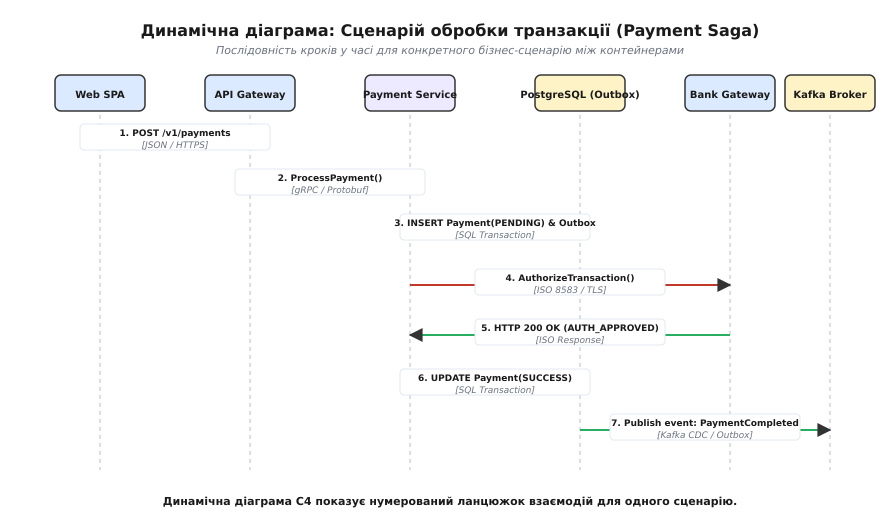

# C4 модель опису архітектури

<preknowlist>
- [Вісім оман розподілених обчислень](root:sf-distributed/distributed-fallacies) — чому топологія мережі, затримка й надійність не є сталими величинами.
- [API-шлюз](root:sf-web/api-gateway) — точка входу та демаркація зовнішніх і внутрішніх контурів системи.
- [Брокер повідомлень](root:sf-distributed/message-broker) — асинхронний зв'язок і розв'язання залежностей між вузлами.
- [Сага](root:sf-distributed/saga-pattern) — координація розподілених транзакцій та компенсацій між сервісами.
- [Transactional outbox](root:sf-distributed/outbox-pattern) — надійна публікація подій через локальну базу даних.
</preknowlist>

Коли команда з двадцяти інженерів розгортає розподілену платіжну систему на тридцять мікросервісів, спроба намалювати архітектуру на маркерній дошці майже завжди завершується катастрофою порозуміння. На такій дошці прямокутник з написом «Payment Service» межує з кружечком «PostgreSQL», хмаринкою «AWS», циліндром «Kafka» та стрілкою без підпису, яка вказує на блок «Користувач». Один інженер бачить у цій стрілці синхронний виклик через gRPC, інший — асинхронну подію в черзі, тестувальник вважає це HTTP-запитом у браузері, а системний адміністратор намагається зрозуміти, скільки віртуальних машин чи подів Kubernetes потрібно виділити під цей вузол.

Діаграми без суворої семантики не пояснюють будову системи, а лише маскують невідомість. Втрата контексту, змішування рівнів абстракції (коли клас поруч із цілим дата-центром) і відсутність позначень мережевих протоколів призводять до того, що документація застаріває в день створення, а нові розробники витрачають тижні на розкопування вихідного коду, щоб зрозуміти, куди насправді течуть байти.

Модель C4 розв'язує цю проблему через структурування архітектурного опису за принципом географічних карт: від огляду континентів до плану окремої будівлі.

---

## Чому ламаються традиційні архітектурні схеми

Проблема візуалізації програмних систем виникла не вчора. Наприкінці 1990-х років індустрія спробувала стандартизувати моделювання за допомогою уніфікованої мови UML (англ. *Unified Modeling Language*). UML запропонував чотирнадцять типів діаграм зі складною нотацією: ромбики композиції й агрегації, пунктирні стрілки реалізації, стереотипи та десятки сторінок правил. Проте інженерна практика показала зворотний бік: UML виявився занадто громіздким для щоденної розробки. Створення повної моделі в спеціалізованих CASE-інструментах вимагало окремої посади «архітектора-модельєра», а розробники переставали оновлювати діаграми, щойно код починав еволюціонувати. Детальніше еволюцію від формальних стандартів IEEE та UML до практичних нотацій розібрано в історичному нарисі [Від хаосу UML та блок-схем до C4](root:sf-apps/c4-architecture-model/hist-c4-origin.md).

У відповідь індустрія хитнулася в іншу крайність — безформні схеми з прямокутників і ліній (англ. *boxes and lines*). У таких схемах відсутня будь-яка метамодель:
- **Невизначеність форми.** Що означає прямокутник? Це один файл коду, логічний модуль, окремий процес в ОС, фізичний сервер чи стороння хмарна служба?
- **Невизначеність стрілок.** Що означає стрілка між блоками А та Б? Залежність на етапі компіляції (`import`), потік даних, мережевий виклик клієнт-сервер чи послідовність дій у часі?
- **Змішування масштабів.** На одній діаграмі одночасно зображують інтерфейс користувача `React`, патерн `Repository`, кластер `Kubernetes` та сторонній банківський шлюз. Читач змушений одночасно тримати в голові деталі реалізації окремого методу та глобальну топологію мережі.

Щоб позбутися цієї плутанини, британський інженер Саймон Браун (англ. *Simon Brown*) сформулював модель C4. Її основа — фіксована ієрархія абстракцій та суворі правила позначення зв'язків.

---

## Чотири рівні наближення: від контексту до коду

Модель C4 спирається на метафору інтерактивних географічних карт на зразок Google Maps. Дивлячись на карту світу, ви бачите межі континентів і держав, але не бачите вулиць і номерів будинків. Наближаючи масштаб (англ. *zoom in*), ви бачите міста, магістралі, квартали й, зрештою, контури окремих споруд. Кожен рівень масштабу відповідає на своє запитання і має власну цільову аудиторію.


*Чотири рівні абстракції моделі C4: від глобального бізнес-оточення до внутрішньої структури коду*

### Рівень 1: Контекст системи (System Context)

Контекстна діаграма — це погляд на найвищому рівні. Вона відповідає на запитання: **для кого існує система і з якими зовнішніми сутностями вона взаємодіє?**

На цьому рівні вся ваша система позначається **одним єдиним прямокутником** у центрі. Жодних деталей реалізації, технологій, фреймворків чи баз даних тут немає. Навколо розташовуються:
1. **Люди (Persons / Actors)** — користувачі, адміністратори, клієнти, партнери, які безпосередньо працюють із системою.
2. **Зовнішні системи (External Software Systems)** — сторонні сервіси, банківські еквайринги, поштові шлюзи, корпоративні ERP-системи, які перебувають поза зоною вашого контролю.

Кожен зв'язок на діаграмі обов'язково містить дієслово дії та напрямок передачі інформації.


*Контекстна діаграма платіжної платформи: система як єдине ціле, клієнти та зовнішні сервіси*

Контекстна діаграма призначена для широкого кола стейкхолдерів: від інвесторів, продакт-менеджерів і бізнес-аналітиків до нових інженерів команди, яким потрібно зрозуміти межі відповідальності продукту.

### Рівень 2: Контейнери (Containers)

Якщо «наблизити» центральний прямокутник системи, ми потрапляємо на рівень контейнерів. Діаграма контейнерів відповідає на запитання: **з яких розгортальних і виконуваних одиниць побудовано систему, і як вони спілкуються між собою?**

> ⚠️ **Важливе розмежування термінів.**
> Слово «контейнер» у моделі C4 виникло задовго до масового поширення Docker та OCI-образів. У C4 **контейнер (Container)** — це будь-яка окремо розгортана одиниця виконання або збереження даних.
> Контейнером є:
> - Веб-застосунок (SPA на React, що виконується у браузері користувача).
> - Мобільний додаток (iOS / Android застосунок).
> - Серверний процес або мікросервіс (Go, Java, Node.js, C++ демон).
> - Безсерверна функція (AWS Lambda, Google Cloud Function).
> - Реляційна база даних (PostgreSQL, MySQL).
> - Сховище типу ключ-значення або кеш (Redis, Memcached).
> - Брокер або журнал повідомлень (Apache Kafka, RabbitMQ).
> - Файлове сховище (AWS S3, MinIO).

На рівні контейнерів уперше з'являються технологічні стеки та мережеві протоколи. Кожна стрілка зв'язку повинна містити не просто назву операції, а точний протокол взаємодії в квадратних дужках: `[JSON/HTTPS]`, `[gRPC/HTTP2]`, `[SQL/TCP]`, `[Kafka/Protobuf]`.


*Діаграма контейнерів: декомпозиція системи на клієнти, мікросервіси, бази даних та брокери повідомлень*

Ця діаграма є головним робочим інструментом архітекторів, бекенд- та фронтенд-розробників, а також DevOps/SRE-інженерів. Вона показує мережеві розриви, синхронні й асинхронні магістралі, а також точки збереження стану.

### Рівень 3: Компоненти (Components)

Обираємо один серверний контейнер (наприклад, `Payment Service`) і розкриваємо його внутрішню будову. Діаграма компонентів відповідає на запитання: **з яких модулів або структурних блоків складається кодова база контейнера, і які інтерфейси вони надають?**

**Компонент (Component)** у C4 — це логічне групування коду (пакет, модуль, простір імен, сукупність класів), об'єднане спільним обов'язком та чітко окресленим інтерфейсом. Компонент не можна розгорнути окремо від контейнера: він виконується в тому самому адресному просторі процесу.

Типові компоненти мікросервісу:
- **API Controller / gRPC Handler** — приймає запити з мережі, розпаковує DTO, валідує заголовки.
- **Idempotency Guard** — перевіряє унікальність запиту та блокує повторну обробку.
- **Payment Orchestrator / Domain Service** — реалізує бізнес-правила та переходи кінцевого автомата.
- **Outbox Publisher** — зберігає події в таблицю бази даних для гарантованої доставки.
- **Gateway Adapter** — інкапсулює виклики до зовнішніх бібліотек чи віддалених сервісів.


*Діаграма компонентів Payment Service: контролери, доменні сервіси, репозиторії та адаптери*

Ця діаграма створюється для команди розробників, яка безпосередньо пише код цього сервісу. Вона задає архітектурний каркас (наприклад, гексагональну архітектуру чи патерн «порти й адаптери») і захищає кодову базу від перетворення на «спагеті» викликів.

### Рівень 4: Код (Code)

Рівень коду — це максимальне наближення, яке показує окремі класи, структури, інтерфейси, функції або схеми таблиць бази даних. Зазвичай це класичні UML-діаграми класів чи ER-діаграми.

> 💡 **Практичне правило Саймона Брауна:**
> Діаграми рівня 4 (Code) створювати вручну **не рекомендується**. Вони застарівають швидше, ніж компілюється проєкт. Цей рівень має або генеруватися автоматично засобами IDE та інструментами на зразок Doxygen/PlantUML, або фіксуватися лише для рідкісних, критично складних алгоритмів (наприклад, реалізації складного шаблону проєктування чи lock-free структури даних).

---

## Додаткові та ортогональні проєкції

Чотирьох статичних рівнів декомпозиції недостатньо, щоб описати всі аспекти розподіленої системи. Системи розгортаються на фізичній інфраструктурі та виконують динамічні сценарії в часі. Для цього C4 визначає три додаткові проєкції.

### 1. Діаграма розгортання (Deployment Diagram)

Діаграма контейнерів показує *логічну* структуру (які програми існують), але не відповідає на запитання, *де і як* вони запущені у фізичному світі. Діаграма розгортання відображає логічні контейнери на фізичну інфраструктуру: вузли, віртуальні машини, кластери Kubernetes, хмарні регіони та зони доступності (Availability Zones).

Елементи діаграми розгортання:
- **Deployment Node (Вузол розгортання)** — обчислювальний ресурс (сервер, віртуальна машина AWS EC2, под Kubernetes, контейнер Docker, мобільний пристрій).
- **Infrastructure Node (Вузол інфраструктури)** — допоміжні мережеві або інфраструктурні елементи (балансувальники навантаження DNS/L4/L7, фаєрволи, шлюзи NAT, сервісні сітки).
- **Container Instance (Екземпляр контейнера)** — конкретна копія логічного контейнера, запущена всередині вузла.


*Діаграма розгортання: розміщення реплік сервісів і кешів у хмарному середовищі AWS Multi-AZ*

### 2. Динамічна діаграма (Dynamic Diagram)

Статична діаграма контейнерів показує всі можливі канали зв'язку, але не показує порядок виконання конкретного бізнес-сценарію. Динамічна діаграма моделює поведінку системи в часі для одного сценарію (англ. *use case*).

На відміну від важких UML-діаграм послідовності (англ. *Sequence Diagrams*), динамічна діаграма C4 зберігає просторове розташування контейнерів, але додає **нумерований ланцюжок викликів** безпосередньо на стрілках взаємодії.


*Динамічна діаграма: покроковий сценарій обробки транзакції з компенсаціями та подіями*

### 3. Ландшафт систем (System Landscape)

Коли організація володіє десятками програмних систем, одного системного контексту стає замало. Діаграма ландшафту показує макро-карту всього підприємства: усі системи компанії, корпоративні межі, внутрішні та зовнішні користувачі й міжсистемні інтеграційні магістралі.

---

## Граматика та правила оформлення елементів C4

Головна сила моделі C4 — жорстка семантична граматика. Кожен елемент на діаграмі зобов'язаний мати строгий набір полів, що виключає двозначність.

### Структура блоку (Element Card)

Кожен прямокутник на діаграмах C4 містить чотири обов'язкові атрибути:
1. **Назва (Name)** — коротке однозначне ім'я сутності (наприклад, `Payment Service`).
2. **Тип елемента (Element Type)** — суворе позначення ролі в метамоделі (`Person`, `Software System`, `Container`, `Component`).
3. **Технологія (Technology)** — конкретна мова, фреймворк або рушій (`Go / Gin`, `PostgreSQL 16`, `React / TypeScript`, `Envoy Proxy`). Для персон і зовнішніх систем без фіксованого стеку це поле може бути порожнім або описувати протокол інтеграції.
4. **Опис (Description)** — 1–2 речення, що пояснюють головний обов'язок сутності (наприклад, *«Обробляє запити на авторизацію карток та оркеструє розподілену сагу списання коштів»*).

### Структура зв'язку (Relationship)

Зв'язок між елементами — це не просто лінія. Зв'язок у C4 — це спрямоване твердження:
- **Напрямок стрілки** вказує на напрямок виклику або передачі даних (від ініціатора до отримувача).
- **Підпис зв'язку (Label)** містить дієслово активного стану (наприклад, *«Передає команду на списання»*, *«Вичитує події аудиту»*).
- **Технологія протоколу (Technology / Protocol)** обов'язково зазначається в дужках: `[JSON/HTTPS]`, `[gRPC/Protobuf]`, `[SQL/TLS]`, `[AMQP 0-9-1]`.

Завдяки цьому правилу читачеві не потрібно здогадуватися, як саме спілкуються мікросервіси: через пам'ять, через синхронний RPC чи через збереження повідомлення в брокері.

Повний опис метамоделі, ключових слів та правил побудови представлено у довіднику [Специфікація метамоделі C4 та граматика Structurizr DSL](root:sf-apps/c4-architecture-model/api-structurizr-dsl.md). Для тих, хто обирає між C4, моделлю 4+1 Філіпа Крахтена та корпоративним стандартом ArchiMate, корисним буде концептуальне порівняння [Порівняння C4 з UML, 4+1 архітектурними видами та ArchiMate](root:sf-apps/c4-architecture-model/comp-c4-vs-uml-4plus1.md).

---

## Наскрізний приклад: Моделювання платіжної платформи

Розглянемо практичний процес моделювання розподіленої архітектури на прикладі високонавантаженої платіжної системи.

### Крок 1. Визначення системного контексту

Починаємо з меж системи. Наша система — `Payment Processing Platform`. Вона не існує у вакуумі.
- Хто ініціює операції? `Customer` (Покупець в інтернет-магазині) та `Merchant` (Торговець, який отримує кошти).
- Які зовнішні системи необхідні для завершення транзакції? `Bank Acquiring Gateway` (банк, що виконує кліринг) та `Fraud Screening Service` (сервіс перевірки карток на шахрайство).

Формуємо зв'язки рівня L1:
```
Customer -> Payment Platform: "Здійснює покупку [HTTPS]"
Payment Platform -> Bank Acquiring Gateway: "Авторизує платіж [ISO 8583 / TLS]"
Payment Platform -> Fraud Screening Service: "Оцінює скоринг ризику [REST/HTTPS]"
```

### Крок 2. Декомпозиція на контейнери

Розкриваємо платіжну платформу на окремі процеси. Для високої надійності та масштабування ми відокремлюємо публічний контур від доменного ядра та бухгалтерського обліку.
1. **Клієнтський рівень:** `Web SPA` (React) та `Mobile App` (Kotlin/Swift).
2. **Точка входу:** `API Gateway` (Envoy) — термінує TLS, перевіряє JWT-токени, обмежує частоту запитів ([API-шлюз](root:sf-web/api-gateway)).
3. **Платіжне ядро:** `Payment Service` (Go) — обробляє вхідні команди, керує станом транзакції, надсилає запити до банку.
4. **Бухгалтерський баланс:** `Ledger Service` (C++) — сервіс із нульовим оверхедом пам'яті, який веде подвійний бухгалтерський запис проводок.
5. **Асинхронний транспорт:** `Apache Kafka` — журнал подій для гарантованого розповсюдження фактів оплати ([Брокер повідомлень](root:sf-distributed/message-broker)).
6. **Сховища:** `PostgreSQL` для транзакцій (з реалізацією [Transactional outbox](root:sf-distributed/outbox-pattern)) та `Redis` для розподілених лінійних блокувань і забезпечення [ідемпотентності](root:sf-distributed/idempotency).

Зв'язки рівня L2 фіксують точні протоколи:
```
API Gateway -> Payment Service: "ProcessPayment() [gRPC]"
Payment Service -> PostgreSQL: "Запис транзакції та Outbox [SQL/TCP]"
Payment Service -> Kafka: "Публікація PaymentAuthorized [Kafka Wire Protocol]"
Kafka -> Ledger Service: "Споживання подій платежів [Kafka Consumer Group]"
```

### Крок 3. Внутрішня декомпозиція Payment Service (Компоненти)

Спускаємося всередину `Payment Service`. Щоб код не перетворився на монолітний клубок, ми організовуємо його за принципами чистої архітектури:
- `Payment API Controller`: gRPC-сервер, що валідує вхідні Protobuf-структури.
- `Idempotency Guard`: компонент, що атомарно перевіряє ключ ідемпотентності в Redis, відсікаючи повторні мережеві дублікати.
- `Payment Orchestrator`: кінцевий автомат, що координує кроки [саги](root:sf-distributed/saga-pattern).
- `Fraud Client Adapter`: HTTP-клієнт із вбудованим запобіжником (circuit breaker) та таймаутами.
- `Outbox Publisher`: модуль, що записує повідомлення в локальну таблицю outbox у межах тієї ж транзакції бази даних.

---

## Парадигма «Архітектура як код» (Architecture as Code)

Найбільша загроза для будь-якої архітектурної документації — розсинхронізація з кодом. Схеми, намальовані у графічних редакторах (Visio, Draw.io, Lucidchart), зберігаються як бінарні файли чи статичні картинки. Коли розробник змінює інтерфейс сервісу, він рідко відкриває графічний редактор, щоб перемалювати стрілочку. Через три місяці діаграми перетворюються на дезінформацію.

Рішення цієї проблеми — перехід до моделі **«Архітектура як код» (Architecture as Code / AaC)**.

```
┌─────────────────────────────────────────────────────────────┐
│                 Єдина модель архітектури                    │
│             (Structurizr DSL / Workspace JSON)              │
└──────────────┬──────────────┬──────────────┬────────────────┘
               │              │              │
        ┌──────▼──────┐┌──────▼──────┐┌──────▼──────┐
        │  Context    ││  Containers ││ Deployments │
        │  View (SVG) ││  View (PNG) ││  View (PDF) │
        └─────────────┘└─────────────┘└─────────────┘
```

Головний принцип Architecture as Code: **одна спільна модель — безліч автоматично згенерованих проєкцій**.
Ви описуєте елементи системи (людей, системи, контейнери, зв'язки) у вигляді декларативного коду (наприклад, `Structurizr DSL` або `LikeC4`). Проєкції (views) не малюються окремо: вони є вибірками з цієї єдиної моделі даних.

### Приклад опису моделі на Structurizr DSL

```dsl
workspace "Платіжна платформа" "Архітектурна модель системи обробки платежів" {

    model {
        customer = person "Покупець" "Клієнт інтернет-магазину, який здійснює оплату"
        bank = softwareSystem "Банківський еквайринг" "Зовнішній банківський шлюз" "External"

        paymentPlatform = softwareSystem "Платіжна платформа" "Обробляє онлайн-платежі" {
            webApp = container "Web-кабінет" "SPA інтерфейс користувача" "React, TypeScript"
            apiGateway = container "API Gateway" "Маршрутизація, auth, rate limiting" "Envoy, Go"
            paymentService = container "Payment Service" "Оркестрація транзакцій та саг" "Go, Gin" {
                controller = component "Payment Controller" "Приймає gRPC запити" "gRPC Server"
                orchestrator = component "Payment Orchestrator" "Керує станом саги" "Go State Machine"
                outbox = component "Outbox Publisher" "Зберігає події для Kafka" "Transactional Outbox"
            }
            paymentDb = container "Платіжна БД" "Зберігає стан транзакцій та outbox" "PostgreSQL 16" "Database"
            messageBus = container "Подієва шина" "Потік подій транзакцій" "Apache Kafka" "Broker"
        }

        # Зв'язки контексту
        customer -> webApp "Переглядає та оплачує [HTTPS]"
        webApp -> apiGateway "Надсилає запити API [JSON/HTTPS]"
        apiGateway -> controller "Викликає ProcessPayment [gRPC]"
        controller -> orchestrator "Передає команду [In-process]"
        orchestrator -> outbox "Фіксує подію [In-process]"
        outbox -> paymentDb "Атомарний запис [SQL/TCP]"
        paymentService -> bank "Авторизація списання [ISO 8583/TLS]"
        outbox -> messageBus "Публікує події [Kafka Wire Protocol]"
    }

    views {
        systemContext paymentPlatform "ContextView" {
            include *
            autoLayout lr
        }

        container paymentPlatform "ContainersView" {
            include *
            autoLayout lr
        }

        component paymentService "ComponentsView" {
            include *
            autoLayout lr
        }

        styles {
            element "Software System" { background #1e40af color #ffffff }
            element "External" { background #6b7280 color #ffffff }
            element "Container" { background #2563eb color #ffffff }
            element "Database" { shape Cylinder background #b45309 color #ffffff }
            element "Broker" { shape Pipe background #b45309 color #ffffff }
            element "Component" { background #7c3aed color #ffffff }
            element "Person" { shape Person background #15803d color #ffffff }
        }
    }
}
```

Коли опис архітектури зберігається у Git поруч із вихідним кодом:
1. Будь-яка зміна архітектури проходить через стандартний механізм `Pull Request` і код-рев'ю.
2. Сервер CI/CD автоматично генерує актуальні SVG-діаграми під час кожного білду та публікує їх на внутрішній документаційний портал.
3. Можна запускати автоматичні архітектурні тести (англ. *Architecture Fitness Functions*): наприклад, перевіряти, що `Web-кабінет` не має прямого зв'язку з `Платіжною БД`, минаючи `API Gateway`.

Повну реалізацію конвеєра валідації архітектурних інваріантів та генерації схем у CI/CD розібрано у практичному проєкті [Побудова пайплайну «Архітектура як код»](root:sf-apps/c4-architecture-model/proj-c4-model-as-code.md).

---

## Типові пастки, обмеження та інженерні компроміси C4

Як і будь-яка інженерна модель, C4 має межі застосовності та підводні камені.

### 1. Пастка перевантаження діаграми компонентів (Component Explosion)
У системі з 50 мікросервісів спроба намалювати діаграми компонентів для кожного з них призведе до появи сотень схем, які ніхто не підтримуватиме.
- **Рішення:** Діаграми компонентів потрібні лише для **ключових, найбільш складних контейнерів** системи (наприклад, платіжного ядра чи рушія розрахунку ризиків). Для типових CRUD-мікросервісів діаграма компонентів є надлишковою: їхня внутрішня будова очевидна з коду.

### 2. Моделювання динамічної хмарної інфраструктури (Serverless та Auto-scaling)
У сучасному хмаровому середовищі кількість запущених контейнерів постійно змінюється, а функції AWS Lambda можуть створюватися й знищуватися щосекунди.
- **Рішення:** Діаграми C4 моделюють **логічні типи контейнерів**, а не окремі екземпляри процесів. На діаграмі контейнерів зображується один блок `Payment Function [AWS Lambda]`. Конкретна кількість паралельних інстансів та параметри масштабування (HPA, Auto Scaling Groups) відображаються на **діаграмі розгортання (Deployment Diagram)**.

### 3. Наскрізні аспекти (Cross-cutting Concerns)
Як показати аутентифікацію, розподілене трасування (OpenTelemetry), логування та моніторинг, якщо до них підключений кожен мікросервіс? Якщо намалювати стрілки від кожного контейнера до `Prometheus` і `Jaeger`, діаграма перетвориться на суцільну павутину.
- **Рішення:** Використовуйте окремі тематичні проєкції (Views) з фільтрацією або документуйте наскрізну інфраструктуру окремими шарами розгортання чи діаграмами підсистем.

---

> 🔧 **Навіщо це в реальній розробці.**
> Модель C4 створює єдину систему координат для всієї інженерної організації:
> 1. **Швидкий онбординг розробників.** Новий інженер за 10 хвилин розуміє контекст системи (L1) та взаємозв'язки сервісів (L2), не потопаючи в деталях окремих репозиторіїв.
> 2. **Проведення Architecture Decision Records (ADR).** Будь-яке складне інженерне рішення прив'язується до конкретного рівня C4: зміна бази даних розглядається на рівні L2 (Container), рефакторинг бізнес-модуля — на рівні L3 (Component), а додавання нового регіону — на рівні Deployment.
> 3. **Аудит безпеки та аналіз відмовостійкості (Threat Modeling / Failure Mode Analysis).** Оскільки всі стрілки містять явні протоколи та межі мережі, команда безпеки миттєво бачить незашифровані канали, точки проходження чутливих даних і критичні вузли відмови (Single Points of Failure).

C4 не вимагає відмови від коду чи використання складних інструментів: це прагматична дисципліна мислення, яка перетворює незрозумілі малюнки на точну інженерну документацію.
