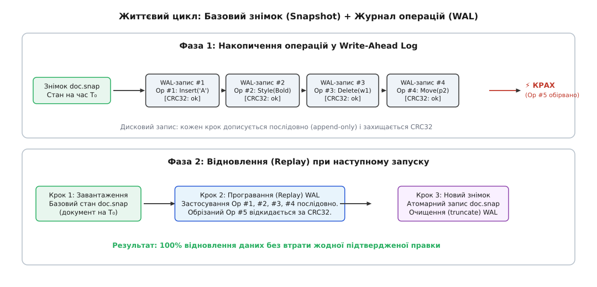
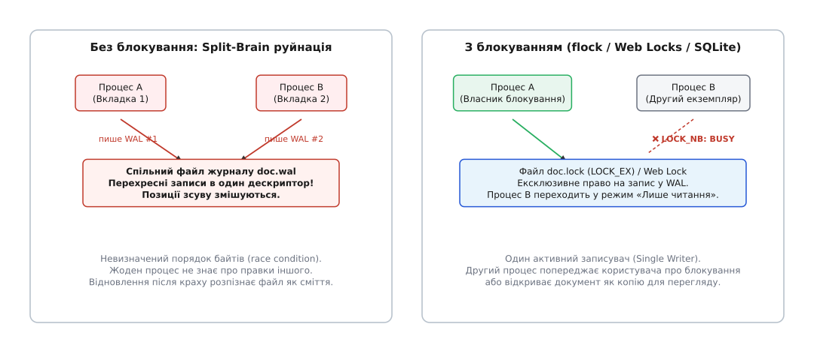
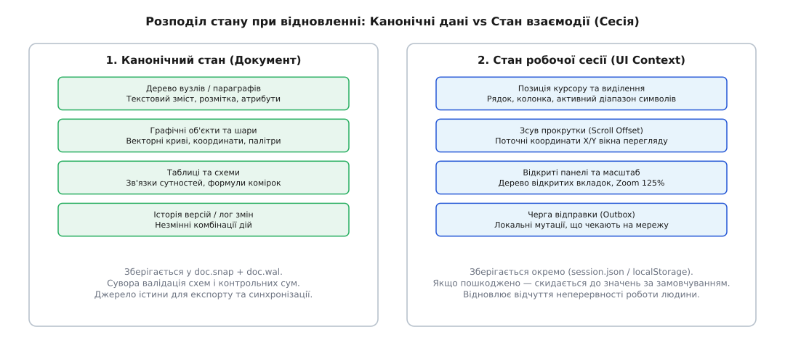

# Документ переживає крах: автозбереження і журнал

<preknowlist>
- [Скасування й повтор дії: стек команд](topic:sf-apps/undo-redo-command-stack) — послідовність дій і стан як історія намірів у пам'яті.
- [Незмінність як прийом дизайну](topic:sf-apps/immutability) — стан, який не змінюють на місці, а замінюють новою версією.
- [Однонапрямлений потік даних](topic:sf-apps/unidirectional-data-flow) — усі мутації моделі проходять крізь єдину точку входу.
- [Контрольна сума CRC](topic:com-protocol/crc-in-firmware) — поліноміальний код виявлення спотворень і пошкоджень у потоці байтів.
- [Архітектура десктопного застосунку: шари, потоки, стан](topic:sf-apps/desktop-app-architecture) — розмежування інтерфейсу, фонової логіки та вводу-виводу на диск.
</preknowlist>

Користувач набрав дві сторінки тексту, розмістив таблиці та налаштував векторні криві на макеті. Несподівано екран гасне: у будинку зникла електроенергія, або операційна система примусово завершила процес через вичерпання пам'яті сигналом `SIGKILL`, або збій у графічному драйвері миттєво перезавантажив комп'ютер. Уся оперативна пам'ять процесу зникає за частку мікросекунди. Якщо застосунок покладався на те, що людина колись натисне «Зберегти», або сподівався виконати код у фінальному обробнику виходу, вся кількагодинна праця знищується без сліду.

Клієнтський застосунок працює у ворожому та непередбачуваному середовищі. На відміну від серверних кластерів із резервним живленням, настільний комп'ютер чи мобільний телефон будь-якої миті зазнає раптової зупинки. Здатність програми пережити аварійне вимкнення без втрати жодного введеного символу й без пошкодження файлів на диску — це не випадкова властивість бібліотеки вводу-виводу, а фундаментальний архітектурний дизайн стану.

## Ілюзія чистого виходу: чому перехоплення сигналів не рятує

Перша наївна ідея, яка спадає на думку розробникові під час проектування автозбереження, — перехопити момент закриття програми й терміново скинути поточний стан на диск:

```
window.addEventListener("beforeunload", () => saveToDisk(currentDocument));
```

Або на рівні операційної системи:

```
std::atexit([]() { save_to_disk(current_document); });
```

Цей підхід створює небезпечну ілюзію надійності. Він працює лише в тепличних умовах, коли користувач чемно натискає хрестик у кутку вікна, а операційна система дає процесу час на завершення. Проте справжні аварії відбуваються зовсім інакше.

Існує цілий клас фатальних подій, коли жоден рядок користувацького коду очищення **фізично не виконується**:

1. **Раптове знеструмлення (Power Cut / Battery Pull):** Центральний процесор миттєво зупиняє виконання інструкцій, а контролери оперативної пам'яті втрачають заряд у конденсаторах динамічної пам'яті (DRAM).
2. **Апаратний збій ядра (Kernel Panic / Blue Screen of Death):** Операційна система заморожує всі процеси простору користувача, захищаючи апаратні структури від подальшого руйнування.
3. **Неперехоплюваний сигнал ОС (`SIGKILL` / `kill -9`):** Ядро негайно знищує адресний простір процесу без надсилання повідомлень чи виклику обробників `atexit`.
4. **Вичерпання пам'яті (OOM Killer у Linux / Android / iOS):** Коли мобільній системі бракує оперативної пам'яті для активного вікна, вона мовчки вбиває фонові вкладки та неактивні процеси.
5. **Аварійне падіння всередині процесу (Segmentation Fault / Uncaught Panic):** Пошкодження стека чи звернення за нульовим вказівником миттєво викликає переривання процесора. Навіть якщо встановити низькорівневий обробник сигналу `SIGSEGV`, адресний простір процесу вже скомпрометовано: пам'ять містить сміття, структури даних перебувають у неузгодженому стані, а спроба серіалізувати документ із пошкодженої купи призведе до запису битого файлу на диск.

Звідси випливає **перший непорушний закон клієнтської стійкості**: не розраховуйте на код під час закриття. Документ має бути захищеним на диску **вже зараз, у процесі звичайної роботи**, щосекунди готовий до того, що наступна мілісекунда не настане.

[Історія автозбереження показує](topic:sf-apps/client-crash-recovery/hist-autosave-evolution.md), як індустрія пройшла шлях від виснажливого ручного натискання комбінацій клавіш та блокуючих тіньових файлів до сучасних невидимих журналів.

## Пастка прямого перезапису: розірваний запис (Torn Write)

Зрозумівши, що зберігати дані треба регулярно під час роботи, розробник робить наступний крок: запускає таймер, який кожні тридцять секунд виконує запис документа в робочий файл.

```
const file = open("my_novel.dat", "w");
file.write(serialize(document));
file.close();
```

Цей простий фрагмент коду є міною сповільненої дії. Він не просто не захищає документ від збою — він власноруч гарантує його фатальне знищення.

Уявіть процес запису на низькому рівні. Документ має розмір 50 мегабайтів. Коли програма викликає функцію відкриття файлу в режимі запису (`"w"` або `O_TRUNC`), операційна система негайно обнуляє розмір існуючого файлу `my_novel.dat` на диску, знищуючи стару коректну копію версії 1. Далі функція `write()` починає перекачувати 50 мегабайтів нових даних версії 2 крізь сторінковий кеш ядра та контролер накопичувача. Цей процес займає сотні мілісекунд.

Якщо живлення зникне на середині передачі (наприклад, коли записано лише 18 мегабайтів), на диску залишиться обрубок. Цей файл не містить старої версії 1 (її вже затерли) і не містить повної версії 2 (її не встигли дописати).


*Прямий запис залишає файл пошкодженим, якщо живлення зникає під час передачі. Атомарна заміна підміняє вказівник каталогу лише після повного скидання даних.*

Таке явище в комп'ютерній інженерії називається **розірваним записом** (англ. *torn write*). Накопичувачі записують дані фізичними секторами (зазвичай по 4096 байтів). Операційна система не гарантує атомарності багатосекторного запису: при краху частина секторів містить нові байти, частина — старі, а частина — випадкове сміття з нулями. Відкрити такий файл після перезавантаження не зможе жоден парсер: структура JSON обірветься посеред об'єкта, бінарне дерево втратить дочірні вказівники, а стиснений ZIP-архів не пройде перевірку заголовка.

Фізична ієрархія збереження робить розірваний запис неминучим при прямому перезаписі:
1. **Буфер процесу (User-space Buffer):** Бібліотечні обгортки (як-от `fwrite`) накопичують байти порціями по 4–8 КБ.
2. **Сторінковий кеш ядра (Kernel Page Cache):** Ядро ОС розбиває потік на сторінки пам'яті по 4096 байтів і позначає їх як «брудні» (dirty pages).
3. **Черга блокового пристрою (I/O Scheduler):** Драйвер диска перевпорядковує сектори для мінімізації рухів голівки HDD або вирівнювання блоків SSD. Порядок запису секторів на диск не збігається з порядком викликів `write()` у програмі.
4. **Внутрішній кеш накопичувача (On-disk DRAM Cache):** Контролер диска підтверджує отримання даних до того, як вони фізично закріпилися у флешкомірках.

Якщо живлення вимикається під час будь-якої фази цього конвеєра, на диску утворюється випадкова суміш старих і нових секторів.

**Другий закон клієнтської стійкості**: ніколи не модифікуйте робочий файл документа на місці. Будь-який запис у файл оригіналу — це прямий шлях до втрати даних.

## Чотири кроки атомарної заміни (Atomic Rename Pattern)

Щоб унеможливити розірваний запис цілого файлу, застосовують класичний патерн **атомарної заміни через тимчасовий файл** (англ. *atomic rename pattern*).

Слово «атомарність» (грец. *atomos* — неподільний) означає, що операція або відбувається повністю, або не відбувається взагалі. Проміжного стану, коли файл існує наполовину, для зовнішнього спостерігача бути не може.

Канонічний ланцюжок атомарного збереження складається з чотирьох послідовних кроків:

```
1. write(doc.tmp)  ──>  2. fsync(doc.tmp)  ──>  3. rename(doc.tmp, doc.dat)  ──>  4. fsync(dir_fd)
```

Розгляньмо фізичний сенс кожної ланки:

### Крок 1: Запис у тимчасовий файл поруч з оригіналом

Нова версія документа серіалізується й записується в окремий тимчасовий файл з унікальним іменем (наприклад, `doc.dat.tmp.18492.uuid`).

Критично важливо створити тимчасовий файл **у тій самій теці**, де лежить оригінальний документ. Якщо створити його в системному каталозі тимчасових файлів (як-от `/tmp` у Linux), він майже напевно опиниться на іншому монтованому диску або віртуальній файловій системі в пам'яті (`tmpfs`). Системний виклик `rename` не вміє переносити файли між різними файловими системами атомарно: ядро поверне помилку `EXDEV` (Invalid cross-device link), а спроба скопіювати байти поверне проблему розірваного запису.

### Крок 2: Примусове скидання кешів накопичувача (`fsync`)

Звичайний виклик `write()` або закриття файлу `close()` не записує дані на магнітні пластини чи мікросхеми флешпам'яті SSD. Він лише копіює байти в оперативну пам'ять ядра — так званий **сторінковий кеш** (англ. *page cache*). Ядро операційної системи відкладає реальний запис на диск на кілька секунд, щоб оптимізувати чергу команд (відкладений запис, *writeback cache*).

Якщо живлення зникне за секунду після `close()`, файл на диску виявиться порожнім або заповненим нулями.

Щоб змусити ядро та контролер накопичувача скинути брудні сторінки кешу в енергонезалежні комірки пам'яті, викликають системну функцію `fsync(fd)` (у Windows — `FlushFileBuffers(handle)`). Цей виклик блокує потік доти, доки накопичувач фізично не підтвердить завершення запису.

### Крок 3: Атомарна підміна запису в каталозі (`rename`)

Коли тимчасовий файл `doc.dat.tmp` гарантовано закріплений на фізичному носії, викликається системна операція `rename("doc.dat.tmp", "doc.dat")` (у Windows — `ReplaceFileW`).

У файлових системах (ext4, APFS, NTFS) ім'я файлу — це просто запис у таблиці каталогу, що вказує на дескриптор файлу (inode або MFT-запис). Виклик `rename` атомарно перемикає вказівник імені `doc.dat` на новий дескриптор. Якщо аварія станеться рівно в момент виконання `rename`, файлова система після монтування гарантує одне з двох: або посилання все ще дивиться на старий цілий файл v1, або вже на новий цілий файл v2. Пошкодженого гібрида не існує.

### Крок 4: Фіксація запису в каталозі (`fsync` теки)

У Unix-подібних системах зміна запису в каталозі — це також зміна даних самого каталогу. Щоб гарантувати, що факт перейменування переживе збій живлення, відкривають файловий дескриптор **батьківського каталогу** і викликають `fsync(dir_fd)`. Без цього кроку після перезавантаження система може відновити файл за старим посиланням.

[Детальна специфікація системних викликів, контрактів блокування та прагм](topic:sf-apps/client-crash-recovery/api-storage-durability.md) зводить воєдино гарантії POSIX, Win32, SQLite та Web OPFS.

## Межа атомарної заміни: чому повного знімка замало

Атомарна заміна повністю усуває загрозу пошкодження файлу. Проте вона породжує іншу проблему — **ціну запису**.

Складний робочий документ — це не пара рядків тексту. Сучасний проєкт векторного редактора (Figma), база даних локальних нотаток (Obsidian, Notion) чи креслення в САПР займають десятки й сотні мегабайтів. Користувач натискає одну клавішу або пересуває прямокутник на 5 пікселів. Зміна становить 20 байтів.

Якщо на кожну таку зміну виконувати атомарну заміну:
1. Застосунок має серіалізувати все дерево документа розміром 100 МБ у пам'яті (навантаження на процесор і збирач сміття).
2. Записати 100 МБ на диск через `write()` + `fsync()` (навантаження на шину накопичувача).
3. Здійснити перейменування.

Витрати вводу-виводу пропорційні повному розміру документа:

```
Складність запису на одну правку = O(N_document_size)
```

Якщо людина друкує зі швидкістю 5 символів на секунду, накопичувач муситиме записувати пів гігабайта на секунду. Диск захлинеться чергою вводу-виводу, інтерфейс почне втрачати кадри анімації (jank), батарея ноутбука розрядиться за лічені хвилини, а ресурс комірок SSD-накопичувача (англ. *write amplification*) вичерпається в сотні разів швидше.

Збільшити інтервал автозбереження до п'яти хвилин — означає погодитися на те, що при раптовому вимкненні людина втратить останні 5 хвилин натхненної роботи.

Потрібен кардинально інший механізм: збереження, вартість якого залежить не від розміру всього документа, а **виключно від розміру самої зміни**.

## Журнал випереджувального запису (Write-Ahead Log) на клієнті

Цей механізм запозичено з теорії надійності транзакційних баз даних. Його назва — **журнал випереджувального запису** (англ. *Write-Ahead Log*, WAL).

Ідея WAL базується на зміні перспективи: **документ — це не статичний стан, а результат послідовного застосування історії змін**.

Замість того, щоб перезаписувати стомегабайтний файл, клієнтський рушій відкриває окремий файл журналу `doc.wal` у режимі дописування в кінець (англ. *append-only*). Коли користувач натискає клавішу чи переміщує об'єкт, система формує крихітний бінарний або JSON-запис про операцію (наприклад, `{"op": "insert", "pos": 1402, "text": "A"}`) розміром у кілька десятків байтів.

Цей запис негайно дописується в кінець файлу `doc.wal`. Оскільки запис іде послідовно в один файл, операційній системі не потрібно шукати сектори чи перебудовувати таблиці розміщення файлу — це найшвидша дискова операція з усіх можливих (`O(1)`).

```
Складність запису дельти в WAL = O(размір зміни) ≈ O(1)
```


*Кожен запис журналу має фіксовану рамку з контрольною сумою CRC32, що дозволяє миттєво відрізнити коректні транзакції від обірваного хвоста.*

### Анатомія рамки запису в WAL

Простий допис тексту в кінець файлу не захищає від обриву запису самої операції. Якщо аварія станеться в момент дописування 30-байтового повідомлення, на диску залишиться 12 байтів сміття.

Щоб парсер журналу міг розпізнати, де закінчується остання валідна операція і починається зіпсований хвіст, кожен запис загортають у сувору **бінарну рамку** (англ. *record framing*):

```
+---------------+---------------+-------------------+-------------------+-------------------+---------------+
| Magic (4B)    | SeqNum (8B)   | Timestamp (8B)    | PayloadLen (4B)   | Payload (N bytes) | CRC32 (4B)    |
+---------------+---------------+-------------------+-------------------+-------------------+---------------+
```

Поля структури несуть конкретне призначення:

1. **Сигнатура (Magic Bytes, 4 байти):** Фіксоване число (наприклад, `0x57414C31` — ASCII-рядок `WAL1`). Дозволяє парсеру миттєво переконатися, що він читає файл правильного формату.
2. **Монотонний порядковий номер (Sequence Number, 8 байтів):** Суворо зростаючий лічильник транзакцій `1, 2, 3...`. Захищає від повторного виконання однакових операцій і виявляє пропущені кроки.
3. **Мітка часу (Timestamp, 8 байтів):** Час створення запису у форматі Unix Epoch (мілісекунди).
4. **Довжина корисного навантаження (Payload Length, 4 байти):** Кількість байтів у тілі самої операції `N`.
5. **Корисне навантаження (Payload, `N` байтів):** Серіалізована дія (двійковий Protobuf, MessagePack або компактний JSON).
6. **Контрольна сума CRC32 (4 байти):** Обчислюється за стандартом IEEE 802.3 від усіх попередніх полів запису (або від корисного навантаження).

### Інваріант випереджувального запису

Чому журнал називається журналом *випереджувального* запису? Тому що в ньому діє суворий архітектурний інваріант:

> **Інваріант WAL:** Зміна не вважається зафіксованою (committed) у пам'яті застосунку доти, доки відповідний запис журналу не передано операційній системі для запису на диск.

Якщо користувацький інтерфейс оновив екран і повідомив людині про успішне збереження до того, як байти пішли в дескриптор журналу, виникає небезпечна розбіжність: людина бачить дію виконаною, але при аварії вона безповоротно зникає.

## Життєвий цикл: знімки, чекпойнти та обрізання журналу

Якщо записувати всі операції виключно в журнал, файл `doc.wal` розростатиметься без меж. За тиждень активної роботи він набере сотні тисяч записів.

Це створює дві проблеми:
1. Файл журналу починає займати гігабайти дискового простору.
2. **Час відновлення (Startup Recovery Time)** стає неприпустимо довгим: щоб відкрити документ, програмі доведеться з нуля програти мільйон операцій, що займе кілька хвилин.

Для розв'язання цієї проблеми журнал поєднують із **періодичними контрольними точками (Checkpointing / Snapshotting)**.

Контрольна точка — це процедура злиття журналу з основним документом:

1. Фоновий робітник бере поточний стан моделі з пам'яті.
2. Виконує **атомарну заміну** базового файлу знімка `doc.snap` (за описаним вище 4-кроковим алгоритмом `write(tmp)` → `fsync` → `rename`).
3. Коли новий базовий знімок `doc.snap` успішно записано й зафіксовано, старі записи в журналі `doc.wal` стають непотрібними.
4. Файл `doc.wal` обрізається до нульового розміру (виклик `truncate(0)` або очищення заголовка).

Після цього цикл починається спочатку: наступні правки знову лягають у порожній журнал `doc.wal` як короткі дельти.

[Математична модель оптимального інтервалу контрольних точок](topic:sf-apps/client-crash-recovery/math-checkpoint-interval.md) виводить баланс між накладними витратами запису знімків і часом відновлення після аварії.

## Алгоритм відновлення після краху (Crash Recovery Replay)

Що відбувається, коли застосунок запускається після аварійного вимкнення живлення?

Процедура відновлення виконується за чітким детермінованим алгоритмом:

```
[Початок старту]
       │
       ▼
1. Перевірка файлу блокування doc.lock (чи не відкритий документ іншим процесом?)
       │
       ▼
2. Читання базового файлу doc.snap ──> Завантаження початкового дерева в пам'ять
       │
       ▼
3. Відкриття файлу doc.wal
       │
   ┌───┴─────────────────────────────────────────┐
   │ Цикл по записах журналу                     │
   │ 1. Зчитати заголовок (Magic, Seq, Len)      │
   │ 2. Зчитати Payload + CRC32                  │
   │ 3. Обчислити CRC32(Payload)                 │
   │                                             │
   │ Збігається?                                 │
   │   ├── ТАК ──> Застосувати дію до моделі     │
   │   │           Перейти до наступного запису  │
   │   │                                         │
   │   └── НІ (або неочікуваний EOF) ────────┐   │
   └─────────────────────────────────────────┼───┘
                                             ▼
4. Зупинка сканування журналу (відкидання пошкодженого хвоста)
       │
       ▼
5. Створення свіжої контрольної точки doc.snap + Truncate(doc.wal)
       │
       ▼
[Відновлення завершено: 100% даних збережено, інтерфейс готовий до роботи]
```

### Відсікання розірваного хвоста (Torn Tail Discard)

Ключова перевага використання CRC32 у рамці запису проявляється саме на кроці 3.

Якщо живлення зникло під час дописування останньої операції, у кінці файлу `doc.wal` залишиться обірваний шматок. Парсер читає заголовок, намагається зчитати вказану кількість байтів `PayloadLen` і обчислює контрольну суму. Оскільки байти пошкоджені або файл обірвався раніше, обчислений CRC32 **не збігається** зі збереженим значенням.

Для алгоритму відновлення це штатний сигнал: **це не фатальна помилка файлу, а слід обірваного крахом запису**. Рушій просто ігнорує пошкоджений залишок і зупиняє повторення. Усі попередні операції (які пройшли перевірку CRC32) гарантовано коректні й застосовуються до моделі.

[Робоча реалізація рушія WAL і відновлення в коді](topic:sf-apps/client-crash-recovery/proj-wal-recovery.md) демонструє повноцінний алгоритм на мовах C++ та TypeScript.

## Конкурентний доступ і блокування: боротьба за спільне сховище

У клієнтській архітектурі існує небезпека, яка за руйнівністю не поступається втраті живлення: **одночасне відкриття одного документа двома процесами** (або двома вкладками браузера).

Уявіть ситуацію: користувач двічі клацнув на файл проєкту, і операційна система запустила два незалежні екземпляри редактора. Або в браузері відкрито дві вкладки з тим самим документом в IndexedDB чи сховищі OPFS.

Обидва процеси вважають себе єдиними господарями файлу:
- Процес A записує дію 1 у `doc.wal`.
- Процес B паралельно записує дію 2 за тим самим зсувом у той самий файл.
- Байти перемішуються. При спробі створення контрольної точки Процес A перезаписує `doc.snap`, стираючи зміни Процесу B.

Цей стан називається **руйнацією роздвоєного мозку** (англ. *split-brain corruption*).


*Без блокування перехресні записи в спільний дескриптор руйнують структуру файлу. Ексклюзивне блокування дозволяє модифікацію лише одному процесу.*

### Механізми ексклюзивного блокування (Lease / Lock)

Щоб унеможливити подібний сценарій, застосунок зобов'язаний захопити **ексклюзивне блокування сховища** (англ. *file lock / storage lease*) перед виконанням будь-якої операції читання чи запису.

Реалізація залежить від платформи:

1. **POSIX (`flock` / `fcntl`):** Відкривається допоміжний файл блокування `doc.lock` і викликається `flock(fd, LOCK_EX | LOCK_NB)`. Прапорець `LOCK_NB` (Non-Blocking) вимагає повернути керування негайно: якщо інший процес уже тримає файл, системний виклик повертає помилку `EWOULDBLOCK`. Перший процес продовжує роботу, а другий процесор показує попередження: «Документ уже відкрито в іншій програмі. Відкрити лише для читання?».
2. **Windows (`LockFileEx` / `FILE_SHARE_READ`):** При виклику `CreateFileW` прапорець `dwShareMode` встановлюється в `FILE_SHARE_READ`. Це дозволяє іншим процесам відкривати файл для перегляду, але забороняє будь-які паралельні операції запису.
3. **Веббраузери (Web Locks API):** Усередині браузера використовується `navigator.locks.request("doc-123", {mode: "exclusive", ifAvailable: true}, callback)`. Якщо блокування вже захоплене іншою вкладкою, браузер не дозволяє поточній вкладці ініціювати транзакції запису в IndexedDB або сховище OPFS.
4. **Архітектура SQLite WAL:** Якщо застосунок використовує SQLite, вбудована база даних самостійно керує блокуваннями через файл спільної пам'яті `.shm` (Shared Memory Index). Вона реалізує модель **багато читачів — один записувач** (Multi-Reader Single-Writer), де читання ніколи не блокує запис, а паралельні спроби запису очікують звільнення блокування протягом таймауту `PRAGMA busy_timeout`.

## Відновлення робочого середовища: документ проти сесії (Session Restore)

Відновлення після краху не повинно обмежуватися лише поверненням тексту чи геометрії об'єктів. Людина, яка повернулася до застосунку після падіння системи, не має відчувати «шва» між тим, що було до аварії, і тим, що сталося після неї.

Якщо програма відновлює сам текст, але закриває всі двадцять робочих вкладок, скидає масштаб вікна на 100%, прокручує довгий документ на початок і стирає історію скасувань (Undo-стек), користувач витрачає чверть години лише на те, щоб зорієнтуватися й згадати, над чим він працював.

Тому стан клієнтського застосунку під час автозбереження чітко розділяють на два ортогональні шари: **канонічний стан документа** та **ефемерний стан взаємодії (сесії)**.


*Канонічний документ захищає дані від втрати, а стан сесії відновлює увагу користувача: курсор, вкладки, масштаб і прокрутку.*

### 1. Канонічний стан документа (Document State)

Це сутнісні дані предметної області:
- Дерево вузлів, абзаци, таблиці, графічні примітиви.
- Зв'язки між сутностями, зовнішні ключі, формули.
- Метадані версій.

Вимоги до збереження: **абсолютна строгість**. Жоден біт не може бути спотворений. Зберігається через схему WAL + Snapshot. Якщо валідація не проходить, документ вважається пошкодженим і вимагає відновлення з резервної копії.

### 2. Ефемерний стан сесії (UI Context / Workspace State)

Це допоміжні параметри відображення та взаємодії:
- **Позиція курсору та виділення (Selection Range):** Точний індекс символу або координати виділених фігур.
- **Зсув вікна перегляду (Scroll Offset X/Y):** Координати прокрутки полотна.
- **Дерево відкритих панелей і вкладок:** Які файли були відкриті в редакторі, як було розділено екран (split view).
- **Черга непідтверджених мережевих дій (Offline Outbox):** Мутації, які застосунок згенерував локально, але ще не встиг відправити на сервер через відсутність інтернету.

Вимоги до збереження: **м'яка стійкість (Best Effort)**. Стан сесії серіалізується у фоновому режимі (наприклад, у файл `session.json` або ключ `localStorage`) за допомогою механізму проріджування подій (дебаунсу). Якщо файл сесії раптом пошкоджено чи застаріло, застосунок просто скидає інтерфейс до стандартних значень (відкриває документ на першій сторінці), не руйнуючи при цьому сам документ.

У мобільних операційних системах та веббраузерах діє додатковий фактор ризику — **автоматичне витіснення сховища (Storage Eviction)**. Якщо на пристрої закінчується вільне місце, операційна система або браузерний рушій (зокрема політика видалення даних WebKit на iOS) можуть без попередження очистити неперсистентні бази даних IndexedDB та тимчасовий кеш сесій. Щоб захистити критичний документ від витіснення, сучасні вебклієнти під час ініціалізації викликають спеціальний системний запит:

```
if (navigator.storage && navigator.storage.persist) {
  const isPersisted = await navigator.storage.persist();
  console.log(`Гарантована довговічність сховища: ${isPersisted}`);
}
```

Цей виклик переводить виділену браузерну квоту в режим «стійкого сховища» (Persistent Storage), захищаючи файли журналу WAL та базові знімки від автоматичного видалення при очищенні дискового простору.

### Послідовність регігідрації (Rehydration Sequence)

При запуску відновлення відбувається у строгому порядку:
1. Спочатку відновлюється **канонічний документ** (знімок + replay журналу WAL).
2. Застосунок розраховує похідну розкладку (layout) та віртуальне дерево відображення.
3. Поверх готового документа накладається **стан сесії**: відкриваються відповідні вкладки, відновлюється масштаб полотна, вікно прокручується до останньої точки уваги, а курсор стає на свій рядок.
4. Якщо в сесії збереглася черга `Outbox`, фоновий синхронізатор ініціює відправку непідтверджених мутацій на сервер.

Для людини за екраном це виглядає як магія: застосунок упав, перезапустився за пів секунди й стоїть у тому самому стані, на тій самій літері, ніби аварії ніколи не було.

## Непорушні інваріанти клієнтської стійкості

Будівництво системи автозбереження та відновлення після збоїв зводиться до чотирьох архітектурних правил, порушення будь-якого з яких призводить до тихого або явного руйнування даних:

1. **Ніколи не модифікувати оригінал на місці:** Будь-який повний перезапис виконується за схемою атомарної заміни `write(tmp)` → `fsync(tmp)` → `rename` → `fsync(dir)`.
2. **Мінімізувати навантаження на диск через WAL:** Оперативні правки записуються послідовним дописом дельт у журнал, забезпечуючи `O(1)` складність вводу-виводу на дію.
3. **Захищати кожну транзакцію контрольною сумою:** Бінарне обрамлення з CRC32 дозволяє алгоритму відновлення безпомилково відкинути розірваний хвіст аварійно обірваного запису.
4. **Забезпечувати ексклюзивність сховища:** Механізми блокування (`flock`, `ReplaceFile`, `Web Locks`) захищають документ від стану гонитви та руйнації роздвоєного мозку при відкритті кількох екземплярів програми.

Стійкість до крахів — це не додаткова функція, яку можна прикрутити до готового застосунку напередодні релізу. Це фундамент дизайну клієнтського стану, який гарантує головну цінність будь-якої програми: недоторканність людської праці за будь-яких обставин.
