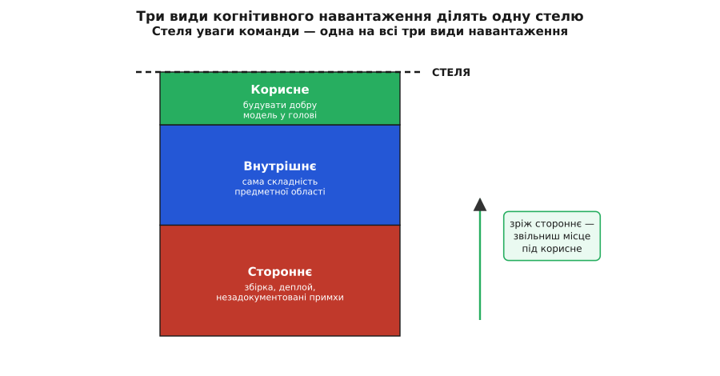
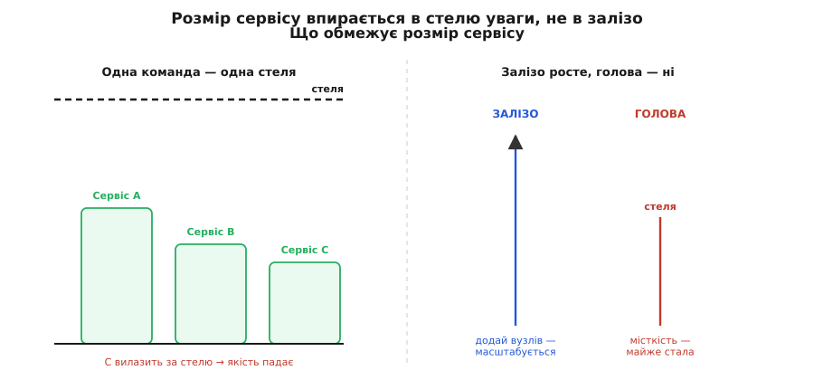
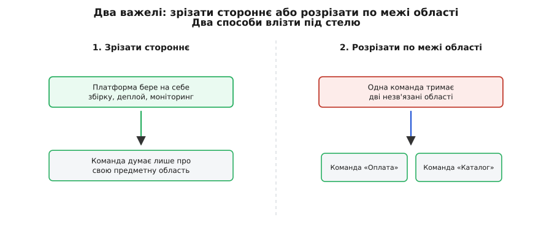

# Когнітивне навантаження команди як межа розміру сервісу

<preknowlist>
- [Роль архітектора](root:sf-apps/architect-role) — навіщо взагалі хтось відповідає за форму системи й межі між частинами, а не лише за код.
- [Якісні атрибути («-ilities»)](root:sf-apps/quality-attributes) — що таке нефункціональна властивість системи і чому вона окрема від функцій.
- [Trade-off-аналіз](root:sf-apps/tradeoff-analysis) — будь-яке рішення платить одним атрибутом за інший; як цю ціну помічати.
- [Закон Конвея](root:sf-apps/conways-law) — форма системи повторює форму команд, які її будують; межі коду тягнуться за межами людей.
</preknowlist>

Коли питають, чому сервіс «завеликий», перше, що спадає на думку, — залізо. Забракло пам'яті, впирається процесор, база не тягне навантаження. Але є інша межа, яку не видно в жодному моніторингу й яка спрацьовує набагато раніше: **скільки цього сервісу здатна тримати в голові команда, що його супроводжує**. Залізо масштабується — додай вузлів, і воно потягне більше. Голова людини не масштабується: скільки понять розробник може одночасно втримати й пов'язати, стільки й може, і додати туди «вузлів» не вийде. Тому справжня стеля розміру сервісу — не технічна, а людська. Розберімо, звідки ця стеля береться, як її виміряти хоча б на око й що з нею робити.

## Чому людська пам'ять — вузьке місце

Мозок працює з новим не всім одразу. Є **робоча пам'ять (англ. *working memory*)** — крихітна швидка «полиця», де в конкретну мить лежить те, чим людина активно оперує. І вона до сміховинного мала. Психолог Джордж Міллер у праці 1956 року «Магічне число сім, плюс-мінус два» оцінив її обсяг приблизно в сім одиниць — але тут одразу дві важливі поправки, які часто пропускають. По-перше, це **не сім будь-чого**, а сім **осмислених згустків (англ. *chunks*)**: досвідчений розробник тримає «черга повідомлень із підтвердженням» як один згусток, новачок — як десяток окремих деталей. По-друге, пізніші виміри опустили це число нижче: Нельсон Кован у 2001-му, прибравши підпірки на кшталт проговорювання про себе, отримав ближче до **чотирьох**. Тобто одночасно активних сутностей людина тримає одиниці, не десятки — це усталений результат когнітивної психології, а не метафора.

Звідси й поняття навантаження. **Когнітивне навантаження (лат. *cognitio* — пізнання)** — це скільки цієї дефіцитної робочої пам'яті з'їдає задача. Термін і теорію ввів педагогічний психолог Джон Свеллер наприкінці 1980-х (перша чітка постановка — 1988), досліджуючи, чому учні гірше вчаться, коли матеріал подано плутано. Його головний висновок прямий: якщо задача вимагає тримати більше згустків, ніж влазить на полицю, людина не «старається слабше» — вона фізично не справляється, помиляється й повільнішає. Полиця переповнилася, і зайве просто падає.

> 🔧 **Навіщо це.** Це пояснює знайоме відчуття, коли після тижня у відпустці повертаєшся до великого сервісу й пів дня «завантажуєш контекст» назад у голову. Ти не тупіший — ти буквально наново набиваєш переповнену полицю. І якщо сервіс такий, що весь його контекст на полицю не влазить узагалі, то це відчуття не минає ніколи: команда постійно працює з переповненою пам'яттю.

## Три види навантаження — і тільки один можна зрізати

Свеллер розрізнив три види навантаження, і для сервісу це розрізнення вирішальне, бо з ними можна робити геть різне.

**Внутрішнє (англ. *intrinsic*)** — складність, вбудована в саму суть задачі. Правила нарахування ПДВ, взаємодія протоколів, узгодженість грошей між рахунками. Його не прибрати, не викинувши саму задачу: якщо предметна область складна, вона складна, і крапка. Це той мінімум, який команда мусить тримати, щоб узагалі розуміти, чим володіє.

**Стороннє (англ. *extraneous*)** — складність, що не належить задачі, а прилипла до неї збоку. Заплутаний процес збірки, деплой у сім ручних кроків, конфіг, розкиданий по п'яти місцях, незадокументована примха «на проді треба ще ось так». Жодне з цього не про предметну область — це шум, який усе одно з'їдає полицю. І головне: **його майже завжди можна зрізати** — заавтоматизувати, задокументувати, сховати за інструментом.

**Корисне (англ. *germane*, від лат. *germanus* — рідний, сутнісний)** — зусилля, що йде на побудову доброї моделі області в голові: зв'язати факти в схему, за якою потім легко орієнтуватися. Це навантаження хороше — саме воно перетворює купу деталей на кілька згустків. Його не зрізають, його **бережуть**: якщо полицю під зав'язку забило стороннім, місця будувати модель не лишається, і команда навіки лишається на рівні «десяток окремих деталей».

Усі три діляться однією стелею — це ключ. Полиця в команди одна, і на ній лежить сума трьох навантажень.



*Три види навантаження ділять одну стелю; зрізаєш стороннє — звільняєш місце під корисне, а внутрішнє лишається як є.*

Звідси випливає вся стратегія. **Внутрішнє** — приймаєш як даність і не даєш команді області більше, ніж влазить. **Стороннє** — воюєш з ним нещадно, бо це чисте марнування дефіцитного ресурсу. **Корисне** — захищаєш, звільняючи під нього місце. Три різні дії на три різні навантаження, і плутати їх — типова помилка: намагатися «спростити» внутрішню складність, викидаючи потрібні правила області (виходить неправильна система), або терпіти стороннє як неминуче (виходить вигоріла команда).

## Чому це і є межа розміру сервісу

Тепер прямий крок від полиці до розміру. Команда відповідає за сервіс — а «відповідати» означає **тримати його в голові достатньо, щоб безпечно міняти**: розуміти, що поламається від правки, де межі, чому воно поводиться саме так. Це розуміння живе на тій самій полиці. І сумарне навантаження всього, чим команда володіє, мусить під ту полицю влазити. Влазить — команда справді керує сервісом. Не влазить — команда лише «супроводжує» його на дотик: боїться чіпати, ламає сусіднє, бо не тримала його в голові, повільнішає й вигорає.



*Сервіс, що вилазить за стелю уваги команди, деградує в якості, хоча заліза йому може вистачати з надлишком.*

Ось чому це саме **межа розміру**, а не абстрактна порада «пишіть простіше». Розмір сервісу тут вимірюється не рядками коду й не запитами за секунду, а **сумою навантаження, яку він накладає на команду**. Два сервіси по 5000 рядків можуть важити для голови зовсім по-різному: один — рівна логіка однієї області, другий — три несумісні області, злиті докупи, плюс власна крива система деплою. Перший на полицю влазить, другий — ні, хоча рядків порівну. І коли він не влазить, жодне залізо не рятує: можна дати сервісу вдесятеро більше пам'яті, а команда все одно не зможе його безпечно розвивати, бо вузьке місце не в машині.

Практичний висновок, який звідси прямо випливає: **межу сервісу проводять по тому, скільки навантаження влазить під стелю однієї команди, а не по тому, що технічно можна скласти в один процес**. Технічно можна злити весь бізнес в один моноліт — але команда його не втримає в голові, і він розсиплеться в якості. Це та сама думка, що стоїть за [підходом Team Topologies](root:sf-apps/team-topologies): команда, орієнтована на потік, має володіти рівно таким шматком, щоб когнітивне навантаження лишалося посильним — і розмір сервісу підганяють під команду, а не команду під сервіс.

## Як оцінити навантаження хоч на око

Точного «навантаженометра» немає — робоча пам'ять не міряється в мегабайтах. Але груба прикидка цілком робоча, і Team Topologies пропонує просту практику: попросити команду оцінити за кожним шматком, який вона тримає, наскільки він посильний — «легко тримаю», «ще тягну», «тону». Три «тону» поспіль — сигнал, що стелю пробито, і формальна метрика тут не потрібна: команда відчуває переповнену полицю тілом.

Друга груба мірка — **кількість незв'язаних областей на одну команду**. Одна зв'язана область (скажімо, вся оплата) — це нормально: усередині неї згустки допомагають одне одному, модель одна. Але дві-три області, що нічим не пов'язані (оплата, і пошук, і розсилки), — це три окремі моделі, кожну треба тримати повною, і вони не діляться згустками. Емпіричне правило з тієї ж практики: одна орієнтована на потік команда добре тримає **одну** предметну область; коли їх стає кілька незв'язаних, навантаження росте не додаванням, а множенням — бо ще й переключення між ними коштує уваги.

І найпоказовіше — розділити внутрішнє від стороннього прямо в коді. Той самий шматок роботи можна написати так, що вся складність на екрані — сутнісна, а можна так, що половину полиці з'їдає антураж. Ось нарахування знижки, потонуле в сторонньому:

:::tabs
```cpp
// Стороннє глушить внутрішнє: логіку знижки видно ледве
double finalPrice(const Order& o) {
    // ручне складання конфігу з трьох джерел просто щоб дізнатися ставку
    const char* env = getenv("DISCOUNT_TIER");
    std::string tier = env ? env : readFile("/etc/app/tier.conf");
    if (tier.empty()) tier = queryDb("SELECT tier FROM cfg LIMIT 1");
    double rate = std::stod(tier);           // а раптом не число — впаде тут
    // ще й ручний перерахунок валюти вкраплено в ту саму функцію
    double usd = o.amount * fetchRate(o.ccy); // мережевий виклик усередині ціни
    return usd - usd * rate;                  // ← а ось це і є вся суть
}
```
```python
# Стороннє глушить внутрішнє: логіку знижки видно ледве
def final_price(o):
    # ручне складання конфігу з трьох джерел просто щоб дізнатися ставку
    tier = os.environ.get("DISCOUNT_TIER") or read_file("/etc/app/tier.conf")
    if not tier:
        tier = query_db("SELECT tier FROM cfg LIMIT 1")
    rate = float(tier)                   # а раптом не число — впаде тут
    # ще й ручний перерахунок валюти вкраплено в ту саму функцію
    usd = o.amount * fetch_rate(o.ccy)   # мережевий виклик усередині ціни
    return usd - usd * rate              # ← а ось це і є вся суть
```
```typescript
// Стороннє глушить внутрішнє: логіку знижки видно ледве
function finalPrice(o: Order): number {
    // ручне складання конфігу з трьох джерел просто щоб дізнатися ставку
    let tier = process.env.DISCOUNT_TIER ?? readFile("/etc/app/tier.conf");
    if (!tier) tier = queryDb("SELECT tier FROM cfg LIMIT 1");
    const rate = Number(tier);            // а раптом не число — буде NaN
    // ще й ручний перерахунок валюти вкраплено в ту саму функцію
    const usd = o.amount * fetchRate(o.ccy); // мережевий виклик усередині ціни
    return usd - usd * rate;              // ← а ось це і є вся суть
}
```
:::

Уся предметна суть — останній рядок: ціна мінус ціна на ставку. Решта — стороннє: діставання конфігу з трьох місць, ручний парсинг, мережа посеред обрахунку ціни. Кожен рядок цього антуражу займає місце на полиці нарівні з логікою. Зріж стороннє — і функція стає рівно тим, чим вона є по суті:

:::tabs
```cpp
// Стороннє винесено назовні; на полиці лишилась сама суть
double finalPrice(const Order& o, double rate, double fxRate) {
    double base = o.amount * fxRate;   // переведено у валюту рахунку
    return base - base * rate;         // знижка — уся логіка тут, і вона одна
}
```
```python
# Стороннє винесено назовні; на полиці лишилась сама суть
def final_price(o, rate, fx_rate):
    base = o.amount * fx_rate      # переведено у валюту рахунку
    return base - base * rate      # знижка — уся логіка тут, і вона одна
```
```typescript
// Стороннє винесено назовні; на полиці лишилась сама суть
function finalPrice(o: Order, rate: number, fxRate: number): number {
    const base = o.amount * fxRate;   // переведено у валюту рахунку
    return base - base * rate;        // знижка — уся логіка тут, і вона одна
}
```
:::

Ставку й курс тепер готує хтось інший (конфіг, окремий сервіс курсів) і подає готовими. Функція знову тримає лише внутрішнє — і місця на полиці під власне область стало помітно більше. Зверни увагу: **складність нікуди не зникла — вона переїхала туди, де їй місце**, під іншу відповідальність. Це і є зрізання стороннього: не «менше роботи взагалі», а «менше не-своєї роботи на цій полиці».

## Що робити зі стелею

Раз стеля стала — під неї влазять двома важелями, і обидва прямо випливають із поділу навантаження.



*Два способи влізти під стелю: зрізати стороннє навантаження або розрізати володіння по межі предметної області.*

**Перший важіль — зрізати стороннє.** Усе, що не про предметну область, — прибрати з полиці команди. Заплутаний деплой сховати за одною кнопкою; конфіг звести в одне місце; примхи середовища заавтоматизувати, а не тримати в чиїйсь пам'яті. У великому масштабі це роблять окремою **платформою**: вона бере на себе типове стороннє (як зібрати, як викотити, як подивитися логи) й віддає командам як готову послугу, щоб ті думали лише про своє. Цей хід — окрема тема [платформної інженерії](root:sf-apps/platform-engineering); суть у тому, що зрізане у всіх командах стороннє звільняє полиці під внутрішнє й корисне одразу всім.

**Другий важіль — розрізати володіння по межі області.** Якщо на команді висять дві незв'язані області, їх розводять на дві команди, кожна зі своєю. Але тут — головна пастка, і без неї важіль стає шкідливим. Різати треба **по справжній межі області**, а не де завгодно: розсічеш посередині зв'язаної логіки — і замість двох легких шматків отримаєш два, що весь час смикають одне одного через межу. Тоді навантаження не впаде, а зросте: до внутрішнього додасться постійна координація. Це прямий наслідок [закону Конвея](root:sf-apps/conways-law) — межі між командами застигають межами в системі, тож проведи їх по лінії реального шва в предметній області, і по обидва боки навантаження справді впаде.

І тут — головна чесність теми, без якої вона перетворюється на догму «дробіть усе на дрібне». **Різати теж не безкоштовно.** Кожен розріз додає межу, а межа — це узгодження форматів, версій, домовленостей між командами; це власне навантаження, тільки іншого роду. Тому мета не «якнайменші сервіси», а **рівно такі, щоб влізти під стелю й не розсікти зв'язане**. Розрізав більше, ніж треба, — заплатив координацією за дроблення, яким ніхто не скористався; це той самий компроміс, що ловить [trade-off-аналіз](root:sf-apps/tradeoff-analysis): виграв у навантаженні на одну команду — заплатив узгодженням між багатьма.

Ось як усі ці нитки сходяться в один хід думки. Розмір сервісу впирається не в залізо, а в те, скільки його влазить на крихітну робочу полицю команди. На полиці лежить сума трьох навантажень: внутрішнє області — приймаєш як даність; стороннє — воюєш і зрізаєш платформою та автоматизацією; корисне — бережеш, звільняючи місце. Коли сума не влазить, сервіс деградує в якості, хоч би скільки йому дали пам'яті, — бо вузьке місце людське. І виправляють це двома важелями: зрізати стороннє й розрізати володіння по справжній межі області — рівно настільки, щоб влізти під стелю, і ні на розріз далі, бо кожен зайвий розріз оплачений координацією. Когнітивне навантаження — не про те, щоб усе було маленьким; воно про те, щоб кожна команда тримала в голові рівно те, чим справді володіє.
