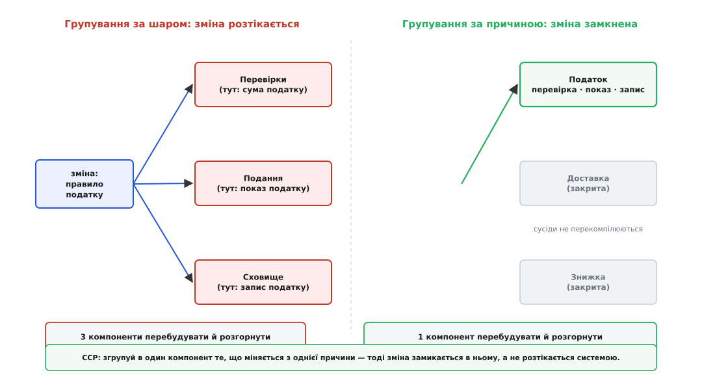
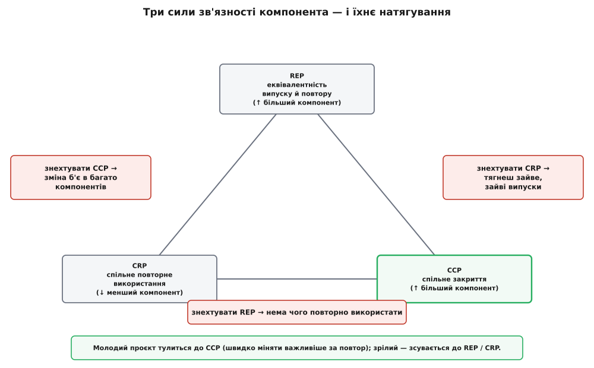

# Принцип спільного закриття (CCP)

<preknowlist>
- [Принцип єдиної відповідальності (SRP)](root:sf-apps/single-responsibility) — «одна причина для зміни» на рівні класу; CCP — це той самий критерій, піднятий на рівень компонента.
- [Принцип відкритості/закритості (OCP)](root:sf-apps/open-closed) — «закритий для змін»; саме звідси слово «закриття» в назві CCP.
- [Зчеплення і зв'язність](root:sf-apps/coupling-cohesion) — дві осі якості дизайну; CCP — це правило зв'язності для компонента, а не для окремого класу.
</preknowlist>

Великий застосунок ніколи не живе одним файлом. Його ріжуть на **компоненти** — одиниці, які збирають і випускають нарізно: пакет, бібліотека (`.jar`, `.dll`, `.so`), модуль усередині моноліта, а на найбільшому масштабі — окрема служба. І щойно код розкладено по таких коробках, постає питання, з якого й починається цей принцип, просте й дуже практичне: **коли приходить зміна, скільки компонентів доведеться відкрити, перезібрати, перевірити наново й перерозгорнути?**

Бо саме тут ховається справжня вартість супроводу. Код сам собою нічого не коштує — він лежить зібраний і працює роками без руху. Гроші й ризик з'являються в мить **зміни**: щоб виправити хай один рядок у компоненті, його треба перекомпілювати, прогнати тести, заново викотити й переконатися, що нічого не обсипалося. Якщо одна-єдина вимога — скажімо, «змінити правило нарахування податку» — змушує залізти у п'ять різних компонентів, у кожному підправити по шматочку, зібрати всі п'ять і задеплоїти всі п'ять, ти платиш уп'ятеро й ризикуєш уп'ятеро. А якщо та сама вимога лягає в **один** компонент, а решта навіть не перекомпілюються, — зміна дешева й безпечна.

Принцип спільного закриття (англ. *Common Closure Principle*, CCP) саме про це: **збери в один компонент класи, що міняються з однієї причини й в один час; розведи по різних компонентах ті, що міняються з різних причин і в різний час.** Його, разом із двома сусідніми принципами, [сформулював Роберт Мартин у середині 1990-х](root:sf-apps/common-closure-principle/hist-ccp-package-principles.md), коли програмісти вперше всерйоз зіткнулися з тим, як краще нарізати систему на окремі одиниці збирання й випуску.

## Одиниця, яку боляче чіпати

Придивімося, чому одиницею тут стає саме компонент, а не клас чи функція. Клас можна змінити й забути — компілятор перебере кілька файлів, і по всьому. Компонент — інша річ: це **межа випуску**. За ним стоїть цикл, який щоразу треба пройти цілком: зібрати артефакт, прогнати його тести, оновити версію, викотити в середовище, перевірити сумісність із тими, хто від нього залежить. Тому справжня ціна зміни вимірюється не рядками коду, а **кількістю компонентів, які ця зміна змусила рухатися**.

І ось де народжується біль. Уяви систему нарахувань, яку розклали на компоненти за **технічним шаром**: усі перевірки — в одному, усе подання (форматування, звіти) — в другому, усе збереження в базу — в третьому. Виглядає охайно, все однорідне лежить разом. Тепер приходить зміна: бухгалтерія змінює правило податку. Де вона осідає? Логіка податку розмазана по всіх трьох шарах — є перевірка суми податку, є його показ у звіті, є його запис у базу. Одна вимога торкається файла в **кожному** з трьох компонентів. Три збирання, три розгортання, тестування взаємодії всіх трьох — і будь-яке може впасти.

```text
Групування за шаром — податок розмазаний по трьох компонентах:

billing/
  validation/    ← перевірки: податку, доставки, знижки
  presentation/  ← показ:     податку, доставки, знижки
  persistence/   ← запис:     податку, доставки, знижки

Зміна правила податку → торкається файла в КОЖНІЙ теці → 3 компоненти перебудувати.
```

Тепер перекладемо ті самі класи так, щоб разом лежало не однорідне, а **те, що міняється разом**. Групуємо за причиною зміни — за бізнес-здатністю:

```text
Групування за причиною зміни — увесь податок в одному компоненті:

billing/
  tax/       ← усе про податок:  перевірка + показ + запис
  shipping/  ← усе про доставку: перевірка + показ + запис
  discount/  ← усе про знижку:   перевірка + показ + запис

Зміна правила податку → лежить у tax/ → 1 компонент; shipping/ і discount/ навіть не чіпаємо.
```

Тепер зміна податку замкнена в компоненті `tax`. Компоненти `shipping` і `discount` до неї байдужі — вони не перекомпілюються, їх не треба перевіряти й перевикочувати. Одна вимога — один випуск. Різниця між двома розкладками — не в кількості коду, вона однакова; різниця в тому, **уздовж якої осі проведено межі**: за схожістю коду (усі перевірки разом) чи за спільністю зміни (усе про податок разом). CCP каже різати за другою.



*Групувати за шаром (ліворуч) — розмазати кожну причину зміни по всіх компонентах: одна вимога рухає три. Групувати за причиною зміни (праворуч) — замкнути її в одному компоненті, і сусіди навіть не перекомпілюються.*

> 🔧 **Навіщо це.** Це прямий важіль швидкості й безпеки випуску. У конвеєрі складання-й-доставки (CI/CD) кожен компонент має власний цикл: зібрати → протестувати → розгорнути. Коли зміна замкнена в одному компоненті, спрацьовує лише його конвеєр — перезбирається й викочується один модуль, решта системи стоїть незаймана, і регресію ганяєш тільки по ньому. Коли ж зміна розповзлася по п'яти компонентах, ти платиш п'ятьма складаннями, п'ятьма розгортаннями й перевіркою їхньої взаємодії — і будь-який із п'яти може впасти. CCP перетворює «одна вимога» на «один випуск».

## «Закриття» — з принципу відкритості/закритості

Звідки в назві дивне слово «закриття»? Воно прийшло прямо з [принципу відкритості/закритості](root:sf-apps/open-closed): код має бути **відкритий для розширення, але закритий для змін** — нову поведінку додаєш, не переписуючи наявну. Ідеал звучить гарно, але має пастку: закритися від **усіх** можливих змін неможливо. Хоч як спроєктуй клас, завжди знайдеться зміна, від якої ти не застрахований, — просто тому, що майбутнього не вгадати наперед. Тож абсолютне закриття — вигадка; реальне закриття завжди **стратегічне**: ти закриваєшся від тих різновидів зміни, які вважаєш імовірними, і лишаєшся відкритим для решти.

CCP бере цю думку й піднімає її на поверх вище. Якщо закритися від усього однаково неможливо, то принаймні влаштуй код так, щоб коли певний різновид зміни таки прийде й змусить щось переписати, **уся ця переробка вмістилася в один компонент**. Класи, які «закриваються» від одного й того самого різновиду зміни, склей в одну коробку — тоді ця зміна знайде їх усіх в одному місці й нікуди більше не дотягнеться. Звідси й назва: спільне закриття — це класи, **закриті спільно, від тих самих різновидів зміни**. Ти не можеш зробити код невразливим до змін; але можеш зробити так, щоб кожен різновид зміни бив рівно в одну мішень.

## Це SRP, піднятий на рівень компонента

Якщо ця логіка здається знайомою — так і є. [Принцип єдиної відповідальності](root:sf-apps/single-responsibility) каже про клас: у нього має бути **одна причина для зміни**, один актор — відділ чи роль, від якої надходить запит на переробку. CCP каже дослівно те саме, лише про більшу одиницю: **у компонента має бути одна причина для зміни**. Та сама вісь — «хто і чому попросить це переписати», — тільки прикладена не до методів у класі, а до класів у компоненті.

Через це CCP часто називають **компонентною формою SRP**, і обидва принципи ловлять одну й ту саму помилку, лише на різних масштабах. У SRP типова пастка — порізати цілісну поведінку за технічними дієсловами (`Validator`, `Formatter`, `Calculator`), хоча всі шматки міняє один актор з однієї причини. У CCP дзеркальна пастка — порізати компоненти за технічними шарами (перевірки, подання, збереження), хоча одна бізнес-зміна тягне за собою всі шари одразу. І там, і там межу провели за **схожістю коду**, а не за **віссю зміни**. Правило одне на обох поверхах: збери докупи те, що міняється разом; розведи те, що міняється окремо. Змінюється лише розмір коробки, на яку ти дивишся.

## Протилежна сила: не тягнути все в купу

Якщо зупинитися на сказаному, легко зробити хибний висновок: «згрупую разом усе, що бодай колись міняється разом, — і буде добре». Доведений до краю, цей хід зліплює всю систему в один велетенський компонент, який справді містить будь-яку зміну, — але користуватися ним неможливо: щоб узяти звідти дрібницю, тягнеш усе. Отже, у CCP є **межа**, і задає її протилежна сила.

Цю силу описує [принцип спільного повторного використання (CRP)](root:sf-apps/common-reuse-principle): **не змушуй користувача залежати від того, чим він не користується** — класи, які застосовують нарізно, і тримати треба нарізно. CRP тягне компоненти в інший бік, ніж CCP: розбивати, робити дрібнішими, щоб той, хто взяв компонент, не тягнув купу зайвого. Поряд стоїть і третій принцип трійці — [еквівалентності повторного використання й випуску (REP)](root:sf-apps/reuse-release-equivalence): одиниця повторного використання дорівнює одиниці випуску; повторно застосувати можна лише те, що випущене й версіоноване як ціле.

Три принципи тягнуть у різні боки. REP і CCP — **об'єднавчі**: вони роблять компонент **більшим** (більше разом випускати, більше разом закривати від зміни). CRP — **роздільний**: він робить компонент **меншим** (менше зайвого тягнути). Тому жоден із трьох не можна вдовольнити повністю, не пожертвувавши іншими, — доводиться шукати рівновагу в трикутнику напруг.



*Три сили зв'язності компонента. Кожна сторона трикутника — ціна відмови від принципу в протилежній вершині: знехтуєш CCP — зміна б'є в багато компонентів; знехтуєш CRP — тягнеш зайве й отримуєш зайві випуски; знехтуєш REP — нема чого повторно використати. Місце в трикутнику зсувається з дозріванням проєкту.*

І тут з'являється найважливіше: **де саме стояти в цьому трикутнику — залежить від зрілості проєкту**. Молодий застосунок нікому ще не потрібен як бібліотека; для нього головне — швидко змінюватися, тому він тулиться до кута CCP: групуй за причиною зміни, зручність розробки важливіша за повторне використання. З роками, коли від твоїх компонентів починають залежати інші команди й продукти, вага переходить до CRP і REP — тепер дороге вже не «змінити», а «затягти зайве й ламати чужі складання». Тому правильна нарізка на компоненти — не вічна: те, що було доброю межею на старті, з дозріванням доводиться пересувати. CCP не дає остаточної відповіді — він дає одну з трьох сил, чию рівновагу тримаєш свідомо.

## Той самий принцип на кожному масштабі

Слово «компонент» тут навмисне широке, бо CCP різатиме код усюди, де є **межа окремого випуску**. У [модульному моноліті](root:sf-apps/modular-monolith) це модуль: складаєш одну програму, але всередині тримаєш межі так, щоб бізнес-зміна лягала в один модуль, а не розповзалася кодовою базою. Коли систему ділять на [мікросервіси](root:sf-apps/microservices), CCP стає однією з головних сил, що визначає межі: служба має володіти однією віссю зміни, щоб бізнес-вимога перерозгортала **одну** службу, а не половину системи одразу. Служба, зроблена за технічним шаром (окремо «сервіс перевірок», окремо «сервіс звітів»), — це та сама помилка розмазаного податку, тільки тепер за кожним «шаром» стоїть мережа, розгортання й окрема команда, і ціна помилки на порядок вища.

Ця згадка про команди не випадкова. [Закон Конвея](root:sf-apps/conways-law) каже, що структура системи повторює структуру організації, яка її будує, — і CCP лягає на це напрочуд точно: «одна причина для зміни» на практиці часто означає «один власник зміни», одна команда чи роль. Компонент, який міняється з однієї причини, природно належить одній команді, і та може випускати його, не узгоджуючись із сусідами. Компонент, у який тягнуть три різні причини від трьох команд, стає місцем постійних зіткнень — не через код, а через людей, змушених ділити одну межу випуску.

Тож насамкінець варто повернутися до питання, з якого почали: коли прийде зміна, скільки коробок доведеться відкрити? CCP дає спосіб зробити цю відповідь якомога ближчою до одиниці. Не групуй за тим, що код схожий; не групуй усе підряд, аби «було разом». Знайди **осі, уздовж яких до системи приходить зміна** — бізнес-здатності, ролі, причини, — і проведи межі компонентів так, щоб кожна така вісь замикалася в одній коробці. Зробиш це чесно — і завтрашня вимога впаде в один компонент, викотиться одним випуском і нікого більше не розбудить. [Повний покроковий розбір такого переносу — від розкладки за шарами до розкладки за причиною зміни, з графом залежностей і підрахунком того, що доведеться перезбирати, — винесено в окремий розбір-проєкт](root:sf-apps/common-closure-principle/proj-regroup-by-change.md).
