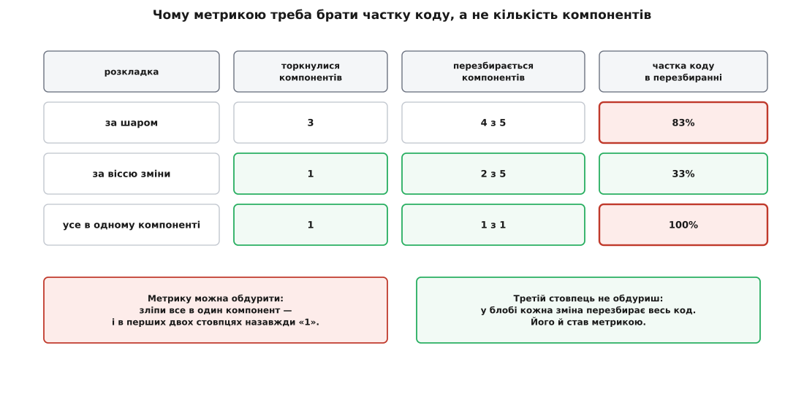

# ⚙️ Перекладаємо компоненти за віссю зміни

## Задача

Є підсистема нарахувань: дванадцять файлів, розкладених за технічною роллю коду. Перевірки лежать у `validation`, форматування — у `presentation`, запис у базу — у `persistence`, спільні типи грошей і замовлення — у `model`, а зверху `api/checkout.ts` збирає все докупи. Це звичайна [шарова розкладка](root:sf-apps/layered-architecture): кожен шар тримає однорідний код і спирається на той, що нижче. Виглядає вона так:

```text
src/
  model/         money.ts          order.ts
  validation/    tax-rules.ts      shipping-rules.ts   discount-rules.ts
  presentation/  tax-view.ts       shipping-view.ts    discount-view.ts
  persistence/   tax-repo.ts       shipping-repo.ts    discount-repo.ts
  api/           checkout.ts
```

Проблему в команді знають на дотик: бухгалтерія міняє правило податку приблизно раз на місяць, і щоразу доводиться лізти в три різні теки. Відчуття, що це дорого, є — але відчуття не понесеш на планування. Потрібне число: **скільки насправді коштує одна така зміна, і скільки коштувала б, якби компоненти були нарізані інакше.**

Звідси три підзадачі, і кожна вимагає окремого інструмента. Перша — **порахувати чесну ціну зміни в теперішній розкладці**; не «три теки», а скільки коду через це доведеться перезібрати й перевірити. Друга — **знайти осі, уздовж яких зміна приходить до системи**; не вгадати їх за назвами тек, а витягти з того єдиного джерела, яке пам'ятає всі зміни насправді, — з історії репозиторію. Третя — **перенести й перерахувати**, щоб різниця була не обіцянкою, а виміром до й після.

Зробимо всі три. На виході буде дві невеликі програми, які можна запустити на своєму репозиторії сьогодні, і чесна відповідь на питання, скільки коробок відкриває одна вимога.

## Ідея: ціна зміни — це замикання, а не діф

Найпростіша спокуса — рахувати компоненти, у які довелося залізти. Діф показує три теки, отже, ціна три. Це число неправильне, і помиляється воно завжди в один бік — применшує.

Бо конвеєр перезбирає не те, що ти редагував. Він перезбирає ще й усіх, хто від зміненого залежить: якщо `api/checkout.ts` імпортує `validation/tax-rules.ts`, то будь-яка правка в `validation` робить `api` підозрілим — його треба перекомпілювати й перевірити наново, навіть якщо жоден його рядок не змінився. А далі те саме стосується тих, хто залежить від `api`. Тобто ціна — це не множина відредагованого, а її **транзитивне замикання вгору по стрілках залежності**: усі, до кого зміна може докотитися.

> 🔧 **Навіщо це.** Замикання — це і є те, за що ти платиш часом і ризиком. У [конвеєрі складання й доставки](root:sf-release/ci-cd) кожен компонент проходить свій цикл: зібрати → протестувати → розгорнути. Конвеєр не вміє знати, що правка ставки податку «насправді нешкідлива» для `api`, — він бачить лише ребро залежності й чесно перезбирає все, що за ним. Тому радіус замикання прямо переводиться в хвилини очікування, у кількість тестів, які мусять зійтися, і в кількість місць, де сьогоднішній випуск може впасти. Порахувати замикання — значить порахувати рахунок наперед.

Друга ідея стосується осей. Питання «що тут міняється разом» звучить як предмет для наради, але насправді відповідь уже записана — у git. Коміт — це майже ідеальна одиниця «однієї причини»: людина сіла, зробила одну справу, зафіксувала. Отже, якщо два файли з місяця в місяць потрапляють в один коміт, вони міняються з однієї причини — незалежно від того, у які теки їх колись розклали. Ця думка не нова: [Гаральд Галль, Карін Гаєк і Мехді Джазаєрі — усі троє тоді у Віденському технічному університеті](https://doi.org/10.1109/ICSM.1998.738508) описали її на конференції ICSM 1998 (с. 190–198) під назвою **логічне зчеплення** (англ. *logical coupling*) — зв'язок, якого не видно в коді, але який видно в історії випусків. Статус твердження — усталений факт: стаття має DOI, індексована в Crossref і dblp та зібрала понад чотириста посилань.

Третя ідея — про те, чим міряти. Але вона краще читається після того, як перші дві дадуть числа, тож поки що відкладемо.

## Крок 1. Скільки коштує зміна зараз

Перший інструмент будує граф компонентів із самих імпортів і рахує замикання. Компонент тут — перший сегмент шляху під `src/`: це та сама межа, за якою в справжньому репозиторії стоїть окремий пакет зі своїм `package.json` і своїм рядком у конвеєрі.

Мова аналізатора ні до чого не зобов'язує: він читає чужі файли як текст, тож на Java-репозиторії той самий інструмент працюватиме, щойно підміниш взірець імпорту на `import x.y.Z;`. Нижче два ідіоматичні двійники — на TypeScript, якщо інструмент має жити в тому самому конвеєрі, що й код, і на Python, якщо це разові розкопки збоку. Вивід у них однаковий до рядка.

:::tabs
```ts
// tools/cost.ts — ціна зміни: граф компонентів + замикання перезбирання
import { readdirSync, readFileSync, existsSync, statSync } from 'node:fs';
import { join, resolve, dirname, relative } from 'node:path';

const SRC = resolve('src');
const IMPORT_RE = /\bfrom\s*['"]([^'"]+)['"]|\brequire\(\s*['"]([^'"]+)['"]\s*\)/g;

/** компонент файла = перший сегмент шляху під src/ */
const componentOf = (file: string): string =>
  relative(SRC, resolve(file)).split(/[\\/]/)[0];

function sources(dir = SRC, acc: string[] = []): string[] {
  for (const name of readdirSync(dir)) {
    const p = join(dir, name);
    if (statSync(p).isDirectory()) sources(p, acc);
    else if (/\.tsx?$/.test(name) && !name.endsWith('.d.ts')) acc.push(p);
  }
  return acc;
}

/** './x' → абсолютний шлях файла; зовнішній пакет → null (поза нашим графом) */
function resolveSpec(from: string, spec: string): string | null {
  if (!spec.startsWith('.')) return null;
  const base = resolve(dirname(from), spec);
  for (const c of [base, `${base}.ts`, `${base}.tsx`, join(base, 'index.ts')])
    if (existsSync(c) && statSync(c).isFile()) return c;
  return null;
}

/** size: компонент → скільки файлів; deps: компонент → на кого спирається */
function scan() {
  const size = new Map<string, number>();
  const deps = new Map<string, Set<string>>();

  for (const file of sources()) {
    const here = componentOf(file);
    size.set(here, (size.get(here) ?? 0) + 1);
    if (!deps.has(here)) deps.set(here, new Set());

    for (const m of readFileSync(file, 'utf8').matchAll(IMPORT_RE)) {
      const target = resolveSpec(file, m[1] ?? m[2]);
      if (!target) continue;
      const to = componentOf(target);
      if (to !== here) deps.get(here)!.add(to);   // ребро лише МІЖ компонентами
    }
  }
  return { size, deps };
}

/** зворотні ребра: хто чекає перезбирання, коли міняється X */
function reverse(deps: Map<string, Set<string>>) {
  const rev = new Map<string, Set<string>>();
  for (const c of deps.keys()) rev.set(c, new Set());
  for (const [from, tos] of deps)
    for (const to of tos) rev.get(to)!.add(from);
  return rev;
}

/** транзитивне замикання вгору — саме це перезбере конвеєр */
function rebuildSet(rev: Map<string, Set<string>>, touched: Iterable<string>) {
  const out = new Set(touched);
  const stack = [...out];
  while (stack.length) {
    for (const up of rev.get(stack.pop()!) ?? [])
      if (!out.has(up)) { out.add(up); stack.push(up); }
  }
  return out;
}

export function cost(changed: string[]) {
  const { size, deps } = scan();
  const touched = new Set(changed.map(componentOf));
  const rebuilt = rebuildSet(reverse(deps), touched);
  const total = [...size.values()].reduce((a, b) => a + b, 0);
  const hit = [...rebuilt].reduce((a, c) => a + (size.get(c) ?? 0), 0);
  return { touched, rebuilt, components: size.size, hit, total };
}

const r = cost(process.argv.slice(2));
const list = (s: Set<string>) => [...s].sort().join(', ');
console.log(`торкнулися компонентів : ${r.touched.size}  (${list(r.touched)})`);
console.log(`перезбирається         : ${r.rebuilt.size} з ${r.components}  (${list(r.rebuilt)})`);
console.log(`файлів у перезбиранні  : ${r.hit} з ${r.total} = ${Math.round((r.hit / r.total) * 100)}%`);
```
```python
# tools/cost.py — ціна зміни: граф компонентів + замикання перезбирання
import re
import sys
from pathlib import Path

SRC = Path("src").resolve()
IMPORT_RE = re.compile(r"""\bfrom\s*['"]([^'"]+)['"]|\brequire\(\s*['"]([^'"]+)['"]\s*\)""")


def component_of(file: Path) -> str:
    """компонент файла = перший сегмент шляху під src/"""
    return file.resolve().relative_to(SRC).parts[0]


def resolve_spec(src_file: Path, spec: str) -> Path | None:
    """'./x' → шлях файла; зовнішній пакет → None (поза нашим графом)"""
    if not spec.startswith("."):
        return None
    base = (src_file.parent / spec).resolve()
    for cand in (base, base.with_name(base.name + ".ts"),
                 base.with_name(base.name + ".tsx"), base / "index.ts"):
        if cand.is_file():
            return cand
    return None


def scan() -> tuple[dict[str, int], dict[str, set[str]]]:
    """size: компонент → скільки файлів; deps: компонент → на кого спирається"""
    size: dict[str, int] = {}
    deps: dict[str, set[str]] = {}

    for file in sorted([*SRC.rglob("*.ts"), *SRC.rglob("*.tsx")]):
        if file.name.endswith(".d.ts"):
            continue
        here = component_of(file)
        size[here] = size.get(here, 0) + 1
        deps.setdefault(here, set())

        for m in IMPORT_RE.finditer(file.read_text(encoding="utf-8")):
            target = resolve_spec(file, m.group(1) or m.group(2))
            if target and (to := component_of(target)) != here:
                deps[here].add(to)          # ребро лише МІЖ компонентами
    return size, deps


def reverse(deps: dict[str, set[str]]) -> dict[str, set[str]]:
    """зворотні ребра: хто чекає перезбирання, коли міняється X"""
    rev: dict[str, set[str]] = {c: set() for c in deps}
    for frm, tos in deps.items():
        for to in tos:
            rev[to].add(frm)
    return rev


def rebuild_set(rev: dict[str, set[str]], touched: set[str]) -> set[str]:
    """транзитивне замикання вгору — саме це перезбере конвеєр"""
    out, stack = set(touched), list(touched)
    while stack:
        for up in rev.get(stack.pop(), ()):
            if up not in out:
                out.add(up)
                stack.append(up)
    return out


def cost(changed: list[str]) -> dict:
    size, deps = scan()
    touched = {component_of(Path(p)) for p in changed}
    rebuilt = rebuild_set(reverse(deps), touched)
    total = sum(size.values())
    hit = sum(size.get(c, 0) for c in rebuilt)
    return {"touched": touched, "rebuilt": rebuilt,
            "components": len(size), "hit": hit, "total": total}


if __name__ == "__main__":
    r = cost(sys.argv[1:])
    lst = lambda s: ", ".join(sorted(s))
    print(f"торкнулися компонентів : {len(r['touched'])}  ({lst(r['touched'])})")
    print(f"перезбирається         : {len(r['rebuilt'])} з {r['components']}  ({lst(r['rebuilt'])})")
    print(f"файлів у перезбиранні  : {r['hit']} з {r['total']} = {round(r['hit'] / r['total'] * 100)}%")
```
:::

Згодовуємо йому файли, які торкає типова зміна податку:

```text
$ node tools/cost.ts src/validation/tax-rules.ts \
                     src/presentation/tax-view.ts \
                     src/persistence/tax-repo.ts

торкнулися компонентів : 3  (persistence, presentation, validation)
перезбирається         : 4 з 5  (api, persistence, presentation, validation)
файлів у перезбиранні  : 10 з 12 = 83%
```

Ось і перше чесне число. Відчуття казало «три теки» — і воно применшувало: перезбирається чотири компоненти з п'яти, а це 83% усього коду підсистеми. Зайвий, четвертий, — `api`, якого ніхто не редагував: він просто спирається на все, чого торкнулися.

**Умова.** Порахуймо ці 83% руками, щоб число не лишалося чорною скринькою.

```text
Ребра графа (X → Y означає «X імпортує Y»):
  validation   → model
  persistence  → model
  presentation → model, validation
  api          → model, validation, persistence, presentation

Зворотні ребра (хто чекає перезбирання, коли міняється X):
  model        ← validation, persistence, presentation, api
  validation   ← presentation, api
  persistence  ← api
  presentation ← api
  api          ← —

Зміна податку відредагувала файли у трьох компонентах:
  торкнулися = {validation, presentation, persistence}

Замикання вгору — додаємо залежних, доки додається бодай хтось:
  крок 0: {validation, presentation, persistence}
  крок 1: validation   ← presentation (уже в множині), api  → +api
          presentation ← api (уже додали)
          persistence  ← api (уже додали)
  крок 2: api          ← —                                  → нічого нового
  замикання = {validation, presentation, persistence, api} = 4 з 5

Файли в замиканні:
  validation 3 + presentation 3 + persistence 3 + api 1 = 10
  усього файлів у src/                                  = 12
  частка = 10 / 12 = 0.8333… ≈ 83%
```

Висновок: одна вимога від бухгалтерії піднімає 83% коду підсистеми. Не тому, що там багато роботи, а тому, що логіка податку розкидана по трьох компонентах, і кожен із них тягне за собою `api`.

## Крок 2. Осі зміни лежать в історії

Тепер друге питання: якщо різати не за шаром, то за чим? Спокуса — вигадати нарізку на нараді. Але в репозиторії вже лежить відповідь, зібрана з реальних змін за півтора року.

Інструмент рахує, скільки разів кожна пара файлів потрапила в один коміт, і ділить це на кількість комітів, де змінився бодай один із пари, — коефіцієнт Жаккара. Пари, міцніші за поріг, зливаються в осі через union-find. Три фільтри роблять сигнал придатним: **вікно** (осі старші за півтора року вже не ті), **стеля на ширину коміту** (правка форматування на весь `src/` зв'язала б усе з усім) і **мінімальна підтримка** (одноразовий збіг — це не вісь).

:::tabs
```ts
// tools/axes.ts — осі зміни: які файли історія вперто міняє разом
import { execFileSync } from 'node:child_process';

const WINDOW = '18 months ago';  // осі старші за півтора року вже не ті
const MAX_FILES = 8;             // ширший коміт — це рефактор, а не «одна причина»
const MIN_SUPPORT = 3;           // рідше — випадковий збіг
const MIN_STRENGTH = 0.4;        // частка спільних комітів (Жаккар)

function history(): string[][] {
  const raw = execFileSync('git', [
    'log', `--since=${WINDOW}`, '--no-merges', '-M',
    '--name-only', '--pretty=format:%x00',
  ], { encoding: 'utf8', maxBuffer: 1 << 26 });

  return raw.split('\0')
    .map(block => [...new Set(block.split('\n').filter(l => /^src\/.+\.tsx?$/.test(l)))].sort())
    .filter(files => files.length > 1 && files.length <= MAX_FILES);
}

/** total: файл → скільки разів мінявся; pair: пара → скільки разів разом */
function coChange(commits: string[][]) {
  const total = new Map<string, number>();
  const pair = new Map<string, number>();

  for (const files of commits) {
    for (const f of files) total.set(f, (total.get(f) ?? 0) + 1);
    for (let i = 0; i < files.length; i++)
      for (let j = i + 1; j < files.length; j++) {
        const k = `${files[i]}\0${files[j]}`;
        pair.set(k, (pair.get(k) ?? 0) + 1);
      }
  }
  return { total, pair };
}

function strongPairs(total: Map<string, number>, pair: Map<string, number>) {
  const out: { strength: number; a: string; b: string }[] = [];
  for (const [k, both] of pair) {
    if (both < MIN_SUPPORT) continue;
    const [a, b] = k.split('\0');
    const either = total.get(a)! + total.get(b)! - both;   // Жаккар: разом / бодай раз
    const strength = both / either;
    if (strength >= MIN_STRENGTH) out.push({ strength, a, b });
  }
  return out.sort((x, y) =>
    y.strength - x.strength || x.a.localeCompare(y.a) || x.b.localeCompare(y.b));
}

/** зливаємо сильні пари в осі — класичний union-find */
function cluster(pairs: { a: string; b: string }[], files: Iterable<string>) {
  const parent = new Map<string, string>();
  const find = (x: string): string => {
    if (!parent.has(x)) parent.set(x, x);
    if (parent.get(x) !== x) parent.set(x, find(parent.get(x)!));
    return parent.get(x)!;
  };
  for (const { a, b } of pairs) parent.set(find(a), find(b));

  const groups = new Map<string, string[]>();
  for (const f of files) {
    const root = find(f);
    if (!groups.has(root)) groups.set(root, []);
    groups.get(root)!.push(f);
  }
  return [...groups.values()].filter(g => g.length > 1).sort((a, b) => b.length - a.length);
}

const { total, pair } = coChange(history());
const pairs = strongPairs(total, pair);

console.log(`пари, що міняються разом (сила ≥ ${MIN_STRENGTH}):`);
for (const { strength, a, b } of pairs)
  console.log(`  ${strength.toFixed(2)}  ${a}  ↔  ${b}`);

console.log('\nосі зміни:');
for (const [i, axis] of cluster(pairs, total.keys()).entries()) {
  console.log(`  вісь #${i + 1} — файлів: ${axis.length}`);
  for (const f of axis.sort()) console.log(`      ${f.padEnd(36)} змін: ${total.get(f)}`);
}
```
```python
# tools/axes.py — осі зміни: які файли історія вперто міняє разом
import re
import subprocess
from collections import defaultdict
from itertools import combinations

WINDOW = "18 months ago"   # осі старші за півтора року вже не ті
MAX_FILES = 8              # ширший коміт — це рефактор, а не «одна причина»
MIN_SUPPORT = 3            # рідше — випадковий збіг
MIN_STRENGTH = 0.4         # частка спільних комітів (Жаккар)

SRC_RE = re.compile(r"^src/.+\.tsx?$")


def history() -> list[list[str]]:
    raw = subprocess.run(
        ["git", "log", f"--since={WINDOW}", "--no-merges", "-M",
         "--name-only", "--pretty=format:%x00"],
        capture_output=True, text=True, check=True).stdout

    commits = []
    for block in raw.split("\0"):
        files = sorted({l for l in block.split("\n") if SRC_RE.match(l)})
        if 1 < len(files) <= MAX_FILES:
            commits.append(files)
    return commits


def co_change(commits: list[list[str]]):
    """total: файл → скільки разів мінявся; pair: пара → скільки разів разом"""
    total, pair = defaultdict(int), defaultdict(int)
    for files in commits:
        for f in files:
            total[f] += 1
        for a, b in combinations(files, 2):     # files відсортовані → ключ стабільний
            pair[a, b] += 1
    return total, pair


def strong_pairs(total, pair) -> list[tuple[float, str, str]]:
    out = []
    for (a, b), both in pair.items():
        either = total[a] + total[b] - both     # Жаккар: разом / бодай раз
        strength = both / either
        if both >= MIN_SUPPORT and strength >= MIN_STRENGTH:
            out.append((strength, a, b))
    return sorted(out, key=lambda t: (-t[0], t[1], t[2]))


def cluster(pairs, files) -> list[list[str]]:
    """зливаємо сильні пари в осі — класичний union-find"""
    parent = {f: f for f in files}

    def find(x):
        while parent[x] != x:
            parent[x] = parent[parent[x]]        # стиснення шляху
            x = parent[x]
        return x

    for _, a, b in pairs:
        parent[find(a)] = find(b)

    groups = defaultdict(list)
    for f in files:
        groups[find(f)].append(f)
    return sorted((g for g in groups.values() if len(g) > 1), key=len, reverse=True)


if __name__ == "__main__":
    total, pair = co_change(history())
    pairs = strong_pairs(total, pair)

    print(f"пари, що міняються разом (сила ≥ {MIN_STRENGTH}):")
    for strength, a, b in pairs:
        print(f"  {strength:.2f}  {a}  ↔  {b}")

    print("\nосі зміни:")
    for i, axis in enumerate(cluster(pairs, list(total)), 1):
        print(f"  вісь #{i} — файлів: {len(axis)}")
        for f in sorted(axis):
            print(f"      {f:<36} змін: {total[f]}")
```
:::

Запускаємо — і репозиторій сам розповідає, як він насправді влаштований:

```text
$ node tools/axes.ts

пари, що міняються разом (сила ≥ 0.4):
  1.00  src/model/money.ts  ↔  src/model/order.ts
  1.00  src/presentation/discount-view.ts  ↔  src/validation/discount-rules.ts
  0.86  src/persistence/tax-repo.ts  ↔  src/presentation/tax-view.ts
  0.83  src/persistence/shipping-repo.ts  ↔  src/validation/shipping-rules.ts
  0.80  src/persistence/shipping-repo.ts  ↔  src/presentation/shipping-view.ts
  0.78  src/presentation/tax-view.ts  ↔  src/validation/tax-rules.ts
  0.75  src/persistence/discount-repo.ts  ↔  src/presentation/discount-view.ts
  0.75  src/persistence/discount-repo.ts  ↔  src/validation/discount-rules.ts
  0.67  src/persistence/tax-repo.ts  ↔  src/validation/tax-rules.ts
  0.67  src/presentation/shipping-view.ts  ↔  src/validation/shipping-rules.ts

осі зміни:
  вісь #1 — файлів: 3
      src/persistence/tax-repo.ts          змін: 6
      src/presentation/tax-view.ts         змін: 7
      src/validation/tax-rules.ts          змін: 9
  вісь #2 — файлів: 3
      src/persistence/discount-repo.ts     змін: 6
      src/presentation/discount-view.ts    змін: 8
      src/validation/discount-rules.ts     змін: 8
  вісь #3 — файлів: 3
      src/persistence/shipping-repo.ts     змін: 5
      src/presentation/shipping-view.ts    змін: 4
      src/validation/shipping-rules.ts     змін: 6
  вісь #4 — файлів: 2
      src/model/money.ts                   змін: 3
      src/model/order.ts                   змін: 3
```

Придивися до списку пар: **жодна сильна пара не лежить усередині шару**. Немає зв'язку `tax-rules ↔ shipping-rules`, хоча обидва — «перевірки» й лежать в одній теці. Зате `tax-rules ↔ tax-view` тримається на 0.78, а `tax-view ↔ tax-repo` — на 0.86, і ці файли розкидані по трьох різних теках. Тобто межі тек проведено **поперек** справжніх ліній зчеплення: усередині компонента лежить код, що майже ніколи не міняється разом, а те, що міняється разом, розтягнуто по трьох компонентах.

Кожна знайдена вісь — це готова пропозиція компонента, і три з них очевидні: податок, знижка, доставка. Четверта цікавіша: `model/money.ts` і `model/order.ts` теж міняються разом і ні з чим більше — тобто `model` уже є чесним компонентом зі своєю власною причиною зміни, і чіпати його не треба. А `api/checkout.ts` не потрапив у жодну вісь: він мінявся сам по собі й ні з ким стійко не в парі. Це теж відповідь — у нього своя, окрема причина для зміни.

## Крок 3. Перенос

Осі відомі, тож перенос стає механічним. Важлива лише одна річ, і вона неочевидна: **перенос і правки мають бути різними комітами.**

Причина в тому, як git улаштований усередині. Він **не зберігає перейменувань**. `git mv` — це не окрема операція, а звичайні «видалити тут, додати там»; перейменування git **впізнає заднім числом**, коли ти читаєш історію, порівнюючи вміст файлів. Поріг схожості — 50%: якщо новий файл більш ніж наполовину збігається зі зниклим, git вважає це перейменуванням. З версії 2.9 (2016) розпізнавання ввімкнене в `git diff` і `git log` без прапорців, а `-M` дає його явно й дозволяє змінити поріг. Наслідок практичний: якщо в одному коміті і перенести файл, і суттєво переписати, схожість упаде нижче порогу — і слід обірветься. Тому:

```bash
mkdir -p src/tax src/shipping src/discount

# 1. ЛИШЕ перенос — жодного рядка не чіпаємо
for axis in tax shipping discount; do
  git mv "src/validation/$axis-rules.ts"  "src/$axis/rules.ts"
  git mv "src/presentation/$axis-view.ts" "src/$axis/view.ts"
  git mv "src/persistence/$axis-repo.ts"  "src/$axis/repo.ts"
done
git commit -m "move: компоненти за віссю зміни (лише перенос, без правок)"

# 2. ОКРЕМИМ комітом — полагодити шляхи імпортів
#    ../validation/tax-rules → ./rules  тощо
git commit -am "fix: шляхи імпортів після переносу"
```

Перевіряємо, що слід чистий:

```text
$ git show --name-status -M --pretty=format:'%s' HEAD~1 | head -4
move: компоненти за віссю зміни (лише перенос, без правок)
R100    src/persistence/discount-repo.ts    src/discount/repo.ts
R100    src/validation/discount-rules.ts    src/discount/rules.ts
R100    src/presentation/discount-view.ts   src/discount/view.ts
```

`R100` — перейменування зі стовідсотковою схожістю, бо вміст не чіпали. Історія кожного файла лишилася доступною, і наступний скаут по осях зможе її прочитати.

Нова розкладка:

```text
src/
  model/     money.ts    order.ts
  tax/       rules.ts    view.ts    repo.ts
  shipping/  rules.ts    view.ts    repo.ts
  discount/  rules.ts    view.ts    repo.ts
  api/       checkout.ts
```

Файлів так само дванадцять — не додали й не викинули жодного рядка. Але подивись, що сталося з одним конкретним імпортом. Було:

```ts
// src/presentation/tax-view.ts
import { TaxBreakdown } from '../validation/tax-rules';   // ребро presentation → validation
```

Стало:

```ts
// src/tax/view.ts
import { TaxBreakdown } from './rules';                    // ребра немає: це той самий компонент
```

Ось де ховається весь виграш. Перенос не прибрав жодної залежності в коді — `view` як залежав від `rules`, так і залежить. Він **прибрав ребро з графа компонентів**: залежність, яка була міжкомпонентною, стала внутрішньою. А замикання рахується саме по міжкомпонентних ребрах — тому воно й стискається.

## Крок 4. Рахуємо наново

Той самий інструмент, та сама зміна податку, нові шляхи:

```text
$ node tools/cost.ts src/tax/rules.ts src/tax/view.ts src/tax/repo.ts

торкнулися компонентів : 1  (tax)
перезбирається         : 2 з 5  (api, tax)
файлів у перезбиранні  : 4 з 12 = 33%
```

83% → 33%. Та сама вимога, той самий код, той самий обсяг роботи для програміста — але конвеєр тепер піднімає у два з половиною раза менше коду.


*Перезбирається не те, що відредаговано, а транзитивне замикання вгору по стрілках. Ліворуч зміна податку сидить у трьох компонентах одразу й тягне за собою `api`; праворуч вона замкнена в `tax`, а `shipping`, `discount` і `model` лишаються поза радіусом.*

Тільки не спокушаймося числом надто рано — перевірмо той самий інструмент з іншого боку. Що коштує зміна в `model`?

```text
$ node tools/cost.ts src/model/money.ts

торкнулися компонентів : 1  (model)
перезбирається         : 5 з 5  (api, discount, model, shipping, tax)
файлів у перезбиранні  : 12 з 12 = 100%
```

Сто відсотків — і до переносу, і після. Перенос за віссю зміни не зробив із цим нічого й не міг: `model` — спільне ядро, від нього залежать усі, і будь-яка правка в ньому піднімає геть усе. Це не вада розкладки, це властивість ядра. Саме тому в ядро кладуть те, що майже не міняється (тут — три правки за півтора року), і саме тому кожна нова абстракція, яку туди тягнуть «щоб було під рукою», коштує дорожче, ніж здається.

## Складність і пастки

### Перші дві метрики легко обдурити

Тепер повернімося до відкладеного питання: чим саме міряти. Ми надрукували три числа — скільки компонентів торкнулися, скільки перезбирається, яка частка коду. Виглядають вони як три погляди на одне. Але вони не рівноцінні, і різницю видно, щойно спробуєш метрику зламати.

Зліпимо всю підсистему в один компонент `billing/` — усі дванадцять файлів в одну теку — і поміряємо ту саму зміну податку:

```text
$ node tools/cost.ts src/billing/tax-rules.ts src/billing/tax-view.ts src/billing/tax-repo.ts

торкнулися компонентів : 1  (billing)
перезбирається         : 1 з 1  (billing)
файлів у перезбиранні  : 12 з 12 = 100%
```

За першими двома числами блоб — ідеал: торкнулися одного компонента, перезбирається один, краще не буває. За третім — катастрофа: кожна зміна піднімає весь код. І так буде **завжди**, для будь-якої вимоги: у блобі неможливо змінити щось, не перезібравши все.



*Перші дві метрики не відрізняють добру нарізку від блоба — обидві дають «1». Третя відрізняє: 33% проти 100%.*

Мораль стосується не тільки цих трьох чисел. Метрика «скільки компонентів рухається» винагороджує **укрупнення** — а укрупнення можна довести до абсурду безкоштовно, просто прибравши межі. Метрика «яка частка коду рухається» цього не дозволяє: прибрав межу — і частка стрибнула до 100%. Тому в конвеєр треба ставити третій стовпець, а перші два лишити як діагностику — вони добре показують, *чому* число велике, але не годяться як ціль.

### Історія прив'язана до шляхів — а ти щойно змінив шляхи

Найкоротший шлях зіпсувати собі інструмент — запустити скаут осей одразу після переносу:

```text
$ node tools/axes.ts

осі зміни:
  вісь #1 — файлів: 3
      src/persistence/tax-repo.ts          змін: 6
      src/presentation/tax-view.ts         змін: 7
      src/validation/tax-rules.ts          змін: 9
```

Теки `src/validation/` на диску вже немає — а інструмент упевнено про неї звітує. Нічого дивного: він читає історію, а історія зберігає ті шляхи, які були на момент коміту. Вийшла пастка з присмаком іронії — інструмент, який підказав перенос, після переносу осліп саме на тому коді, який перенесли.

Наслідки не косметичні. `git log -- src/tax/rules.ts` без додаткових прапорців покаже **один** коміт замість п'ятнадцяти: для git це новий шлях, який щойно з'явився. Історія нікуди не поділася, але дістати її треба вміти — і `--follow`, який уміє йти крізь перейменування, працює лише для одного шляху за раз, тож для аналізу всього репозиторію не годиться.

Лікується це тим самим механізмом, який git використовує сам: беремо в нього список розпізнаних перейменувань і зводимо старі шляхи до теперішніх:

```ts
// tools/renames.ts — старий шлях → теперішній, зібране з R-записів git
import { execFileSync } from 'node:child_process';

export function renameMap(): Map<string, string> {
  const raw = execFileSync('git', [
    'log', '--name-status', '-M', '--diff-filter=R', '--pretty=format:', '--reverse',
  ], { encoding: 'utf8', maxBuffer: 1 << 26 });

  const step = new Map<string, string>();          // одне перейменування
  for (const line of raw.split('\n')) {
    const m = /^R\d*\t(.+)\t(.+)$/.exec(line);     // рядок виду «R100  старий  новий»
    if (m) step.set(m[1], m[2]);
  }

  // стиснути ланцюжок a→b→c до a→c; seen рятує від циклу a→b→a
  const final = (p: string): string => {
    const seen = new Set<string>();
    while (step.has(p) && !seen.has(p)) { seen.add(p); p = step.get(p)!; }
    return p;
  };
  return new Map([...step.keys()].map(k => [k, final(k)]));
}

const renames = renameMap();
export const canon = (file: string): string => renames.get(file) ?? file;
```

Далі досить пропустити крізь `canon` кожен шлях, що приходить з історії, — в `axes.ts` це один додаток у `history()`:

```ts
.filter(l => /^src\/.+\.tsx?$/.test(l)).map(canon)
```

І скаут прозріває:

```text
осі зміни:
  вісь #1 — файлів: 3
      src/discount/repo.ts                 змін: 6
      src/discount/rules.ts                змін: 8
      src/discount/view.ts                 змін: 9
```

Ті самі осі, теперішні шляхи. Заразом стає видно, навіщо потрібен був чистий коміт-перенос: `canon` живиться саме R-записами, а вони існують тільки тому, що схожість трималася на 100%. Змішав би перенос із правками — не було б ні R-записів, ні цієї латки.

### Граф імпортів — не граф залежностей

Інструмент бачить рівно те, що написано в `import`. Це менше, ніж справжня залежність, і водночас більше — тобто бреше в обидва боки, і треба знати, куди саме.

**Применшує** там, де зв'язок робиться в час виконання. Якщо `api` дістає реалізацію податку з контейнера впорскування залежностей за рядковим токеном, імпорту немає — і ребра в графі немає теж. Але зміна в `tax` так само зламає `api`, просто конвеєр цього не передбачить, а дізнається на тестах. Те саме з подієвою шиною, з викликами через мережу, з рефлексією: усе, що зв'язується не іменем типу, а рядком, для аналізатора невидиме.

**Перебільшує** там, де імпорт існує лише для перевірки типів. `import type { Money } from '../model/money'` стирається під час компіляції — у зібраному коді залежності немає. Для питання «що переїде в новому бандлі» це хибне ребро; для питання «що доведеться перетипізувати й перетестувати» — цілком справжнє. Тобто наш інструмент відповідає на друге питання, а не на перше, і це варто пам'ятати, коли рахуєш саме час конвеєра.

Мораль проста: граф імпортів — добра **нижня оцінка** зчеплення, а не істина. Якщо в проєкті багато зв'язування в час виконання, число з `cost.ts` буде оптимістичним.

### Що лишилося в радіусі — і чому це чесно

Після переносу в радіусі лишилося два компоненти з п'яти: `tax` (його редагували) і `api` (він просто зверху). Спокусливо дотиснути до одного — і тут корисно розуміти, чому це не завжди варто робити.

`api/checkout.ts` — збирач: він знає про всі три осі, бо його робота в тому й полягає, щоб їх поєднати. Поки стрілки йдуть від нього вниз, будь-яка зміна в будь-якій осі його зачіпає. Прибрати це можна лише перевернувши стрілку: хай `api` оголосить, чого він потребує, а осі самі зареєструються під цю вимогу — тоді залежність піде знизу вгору, і `tax` перестане тягти за собою збирача. Це [інверсія залежності](root:sf-apps/dependency-inversion): замість того щоб верхній модуль знав про нижні, обидві сторони спираються на абстракцію, яку оголошує верхній, а конкретні реалізації підставляються ззовні. Ціна — зайвий шар непрямості й те, що зв'язок стає невидимим для `cost.ts` (див. попередню пастку). Для одного файла на дванадцять це майже напевно не вартує заходу; для збирача, від якого залежать сорок осей, — цілком.

Тож чесний підсумок переносу — не «4 → 1», а «4 → 2». І з двох, що лишилися, один редагували насправді, а другий має ім'я, причину й відому ціну виправлення. Це і є нормальний результат: CCP не обіцяє нуля, він обіцяє, що замість розмазаної зміни ти отримаєш одну мішень плюс перелічений, зрозумілий залишок.

### Кластер з історії — гіпотеза, а не вирок

Наостанок про те, як не зробити з інструмента оракула. Три пороги в `axes.ts` — не константи природи, а ручки, і кожна крутить результат.

`MAX_FILES = 8` виглядає дивно малим — але наш `src/` — це дванадцять файлів, і коміт «prettier на весь `src/`» має відсіятися. На репозиторії в тисячу файлів це буде 20–30. Ставиш поріг зависоко — рефактори позв'язують усе з усім, і скаут покаже одну велетенську вісь на весь проєкт; занизько — відсічеш справжні широкі зміни. `MIN_SUPPORT = 3` рятує від випадковостей: у нашій історії є коміт «ПДВ на доставку», що торкнувся і `tax-rules`, і `shipping-rules`, — реальний зв'язок, але одноразовий, і в осі він не потрапив саме тому, що трапився раз. Якби таких комітів стало п'ять, скаут злив би податок і доставку в одну вісь — і, чесно кажучи, мав би рацію.

Окремо варто знати про слабину коефіцієнта Жаккара: він карає **асиметричні** пари. Файл, який міняється з десяти різних причин, ніколи не набере високої сили в парі з тим, хто міняється лише з ним, — навіть якщо той другий без нього не рухається взагалі. Тому низька сила означає «немає симетричного зв'язку», а не «немає зв'язку».

І головне обмеження — родове. Історія свідчить про минуле. Вона показує осі, уздовж яких зміна приходила останні півтора року, і мовчить про ту, що прийде наступного кварталу, коли компанія вийде на новий ринок. Тому вивід скаута — це матеріал для розмови з тим, хто ці зміни замовляє, а не готова нарізка. Інструмент добре робить те, чого людина не вміє: тримає в голові тисячу комітів і не має думки про те, «як має бути». Рішення лишається за тобою — і чи не найбільша користь із цих двох скриптів не в самих числах, а в тому, що суперечку про межі компонентів можна нарешті вести не на смаках, а на вимірах.
