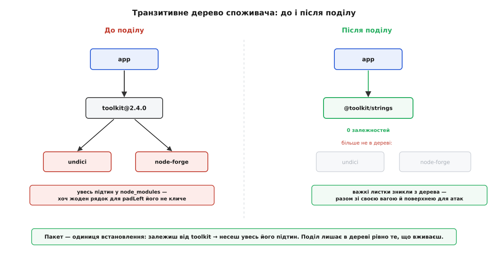

# ⚙️ Розбір: розрізати пакет-звалище за реальним ужитком

Правило «разом лежить те, що разом уживається» на дошці звучить безневинно. Ціну йому видно не на дошці, а на конвеєрі збірки — коли о третій ночі приходить лист від бота безпеки, застосунок, що вміє рівно вирівнювати рядки пробілами, раптом червоний, і хтось мусить розбиратися, чому. Тож візьмемо не діаграму, а справжній багатопакетний воркспейс (англ. *workspace* — спільна тека кількох пакетів під одним корінням), відтворимо в ньому той самий каскад перезбирання руками, а тоді розріжемо звалище за реальним ужитком і поміряємо, що змінилось — у дереві залежностей, у ланцюжку перевірок і в ритмі випусків.

## Задача

Є монорепозиторій з двома пакетами. Перший — `toolkit`, куди колись поскладали три несумісні за вжитком речі: рядкові дрібнички (`padLeft`, `trim`, `slugify`), обгортку над HTTP і підписи-криптографію. Другий — `app`, який з усього цього кличе єдину функцію:

```js
// packages/app/src/index.js
import { padLeft } from "toolkit/strings";

console.log(padLeft("42", 5));   // "   42"
```

Маніфест `toolkit` виставляє три входи через поле `exports` (карта підшляхів пакета) і тягне дві важкі зовнішні залежності — `undici` для HTTP, `node-forge` для криптографії:

```json
// packages/toolkit/package.json
{
  "name": "toolkit",
  "version": "2.4.0",
  "exports": {
    "./strings": "./src/strings.js",
    "./http":    "./src/http.js",
    "./crypto":  "./src/crypto.js"
  },
  "dependencies": {
    "undici":     "^6.0.0",
    "node-forge": "^1.3.0"
  }
}
```

А `app` залежить від `toolkit` цілком:

```json
// packages/app/package.json
{
  "name": "app",
  "version": "1.0.0",
  "dependencies": { "toolkit": "^2.4.0" }
}
```

Отут перша річ, яку варто побачити на власні очі. У npm залежності оголошують на **пакет**, а не на підшлях. У маніфесті нема способу сказати «`undici` потрібен лише тим, хто імпортує `./http`». Тому щойно `app` залежить від `toolkit`, у його `node_modules` осідає геть усе, від чого залежить `toolkit`, — незалежно від того, що `app` імпортує тільки `toolkit/strings`. Подивись на встановлене дерево з боку застосунку:

```
$ npm ls --all -w app
app@1.0.0
└─┬ toolkit@2.4.0
  ├── undici@6.21.0
  └── node-forge@1.3.1
```

`app` вирівнює рядок — і несе HTTP-клієнт та криптобібліотеку, яких не кличе жоден його рядок. Це не помилка встановлення; це прямий наслідок того, що одиниця залежності — увесь пакет.

## Каскад: чому латка в crypto будить того, хто бачить лише strings

Тепер відтворимо податок. У `node-forge` оголошують уразливість, автори `toolkit` тягнуть латку й піднімають версію на одну сходинку — патч, найдрібніша можлива зміна:

```
2.4.0 → 2.4.1        (у crypto.js — рядок, якого app ніколи не виконує)
```

Що бачить `app`? Його діапазон `^2.4.0` за правилами [семантичного версіонування](topic:sf-release/semantic-versioning) приймає будь-яку версію від `2.4.0` включно до `3.0.0` виключно, — отже, і `2.4.1`. Тому оновлення прилітає само: `npm update`, Dependabot чи Renovate переписують один рядок у `package-lock.json` — з `2.4.0` на `2.4.1`. І цей однорядковий діф у lock-файлі запускає всю машину: конвеєр бачить зміну в закріплених залежностях, робить `npm ci` начисто, проганяє **весь** набір тестів `app` і викочує збірку заново.

Питання, від якого все крутиться: чому конвеєр не може просто пропустити цей крок — адже «очевидно», що зміна в `crypto` не могла зачепити вирівнювання рядків? Бо для конвеєра нічого не очевидно, і не має бути. Сучасні монорепо-інструменти (Turborepo, Nx, Bazel) вирішують, що перезбирати, за **хешем входів** задачі. Входи задачі «протестувати `app`» — це код `app` плюс усе, від чого він залежить. Зміст `toolkit` змінився → його хеш змінився → ключ кешу для задачі `app` інший → промах кешу → тести біжать наново.

> 🔧 **Навіщо це.** Спокуслива думка «поставлю розумний кеш і забуду про межі пакетів» не працює саме тут. Граф збірки знає рівно одне ребро: `app` залежить від `toolkit`. Він **не** знає, що `app` торкається лише підшляху `./strings`, — така роздільність не оголошена ніде, бо залежність оголошена на пакет. Кеш чесно перезбирає все, що стоїть нижче за течією від зміненого входу. Виправити це кешем не можна; можна лише зробити так, щоб ребро вело не до звалища, а до того, що справді вживають, — тобто розрізати пакет.

І хвіст цього каскаду сягає далі, ніж один застосунок: перетестуватись і переїхати мусить **кожен** споживач `toolkit`, хоч чим би він користувався. Той, хто бере `./http`; той, хто бере лише `./strings`; той, хто бере `./crypto` й кого латка справді стосується, — усі троє в одному ритмі, заданому найметушливішою частиною пакета.

## Ідея: різати за ужитком, не за темою

Ліки прямі: те, що ніколи не тягнуть разом, не має ділити одну версію. Розкладаємо `toolkit` на три пакети — `@toolkit/strings`, `@toolkit/http`, `@toolkit/crypto` — кожен зі своєю версією та своїми залежностями. Головне тут не кількість тек, а **межа**: `undici` переїжджає в пакет, де його справді викликають, `node-forge` — у свій, а `@toolkit/strings` лишається чистим кодом без жодної зовнішньої залежності. Різати треба саме за тим, хто що підтягує в одній зв'язці, а не за тим, що на позір «схоже» чи «теж утиліта».

## Поділ: три пакети (npm)

Кожен пакет несе рівно свою вагу. Рядки — без залежностей узагалі:

```json
// packages/strings/package.json
{
  "name": "@toolkit/strings",
  "version": "1.0.0",
  "exports": "./src/index.js"
}
```

HTTP тягне `undici` — але тепер лише в себе:

```json
// packages/http/package.json
{
  "name": "@toolkit/http",
  "version": "1.0.0",
  "exports": "./src/index.js",
  "dependencies": { "undici": "^6.0.0" }
}
```

Криптографія — свій `node-forge`, своя версія:

```json
// packages/crypto/package.json
{
  "name": "@toolkit/crypto",
  "version": "1.0.0",
  "exports": "./src/index.js",
  "dependencies": { "node-forge": "^1.3.0" }
}
```

А застосунок міняє один рядок у маніфесті й один — в імпорті:

```json
// packages/app/package.json
{
  "name": "app",
  "version": "1.0.0",
  "dependencies": { "@toolkit/strings": "^1.0.0" }
}
```

```js
// packages/app/src/index.js
import { padLeft } from "@toolkit/strings";
```

Тепер поглянь на встановлене дерево ще раз:

```
$ npm ls --all -w app
app@1.0.0
└── @toolkit/strings@1.0.0
```

`undici` і `node-forge` зникли цілком. Це не косметика: разом із ними пішла їхня вага в `node_modules`, їхня частка часу встановлення, дві бібліотеки з поверхні для атак і дві залежності, які могли б колись не зійтися версіями з чимось іншим. `app` тепер несе рівно те, що вживає, — і транзитивний хвіст за цим.



*Пакет — одиниця встановлення: залежиш від `toolkit` — несеш увесь його підтин, хоч жоден рядок для `padLeft` не кличе ні `undici`, ні `node-forge`. Після поділу в дереві споживача лишається рівно те, що він вживає; важкі листки зникають разом зі своєю вагою й поверхнею для атак.*

Найважливіше — що стало з каскадом. Повторимо ту саму латку: у `node-forge` знову діра, `@toolkit/crypto` підіймається `1.0.0 → 1.0.1`. Кого це торкнеться? Тільки тих, у чиєму маніфесті стоїть `@toolkit/crypto`. `app` залежить від `@toolkit/strings` — його `package-lock.json` не змінюється ні на байт. Ні `npm ci`, ні тести, ні викочування збірки. Каскад згас там, де в нього справжні споживачі, і жоден сторонній до `crypto` код не смикнули.

## Той самий поділ у Cargo — і чому прапорці рятують не від усього

Екосистеми не однакові в тому, наскільки дрібно дозволяють різати залежність. npm дає одиницю «пакет»: щоб скинути невживане, треба фізично розділити пакети, як ми щойно й зробили. Rust зі своїм Cargo дає інструмент тонший — **прапорці можливостей** (англ. *features* — умовна компіляція частин крейта). Один крейт `toolkit` може сам ховати свої важкі залежності за прапорцями:

```toml
# Cargo.toml крейта toolkit
[package]
name = "toolkit"
version = "2.4.0"

[dependencies]
reqwest = { version = "0.12", optional = true }   # важкий HTTP-стек
rsa     = { version = "0.9",  optional = true }   # важка криптографія

[features]
default = []
strings = []                # чистий код, без залежностей
http    = ["dep:reqwest"]   # прапорець вмикає reqwest
crypto  = ["dep:rsa"]       # прапорець вмикає rsa
```

Синтаксис `dep:reqwest` (Cargo від Rust 1.60) прив'язує зовнішню залежність до прапорця: поки прапорець не піднято, залежності для компілятора наче й немає. Споживач бере лише рядки й вимикає все зайве:

```toml
# Cargo.toml застосунку
[dependencies]
toolkit = { version = "2.4", default-features = false, features = ["strings"] }
```

З таким набором прапорців `reqwest` і `rsa` **не компілюються й не входять у граф збірки взагалі**. Дерево залежностей застосунку звужується без жодного поділу на крейти — те, на що в npm довелося різати пакети, тут робить один рядок `features = ["strings"]`. Це чистіший інструмент проти транзитивної ваги, ніж усе, що дає npm.

І саме тут ховається пастка, від якої прапорці **не** рятують. Скинути щось із компіляції — не те саме, що відв'язатися від його ритму випусків. Крейт лишається одиницею версії. Виправили `crypto` — підняли `toolkit` на `2.4.1`; діапазон `2.4` у застосунку приймає нову версію, `cargo update` переставляє lock-файл, і Cargo **перекомпілює** `toolkit` (рядкову частину) і сам застосунок. Прапорець `crypto` був вимкнений — але це вимкнуло крипту з **компіляції**, не з **версії**. Каскад перезбирання живий, бо його джерело — не те, що ти компілюєш, а те, як пронумеровано випуск.

> 🔧 **Навіщо це.** Тут дві різні осі, які легко сплутати. Прапорці керують тим, що потрапляє в **компіляцію**; версія крейта — тим, що є одиницею **випуску й перезбирання**. Features звужують дерево залежностей, але лишають тебе прив'язаним до чужого ритму латок. Щоб згас і каскад перезбирання, різати треба саме одиницю випуску — три окремі крейти `toolkit-strings`, `toolkit-http`, `toolkit-crypto`, кожен зі своєю версією. Тоді латка в криптографії підіймає лише `toolkit-crypto` і споживача рядків не торкається зовсім. CRP — про одиницю **випуску**; прапорці — приємний бонус до ваги, але заміною поділу вони не є.

## Той самий контур в інших екосистемах

Форма всюди та сама, різниться лише те, що екосистема бере за одиницю. У Go модуль — це одиниця версії, як пакет у npm, але компілює Go тільки те, що справді імпортують, і з версії 1.17 обрізає граф модулів до потрібного. Тож застосунок, який імпортує лише `strings`, важких залежностей `http`/`crypto` у збірку не тягне — та версія модуля все одно спільна, тож латка в криптографії підіймає версію всього модуля й змушує перерезолвити. Щоб відв'язати ще й ритм випусків, модуль ділять на кілька:

```go
// go.mod застосунку — залежність лише від виділеного модуля рядків
module example.com/app

go 1.22

require example.com/toolkit/strings v1.0.0
```

Java 9 винесла цей самий принцип на масштаб цілої платформи. Її система модулів (проєкт Jigsaw, специфікація JSR 376; вийшла з Java 9 21 вересня 2017 року) розрізала колишній моноліт `rt.jar` на `java.base`, `java.sql`, `java.xml` і десятки інших, а `module-info.java` дав кожному застосунку оголосити, від чого він читає й що відкриває назовні:

```java
// module-info.java застосунку — вимагає лише модуль рядків
module com.acme.app {
    requires com.acme.strings;
}
```

```java
// module-info.java бібліотеки рядків — відкриває рівно свій пакет
module com.acme.strings {
    exports com.acme.strings;
}
```

Тут варто розрізняти осі. `requires`/`exports` керують **доступністю** — на що код узагалі має право посилатися; одиницею **версії** лишається артефакт Maven чи Gradle. Разом вони й дають CRP: модулі звужують те, що видно, а артефакт лишається тим, що випускають. Різні екосистеми ставлять кордон у різних місцях — пакет, крейт із прапорцями, модуль, артефакт, — але питання під усіма одне: **чи платить кожен споживач лише за те, чим користується.**

## Складність і пастки

Найгостріша пастка — вирішити, що коли поділ добрий, то дрібніший поділ добріший, і різати далі, поки пакетом не стане однорядкова функція. Куди це заводить, npm показала наживо. 22 березня 2016 року розробник Азер Кочулу (тур. *Azer Koçulu*), посварившись із npm через права на назву `kik`, зняв із реєстру всі свої 273 пакети — серед них крихітний `left-pad` на одинадцять рядків, який вирівнював рядок зліва. За кілька годин посипалися тисячі чужих збірок по світу: від `left-pad` транзитивно залежали й Babel, і React, а через них — Facebook, PayPal, Netflix, Spotify. npm відновила пакет уручну й відтоді забороняє знімати те, від чого залежать інші, якщо минуло понад добу. Мораль не в тому, що дрібні пакети зло, а в тому, що **кожен вузол має ціну**: свою версію, свій випуск, свій запис у lock-файлі, свою точку відмови — зникнення, компрометацію, помилку в назві-двійнику.

Ціна ця росте не лінійно. Що більше пакетів ділять спільну транзитивну залежність, то більше пар, які можуть зажадати несумісних її версій, — і граф впадає в «пекло залежностей»:

```
пар потенційного конфлікту  =  N·(N−1)/2
   N = 3  →  3 пари
   N = 10 →  45 пар
   N = 40 →  780 пар
```

Є й протилежна ціна, яку CRP навмисне ігнорує, а ти — ні. Розділивши `strings` і `http`, ти зробив дорожчою будь-яку зміну, що зачіпає обидва: тепер це два репозиторії, дві версії, два випуски й узгодження між ними. Це та сама сила, що тягне пакети назад докупи, — [принцип спільного закриття](topic:sf-apps/common-closure-principle): що міняється з однієї причини, тримай разом. CRP штовхає різати, CCP — не передрібнити; правильна межа стоїть там, де ці двоє врівноважуються, і рухається з часом.

Остання пастка — плутати внутрішній кеш із CRP. Розумний монорепо-інструмент справді вміє перезбирати дрібніше за пакет: якщо налаштувати входи задач по файлах, зміна в `crypto.ts` не інвалідує кеш тестів `app`, хоч обидва в одному пакеті. Але це рятує лише **тебе всередині твого репозиторію**. Зовнішній споживач, який ставить твій опублікований пакет, твого кешу не бачить: він отримує весь пакет, увесь його підтин залежностей і мусить перевіритися на кожну зміну версії. CRP — про те, що ти **публікуєш**, а не про те, як ти кешуєш у себе; внутрішній кеш меж пакета не зсуває.

Тож дивись не на те, що логічно «схоже», а на те, що фактично тягнуть в одній зв'язці й що живе одним ритмом випусків. Клас, який ніколи не потрапляє до споживачів решти класів компонента, — тут чужий, винось. Але спиняйся там, де подальше дрібнення додає більше швів, версій і вузлів, ніж заощаджує на зайвому. Мета проста й вимірна: щоб кожен, хто підключив твій компонент, платив рівно за те, чим користується, — і ні за що зайве.
