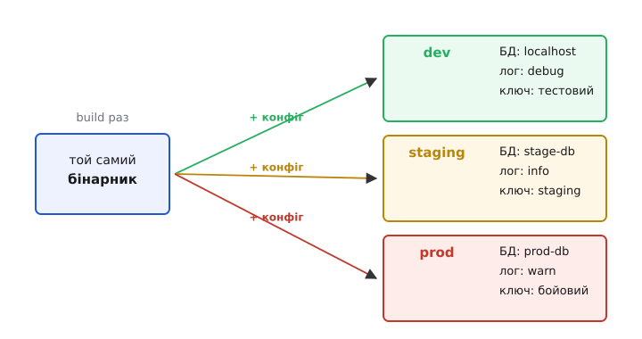

# Конфігурація

<preknowlist>
- [Незмінність як прийом дизайну](topic:sf-apps/immutability) — значення, яке не міняється після створення; конфіг найкраще читати раз і зробити незмінним, щоб половина застосунку не бачила інших налаштувань, ніж друга.
- [Принцип інверсії залежностей (DIP)](topic:sf-apps/dependency-inversion) — модуль спирається на переданий йому інтерфейс, а не тягне залежність сам; конфіг зазвичай теж **передають** усередину, а не читають глобально.
- [Технічний борг і вартість зміни](topic:sf-apps/technical-debt) — рішення, яке дешево ввести й дорого поміняти; конфіг цілиться саме в те, щоб зміна поведінки не коштувала перекомпіляції.
</preknowlist>

Напиши застосунок, який ходить у базу даних, і одразу впираєшся в дрібне, але вперте питання: а за якою адресою та база? На твоїй машині це `localhost`. У колеги — інша адреса. На тестовому сервері — третя. У бойовому середовищі — четверта, та ще й з паролем, якого ти в очі не бачив і бачити не мусиш. Адреса одна на роль у коді — «база, куди писати замовлення», — але **конкретне значення різне в кожному світі, де застосунок живе**. І таких значень не одне: порт, рівень докладності логів, ключі до чужих сервісів, ліміти, увімкнені й вимкнені можливості. Якщо вписати їх у код, доведеться **перезбирати той самий застосунок** окремо для кожного світу — а це вже не той самий застосунок, це чотири різні, які тільки прикидаються одним.

Звідси й народжується окрема турбота — **конфігурація (лат. *configurare* — надавати форму, влаштовувати)**: усе те, що визначає, **як** застосунок поводиться в конкретному запуску, але **не є самою логікою** застосунку. Логіка «як порахувати суму замовлення» однакова скрізь і назавжди — це код. А от «куди писати, як голосно логувати, чи пускати нову фічу» змінюється від середовища до середовища й від дня до дня — і цьому місце **поза** кодом. Уся стаття — про те, де саме проходить ця межа, звідки конфіг береться, і чому недбале поводження з ним валить продакшн частіше, ніж помилки в самій логіці.

## Один артефакт, багато світів

Найважливіше побачити першопричину, бо з неї випливає все інше. Правильний застосунок збирають (англ. *build*) **один раз** — виходить незмінний артефакт (образ контейнера, jar-файл, бінарник). І цей самий артефакт, байт у байт, запускають усюди: на машині розробника, на тестовому стенді, у бойовому середовищі. Що робить його поведінку різною в кожному місці — **не інший код, а інший конфіг, поданий ззовні при запуску**.



*Код збирають один раз і не чіпають. Три середовища відрізняються лише конфігом, який заходить у той самий артефакт іззовні. Тому баг, що виліз тільки в проді, майже ніколи не «інший код» — це інший конфіг.*

Це не примха гігієни, а тверде правило, у якого є ім'я й дата. Принцип «зберігай конфіг у середовищі, окремо від коду» сформулювали 2011 року в маніфесті [The Twelve-Factor App](topic:sf-apps/twelve-factor) — його третій пункт так і зветься «Config». Автори виводили правило з болю: [щойно налаштування протікають у код, ти вже не можеш узяти одну збірку й перенести її між середовищами](topic:sf-apps/config-design/hist-twelve-factor-config.md), бо в коді зашите щось локальне. Розділи двоє — код і конфіг — і артефакт стає по-справжньому переносним.

Практичний критерій, який випливає прямо звідси: **якщо ти можеш зробити збірку публічною з відкритим кодом і при цьому нічого небезпечного не витече — конфіг відділено правильно**. Пароль до бази у вихідному тексті означає, що межу порушено: секрет опинився там, де йому не місце.

## Де проходить межа: код чи конфіг

Найгостріше й найчастіше питання — не «як зберігати конфіг», а «що взагалі конфіг, а що код». Помиляються в обидва боки, і обидві помилки болючі.

Перевір кандидата одним запитанням: **чи мусить це значення відрізнятися між середовищами або запусками — без переписування логіки?** Адреса бази відрізняється (localhost проти prod-db) — конфіг. Ключ до платіжного шлюзу відрізняється (тестовий проти бойового) — конфіг. Рівень логів відрізняється (докладно на розробці, скупо в проді) — конфіг. А от порядок обчислення знижки однаковий скрізь; він міняється тільки тоді, коли міняється **саме правило бізнесу**, — це код, і йому місце в коді, під контролем версій і тестами.

Помилка в один бік — **зашити в код те, що є конфігом**. Тоді зміна адреси сервера вимагає правки, перезбірки й повного випуску — замість того щоб просто підставити інше значення. Кожне таке значення прив'язує застосунок до одного світу.

Помилка в інший бік підступніша — **винести в конфіг те, що є кодом**. Спокуса виглядає нешкідливо: «зробимо ставку податку налаштовною, раптом зміниться». Але за пів року в конфізі опиняється формула розрахунку, потім розгалуження «якщо клієнт із такої країни», потім ціла таблиця правил — і ти отримуєш **другу програму, написану в YAML, без типів, без тестів і без зневаджувача**. Це класична пастка: конфіг, що поволі перетворюється на мову програмування. Ознака, що межу перейдено, проста — коли в конфіг починають проситися умови, цикли й обчислення, це вже не конфіг, це код, який утік із-під нагляду інструментів.

> 🔧 **Навіщо це.** Ціна помилки з межею видно на першому інциденті. Винесли бізнес-правило в конфіг «про всяк випадок» — і тепер критична логіка міняється в проді руками, без code review, без тесту, без сліду в історії; одна одруківка в YAML о третій ночі кладе розрахунок оплат, і ніхто не знає, хто і що правив. Тримати межу — значить тримати логіку там, де на неї працюють типи, тести й журнал змін, а зовні лишати рівно те, що мусить різнитися між світами.

Є й проміжний випадок, який не варто плутати з конфігом, — **прапорці функцій (англ. *feature flags*)**. Формою це конфіг: булеве значення, яким керуєш ззовні. Але призначення інше — не «пристосуватися до середовища», а **на льоту вмикати й вимикати шматки поведінки** (розкочувати фічу на 5% користувачів, миттю гасити зламане без випуску нової збірки). Механіка спільна з конфігом, а от [дисципліна навколо прапорців](topic:sf-release/feature-flags) своя: їх заводять тимчасово й прибирають, коли фіча визріла, інакше вони гниють і плутають логіку.

## Звідки береться значення: шари й перекриття

Тепер механіка. Одне й те саме налаштування — скажімо, порт — зазвичай можна задати **кількома способами одночасно**, і треба чітко знати, хто кого перебиває. Інакше буде так: у файлі написано `8080`, у змінній середовища `9090`, а застосунок слухає `3000`, і ніхто не розуміє чому.

Рятує проста ідея: конфіг збирають **пластами**, від найслабшого до найсильнішого, і верхній пласт перекриває нижній. Типовий порядок такий:


*Значення шукається згори вниз: перемагає найсильніший пласт, який його задав. Типові значення в коді — щоб застосунок узагалі стартував без жодного файлу; аргумент рядка — щоб разово перекрити будь-що, не чіпаючи файлів.*

Логіка цього порядку теж причинна, а не випадкова. **Типові значення в коді** лежать на дні, щоб застосунок піднявся «з коробки», навіть коли нічого не налаштовано, — розробник клонував репозиторій і одразу запустив. **Спільний файл** задає те, що однакове для всіх середовищ. **Файл конкретного середовища** перекриває спільний там, де prod відрізняється від dev. **Змінні середовища** сильніші за файли, бо саме ними платформа (контейнер, хмара) впорскує значення, яких у репозиторії немає й не може бути, — передусім секрети. А **аргумент командного рядка** — найсильніший, бо це разове ручне втручання «зараз запусти ось так», яке має перебити геть усе, не змушуючи редагувати файли.

Ось цей порядок, зібраний у код. Кожен наступний пласт накладається поверх попереднього звичайним злиттям словників:

:::tabs
```python
import os

def load_config():
    # 1. Найслабший пласт: типові значення просто в коді
    cfg = {"port": 3000, "log_level": "info", "db_url": "localhost:5432"}

    # 2. Спільний файл — те, що однакове скрізь
    cfg.update(read_yaml("config.yaml"))

    # 3. Файл конкретного середовища перекриває спільний
    env = os.environ.get("APP_ENV", "dev")
    cfg.update(read_yaml(f"config.{env}.yaml"))

    # 4. Змінні середовища сильніші за файли (сюди хмара кладе секрети)
    if "PORT" in os.environ:
        cfg["port"] = int(os.environ["PORT"])
    if "DB_URL" in os.environ:
        cfg["db_url"] = os.environ["DB_URL"]

    # 5. Аргумент рядка перебиває все — разове ручне втручання
    cfg.update(parse_cli_overrides())
    return cfg
```
```ts
function loadConfig(): Config {
  // 1. Найслабший пласт: типові значення просто в коді
  let cfg: Partial<Config> = { port: 3000, logLevel: "info", dbUrl: "localhost:5432" };

  // 2. Спільний файл — те, що однакове скрізь
  cfg = { ...cfg, ...readYaml("config.yaml") };

  // 3. Файл конкретного середовища перекриває спільний
  const env = process.env.APP_ENV ?? "dev";
  cfg = { ...cfg, ...readYaml(`config.${env}.yaml`) };

  // 4. Змінні середовища сильніші за файли (сюди хмара кладе секрети)
  if (process.env.PORT) cfg.port = Number(process.env.PORT);
  if (process.env.DB_URL) cfg.dbUrl = process.env.DB_URL;

  // 5. Аргумент рядка перебиває все — разове ручне втручання
  cfg = { ...cfg, ...parseCliOverrides() };
  return cfg as Config;
}
```
:::

Зверни увагу на дрібницю, що коштує багато: у пункті 4 значення зі змінної середовища — завжди **рядок**, і `PORT=8080` без явного `int(...)` дасть тобі текст `"8080"` там, де код чекає число. Половина загадкових збоїв конфігу — саме про це: типи зі змінних середовища губляться, бо середовище не знає жодних типів, крім тексту.

## Прочитати — не досить: перевір і впади рано

Найгірше, що може зробити застосунок із поганим конфігом, — **успішно запуститися**. Уяви: у бойовому середовищі забули задати `DB_URL`. Застосунок стартує, приймає перший запит, доходить до бази — і аж тоді падає, з невиразною помилкою десь у надрах драйвера, за годину після деплою, уже під живим навантаженням. Причина — банальна відсутність налаштування, а знайдеться вона в найгіршу мить.

Ліки — **швидкий провал (англ. *fail-fast*)**: перевір увесь конфіг **одразу після читання, до того як застосунок почне робити хоч щось корисне**. Немає обов'язкового значення — впади негайно, гучно, з ясним повідомленням, **до** прийому першого запиту. Краще застосунок, який чесно не піднявся зі словами «не задано DB_URL», ніж той, що піднявся і мовчки ламається під навантаженням.

:::tabs
```python
def validate(cfg):
    problems = []
    if not cfg.get("db_url"):
        problems.append("DB_URL не задано")
    if not (1 <= cfg["port"] <= 65535):
        problems.append(f"port={cfg['port']} поза діапазоном 1..65535")
    if cfg["log_level"] not in ("debug", "info", "warn", "error"):
        problems.append(f"невідомий log_level={cfg['log_level']}")
    if problems:
        # усі помилки разом, а не по одній за запуск
        raise SystemExit("Конфіг непридатний:\n  " + "\n  ".join(problems))
```
```ts
function validate(cfg: Config): void {
  const problems: string[] = [];
  if (!cfg.dbUrl) problems.push("DB_URL не задано");
  if (!(cfg.port >= 1 && cfg.port <= 65535))
    problems.push(`port=${cfg.port} поза діапазоном 1..65535`);
  if (!["debug", "info", "warn", "error"].includes(cfg.logLevel))
    problems.push(`невідомий logLevel=${cfg.logLevel}`);
  if (problems.length) {
    // усі помилки разом, а не по одній за запуск
    throw new Error("Конфіг непридатний:\n  " + problems.join("\n  "));
  }
}
```
:::

Два прийоми тут працюють разом. Перший — **збери всі помилки, а не першу-ліпшу**: інакше виправиш одну, запустиш, дізнаєшся про наступну, і так п'ять разів. Другий і важливіший — перевіряй **на самому старті**, перш ніж підключати базу, відкривати порти чи приймати запити. Тоді поганий конфіг ловиться за секунду при деплої, а не за годину під навантаженням.

І коли конфіг перевірено — прочитай його **раз** і зроби [незмінним](topic:sf-apps/immutability). Якщо будь-який шматок застосунку може дописати чи перечитати конфіг серед роботи, ти отримуєш дві половини системи, що бачать різні налаштування, і клас багів, який майже неможливо відтворити. Один прохід читання й перевірки на старті, далі — незмінна структура, яку роздають усім, хто її потребує.

## Секрети — не звичайний конфіг

Адреса бази й пароль до неї формою однакові — обидва рядки, обидва різні між середовищами. Але поводитися з ними однаково не можна, і причина серйозна: **розкритий секрет — це не незручність, а компрометація**. Пароль, ключ до API, токен, приватний ключ шифрування — усе це конфіг за механікою, але з окремими правилами життя.

Головне правило звучить категорично: **секрет ніколи не потрапляє в систему контролю версій**. Записав пароль у `config.yaml` і закомітив — і він назавжди в історії git, звідки його не витерти простим видаленням; його бачить кожен, хто клонував репозиторій, і кожен, хто отримає доступ до нього завтра. Саме тому секрети йдуть через пласт **змінних середовища** (або через окреме сховище секретів) — той пласт, що фізично не лежить у репозиторії. У код і в репозиторій кладуть лише **приклад** без справжніх значень (`config.example.yaml` з порожнім `DB_PASSWORD=`), щоб було видно, які змінні потрібні, але не самі таємниці.

Секрети також **ротують** — періодично міняють, а при витоку міняють негайно, — і застосунок має вміти підхопити новий секрет без переписування коду. Це вже окрема тема з власними механізмами сховищ і оновлення на льоту; тут досить запам'ятати межу: [секрети живуть за своїми правилами](topic:sf-security/secrets-management), і сплутати їх зі звичайним конфігом — найдорожча з помилок цієї статті.

## Форма запису: чим і як задавати

Питання «яким синтаксисом писати конфіг» вторинне щодо всього попереднього, але й тут є за що зачепитися. Поширені формати — це компроміси, а не змагання переможців.

**Змінні середовища** — плаский набір пар «ім'я = рядок». Незамінні для секретів і для впорскування з платформи, універсальні, є всюди. Ціна — жодної структури (усе плаский текст) і жодних типів (усе рядок, тому й `int(...)` вручну). Добре для десятка значень, погано для складної вкладеної структури.

**Файли** дають структуру й коментарі. **YAML** читабельний і вкладений, але має підступний норов: значуща відступами, а кілька його «зручностей» відверто небезпечні — норвезький код країни `NO` без лапок стає булевим `false`, а версія `1.20` перетворюється на число `1.2`. **JSON** строгіший і однозначніший, зате без коментарів і багатослівний. **TOML** — компроміс, задуманий саме під конфіг: явний, з коментарями, без пасток YAML із неявним приведенням типів.

Універсально «найкращого» немає; вибирають під ситуацію. На практиці частий і здоровий підхід — комбінація: файл (YAML чи TOML) тримає основну структуру й безпечні значення, а змінні середовища перекривають конкретику середовища й несуть секрети. Саме цю комбінацію й збирав пластовий завантажувач вище.

## Конфіг як слід рішень і його еволюція

Наостанок — про те, що конфіг легко недооцінити як «просто значення». Насправді кожне налаштування, у якого є вибір, — це **застигле рішення**. Чому таймаут саме 30 секунд, а не 5? Чому пул з'єднань саме на 20? За кожним числом стоїть колись ухвалене рішення з причиною — і коли причину не записано, число стає магічним: ніхто не сміє його чіпати, бо ніхто не пам'ятає, чому воно таке.

Звідси два практичні наслідки. Перший: **прокоментуй нетривіальний конфіг просто в місці, де він живе** — не «таймаут 30с», а «таймаут 30с, бо платіжний шлюз інколи відповідає до 25с; менше — хибні обриви». Тоді наступний, хто гляне, побачить не голе число, а рішення з причиною. Другий, для важливих і незворотних рішень: винеси причину в окремий [журнал архітектурних рішень (ADR)](topic:sf-apps/architecture-decision-records) — короткий запис «що вирішили й чому», який переживе й того, хто його ухвалив, і сам конфіг-файл.

І тримай у голові, що конфіг **еволюціонує**, а отже, ламається сумісність. Додав нове обов'язкове значення — і всі старі середовища, де його немає, тепер не піднімуться; перейменував ключ — і чужий деплой мовчки бере типове замість заданого. Тому зміни конфігу заслуговують тієї ж обережності, що й зміни коду: нове значення давай з безпечним типовим (щоб старі середовища вижили), перейменування супроводжуй перехідним періодом, коли працюють обидва імені, а обов'язкові поля додавай гучно, з перевіркою на старті, яка чесно скаже, чого бракує.

Побачити конфіг правильно — це та сама навичка межі, що й у всьому дизайні. Значення різниться між світами й не є логікою — виноси назовні, шаруй за силою, перевіряй на старті. Значення є секретом — тримай геть із репозиторію, крізь середовище, з ротацією. А в конфіг проситься умова, цикл чи формула — спинися: це вже код, який тікає з-під типів і тестів, і йому місце вдома, а не у файлі налаштувань.
