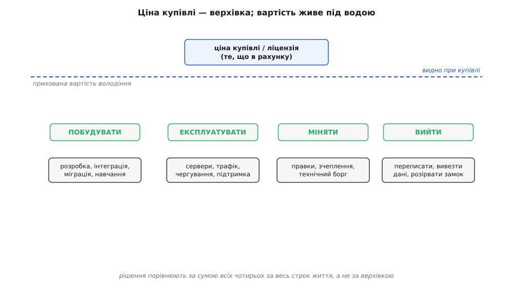
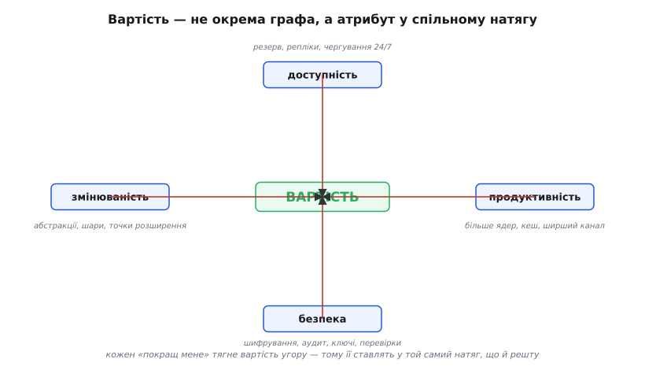
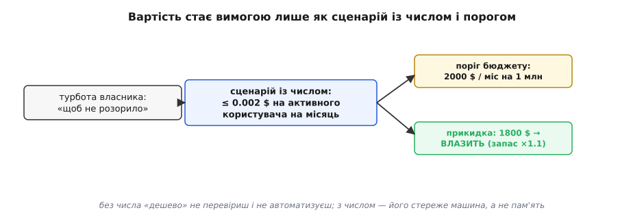

# Вартість як атрибут

<preknowlist>
- [Якісні атрибути](topic:sf-apps/quality-attributes) — «-ilities» системи (продуктивність, доступність, безпека, змінюваність) і головна правда: покращуючи один атрибут, псуєш інший.
- [Сценарії атрибутів](topic:sf-apps/attribute-scenarios) — чому гасло не перевіриш, а вимога живе лише як конкретна ситуація з виміром успіху числом.
- [Прикидка «на серветці»](topic:sf-apps/back-of-envelope) — за кілька рядків оцінити порядок величини й назвати бік від порога, не будуючи прототип.
</preknowlist>

Спитайте команду, скільки коштує їхня система, — і почуєте ціну ліцензії або рахунок за сервери цього місяця. Це майже завжди неправда, і неправда дорога. Ліцензія — це вхідний квиток; справжня вартість набігає потім, роками, малими струмками, яких у рахунку не видно: години на кожну правку, чергування вночі, міграції, борг, який гальмує кожен наступний реліз. Поки вартість лишається графою в бухгалтерії, вона не бере участі в архітектурних рішеннях — а мала б, бо саме вона тихо вирішує, чи система доживе до третього року.

Погляньмо на вартість інакше: не як на суму в рахунку, а як на **якісний атрибут** — таку саму грань «наскільки добре система робить своє», як продуктивність чи доступність. Продуктивність питає «як швидко», доступність — «наскільки надійно», а вартість — «якою ціною». І поводиться вона за тими самими законами, що й решта атрибутів: її треба назвати числом, вона воює з іншими атрибутами, і за неї доводиться свідомо торгуватися. Різниця лише в тому, що вартість — атрибут, який усі відчувають, але майже ніхто не виносить на світло як інженерну вимогу.

> 🔧 **Навіщо це.** Рішення, ухвалене за ціною на ціннику, розвалюється через півроку, коли приходять рахунки за все, чого в ціннику не було. Якщо тримати вартість як атрибут із власним числом, ти порівнюєш варіанти за **повною** ціною їхнього життя — і той, що дешевший на старті, часто програє тому, що дешевший у володінні.

## Ціна купівлі — це верхівка айсберга

Найдорожча омана — плутати ціну придбання з вартістю володіння. Купуючи чи будуючи, ти платиш один раз; володіючи — платиш безперервно. Ця думка стара й має ім'я: **повна вартість володіння** (англ. *total cost of ownership*, TCO — сума всіх витрат за весь строк життя, а не лише ціна купівлі). Термін увів і популяризував у 1987 році аналітик Gartner Білл Кірвін, застосувавши модель життєвого циклу витрат до персональних комп'ютерів; його за це прозвали «батьком TCO». Суть проста й безжальна: **ціна на ціннику — це верхівка, а найбільша частина вартості лежить під водою.** Хто цю історію запустив і як цифри TCO раптом побили галузь, — [окрема замітка](topic:sf-apps/cost-as-attribute/hist-tco.md).

Для системи, яку ти будуєш, підводна частина розкладається на чотири струмки, і жоден із них не видно в момент рішення:

```text
ПОБУДУВАТИ   — розробка, інтеграція, міграція даних, навчання команди
ЕКСПЛУАТУВАТИ — сервери, трафік, сховище, чергування 24/7, підтримка
МІНЯТИ       — кожна правка коштує тим більше, чим гірша структура
ВИЙТИ        — переписати, вивезти дані, розірвати прив'язку до постачальника
```



*Верхівка над водою — те, що потрапляє в рахунок і за чим спокушає порівнювати варіанти. Але сума під водою — побудувати, експлуатувати роками, міняти на кожен реліз і колись вийти — майже завжди більша за верхівку. Порівнювати рішення за верхівкою — те саме, що обирати корабель за висотою щогли.*

Найпідступніший зі струмків — **міняти**. Побудову й експлуатацію ще якось прикидають наперед; вартість зміни майже ніколи, бо вона схована в структурі коду й вилазить лише тоді, коли зміна вже потрібна. Погана структура не робить систему повільною сьогодні — вона робить **кожну завтрашню правку дорожчою**, і цей податок капає роками. Саме цей струмок називають [технічним боргом](topic:sf-apps/technical-debt): відсотки, які ти сплачуєш швидкістю розробки за рішення, ухвалене колись поспіхом. А четвертий струмок, **вийти**, узагалі згадують лише тоді, коли вибратися вже дорого, — про нього нижче.

## Вартість воює з рештою атрибутів

Якщо вартість — атрибут, то вона підкоряється головному закону атрибутів: **ручки з'єднані, і, крутячи одну, ти рухаєш інші.** Тільки з вартістю зв'язок особливо прямий і майже завжди в один бік — **майже кожне «покращ мене» коштує грошей**.

Хочеш **доступності** — вводиш резерв: другий сервер, репліку бази, чергового вночі. Кожен елемент резерву — це залізо, трафік і зарплата, яких без вимоги доступності не було б. Хочеш **продуктивності** — додаєш ядра, ширший канал, кеш; усе це рахунок, що росте. Хочеш **безпеки** — шифрування, аудит, ротація ключів, зайві перевірки на кожному кроці — знову витрати, тепер ще й на людей, які це супроводжують. Хочеш **змінюваності** — будуєш абстракції, шари, точки розширення; вони коштують часу зараз і ускладнюють систему назавжди.



*Вартість — не окрема графа збоку, а вузол у спільному натягу атрибутів. Кожен інший атрибут, який ти тягнеш угору, тягне за собою й вартість. Тому її не додають наприкінці як «а ще порахуймо бюджет» — її ставлять у той самий натяг, що й решту, і торгуються всіма ручками разом.*

Звідси випливає те, чого не видно, поки вартість лежить у бухгалтерії окремо: **вартість — це не окрема вісь, це спільна ціна всіх інших рішень.** Коли хтось каже «зробімо надійніше, швидше й безпечніше», він насправді каже «витратьмо більше» — просто не називає це вголос. Робота архітектора тут — не ховати цю ціну, а виставити її поруч із виграшем, щоб рішення ухвалювали з розплющеними очима. Це і є [trade-off-аналіз](topic:sf-apps/tradeoff-analysis) у застосуванні до грошей: кожна тактика заради одного атрибута має цінник, і цінник — теж частина компромісу, а не примітка до нього.

## «Дешево» — це ще не вимога

Тут вартість повторює долю всіх атрибутів: гасло не працює. «Треба, щоб дешево». «Не роздувайте бюджет». «Оптимізуйте витрати». Жодне з цих речень **не можна перевірити** — а отже, це побажання, а не вимога. Дешево — це скільки? На яке навантаження? За який період? Двоє інженерів прочитають «дешево» по-різному й побудують різне, і обидва будуть упевнені, що виконали вимогу.

Вартість стає інженерною рівно тоді, коли її переписують у **сценарій** — конкретну ситуацію з числом, як і будь-який інший атрибут. Не «система має бути дешевою», а «за навантаження 1 мільйон активних користувачів місячний рахунок за інфраструктуру не перевищує 2000 доларів» — тобто менше ніж 0.002 долара на активного користувача на місяць. Тепер це або досягнуто, або ні; можна прикинути наперед, повісити графік на фактичні витрати, посперечатися з цифрою в руках замість смаку.



*Той самий шлях, яким будь-який атрибут стає вимогою: розмита турбота власника перетворюється на сценарій із числом, число впирається в поріг (бюджет), а груба прикидка каже, з якого боку порога ти лежиш. Без числа «дешево» ніхто не перевірить; із числом його стереже автоматичний контроль витрат, а не чиясь пам'ять про домовленість.*

Число в сценарії вартості цінне тим самим, чим число будь-якого атрибута: його можна винести в автоматичну перевірку. Поки бюджет — гасло, ніхто не помітить, як витрати поповзли; щойно бюджет — число, на нього вішають алерт, і система сама кричить, коли рахунок наблизився до порога. А назвати цей бік — чи влазимо в бюджет — можна ще **до** першого сервера: це рівно та задача, яку розв'язує [прикидка «на серветці»](topic:sf-apps/back-of-envelope). Помножив кількість користувачів на вартість запиту, поділив на місяць — і за півхвилини знаєш, це в бюджеті чи в десять разів мимо, не будуючи нічого.

> 🔧 **Навіщо це.** Хмарний рахунок має гидку звичку рости тихо: додав кеш, увімкнув реплікацію, підняв ще один сервіс — і за квартал платіж подвоївся, а моменту, коли це сталося, ніхто не назве. Сценарій вартості з числом і алертом ловить це на злеті: щойно оцінка на користувача перетнула поріг, приходить сигнал — і причину видно, поки вона свіжа, а не через три місяці за випискою.

## Worked-приклад: рахунок, який видно ще до коду

Найкраще вартість-як-атрибут показує себе там, де рішення про гроші ухвалюють **до** написання коду — самою прикидкою. Уяви вибір: обробляти кожну подію окремим викликом до зовнішнього платного сервісу чи збирати події в пачки. Постачальник бере гроші за виклик; питання архітектора — скільки це коштуватиме на місяць і чи влізе в бюджет.

**Умова.** Мільйон активних користувачів, кожен породжує в середньому 20 подій на день. Зовнішній сервіс бере 0.0000004 долара за виклик (40 центів за мільйон). Бюджет на цей сервіс — 2000 доларів на місяць. Питання: слати кожну подію окремо чи пачками по 50, і чи проходимо ми поріг?

:::tabs
```cpp
#include <cstdint>

// Вартість одного місяця для заданого розміру пачки.
// batch=1 означає «кожну подію окремим викликом».
double monthly_cost_usd(std::uint64_t users, std::uint32_t events_per_day,
                        std::uint32_t batch, double price_per_call) {
    std::uint64_t events_month = users * events_per_day * 30ULL;  // подій за місяць
    // Скільки викликів: пачка на 50 подій — це 1 виклик замість 50.
    std::uint64_t calls_month  = (events_month + batch - 1) / batch;
    return static_cast<double>(calls_month) * price_per_call;    // рахунок за місяць
}
```
```python
import math

# Вартість одного місяця для заданого розміру пачки.
# batch=1 означає «кожну подію окремим викликом».
def monthly_cost_usd(users, events_per_day, batch, price_per_call):
    events_month = users * events_per_day * 30          # подій за місяць
    # Скільки викликів: пачка на 50 подій — це 1 виклик замість 50.
    calls_month = math.ceil(events_month / batch)
    return calls_month * price_per_call                 # рахунок за місяць
```
```go
// Вартість одного місяця для заданого розміру пачки.
// batch=1 означає «кожну подію окремим викликом».
func monthlyCostUSD(users uint64, eventsPerDay, batch uint32, pricePerCall float64) float64 {
	eventsMonth := users * uint64(eventsPerDay) * 30 // подій за місяць
	// Скільки викликів: пачка на 50 подій — це 1 виклик замість 50.
	callsMonth := (eventsMonth + uint64(batch) - 1) / uint64(batch)
	return float64(callsMonth) * pricePerCall // рахунок за місяць
}
```
:::

Підставмо два варіанти й порівняймо з порогом:

```
Вхідні:  users = 10⁶,  events_per_day = 20,  price = 4·10⁻⁷ $
         подій за місяць = 10⁶ · 20 · 30 = 6·10⁸

Варіант «кожну окремо» (batch = 1):
   calls = 6·10⁸
   рахунок = 6·10⁸ · 4·10⁻⁷ = 240 $ / міс     ← ВЛАЗИТЬ у 2000, ×8 запасу

Варіант «пачками по 50» (batch = 50):
   calls = 6·10⁸ / 50 = 1.2·10⁷
   рахунок = 1.2·10⁷ · 4·10⁻⁷ = 4.8 $ / міс    ← дешевше в 50 разів
```

**Висновок.** Обидва варіанти влазять у бюджет — і тут спокуса сказати «яка різниця, беремо простіший, кожну подію окремо». Але вартість-як-атрибут дивиться далі за сьогоднішній поріг: варіант «окремо» тримається на **припущенні**, що ціна за виклик і кількість подій не зростуть. Виросте навантаження вп'ятеро — і 240 доларів стануть 1200, усе ще під порогом, але вже близько; підніме постачальник ціну вдвічі — і ти вже за межею, з архітектурою, яку тепер терміново переробляти під тиском. Пачки коштують трохи складнішого коду зараз, але дають **запас у 50 разів** проти обох ризиків. Рішення тут — не «яке дешевше сьогодні», а «яке лишає більше повітря, коли припущення попливе», — і побачити це можна за п'ять рядків прикидки, не заплативши постачальнику ні цента.

## Найдорожчі двері — вихід

Останній струмок вартості, той, що згадують останнім і платять найдорожче, — **вихід**. Обираючи технологію, базу чи хмарного постачальника, ти дивишся, скільки коштує **зайти**. Але коли за два роки з'ясується, що обраний варіант тобі більше не годиться, головним числом стане інше: скільки коштує **вийти**. І це число буває на порядки більше за вхідне.

Вартість виходу зростає тихо, з кожним місяцем використання. Ти пишеш дедалі більше коду під особливості цього рішення; твої дані набирають форму, зручну лише йому; команда звикає до його інструментів. Кожен такий крок робить вихід трохи дорожчим, а робиш ти їх, не помічаючи. За рік накопичується **прив'язка** (англ. *vendor lock-in* — стан, коли перехід до альтернативи коштує так дорого, що ти фактично не вільний піти): піти теоретично можна, а практично ні. Як цю прив'язку виміряти наперед і як залишати собі двері відчиненими за розумну ціну — [окрема тема](topic:sf-apps/lock-in-exit-cost).

> 🔧 **Навіщо це.** Постачальник, що дає найдешевший вхід, часто заробляє саме на дорогому виході: заманити легко, піти дорого. Якщо тримати вартість виходу як число поруч із вартістю входу, спокусливо дешевий старт перестає засліплювати — ти бачиш повний цикл і платиш за свободу піти свідомо, а не виявляєш її ціну в найгірший момент.

Тому зрілий вибір технології — це завжди два числа, а не одне: скільки коштує зайти й скільки коштуватиме вийти. Той самий погляд лежить в основі рішення [будувати чи купувати](topic:sf-apps/build-vs-buy): купити швидше й дешевше на старті, але часто дорожче у володінні й на виході; збудувати дорожче зараз, зате без чужого замка. Правильної відповіді «завжди купувати» чи «завжди будувати» немає — є два стовпчики повної вартості, які чесно порівнюють.

## Що лишається в руках

Вартість — це атрибут, а не рядок у кошторисі. Три речі варто винести назавжди.

Перше: **ціна купівлі — верхівка**, а вартість системи живе під водою, у чотирьох струмках — побудувати, експлуатувати, міняти, вийти. Порівнювати варіанти за верхівкою — найдорожча з дешевих помилок.

Друге: **вартість воює з рештою атрибутів** і є їхньою спільною ціною. Кожне «надійніше, швидше, безпечніше» коштує грошей; чесний архітектор виставляє цю ціну поруч із виграшем, а не ховає її в примітку.

Третє: **вартість придатна до роботи лише як сценарій із числом.** «Дешево» не перевіриш і не автоматизуєш; «менше ніж 0.002 долара на користувача на місяць» — перевіриш прикидкою наперед і алертом у проді. А з чотирьох струмків найдорожчий у несподіванках — вихід: тримай його число поруч із входом, і жоден дешевий старт тебе не засліпить.
