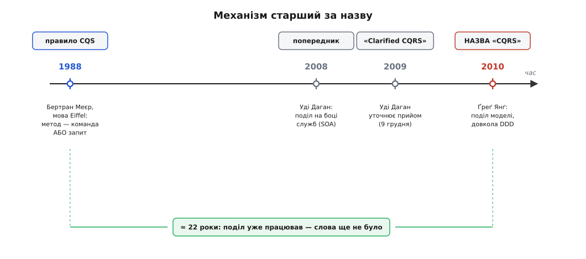

# 📜 Як народилося CQRS: механізм, що двадцять років чекав на назву

Є дивна річ у долі багатьох прийомів програмування: спершу люди навчаються **робити** щось, і лише набагато пізніше хтось дає цьому **ім'я**. Доти прийом живе безіменним — його переоткривають наново в кожному другому проєкті, описують незграбно на кшталт «ну, ми тут читання зробили окремо від запису», і не помічають, що всі говорять про одне й те саме. А тоді з'являється коротка формула, три-чотири слова, — і раптом розрізнена практика стає **предметом розмови**: її можна назвати, порівняти, посперечатися про неї, накопичити навколо неї досвід.

Саме так сталося з розділенням боку читання й боку запису. Механізм — розводити те, що міняє стан, і те, що його показує, — старий. А назва «CQRS» молода: їй заледве більше десятиліття. І між механізмом та назвою лежить проміжок років у двадцять, повний людей, які робили це діло, не знаючи, як його назвати. Розібратися в цьому проміжку варто не заради дат самих по собі, а щоб не сплутати дві геть різні речі: **ідею** (яка старша й ширша) та **термін** (який вужчий, конкретний і має авторів). Плутанина між ними — джерело половини суперечок довкола CQRS донині.



*Механізм і назва — не одне й те саме. Поділ читання й запису як думка сягає Меєрового правила методів (1988); слово «CQRS» дав йому Ґреґ Янґ близько 2010-го, а між ними — попередня робота Уді Дагана. Двадцять із гаком років прийом працював без імені.*

## Правило, з якого все проросло: Бертран Меєр і його методи

Почати треба не з CQRS, а з чогось значно скромнішого й старшого — з правила про **окремий метод об'єкта**. Його сформулював Бертран Меєр (фр. Bertrand Meyer), французький науковець, творець мови програмування Eiffel і автор ідеї «проєктування за контрактом» (англ. *Design by Contract*). У 1988 році вийшла його книга «Object-Oriented Software Construction» — одна з тих товстих засадничих книг, які згодом виявляються фундаментом цілого напряму. Саме там, серед сотень сторінок про об'єкти, спадкування й контракти, лежить правило, яке англійською назвали **Command–Query Separation**, CQS — [розділення команд і запитів](topic:sf-apps/command-query-separation): метод об'єкта має бути або командою (щось міняє, нічого не повертає), або запитом (щось повертає, нічого не міняє), але не обома разом.

Правило коротке до непристойності. Кожен метод об'єкта має бути **або** командою, **або** запитом — але ніколи обома разом:

```
Команда  — щось МІНЯЄ й нічого не повертає.
Запит    — щось ПОВЕРТАЄ й нічого не міняє.
Ніколи одне й друге в одному методі.
```

Меєр вимагав цього не з любові до симетрії, а заради дуже практичної властивості. Якщо запит нічого не міняє, його можна кликати **скільки завгодно й у будь-якому порядку** — і світ від цього не зрушить. Ти читаєш `balance()` десять разів поспіль, друкуєш його в лог, порівнюєш зі вчорашнім — і жодне з цих читань не має жодних наслідків. Меєр формулював це в дусі свого «проєктування за контрактом»: запит мусить бути тим, що математик назвав би прозорим за посиланням — виклик можна подумки замінити його результатом, і програма не зміниться. Це робить код передбачуваним: питання не псує відповіді.

А тепер уяви протилежне — метод, що порушує правило:

```
// Антиприклад: запит, який ПОТАЙ міняє стан.
int getBalance() {
    account.deductMonthlyFee();   // тихцем списав комісію!
    return account.balance;       // ...і аж тоді повернув
}
```

Тут `getBalance` вдає невинний запит, але потайки списує комісію. Наслідок підступний: кожне «прочитати баланс» насправді **зменшує** його. Код, який десь у логуванні чи в тесті двічі гляне на баланс, двічі спише комісію — і ніхто довго не збагне чому, бо саме питання зіпсувало відповідь. Меєрове правило вбиває цей клас помилок у корені: розвів команду й запит — і читання знову безпечне.

> 🔧 **Навіщо це.** CQS — це гігієна одного методу: дивишся на сигнатуру й одразу знаєш, це діло щось змінить чи лише розповість. Метод, що й міняє, і повертає (класика — `stack.pop()`, який і знімає верхівку, і віддає її), сам собою не гріх, але щоразу змушує пам'ятати про побічну дію. Меєр запропонував не змішувати ці ролі за замовчуванням — і саме з цього дрібного правила про **один метод** через двадцять із гаком років виросла ідея про **цілу архітектуру**.

Варто, до речі, знати, хто такий Меєр, — бо це багато пояснює в тому, як акуратно він мислив. Народжений 1950 року, випускник паризької Політехніки й Стенфорда, він не лише інженер: у нього ще й магістерський ступінь Сорбонни з російської літератури та мовознавства. Людина, звична розрізняти тонкі відтінки сенсу, — і CQS має саме цей присмак: не «як швидше», а «як не сплутати дві різні за природою речі». Ця настанова — розводити те, що плутають, — і є справжній корінь усієї подальшої історії.

> Статус: **добре засвідчено**. Авторство CQS за Бертраном Меєром і рік першого видання «Object-Oriented Software Construction» (1988; друге видання — 1997) підтверджені його власними працями й довідковими джерелами. Це не спірна атрибуція.

## Двадцять років безіменної практики

Тепер найцікавіше — і найлегше проґавити. Між Меєровим правилом 1988 року й назвою «CQRS» близько 2010-го лежать понад два десятиліття, і в ці роки поділ читання й запису **вже жив** у практиці — тільки без спільного імені й без усвідомлення, що це один прийом.

Подумай, звідки він мусив узятися. Будь-хто, хто будував систему з важкими звітами поверх бази, що ще й приймає замовлення, рано чи пізно впирався в ту саму стіну: звіти душать транзакції, транзакції гальмують звіти. І люди робили очевидне — заводили окрему копію даних під читання. У світі баз даних це давня, добре вторована стежка: транзакційна база для запису (те, що фахівці звуть OLTP — обробка транзакцій наживо) й окреме сховище під аналітику та звіти, куди дані переливають пачками (те, що звуть OLAP — аналітична обробка). Ба більше — сама конструкція «репліка лише для читання», куди головна база транслює свої зміни з невеликим відставанням, стара як самі промислові СУБД. Механічно це вже і є розведення читання й запису у два різні шляхи з двома різними формами даних. Просто ніхто не називав це «патерном проєктування» — це була рутина адміністрування баз, а не архітектурна ідея.

Отут і криється суть історії, і її легко змазати. **Механізм переоткривали безліч разів у безлічі місць** — у реплікації баз, у розділенні OLTP та OLAP, у ручному кешуванні «плоских» уявлень під екран. Але доти, доки не було короткої назви, всі ці випадки лишалися **окремими**: реплікацію обговорювали адміністратори баз, кеш під екран — прикладні розробники, аналітичні сховища — інженери даних, і ніхто не бачив, що це грані одного й того самого поділу. Назва — це не просто ярлик; це те, що зшиває розрізнені практики в **одну впізнавану річ**, про яку відтоді можна говорити як про ціле. До назви прийом був усюди й ніде водночас.

> 🔧 **Навіщо це.** Коли наступного разу почуєш «CQRS — це щось нове й модерне», згадай цю картину. Розводити читання й запис люди навчилися задовго до слова «CQRS» — новою була не **дія**, а **усвідомлення її як окремого іменованого прийому на рівні застосунку, а не бази**. Це типовий життєпис ідеї в нашому ремеслі: спершу її роблять руками наосліп, потім хтось дає їй ім'я — і аж тоді вона стає предметом, який можна вчити, порівнювати й критикувати.

## Уді Даган: місток від правила до архітектури

Перший, хто заговорив про це вже як про **свідомий архітектурний прийом** близько до того вигляду, у якому ми знаємо його нині, — Уді Даган (івр. עודי דהן, Udi Dahan), ізраїльський архітектор, випускник Техніону, знаний як творець NServiceBus і як один із найпослідовніших популяризаторів сервісно-орієнтованого проєктування та [предметно-орієнтованого проєктування](topic:sf-apps/domain-driven-design) (англ. *Domain-Driven Design*, DDD — модель предметної області з поведінкою, а не мішок даних) у .NET-спільноті.

Даган прийшов до цього поділу не з боку методів, а з боку **служб**. Він міркував про великі системи, зшиті з окремих сервісів, і про те, як у такій системі уживаються дві геть різні потреби: приймати команди, що змінюють стан із дотриманням правил, — і віддавати дані на екрани, часто зовсім іншої форми. У серпні 2008 року він оприлюднив навчальний матеріал, де цей поділ читання й запису вже стояв як усвідомлений принцип побудови служб, сплетений із сервісно-орієнтованою архітектурою (SOA). А в грудні 2009-го вийшла його стаття «Clarified CQRS» — і сама назва промовиста: **уточнити** те, що спільнота вже почала мусолити, але плутала. На той момент довкола прийому вже наросли супутні ідеї — його зчіпляли з подіями, натягували на нього звичні уявлення про пошарову архітектуру, — і Даган узявся розчистити: ось **сам** прийом, а ось місця, де він **дотикається** до інших, але з ними не тотожний.

> Статус: **добре засвідчено**. Дати матеріалів Дагана (навчальний курс — серпень 2008; стаття «Clarified CQRS» — 9 грудня 2009) підтверджені його власним сайтом та довідковими джерелами. Що варто уточнити чесно: у «Clarified CQRS» Даган **не** приписує термін комусь поіменно й не переказує його історію — він одразу входить у суть прийому. Тож роль Дагана краще описувати як **попередника й ключового уточнювача**, а не як того, хто дав назву.

Тут напрошується точність, бо навколо цього досі туман. Даган **не** був автором самого слова «CQRS» — і сам на це не претендує. Але його робота 2008–2009 років — очевидний **місток**: вона підняла Меєрів поділ із рівня окремого методу на рівень цілого застосунку й служб і зробила його предметом спільнотної розмови ще **до** того, як усталилася коротка назва. Без цього містка стрибок від «правила про метод» до «архітектурного прийому» виглядав би раптовим; насправді його вимостили заздалегідь.

## Ґреґ Янґ і слово «CQRS»

А слово дав Ґреґ Янґ (англ. Greg Young) — розробник і доповідач, тісно пов'язаний зі спільнотою предметно-орієнтованого проєктування й особливо з ідеєю [зберігання стану як послідовності подій](topic:sf-apps/event-sourcing) (англ. *event sourcing* — тримати не поточний знімок, а весь ланцюг подій, що до нього привели). Близько 2010 року, у розмовах, доповідях і дописах довкола DDD, він почав уживати абревіатуру **CQRS — Command Query Responsibility Segregation**, «розділення відповідальності команд і запитів», — і назва миттю прижилася.

Придивися до самого слова — воно навмисне перегукується з Меєровим. У Меєра було **Command–Query Separation**: розділення команд і запитів на рівні методу. Янґ узяв той самий кістяк і вставив у нього одне слово — **Responsibility**, відповідальність:

```
CQS   = Command Query        Separation      (рівень методу)
CQRS  = Command Query   RESPONSIBILITY   Segregation  (рівень моделі)
                        └── одне вставлене слово підіймає масштаб ──┘
```

Це вставлене «відповідальність» — не оздоба, а весь зміст стрибка. Меєр розводив **два методи** на спільному об'єкті: дані одні, тип один, різняться лише виклики. Янґ розводить **дві відповідальності** — цілий обов'язок міняти стан і цілий обов'язок його показувати — у дві окремі моделі, кожну зі своїм типом, своєю схемою, своїм шляхом крізь код. Той самий принцип «не змішуй те, що міняє, з тим, що показує», лише піднятий на поверх вище: з одного методу — на форму цілого застосунку. Назва несе в собі цю спадкоємність відкрито: чуєш «CQRS» — і вже знаєш, що корінь у Меєровому CQS, лише масштаб інший.

Про авторство Янґа треба сказати з тією обережністю, на яку заслуговує жива історія, а не легенда. Мартін Фаулер (англ. Martin Fowler), який чи не найбільше зробив, щоб описати цей прийом широкій аудиторії, у своєму нарисі каже стримано: це «прийом, який я вперше почув **в описі Ґреґа Янґа**». Не «який винайшов Янґ» — а «в чиєму описі вперше почув». Різниця тонка, але важлива, і вона типова для того, як народжуються назви в живій спільноті: слово рідко має єдиного карбувальника з точною датою на монеті. Воно радше **зринає** й **устоюється** в перемовах кількох людей — Янґа, Дагана, інших довкола DDD, — доки одна форма не витісняє решту. Ґреґові Янґу справедливо приписують те, що він **пустив термін у широкий обіг** і зробив його впізнаваним; але малювати сцену, де він одного дня «вигадав слово», було б надто чепурно для того, як усе було насправді.

> Статус: **засвідчено з обережністю щодо авторства**. Що Ґреґ Янґ увів і розкрутив термін «CQRS» близько 2010-го — підтверджують і Фаулерів нарис, і довідкові джерела; дописи Янґа тих років («CQS проти CQRS», 2009; «CQRS, задачні інтерфейси та event sourcing», 2010) документують, як він відточував поняття. Обережність — саме щодо **моменту й одноосібності** карбування слова: Фаулер свідомо каже «вперше почув в описі Янґа», а сам термін устоявся в спільнотній розмові, де свою роль відіграв і Даган. Тож: **Янґ — той, хто дав назву обіг і впізнаваність**; історія слова — колективна, не подвиг одинака.

> 🔧 **Навіщо це.** Це урок про те, як читати авторство ідей у програмуванні взагалі. За гучною назвою майже завжди стоїть довший, тихіший родовід: правило (Меєр), місток (Даган), назва (Янґ) — і жоден із них не «винайшов CQRS» цілком сам. Коли наступного разу почуєш «X винайшов патерн Y», варто розрізнити чотири різні речі: хто подав **ідею**, хто **описав** її як прийом, хто дав **назву** й хто зробив її **ходовою**. Це рідко одна людина — і майже ніколи не одна дата.

## Чому механізм неодмінно старший за назву

Відступімо на крок і подивімося на всю дугу — бо в ній є закономірність, ширша за саме CQRS. Спершу **потреба**: одна модель не тягне й запис, і читання, вони рвуть її в різні боки. Потім **безіменна практика**: люди роблять очевидне — розводять читання й запис — хто в реплікації бази, хто в окремому аналітичному сховищі, хто в ручному кеші під екран, і кожен вважає це своєю локальною хитрістю. Потім **місток**: хтось (тут — Даган) підіймає розрізнені хитрощі до рівня свідомого архітектурного принципу й починає про них говорити як про ціле. І аж тоді **назва** (тут — Янґ): коротка формула, що зшиває все докупи й робить прийом предметом, який можна вчити, порівнювати й критикувати.

Ця послідовність — не випадок саме цієї історії, а її природний хід. Назва не може передувати практиці, бо назва — це **згусток** уже накопиченого досвіду: щоб було що іменувати, спершу мусить назбиратися купка схожих випадків, які кортить назвати одним словом. Тому в будь-якому зрілому прийомі механізм завжди старший за термін — і CQRS тут не виняток, а взірцевий приклад правила.

І звідси — практичний висновок, заради якого варто було все це розкопувати. Коли зважуєш, брати CQRS чи ні, не дай назві збити себе з пантелику в жоден бік. Не думай «це щось нове й модне, тож круте» — механізмові десятиліття, нового в ньому лише слово. І не думай «це щось важке й архітектурне, тож не для мене» — у найлегшій формі це просто «читання окремо від запису», яке люди роблять, відколи існують бази з важкими звітами. Дивися **крізь** назву на механізм і на потребу під ним: чи рве твою модель у два боки — запис в один, читання в інший? Рве — розводь, і рівно настільки, наскільки болить. Ім'я «CQRS» тут лише зручна ручка, за яку цю думку зручно тримати, — а не чарівне слово, що робить архітектуру правильною.

Родовід прийому — Меєрове правило про метод, Даганів місток до архітектури, Янґове слово, що все зшило, — вартий того, щоб його знати, саме тому. Він щеплення проти двох однаково поширених хвороб: побожного остраху перед «складним патерном» і бездумного захвату «модною абревіатурою». І те, і те лікується тим самим — розумінням, що за трьома літерами стоїть стара, проста й чесна думка: **не змішуй те, що міняє стан, із тим, що його показує.** Меєр сказав це про один метод у 1988-му. Двадцять із гаком років по тому Ґреґ Янґ сказав те саме про цілий застосунок — і дав цьому назву.
