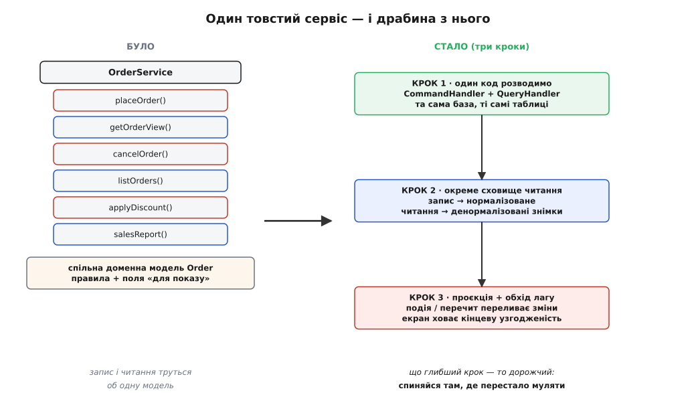

# ⚙️ Розділяємо товстий OrderService: три кроки в CQRS на живому коді

Візьмемо один сервіс, який ти бачив у сотні застосунків, і проведемо його крізь CQRS власними руками — не як діаграму, а як послідовність правок, кожну з яких можна закомітити окремо й на кожній зупинитися назавжди. Сервіс цей — `OrderService`, і хворий він рівно тією хворобою, проти якої CQRS існує: методи запису й методи читання живуть упереміш в одному класі, обидва тягнуть ту саму доменну модель, і від цього обидва потроху псуються.

Мета — не «зробити красиво», а на кожному кроці чесно виписати три речі: **що купуємо**, **чим платимо**, **яка тут пастка**. Бо CQRS — це драбина, а не двері: перша сходинка коштує майже нічого й окупається майже завжди, остання коштує кінцевої узгодженості й окупається лише під тиском. Кожен, хто береться за цей рефакторинг, мусить знати, на якій сходинці зупинитися — і ця зупинка залежить не від моди, а від того, скільки болить прямо зараз.



*Вихідна точка й уся дорога одразу. Ліворуч — одна модель, до якої з двох боків тягнуться несумісні вимоги. Праворуч — три сходинки виходу; що глибша, то дорожча, і спинятися треба там, де перестало муляти, а не там, де скінчилася діаграма.*

## Хворий, з якого починаємо

Ось `OrderService`, як він виростає сам собою, коли ніхто його свідомо не проєктував. Наведу двома мовами прикладного рівня — саме такий код і пишуть у застосунках, де є замовлення.

:::tabs
```ts
// ТОВСТИЙ СЕРВІС: запис і читання в одному класі, на спільній моделі.
class OrderService {
  constructor(private db: Db) {}

  // --- запис: тут ЖИВУТЬ правила ---
  placeOrder(userId: string, items: LineItem[]): string {
    const order = Order.create(userId, items); // конструктор боронить інваріанти
    order.reserveStock();                       // кине, якщо товару бракує
    this.db.insert("orders", order.toRow());
    for (const li of order.lines) this.db.insert("order_lines", li.toRow());
    return order.id;
  }

  cancelOrder(id: string): void {
    const order = this.load(id);      // тягнемо ВЕСЬ агрегат заради одного поля статусу
    order.cancel();                   // правило: не можна скасувати відвантажене
    this.db.update("orders", order.toRow());
  }

  // --- читання: тут правил нема, але шлях той самий, через доменну модель ---
  getOrderView(id: string): OrderView {
    const order = this.load(id);      // знову ВЕСЬ агрегат — заради показу трьох полів
    const user = this.db.queryOne("SELECT name FROM users WHERE id=?", [order.userId]);
    return {
      id: order.id,
      customerName: user.name,        // склеюємо дані для екрана ПРЯМО в сервісі запису
      total: order.total(),
      status: order.status,
    };
  }

  listOrders(userId: string): OrderView[] {
    const rows = this.db.query("SELECT id FROM orders WHERE user_id=?", [userId]);
    return rows.map(r => this.getOrderView(r.id)); // N+1: по агрегату на кожен рядок
  }

  private load(id: string): Order {
    const row = this.db.queryOne("SELECT * FROM orders WHERE id=?", [id]);
    const lines = this.db.query("SELECT * FROM order_lines WHERE order_id=?", [id]);
    return Order.fromRows(row, lines);
  }
}
```
```python
# ТОВСТИЙ СЕРВІС: запис і читання в одному класі, на спільній моделі.
class OrderService:
    def __init__(self, db: Db) -> None:
        self._db = db

    # --- запис: тут ЖИВУТЬ правила ---
    def place_order(self, user_id: str, items: list[LineItem]) -> str:
        order = Order.create(user_id, items)   # конструктор боронить інваріанти
        order.reserve_stock()                  # кине, якщо товару бракує
        self._db.insert("orders", order.to_row())
        for li in order.lines:
            self._db.insert("order_lines", li.to_row())
        return order.id

    def cancel_order(self, order_id: str) -> None:
        order = self._load(order_id)   # тягнемо ВЕСЬ агрегат заради одного поля статусу
        order.cancel()                 # правило: не можна скасувати відвантажене
        self._db.update("orders", order.to_row())

    # --- читання: тут правил нема, але шлях той самий, через доменну модель ---
    def get_order_view(self, order_id: str) -> OrderView:
        order = self._load(order_id)   # знову ВЕСЬ агрегат — заради показу трьох полів
        user = self._db.query_one("SELECT name FROM users WHERE id=?", [order.user_id])
        return OrderView(
            id=order.id,
            customer_name=user.name,   # склеюємо дані для екрана ПРЯМО в сервісі запису
            total=order.total(),
            status=order.status,
        )

    def list_orders(self, user_id: str) -> list[OrderView]:
        rows = self._db.query("SELECT id FROM orders WHERE user_id=?", [user_id])
        return [self.get_order_view(r.id) for r in rows]  # N+1: агрегат на кожен рядок

    def _load(self, order_id: str) -> Order:
        row = self._db.query_one("SELECT * FROM orders WHERE id=?", [order_id])
        lines = self._db.query("SELECT * FROM order_lines WHERE order_id=?", [order_id])
        return Order.from_rows(row, lines)
```
:::

Придивись, де саме тут болить, бо це той біль, який ми лікуватимемо, і не варто його забувати за модними словами.

Перше: `getOrderView` **завантажує весь агрегат** `Order` з усіма позиціями, з усіма правилами, які він тягне за собою, — щоб показати три поля на картці. Це марна робота: доменна модель важка не тому, що дурна, а тому, що вона несе інваріанти, а інваріанти читанню не потрібні взагалі. Читання платить за строгість, якою не користується.

Друге, гірше: `customerName` — це поле **для екрана**, і склеюється воно тут, у сервісі, де живуть правила запису. Ім'я клієнта до інваріантів замовлення не має жодного стосунку, але код показу вже проліз у код зміни. Наступним кроком хтось додасть `formattedTotal`, потім `statusLabel` українською, і доменна модель почне обростати полями, які нічого не боронять, — тими самими `displayName`, `formattedTotal`, `customerAddressCached`, від яких застерігає сама тема. Модель, що мала тримати правила, перетворюється на мішок для відображення.

Третє: `listOrders` викликає `getOrderView` у циклі — а отже, вантажить окремий агрегат на **кожен** рядок списку. Це класична пастка N+1: один запит на список плюс по кілька запитів на кожен елемент. На десяти замовленнях непомітно, на тисячі — сторінка вмирає.

Усі три болі — з одного кореня: **одна модель служить двом панам**. Розчепимо їх.

## Крок 1: розводимо код у тій самій базі

Найдешевша сходинка, і починати треба саме з неї. Ми **не** чіпаємо базу, **не** заводимо подій, **не** додаємо жодної нової технології. Ми лише розрізаємо один клас на два: `CommandHandler`-и, де залишаються правила й доменна модель, і `QueryHandler`-и, які читають найкоротшим шляхом — плоским SQL повз агрегат.

Спершу бік команд. Кожна команда — це проста структура «намір із даними», а обробник її виконує через справжню доменну модель. Зверни увагу: тут з'явилася межа — обробник більше **фізично не має** методу читання під показ, тож спокуса склеїти екранне поле поруч із правилом просто зникає.

:::tabs
```ts
// --- БІК КОМАНД: сама поведінка, жодного коду під екран ---
type PlaceOrder = { userId: string; items: LineItem[] };
type CancelOrder = { orderId: string };

class PlaceOrderHandler {
  constructor(private orders: OrderRepository) {}
  handle(cmd: PlaceOrder): string {
    const order = Order.create(cmd.userId, cmd.items);
    order.reserveStock();
    this.orders.save(order);          // репозиторій пише нормалізовано
    return order.id;
  }
}

class CancelOrderHandler {
  constructor(private orders: OrderRepository) {}
  handle(cmd: CancelOrder): void {
    const order = this.orders.byId(cmd.orderId); // агрегат вантажимо, бо ТУТ це правда:
    order.cancel();                              // правило справді читає стан замовлення
    this.orders.save(order);
  }
}
```
```python
from dataclasses import dataclass

# --- БІК КОМАНД: сама поведінка, жодного коду під екран ---
@dataclass
class PlaceOrder:
    user_id: str
    items: list[LineItem]

@dataclass
class CancelOrder:
    order_id: str

class PlaceOrderHandler:
    def __init__(self, orders: OrderRepository) -> None:
        self._orders = orders
    def handle(self, cmd: PlaceOrder) -> str:
        order = Order.create(cmd.user_id, cmd.items)
        order.reserve_stock()
        self._orders.save(order)       # репозиторій пише нормалізовано
        return order.id

class CancelOrderHandler:
    def __init__(self, orders: OrderRepository) -> None:
        self._orders = orders
    def handle(self, cmd: CancelOrder) -> None:
        order = self._orders.by_id(cmd.order_id)  # агрегат вантажимо, бо ТУТ це правда:
        order.cancel()                            # правило справді читає стан замовлення
        self._orders.save(order)
```
:::

Тепер бік запитів. Тут — і це головне — поведінки нема **взагалі**. Жодного `Order`, жодного репозиторія агрегатів, жодного `load`. Голий SQL, що бере рівно ті стовпці, які потрібні екрану, і повертає плоский тип. Список тепер — **один** запит із з'єднанням, а не N+1.

:::tabs
```ts
// --- БІК ЗАПИТІВ: плоскі типи під екран, читання повз доменну модель ---
type OrderView = { id: string; customerName: string; total: number; status: string };

class OrderQueries {
  constructor(private db: Db) {}

  getOrderView(id: string): OrderView {
    return this.db.queryOne(`
      SELECT o.id, u.name AS customerName, o.total, o.status
      FROM orders o JOIN users u ON u.id = o.user_id
      WHERE o.id = ?`, [id]);
  }

  // список — ОДИН запит із JOIN, а не агрегат на кожен рядок
  listOrders(userId: string): OrderView[] {
    return this.db.query(`
      SELECT o.id, u.name AS customerName, o.total, o.status
      FROM orders o JOIN users u ON u.id = o.user_id
      WHERE o.user_id = ?
      ORDER BY o.created_at DESC`, [userId]);
  }
}
```
```python
from dataclasses import dataclass

# --- БІК ЗАПИТІВ: плоскі типи під екран, читання повз доменну модель ---
@dataclass
class OrderView:
    id: str
    customer_name: str
    total: float
    status: str

class OrderQueries:
    def __init__(self, db: Db) -> None:
        self._db = db

    def get_order_view(self, order_id: str) -> OrderView:
        return self._db.query_one("""
            SELECT o.id, u.name AS customer_name, o.total, o.status
            FROM orders o JOIN users u ON u.id = o.user_id
            WHERE o.id = ?""", [order_id])

    # список — ОДИН запит із JOIN, а не агрегат на кожен рядок
    def list_orders(self, user_id: str) -> list[OrderView]:
        return self._db.query("""
            SELECT o.id, u.name AS customer_name, o.total, o.status
            FROM orders o JOIN users u ON u.id = o.user_id
            WHERE o.user_id = ?
            ORDER BY o.created_at DESC""", [user_id])
```
:::

Ось і весь перший крок. Дві бази? Ні. Події? Ні. Ми просто перестали вдавати, що зміна й показ — це той самий шлях крізь код.

**Що купуємо.** Три речі, і всі відчутні одразу. По-перше, зникла N+1: список — один запит замість тисячі. По-друге, доменна модель очистилася — з неї нема куди чіпляти екранні поля, бо той, хто малює екран, до неї більше не заходить; вона знову тримає лише правила. По-третє — і це недооцінюють — код став **читатися**. Відкриваєш `PlaceOrderHandler` і бачиш чисту поведінку; відкриваєш `OrderQueries` і бачиш чисте читання. Ніхто вже не гадає, чи `getOrderView` часом не міняє стан десь усередині: за самою формою видно, що запит — це запит. Це та сама вигода, що й у [розділенні команд і запитів на рівні методу](topic:sf-apps/command-query-separation), лише піднята на рівень цілих класів.

**Чим платимо.** Небагато, і саме тому з цього кроку варто починати. З'явився дубль **форми даних**: `OrderView` описує ті самі поля, що й рядок таблиці, і якщо в `orders` додати стовпець, який треба показати, його доведеться дописати і в SQL запиту, і в тип `OrderView`. Ще платимо дисципліною: тепер є домовленість «команди сюди, запити туди», і її треба тримати всією командою, інакше за пів року хтось знову зліпить читання-в-записі, і ти повернешся до товстого сервісу, лише з гіршими іменами файлів.

> 🔧 **Навіщо це.** На цьому кроці спокуса — сказати «та це ж просто розкидали методи по двох класах, навіщо гучне слово». Але суть не в кількості класів, а в тому, що зникла **причина** доменній моделі рости в бік показу: коли єдиний код, який малює екран, фізично не бачить агрегата, поля `formattedTotal` нема де народитися. Ти лікуєш не безлад, а джерело безладу. І робиш це за ціну, яку не шкода, — годину роботи й один дубль типу.

**Пастка кроку 1.** Найпідступніша й найчастіша: **читання, що потайки пише**. У товстому сервісі часто трапляється метод на кшталт `getDashboard()`, який дорогою «оновлює лічильник переглядів» або «ставить `last_seen`». Коли ти механічно перекладаєш його в `QueryHandler`, ти переносиш і цей запис — і твій «запит» лишається командою в машкарі. Правило залізне: **із запитів вичищаємо будь-який запис до останку**. Якщо перегляд справді має щось інкрементувати — це окрема команда `RecordView`, яку викликає, скажімо, шар вище, а не побічний ефект усередині читання. Пропустиш це — і вся вигода прозорості згорить: твої «безпечні» запити знову небезпечно кликати двічі.

Друга, тихіша пастка — **розповзання пари SQL-і-тип**. Коли запитів стає багато, той самий `JOIN users` копіюється в десять місць. Це ще терпимо (для того й буде крок 2), але вже тут варто тримати запити в одному місці, а не розсипати по контролерах, інакше зміна імені стовпця перетвориться на полювання.

## Крок 2: окреме сховище читання

Настає момент, коли самого поділу коду мало. Уяви не картку одного замовлення, а головну сторінку крамниці: топ товарів за місяць, персональні поради, лічильники, зведення по кількох таблицях. Щоб зібрати такий екран із нормалізованих таблиць запису, тому чистому SQL із кроку 1 доводиться робити десяток важких з'єднань і агрегацій — **на кожне** відкриття сторінки. І б'є це по тій самій базі, що приймає замовлення. Читання починає заважати запису: звіт гальмує оформлення, оформлення сповільнює звіт. Оптимізувати індексами вже не рятує, бо форма даних просто **не та** — нормалізація, яка потрібна запису для строгості, читанню коштує з'єднань.

Тут CQRS робить наступний крок: заводимо **окреме сховище під читання**, де дані лежать уже денормалізовані — складені в готові до показу знімки. Один рядок «замовлення для картки» містить усе відразу: і `customerName`, і `total`, і `status` — жодного `JOIN`, читання одним доторком. Це може бути окрема таблиця в тій самій базі, окрема база, ба навіть інша технологія, заточена під швидку віддачу за ключем.

Оголосимо явну модель читання — це просто денормалізований рядок — і сховище, що ним торгує:

:::tabs
```ts
// МОДЕЛЬ ЧИТАННЯ: денормалізований знімок, усе для картки в одному рядку.
type OrderReadModel = {
  id: string;
  userId: string;
  customerName: string;   // ← уже склеєно, жодного JOIN на читанні
  total: number;
  status: string;
  updatedAt: number;      // коли знімок востаннє наздогнав запис
};

class OrderReadStore {
  constructor(private kv: KeyValueDb) {}          // окреме сховище під читання

  byId(id: string): OrderReadModel | null {
    return this.kv.get(`order:${id}`);            // один доторок за ключем
  }
  listByUser(userId: string): OrderReadModel[] {
    return this.kv.getByIndex("order_by_user", userId); // готовий індекс
  }

  // сюди пише ЛИШЕ проєкція (крок 3), не бізнес-код
  upsert(m: OrderReadModel): void {
    this.kv.put(`order:${m.id}`, m);
    this.kv.index("order_by_user", m.userId, m.id);
  }
}
```
```python
from dataclasses import dataclass

# МОДЕЛЬ ЧИТАННЯ: денормалізований знімок, усе для картки в одному рядку.
@dataclass
class OrderReadModel:
    id: str
    user_id: str
    customer_name: str    # ← уже склеєно, жодного JOIN на читанні
    total: float
    status: str
    updated_at: float     # коли знімок востаннє наздогнав запис

class OrderReadStore:
    def __init__(self, kv: KeyValueDb) -> None:   # окреме сховище під читання
        self._kv = kv

    def by_id(self, order_id: str) -> OrderReadModel | None:
        return self._kv.get(f"order:{order_id}")  # один доторок за ключем

    def list_by_user(self, user_id: str) -> list[OrderReadModel]:
        return self._kv.get_by_index("order_by_user", user_id)  # готовий індекс

    # сюди пише ЛИШЕ проєкція (крок 3), не бізнес-код
    def upsert(self, m: OrderReadModel) -> None:
        self._kv.put(f"order:{m.id}", m)
        self._kv.index("order_by_user", m.user_id, m.id)
```
:::

Бік запису лишається таким, як був після кроку 1: пише нормалізовано у своє сховище, де живуть [агрегати](topic:sf-apps/aggregates-consistency) й правила. Бік читання тепер бере знімки з `OrderReadStore` — і `getOrderView` перетворюється на буквально одне звертання за ключем.

**Що купуємо.** Читання стає **блискавичним** і, головне, **розв'язаним** зі записом: топ-сторінка більше не колотить базу замовлень, бо читає з окремого сховища. Два боки можна масштабувати нарізно — почепити на читання десять реплік, поки запис лишається одним вузлом заради строгості. Форма даних читання тепер вільна: хочеш під новий екран інший зріз — робиш ще один знімок, і бік запису про це навіть не знає.

**Чим платимо.** Ось де CQRS перестає бути безкоштовним і виставляє рахунок — і рахунок цей значно більший за дубль типу з кроку 1. З'явилося **дублювання самих даних**: ім'я клієнта тепер лежить і в `users`, і всередині кожного знімка замовлення. Дублювання завжди означає ризик розбіжності — і ми маємо його свідомо тримати в вузді, а не вдавати, що його нема. А ще ми щойно завели **другу річ, яку треба тримати живою**: сховище читання не наповнюється саме собою. Хтось мусить переливати зміни з боку запису в ці знімки. Цей «хтось» — проєкція, і це весь крок 3.

**Пастка кроку 2.** Найгрубша помилка тут — дозволити **бізнес-коду писати прямо в сховище читання**. Спокуса очевидна: команда змінила статус, і поруч так зручно відразу `readStore.upsert(...)` — навіщо якась проєкція? А потім цей самий статус треба оновити ще з трьох місць, і одне з них забувають, і знімок починає брехати. Правило: **у сховище читання пише рівно один шлях — проєкція**. Бізнес-код чіпає лише бік запису; синхронізацію робить окремий, єдиний механізм. Порушиш — дістанеш знімки, що суперечать одне одному, і жодного місця, де можна це полагодити одним рухом.

Друга пастка — **передчасність**. Окреме сховище — велика вага: друга технологія в експлуатації, друга схема, другий шлях відмови. Заводити його, поки чистий SQL із кроку 1 ще тримає навантаження, — це платити наперед за проблему, якої нема. Крок 2 виправданий лише під конкретним тиском: читань **набагато** більше за записи й вони настільки важкі, що заважають запису, або читанню потрібна геть інша форма даних. Нема тиску — лишайся на кроці 1.

## Крок 3: проєкція, що переливає зміни

Тепер найтонше. Сховище читання порожнє й тупе; хтось має його наповнювати й підтримувати живим щоразу, коли бік запису щось змінив. Цей код і зветься **проєкцією** (англ. *projection* — «проєкція», відображення): він бере зміну з боку запису й перебудовує відповідні знімки на боці читання.

Є два способи її зробити, і різниця між ними — це компроміс між зв'язністю й свіжістю.

**Спосіб А — через подію.** Команда, відпрацювавши, оголошує факт: «замовлення оформлено», «статус змінено». Проєкція підписана на ці факти й на кожен перебудовує знімок. Так CQRS природно сходиться з [подієвим стилем](topic:sf-apps/event-driven-architecture) — але, наголошую, **не зобов'язаний** до нього. Подія тут — просто зручний кур'єр зміни.

:::tabs
```ts
// подія — плоский факт про те, що вже сталося на боці запису
type OrderPlaced = {
  type: "OrderPlaced";
  orderId: string; userId: string; total: number;
};
type OrderCancelled = { type: "OrderCancelled"; orderId: string };
type OrderEvent = OrderPlaced | OrderCancelled;

class OrderProjection {
  constructor(private read: OrderReadStore, private users: UserLookup) {}

  // на КОЖНУ подію оновлюємо denormalized-знімок
  on(ev: OrderEvent): void {
    switch (ev.type) {
      case "OrderPlaced": {
        // ім'я клієнта склеюємо ТУТ, ОДИН раз, а не на кожному читанні
        const name = this.users.nameOf(ev.userId);
        this.read.upsert({
          id: ev.orderId, userId: ev.userId, customerName: name,
          total: ev.total, status: "placed", updatedAt: Date.now(),
        });
        break;
      }
      case "OrderCancelled": {
        const cur = this.read.byId(ev.orderId);
        if (cur) this.read.upsert({ ...cur, status: "cancelled", updatedAt: Date.now() });
        break;
      }
    }
  }
}

// команда тепер, окрім запису, оголошує факт — його підхопить проєкція
class PlaceOrderHandler {
  constructor(private orders: OrderRepository, private bus: EventBus) {}
  handle(cmd: PlaceOrder): string {
    const order = Order.create(cmd.userId, cmd.items);
    order.reserveStock();
    this.orders.save(order);
    this.bus.publish({ type: "OrderPlaced", orderId: order.id,
                       userId: cmd.userId, total: order.total() });
    return order.id;
  }
}
```
```python
from dataclasses import dataclass
import time

# подія — плоский факт про те, що вже сталося на боці запису
@dataclass
class OrderPlaced:
    order_id: str
    user_id: str
    total: float

@dataclass
class OrderCancelled:
    order_id: str

class OrderProjection:
    def __init__(self, read: OrderReadStore, users: UserLookup) -> None:
        self._read = read
        self._users = users

    # на КОЖНУ подію оновлюємо denormalized-знімок
    def on(self, ev) -> None:
        if isinstance(ev, OrderPlaced):
            # ім'я клієнта склеюємо ТУТ, ОДИН раз, а не на кожному читанні
            name = self._users.name_of(ev.user_id)
            self._read.upsert(OrderReadModel(
                id=ev.order_id, user_id=ev.user_id, customer_name=name,
                total=ev.total, status="placed", updated_at=time.time()))
        elif isinstance(ev, OrderCancelled):
            cur = self._read.by_id(ev.order_id)
            if cur:
                cur.status = "cancelled"
                cur.updated_at = time.time()
                self._read.upsert(cur)

# команда тепер, окрім запису, оголошує факт — його підхопить проєкція
class PlaceOrderHandler:
    def __init__(self, orders: OrderRepository, bus: EventBus) -> None:
        self._orders = orders
        self._bus = bus
    def handle(self, cmd: PlaceOrder) -> str:
        order = Order.create(cmd.user_id, cmd.items)
        order.reserve_stock()
        self._orders.save(order)
        self._bus.publish(OrderPlaced(order_id=order.id,
                                      user_id=cmd.user_id, total=order.total()))
        return order.id
```
:::

**Спосіб Б — перечитуванням.** Жодних подій. Окремий процес періодично питає бік запису «що змінилося від часу X?» і перебудовує знімки для змінених рядків. Простіший у налагодженні (нема шини, нема доставки повідомлень), але свіжість гірша — знімок відстає рівно на період опитування.

:::tabs
```ts
// проєкція-перечитувач: тягне змінене від контрольної точки й оновлює знімки
class RebuildProjection {
  constructor(private db: Db, private read: OrderReadStore) {}
  private since = 0;  // контрольна точка: до цього моменту вже спроєктовано

  tick(): void {
    const changed = this.db.query(`
      SELECT o.id, o.user_id, u.name AS customerName, o.total, o.status
      FROM orders o JOIN users u ON u.id = o.user_id
      WHERE o.updated_at > ?`, [this.since]);
    for (const r of changed) {
      this.read.upsert({ id: r.id, userId: r.user_id, customerName: r.customerName,
                         total: r.total, status: r.status, updatedAt: Date.now() });
    }
    this.since = Date.now();  // посуваємо контрольну точку вперед
  }
}
```
```python
import time

# проєкція-перечитувач: тягне змінене від контрольної точки й оновлює знімки
class RebuildProjection:
    def __init__(self, db: Db, read: OrderReadStore) -> None:
        self._db = db
        self._read = read
        self._since = 0.0  # контрольна точка: до цього моменту вже спроєктовано

    def tick(self) -> None:
        changed = self._db.query("""
            SELECT o.id, o.user_id, u.name AS customer_name, o.total, o.status
            FROM orders o JOIN users u ON u.id = o.user_id
            WHERE o.updated_at > ?""", [self._since])
        for r in changed:
            self._read.upsert(OrderReadModel(
                id=r.id, user_id=r.user_id, customer_name=r.customer_name,
                total=r.total, status=r.status, updated_at=time.time()))
        self._since = time.time()  # посуваємо контрольну точку вперед
```
:::

Обидва способи мають одну спільну властивість, і вона визначальна: знімок оновлюється **не миттєво**. Між моментом, коли команда змінила стан, і моментом, коли проєкція оновила знімок, минає час. І цей час — не дрібниця, а нове явище, з яким доведеться жити.

### Лаг, який муляє на екрані

Це [кінцева узгодженість](topic:sf-distributed/eventual-consistency) у чистому вигляді: дані **зрештою** зійдуться, але не в ту саму мить. І б'є вона по користувачеві найнесподіванішим чином. Людина натискає «змінити адресу доставки», система приймає команду, сторінка перезавантажується — а там **стара** адреса, бо проєкція ще не встигла добігти. Для користувача це баг: «я ж зберіг, чому не видно?!». Він у паніці тисне ще раз, створює другу команду, і буває гірше. Насправді система працює правильно — просто читання відстало на пів секунди від запису.


*Розрив у часі, який породжує проєкція. Якщо сторінка перечитує саме в проміжку між командою й наздоганянням, вона показує стару правду. Лаг не прибрати — його або обходять (читати цей екран із боку запису), або чесно ховають (показати «застосовується» чи домалювати намір наперед).*

Розрив цей не зникає — його можна лише **обійти** або **сховати**, і робити це треба **свідомо**, а не сподіватися, що «зазвичай встигає». Три робочі прийоми, від найпрямішого до найм'якшого.

**Обхід перший: читати цей конкретний екран із боку запису.** Не всі читання рівні. Стрічка новин, каталог, звіт за місяць спокійно живуть зі знімків — там пів секунди лагу ніхто не помітить. Але екран, який користувач бачить **одразу після своєї дії** — підтвердження щойно поданої заявки, баланс одразу після переказу, — читай напряму з нормалізованого боку запису, жертвуючи швидкістю заради свіжості. Дорожче, зате правда негайна. Це і є класична **read-your-writes**-узгодженість (англ. *read-your-writes* — «читай свої записи»): гарантія, що той, хто щойно записав, свою зміну одразу й побачить, навіть якщо решта світу побачить її трохи згодом.

:::tabs
```ts
// РОУТИНГ читання за свіжістю: свій щойно змінений — з боку запису, решта — зі знімка
class OrderViewRouter {
  constructor(private write: OrderRepository,
              private read: OrderReadStore) {}

  forScreen(id: string, opts: { justChangedByUser: boolean }): OrderView {
    if (opts.justChangedByUser) {
      const o = this.write.byId(id);        // свіжо, повільно — read-your-writes
      return { id: o.id, customerName: o.customerName(), total: o.total(), status: o.status };
    }
    const snap = this.read.byId(id);        // швидко, може відставати
    return { id: snap!.id, customerName: snap!.customerName,
             total: snap!.total, status: snap!.status };
  }
}
```
```python
# РОУТИНГ читання за свіжістю: свій щойно змінений — з боку запису, решта — зі знімка
class OrderViewRouter:
    def __init__(self, write: OrderRepository, read: OrderReadStore) -> None:
        self._write = write
        self._read = read

    def for_screen(self, order_id: str, just_changed_by_user: bool) -> OrderView:
        if just_changed_by_user:
            o = self._write.by_id(order_id)   # свіжо, повільно — read-your-writes
            return OrderView(id=o.id, customer_name=o.customer_name(),
                             total=o.total(), status=o.status)
        snap = self._read.by_id(order_id)     # швидко, може відставати
        return OrderView(id=snap.id, customer_name=snap.customer_name,
                         total=snap.total, status=snap.status)
```
:::

**Обхід другий: сказати правду інтерфейсом.** Якщо читати з боку запису тут дорого, чесно попередь: «зміни застосовуються, оновіть за мить». Користувач, який **бачить**, що система прийняла його дію й працює над нею, не панікує й не тисне вдруге. Копійчаний прийом, а знімає найбільше болю — бо лікує не лаг, а **страх** користувача перед лагом.

**Обхід третій: домалювати намір наперед (оптимістичне оновлення).** Клієнтський бік уже знає, що надіслав команду й що вона, найпевніше, вдасться. Тож він домальовує **очікуваний** результат негайно, локально, ще до того, як знімок наздожене: показує нову адресу одразу, а коли проєкція добіжить — тихо звіряється. Правда з'являється миттєво (візуально), а справжня узгодженість доганяє нишком. Ціна — треба вміти **відкотити** намальоване, якщо команда раптом провалиться.

**Що купуємо кроком 3.** Аж тепер уся конструкція **замикається й працює**: бік запису лишається строгим, бік читання — блискавичним, і вони синхронні (з точністю до лагу). Проєкція — те єдине місце, де денормалізація збирається докупи: ім'я клієнта склеюється в знімок **один раз, на подію**, а не на кожному з мільйона читань. І, приємний наслідок, знімки читання завжди можна **перебудувати з нуля**, прокрутивши події заново або перечитавши бік запису, — бо вони похідні, а не першоджерело.

**Чим платимо.** Кінцевою узгодженістю — тим самим лагом, який ми щойно вчилися ховати. Це не технічний нюанс, а зміна того, що користувач бачить після своєї дії, і кожен екран доводиться зважувати окремо: терпить лаг чи ні. Плюс сама проєкція — це код, який може відстати, впасти, обробити подію двічі; його треба доглядати як окрему живу деталь системи.

**Пастка кроку 3, найдорожча: проєкція, що не переживає повтору.** У реальному світі подія прилетить **двічі** — шина повторить доставку, процес перезапуститься на півдорозі, перечитувач зачепить той самий рядок на межі періоду. Якщо `on(ev)` не **ідемпотентна** (тобто повтор тієї самої події не міняє результату), знімки попливуть: лічильник, який проєкція інкрементує, підскочить удвічі; статус перескочить не туди. Захист — робити проєкцію так, щоб повтор був безпечний: не «додай до поля», а «встанови поле в значення з події»; там, де без накопичення не обійтися, — тримати вже застосовані номери подій і мовчки пропускати бачені. Проєкція, що ламається від повтору, — це годинна бомба: на демо тихо, у проді знімки поволі розповзаються з правдою, і ніхто не розуміє чому.

Друга пастка — **проєкція мовчки відстала або впала**, а знімки застигли на вчорашньому стані, і система про це не кричить. Лічильник `updatedAt` у знімку не просто так: якщо знімки старіші за поріг, це видно, і на це можна почепити тривогу. Мертва проєкція без нагляду — це база читання, що тихо бреше дедалі більше.

## Де зупинитися

Ми пройшли три сходинки, і найважливіше — розуміти, що зупинятися можна (і треба) на будь-якій, щойно перестало муляти. Це не марш до фінішу, а драбина, з якої сходять, коли вже досить високо.

**Крок 1** — розділення коду в тій самій базі — окупається майже завжди, щойно на боці запису з'явилися справжні правила, а на боці читання — складніші за один рядок екрани. Дешевий, читабельний, нічим не загрожує. Величезна частка реальної користі CQRS сидить саме тут, і **більшість систем далі йти не мусить**.

**Крок 2** — окреме сховище читання — бери лише під конкретним тиском: читань набагато більше за записи й вони заважають запису, або читанню потрібна геть інша форма даних, або два боки треба масштабувати нарізно. Тут ти вперше платиш дублюванням даних.

**Крок 3** — проєкція з кінцевою узгодженістю — неминучий, щойно взяв крок 2, і саме він приносить лаг на екран. Головна робота тут не в тому, щоб зміни долітали, а в тому, щоб проєкція пережила повтор і падіння, і щоб лаг був свідомо оброблений на кожному екрані, де він муляє.

Різниця між CQRS-ліками й CQRS-хворобою — не в самому прийомі, а в тверезості того, хто зважує, скільки його брати. Товстий `OrderService`, з якого ми почали, справді був хворий — але не кожен товстий сервіс треба вести аж до подій і знімків. Спитай на кожній сходинці одне: **чи тягне одна модель і запис, і читання, чи вони рвуть її в різні боки — і чи вже настільки, щоб платити за наступний крок?** Тягне — лишайся, де стоїш. Рве — піднімись рівно на одну сходинку вище, не на дві. Найгірший CQRS — не той, якого замало, а той, якого набрали з запасом «щоб було», і тепер платять лагом за проблему, якої не існувало.
