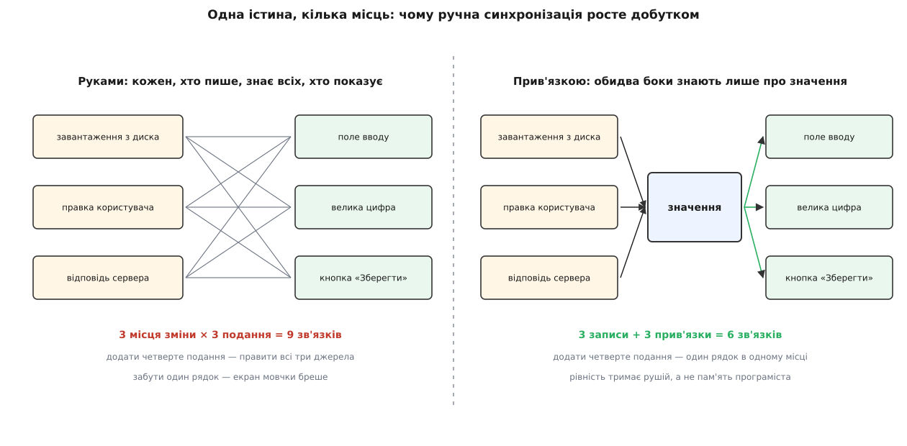
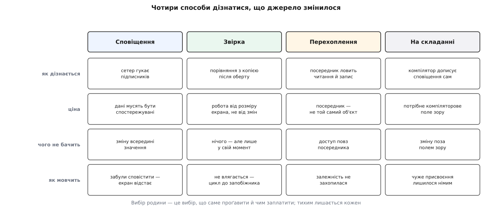
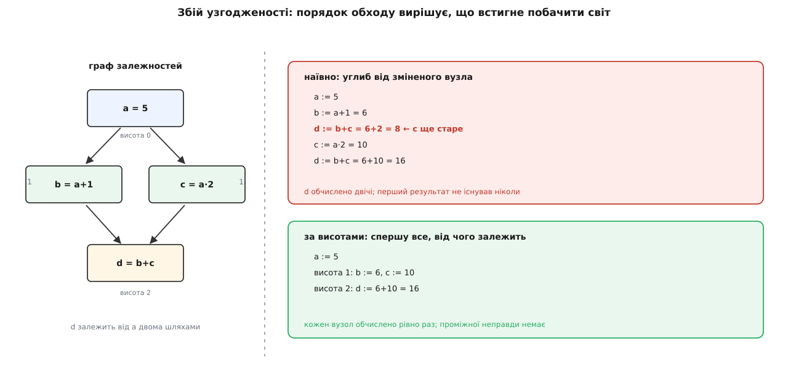

# Прив'язка даних (data binding)

<preknowlist>
- [Спостерігач](root:sf-apps/observer) — джерело тримає список підписників і гукає їх про зміну, не знаючи, хто вони.
- [Інваріант програми](root:sf-apps/invariants) — твердження, яке мусить бути істинним у певних точках виконання; його або доводять, або відновлюють після кожної зміни.
- [Чисті функції і побічні ефекти](root:sf-apps/pure-functions-side-effects) — функція без пам'яті й слідів дає те саме на тих самих входах; від цього залежить, чи можна переобчислювати похідне значення коли завгодно.
- [Рівність значень і тотожність посилань](root:sf-lang/value-equality-identity) — коли два значення вважаються однаковими: порівняння вмісту й порівняння посилань дають різні відповіді.
</preknowlist>

## Одна істина, кілька місць

Термостат тримає бажану температуру. Усередині програми це одне число — `22.5`. На екрані те саме число живе ще раз, і не в одному примірнику: у полі вводу як рядок «22.5», у великій цифрі як «22.5 °C», у кольорі позначки «в межах норми», у тому, натискається кнопка «Зберегти» чи згасла. П'ять місць, один факт.

Щойно факт дістав більше ніж один дім, домівки можуть розійтися. Умова правильності проста: коли все влягається, кожне похідне подання мусить дорівнювати функції від істинного значення — текст поля дорівнює форматованому числу, стан кнопки дорівнює перевірці межі. Це твердження має точнісінько форму інваріанта, з однією прикрою відмінністю: інваріант структури даних тримає одна структура й одна купка коду поруч, а цей розтягнений між пам'яттю й екраном, і ніхто його не перевіряє. Компілятор про нього не знає, тип не заважає розійтися, тест його бачить лише тоді, коли ви навмисне його написали.

Тримати цю рівність доводиться руками — дописувати відновлення після кожної зміни. Порахуймо, скільки таких місць. Значення міняється не в одному місці, а в кожному, звідки в програму заходить нове: завантаження з диска, правка користувача, відповідь сервера, скасування дії, спрацювання таймера. Нехай таких місць `k`. Похідних подань — `m`. Рядків, які треба не забути, виходить `k · m`, і забути можна кожен окремо.

```ts
function setTarget(v: number) {
  target = v;
  input.value = v.toFixed(1);                    // подання 1
  bigLabel.textContent = `${v.toFixed(1)} °C`;   // подання 2
  mark.className = inRange(v) ? 'ok' : 'warn';   // подання 3
  saveBtn.disabled = !inRange(v);                // подання 4
}
```

Зібрати всі чотири рядки в одну функцію — очевидний перший крок, і він справді зменшує `k · m` до `m`. Але тримається ця економія на самій лише дисципліні: досить одному присвоєнню `target = …` пройти повз `setTarget` — з обробника відповіді сервера, з коду скасування, з тесту — і рівність тихо розійдеться. Ніхто не впаде, ніхто не кине винятку. Екран просто показуватиме старе число, і програма впевнено брехатиме користувачеві.

Гірша ж біда навіть не в забудькуватості, а в напрямку залежності. У цьому коді той, **хто змінює** значення, зобов'язаний знати всіх, **хто його показує**. Додати на екран ще одну цифру означає піти й дописати рядок у кожне місце, де значення міняється. Виходить [зчеплення](root:sf-apps/coupling-cohesion) навиворіт: джерело даних залежить від подробиць екрана, хоча природна залежність протилежна — це екран похідний від даних, а не дані від екрана.


*Руками тримати доводиться добуток «місця зміни × подання»; оголошена прив'язка робить це число сумою, бо кожен бік знає лише про значення.*

## Оголосити зв'язок замість переліку дій

Розв'язок починається з підміни того, **що саме** ми записуємо в коді. Замість «коли станеться зміна — виконай ось ці дії» записати одне речення про світ: «текст цього поля завжди дорівнює форматованій температурі». Не подію і не дію, а **зв'язок, який мусить триматися завжди**. Далі хай машина сама вирішує, коли й що переобчислити, щоб це речення лишалося правдою.

Оце й є **прив'язка даних** (англ. *bind* — зв'язати, прив'язати): оголошення сталого зв'язку між джерелом і його поданням, яке машина зобов'язується підтримувати. Мова тут теж не випадкова — прив'язку пишуть [не як послідовність кроків, а як опис відношення](root:sf-lang/declarative-vs-imperative), і саме тому графік виконання можна віддати чужому механізмові: у ньому нема нашого «спочатку, потім», яке треба було б зберегти.

Найчистіший приклад цього обміну — не інтерфейс застосунку, а електронна таблиця. У клітинку пишуть `=B2*1.2`, і ніхто ніколи не писав «коли зміниться B2, перерахуй». Формула — це зв'язок, а перерахунок — клопіт таблиці. Аналогія точна рівно до одного місця, і місце це варте уваги: таблиця може так робити, бо **володіє всіма клітинками**. Жодне значення не потрапляє в неї повз рушій, тож рушій завжди знає про зміну. Рушій зв'язування всередині застосунку такої влади не має: `vm.target = 30` — це звичайне присвоєння у ваш об'єкт, у вашу пам'ять, і за замовчуванням про нього не дізнається ніхто. Уся дальша складність зв'язування виростає з цієї єдиної обставини.

> 🔧 **Навіщо це.** Виграш не в кількості зекономлених рядків, а в тому, куди вказує залежність. Оголошена прив'язка знає про значення, а значення про прив'язку — ні. Тому нове подання (ще одна цифра, індикатор, підказка) додається **одним рядком в одному місці** й не змушує чіпати жодного з місць, де значення міняється. Той самий зсув дає й перевірність: стан лишається звичайним об'єктом, який крутять у тесті без екрана — на цьому стоїть уся родина [MVVM](root:sf-apps/model-view-viewmodel).

Що б не було написано на коробці — `{Binding}`, `v-model`, `computed`, реактивна змінна — усередині кожен рушій зв'язування мусить відповісти на три питання, і відповіді на них цілком визначають його поведінку разом з усіма його дивацтвами:

```
1. ЗВІДКИ  дізнатися, що джерело змінилося
2. КУДИ    тече істина: лише в подання чи й назад
3. КОЛИ    відновлювати рівність — і в якому ПОРЯДКУ
```

## Питання перше: звідки рушій дізнається про зміну

Присвоєння в пам'ять німе. `target = 30` записує вісім байтів і на цьому все: жодного сліду, жодного гачка, ніхто в світі про цю подію не знає. Отже, у рушія є рівно два способи дізнатися — або **джерело саме скаже**, або **рушій сам піде подивиться**. Третього немає; усе розмаїття рушіїв — це варіації на тему «як здобути один із цих двох способів, не переписуючи всі свої дані».

**Сповіщення.** Джерело перестає бути простим полем і стає властивістю, яка вміє гукати: у сетері, крім запису, стоїть виклик підписників. Це буквально [спостерігач](root:sf-apps/observer), піднятий до рівня окремого поля. Ціна за один запис — робота, пропорційна лише кількості слухачів **саме цієї** властивості; нічого зайвого не перевіряється взагалі. Платять же типами: дані мусять бути «спостережувані» — успадковані від чогось, обгорнуті чимось, описані атрибутом. Так живуть властивості з `INotifyPropertyChanged` у .NET і сигнали в сучасних вебових каркасах.

Мовчить ця родина у двох випадках, і обидва мають однаковий симптом — екран відстає від даних. Перший: сповіщення просто забули дописати (класика — обчислювана властивість `canSave`, яка залежить від `target`, але про зміну `target` не гукає). Другий тонший: значення змінилося **всередині**, не змінивши поля. `items.push(x)` не чіпає посилання на масив, тож сетер не спрацював, тож сигналу немає — і список на екрані лишився старий. Саме тому в .NET поруч із `INotifyPropertyChanged` існує окремий `INotifyCollectionChanged`: колекція мусить сповіщати про власні зміни сама, бо поле, у якому вона лежить, про них не знає.

**Звірка.** Протилежний хід: не чіпати дані взагалі, а тримати копію попереднього значення й час від часу порівнювати. Дані лишаються звичайними об'єктами — жодних обгорток, жодних вимог до типів; будь-яка зміна, хоч і найхитріша, буде помічена, бо ми дивимося на результат, а не на шлях до нього. Ця родина зобов'язана відповісти ще на два власні питання: **коли** звіряти (природний момент — після кожного оберту обробки події, бо саме там могли щось змінити) і **скільки разів**, бо перерахунок однієї прив'язки може змінити значення, від якого залежить інша, і звіряти доводиться доти, доки все не влягається.

Порівняння тут упирається просто в те, що вважати зміною: порівняння посилань дешеве, але не бачить правки всередині об'єкта, а порівняння вмісту бачить усе й коштує обходу. Через це звірка так добре дружить із [незмінністю](root:sf-apps/immutability): якщо кожна правда породжує новий об'єкт, а старий не міняється ніколи, то дешеве порівняння посилань стає точним — інше посилання завжди означає інший вміст.

Найрадикальніший різновид звірки не порівнює входи взагалі. Замість того щоб питати «які значення змінилися», він щоразу **перераховує все подання наново** й порівнює новий опис екрана зі старим, а на справжні віджети переносить лише різницю — [звірку дерев подання](root:sf-apps/virtual-dom) саме так і влаштовано. Дані при цьому лишаються геть звичайними, ціна ж переїжджає з перевірки входів на перерахунок виходу.

**Перехоплення.** Третя родина здобуває сповіщення, не чіпаючи типів: об'єкт підмінюють посередником, який перехоплює кожне звертання до поля — і читання, і запис. Запис гукає підписників, як у першій родині, тільки без жодного успадкування. А от перехоплене **читання** дає щось таке, чого перші дві родини не вміють зовсім. Виконуючи вираз, рушій вмикає запис і дивиться, до яких саме полів той звернувся; вийшов список залежностей — не оголошений людиною, а зібраний зі спостереження. Далі рушій підписується рівно на них.

Саме цей трюк робить можливими обчислювані значення, які самі знають, від чого залежать, і саме він живить [реактивні потоки](root:sf-apps/reactive-programming) в тій частині, де йдеться про залежності, а не про час. Ціна — тонка й неприємна: посередник **не той самий об'єкт**, що оригінал. Порівняння на тотожність дає `false`, значення, витягнене «повз» посередника, лишається невідстеженим, а кожне звертання до поля коштує трохи більше, ніж просто звертання до поля.

**На етапі складання.** Останній спосіб — не вгадувати нічого під час роботи, а дати компіляторові побачити всі присвоєння в тексті програми й дописати виклики сповіщення самому. Так робить компілятор Svelte: звичайне на вигляд присвоєння `count = count + 1` він перетворює на присвоєння плюс позначку «це змінилося». Так само працюють генератори коду в .NET, які пишуть тіла сетерів за атрибутами. Робота під час виконання близька до нуля, помилки в іменах ловляться на складанні — але рівно доти, доки все відбувається в компіляторовому полі зору. Значення, змінене з коду, якого компілятор не бачив, лишиться німим.


*Родини виявлення змін відрізняються не якістю, а тим, чим саме платять і що саме проґавлюють; симптом «екран відстає від даних» у кожної свій.*

Дві перші родини корисно порівняти в числах, бо їхні витрати ростуть від зовсім різних величин.

**Форма з 400 прив'язок, користувач надрукував один символ в одному полі. Виклик геттера з порівнянням беремо за 60 нс — характерний порядок для керованої мови.**

```
Сповіщення
  змінилася 1 властивість, у неї 3 підписники
  робота = 3 · 60 нс                        = 0.18 мкс

Звірка
  після оберту звіряються ВСІ прив'язки
  прохід = 400 · 60 нс                      = 24 мкс
  другий прохід (переконатися, що все влягло)
  разом  = 2 · 24 мкс                       = 48 мкс

  бюджет кадру 16.6 мс → 48 мкс             = 0.3 % кадру
```

На формі різниця в двісті разів не значить нічого: обидві цифри тонуть у бюджеті кадру. Але зверніть увагу, від чого росте кожна. Вартість сповіщення росте від **кількості змін**, вартість звірки — від **розміру екрана**, і платиться вона щоразу, навіть коли не змінилося геть нічого. Та сама таблиця на 20 000 прив'язок дає `2 · 20000 · 60 нс = 2.4 мс` на кожен оберт — уже третину кадру, ще нічого не намалювавши. Звідси й практичне правило часів AngularJS: тримати кількість спостерігачів на сторінці в межах кількох тисяч. Це не документована межа рушія, а наслідок арифметики, яку щойно зроблено.

## Питання друге: куди тече істина

Досі йшлося про один напрямок: істина в даних, екран — похідне подання. Такий зв'язок називають **однобічним**, і він дешевий саме тому, що похідне подання не має власного життя: його завжди можна викинути й обчислити наново з джерела, і жодної інформації при цьому не втратиться.

Ситуація ламається тієї миті, коли на екрані з'являється поле вводу. Пальці користувача кладуть нову інформацію **у віджет**, а не в модель, — і третього місця, куди її можна було б покласти, просто немає. Тепер віджет теж джерело, і зв'язок мусить працювати в обидва боки: **двобічна прив'язка**. Вигода очевидна — зникає й друга половина ручного перепису, розбір тексту в число. А от ціна ховається в тому, що два боки зв'язку **нерівноправні**, хоч і виглядають симетрично.

Нерівноправність ось у чому. Стан віджета — це рядок, і рядків більше, ніж чисел: `""`, `"abc"`, `"5."`, `"007"`, `"5,5"`. Перетворення числа в текст визначене завжди; перетворення тексту в число — часткове (для `"abc"` числа немає) і не взаємно однозначне (`"007"` і `"7"` дають одне число). Тому оберт «текст → число → текст» **не зобов'язаний повертати той самий текст**: набране `5.` перетвориться на `5`, повернеться в поле як `"5"` — і крапка зникне з-під пальців, поки людина ще друкує `5.5`. Зворотний оберт «число → текст → число» повертає те саме число завжди, і саме ця асиметрія і є причиною більшості дивацтв двобічної прив'язки; звідки її беруть у розрахунок, буде видно з третього питання.

Друга проблема двобічності серйозніша за одну з'їдену крапку. Два боки означають два писарі одного значення, тож хто останній написав — той і має рацію, а порядок записів визначає рушій, не ви. Поки прив'язка одна, це непомітно. Коли на те саме значення дивляться три екрани й пише сервер, «останній переміг» перетворюється на джерело помилок, які не відтворюються: результат залежить від того, у якому порядку рушій обходив підписників. Ліки — свідомо повернути асиметрію: лишити один бік єдиним джерелом істини, а ввід перетворити на **прохання змінити його**, після якого нове значення приходить назад звичайним однобічним шляхом. Це і є [однонапрямлений потік даних](root:sf-apps/unidirectional-data-flow) — не заперечення прив'язки, а дисципліна щодо того, хто в ній має право писати.

Із двобічності виростає й питання, куди подіти **тимчасово неправильне** значення. Поки людина друкує, у полі закономірно буває сміття, і покласти його в модель не можна: модель тримає інваріанти, а `NaN` замість температури їх ламає. Отже, неправильний стан мусить десь жити — або в окремому шарі поруч із прив'язкою (так роблять правила валідації в рушіях зв'язування), або в моделі, свідомо розширеній так, щоб вона вміла тримати «ще не введено» й «введено неправильно» окремими станами. Обидва варіанти чесні; мовчазний третій — записати `0` замість порожнього поля — і є найпоширенішою вадою двобічної прив'язки.

## Питання третє: коли відновлювати рівність — і в якому порядку

Найпростіша відповідь на «коли» — негайно: змінилося значення, зразу ж перенеслося в подання. Вона й найгірша. Одна логічна зміна майже ніколи не буває однією зміною значень: «завантажили новий профіль» — це нове ім'я, нова температура, новий розклад. Якщо відновлювати рівність після кожного присвоєння, екран перемалюється тричі й двічі покаже стан, якого в житті програми не було: нове ім'я зі старою температурою. А коли на прив'язці висить не малювання, а побічна дія — запит на сервер, запис у журнал — таких дій теж буде три, і одна з них по неіснуючому стану.

Тому рушії **пакують зміни**: збирають їх до кінця поточного оберту обробки події, викидають повтори й переносять один раз, узгоджено. У вебі природний момент для цього — мікрозадача в [циклі подій](root:sf-tasks/event-loop), у настільних наборах — черга диспетчера вікна. Практичний наслідок відчутний: одразу після `vm.target = 30` екран **ще не оновлено**, і код, який зразу після присвоєння читає розмір напису, читає старий розмір. Звідси `nextTick`, `updateComplete`, `Dispatcher.BeginInvoke` — усе це способи сказати «розбуди мене, коли рівність буде відновлено».

Друга половина питання підступніша, бо її наслідки не схожі на затримку. Прив'язки рідко бувають плоскими: похідне значення саме буває джерелом для наступного, і зв'язки утворюють граф. Розгляньмо найменшу неплоску фігуру — ромб.

**`b = a + 1`, `c = a · 2`, `d = b + c`; спочатку `a = 1`, тож `b = 2`, `c = 2`, `d = 4`. Присвоюємо `a = 5`.**

```
наївно, углиб від зміненого вузла:
  a := 5
  b := a + 1 = 6
    d := b + c = 6 + 2 = 8      ← c ще старе: d показав стан, якого не існує
  c := a · 2 = 10
    d := b + c = 6 + 10 = 16
  d обчислено 2 рази, один результат — неправда

за висотою (a:0, b:1, c:1, d:2):
  a := 5
  висота 1:  b := 6,  c := 10
  висота 2:  d := 6 + 10 = 16
  d обчислено 1 раз, неправди не було жодної миті
```

Проміжне значення `8` — не помилка формул і не помилка рушія в звичному сенсі: кожне окреме обчислення правильне, неправильний **порядок**. Таке значення, обчислене раніше, ніж усі його входи стали свіжими, у реактивних системах називають **збоєм узгодженості** (англ. *glitch*); термін у цьому значенні закріпили Ґреґ Купер і Шрірам Крішнамурті в роботі про FrTime 2006 року, там-таки описано й ліки — обчислювати вузли в порядку висот, де висота вузла більша за висоту будь-якого, від кого він залежить.

Ліки, як видно з розрахунку, дають подвійний зиск: зникає не тільки неправда, а й зайве обчислення. Порядок за висотами — це [топологічне сортування](root:sf-algorithms/topological-sort) графа залежностей, і воно гарантує, що кожен вузол обчислиться рівно раз. Практичні рушії роблять це у два проходи: спершу позначають «застарілим» усе, що нижче за течією від зміни, потім обчислюють позначене в порядку висот — так робота пропорційна не розмірові графа, а розмірові справді зачепленої його частини. [Робочий граф сигналів із автоматичним стеженням за залежностями](root:sf-apps/data-binding/proj-signal-graph.md) вкладається приблизно в двісті рядків і показує обидва проходи в дії.


*Той самий граф і та сама зміна: порядок обходу вирішує, чи побачить світ значення, обчислене з половини свіжих входів.*

Родина звірки на цю саму скелю натрапляє з іншого боку. Вона не має графа взагалі — вона просто проходить усі прив'язки й дивиться, що змінилося; якщо один перерахунок змінив вхід іншого, потрібен ще прохід. Тому такі рушії крутять цикл до спокою й мусять мати запобіжник: AngularJS кидав `10 $digest() iterations reached` — «за десять обертів значення не влягалися». Сучасний Angular у режимі розробки навмисне робить **другий** прохід звірки й кидає `ExpressionChangedAfterItHasBeenCheckedError`, якщо другий прохід побачив інші значення, ніж перший. Обидва повідомлення кажуть те саме: ваш опис зв'язків не має нерухомої точки — після відновлення рівності він знову оголошує її порушеною.

Історія цієї скелі старша за веб на два десятиліття. VisiCalc перераховувала таблицю просто підряд, рядок за рядком, і повторювала прохід, доки значення не переставали мінятися; формула, що посилалася «вперед», давала на першому проході саме таку проміжну неправду. Lotus 1-2-3 у 1983 році здобула ринок «природним порядком перерахунку» — таблиця вела список залежностей і рахувала клітинку раніше за тих, хто від неї залежить. Сучасний Excel поєднує обидва прийоми: позначає застарілі клітинки й обходить їх у топологічному порядку. [Родовід самої ідеї «оголоси зв'язок — машина його триматиме»](root:sf-apps/data-binding/hist-binding-lineage.md) веде ще далі назад, до систем геометричних обмежень початку 1960-х.

## Чим платять за тишу

Усі чотири родини виявлення змін ламаються **однаково тихо**. Це не збіг і не недогляд авторів рушіїв, а пряма плата за зроблений обмін. Ми віддали машині право вирішувати, коли виконувати перенесення, — отже, у нашому коді цього рішення більше немає. Не спрацювало — немає й місця, де поставити точку зупину: порожнє місце не ламається гучно, воно просто нічого не робить.

Друга частина тієї самої плати — зникнення причини зі стеку викликів. Коли прив'язка спрацювала, у стеку видно рушій: чергу, диспетчер, обхід підписників. Того присвоєння, яке все це спричинило, там уже немає — воно сталося раніше, в іншому оберті, і слід до нього веде не стек, а **граф залежностей**. Тому налагоджувати зв'язування доводиться інакше, ніж звичайний код: не «хто мене покликав», а «від чого я залежу і хто з цього змінився». Добрі рушії тому й показують дерево залежностей окремим інструментом — без нього причину доводиться відгадувати.

Третя стаття витрат — час життя. Підписка тримає слухача, слухач тримає віджет, віджет тримає своє піддерево; знятий з екрана віджет лишається живим доти, доки запис про нього є в таблиці підписок, і далі виконується на кожен сигнал. [Розібраний по стиках мінімальний рушій](root:sf-apps/model-view-viewmodel/proj-tiny-binding.md) показує всі чотири місця, де нитка рветься мовчки, і те, чому відписку не можна забути: там видно і словник підписок, і прапорець проти замкненого кільця, і застарілого слухача в дії.

І окрема пастка — не технічна, а дисциплінарна. Прив'язка виглядає нешкідливим місцем, куди зручно покласти «ще одну маленьку умову», і логіка помалу переселяється у вирази прив'язок, де її не бачить жоден тест. Межа проста: **прив'язкою з'єднують подання, а не ухвалюють рішення**. Умова, яку варто перевірити тестом, живе у значенні, до якого прив'язуються, а не у виразі всередині розмітки.

Із цього ж випливає, де прив'язувати **не варто**. Найважливіший випадок — коли два кінці зв'язку лежать по різні боки межі відмови. Прив'язати поле до значення на сервері спокусливо й технічно нескладно, але прив'язка за означенням обіцяє те, чого мережа не дає: що рівність відновиться, і то швидко. Віддалене значення — це не значення, а запит із затримкою, помилкою й частковою відмовою, і ховати це під тією самою декларацією, що й локальний зв'язок, означає повторити класичну [оману про прозорість віддаленого виклику](root:sf-distributed/distributed-fallacies). Так само не варто прив'язувати те, чиє переобчислення дороге й мусить плануватися свідомо, і те, чиє значення залежить від історії, а не лише від поточних входів: анімація й скасування дії потребують знати, звідки прийшли, а прив'язка знає тільки, де є зараз.

## Той самий механізм поза екраном

Три питання не належать інтерфейсам — вони належать будь-якому місцю, де похідне значення мусить лишатися свіжим.

`make`, написаний Стюартом Фелдманом у Bell Labs 1976 року, — це рушій зв'язування для файлів. Правило `ціль: залежності` оголошує зв'язок, а не порядок дій; виявлення змін — родина звірки (порівняння часу зміни файлів); порядок — топологічний обхід графа залежностей. Навіть характерна вада тут та сама, що й у прив'язок: час зміни файлу — це наближення до справжнього питання «чи змінився вміст», тому дотик до файлу без правки змушує перезбирати, а перевід годинника назад — не перезбирати. Сучасні системи збирання тому й перейшли на порівняння вмісту.

Об'єктно-реляційні відображення ведуть **відстеження змін**: тримають копію завантаженої сутності й наприкінці одиниці роботи звіряють поле за полем, щоб скласти `UPDATE` лише зі справді змінених стовпців. Це буквально та сама звірка, з тією самою залежністю вартості від кількості завантажених об'єктів, а не від кількості правок.

Кеш похідного значення — теж прив'язка, тільки записана навиворіт: замість «підтримуй рівність» кажуть «познач як застаріле, коли зміниться джерело». Різниця між кешем і прив'язкою лише в тому, коли робиться робота — одразу чи за першим запитом, — і саме тому питання «звідки дізнатися про зміну» в обох звучить однаково.

## Три питання як порядок діагностики

Практична сила цього розбору в тому, що три питання утворюють **порядок перевірки**, коли прив'язка мовчить. Питати їх треба саме в цьому порядку, бо кожне наступне має сенс лише тоді, коли на попереднє відповідь ствердна.

Спершу — чи рушій **узагалі дізнався** про зміну: чи пройшло присвоєння крізь сетер, посередника або компілятор, а не повз них. Не дізнався — усе інше не має значення, і шукати треба зміну, що пройшла в обхід. Дізнався — питання друге: **чий бік має рацію**, чи не переписав ваше значення зворотний хід із віджета, чи не воює нормалізація з пальцями користувача. І аж тоді третє: чи не **зарано** ви дивитеся — чи не читаєте екран у тому ж оберті, у якому змінили дані, і чи не бачите значення, обчислене раніше за свої входи.

Три питання ставлять не лише до чужого рушія, а й до власного дизайну — до того, як ви розкладаєте стан застосунку. Зв'язок, який неможливо оголосити одним реченням, зазвичай означає не слабкий рушій, а те, що похідне значення в цьому місці не є функцією від наявного стану — і тоді чесніше зробити його окремим станом, ніж змушувати машину підтримувати рівність, якої в дійсності немає.
