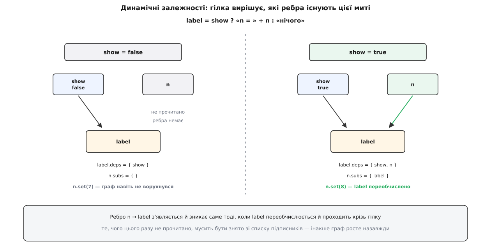

# ⚙️ Граф сигналів, що сам знає свої залежності

<preknowlist>
- [Спостерігач](root:sf-apps/observer) — джерело тримає список тих, кого треба гукнути про зміну, і не знає про них нічого більше; ребро «вниз за течією» тут — буквально він.
- [Топологічне сортування](root:sf-algorithms/topological-sort) — упорядкування вершин графа так, щоб кожна йшла після всіх, від кого залежить; висота вузла — його дешевий замінник.
- [Чисті функції і побічні ефекти](root:sf-apps/pure-functions-side-effects) — вираз без пам'яті й слідів можна виконати коли завгодно й скільки завгодно разів; на цьому дозволі стоїть увесь рушій.
- [Функції першого класу](root:sf-lang/first-class-functions) — вираз вузла лежить у змінній і виконується тоді, коли захоче рушій, а не там, де його написано.
</preknowlist>

Двісті рядків, які роблять те саме, що `computed` у будь-якому сучасному каркасі: вираз, виконуючись, **сам каже, від чого залежить**, а зміна джерела проходить графом рівно один раз і не показує світові жодного проміжного неправдивого значення. Ми не переказуватимемо, як воно влаштоване «в загальних рисах» — ми його складемо й запустимо, а потім подивимося, у скільки обходиться кожна його обіцянка.

## Що саме має вміти рушій

Домовмося про перелік обов'язків до першого рядка коду — інакше вийде не механізм, а замовляння:

```
1. стеження   виконуючи вираз, рушій сам збирає список прочитаних вузлів
2. свіжість   похідне значення завжди дорівнює виразові від поточних входів
3. чесність   жоден вузол ніколи не показує значення, обчислене з несвіжих входів
4. ощадність  кожен зачеплений вузол обчислюється щонайбільше РАЗ на одну зміну
5. локальність робота пропорційна зачепленій частині графа, а не всьому графу
```

Перші два пункти — це те, заради чого рушій пишуть. Три останні — те, через що його важко написати правильно, і саме вони визначають весь дальший устрій.

## Ідея: залежність оголошує саме читання

Список залежностей можна вимагати від людини — «оголоси, від чого залежить ця формула». Такі рушії існують, і всі вони мають одну ваду: список руками розходиться з тілом виразу, і розходиться мовчки. Дописав у формулу ще один множник, забув дописати його в список — вузол перестав перераховуватися.

Але список уже є в самому виразі, треба лише його підгледіти. Прийом такий: перед виконанням виразу рушій запам'ятовує в глобальній змінній, **чий саме** вираз зараз виконується. Далі кожне читання вузла дивиться в ту змінну: якщо там хтось є — читання реєструє ребро «мене прочитав он той». Виконали вираз, прибрали позначку — маємо точний список того, що вираз **справді читав цього разу**.

З цього одразу випливає найважливіша властивість готового рушія: список залежностей — це не опис виразу, а **знімок одного його виконання**. Гілка, яку цього разу не виконали, ребра не дає. До цієї обставини повернемося окремо, бо з неї росте і головна сила рушія, і найтонша його пастка.

## Дві фази замість однієї

Далі зміна має пройти графом. Найпростіше — рекурсивно: змінилося джерело, гукаємо підписників, кожен перераховується й гукає своїх. На ромбі `p = f(s)`, `q = g(s)`, `r = h(p, q)` такий обхід перерахує `r` двічі, і перший раз — зі свіжим `p` та ще старим `q`. Обидва пункти контракту, третій і четвертий, порушено одним обходом.

Ліки — розділити обхід на два різні за природою проходи.

**Фаза 1 — позначити.** Від зміненого джерела йдемо вниз за течією й ставимо кожному досяжному вузлові позначку «під підозрою». Жодних обчислень: тільки прапорець і запис у чергу. Вузол, уже позначений цієї миті, не обходимо вдруге — саме тут ромб перестає подвоювати роботу.

**Фаза 2 — обчислити.** Проходимо позначені вузли **в порядку зростання висоти**, де висота вузла на одиницю більша за найбільшу висоту його входів. Джерело має висоту 0, вузол над ним — 1, і так далі. Порядок за висотою гарантує: коли черга дійшла до вузла, усі його входи вже влягалися, тож обчислення відбувається один раз і з правильних значень.

І третій прийом, який усе це доводить до пуття, — **відсічка за значенням**. Позначка «під підозрою» ще не означає «змінилося». Перед обчисленням вузол питає свої входи: чи хоч один із вас справді змінив значення в цьому оберті? Ні — вузол не обчислюється взагалі, і його власні підписники теж нічого не роблять. Так одна відсічка вгорі відрізає цілу гілку графа.


*Фаза 1 коштує стільки, скільки досяжно вниз від зміни; фаза 2 — лише стільки, скільки справді змінило значення. Решта графа не коштує нічого.*

> 🔧 **Навіщо це.** Відсічка за значенням — найдешевший рядок у рушії й найдорожчий за наслідками. Без неї кожна зміна джерела котиться до самого низу графа й тягне за собою всі побічні дії, що висять на ефектах: перемальовування, запити, записи в журнал. З нею робота обривається на першому ж вузлі, чиє значення не змінилося, — а таких у типовому графі більшість, бо похідні значення часто грубші за свої входи (прапорець «у межах норми» не міняється від зсуву температури на десяту частку градуса). Ту саму відсічку в бібліотеці `Incremental` Jane Street називають cutoff і виносять в окреме налаштування вузла — бо саме нею керують, коли перерахунок треба зробити рідшим.

## Кістяк: вузол, стеження, джерело

Тепер код. Він один на всі приклади нижче, ділиться на чотири шматки й запускається як є.

Перший шматок — спільна частина вузла та реєстрація ребра. Зверніть увагу на `changedAt`: це не прапорець, а номер оберту, у якому значення вузла востаннє змінилося. Номер замість прапорця рятує від цілого класу помилок — його не треба скидати перед новим обертом, бо порівняння `changedAt == epoch` саме собою хибне для всіх старих записів.

:::tabs
```ts
// ── 1. Стан рушія, вузол, стеження ────────────────────────────────────
type Eq<T> = (a: T, b: T) => boolean;

let epoch = 0;                          // номер поточного поширення
let frame: Derived<any> | null = null;  // вузол, який ЗАРАЗ обчислюється

abstract class Node {
  height = 0;        // 0 у джерела; у похідного — 1 + max(висот входів)
  changedAt = 0;     // епоха, у якій значення СПРАВДІ змінилося
  readonly subs = new Set<Derived<any>>();   // хто читає мене
}

/** Читання під час обчислення — це і є оголошення залежності. */
function track(n: Node): void {
  if (!frame) return;              // читання поза обчисленням нічого не підписує
  frame.deps.add(n);
  n.subs.add(frame);
}

// ── Джерело: єдине місце, куди пишуть ззовні ──────────────────────────
class Source<T> extends Node {
  constructor(private value: T, private eq: Eq<T> = Object.is) { super(); }

  get(): T { track(this); return this.value; }

  set(next: T): void {
    if (frame) throw new Error('запис у джерело зсередини обчислюваного вузла');
    if (this.eq(next, this.value)) return;   // відсічка: не змінилося — не сталося нічого
    this.value = next;
    this.changedAt = ++epoch;
    mark(this);                              // ФАЗА 1
    settleAll();                             // ФАЗА 2
  }
}
```
```cpp
// ── 1. Стан рушія, вузол, стеження ────────────────────────────────────
#include <algorithm>
#include <cstdio>
#include <functional>
#include <map>
#include <stdexcept>
#include <string>
#include <utility>
#include <vector>

namespace sg {

class Node;
class Derived;

inline long     epoch = 0;        // номер поточного поширення
inline Derived* frame = nullptr;  // вузол, який ЗАРАЗ обчислюється

void mark(Node& from);
void settleAll();
void settleNode(Derived& n);
void track(Node& n);

class Node {
public:
    virtual ~Node() = default;
    virtual Derived* asDerived() { return nullptr; }   // дешевше за dynamic_cast

    int  height    = 0;   // 0 у джерела; у похідного — 1 + max(висот входів)
    long changedAt = 0;   // епоха, у якій значення СПРАВДІ змінилося
    std::vector<Derived*> subs;                        // хто читає мене
};

inline void unlink(Node& from, Derived& who) {
    auto& v = from.subs;
    v.erase(std::remove(v.begin(), v.end(), &who), v.end());
}

// ── Джерело: єдине місце, куди пишуть ззовні ──────────────────────────
template <class T>
class Signal final : public Node {
public:
    using Eq = std::function<bool(const T&, const T&)>;

    explicit Signal(T v, Eq eq = std::equal_to<T>{})
        : value_(std::move(v)), eq_(std::move(eq)) {}

    const T& get() { track(*this); return value_; }

    void set(T next) {
        if (frame) throw std::logic_error("запис у джерело зсередини обчислення");
        if (eq_(next, value_)) return;      // відсічка: не змінилося — не сталося нічого
        value_ = std::move(next);
        changedAt = ++epoch;
        mark(*this);                        // ФАЗА 1
        settleAll();                        // ФАЗА 2
    }

private:
    T  value_;
    Eq eq_;
};
```
:::

Дві дрібниці в `set` варті окремого погляду. Перша — заборона писати в джерело зсередини обчислення: якби це дозволити, запис підняв би `epoch` посеред фази 2 і знецінив би всі позначки, поставлені фазою 1. Друга — та сама відсічка, тільки біля самого входу: присвоєння тим самим значенням не породжує оберту взагалі. У версії на TypeScript порівнюємо через `Object.is`, а не `===`, бо `NaN === NaN` дає `false` — без цього вузол із нечисловим значенням сповіщав би підписників на кожен запис.

## Похідний вузол: перечитування, перепідписка, висота

Другий шматок — головний. Похідний вузол уміє одне: виконати свій вираз під наглядом, зібрати новий набір входів, **зняти себе з тих, кого цього разу не читав**, перерахувати власну висоту й сказати, чи змінилося значення.

Порядок дій усередині не довільний. Спершу старий набір входів відкладаємо вбік і починаємо новий із порожнього; тільки після виконання виразу порівнюємо два набори — і те, що було в старому й не потрапило в новий, відчіплюємо. Робити навпаки — спершу відписатися від усіх, потім виконати — теж можна, але тоді кожен незмінений вхід зазнає зайвого зняття й додавання, а в рушіях, де підписка коштує виділення пам'яті, це помітно.

:::tabs
```ts
// ── 2. Похідний вузол ─────────────────────────────────────────────────
class Derived<T> extends Node {
  deps = new Set<Node>();       // кого читав ОСТАННЬОГО разу
  markedAt = 0;                 // епоха, у якій позначено застарілим
  settledAt = 0;                // епоха, у якій уже влігся
  private value!: T;
  private fresh = false;        // чи обчислювали хоч раз
  private running = false;      // проти циклу в графі

  constructor(private fn: () => T, private eq: Eq<T> = Object.is) { super(); }

  get(): T {
    if (this.running) throw new Error('цикл у графі: вузол читає сам себе');
    if (!this.fresh) this.recompute();   // перше читання й заводить вузол у граф
    else settleNode(this);               // до нас дійшли раніше за чергу — влягаємось тут-таки
    track(this);
    return this.value;
  }

  /** Виконує вираз, перезбирає підписки й висоту; true — значення змінилося. */
  recompute(): boolean {
    const before = this.deps;
    this.deps = new Set();

    const outer = frame;
    frame = this;
    this.running = true;
    let next: T;
    try { next = this.fn(); }
    finally { this.running = false; frame = outer; }

    for (const d of before)                          // зняти те, чого цього разу НЕ читали
      if (!this.deps.has(d)) d.subs.delete(this);

    let h = 0;
    for (const d of this.deps) h = Math.max(h, d.height + 1);
    this.height = h;

    const changed = !this.fresh || !this.eq(next, this.value);
    this.value = next;
    this.fresh = true;
    if (changed) this.changedAt = epoch;
    return changed;
  }

  dispose(): void {                                  // зняти себе з усіх входів
    for (const d of this.deps) d.subs.delete(this);
    this.deps.clear();
  }
}

const signal   = <T>(v: T, eq?: Eq<T>) => new Source(v, eq);
const computed = <T>(fn: () => T, eq?: Eq<T>) => new Derived(fn, eq);

/** Ефект — лист графа, що робить видиму роботу й нічого не віддає далі. */
function effect(run: () => void): () => void {
  const node = new Derived<void>(run, () => true);   // «значення» ефекту не змінюється ніколи
  node.recompute();                                  // перший прогін і підписує
  return () => node.dispose();
}
```
```cpp
// ── 2. Похідний вузол ─────────────────────────────────────────────────
class Derived : public Node {
public:
    Derived* asDerived() override { return this; }

    std::vector<Node*> deps;   // кого читав ОСТАННЬОГО разу
    long markedAt  = 0;        // епоха, у якій позначено застарілим
    long settledAt = 0;        // епоха, у якій уже влігся

    bool recompute();
    void dispose() {           // зняти себе з усіх входів
        for (Node* d : deps) unlink(*d, *this);
        deps.clear();
    }

protected:
    virtual bool eval() = 0;   // виконати вираз; true — значення змінилося
    bool running = false;      // проти циклу в графі
    friend void track(Node&);
    friend class Frame;
};

/** RAII-рамка: хто зараз обчислюється — і повернення стану на будь-якому виході. */
class Frame {
public:
    explicit Frame(Derived& n) : prev_(frame), self_(n) { frame = &n; n.running = true; }
    ~Frame() { self_.running = false; frame = prev_; }
    Frame(const Frame&) = delete;
    Frame& operator=(const Frame&) = delete;
private:
    Derived* prev_;
    Derived& self_;
};

inline void track(Node& n) {
    if (!frame) return;                  // читання поза обчисленням нічого не підписує
    auto& d = frame->deps;
    if (std::find(d.begin(), d.end(), &n) != d.end()) return;   // те саме читали двічі
    d.push_back(&n);
    n.subs.push_back(frame);
}

inline bool Derived::recompute() {
    if (running) throw std::logic_error("цикл у графі: вузол читає сам себе");

    std::vector<Node*> before;
    before.swap(deps);

    bool changed;
    { Frame f(*this); changed = eval(); }   // ← поки живе f, читання реєструються на нас
                                            // (виняток звідси лишить пів набору — див. пастки)
    for (Node* d : before)                  // зняти те, чого цього разу НЕ читали
        if (std::find(deps.begin(), deps.end(), d) == deps.end())
            unlink(*d, *this);

    height = 0;
    for (Node* d : deps) height = std::max(height, d->height + 1);

    if (changed) changedAt = epoch;
    return changed;
}

template <class T>
class Computed final : public Derived {
public:
    using Eq = std::function<bool(const T&, const T&)>;

    explicit Computed(std::function<T()> fn, Eq eq = std::equal_to<T>{})
        : fn_(std::move(fn)), eq_(std::move(eq)) {}

    const T& get() {
        if (running) throw std::logic_error("цикл у графі: вузол читає сам себе");
        if (!fresh_) recompute();     // перше читання й заводить вузол у граф
        else settleNode(*this);       // до нас дійшли раніше за чергу — влягаємось тут-таки
        track(*this);
        return value_;
    }

protected:
    bool eval() override {
        T next = fn_();
        const bool changed = !fresh_ || !eq_(next, value_);
        value_ = std::move(next);
        fresh_ = true;
        return changed;
    }

private:
    std::function<T()> fn_;
    Eq   eq_;
    T    value_{};
    bool fresh_ = false;
};

/** Ефект — лист графа, що робить видиму роботу й нічого не віддає далі. */
class Effect final : public Derived {
public:
    explicit Effect(std::function<void()> fn) : fn_(std::move(fn)) { recompute(); }
    ~Effect() override { dispose(); }            // ← відписку не можна забути

    Effect(const Effect&) = delete;
    Effect& operator=(const Effect&) = delete;

protected:
    bool eval() override { fn_(); return false; }

private:
    std::function<void()> fn_;
};
```
:::

Різниця між двома версіями тут не косметична. У TypeScript підписку знімає той, хто про неї згадає, — тому `effect` повертає функцію-відписку, яку **треба не забути покликати**. У C++ те саме робить деструктор `Effect`: зв'язок живе рівно доти, доки живе об'єкт, і знімається сам, коли той виходить з області видимості. Це [RAII](root:sf-lang/raii), і саме тут воно рятує від найдорожчої помилки цього рушія — про неї нижче. Друга різниця дрібніша, але показова: набір входів у C++ — це `std::vector` із лінійним пошуком, бо в реальному вузлі входів одиниці, і на такому розмірі вектор випереджає будь-яку хеш-таблицю; у TypeScript узятий `Set`, бо там дешевої лінійної альтернативи в стандартній бібліотеці просто немає.

## Планувальник: черга за висотами

Третій шматок — самі дві фази. Черга — не купа й не сортування, а **відра за висотами**: у відро `h` складають вузли висоти `h`, і відра обробляють у порядку зростання номера. На типових графах висот десятки, тож відра дешевші за купу.

:::tabs
```ts
// ── 3. Планувальник ───────────────────────────────────────────────────
const buckets = new Map<number, Set<Derived<any>>>();
let top = -1;

function enqueue(n: Derived<any>): void {
  let b = buckets.get(n.height);
  if (!b) buckets.set(n.height, b = new Set());
  b.add(n);
  if (n.height > top) top = n.height;
}

/** ФАЗА 1 — позначити застарілим усе, що нижче за течією. Жодного обчислення. */
function mark(from: Node): void {
  const walk: Derived<any>[] = [...from.subs];
  while (walk.length) {
    const n = walk.pop()!;
    if (n.markedAt === epoch) continue;      // ромб не подвоює обходу
    n.markedAt = epoch;
    enqueue(n);
    for (const s of n.subs) walk.push(s);
  }
}

/** ФАЗА 2 — обчислити позначене в порядку зростання висот. */
function settleAll(): void {
  for (let h = 0; h <= top; h++) {
    const b = buckets.get(h);
    if (b) for (const n of b) settleNode(n);
  }
  buckets.clear();
  top = -1;
}

function settleNode(n: Derived<any>): void {
  if (n.markedAt !== epoch || n.settledAt === epoch) return;
  n.settledAt = epoch;                       // «мною вже займаються»

  let dirty = false;
  for (const d of n.deps) {
    if (d instanceof Derived) settleNode(d);  // вхід має влягтися першим
    if (d.changedAt === epoch) dirty = true;
  }
  if (dirty) n.recompute();                   // ЖОДЕН вхід не змінився — не рахуємо взагалі
}
```
```cpp
// ── 3. Планувальник ───────────────────────────────────────────────────
inline std::map<int, std::vector<Derived*>> buckets;

inline void enqueue(Derived& n) { buckets[n.height].push_back(&n); }

/** ФАЗА 1 — позначити застарілим усе, що нижче за течією. Жодного обчислення. */
inline void mark(Node& from) {
    std::vector<Derived*> walk(from.subs.begin(), from.subs.end());
    while (!walk.empty()) {
        Derived* n = walk.back();
        walk.pop_back();
        if (n->markedAt == epoch) continue;     // ромб не подвоює обходу
        n->markedAt = epoch;
        enqueue(*n);
        walk.insert(walk.end(), n->subs.begin(), n->subs.end());
    }
}

/** ФАЗА 2 — обчислити позначене в порядку зростання висот. */
inline void settleNode(Derived& n) {
    if (n.markedAt != epoch || n.settledAt == epoch) return;
    n.settledAt = epoch;                        // «мною вже займаються»

    bool dirty = false;
    for (Node* d : n.deps) {
        if (Derived* dd = d->asDerived()) settleNode(*dd);   // вхід має влягтися першим
        if (d->changedAt == epoch) dirty = true;
    }
    if (dirty) n.recompute();                   // ЖОДЕН вхід не змінився — не рахуємо взагалі
}

inline void settleAll() {
    while (!buckets.empty()) {
        auto it = buckets.begin();              // найменша висота
        std::vector<Derived*> bucket = std::move(it->second);
        buckets.erase(it);
        for (Derived* n : bucket) settleNode(*n);
    }
}

}  // namespace sg
```
:::

У `settleNode` є один рядок, який виглядає зайвим при вже впорядкованій черзі: перед перевіркою входів вузол просить кожен свій похідний вхід улягтися. Навіщо, якщо черга й так іде знизу вгору? Бо висота — це **підказка планувальникові, а не догма**. Висоту вузла обчислено під час його останнього перерахунку, а між тим перерахунком і зараз граф міг змінитися: гілка привела новий вхід, і той вхід виявився вищим. Порожній виклик на ребро коштує майже нічого, а перевірка `markedAt`/`settledAt` перетворює прохід на класичний обхід углиб із післяпорядком — тобто на те саме топологічне сортування, тільки здобуте на місці. Висоти лишаються тим, заради чого їх заводили: вони тримають цю рекурсію мілкою, а на довгих ланцюгах рятують стек від переповнення.

## Заводимо

Четвертий шматок — граф із фігури вище: два джерела, чотири похідні вузли, один ефект. Лічильники рахують, скільки разів виконався кожен вираз.

:::tabs
```ts
// ── 4. Демонстрація ───────────────────────────────────────────────────
const s = signal(1), t = signal(10);
const c = { p: 0, q: 0, u: 0, r: 0, w: 0, e: 0 };

const p = computed(() => { c.p++; return s.get() * 2; });
const q = computed(() => { c.q++; return s.get() > 0; });
const u = computed(() => { c.u++; return t.get() + 1; });
const r = computed(() => { c.r++; return `${p.get()}${q.get() ? ' / так' : ' / ні'}`; });
const w = computed(() => { c.w++; return q.get() ? u.get() : 0; });

const stop = effect(() => { c.e++; console.log('r =', r.get()); });
w.get();          // перше читання й заводить w у граф (підписників у нього немає)

s.set(5);         // p, q, r, ефект — перераховано; w пропущено
t.set(20);        // тільки u і w; r та ефект не торкнуто взагалі
s.set(-3);        // q стало false → w пішло іншою гілкою й ВІДПУСТИЛО u
t.set(99);        // u перерахувалося — але вже ні для кого

console.log(c);   // { p: 3, q: 3, u: 3, r: 3, w: 3, e: 3 }
stop();
```
```cpp
// ── 4. Демонстрація ───────────────────────────────────────────────────
int main() {
    using namespace sg;

    Signal<int> s{1}, t{10};
    int cp = 0, cq = 0, cu = 0, cr = 0, cw = 0, ce = 0;

    Computed<int>  p{[&] { ++cp; return s.get() * 2; }};
    Computed<bool> q{[&] { ++cq; return s.get() > 0; }};
    Computed<int>  u{[&] { ++cu; return t.get() + 1; }};
    Computed<std::string> r{[&] {
        ++cr;
        return std::to_string(p.get()) + (q.get() ? " / так" : " / ні");
    }};
    Computed<int>  w{[&] { ++cw; return q.get() ? u.get() : 0; }};

    Effect show{[&] { ++ce; std::printf("r = %s\n", r.get().c_str()); }};
    w.get();          // перше читання й заводить w у граф (підписників у нього немає)

    s.set(5);         // p, q, r, ефект — перераховано; w пропущено
    t.set(20);        // тільки u і w; r та ефект не торкнуто взагалі
    s.set(-3);        // q стало false → w пішло іншою гілкою й ВІДПУСТИЛО u
    t.set(99);        // u перерахувалося — але вже ні для кого

    std::printf("p·%d q·%d u·%d r·%d w·%d ефект·%d\n", cp, cq, cu, cr, cw, ce);
}   // ← деструктор show зняв підписку
```
:::

Обидві версії друкують те саме:

```
r = 2 / так
r = 10 / так
r = -6 / ні
p·3 q·3 u·3 r·3 w·3 ефект·3
```

Прочитаймо цей слід по кроках — у ньому видно всі п'ять пунктів контракту.

```
s.set(5)     фаза 1: позначено p, q, r, w, ефект           — 5 вузлів
             фаза 2: h1  p := 10   (було 2)     ЗМІНИЛОСЯ
                     h1  q := true (було true)  те саме
                     h2  r := «10 / так»        ЗМІНИЛОСЯ  (бо p змінилося)
                     h2  w                      ПРОПУЩЕНО  (ні q, ні u не змінилися)
                     h3  ефект                  виконано   (бо r змінилося)
             обчислено 4 з 5 позначених

t.set(20)    позначено u, w — і все: до r та ефекту зміна не досягає взагалі

s.set(-3)    q стало false → w перечитало вираз і НЕ прочитало u
             ребро u → w знято: тепер u.subs порожній

t.set(99)    позначено u, обчислено u — і жодного підписника нижче
```

Останній рядок — не хиба, а чесно показана ціна обраного устрою. Наш рушій **штовхає** зміну вниз одразу, тож обчислює `u` для нікого. Рушій, що замість цього тільки позначає застарілим, а рахує аж тоді, коли значення в нього спитають, цю роботу заощадив би — про це в кінці.

## Скільки це коштує

Позначимо `V↓` і `E↓` — вузли та ребра, досяжні вниз за течією від зміненого джерела; `C` — множина позначених вузлів, чий вхід **справді** змінився; `d` — кількість входів одного вузла.

```
фаза 1, позначення     O(V↓ + E↓)          лише прапорці й черга
фаза 2, перевірка      O(Σ d)  по V↓       порожній обхід входів
фаза 2, обчислення     O(Σ cost(n))  по C  лише ті, чий вхід змінився
перепідписка           O(d_старих + d_нових) на кожен перерахований вузол
пам'ять                O(V + E)            кожне ребро записане ДВІЧІ: deps і subs
черга                  O(H + |V↓|)         H — найбільша висота серед позначених
```

Головне тут — чого в цьому переліку **немає**: розміру графа. Вузли поза `V↓` не коштують нічого, скільки б їх не було.

**Граф на 20 000 вузлів; змінилося одне джерело; вниз за течією від нього — 12 вузлів, із них справді змінили значення 5. Позначення одного вузла беремо за 40 нс, обчислення виразу — за 300 нс, перепідписку — за 60 нс на ребро, входів у вузла в середньому 3.**

```
фаза 1   позначити        12 · 40 нс                  = 0.48 мкс
фаза 2   перевірити входи 12 · 3 · 8 нс               = 0.29 мкс
         обчислити         5 · 300 нс                 = 1.50 мкс
         перепідписатися   5 · 3 · 60 нс              = 0.90 мкс
разом                                                 ≈ 3.2 мкс
решта 19 988 вузлів                                    = 0

для порівняння, звірка всього графа (60 нс на вузол):
         20000 · 60 нс                                 = 1200 мкс = 1.2 мс
```

Різниця не в чотириста разів через якусь хитрість — вона просто в тому, від чого росте кожна цифра. Тому й перепідписка, яка в цьому розрахунку з'їдає майже третину, — не дрібниця: вона єдина стаття витрат, що росте від **кількості входів**, а не від кількості змін. У бібліотеці Preact Signals її звели майже до нуля: замість набору входів там двобічний зв'язаний список вузлів-ребер, у кожному з яких лежить іще й номер версії того входу, який ребро бачило востаннє; тоді додавання й зняття ребра — це кілька присвоєнь без жодного виділення пам'яті.

## Пастки

**Гілка вирішує, які ребра існують.** Набір входів — знімок одного виконання, і вираз із розгалуженням змінює граф щоразу, коли міняє гілку.

```ts
const label = computed(() => show.get() ? `n = ${n.get()}` : 'нічого');
```

Поки `show` хибне, `n.get()` не виконується — ребра `n → label` немає взагалі, і `n.set(7)` не зачіпає нічого: фаза 1 не має куди йти. Щойно `show` стало істинним, `label` перечиталося, ребро з'явилося, і той-таки `n.set(8)` уже перераховує напис.


*Ребро з'являється й зникає саме тоді, коли вираз переобчислюється й проходить крізь гілку; те, чого цього разу не прочитано, мусить бути зняте — інакше граф росте назавжди.*

Це велика сила: рушій сам не рахує невидимої половини екрана. І це ж джерело двох незручностей. Перша — короткі замикання: у `a.get() && b.get()` ребро на `b` виникає лише за істинного `a`, і виглядає це як «іноді не оновлюється». Друга — вимірювання: два виконання того самого виразу можуть мати різну ціну й різний слід, тож середні числа тут брешуть. Хочете сталого графа — читайте всі входи безумовно й лише потім вибирайте гілку, свідомо заплативши за зайві читання.

**Зняте ребро — не дрібниця, а весь час життя.** Якщо `recompute` тільки додає ребра й ніколи не знімає, рушій працює правильно — і повільно псується. Вузол, якого вже ніхто не читає, лишається в чужих списках підписників: його позначають, його перераховують, і головне — посилання на нього не дає йому померти. Це [проблема застарілого слухача](root:sf-lang/weak-references) в чистому вигляді, і в графі сигналів вона гірша, ніж у звичайному спостерігачі, бо тягне за собою цілі піддерева. Ліків тут два, обидва є в коді: знімати ребра при кожному перерахунку та мати спосіб прибрати ефект цілком — повернутою функцією або деструктором. Третій, для мов зі [збирачем сміття](root:sf-lang/garbage-collection), — тримати підписників слабкими посиланнями, і тоді відпалий вузол помирає сам.

**Цикл у графі.** `a = b + 1`, `b = a + 1` — граф, у якому топологічного порядку не існує, а отже, і висоти невизначені. Без запобіжника обхід крутиться, доки не скінчиться стек. Наш `running` ловить це точно й дешево: вузол, який намагаються прочитати, поки він сам обчислюється, — це і є цикл, і виняток летить у тому місці, де його видно. Так само роблять електронні таблиці: Excel не рахує клітинку з посиланням на саму себе, а показує окреме повідомлення про кільцеве посилання. Мовчазний варіант — узяти старе значення й крутити граф до спокою — виглядає милосерднішим, але дає результат, що залежить від порядку обходу.

**Порівняння перед сповіщенням ріже в обидва боки.** Відсічка тим точніша, чим краще порівняння відповідає питанню «чи змінився зміст». Порівняння посилань дешеве, але новий об'єкт із тим самим вмістом воно оголосить зміною — і зайво перерахує пів графа; звідси дружба сигналів із [незмінністю](root:sf-apps/immutability), де новий об'єкт справді означає новий вміст. Помилка в другий бік дорожча: зміна **всередині** об'єкта лишає посилання тим самим, відсічка ковтає справжню зміну, і екран мовчки відстає. Дрібні пастки зі значеннями, що не рівні самі собі, теж тут: `NaN === NaN` у TypeScript хибне (тому в коді `Object.is`), а в C++ `std::equal_to<double>` для двох `NaN` так само дасть `false` — для дробових входів порівняння доводиться писати свідомо.

**Побічний ефект усередині обчислюваного вузла.** Кількість перерахунків вузла — не частина контракту рушія: за одну зміну джерела вузол може обчислитися жодного разу (відсічка вгорі відрізала гілку) або двічі (гілка привела новий вхід). Тому все, що має статися рівно стільки разів, скільки сталося змін, — журнал, запит, лічильник — не має права жити у виразі; його місце в ефекті, тобто в листку графа. Запис у джерело зсередини обчислення наш рушій просто забороняє, і це не педантизм: такий запис підняв би `epoch` посеред фази 2, і всі позначки, поставлені фазою 1, миттю перестали б значити хоч що-небудь.

**Виняток посеред обчислення.** У написаному коді вузол, чий вираз кинув виняток, лишається з половиною нового набору входів і половиною старого: нові ребра вже додано, старі ще не знято. Промислові рушії відкочують набір входів до попереднього стану — це ще з десяток рядків, і в них варто прибрати ще й позначку `settledAt`, щоб вузол не вважався таким, що влігся.

## Штовхати чи притягувати

Наш рушій **штовхає**: щойно джерело змінилося, фаза 2 доводить до ладу все зачеплене, потрібно це комусь чи ні. Саме тому `t.set(99)` у демонстрації перерахувало `u`, на яке вже ніхто не дивиться.

Є й дзеркальна відповідь. Фазу 1 лишити як є — вона дешева й дає узгодженість, бо позначає **всіх** зачеплених, перш ніж хтось устигне щось обчислити. А фазу 2 не робити зовсім: позначений вузол просто скидає закешоване значення, а обчислюється аж тоді, коли його значення в когось спитають. Це [лінива стратегія](root:sf-lang/lazy-evaluation) поверх того самого графа, і кеш похідного значення в ній — та сама [мемоїзація](root:sf-algorithms/memoization), тільки з автоматично виведеним ключем недійсності. Так улаштовані сигнали в Angular: недійсність штовхають одразу, значення притягують за першим читанням, і в описі реалізації це прямо названо push/pull. Ціна теж дзеркальна: робота переїжджає з моменту запису в момент читання, тож затримка з'являється там, де на неї не чекали, а вузол, який ніхто не читає, може лишатися застарілим як завгодно довго — і побічну дію тоді доводиться підвішувати окремим ефектом, який хтось мусить тягнути.

Обидві відповіді дають ту саму гарантію чесності, бо обидві спираються на той самий поділ: спершу дізнатися, **кого** зачепило, і аж потім рахувати. Порушує гарантію лише той обхід, який починає рахувати, ще не дійшовши до кінця позначення, — і саме тому наївна рекурсія, з якої ми починали, показує світові значення, обчислене з половини свіжих входів.
