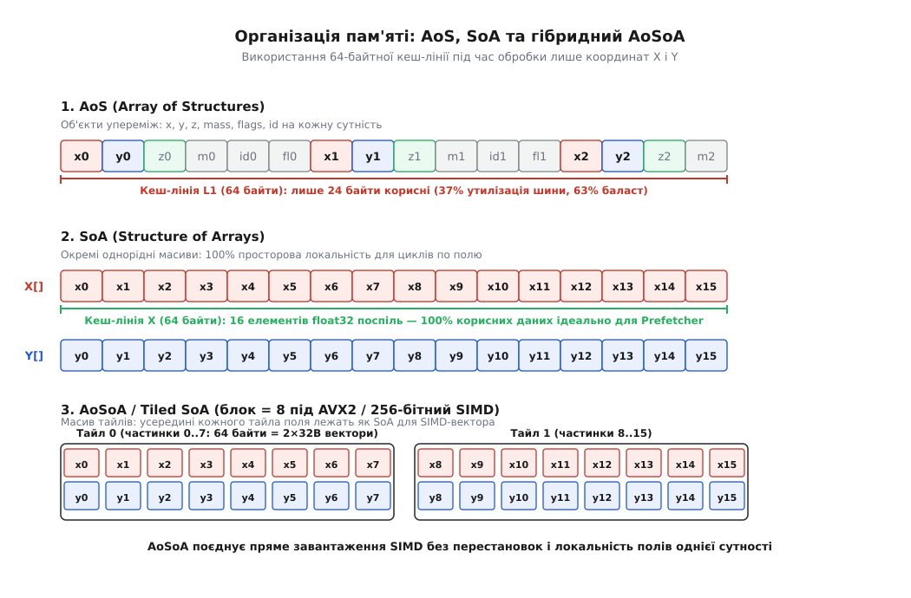
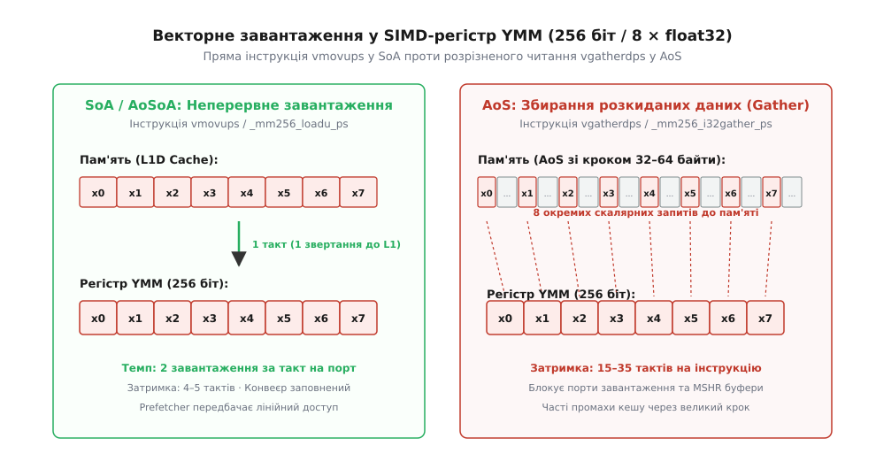
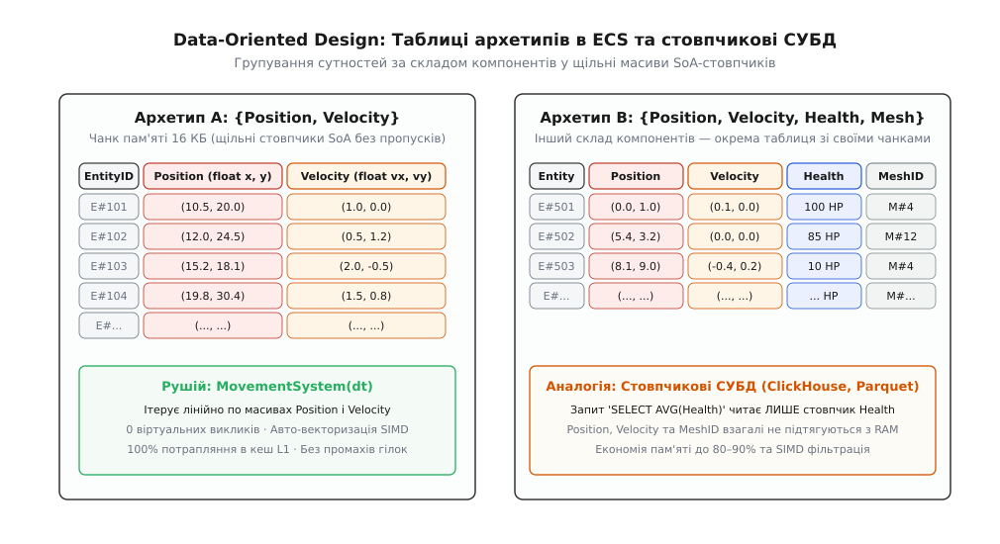

# Організація даних у пам'яті: AoS, SoA, AoSoA

<preknowlist>
- [Кеш](topic:hw-arch/cache) — кеш-лінія на 64 байти, чарунки пам'яті, промахи та просторова локальність.
- [Вирівнювання даних у пам'яті](topic:sf-apps/memory-alignment) — межі слів і кеш-ліній, паддинг у структурах.
- [SIMD і векторизація](topic:hw-arch/simd-vectorization) — векторні регістри, паралельна обробка смуг (lanes) та інструкції завантаження.
- [Хибне спільне використання кеш-лінії](topic:hw-arch/false-sharing) — як кілька потоків ділять спільну лінію кешу.
</preknowlist>

Розглянемо фізичний симулятор або ігровий рушій, який щокадру оновлює координати одного мільйона часток у віртуальному просторі. Кожна частка представлена структурою розміром 64 байти: три координати позиції `x, y, z`, три компоненти швидкості `vx, vy, vz`, маса, обмежувальний радіус, числовий ідентифікатор сутності та прапорці стану.

На кожному кроці моделювання обчислювальне ядро виконує найпростішу кінематичну формулу: до кожної координати додається відповідна швидкість, помножена на дельту часу `dt`. Для виконання цієї математичної дії над однією часткою процесору потрібно прочитати рівно 24 байти (позицію та швидкість) і записати назад 12 байтів нової позиції. Решта 40 байтів структури — маса, радіус, ідентифікатор і прапорці — у цьому циклі взагалі не використовуються.

Проте апаратна підсистема оперативної пам'яті та кешів L1, L2 і L3 не вміє вибирати з кристала DRAM довільні 24 байти. Уся ієрархія пам'яті сучасного комп'ютера оперує неподільними квантами фіксованого розміру — **кеш-лініями по 64 байти**. Щойно процесор намагається прочитати координату `x` першої частки, контролер пам'яті завантажує через системну шину всю 64-байтну лінію, тягнучи за собою масу, радіус і прапорці. Щоб оновити мільйон часток, процесор змушений перекачати через шину 64 мегабайти даних, із яких 40 мегабайтів є абсолютним баластом. Обчислювальний конвеєр витрачає частку такту на додавання чисел, але зависає на сотні тактів, очікуючи вибірки зайвих байтів із повільної оперативної пам'яті.

### Анатомія кеш-лінії та просторова локальність

Щоб зрозуміти причину цих втрат, необхідно спуститися на рівень транзисторів і провідників системної плати. Швидкість арифметико-логічних пристроїв (АЛП) та векторних блоків ядра процесора вимірюється гігагерцами: сучасне ядро здатне виконувати кілька операцій з плаваючою комою за один такт (затримка 0.25–0.5 наносекунди). Натомість мікросхеми динамічної пам'яті (DRAM) фізично не можуть відповісти на одиничний запит швидше ніж за 50–100 наносекунд.

Єдиним порятунком від цього розриву є багаторівневий кеш (L1, L2, L3). Коли ядро запитує байт за певною адресою, підсистема пам'яті завжди завантажує сусідній суцільний блок розміром 64 байти, вирівняний на адресу, кратну 64. Цей механізм спирається на принцип **просторової локальності** (англ. *spatial locality*): якщо програма звернулася до адреси `A`, з високою ймовірністю в наступні такти їй знадобляться адреси `A + 4`, `A + 8` тощо.

Якщо потрібні дані справді лежать у пам'яті поспіль, завантаження 64-байтної лінії стає тріумфом ефективності: перший доступ сплачує штраф затримки вибірки, але наступні 15 звертань до 4-байтних чисел `float` потрапляють у надшвидкий кеш першого рівня L1D, який віддає результат за 4–5 тактів.

Але якщо дані розкидані або перемішані з непотрібною інформацією, просторова локальність руйнується:
1. **Засмічення кешу (Cache Pollution):** Непотрібні поля (маса, ідентифікатор) займають обмежений об'єм кешу L1 (типово 32–48 КБ на ядро), передчасно витісняючи з нього інші гарячі дані.
2. **Параліч шини пам'яті:** Пропускна здатність шини (наприклад, 50–80 ГБ/с для DDR5) витрачається на транспортування порожніх байтів.
3. **Блокування буферів заповнення ліній (Line Fill Buffers, LFB):** Ядро має обмежену кількість апаратних слотів для незавершених запитів до пам'яті (зазвичай 12–16 буферів LFB). Щойно всі слоти заповнюються очікуванням різних кеш-ліній, виконання будь-яких подальших інструкцій завантаження блокується.

Спосіб, у який структури даних розкладені в адресній просторі програми, повністю визначає, чи буде кеш-лінія працювати як прискорювач, чи як гальмо.

### Масив структур (AoS): об'єктна ієрархія проти заліза

Найпоширенішим і найбільш інтуїтивним способом організації даних у програмуванні є **масив структур** (англ. *Array of Structures*, скорочено **AoS**). 

У парадигмі об'єктно-орієнтованого програмування розробник мислить категоріями сутностей реального світу. Об'єкт «Частка» володіє координатами, швидкістю та масою, тому природно описати його як єдиний клас або структуру, а сукупність часток — як динамічний масив або вектор таких структур:

:::tabs
```c
typedef struct {
    float x, y, z;
    float vx, vy, vz;
    float mass;
    float radius;
    int id;
    int flags;
    float pad[2]; // Доповнення до 64 байтів
} Particle;

Particle particles[1000000];
```
```cpp
#include <vector>
#include <cstdint>

struct alignas(64) Particle {
    float x, y, z;
    float vx, vy, vz;
    float mass;
    float radius;
    int32_t id;
    int32_t flags;
    float pad[2]; // 64 байти
};

std::vector<Particle> particles(1000000);
```
:::

У пам'яті такий масив виглядає як монотонна черга з мільйона блоків по 64 байти, де поля кожної частки упаковані суцільно одне за одним:

```
[ x0 y0 z0 vx0 vy0 vz0 m0 r0 id0 fl0 ][ x1 y1 z1 vx1 vy1 vz1 m1 r1 id1 fl1 ] ...
```


*Порівняння трьох схем розташування даних у пам'яті та утилізація 64-байтної лінії кешу L1 під час оновлення координат.*

Схема AoS має незаперечні переваги, коли програма оперує сутностями індивідуально:
- **Життєвий цикл одиничного об'єкта:** Створення, копіювання, видалення чи передача однієї частки в іншу функцію здійснюється тривіально, оскільки всі її поля лежать у єдиному компактному блоці пам'яті.
- **Повні точкові запити:** Якщо алгоритм вимагає прочитати всі поля конкретної частки за її індексом (наприклад, перевірити здоров'я, зчитати позицію і накласти ефект), один доступ завантажує всю інформацію про сутність в один рядок кешу.
- **Сумісність зі стандартними інтерфейсами:** Вершинні буфери в графічних API (OpenGL, DirectX) історично очікували саме формат AoS, де кожна вершина передається кортежем позиції, нормалі та текстурних координат.

Проте щойно виникає задача **масової обробки підмножини полів** (Batch Processing), схема AoS перетворюється на катастрофу. Крок (англ. *stride*) між координатами `x[i]` та `x[i+1]` у пам'яті становить 64 байти. Кожне нове число вимагає окремої кеш-лінії. Корисні дані розбавлені «мертвим вантажем», а процесор витрачає більшість енергії на перекачування непотрібних байтів.

### Структура масивів (SoA): інверсія пам'яті

Щоб повернути 100% утилізацію кешу та шини, організацію даних розвертають навиворіт. Замість масиву, що містить багато структур, створюють одну структуру, яка містить паралельні масиви для кожного окремого поля. Цей патерн називається **структурою масивів** (англ. *Structure of Arrays*, скорочено **SoA**):

:::tabs
```c
typedef struct {
    float *x;
    float *y;
    float *z;
    float *vx;
    float *vy;
    float *vz;
    float *mass;
    float *radius;
    int *id;
    int *flags;
} ParticlesSoA;
```
```cpp
#include <vector>
#include <cstdint>

struct ParticlesSoA {
    std::vector<float> x, y, z;
    std::vector<float> vx, vy, vz;
    std::vector<float> mass;
    std::vector<float> radius;
    std::vector<int32_t> id;
    std::vector<int32_t> flags;

    explicit ParticlesSoA(std::size_t n)
        : x(n), y(n), z(n), vx(n), vy(n), vz(n),
          mass(n), radius(n), id(n), flags(n) {}
};
```
:::

У фізичній пам'яті дані розташовуються довгими однорідними масивами:

```
Масив X:  [ x0  x1  x2  x3  x4  x5  x6  x7  ...  x999999 ]
Масив Y:  [ y0  y1  y2  y3  y4  y5  y6  y7  ...  y999999 ]
Масив VX: [ vx0 vx1 vx2 vx3 vx4 vx5 vx6 vx7 ...  vx999999 ]
```

Мікроархітектурні наслідки переходу на SoA є фундаментальними:
1. **Ідеальна утилізація кеш-лінії:** Коли процесор завантажує 64-байтну лінію з масиву `X`, вона містить рівно 16 послідовних чисел `float32` (`x0..x15`). Жоден байт не марнується. Усі 100% переданих через шину даних негайно споживаються обчислювальним циклом.
2. **Одиничний крок і бездоганна робота префетчера:** Крок доступу стає одиничним (Unit-Stride: `stride = 4 байти`). Апаратний блок випереджальної вибірки (Stream Prefetcher) процесора розпізнає лінійний рух уже після двох звертань і завчасно підкачує наступні лінії з DRAM у кеш другого рівня L2, повністю усуваючи затримки доступу.
3. **Ізоляція гарячих і холодних полів:** Якщо цикл оновлення позицій чіпає лише `x, y, z` та `vx, vy, vz`, масиви `mass`, `radius`, `id` та `flags` взагалі не підвантажуються в кеш-пам'ять. Обсяг перекачаних даних для одного мільйона часток скорочується з 64 МБ до 24 МБ — виграш становить 2.67 раза на чистому трафіку пам'яті.

Проте SoA має свої інженерні компроміси:
- **Ускладнення маніпуляцій сутностями:** Додавання нової частки або видалення існуючої вимагає виділення пам'яті або зсуву елементів у десяти окремих масивах.
- **Розпорошення покажчиків:** Обробка сутності, якій одночасно потрібні 8 різних полів, змушує ядро тримати відкритими 8 незалежних потоків читання за різними адресами, що може вичерпати внутрішні ресурси відстеження префетчера.

### Стрибок у векторний світ: чому SIMD вимагає SoA

Просторова локальність — лише половина виграшу від SoA. Друга половина полягає в тому, що сучасні процесори досягають пікової продуктивності виключно через векторні команди (SIMD — Single Instruction, Multiple Data).

Сучасні процесори архітектур x86-64 та ARM мають широкі векторні регістри:
- **ARM NEON:** 128-бітні регістри (4 числа `float32`);
- **Intel/AMD AVX2:** 256-бітні регістри (8 чисел `float32`);
- **Intel AVX-512:** 512-бітні регістри (16 чисел `float32`).

Векторна інструкція завантаження (наприклад, `_mm256_load_ps` у C/C++ або асемблерна команда `vmovaps`) вимагає, щоб 8 чисел `float` лежали в пам'яті **поспіль за суцільною адресою**.


*Неперервне читання блоку пам'яті однією інструкцією vmovups у SoA проти розрізненого збирання vgatherdps у масиві структур AoS.*

Коли дані організовані у форматі **SoA**, векторизація відбувається природно й безкоштовно:
1. Однією інструкцією `vmovaps` ядро завантажує вісім значень `x[0..7]` у регістр `ymm0`;
2. Другою інструкцією завантажує вісім значень `vx[0..7]` у регістр `ymm1`;
3. Інструкція `vfmadd231ps` за один такт множить вісім швидкостей на `dt` і додає їх до восьми координат;
4. Інструкція `vmovaps` записує вісім нових координат назад у пам'ять.

Спроба векторизувати той самий цикл над форматом **AoS** стикається з непереборною апаратною перешкодою. Координати `x0, x1, x2...` розділені чужими байтами. Щоб зібрати вісім значень `x` в один SIMD-регістр, компілятор змушений обирати між двома вкрай повільними шляхами:
- **Регістрове транспонування (Shuffles / Unpacks):** Завантажити кілька повних структур AoS у 8 різних векторних регістрів, а потім виконати складну серію перестановок і розпакувань (`_mm256_unpacklo_ps`, `_mm256_shuffle_ps`, `_mm256_permute2f128_ps`). Це перевантажує виконавчі порти ядра (Port 5) і спалює десятки тактів на службове перетасування бітів.
- **Розрізнене збирання (Gather):** Використати спеціальну команду `_mm256_i32gather_ps` (`vgatherdps`). Проте команда Gather не є магією кремнію: усередині вона мікропрограмно розгортається у вісім окремих скалярних звертань до кешу L1, блокуючи порти завантаження на 15–35 тактів.

У результаті векторизація AoS-коду часто працює навіть повільніше за звичайний скалярний цикл, тоді як SoA-код дає чисте прискорення в 4–8 разів. Практичні вимірювання затримок, лічильників промахів кешу та повний текст векторизованих функцій наведено у вставці [детальний розбір реалізації та заміри швидкодії AoS, SoA та AoSoA на практиці](topic:sf-apps/data-layout-aos-soa/proj-aos-soa-simd.md).

### Вплив на віртуальну пам'ять, TLB та багатонитковість

Крім кеш-ліній та SIMD-регістрів, організація даних суттєво впливає на дві інші критичні підсистеми процесора: трансляцію адрес у віртуальній пам'яті та когерентність кешів при багатопотоковості.

#### 1. Тиск на буфер трансляції адрес (TLB Pressure)

Процесор оперує віртуальними адресами, які блок управління пам'яттю (MMU) транслює у фізичні адреси сторінок (зазвичай 4 КБ). Для прискорення перекладу процесор використовує спеціалізований кеш адрес — Translation Lookaside Buffer (TLB).

Коли програма у форматі SoA виділяє 10 окремих масивів по 100 МБ кожен, ці масиви опиняються в абсолютно різних ділянках віртуального адресного простору. Під час виконання одного циклу ядро повинно одночасно підтримувати відкритими 10 активних записів у TLB. Якщо кількість паралельних масивів зростає до 30–50 (типова картина для складних фізичних моделей або аналітичних таблиць), об'єм кешу L1 TLB (зазвичай 64 записи) вичерпується. Виникає промах TLB (TLB Miss), що змушує апаратний блок Page Miss Handler виконувати повільний обхід 4-рівневої таблиці сторінок у пам'яті (Page Table Walk), витрачаючи до 50 тактів на кожне нове звертання.

Для усунення цього ефекту у великих SoA-системах застосовують виділення пам'яті через «великі сторінки» (Huge Pages розміром 2 МБ або 1 ГБ через системний виклик `mmap` із прапорцем `MAP_HUGE_2MB`), що скорочує кількість необхідних записів TLB у 512 разів.

#### 2. Хибне спільне використання кеш-лінії (False Sharing)

У багатопотокових додатках обробка масивів розподіляється між різними ядрами процесора (наприклад, через OpenMP або пул задач).

Якщо дані організовані у форматі **AoS**, і розмір структури становить 32 байти, дві сусідні частки `particles[0]` та `particles[1]` опиняються в межах **однієї 64-байтної кеш-лінії**. Якщо Потік 0 на Ядрі 0 оновлює координати першої частки, а Потік 1 на Ядрі 1 паралельно оновлює координати другої частки, виникає [хибне спільне використання](topic:hw-arch/false-sharing) (False Sharing):
- Апаратний протокол когерентності кешів (MESI або MOESI) фіксує запис у лінію на Ядрі 0 і надсилає сигнал інвалідації (`Invalidate`) у кеш Ядра 1.
- Кеш-лінія починає хаотично стрибати між L1-кешами двох ядер («пінг-понг кеш-лінії»), створюючи колосальний трафік на внутрішній кільцевій шині кристала. Продуктивність багатопотокового коду може впасти у 10–20 разів порівняно з однопотоковою версією.

У форматах **SoA** та **AoSoA** ця проблема відсутня за визначенням: дані розбиваються на великі неперервні діапазони індексів. Потік 0 обробляє чанк часток `0..499999`, а Потік 1 — `500000..999999`. Межа між потоками перетинає максимум одну кеш-лінію на весь мільйонний масив, гарантуючи ідеальне лінійне масштабування на 16, 32 чи 64 ядрах.

### Паралелізм на GPU: чому SIMT вимагає SoA

У графічних процесорах (GPU) архітектури NVIDIA, AMD та Intel паралелізм будується за моделлю SIMT (Single Instruction, Multiple Threads). Розрахункові нитки групуються в апаратні пачки — варпи (Warp у NVIDIA, 32 нитки) або вейвфронти (Wavefront в AMD, 32 або 64 нитки). Усі 32 нитки варпа виконують одну й ту саму інструкцію одночасно.

Коли 32 нитки виконують читання координат `pos[thread_id].x`:
- **У форматі SoA:** Нитки `0..31` запитують елементи пам'яті за адресами `base + 0`, `base + 4`, ..., `base + 124`. Усі 32 адреси утворюють один суцільний блок розміром 128 байтів. Контролер пам'яті GPU об'єднує ці звертання в **одну суміщену транзакцію пам'яті (Coalesced Memory Access)** і віддає дані на максимальній швидкості шини відеопам'яті (до 2–3 ТБ/с на HBM3/GDDR6).
- **У форматі AoS:** Нитки `0..31` запитують адреси `base + 0`, `base + 64`, ..., `base + 1984`. Запити розпорошені по 32 різних 128-байтних секторах пам'яті. Контролер пам'яті змушений серіалізувати це завантаження у **32 окремі транзакції**, що призводить до падіння ефективної пропускної здатності на 90–95% (Uncoalesced Access Penalty).

Тому в коді шейдерів (Compute Shaders у Vulkan/DirectX) та обчислювальних ядрах CUDA/OpenCL структури даних майже завжди організуються суворо за схемою SoA або завантажуються в швидку спільну пам'ять (Shared Memory / Local Data Share) для попереднього регістрового транспонування.

### AoSoA (Array of Structures of Arrays): синтез двох світів

Чи можна отримати максимальну швидкість SIMD-векторизації, властиву SoA, але зберегти просторову компактність і зручність маніпуляції сутностями, властиву AoS?

Відповіддю інженерії стала гібридна організація пам'яті — **масив структур масивів** (англ. *Array of Structures of Arrays*, скорочено **AoSoA**, також відомий як *Tiled SoA*, *Blocked SoA* або *SoAoS*).

Ідея полягає в тому, щоб розбити всю сукупність сутностей на невеликі фіксовані блоки (тайли). Розмір тайла `LANES` обирається рівним або кратним ширині векторного регістру цільового процесора (наприклад, 8 для AVX2 або 16 для AVX-512):

:::tabs
```c
#define LANES 8

typedef struct {
    float x[LANES];
    float y[LANES];
    float z[LANES];
    float vx[LANES];
    float vy[LANES];
    float vz[LANES];
} ParticleTile;

ParticleTile tiles[1000000 / LANES];
```
```cpp
#include <vector>
#include <cstddef>

inline constexpr std::size_t SIMD_LANES = 8;

struct alignas(32) ParticleTile {
    float x[SIMD_LANES];
    float y[SIMD_LANES];
    float z[SIMD_LANES];
    float vx[SIMD_LANES];
    float vy[SIMD_LANES];
    float vz[SIMD_LANES];
};

std::vector<ParticleTile> tiles(1000000 / SIMD_LANES);
```
:::

Чому AoSoA вважається «золотим стандартом» для високопродуктивних обчислень:
1. **Усередині кожного тайла — чистий SoA:** Масив `x[0..7]` займає рівно 32 байти. Він завантажується в 256-бітний регістр AVX2 однією інструкцією `vmovaps` без перестановок і без команд збирання Gather.
2. **Між тайлами — компактний AoS:** Дані для 8 часток згруповані разом. Увесь тайл із 6 полів займає `6 × 8 × 4 = 192` байти — рівно три 64-байтні кеш-лінії. Якщо алгоритму потрібні всі компоненти руху цих восьми часток, вони гарантовано опиняються в кеші L1 разом.
3. **Єдиний монолітний потік пам'яті:** Замість шести далеких покажчиків (як у SoA), процесор ітерує по єдиному лінійному буферу `tiles`. Це захищає підсистему пам'яті від конфліктів асоціативності кешу (Cache Set Collisions) і дозволяє блоку L2 Stream Prefetcher бездоганно передбачати адреси наступних ліній.

AoSoA широко застосовується в рушіях трасування променів (Packet Ray Tracing: пакети по 8 або 16 променів), обчислювальній гідродинаміці, аудіо-DSP плагінах та сучасних фізичних рушіях.

### Філософія Data-Oriented Design та архітектура ECS

Усвідомлення вирішального впливу організації пам'яті на продуктивність породило фундаментальний напрям у розробці програмного забезпечення — **Data-Oriented Design (DOD)**.

Історичний шлях та архітектурна парадигма відмови від класичних ієрархій класів на користь потоків даних детально описані в окремій статті [Data-Oriented Design (DOD)](topic:sf-apps/data-oriented-design).

Головним практичним втіленням Data-Oriented Design в індустрії розробки інтерактивних систем став архітектурний патерн **Entity Component System (ECS)**.


*Організація пам'яті за принципами Data-Oriented Design: щільні стовпчики компонентів у рушіях ECS та аналітичних СУБД.*

На відміну від класичного ООП, де об'єкт поєднує стан і поведінку, в ECS діє жорсткий поділ:
- **Сутність (Entity):** Це не покажчик і не об'єкт у купі, а звичайне 64-бітне ціле число-ідентифікатор.
- **Компонент (Component):** Проста структура даних без методів і логіки (POD-тип).
- **Система (System):** Функція або модуль, що містить чисту логіку й обробляє компоненти у щільних циклах.

#### 1. Зберігання через архетипи (Archetype Storage)

Найпродуктивніші сучасні ECS-рушії (Unity DOTS, Bevy, Unreal Mass, Flecs) використовують зберігання компонентів на основі **архетипів**:
1. Усі сутності, що мають однаковий набір компонентів (наприклад, сутності зі складом `{Position, Velocity}`), групуються в окрему таблицю — **Архетип**.
2. Пам'ять архетипу розбивається на фіксовані сторінки (чанки) розміром 16 або 64 КБ, що відповідає розміру кешу L1/L2.
3. Усередині чанка кожен тип компонента зберігається у вигляді **окремого щільного масиву (SoA-стовпчика)** без дірок і пропусків.

Коли системі `MovementSystem` потрібно перемістити всі об'єкти, вона не стрибає за вказівниками об'єктів у купі. Вона отримує два прямі покажчики на суцільні масиви `Position[]` та `Velocity[]` поточного чанка й виконує по них лінійний векторизований прохід. Кеш-промахи повністю ліквідовуються, а відсутність віртуальних викликів дозволяє компілятору розгортати цикли й використовувати SIMD на повну потужність.

#### 2. Зберігання через розріджені множини (Sparse Sets)

Альтернативним підходом до побудови ECS (реалізованим у надшвидкій C++ бібліотеці EnTT) є використання **розріджених множин (Sparse Sets)**.

У цій схемі кожен тип компонента має дві паралельні структури даних:
1. **Розріджений масив (Sparse Array):** Масив індексів, розмір якого дорівнює максимальному ID сутності у грі. За індексом `EntityID` він повертає позицію компонента у щільному масиві.
2. **Щільний масив компонентів (Dense Array):** Компактний масив SoA, де компоненти сутностей упаковані суцільно без жодних пропусків.

Підхід на основі Sparse Set дозволяє додавати та видаляти компоненти сутностей за строго `O(1)` час без необхідності переміщення сутності між архетипами та перерозподілу пам'яті чанків. При цьому ітерація по щільному масиву зберігає майже таку саму швидкість і кеш-локальність, як і в архетипних таблицях.

### Стовпчикова революція в аналітичних базах даних (OLAP)

Принципи організації пам'яті, що змінили розробку ігор, справили ще більший вплив на індустрію баз даних і систем зберігання інформації.

Усі системи керування базами даних поділяються на два принципово різні класи за характером навантаження:

| Характеристика | Транзакційні СУБД (OLTP) | Аналітичні СУБД (OLAP) |
| :--- | :--- | :--- |
| **Типові сценарії** | Банківські операції, оформлення замовлень | Звіти, бізнес-аналітика, сканування терабайтів |
| **Характер запитів** | Точкові: читання/запис одного рядка за ID | Агрегаційні: `SELECT AVG(price) WHERE date > ...` |
| **Організація даних** | Рядкова (Row-Oriented / **AoS**) | Стовпчикова (Columnar / **SoA** / **AoSoA**) |
| **Приклади систем** | PostgreSQL, MySQL, SQLite | ClickHouse, DuckDB, Snowflake, Apache Parquet |

#### Чому рядкові СУБД (AoS) програють в аналітиці

Класичні реляційні бази даних (PostgreSQL, MySQL) зберігають таблиці рядками — кортеж за кортежем на дискових сторінках. Це ідеально для запиту `SELECT * FROM users WHERE id = 42`: система читає одну сторінку й одразу отримує ім'я, пароль, адресу та баланс користувача.

Але якщо аналітику потрібно порахувати середню заробітну плату мільйона співробітників:

```sql
SELECT AVG(salary) FROM employees WHERE department_id = 5;
```

Рядкова база змушена зчитувати з диска та оперативної пам'яті всі повні рядки таблиці, включно з довгими текстовими полями біографій, адресами та фотографіями, лише для того, щоб витягти з кожного рядка одне 4-байтне число `salary`. 95% дискового вводу-виводу та пропускної здатності RAM витрачається на перенесення мертвого вантажу.

#### Стовпчикове зберігання (Columnar Storage) та векторизоване виконання

Стовпчикові СУБД (ClickHouse, DuckDB) та аналітичні формати файлів (Apache Parquet, Apache Arrow, ORC) зберігають дані за принципом SoA / AoSoA:
1. **Відсікання стовпців (Column Pruning):** Запит, що звертається лише до стовпця `salary`, зчитує з носія **виключно масив значень зарплат**. Усі інші стовпці таблиці взагалі не піднімаються з накопичувача.
2. **Векторизовані рушії запитів (Vectorized Query Execution):** Замість класичної моделі ітератора Volcano (де метод `next()` викликається для кожного окремого рядка через віртуальну функцію), сучасні рушії (наприклад, ідеї MonetDB/X100 у DuckDB та ClickHouse) передають між операторами реляційної алгебри вектори з 1024 або 2048 значень (патерн AoSoA). Операції фільтрації та підсумовування виконуються в щільних циклах з використанням інструкцій AVX2/AVX-512.
3. **Екстремальне стиснення однорідних даних:** У стовпчику лежать дані одного типу та близького діапазону. Це дозволяє ефективно застосовувати легковиважні алгоритми стиснення безпосередньо в оперативній пам'яті: RLE (Run-Length Encoding), словникове кодування (Dictionary Encoding), дельта-кодування та бітове пакування (Bit Packing). Багато операцій агрегації сучасні аналітичні СУБД виконують прямо над стисненими даними без їхнього розпакування.
4. **Apache Arrow — уніфікована пам'ять для гетерогенного світу:** Відкритий стандарт Apache Arrow стандартизував представлення стовпчикових даних (SoA/AoSoA) безпосередньо в оперативній пам'яті з підтримкою бітових масок для значень `NULL`. Це усунуло витрати на серіалізацію/десеріалізацію: аналітична бібліотека на Python (Polars/Pandas) може передавати гігабайтні стовпчики в C++ рушій DuckDB або напряму в пам'ять прискорювача GPU (CUDA Unified Memory) через механізм нульового копіювання (Zero-Copy Shared Memory).

### Інженерна матриця вибору розкладки пам'яті

Вибір між AoS, SoA та AoSoA є фундаментальним архітектурним рішенням. Мови програмування C та C++ через наявність вказівників і суворі правила стабільності ABI не можуть автоматично перетворити одну розкладку на іншу під час компіляції. Тому відповідальність за фізичну топологію пам'яті цілком лежить на інженері.

| Критерій оцінювання | AoS (Масив структур) | SoA (Структура масивів) | AoSoA (Тайловий SoA) |
| :--- | :--- | :--- | :--- |
| **Утилізація кеш-лінії під час вибіркового доступу** | Низька (10–30%) | Ідеальна (100%) | Ідеальна (100%) |
| **Ефективність авто-векторизації SIMD** | Вкрай низька (Gather/Shuffles) | Максимальна (прямі `vmov`) | Максимальна (прямі `vmov`) |
| **Навантаження на Prefetcher потоки** | 1 потік (але з великим кроком) | Багато паралельних потоків | 1 лінійний потік |
| **Тиск на таблиці TLB та віртуальну пам'ять** | Мінімальний (1 регіон) | Високий (N регіонів) | Мінімальний (1 регіон) |
| **Стійкість до False Sharing у багатопотоковості** | Низька (потрібен padding) | Ідеальна (секціонування) | Ідеальна (секціонування) |
| **Сумісність із моделлю пам'яті GPU (SIMT)** | Катастрофічна (Uncoalesced) | Ідеальна (Coalesced 128B) | Ідеальна (Тайли під Warp) |
| **Зручність індивідуального додавання/видалення** | Висока (O(1) операція) | Низька (зсув у N масивах) | Середня (робота на рівні тайла) |
| **Точкові запити до всіх полів одного елемента** | Ідеальна (усі поля поруч) | Погана (промахи по N масивах) | Відмінна (у межах тайла) |
| **Типова область застосування** | Точкові транзакції, UI, дрібні DTO | Аналітика стовпців, чисельні методи | Фізика, рейтрейсинг, ігри, DSP |

Практичне правило архітектора обчислювальних систем зводиться до простого алгоритму:
- Якщо дані обробляються **поодинці або потрібні майже всі поля одночасно** (наприклад, парсинг мережевого пакету чи обробка запиту користувача) — обирайте **AoS**.
- Якщо задача полягає в **масовій лінійній обробці одного-двох полів** над мільйонами елементів (наприклад, фільтрація стовпця в таблиці чи зміна яскравості пікселів) — обирайте **SoA**.
- Якщо алгоритм вимагає **масових векторних обчислень над кількома взаємопов'язаними полями сутності** (наприклад, просторова кінематика, розрахунок сил взаємодії, трасування променів) — обирайте **AoSoA**.

Організація даних у пам'яті — це не питання стилю програмування. Це фізичний міст між абстрактною логікою алгоритму та кремнієвою реальністю мікропроцесора. Програма, спроєктована з урахуванням структури кеш-ліній та ширини векторних регістрів, перетворює підсистему пам'яті зі стіни на швидкісну магістраль.
