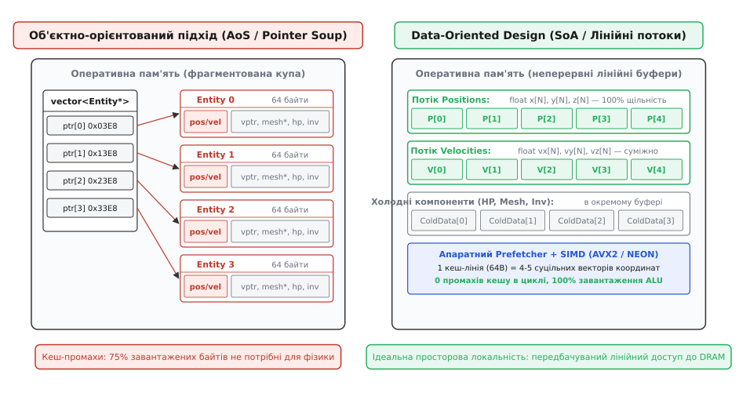
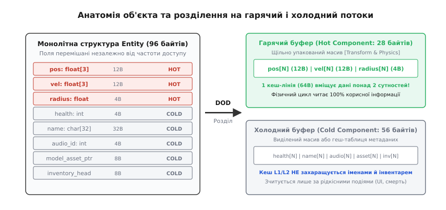
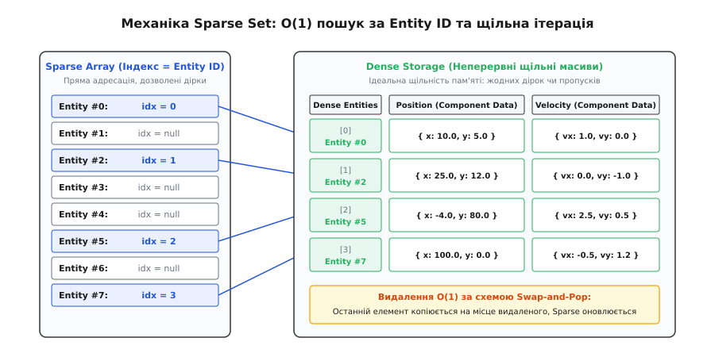
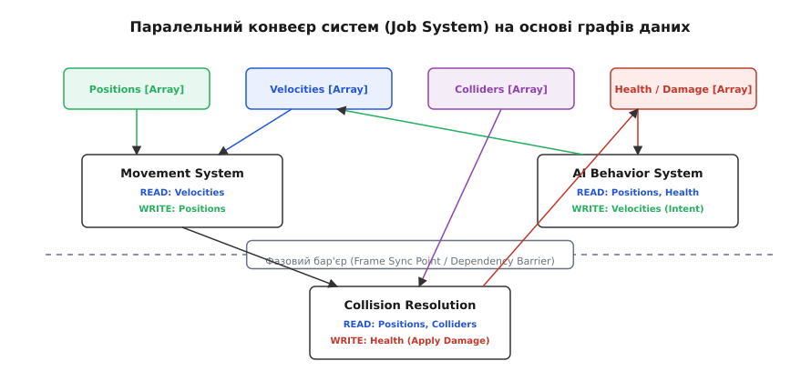

# Data-Oriented Design (DOD)

<preknowlist>
- [Кеш-пам'ять](topic:hw-arch/cache) — ієрархія пам'яті (L1, L2, L3, DRAM), вартість кеш-промахів та розмір кеш-лінії 64 байти.
- [Вирівнювання даних у пам'яті](topic:sf-apps/memory-alignment) — межі слів процесора, вирівнювання структур та вплив заповнювача (padding) на розмір об'єктів.
- [SIMD і векторизація](topic:hw-arch/simd-vectorization) — паралельне виконання однієї машинної інструкції над вектором елементів у неперервній пам'яті.
- [Розкладка даних у пам'яті: AoS і SoA](topic:sf-apps/data-layout-aos-soa) — різниця між масивом структур і структурою масивів для векторної обробки.
</preknowlist>

Коли цикл симуляції оновлює координати 100 000 ігрових сутностей, класична об'єктно-орієнтована програма ітерується масивом покажчиків `std::vector<Entity*>`. Кожен об'єкт `Entity` виділений окремим викликом у динамічній пам'яті (купі) і займає від 64 до 128 байтів: він містить покажчик на таблицю віртуальних методів (`vptr`), текстове ім'я персонажа, звукові ідентифікатори, стан інвентарю, координати позиції та вектор швидкості.

Для обчислення фізики руху процесору потрібні лише 12 байтів позиції (`x, y, z`) та 12 байтів швидкості (`vx, vy, vz`) — разом 24 байти. Проте перехід за кожним покажчиком спричиняє стрибок у випадкову ділянку адресної пам'яті. Процесорне ядро з тактовою частотою 4 ГГц виконує один такт за 0.25 наносекунди, тоді як затримка вибірки з основної пам'яті (DRAM) становить 60–80 наносекунд. На кожній ітерації конвеєр процесора зависає в очікуванні пам'яті на 200–300 тактів. 

Крім того, апаратний контролер пам'яті змушений завантажувати з DRAM неподільну 64-байтну лінію кешу, в якій корисні 24 байти супроводжуються 40 байтами невикористаних холодних полів. Корисна пропускна здатність шини падає нижче 20%, а апаратний блок випереджального завантаження (англ. *hardware stream prefetcher*) повністю дезорієнтований хаотичним стрибанням за адресами.

Підхід Data-Oriented Design (DOD, лат. *datum* — дане, англ. *design* — проєктування) розв'язує цю кризу шляхом відмови від моделювання світу через ієрархію самодостатніх об'єктів. Замість групування різнорідних даних навколо сутності, DOD організовує пам'ять у вигляді паралельних, щільно упакованих лінійних потоків однорідних даних, перетворюючи програму на конвеєр прямої векторної трансформації пам'яті.

---

### Фізична реальність заліза проти об'єктних абстракцій

Об'єктно-орієнтований підхід будує архітектуру коду навколо ментальної моделі людини: світ складається з предметів (монстрів, банківських рахунків, графічних вікон), кожен із яких володіє власним прихованим станом та набором методів. Проте кремнієвий мікропроцесор нічого не знає про класи, успадкування чи поліморфізм.

Для апаратної частини комп'ютера існує лише фізичний конвеєр виконання інструкцій та багаторівнева ієрархія пам'яті:

1. **Регістри процесора:** доступ за 0 тактів (~0.25–0.5 нс), обсяг близько 1–2 КБ;
2. **Кеш L1:** доступ за 4–5 тактів (~1 нс), типовий розмір 32–48 КБ на ядро;
3. **Кеш L2:** доступ за 12–14 тактів (~3–4 нс), типовий розмір 512 КБ–1 МБ на ядро;
4. **Кеш L3 (спільний):** доступ за 40–60 тактів (~10–15 нс), типовий розмір 16–96 МБ;
5. **Основна пам'ять (DRAM):** доступ за 200–300 тактів (~60–80 нс).

Розрив у швидкодії між обчислювальними блоками АЛП та затримкою пам'яті перевищує два порядки величини. Будь-який непрямий перехід за покажчиком (англ. *pointer chasing*) та будь-який віртуальний виклик через `vtable` нищать просторову та часову локальність кешу.

```
[Об'єкт ООП у купі] ──> [Промах L1] ──> [Промах L2] ──> [Промах L3] ──> [Очікування DRAM: 250 тактів простою]
```


*Порівняння організації пам'яті: об'єктна ієрархія з хаотичними покажчиками завантажує кеш-лінії з 80% непотрібних даних, тоді як Data-Oriented масиви забезпечують 100% просторову локальність та роботу векторного конвеєра.*

Data-Oriented Design ґрунтується на трьох базових аксіомах апаратної орієнтації:

- **Програма існує виключно для перетворення даних:** Код не є самоціллю; він лише описує правила, за якими вхідний масив байтів трансформується у вихідний масив байтів.
- **Залізо — це фізична константа:** Розмір кеш-лінії (64 байти), ширина SIMD-регістрів (128, 256 або 512 бітів), розмір сторінки пам'яті (4 КБ) та механіка роботи контролера шини диктують оптимальну структуру програми. Ігнорування фізичної будови процесора заради абстрактної елегантності коду призводить до катастрофічних втрат продуктивності.
- **Де є одна сутність — там майже завжди є масив сутностей:** Програми рідко обробляють єдиний ізольований об'єкт. Вони оновлюють тисячі частинок, мільйони записів у базі даних, десятки тисяч полігонів або сотні тисяч фінансових ордерів. Проєктувати структури слід для пакетної обробки масивів, а не одиничних скалярів.

Історичний шлях виникнення цього підходу — від консолі PlayStation 3 Cell до маніфестів ігрової індустрії — детально розкрито у вставці [Від об'єктної ієрархії до потоків даних: народження Data-Oriented Design](topic:sf-apps/data-layout-aos-soa/hist-data-oriented-design.md).

---

### Розділення за частотою доступу (Hot / Cold Splitting)

Головною причиною неефективного використання кеш-пам'яті в монолітних структурах є спільне розміщення полів із принципово різною частотою та контекстом доступу.

Розглянемо структуру сутності персонажа:

```
struct Character {
    // Гарячі поля (Hot data) — потрібні щокадру для фізики та рендеру
    float position[3];      // 12 байтів
    float velocity[3];      // 12 байтів
    float bounding_radius;  // 4 байти

    // Холодні поля (Cold data) — потрібні лише за рідкісними подіями
    int   health;           // 4 байти (лише при влучанні)
    char  name[32];         // 32 байти (лише для діалогів та UI)
    int   audio_cue_id;     // 4 байти (лише при старті звуку)
    void* mesh_resource;    // 8 байтів
    void* inventory_ptr;    // 8 байтів
};
```

Повний розмір структури `Character` становить 84 байти (з урахуванням вирівнювання — 96 байтів). Під час виконання циклу виявлення зіткнень процесору потрібні лише поля `position` та `bounding_radius` (разом 16 байтів). Проте через розміщення в монолітній структурі кожні 16 байтів тягнуть за собою 80 байтів непотрібних метаданих.


*Розділення монолітної структури на гарячий компонент (оновлюється щокадру) та холодний компонент (потрібен лише за подіями) збільшує щільність корисної інформації в кеш-лінії у понад два рази.*

Техніка **Hot/Cold Splitting** фізично розносить ці поля на два незалежні паралельні масиви:

1. **Гарячий буфер (`HotComponent`):** масив суміжних структур розміром 28 байтів (або окремі масиви полів у форматі SoA). Усі 64 байти кожної зчитаної кеш-лінії повністю заповнені активними координатами.
2. **Холодний буфер (`ColdComponent`):** розміщений в окремому пулі пам'яті. Зчитується виключно спеціалізованими підсистемами (інтерфейсом користувача, обробником пошкоджень або аудіорушієм).

Кількісне математичне виведення економії пропускної здатності шини пам'яті, коефіцієнта засмічення кешу та затримок сторінок DRAM наведено у вставці [Кількісна модель трафіку пам'яті та утилізації кеш-ліній](topic:sf-apps/data-oriented-design/math-cache-traffic.md).

---

### Архітектурний патерн Entity Component System (ECS)

Data-Oriented Design реалізується на практиці через архітектурний патерн **Entity Component System (ECS)**. Він остаточно ліквідує класичну тріаду об'єктно-орієнтованого проєктування (інкапсуляцію, успадкування та поліморфізм), замінюючи її реляційною моделлю даних:

```
┌─────────────────┐       ┌────────────────────────┐       ┌──────────────────────┐
│  Сутність (ID)  │ ───>  │    Компоненти (POD)    │ ───>  │  Системи (Функції)   │
│  Ціле число     │       │    Чисті масиви даних  │       │  Пакетна трансформація│
└─────────────────┘       └────────────────────────┘       └──────────────────────┘
```

#### 1. Сутність (Entity)
Сутність у DOD більше не є структурою, класом чи об'єктом у пам'яті. Це виключно **числовий ідентифікатор** (ціле число `uint32_t` або `uint64_t`), аналогічний первинному ключу (Primary Key) в реляційних базах даних. Сутність не містить полів, методів чи логіки: це просто маркер, який пов'язує набори компонентів між собою.

#### 2. Компонент (Component)
Компонент є структурою «чистих даних» (Plain Old Data / POD, лат. *pura data*). Він не має методів, віртуальних таблиць чи прихованого стану. Компоненти одного типу зберігаються виключно в неперервних лінійних масивах.

#### 3. Система (System)
Система є чистою підпрограмою або функцією без власного внутрішнього стану. Вона приймає на вхід лінійні зрізи масивів потрібних компонентів (наприклад, потік `Positions` і потік `Velocities`) та виконує над ними обчислювальну трансформацію в простому щільному циклі.

---

### Стратегії зберігання компонентів: Sparse Set проти архетипів

В інженерії Data-Oriented систем виділяють дві фундаментальні моделі фізичного розташування компонентів у пам'яті: підхід на основі **Sparse Set** та підхід на основі **чанкових архетипів (Archetype Chunks)**.

| Критерій | Sparse Set ECS | Archetype / Chunk ECS |
| :--- | :--- | :--- |
| **Організація пам'яті** | Окремий щільний пул для кожного типу компонента | Фіксовані чанки (16/64 КБ), згруповані за комбінацією компонентів |
| **Швидкість пошуку за Entity ID** | `O(1)` прямим індексуванням | `O(1)` через таблицю розміщення сутностей |
| **Ітерація за компонентами одного типу** | Максимальна швидкість (100% щільність) | Максимальна швидкість у межах сумісних архетипів |
| **Ітерація за перетином 2+ компонентів** | Непрямий доступ за розрідженим індексом найменшого пулу | Ідеально лінійна: усі компоненти архетипу лежать в одному чанку |
| **Ціна додавання/видалення компонента** | `O(1)` (вставка в масив або Swap-and-Pop) | `O(N)` перенесення сутності між чанками різних архетипів |
| **Використання в індустрії** | EnTT, Bevy, Flecs (sparse queries) | Unity DOTS, Unreal Engine Mass Entity, Flecs |


*Структура Sparse Set транслює числовий ідентифікатор сутності в щільний індекс масиву за O(1), дозволяючи вилучати компоненти без утворення порожнин через механізм Swap-and-Pop.*

Повну робочу реалізацію компонента позицій на базі Sparse Set мовами C та C++ наведено у вставці [Реалізація пулу сутностей та компонентів на основі Sparse Set](topic:sf-apps/data-oriented-design/proj-sparse-set-ecs.md).

Специфікацію розкладки пам'яті та інтерфейсний контракт чанкового реєстру архетипів наведено у вставці [Інтерфейс та структура чанкового реєстру архетипів](topic:sf-apps/data-oriented-design/api-archetype-registry.md).

---

### Спеціалізовані алокатори пам'яті в Data-Oriented Design

Стандартні функції динамічного виділення пам'яті (`malloc`/`free` у C та `new`/`delete` у C++) оптимізовані для довільних сценаріїв використання загального призначення. Для відстеження виділених блоків вони додають прихований заголовок розміром 8–16 байтів перед кожною виділеною ділянкою та використовують внутрішні м'ютекси для синхронізації між потоками. Виділення тисяч дрібних об'єктів через загальносистемний алокатор гарантовано фрагментує віртуальний адресний простір.

Data-Oriented Design спирається на спеціалізовані патерни керування пам'яттю:

1. **Лінійний алокатор (Arena / Monotonic Allocator):** виділяє один великий неперервний блок пам'яті на початку роботи програми. Будь-яке нове виділення зводиться до збільшення покажчика зміщення (`offset += size`). Звільнення пам'яті виконується одномоментно скиданням покажчика на нуль (`offset = 0`) наприкінці кадру або ітерації. Час роботи — `O(1)`, накладні витрати заголовків — нуль байтів.
2. **Пул фіксованого розміру (Slab / Pool Allocator):** розбиває монолітний буфер на однакові чарунки (наприклад, по 64 байти для компонентів або по 16 КБ для чанків). Вільні чарунки організовані у зв'язний список безпосередньо всередині невикористаних блоків. Виділення та повернення блоку виконуються за 1–2 такти процесора без фрагментації пам'яті.
3. **Кадровий алокатор (Double / Frame Buffer):** підтримує два паралельні буфери пам'яті. В одному буфері поточний кадр зчитує стан попереднього кроку, а в інший записує нові обчислені значення, після чого на фазовому бар'єрі покажчики буферів міняються місцями (Ping-Pong Buffering).

---

### Безгілкова обробка та передбачуваність конвеєра (Branchless Execution)

Окрім промахів кешу, іншим головним джерелом простоїв сучасних суперскалярних процесорів є помилки передбачення розгалужень (англ. *branch misprediction penalty*). У глибоких конвеєрах (14–20 стадій) хибний перехід усередині циклу скидає всі завантажені інструкції, марнуючи 15–20 тактів процесора на кожній помилці.

В об'єктно-орієнтованому коді цикли переповнені умовними перевірками:

```
for (Entity* e : entities) {
    if (e->is_active && e->health > 0) {
        e->update();
    }
}
```

У Data-Oriented Design фільтрація за станом переноситься на рівень композиції компонентів або замінюється безгілковими векторними інструкціями:

1. **Фільтрація через компоненти-теги:** Неактивні сутності або сутності з нульовим здоров'ям взагалі не мають компонента `ActiveTag` або `Movable`. Вони не потрапляють у щільний масив, тому внутрішній цикл взагалі не містить умовних операторів `if`.
2. **Арифметичне маскування (Branchless Bitmasking):** Якщо обчислення залежить від умови, замість оператора `if` застосовують побітові маски або інструкції умовного копіювання (`cmov` у x86 або `csel` у ARM), які транслюють умову в єдиний детермінований конвеєр інструкцій без розривів.

---

### Паралелізм на основі графів даних та Job Systems

Класичний об'єктно-орієнтований код створює колосальні труднощі для масштабування на багатоядерних процесорах. Коли кілька потоків намагаються одночасно взаємодіяти з об'єктами, розробники змушені впроваджувати м'ютекси (`std::mutex`), атомарні операції або дрібнозернисті блокування всередині методів класів. Це призводить до:

- **Конкуренції за блокування (Lock Contention):** потоки витрачають час на очікування звільнення синхропримітивів;
- **Взаємних блокувань (Deadlocks):** порушення порядку захоплення ресурсів заморожує програму;
- **Хибного спільного використання ліній кешу (False Sharing):** коли два ядра модифікують різні поля одного об'єкта, що лежать на одній 64-байтній кеш-лінії, протокол когерентності (MESI/MOESI) змушений постійно інвалідувати кеш обох ядер.

Data-Oriented Design розв'язує проблему багатопотоковості на рівні архітектури пам'яті. Оскільки системи є функціями над неперервними масивами компонентів, кожна система може явно задекларувати свої вимоги до доступу:

```
MovementSystem:     READ(Velocity), WRITE(Position)
AISystem:           READ(Position), READ(Health), WRITE(Velocity)
CollisionSystem:    READ(Position), READ(Collider), WRITE(Health)
```


*Граф залежностей систем за компонентами: системи з неперетинними правами запису виконуються повністю паралельно без блокувань і конфліктів за кеш-лінії.*

Планувальник задач (англ. *Job System*) автоматично будує напрямлений ациклічний граф (DAG) залежностей:

1. Будь-яка кількість систем може **одночасно читати** один і той самий масив компонентів без блокувань;
2. Системи, які модифікують різні масиви, виконуються **паралельно на різних робочих потоках**;
3. Якщо одна система пише в масив, який потрібен іншій системі, між ними встановлюється детермінований фазовий бар'єр (англ. *phase sync point*).

У такій моделі повністю відсутні м'ютекси, гонки даних (data races) та непередбачувані затримки синхронізації.

---

### Порівняння коду: Об'єктна ієрархія проти потокового DOD

Розглянемо практичну реалізацію оновлення координат сутностей двома способами.

:::tabs
```c
/* =========================================================================
 * 1. Класичний підхід (AoS / Pointer Soup)
 * ========================================================================= */
typedef struct EntityClassic {
    float x, y, z;
    float vx, vy, vz;
    char  name[32];
    int   health;
} EntityClassic;

void update_classic(EntityClassic** entities, uint32_t count, float dt) {
    for (uint32_t i = 0; i < count; ++i) {
        EntityClassic* e = entities[i]; // Непрямий перехід за покажчиком (промах кешу)
        e->x += e->vx * dt;
        e->y += e->vy * dt;
        e->z += e->vz * dt;
    }
}

/* =========================================================================
 * 2. Data-Oriented Design (SoA / Лінійний потік)
 * ========================================================================= */
typedef struct {
    float* restrict x;
    float* restrict y;
    float* restrict z;
    const float* restrict vx;
    const float* restrict vy;
    const float* restrict vz;
} PositionStreamDOD;

void update_dod(PositionStreamDOD stream, uint32_t count, float dt) {
    /* Компілятор автоматично генерує SIMD-інструкції (AVX2 / NEON) */
    #pragma omp simd
    for (uint32_t i = 0; i < count; ++i) {
        stream.x[i] += stream.vx[i] * dt;
        stream.y[i] += stream.vy[i] * dt;
        stream.z[i] += stream.vz[i] * dt;
    }
}
```
```cpp
#include <vector>
#include <span>
#include <memory>
#include <string>

// =========================================================================
// 1. Класичний об'єктний підхід (AoS)
// =========================================================================
class IEntity {
public:
    virtual ~IEntity() = default;
    virtual void update(float dt) = 0;
};

class Monster : public IEntity {
public:
    void update(float dt) override {
        x_ += vx_ * dt;
        y_ += vy_ * dt;
        z_ += vz_ * dt;
    }
private:
    float x_{0}, y_{0}, z_{0};
    float vx_{1}, vy_{1}, vz_{1};
    std::string name_{"Goblin"};
    int health_{100};
};

void update_entities_oop(std::span<const std::unique_ptr<IEntity>> entities, float dt) {
    for (const auto& entity : entities) {
        entity->update(dt); // Віртуальний виклик + розіменування вказівника
    }
}

// =========================================================================
// 2. Data-Oriented Design (SoA)
// =========================================================================
struct PositionStream {
    std::vector<float> x;
    std::vector<float> y;
    std::vector<float> z;
};

struct VelocityStream {
    std::vector<float> vx;
    std::vector<float> vy;
    std::vector<float> vz;
};

void update_entities_dod(PositionStream& pos, const VelocityStream& vel, float dt) noexcept {
    const std::size_t n = pos.x.size();
    float* __restrict px = pos.x.data();
    float* __restrict py = pos.y.data();
    float* __restrict pz = pos.z.data();
    const float* __restrict pvx = vel.vx.data();
    const float* __restrict pvy = vel.vy.data();
    const float* __restrict pvz = vel.vz.data();

    #pragma omp simd
    for (std::size_t i = 0; i < n; ++i) {
        px[i] += pvx[i] * dt;
        py[i] += pvy[i] * dt;
        pz[i] += pvz[i] * dt;
    }
}
```
:::

---

### Пастки, компроміси та межі застосування DOD

Data-Oriented Design не є універсальною панацеєю і вимагає чіткого розуміння природи оброблюваних даних:

1. **Ціна динамічних структурних мутацій:**
   У класичному ООП додати або видалити поле чи змінити стан об'єкта тривіально. У чанковій архітектурі ECS додавання нового компонента до сутності під час виконання вимагає міграції всіх її даних в інший чанк нового архетипу. Якщо гра виконує тисячі мутацій компонентів щокадру, накладні витрати на копіювання пам'яті можуть перевищити виграш від лінійної ітерації.

2. **Ергономіка та складність моделювання:**
   Ментальний перехід від мислення «об'єктами» до мислення «реляційними таблицями» вимагає від інженера іншого способу проєктування. Замість виклику `player->equip(sword)` розробник створює подію додавання компонента `EquippedItem` та обробляє її окремою системою інвентарю.

3. **Низькочастотна та гетерогенна логіка:**
   Для систем керування діалогами, побудови графічного інтерфейсу користувача (UI), високорівневих кінцевих автоматів квестів або сценаріїв штучного інтелекту, де кількість екземплярів мала (десятки, а не десятки тисяч), переваги DOD у швидкості кешу є непомітними, тоді як складність відокремлення коду від даних може уповільнити розробку.

> 🔧 **Навіщо це в реальній розробці.**
> Data-Oriented Design лежить в основі всіх сучасних високопродуктивних систем реального часу:
> 1. **Ігрові рушії:** Unity DOTS (Burst Compiler генерує автовекторизований код для масивів компонентів), Unreal Engine Mass Entity (симуляція сотень тисяч юнітів натовпу в реальному часі), Flecs, Bevy (Rust), EnTT (ядро Minecraft).
> 2. **Аналітичні бази даних (OLAP):** Стовпчикове зберігання даних (Columnar Storage) та блокова векторизація в ClickHouse, DuckDB, Snowflake та форматі Apache Arrow/Parquet.
> 3. **Фінансові торгові шлюзи (HFT):** Обробники біржових стаканів (Order Books) та зіставлення ордерів проєктуються у вигляді компактних суміжних кільцевих буферів (L1-resident ring buffers), де кожен промах кешу коштує мільйони доларів через затримку реакції на ринок.
