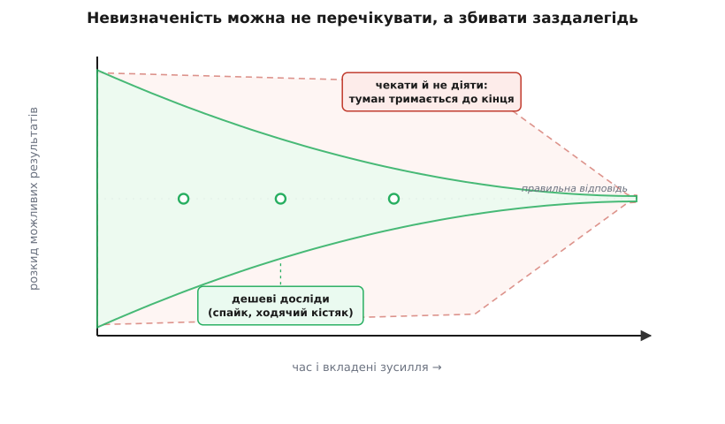

# Рішення під невизначеністю

<preknowlist>
- [Архітектурні драйвери](topic:sf-apps/architectural-drivers) — що саме змушує ухвалити рішення: ключові вимоги, обмеження, найризикованіші місця системи.
- [Зворотні й незворотні рішення](topic:sf-apps/reversible-irreversible-decisions) — головна вісь: скільки коштуватиме відкотити вибір, коли він виявиться хибним.
- [Прикидка «на серветці»](topic:sf-apps/back-of-envelope) — як за хвилину порахувати порядок величини (навантаження, обсяг даних, затримка), щоб звузити варіанти без вимірювань.
</preknowlist>

Уся інша дисципліна архітектора мовчазно припускає, що ти вже знаєш, яку систему будуєш. А ти не знаєш. У день, коли рішень найбільше й вони найважчі, про систему відомо найменше: вимоги ще пливуть, навантаження — здогад, а користувач ще не торкнувся жодного екрана. Ось у цьому й полягає справжня робота — не обрати правильно, коли все ясно (це вміє кожен), а діяти розумно, коли ясно якраз не буде. Невизначеність (лат. *in-* — не + *certus* — певний) тут не прикра завада на початку, яка згодом розсіється сама. Вона — постійний фон ремесла, і питання лише в тому, як із нею поводитися.

Природний інстинкт інженера — невизначеність **знімати**: не знаєш, яку базу брати, — обери зараз, закрий питання, живи спокійно. І це підводить рівно тому, що рішення, ухвалене найраніше, спирається на найгірші факти, які ти взагалі матимеш за весь проєкт. Ти закрив питання — приємно; і водночас прив'язав до здогаду код, схему, залежності — а це стане видно згодом, коли здогад не справдиться, і все, що на ньому стояло, доведеться зривати. Дорога переробка народжується не зі складності задачі, а з **нетерплячості**: рішення витратили раніше, ніж воно мусило бути ухвалене.

## Три звички, які не працюють

Перш ніж шукати правильний хід, варто назвати три хибні, бо саме в них найлегше зісковзнути.

Перша — **вгадати й забетонувати**. Обрати наосліп, продавити на всю систему, а тоді місяцями писати код на припущенні, якого ще ніхто не перевіряв. Коли туман розсіється й виявиться, що вгадали хибно, переробляти доведеться не рішення, а все, що на ньому виросло.

Друга, дзеркальна, — **аналітичний параліч** (гр. *análysis* — розкладання). Замість вирішувати — нескінченно збирати вимоги, малювати діаграми, зважувати варіанти, чекати на повноту знання, яка все не настає. Поки команда сперечається про ідеальний вибір, вікно можливості тихо зачиняється, а конкурент уже щось випустив.

Третя, найпідступніша, — **параліч у масці ретельності**. Зволікати не тому, що чекаєш на факти, а тому, що вирішувати страшно, — і прикривати це словами про обачність. Ззовні воно схоже на мудрість, а насправді це відкладена, не ухвалена робота, яка тим часом блокує все залежне.

Спільний корінь усіх трьох — ставлення до невизначеності як до **стану, який треба або проігнорувати, або перечекати**. А поводитися з нею треба інакше: як із величиною, яку **активно збивають**, доки її ще багато.

## Головний хід: збивати туман, а не терпіти його

Ось перевертання, на якому все тримається. Невизначеність — не погода, яку лишається пережити. Це те, що можна **зменшувати цілеспрямовано**, і кожен зменшений відсоток робить наступне рішення дешевшим і точнішим. Тому головна дія архітектора під невизначеністю — не «вибрати», а **дізнатися** дешевим способом до того, як робити вибір дорогим.

Класична картина цього — конус невизначеності (англ. *cone of uncertainty*). Уяви розкид можливих результатів у часі: на старті він широчезний (оцінка може промазати в рази), і сам собою звужується лише під кінець проєкту, коли вже й вирішувати нічого. Ідея бере початок ще в кошторисній інженерії (стандарт класифікації оцінок від засновників AACE, 1958), у софт її переніс Баррі Бем у «Software Engineering Economics» (1981), назвавши «лійкою» (*funnel curve*); теперішню назву «конус невизначеності» дав Стів Макконнелл у «Software Project Survival Guide» (1997). Бем виміряв річ, від якої холодніє: оцінки на самому старті проєкту промахуються приблизно **в чотири рази** в кожен бік. *(Це усталений, добре задокументований результат.)*

Але з конуса є неочевидний вихід, і саме він — суть ремесла. Ширину конуса **не обов'язково перечікувати** — її можна **втягнути рано** невеликими цілеспрямованими діями. Один вимірювальний дослід на живому — і десяток варіантів відпадає; один прототип, що не витримав навантаження, — і ціла гілка рішень закрита за день, а не за півроку.


*Якщо просто чекати, туман тримається майже до кінця (червона зона) — знання приходить тоді, коли вирішувати вже пізно. Дешеві досліди (зелені позначки) втягують конус рано: певність зростає, поки рішення ще легко відкотити. Головне вміння — не вгадати крізь туман, а збити його заздалегідь.*

> 🔧 **Навіщо це.** Перед важким архітектурним рішенням спитай себе не «що обрати», а «який найдешевший дослід зніме тут найбільше невизначеності». Не знаєш, чи витримає обраний брокер черг очікуване навантаження? Не сперечайся тиждень — постав його під синтетичне навантаження на день і виміряй. Не певен, чи ляже доменна модель на реальні дані? Візьми справжній зразок і спробуй. Кожен такий крок коштує дні, а економить місяці переробок — і, головне, замінює чужу думку на факт.

## Три важелі, коли туман не збити повністю

Збити невизначеність дощенту вдається рідко: якісь факти проступлять лише в бою. Тоді працюють три важелі, і всі три — про те, щоб **вартість помилки була мала**, а не про те, щоб помилки не було.

**Перший важіль — зробити рішення зворотним.** Найпотужніше, що можна зробити з незворотним вибором, — це перетворити його на оборотний ще до того, як увійти. Заховати конкретну базу за вузьким інтерфейсом, обгорнути зовнішній сервіс адаптером, звузити те, що видно назовні. Тоді вибір, зроблений під туманом, перестає бути фатальним: помилився — переписав те, що за швом, а не всю систему. Це окрема велика тема — [зворотні й незворотні рішення](topic:sf-apps/reversible-irreversible-decisions): незворотність рідко буває властивістю самого рішення, частіше — властивістю того, **як** воно вплетене в систему, і плетиво можна змінити.

**Другий важіль — відкласти рішення до моменту кращих фактів.** Якщо вибір незворотний, а розширити його не виходить, лишається не входити в двері, поки можна цього не робити: що пізніше ухвалиш, то більше знань устигне накопичитися. Але «пізніше» — не «ніколи»: у кожного зволікання є тіньова ціна, що з часом росте, бо залежні шматки завмерли й чекають. Точку, де відкритість перестає окупатися, називають [останнім відповідальним моментом](topic:sf-apps/last-responsible-moment) — і чесне відкладання вимагає назвати, **яку саме невизначеність** ти чекаєш зняти й **яка подія** скаже, що момент настав. Без цих двох відповідей ти не відкладаєш, а прокрастинуєш.

**Третій важіль — купити знання дешевою ставкою.** Коли вирішувати треба вже, а туман не розсіявся, роблять не велике незворотне рішення на всю систему, а маленький зворотний крок — і дивляться, що вийде на живому.

## Дешева ставка замість здогаду

Цей третій важіль заслуговує окремого погляду, бо він і є практичне ядро всієї теми. Різниця між двома підходами — не в сміливості, а в **розмірі й зворотності ставки**.


*Наосліп велике рішення веде місяцями коду просто в стіну: помилку припущення видно аж наприкінці, коли переробляти найдорожче. Дешевий цикл ставок збиває невизначеність малими порціями — кожен оберт додає факт із живого, і рішення дозріває на реальних цифрах, а не на здогаді.*

Найпоширеніший інструмент такої ставки — **спайк** (англ. *spike* — забити наскрізь, як забивають цвях крізь колоду). Термін народився в екстремальному програмуванні: Ворд Каннінгем питав «яка найпростіша програма переконає нас, що ми на правильному шляху?», а Кент Бек назвав таку пробу спайком (уперше показали на OOPSLA 1997). *(Усталене авторство.)* Суть спайка — тонка наскрізна проба однієї конкретної небезпеки, навмисно одноразова: написав, дізнався правду, викинув. Він не мусить бути гарним чи повним — він мусить **зняти невизначеність** і померти. Родич спайка більшого масштабу — тонкий наскрізний зріз усієї системи, що вже працює від краю до краю, [ходячий кістяк (walking skeleton)](topic:sf-apps/walking-skeleton): він показує на живому, чи витримає обрана архітектура, поки з неї ще легко зійти.

За тією ж логікою — тримати не один варіант, а **множину живих варіантів** — працює й інженерна культура Toyota, яку описали в «The Second Toyota Paradox» (Аллен Ворд і співавтори, Sloan Management Review, 1995): конструктори свідомо ведуть кілька альтернатив паралельно й **відсікають гірші поступово**, у міру появи фактів, замість рано вчепитися в одну й ітеративно її латати. Парадокс у тому, що зволікання з вибором і «надлишок» прототипів дають кращі машини **швидше**. Той самий принцип працює і в софті: поки рішення дороге й туманне, дешевше тримати дві-три гілки відкритими й гасити їх фактами, ніж рано забетонувати одну.

Ось як «дешева ставка» виглядає в коді. Ти не певен, чи впорається обрана черга з очікуваним потоком, — тож не сперечаєшся, а робиш спайк: наганяєш синтетичне навантаження й дивишся, чи тримається затримка в межах бюджету.

**Умова: перевірити гіпотезу «брокер тримає 10 000 повідомлень/с при p99 < 50 мс», перш ніж будувати на ньому пів-системи.**

:::tabs
```cpp
// Спайк: одноразова проба ОДНІЄЇ небезпеки — пропускної здатності.
// Мета не «код у прод», а факт: витримує чи ні. Після заміру — викинути.
#include <cstdint>

struct SpikeResult {
    std::uint32_t target_rate;   // цільовий потік, повідомлень/с
    std::uint32_t observed_rate; // що показав замір під навантаженням
    double        observed_p99;  // 99-й перцентиль затримки, мс
};

// Пороги — з бюджету якісних атрибутів, а не «на око».
constexpr std::uint32_t RATE_BUDGET = 10000;   // менше — гіпотеза провалена
constexpr double        P99_BUDGET  = 50.0;    // більше — теж провал

bool hypothesis_holds(const SpikeResult &r) {
    return (r.observed_rate >= RATE_BUDGET)
        && (r.observed_p99  <= P99_BUDGET);
}

// Рішення керує не думка, а результат спайка:
void decide_broker(const SpikeResult &r) {
    if (hypothesis_holds(r))
        commit_broker();          // факт підтвердив — будуємо на ньому
    else
        reject_and_try_next(r);   // факт спростував — гілка закрита за день
}
```
```go
// Спайк: одноразова проба ОДНІЄЇ небезпеки — пропускної здатності.
// Мета не «код у прод», а факт: витримує чи ні. Після заміру — викинути.

type SpikeResult struct {
	TargetRate   uint32  // цільовий потік, повідомлень/с
	ObservedRate uint32  // що показав замір під навантаженням
	ObservedP99  float64 // 99-й перцентиль затримки, мс
}

// Пороги — з бюджету якісних атрибутів, а не «на око».
const (
	RateBudget uint32  = 10000 // менше — гіпотеза провалена
	P99Budget  float64 = 50.0  // більше — теж провал
)

func hypothesisHolds(r SpikeResult) bool {
	return r.ObservedRate >= RateBudget &&
		r.ObservedP99 <= P99Budget
}

// Рішення керує не думка, а результат спайка:
func decideBroker(r SpikeResult) {
	if hypothesisHolds(r) {
		commitBroker() // факт підтвердив — будуємо на ньому
	} else {
		rejectAndTryNext(r) // факт спростував — гілка закрита за день
	}
}
```
:::

Суть коду не в конкретних порогах — вони в кожного проєкту свої, і беруться з бюджету якісних атрибутів. Суть у тому, що вибір брокера перестав бути ставкою на чуття й став **наслідком заміру**: гіпотезу або підтвердив факт із живого, або факт її закрив — і то за день, а не за квартал переробок.

## Записати ставку, а не лишити в голові

Рішення під невизначеністю має одну особливість, про яку легко забути: воно ухвалене **на неповних фактах і з відомим ризиком**. Через рік, коли туман розсіється, хтось — можливо, ти сам — дивитиметься на цей вибір і не розумітиме, чому так. Тому таке рішення не лишають у чиїйсь пам'яті: його записують разом із причиною, розглянутими альтернативами, ціною відкату та — головне — **тим припущенням, на якому воно стоїть**. Стандартна форма такого запису — [журнал архітектурних рішень (ADR)](topic:sf-apps/architecture-decision-records): короткий документ на одне рішення, що фіксує контекст, вибір і наслідки.

А кожна відкладена ставка й кожне непевне припущення — це, по суті, ризик, і ним теж треба керувати явно, а не сподіватися, що «якось буде». Здоровий спосіб не загубити такі відкладені рішення — вести їх у [ризик-реєстрі](topic:sf-apps/risk-register) поряд із умовою, за якою кожне з них треба закрити. Ширше вміння дивитися на туман як на набір іменованих, оцінених ризиків, а не суцільну тривогу, — це [ризик-мислення](topic:sf-apps/risk-thinking): назвати найнебезпечніше, оцінити ймовірність і наслідок, і бити спайком саме туди, де болітиме найдужче.

## Де це ламається

Головна пастка — перетворити всю цю дисципліну на **виправдання нічого не робити**. «Ми діємо під невизначеністю, тому не вирішуємо» — так само підробка, як «ми дотримуємось LRM», сказане тим, хто просто боїться. Чесний хід під невизначеністю завжди **активний**: або ти збиваєш туман дослідом, або робиш рішення зворотним, або відкладаєш його з названим тригером — але ти щоразу щось **робиш**, а не завмираєш.

Друга межа — не кожна невизначеність варта спайка. Досліди й шви теж коштують часу, тож збивати туман усюди підряд — це той самий параліч, лише в машкарі активності. Зусилля йдуть туди, де сходяться дві умови: рішення **дороге до відкату** й **справді туманне**. Де вибір зворотний і так — його дешевше просто зробити будь-як розумно й виправити потім; де невизначеності насправді немає — досліджувати нічого.

Тож ціле ремесло зводиться до кількох питань, поставлених **перед** рішенням, а не після. Наскільки дорого це відкотити? Дешево — вирішуй зараз і рухайся. Дорого — чи можна зробити зворотним? Можна — зроби й вирішуй сміливо. Не можна — який найдешевший дослід зніме тут найбільше туману, і яка подія скаже, що зволікати далі вже небезпечно? Відповів на всі — ти не вгадуєш крізь морок і не завмираєш перед ним. Ти робиш невизначеність дешевою: збиваєш її фактами, поки вона ще коштує мало, і ухвалюєш рішення тоді й так, щоб помилка, якщо вона буде, лишилася виправною.
