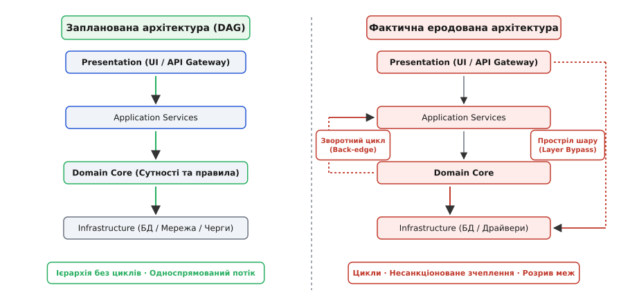
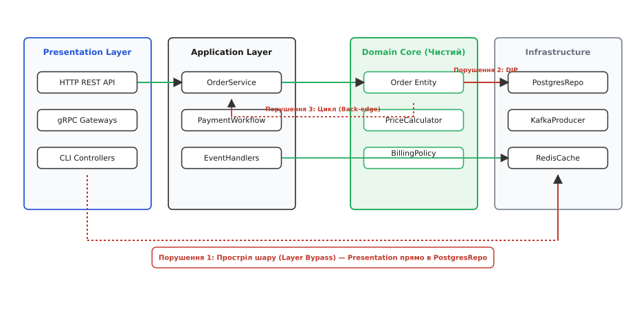
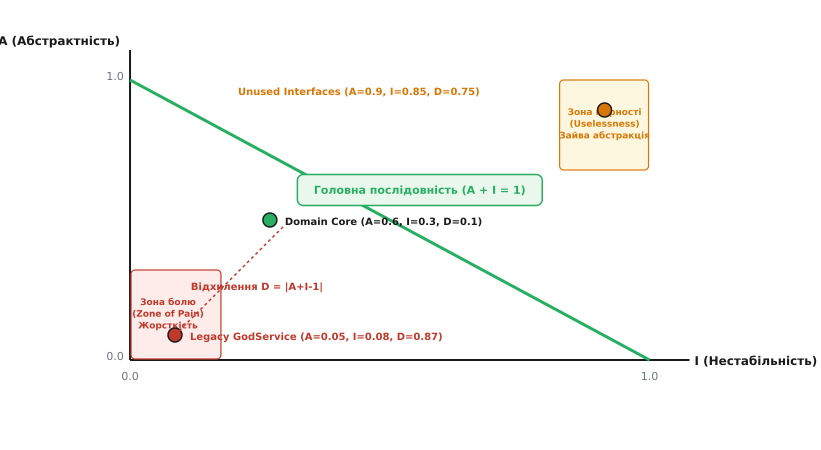
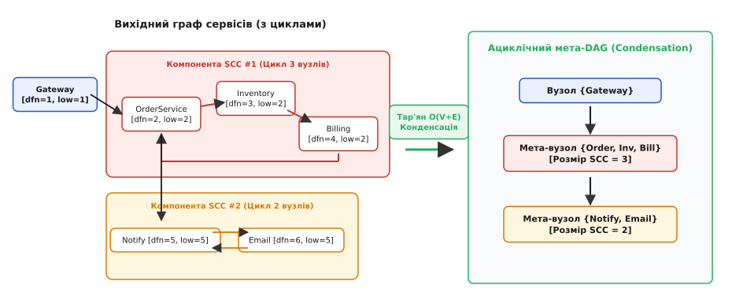
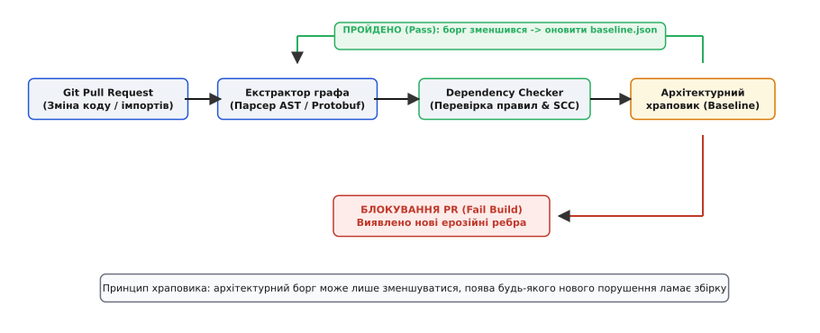

# Аналіз ерозії архітектури: граф залежностей

<preknowlist>
- [Зчеплення і зв'язність](root:sf-apps/coupling-cohesion) — міра залежності між модулями та внутрішньої цілісності компонента.
- [Шарова архітектура](root:sf-apps/layered-architecture) — поділ системи на ізольовані горизонтальні рівні з односпрямованим потоком керування.
- [Принцип інверсії залежностей (DIP)](root:sf-apps/dependency-inversion) — високорівневі модулі не повинні залежати від низькорівневих; обидва залежать від абстракцій.
- [Технічний борг і вартість зміни](root:sf-apps/technical-debt) — накопичення компромісних інженерних рішень та їхня ціна у підтримці.
- [Обходи графів DFS та BFS](root:sf-algorithms/depth-first-search) — фундаментальні алгоритми пошуку шляхів, дерев обходу та зворотних ребер.
- [Представлення графів](root:sf-algorithms/graph-representation) — списки суміжності та матриці для моделювання зв'язків.
</preknowlist>

Команда з сорока інженерів розробляє платформу електронної комерції. Початковий дизайн системи виглядав бездоганно: п'ять чітко розмежованих доменних сервісів — `Orders`, `Billing`, `Inventory`, `Shipping` та `Auth` — взаємодіяли через задекларовані клієнтські інтерфейси, утворюючи чистий ациклічний граф. Кожен сервіс всередині підпорядковувався класичній тришаровій ієрархії: HTTP-контролери зверталися до сервісів бізнес-логіки, а ті — до чистого доменного ядра, повністю ізольованого від бази даних.

Через півтора року інтенсивних релізів під час планового нічного перезапуску кластера трапляється катастрофа: жоден сервіс не може пройти перевірку готовності (readiness probe). `Orders` очікує на відповідь від `Inventory`, щоб завантажити стан складських залишків; `Inventory` під час ініціалізації звертається до `Billing` для перевірки лімітів контрагента; `Billing` надсилає запит до `Shipping` для розрахунку регіональних тарифів, а `Shipping` блокується на виклику `Orders` для отримання метаданих посилок. 

Утворилося замкнене кільце взаємних блокувань: `Orders → Inventory → Billing → Shipping → Orders`. Система не здатна здійснити «холодний старт» без ручного втручання в базу даних.

Коли інженери витягли повний граф імпортів і викликів кодової бази, виявилося, що первинна архітектура існує лише в застарілій документації. Реальний код містив 87 циклічних залежностей між модулями, 420 випадків прямого доступу UI-контролерів до таблиць бази даних в обхід бізнес-правил і сотні несанкціонованих міжсервісних викликів. Будь-яка зміна структури таблиці в модулі `Billing` ламала компіляцію або викликала збої в семи інших підсистемах.

Це явище має строгу інженерну назву: **архітектурна ерозія** (англ. *architectural erosion*, від лат. *erodere* — «роз'їдати, виточувати») або **архітектурний дрейф** (англ. *architectural drift*). Це невідворотний процес деградації структури зв'язків програмної системи, за якого фактична реалізація відхиляється від запланованої архітектури ([як формувалися дослідження старіння ПЗ від Девіда Парнаса до сучасних фітнес-функцій](root:sf-apps/dependency-graph-checker/hist-architecture-drift-origins.md)). Виникає фундаментальне інженерне завдання: **як автоматично вимірювати, виявляти та блокувати ерозію архітектури на рівні графа залежностей ще до потрапляння коду в головну гілку репозиторію?**

## Графова модель системи: вершини, ребра та інваріанти

Щоб керувати структурою системи математично, код і топологію зв'язку формалізують у вигляді орієнтованого графа `G = (V, E)`:
- **Множина вершин `V`:** архітектурні одиниці декомпозиції. Залежно від масштабу аналізу вершиною може бути окремий клас, файл вихідного коду, пакет/простір імен, ізольований шар або цілий мікросервіс;
- **Множина орієнтованих ребер `E`:** факт наявності зв'язку між вузлами. Ребро `(u, v) ∈ E` означає, що компонент `u` залежить від компонента `v` (імпортує його класи, викликає публічні чи приватні функції, надсилає мережеві RPC/HTTP-повідомлення чи звертається до спільної структури в пам'яті).


*Порівняння запланованої та фактичної архітектури: початковий чистий ациклічний граф (DAG) під дією неконтрольованих модифікацій перетворюється на щільну мережу циклів і прострілів ізоляції.*

У стійкій інженерній архітектурі граф залежностей зобов'язаний підтримувати три обов'язкові інваріанти:

1. **Ациклічність (Acyclicity):** Граф модулів або сервісів верхнього рівня зобов'язаний бути орієнтованим ациклічним графом (англ. *Directed Acyclic Graph*, DAG). Наявність циклу `u → ... → v → u` означає, що вузли неможливо скомпілювати, протестувати або розгорнути окремо — вони перетворюються на розподілений моноліт;
2. **Шарова ієрархія (Stratification):** Кожному вузлу `u ∈ V` присвоюється рівень ієрархії `λ(u) ∈ {0, 1, ..., K}`. Дозволені залежності спрямовані виключно від вищих шарів до нижчих (`λ(u) ≥ λ(v)`);
3. **Ізоляція меж контексту (Encapsulation):** Для кожного модуля чи сервісу чітко декларується підмножина публічних інтерфейсів `I_pub ⊂ V`. Зовнішні клієнти мають право створювати ребра `(client, v)` лише за умови `v ∈ I_pub`. Будь-яке пряме звернення до внутрішніх приватних реалізацій є архітектурним зломом межі.

## Анатомія порушень: класи ерозійних аномалій

Ерозія ніколи не виникає миттєво. Вона накопичується серією дрібних інженерних компромісів під час «гасіння пожеж» і термінових доробок. Усі ерозійні дефекти поділяються на чотири типові класи:


*Типові анатомічні порушення шарової дисципліни: обхід доменного ядра прямо в базу даних, порушення інверсії залежностей та зворотні цикли між шарами.*

### 1. Циклічне зчеплення (Cyclic Tangling)
Два або більше модулів посилаються один на одного безпосередньо чи через ланцюжок посередників.
- *Механізм руйнування:* Якщо модуль `A` залежить від `B`, а `B` залежить від `A`, то зміна сигнатури функції в `B` змушує змінювати `A`, що в свою чергу вимагає оновлення `B`. Компілятор вимагає одночасної збірки обох компонентів; збирач сміття або лічильник посилань не може звільнити ресурси; у розподілених системах виникають циклічні дедлоки ініціалізації.

### 2. Простріл шару (Layer Skipping / Bypass)
Компонент високого рівня (наприклад, HTTP-контролер або API Gateway) звертається безпосередньо до низькорівневої інфраструктури (SQL-репозиторію, черги повідомлень, мережевого сокета), оминаючи проміжний шар бізнес-логіки та валідації.
- *Механізм руйнування:* Бізнес-правила (інваріанти замовлення, перевірка прав доступу, валідація цін) виявляються продубльованими або проігнорованими. Зміна схеми реляційної таблиці змушує переписувати контролери представлення, руйнуючи модульність.

### 3. Зворотна залежність (Layer Inversion / DIP Violation)
Низькорівневий або внутрішній модуль знає про конкретні деталі зовнішнього або високорівневого оточення. Наприклад, сутність `Order` у чистому доменному ядрі імпортує клієнт `PostgresDriver` чи HTTP-пакет веб-фреймворку.
- *Механізм руйнування:* Доменний код більше не можна запустити у відриві від конкретної бази даних чи веб-сервера. Написання швидких модульних тестів стає неможливим без підняття важкої інфраструктури.

### 4. Протікання контексту (Context Boundary Leakage)
Модуль одного бізнес-контексту (наприклад, `Inventory`) безпосередньо читає внутрішні службові структури іншого контексту (`Billing`), замість використання офіційного контракту (API, черги подій чи DTO).
- *Механізм руйнування:* Внутрішній рефакторинг сервісу `Billing` ламає працездатність сервісу `Inventory`, оскільки приватні деталі реалізації стали неявним зовнішнім контрактом.

## Математичний апарат і метрики стабільності Роберта Мартіна

Щоб оцінити стан графа залежностей кількісно, застосовують апарат матричного аналізу та метрики зчеплення Роберта Мартіна ([математичне доведення інваріантів графа, теореми Тар'яна та метрик заплутаності](root:sf-apps/dependency-graph-checker/math-dependency-metrics-and-scc.md)).

Для кожного пакета чи модуля `u ∈ V` обчислюються такі величини:
- **Аферентне зчеплення `C_a` (вхідний напівстепінь):** кількість зовнішніх модулів, які залежать від `u`;
- **Еферентне зчеплення `C_e` (вихідний напівстепінь):** кількість зовнішніх модулів, від яких залежить `u`.

На основі `C_a` та `C_e` виводиться **коефіцієнт нестабільності** `I`:

```
I = C_e / (C_a + C_e)
```

Діапазон значення `I ∈ [0, 1]`:
- `I = 0` (максимально стабільний модуль): ні від кого не залежить (`C_e = 0`), але багато хто залежить від нього (`C_a > 0`). Такий модуль дуже важко змінювати, оскільки будь-яка зміна сигнатури зачіпає всіх клієнтів;
- `I = 1` (максимально нестабільний / гнучкий модуль): залежить від багатьох (`C_e > 0`), але від нього не залежить ніхто (`C_a = 0`). Модуль легко переписати з нуля без ризику для решти системи.

Другий показник — **абстрактність** `A`: частка абстрактних типів (інтерфейсів, протоколів) `N_a` до загальної кількості типів `N_c` у модулі:

```
A = N_a / N_c
```

### Головна послідовність та виявлення дефектних зон

Згідно з принципом стабільних залежностей, модуль повинен бути настільки ж абстрактним, наскільки він стабільний. Ідеальний баланс задається рівнянням Головної послідовності:

```
A + I = 1
```


*Баланс стабільності та абстрактності: відхилення D від Головної послідовності показує ступінь крихкості та заплутаності кожного модуля.*

Відхилення модуля від ідеальної прямої вимірюється нормованою відстанню `D`:

```
D = |A + I - 1|
```

Якщо `D → 1`, модуль потрапляє в одну з двох критичних аномальних зон:
- **Зона болю (Zone of Pain, `A ≈ 0, I ≈ 0`):** модуль надзвичайно конкретний (немає інтерфейсів), але від нього залежить уся система. Будь-яка зміна в ньому вимагає тижнів регресійного тестування. Це типовий симптом еродованого монолітного коду;
- **Зона марності (Zone of Uselessness, `A ≈ 1, I ≈ 1`):** модуль містить безліч абстрактних інтерфейсів, але від нього ніхто не залежить. Це наслідок передчасної або непотрібної інженерної складності (Dead Abstraction Bloat).

## Алгоритми виявлення ерозії: сильні компоненти зв'язності та правила-предикати

Для практичного аудиту репозиторію граф залежностей аналізується двома взаємодоповнюючими алгоритмами:

### 1. Пошук циклів через алгоритм Тар'яна (SCC)

Наївний пошук циклів через звичайний DFS для кожної вершини має квадратичну складність `O(|V| · (|V| + |E|))`, що неприйнятно для великих кодових баз із десятками тисяч файлів.

Алгоритм Роберта Тар'яна обчислює всі сильно зв'язані компоненти за лінійний час `O(|V| + |E|)` за один прохід пошуку в глибину. Він використовує стек активних вузлів та два індекси для кожної вершини: `dfn` (час першого входу) та `lowlink` (найменший `dfn`, досяжний з піддерева).


*Декомпозиція еродованого графа сервісів: алгоритм Тар'яна знаходить сильно зв'язані компоненти за лінійний час O(|V| + |E|) і згортає цикли в мета-вузли конденсації.*

Коли алгоритм Тар'яна виявляє компоненту з розміром `|SCC| > 1`, він ідентифікує точну замкнену групу модулів, що спричиняють взаємне зчеплення. Після згортання кожної такої компоненти в єдиний мета-вузол утворюється сконденсований граф, гарантовано вільний від циклів (мета-DAG).

### 2. Валідація предикатів на ребрах графа

Для кожного орієнтованого ребра `(u, v) ∈ E` рушій перевіряє набір логічних правил-предикатів:

```
Predicate_Layering(u, v):
  якщо Layer(u) < Layer(v) → ВІДХИЛИТИ ("Зворотний виклик: шар u не може залежати від вищого шару v")

Predicate_Encapsulation(u, v):
  якщо Context(u) ≠ Context(v) І v ∉ PublicAPI(Context(v)) → ВІДХИЛИТИ ("Несанкціонований доступ до приватного символу")
```

Повна програмна реалізація графового чекера, що поєднує алгоритм Тар'яна та перевірку шарових правил, доступна у проєктній вставці ([повна реалізація графового чекера мовами C та C++](root:sf-apps/dependency-graph-checker/proj-graph-checker-engine.md)). Конкретні формати правил і правила конфігурації стандартизовані у специфікації ([специфікація мови правил та конфігурації аналізатора](root:sf-apps/dependency-graph-checker/api-checker-rule-spec.md)).

## Вбудовування в CI/CD: Храповик архітектурного боргу (Baseline Ratchet)

Коли інструмент аналізу графа залежностей вперше запускають на старому проєкті, він майже завжди знаходить сотні чи тисячі існуючих порушень. Якщо налаштувати збірку так, щоб вона ламалася за наявності хоча б одного дефекту, команда опиниться перед вибором: або зупинити розробку продукту на місяці для повного рефакторингу, або просто вимкнути архітектурний чекер.

Щоб вирішити цю дилему, застосовують **архітектурний храповик** (англ. *architectural baseline ratchet*).


*Автоматизований контроль архітектурних інваріантів у CI: механізм храповика дозволяє поступово виправляти старий технічний борг, безкомпромісно блокуючи будь-які нові порушення.*

### Механіка роботи храповика:

1. **Зняття базового знімка (Baseline Snapshot):** Під час підключення аналізатора всі наявні в коді порушення скануються і зберігаються у спеціальний файл `.arch-baseline.json` разом із хешами файлів і рядків. Цей файл фіксує поточний технічний борг;
2. **Перевірка в Pull Request:** Коли розробник створює pull request, чекер будує новий граф залежностей і порівнює список знайдених порушень із файлом `baseline`:
   ```
   Нові_порушення = Порушення(PR) \ Порушення(Baseline)
   ```
   - Якщо `|Нові_порушення| > 0`: збірка негайно **падає з помилкою** (PR блокується). Розробник зобов'язаний усунути нове ерозійне ребро (наприклад, застосувати інверсію залежностей або винести спільний інтерфейс);
   - Якщо `|Нові_порушення| == 0`: збірка проходить успішно;
3. **Храповий механізм (Односторонній рух):** Якщо розробник у своєму PR випадково або навмисно виправив одне зі старих порушень, файл `baseline` автоматично оновлюється на меншу кількість дозволених помилок. Повернути це порушення назад у майбутньому вже не дозволить жоден наступний білд.

Завдяки храповику архітектурний борг гарантовано ніколи не зростає, а лише монотонно спадає з кожним спринтом.

> 🔧 **Навіщо це.**
> У великих інженерних організаціях архітектурна ерозія є головною причиною раптового уповільнення темпів розробки (Feature Delivery Velocity). Коли граф модулів заплутується, час компіляції зростає у 5–10 разів через необхідність перезбірки всього дерева залежностей, а будь-яка правка в домені провокує лавину збоїв у несподіваних сервісах. Автоматичний чекер графа залежностей у CI замінює суб'єктивні суперечки на код-рев'ю математично точним автоматичним гейтом: неможливо внести циклічну залежність або зламати ізоляцію шару, оскільки комп'ютер просто відхилить такий комбіт.
