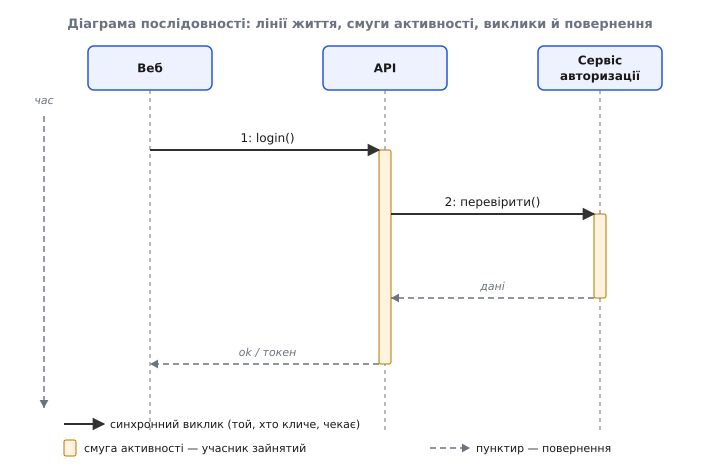
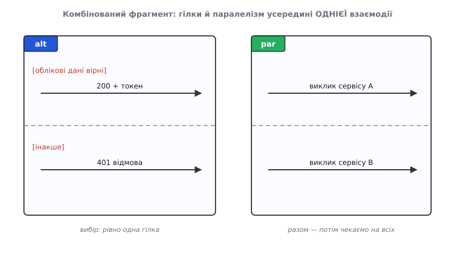
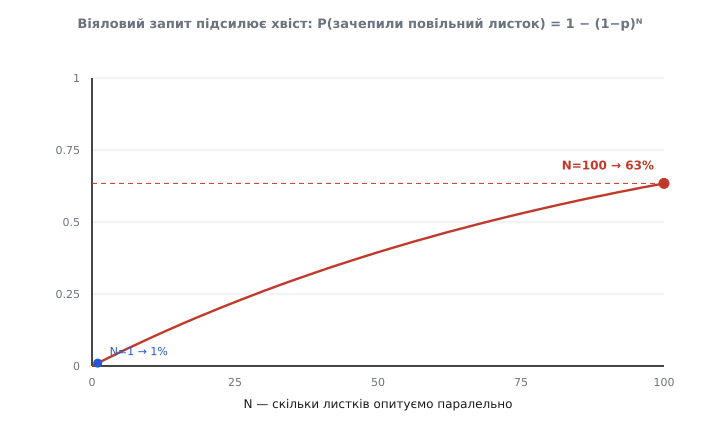
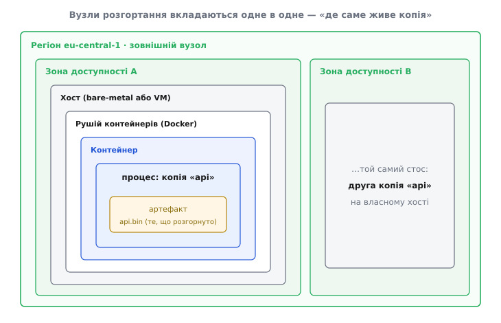
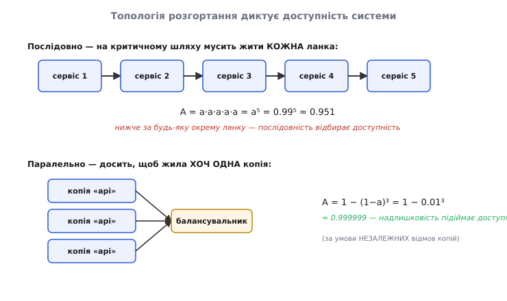

# В'ю розгортання і динамічні в'ю

<preknowlist>
- [Архітектурні в'ю](topic:sf-apps/architecture-views) — навіщо систему описують кількома окремими діаграмами, кожну під свою турботу, а не однією на все.
- [C4](topic:sf-apps/c4-model) — чотири рівні статичної будови (контекст, контейнери, компоненти, код); що таке «контейнер» як одиниця розгортання й виконання.
- [Якісні атрибути («-ilities»)](topic:sf-apps/quality-attributes) — властивості поза функціями (доступність, продуктивність, вартість), заради яких і множать копії та розводять їх по вузлах.
</preknowlist>

Статична діаграма — контейнери й лінії між ними — відповідає рівно на одне питання: **з чого** система складається. І робить це чесно. Але два інші питання вона не просто «не показує» — вона на них **структурно не здатна** відповісти, і саме тому їх мусять закривати окремі діаграми, а не примітка збоку. Перше питання: **коли й у якому порядку** частини діють, виконуючи конкретну справу. Друге: **де насправді й у скількох копіях** вони працюють. Обидва — не примхи оформлення; на них найчастіше й ламаються реальні системи, бо саме тут живуть затримка, доступність і рахунок за інфраструктуру.

Варто побачити, **чому** статика тут безсила, а не просто прийняти це на віру. Статична стрілка «A ↔ B» — це **відношення суміжності**: вона каже «A і B взагалі можуть говорити». Відношення не має ні порядку (хто перший), ні кратності в часі (скільки разів), ні кратності в просторі (скільки копій кожного). Це — граф: вершини-контейнери й ребра-зв'язки. Щоб виразити порядок, потрібен інший математичний об'єкт поверх **тих самих вершин** — **упорядкований прохід** по ребрах, слід виконання. Щоб виразити розміщення — ще один об'єкт поверх тих самих вершин: **відображення** контейнерів на дерево фізичних місць. Дві доповняльні (supplementary) діаграми — це рівно ці два об'єкти. **Динамічний в'ю** додає вісь **часу**, **в'ю розгортання** — вісь **простору**. Жодна не вигадує нових частин: обидві беруть контейнери зі статики й домальовують вимір, якого тій статиці бракує за самою її природою.

## Динамічний в'ю: чому статична стрілка не знає порядку

Візьміть звичайну схему логіну: веб-застосунок, API, сервіс авторизації, база. Стрілки кажуть, **хто з ким пов'язаний**. Вони не кажуть, хто озветься **першим**, скільки кроків підряд станеться до відповіді, і що впаде, якщо третій крок мовчатиме. А саме ці три речі визначають, чи буде вхід швидким, і де його зшивати таймаутами.

Причина мовчання — та сама «суміжність без порядку». Ребро «API ↔ авторизація» однакове і для «API кличе авторизацію», і для зворотного напрямку, і для обміну в обидва боки: воно фіксує **можливість** розмови, а не її **перебіг**. Перебіг — це послідовність подій, розкладена в часі; щоб її показати, стрілки мають нести **порядок**. Це і є **динамічний в'ю** (dynamic view): обрати **один сценарій** — логін, оформлення замовлення, обробку платежу — і показати, як наявні частини співпрацюють у часі, крок за кроком, щоб його виконати.

### Механіка діаграми послідовності

Найпоширеніша форма динамічного в'ю — **діаграма послідовності** (sequence diagram). Її механіка проста, але кожен елемент несе точний зміст, і варто розібрати їх по одному, бо саме з них читається поведінка.

**Лінія життя** (lifeline) — вертикальна пунктирна лінія під кожним учасником. Учасник тут — не абстрактний «об'єкт», а **знайома коробка статичної моделі** (контейнер чи компонент). Вертикаль — це **вісь часу**, строго згори вниз: що нижче, те пізніше. Уже сам цей вибір — час на вертикалі — робить видимою довжину сценарію: довгий ланцюг **фізично** довгий на діаграмі.

**Повідомлення** (message) — горизонтальна стрілка від однієї лінії життя до іншої на певній висоті, тобто в певний момент. Її напрямок — хто ініціює, її висота — коли. І тут з'являється перша по-справжньому важлива відмінність — **синхронний проти асинхронного** виклику:

- **Синхронний виклик** (закрита, залита стрілка) означає «кличу й **чекаю** на відповідь». Той, хто покликав, **блокується**: він нічого не робить, доки не повернеться результат. На діаграмі це видно як **смуга активності** (activation, або execution occurrence) — вузький прямокутник уздовж лінії життя, що триває від виклику до **повернення** (return), яке малюють пунктирною стрілкою назад.
- **Асинхронний виклик** (відкрита, «пташка» стрілка) означає «надсилаю й **йду далі**». Ніхто не чекає; повернення може не бути зовсім (подія, сигнал), або прийти колись пізніше окремим повідомленням.

Різниця між ними — не оформлення, а **дві різні архітектурні рішення**, закодовані нахилом однієї стрілки. Синхронний ланцюг **накопичує затримку** (кожне «чекаю» додається до попереднього) і **зчіплює учасників у часі** (поки авторизація думає, API стоїть). Асинхронний виклик цей зв'язок **розриває**: відправлення листа не гальмує логін, бо ніхто на нього не чекає, — але натомість з'являється нове питання «а хто ж і коли забере результат, і що, якщо він не прийде».



*Механіка діаграми послідовності: учасники — коробки статичної моделі, час іде вниз, суцільна стрілка кличе й блокує, пунктир повертає, а смуга активності показує проміжок, поки учасник зайнятий обробкою виклику.*

Є ще кілька дрібніших елементів, які варто впізнавати. **Самовиклик** (self-message) — стрілка учасника до себе (внутрішній крок, рекурсія); на його лінії життя з'являється вкладена смуга активності поверх наявної — «зайнятий усередині зайнятого». **Створення й знищення** учасника — пунктирна стрілка до коробки, що з'являється **посеред** діаграми (об'єкт народжується під час сценарію), і хрестик «×» унизу лінії життя, де учасник припиняє існувати. Ці елементи потрібні там, де сценарій сам породжує чи закриває учасників (сесію, з'єднання, транзакцію).

> 🔧 **Навіщо це.** Нахил стрілки — це рішення про затримку й зчеплення, яке легко проґавити в коді, але видно на діаграмі. Намалювали логін синхронними викликами й побачили: сім блокувальних кроків стоять один за одним, кожен додає свій «чекаю» — ось звідки повільний вхід. Замінили запис у журнал аудиту й надсилання листа на **асинхронні** — і ці два кроки випали з часу відповіді користувачеві, бо ніхто на них уже не чекає. Одна діаграма зробила видимим те, що інакше знайшлося б лише під навантаженням у проді.

### Розгалуження, цикли, паралелізм: комбіновані фрагменти

Наївна діаграма послідовності показує **один слід** — щасливий шлях, де все вдалося. Реальність не така: логін то вдається, то ні; запит до сервісу **повторюють** кілька разів, поки не відповість; десяток викликів пускають **одночасно**. Показати це прямими стрілками неможливо — вони знають лише «одне за одним». Тому велика ревізія **UML 2.0 (2005)** ввела **комбіновані фрагменти** (combined fragments): рамку навколо частини діаграми з **оператором взаємодії** (interaction operator) у кутовому ярлику, що задає, як читати вміст. *(Усталений факт: комбіновані фрагменти — нововведення UML 2.0.)* Ця ідея прийшла не з порожнечі — її корені в **картах послідовностей повідомлень** зі світу телекому, про що варто сказати окремо. [Звідки взялися ці діаграми](topic:sf-apps/deployment-view/hist-interaction-diagrams.md) — окрема історія: карти MSC зі стандарту ITU-T Z.120, спадок Якобсонових діаграм взаємодії, об'єднання трьох методологів у UML і ревізія 2.0.

Головні оператори, які варто знати:

- **alt** (від *alternatives*) — **взаємно виключні гілки**. Рамку ділять пунктиром на відсіки-операнди, кожен зі своєю **вартовою умовою** `[умова]`; виконається рівно один. Це «якщо-інакше» динамічного в'ю: `[облікові дані вірні]` → видати токен; `[інакше]` → відмова 401.
- **opt** (від *optional*) — **один необов'язковий** операнд під умовою: або стається, або ні. Це «якщо» без «інакше».
- **loop** — **повторення**: `loop(min,max)` або `loop [поки умова]`. Так малюють ретраї, опитування, обробку колекції.
- **par** (від *parallel*) — операнди йдуть **одночасно** (їхні події можуть чергуватися будь-як). Це той оператор, що робить видимим **віяловий** запит — розсилку багатьом і збір відповідей.
- **break** — **аварійний вихід** із зовнішньої взаємодії (гілка помилки, що обриває сценарій).
- **ref** (від *reference*) — **посилання** на іншу взаємодію, щоб не малювати те саме двічі й тримати діаграми малими.



*Комбінований фрагмент вкладає розгалуження й паралелізм в одну діаграму: «alt» — рівно одна з гілок за вартовою умовою; «par» — обидва операнди разом, а далі точка збору («чекаємо на всіх»). Так один малюнок несе цілий протокол, а не лише щасливий шлях.*

Практична сила тут у тому, що **одна** діаграма тепер несе не один слід, а **цілий протокол** — з гілками помилок, повторами й паралелізмом. Без фрагментів довелося б малювати окрему діаграму на кожну комбінацію умов, і їх стало б безліч. З ними складна взаємодія лишається читабельною на одному аркуші. А оператор `par` веде нас прямо до найцікавішого кількісного ефекту динамічного в'ю — але спершу варто розібратися з другою формою, бо вона показує ту саму взаємодію під іншим кутом.

### Послідовність проти комунікації: та сама взаємодія, різний наголос

UML має **дві** споріднені форми для однієї взаємодії, і вибір між ними — це вибір, **що саме ти хочеш побачити**.

**Діаграма послідовності** кладе час на вертикаль. Наслідок: **порядок і затримка** стрибають в очі — довгий серійний ланцюг **фізично** тягнеться вниз, і його довжина є прямою метафорою його часу. Натомість **топологія** (хто з ким узагалі говорить) розсіяна: щоб побачити, що всі кличуть один центральний сервіс, треба поглядом зібрати стрілки з різних висот.

**Комунікаційна діаграма** (communication diagram; у ранньому UML — collaboration diagram, діаграма співпраці) розкладає учасників **вільно по площині**, як на карті, а порядок несуть **номери** на стрілках. І номери тут не пласкі, а **вкладені десятковим чином** (1, 1.1, 1.1.1, 2 …): номер `2.1` означає «перший підвиклик, породжений кроком 2». Ця десяткова нумерація кодує **вкладеність викликів** — рівно те, що діаграма послідовності показує стосом смуг активності. Тобто це та сама інформація, лише перенесена з висоти на номер. Наслідок вільного розкладу: **топологія** стрибає в очі. Вузол, до якого сходиться багато стрілок, видно миттєво — а це майже завжди **вузьке місце** або «бог-сервіс», від якого залежать усі. Порядок же доводиться відновлювати, читаючи номери.

Звідси проста настанова вибору. Сценарій — довгий **серійний ланцюг**, і болить **затримка** → бери послідовність (вертикаль сама розкаже історію часу). Підозра на **зчеплення чи вузьке місце** → бери комунікаційну (збіг стрілок у вузлі викриє винуватця). Динамічний в'ю в дусі [C4](topic:sf-apps/c4-model) ближчий до комунікаційної форми — вільний розклад плюс номери, — бо C4 прямо описує свою динамічну діаграму як засновану на UML-комунікаційній. *(Усталений факт.)*

### Worked-приклад: ланцюг викликів і посилення хвоста

Динамічний в'ю — не картинка для звіту; його **форма** (довжина ланцюга, ширина віяла) **і є** модель затримки. Покажемо це числами.

**Умова.** Логін проходить синхронним ланцюгом: веб → API → авторизація → база, і відповідь тим самим шляхом назад. Кожен «стрибок» (hop) коштує мережевого часу плюс обробки. Порахуймо затримку ланцюга й побачмо, чому вона така.

```
затримка одного стрибка ≈ мережа (туди-назад у ЦОД) + обробка сервісу
                        ≈ 0.5 мс + 2 мс = 2.5 мс

синхронний ланцюг = сума стрибків (кожен ЧЕКАЄ на попередній):
  T(логін) ≈ 4 стрибки · 2.5 мс = 10 мс     // лише координація, без корисної роботи
```

**Висновок першої частини.** Синхронний ланцюг **додає** затримки: він швидкий рівно настільки, наскільки мала **сума** його стрибків. Динамічний в'ю дозволяє цю суму **порахувати**, бо показує і порядок, і кількість кроків. Подвойте довжину ланцюга — подвоїте координаційну затримку, не написавши жодного рядка нової логіки.

Але серійна сума — це ще лагідний випадок. Значно підступніший ефект вилазить, коли крок віялить — коли `par`-фрагмент розсилає запит **багатьом** листкам і чекає на **всіх** (типово для пошуку, стрічки, збірки сторінки з десятків сервісів). Тут спрацьовує **посилення хвоста** (tail amplification), уперше чітко описане в праці **«The Tail at Scale»** (Джеффрі Дін і Луїс Андре Барросо, *Communications of the ACM*, 2013). *(Усталений факт.)*

**Умова.** Один листок відповідає зазвичай за 10 мс, але його 99-й процентиль — 1 секунда: тобто **один запит зі ста** до листка «повільний» (≥ 1 с). Ймовірність повільного листка `p = 0.01`. Питання: якщо батьківський запит **віялить на N листків** і мусить дочекатися **всіх**, з якою ймовірністю **весь** запит буде повільним?

```
весь запит швидкий ⟺ УСІ N листків швидкі
  P(усі швидкі)     = (1 − p)^N            // незалежні листки
  P(хоч один повільний) = 1 − (1 − p)^N

p = 0.01:
  N = 1   →  1 − 0.99      = 0.010   =  1%
  N = 10  →  1 − 0.99¹⁰    ≈ 0.096   ≈ 10%
  N = 100 →  1 − 0.99¹⁰⁰   ≈ 0.634   ≈ 63%
```

**Висновок.** Рідкісний «хвіст» одного виклику (1%) при віялі на сотню перетворюється на **звичайну долю** запиту: 63% усіх запитів чіпають бодай один повільний листок і тому самі стають повільними. Те, що для одного виклику було винятком, на масштабі стає **правилом**. Ось чому `par`-фрагмент із широким віялом на динамічній діаграмі — це червоний прапорець, вартий того, щоб його намалювати: **ширина віяла N** є множником хвоста, і його видно ще на папері.



*Ймовірність, що віяловий запит зачепив повільний листок, як функція ширини віяла N. Одна повільна відповідь зі ста (p=0.01) — і вже при N=100 понад половина всіх запитів потрапляє в хвіст. Рідкісне на рівні листка стає типовим на рівні системи.*

Перевіримо формулу маленькою симуляцією Монте-Карло — киньмо кожен листок як монету з `p=0.01` і порахуймо долю «повільних» запитів:

```py
import random

def slow(p=0.01):                       # чи «повільний» цей листок
    return random.random() < p

def request_slow(n):                    # запит повільний, якщо ХОЧ ОДИН листок повільний
    return any(slow() for _ in range(n))

for n in (1, 10, 100):
    trials = 200_000
    frac = sum(request_slow(n) for _ in range(trials)) / trials
    print(n, round(frac, 3))            # ≈ 0.010, 0.096, 0.634 — збігається з 1 − 0.99ⁿ
```

Що з цим роблять — окрема тема [тактик продуктивності](topic:sf-apps/performance-tactics): дублювальні («hedged») запити, коли той самий виклик пускають двічі й беруть швидшу відповідь; таймаути й відсікання найповільніших листків; обмеження ширини віяла. Тут важливе інше: **побачити** проблему дає саме динамічний в'ю. Він перетворює абстрактне «чому воно іноді гальмує» на конкретну форму — довгий ланцюг або широке віяло, — з якої ефект **обчислюється**.

## В'ю розгортання: чому статична коробка не знає заліза

Тепер друге сліпе місце. На статиці «API» — одна коробка. У проді за цим словом ховається інфраструктура: щоб витримати навантаження, API піднімають **у кількох копіях**; щоб копії ділили запити, перед ними ставлять **балансувальник**; щоб пережити відмову цілого майданчика, копії розкидають **по кількох зонах**. Нічого з цього на статиці немає — і не має бути.

Причина, знову ж, глибша за «не заведено малювати». Статичний контейнер — це **тип**, логічна роль. А те, що працює, — **примірники** (instances) цього типу, розставлені в просторі. Статична модель має кратність-у-проєкті (одна коробка = одна роль), але нічого не знає ні про кратність-у-просторі (скільки живих копій), ні про їхнє розміщення (у яких межах відмови). А **доступність**, **продуктивність під навантаженням** і **вартість** — усі три є функціями саме примірників і розміщення, а не типу. Тому потрібен другий об'єкт поверх тих самих вершин: **відображення** (mapping) логічних контейнерів на дерево фізичних місць. Це відображення і є весь зміст **в'ю розгортання** (deployment view).

### Вузол, артефакт і вкладеність

Ключове поняття — **вузол розгортання** (deployment node): місце, де працює копія. UML розрізняє **два роди** вузлів, і різниця не формальна:

- **Пристрій** (device) — фізична чи віртуальна машина, «залізо» (сервер, VM у хмарі).
- **Середовище виконання** (execution environment) — рантайм, що живе **на** пристрої: операційна система, віртуальна машина Java, [рушій контейнерів](topic:sf-os/containers), сервер застосунків, рушій бази даних. Велика ревізія UML 2.0 окремо ввела це поняття саме щоб відділити «залізну» машину від софтверного рантайму на ній. *(Усталений факт.)*

Навіщо ділити — бо машина й рантайм **падають і масштабуються по-різному**: рестарт контейнера — секунди й не чіпає сусідів, заміна хоста — хвилини й забирає з собою все, що на ньому крутилося.

Поряд із вузлом стоїть **артефакт** (artifact — те, що зроблено; від лат. *arte factum*, «зроблене вмінням») — конкретна річ, яку розгортають: виконуваний файл, jar, образ контейнера, файл конфігурації. Артефакт — це **втілення** (manifestation) логічного компонента: компонент абстрактний, а `api.bin` на вузлі — його фізичне тіло. Отже, вузол каже **де**, артефакт — **що** там поселено.

Найважливіша властивість вузлів — вони **вкладаються** одне в одне, і глибина цієї вкладеності передає реальну структуру «де саме воно живе»:



*Вузли розгортання вкладені один в одного: регіон ⊃ зона доступності ⊃ хост ⊃ рушій контейнерів ⊃ контейнер ⊃ процес, а всередині — артефакт, що його розгорнули. Кожен рівень — теж вузол; глибина стосу і є відповідь на питання «де саме працює ця копія».*

Ця вкладеність — не декор. Кожен її рівень — це **межа відмови** (failure domain): якщо він падає, з ним падає **все, що всередині**. Процес, його контейнер, його рантайм, хост, зона — кожне є окремою межею. Звідси прямий висновок, який доводиться повторювати в кожному розборі аварій: **надлишковість допомагає лише тоді, коли копії лежать у РІЗНИХ межах**. Дві копії в одному контейнері не переживуть падіння хоста; дві копії на одному хості не переживуть падіння зони. Про це — трохи згодом, коли рахуватимемо доступність.

Саме відображення — загалом **багато-до-багатьох**. Один логічний контейнер може розгорнутися в **N примірників** (масштабування вшир). Кілька логічних контейнерів можуть сісти на **один вузол** (сумісне розміщення — наприклад, службовий «sidecar»-контейнер поряд з основним). І той самий контейнер лягає **по-різному в різних середовищах**. Уся ця гра розкладів — власне те, що фіксує в'ю розгортання й чого немає на статиці.

> 🔧 **Навіщо це.** Роди вузлів і вкладеність — це апарат, яким відповідають на питання «якщо це впаде, що впаде разом із ним». Перед запуском дивишся на діаграму розгортання й ведеш пальцем по межах: обидві копії платіжного сервісу — в одній зоні? Тоді «дві копії» — ілюзія надлишковості, бо одна аварія зони забере обидві. База й репліка — на одному хості? Тоді «репліка» не рятує від падіння хоста. Ці питання неможливо поставити до статичної схеми — на ній немає ні зон, ні хостів; вони з'являються лише тут.

### Лінії між вузлами — не декор: протокол, затримка, шифрування

Стрілки на діаграмі розгортання — **комунікаційні шляхи** (communication paths) — теж несуть зміст, і часто вирішальний. Кожна лінія має властивості: **протокол** (HTTP, gRPC, SQL), **пропускну здатність**, **надійність**, **шифрування** — і **затримку**, яка керується вже не програмою, а **фізикою**.

Світло у волокні йде повільніше, ніж у вакуумі: показник заломлення оптичного волокна ≈ 1.47, тож швидкість ≈ 200 000 км/с — приблизно ⅔ швидкості світла. *(Усталений факт.)* Звідси нижня межа затримки лінії:

```
затримка ≈ відстань / швидкість
        ≈ 1 км / 200 000 км/с ≈ 5 мкс/км (в один бік)
        ⇒ ~10 мкс/км туди-назад ⇒ ~1 мс на кожні 100 км RTT — і це ФІЗИЧНА межа,
          ще до маршрутизаторів, черг і обробки
```

Наслідок відчутний. Лінія в межах одного ЦОД — це частки мілісекунди. Лінія, що перетинає межу **регіону** (скажімо, 4000 км між континентами), тільки на швидкість світла з'їдає **десятки мілісекунд** в один бік — і стільки ж назад, і так на **кожен** запит, що нею йде. На статиці ця стрілка нічим не відрізняється від сусідньої; на в'ю розгортання, де намальовано межі регіонів, вона **перетинає кордон** — і затримка стає видимою. Тут доповняльні в'ю змикаються: серійний ланцюг із динамічного прикладу, кожен стрибок якого ще й **перетинає межу регіону**, — це вже не 10 мс, а сотні. А лінія через відкритий інтернет замість приватного каналу відрізняється від сусідньої не лише затримкою, а й **безпекою та відмовостійкістю** — тому шифрування й межа довіри теж живуть на цій діаграмі.

### Worked-приклад: доступність із топології

Найпотужніше у в'ю розгортання те, що з нього **обчислюють доступність** — бо доступність є властивістю топології, а не коду.

**Умова.** Доступність `a` компонента — частка часу, коли він живий; її оцінюють як `a = MTBF / (MTBF + MTTR)` (середній час між відмовами поділити на суму з середнім часом ремонту). Нехай кожен примірник має `a = 0.99` — «дві дев'ятки», тобто близько 3.65 доби простою на рік. Питання: якою буде доступність **системи** за двох різних топологій?

Спершу — **послідовна** топологія: запит мусить пройти крізь `M` сервісів, і **кожен** має бути живим (ланцюг на критичному шляху).

```
система жива ⟺ УСІ M сервісів живі
  A_посл = a₁ · a₂ · … · a_M = a^M           // незалежні відмови ⇒ множимо

a = 0.99, M = 5:
  A_посл = 0.99⁵ ≈ 0.951                      // ≈ 18 діб простою на рік
```

**Висновок.** Послідовність **відбирає** доступність: п'ять «двохдев'яткових» сервісів у ланцюгу дають ледь «одну дев'ятку» — **гірше за будь-яку окрему ланку**. Це надійнісний двійник серійної суми затримок: ланцюг настільки ж **ненадійний**, наскільки великий добуток його недоступностей. Кожна нова ланка на критичному шляху **знижує** ціле.

Тепер — **паралельна** топологія: `N` надлишкових копій одного сервісу, і досить, щоб жила **хоч одна**.

```
система мертва ⟺ УСІ N копій мертві
  A_пар = 1 − (1 − a₁)(1 − a₂)…(1 − a_N) = 1 − (1 − a)^N     // доповнення до «всі впали»

a = 0.99:
  N = 2 → 1 − 0.01² = 0.9999        // чотири дев'ятки, ~52 хв простою на рік
  N = 3 → 1 − 0.01³ = 0.999999      // шість дев'яток
```

**Висновок.** Надлишковість **підіймає** доступність, і то стрімко: кожна незалежна копія додає приблизно **дві дев'ятки**. Одна й та сама логічна модель, розгорнута послідовно чи паралельно, дає `0.951` проти `0.9999` — різниця в сотні разів за часом простою, і вся вона живе **не в коді, а в топології розгортання**.



*В'ю розгортання — це діаграма, з якої прямо читають послідовність проти паралелі, а отже й доступність. Послідовний ланцюг множить недоступності й опускає ціле нижче за будь-яку ланку; паралельні копії лишають систему живою, поки жива хоч одна, — за умови, що їхні відмови незалежні.*

І тут — **гранична умова**, без якої весь розрахунок бреше. Усі формули вище припускали **незалежні відмови**. Але поставте обидві «надлишкові» копії в **одну зону доступності** — і відмова зони (з якоюсь імовірністю `q`) забере **обидві разом**. Це **спільна відмова** (common-mode failure), і незалежність тут ламається:

```
копії падають РАЗОМ, коли падає їхня спільна зона:
  A ≈ (1 − q_зони) · [1 − (1 − a_копії)^N]      // груба модель: спільна доля × власні відмови

якщо домінує q_зони (зона падає частіше, ніж окрема копія),
то збільшення N усередині ОДНІЄЇ зони майже не рухає A —
заплатили за N копій, а доступності купили копійки.
```

Ось точна причина, чому правило звучить «дві копії у **двох зонах**», а не просто «дві копії». І ось чому це видно **саме тут**: в'ю розгортання малює **межі зон**, тож корельована відмова на ньому — не абстракція, а дві коробки в одній рамці. Повне виведення — розподіл MTBF/MTTR, топології «k з n» (кворум `2f+1`, що переживає `f` відмов), формальна модель кореляції відмов і розрахунок, скільки копій `N+k` реально треба, — винесено окремо, бо це самостійний апарат: [математика доступності](topic:math-probability/system-reliability-math). Які саме механізми **реалізують** паралельну топологію — активне резервування, гаряче перемикання, голосування — розбирають [тактики доступності](topic:sf-apps/availability-tactics).

## Одне середовище — одна діаграма, і навіщо це строго

В'ю розгортання **прив'язаний до середовища** (environment). Те, як система розкладена на залізі в проді, і те, як вона розкладена на ноутбуку розробника, — **різні картини**, і одну статичну модель супроводжують **кілька** діаграм розгортання: окрема на dev, на CI, на стейджинг, на прод.

Чому строго окрема — знову з природи в'ю. Логічна будова **інваріантна**: вона не міняється від того, куди її поставили. А **розміщення** міняється радикально: те саме «API» існує в одному примірнику в одному процесі на ноутбуку — і в дванадцяти копіях за балансувальниками в трьох зонах у проді. Змішати їх в одній діаграмі — знову отримати кашу, з якої не видно ні розробницької простоти, ні продової надлишковості.

Але глибша користь тут — **проблема паритету** (parity). Класичне «у мене все працює» — це майже завжди **розбіжність топологій**. На ноутбуку все стиснуте в один процес: немає мережевих меж, немає затримок, немає часткових відмов — тому цілі класи багів (таймаути, розриви мережі, гонки, порядок доставки) **структурно невидимі** в dev і вилазять лише в топології проду. Звідси настанова: стейджинг має дзеркалити **топологію** проду (ті самі межі — мережа, зони, окремі процеси), навіть якщо він менший за розміром. Дзеркалити треба **форму меж**, а не кількість заліза.

Тримати кілька діаграм чесними вручну неможливо — вони розповзаються за тиждень. Тому діаграму розгортання дедалі частіше **генерують із того самого джерела, що й саму інфраструктуру**: маніфест `docker compose`, `kubernetes` чи `terraform` — це, по суті, **машиночитний в'ю розгортання**. Той самий опис і піднімає середовище, і малює його. Як це виглядає на практиці — той самий логічний склад, різні розклади копій по середовищах, і скрипт, що читає топологію прямо з маніфесту, — показано окремо: [розгортання як код](topic:sf-apps/deployment-view/proj-deploy-as-code.md). Ширша ідея «діаграма з тексту» — у темі [діаграми як код](topic:sf-apps/diagrams-as-code).

## Узгодженість в'ю: одна множина частин, три погляди

Легко сплутати обидва доповняльні в'ю, бо обидва «щось додають до статики». Різниця чітка: динамічний відповідає на **«коли й у якому порядку»** (вісь часу), розгортання — на **«де і в скількох копіях»** (вісь простору). Час і простір — різні виміри, тому й діаграми різні.

Спільне ж у них глибше за випадковість, і це — **вимога цілісності**. Обидва працюють із **тим самим набором контейнерів**, що й статика, і не вводять нових сутностей. Звідси правило **трасовності** (traceability): кожен учасник динамічного в'ю і кожен розгорнутий примірник у в'ю розгортання мусить **простежуватися назад** до контейнера статичної моделі. Сирота — учасник без коробки на статиці, або розгорнута річ, якої ніхто не оголосив, — означає, що картини **розійшлися**, і котрась із них бреше. Добра документація тримає їх узгодженими єдиним джерелом істини (модель як код, з якої рендерять усі три погляди).

Ці два в'ю — не імпровізація C4, а два обличчя моделі, якій уже кілька десятиліть. **Модель «4+1»** Філіпа Крухтена (*IEEE Software*, листопад 1995) описує архітектуру п'ятьма паралельними в'ю: **логічний**, **розробки**, **процесів**, **фізичний** — і **сценарії** («+1»), що їх пов'язують. *(Усталений факт.)* Відповідність пряма: статична будова ≈ логічний в'ю разом із в'ю розробки; **динамічний в'ю ≈ в'ю процесів** (паралельність і синхронізація), запущений **сценаріями** з «+1»; **в'ю розгортання ≈ фізичний в'ю** (відображення на залізо). Тобто доповняльні в'ю C4 — це в'ю процесів і фізичний в'ю з «4+1», перевдягнені в простіший словник. Ширший погляд на моделі в'ю й перспективи Розанські—Вудса — у темі [viewpoints і perspectives](topic:sf-apps/viewpoints-perspectives), а звідки взялися самі типи діаграм — в [історії діаграм взаємодії](topic:sf-apps/deployment-view/hist-interaction-diagrams.md).

## Коли малювати — і коли лишити порожнім

Головна дисципліна обох в'ю — **ощадливість**, і вона випливає просто з того, чим вони є. Динамічний в'ю виправданий там, де сценарій **цікавий**: багато учасників, розгалуження, неочевидний порядок, широке віяло. Малювати послідовність для «веб питає API, API відповідає» — марно: діаграма нічого не додасть до статики. Правило гостріше: малюють **один сценарій на кожну якісну турботу, що його напружує** — сценарій-затримку логіну, сценарій-перемикання при відмові, — а не кожен CRUD-потік. Сценарій **обирає** діаграму (це і є роль «+1»-сценаріїв).

Так само в'ю розгортання малюють **на середовище з нетривіальною топологією** (прод, іноді стейджинг), а не на ноутбук, де все в одному місці й показувати нема чого. І є прихована ціна: намальована діаграма мусить лишатися **правдивою**. Застаріла діаграма розгортання **гірша за жодну** — вона впевнено бреше, і за нею ухвалюють рішення про доступність, яких насправді немає.

Звідси остаточний критерій. Малюй доповняльний в'ю там, де його **форма щось вирішує**: віяло, яке треба обмежити; межу зони, яку конче мати; ланцюг, довжину якого треба скоротити. Лишай порожнім там, де потік тривіальний і все крутиться в одному місці, — бо домальовувати нема чого, а зайва діаграма лише додає шуму й ще однієї речі, яку доведеться тримати чесною.

І тоді картина складається в одне. Статична будова каже, **з чого** система. Динамічний в'ю бере ті самі частини, кладе на них вісь часу — і показує **порядок, затримку, паралелізм**. В'ю розгортання бере ті самі частини, кладе на них вісь простору — і показує **примірники, межі, доступність, вартість**. Три обличчя однієї істини: кожне відповідає на своє питання й чесно відмовляється відповідати на чужі. Малюй їх, коли форма щось вирішує; тримай узгодженими — або не малюй зовсім.
