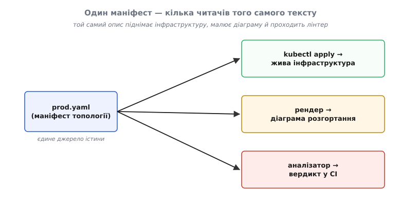

# ⚙️ proj: Розгортання як код — маніфест, що і піднімає систему, і малює її

Діаграму розгортання малюють від руки один раз — а потім її ніхто не оновлює. Хтось додав у прод четверту копію, хтось переніс базу в іншу зону, хтось прибрав балансувальник — а на картинці й досі та сама три-коробкова схема з минулого кварталу. Через місяць діаграма впевнено бреше, і за нею ухвалюють рішення про доступність, яких у системі вже немає. Це не недбальство конкретної людини — це неминучість будь-якого опису, що живе **окремо** від того, що описує. Дві правди, які тримають синхронними вручну, розходяться завжди; питання лише коли.

Той самий розрив породжує друге лихо — сумнозвісне «у мене все працює». На ноутбуку розробника система стиснута в один процес: немає мережевих меж, немає зон, немає часткових відмов. У проді вона розтягнута на дванадцять копій за балансувальниками у трьох зонах. Це **різні топології**, і цілі класи багів — таймаути, розриви мережі, гонки, втрата зони — структурно невидимі там, де все в одному місці, і вилазять лише там, де рознесене. Знову два описи одного, які нема чим змусити збігатися.

Обидва лиха мають один корінь і, виявляється, одні ліки. Якщо опис розгортання зробити **виконуваним** — не картинкою, а текстом, який оркестратор перетворює на живі копії, — то він більше не може розійтися з реальністю: він **і є** реальність, бо саме з нього її й підняли. Це і називають **інфраструктурою як код** (infrastructure as code, скорочено IaC): топологію системи описують текстовим файлом-маніфестом (лат. *manifestus* — «очевидний, явний»), а не кліками в консолі й не стрілками в редакторі діаграм. І тоді той самий файл несе подвійну службу — він і піднімає інфраструктуру, і **є** машиночитним в'ю розгортання.

Ця вставка доводить це до коду. Спершу опишемо **одну** логічну модель, відображену на два середовища через маніфест, де кількість копій і зони живуть у конфігу. Потім напишемо робочий аналізатор, що читає цей маніфест, рахує копії на кожен логічний контейнер і **позначає** найпоширенішу пастку надлишковості — однозонну. І наприкінці розберемо, де ця простенька ідея підступно ламається.

## Задача: один текст, три читачі

Сформулюймо точно, чого хочемо. Є логічна модель системи — скажімо, три контейнери: `api`, `worker`, `db`. Вона **інваріантна**: не міняється від того, куди її поставили. Змінюється лише **розклад** — скільки копій кожного контейнера підняти й по яких зонах їх розкидати; і цей розклад **різний** у кожному середовищі. Треба:

1. описати логічну модель **один раз**, а розклади для `dev` і `prod` — окремими накладками, так щоб «скільки копій і де» жило в конфігу, а не в коді;
2. мати змогу з того самого тексту **підняти** середовище (`docker stack deploy`, `kubectl apply`) — без цього маніфест не «джерело істини», а ще одна картинка;
3. прогнати цей текст **аналізатором**, що порахує сумарні копії на логічний контейнер і завалить збірку, якщо знайде уявну надлишковість.

Ключ — що всі три дії читають **той самий файл**. Оркестратор бачить у ньому інструкцію, рендер — діаграму, аналізатор — предмет перевірки. Один текст, три читачі, одна правда.



*Один маніфест — три незалежні читачі того самого тексту. Оркестратор піднімає з нього живі копії, рендер малює з нього діаграму розгортання, аналізатор виносить вердикт у конвеєрі. Саме тому, що джерело спільне, діаграма не може розійтися з інфраструктурою: вони — одна й та сама пара рядків, прочитана двома різними інструментами.*

> 🔧 **Навіщо це.** Поки діаграма розгортання — це малюнок у вікі, вона деградує від першого ж деплою і за нею не можна нічого перевірити автоматично. Щойно вона стає маніфестом, обидві вади зникають одразу: вона оновлюється тим самим комітом, що й інфраструктура (бо це він її й піднімає), і її можна прогнати тестом. «Переживемо відмову зони» перестає бути гаслом на дошці й стає рядком у CI, який або зелений, або червоний. В'ю розгортання з пасивної картинки перетворюється на **виконуваний контракт**.

## Ідея: маніфест — це відображення логічного на фізичне

В основі в'ю розгортання лежить одне відношення — **відображення** (mapping) логічних контейнерів на фізичні місця й на кількість копій. Маніфест `compose`/`swarm` кодує рівно це відношення, і кожне його поле має точний архітектурний зміст:

- `services:` — **логічні контейнери** статичної моделі. Одна коробка на діаграмі = один запис тут.
- `image:` — **артефакт** (лат. *arte factum* — «зроблене вмінням»), фізичне тіло логічного контейнера: конкретний образ, який розгортають.
- `deploy.replicas:` — **скільки копій** цього контейнера підняти. Ось те число, якого немає на статиці: там `api` — одна коробка, тут `api` — чотири живі копії.
- `deploy.placement:` — **де** ці копії ставити: `constraints` прибивають їх до вузлів із певною міткою (тверда умова), `preferences.spread` радить рознести їх рівномірно по значеннях мітки (м'яке побажання).

Найважливіший хід — розділити **інваріант** і **розклад** на різні файли. Базовий `compose.yaml` тримає логічну модель, спільну для всіх середовищ. Оверлеї (англ. *overlay* — «накладка») `compose.dev.yaml` і `compose.prod.yaml` домальовують поверх неї розклад копій для конкретного середовища. Оркестратор зливає базу з потрібним оверлеєм — і дістає повний маніфест саме того середовища. Логічна модель залишається однією; різняться лише накладки.

Ось база — «що це за система», без жодного слова про копії чи зони:

```yaml
# compose.yaml — логічна модель. Ті самі три контейнери в КОЖНОМУ середовищі.
# Тут лише «що це» (образ, порт, том). «Скільки копій і де» — в оверлеях.
services:
  api:
    image: shop/api:1.6.0
    ports: ["8080:8080"]
  worker:
    image: shop/worker:1.6.0
  db:
    image: shop/db:15
    volumes: ["dbdata:/var/lib/db"]
volumes:
  dbdata:
```

Оверлей `dev` — «усе на одному хості, по одній копії». Топологія тут пласка: жодних зон, жодних меж; але **сервіси ті самі**, що й у проді, — і це не випадковість, а свідома вимога паритету, до якої повернемося:

```yaml
# compose.dev.yaml — розклад для ноутбука розробника.
services:
  api:    { deploy: { replicas: 1 } }
  worker: { deploy: { replicas: 1 } }
  db:     { deploy: { replicas: 1 } }
```

Оверлей `prod` — тут і живе вся топологія. Зверніть увагу: **код не змінився ні на рядок**; змінився лише розклад. `api` рознесено по зонах правильно, а `worker` — ні, і саме цю ваду ми потім спіймаємо аналізатором:

```yaml
# compose.prod.yaml — розклад для проду. Кількість копій і зони живуть ТУТ.
services:
  api:
    deploy:
      replicas: 4
      placement:
        preferences:
          - spread: node.labels.zone          # рознести 4 копії по зонах — правильно
  worker:
    deploy:
      replicas: 3
      placement:
        constraints:
          - "node.labels.zone == eu-central-1a"   # ← усі 3 в ОДНІЙ зоні — пастка!
  db:
    deploy:
      replicas: 1
```

Тепер найголовніше: цей самий текст читають троє. Оркестратор піднімає з нього прод; його ж рушій зливає у канонічний вигляд; його ж ковтає наш аналізатор:

```bash
# 1. підняти прод (Swarm): база + оверлей → живі копії
docker stack deploy -c compose.yaml -c compose.prod.yaml shop

# 2. той самий текст, злитий у канонічний маніфест (це і є машиночитний в'ю)
docker compose -f compose.yaml -f compose.prod.yaml config

# 3. той самий текст → вердикт у CI
python analyze.py
```

Три команди, один опис. Це і є сенс «розгортання як код»: діаграма не супроводжує інфраструктуру — вона **та сама**, що інфраструктура. У світі [діаграм як код](root:sf-apps/diagrams-as-code) це окремий великий сюжет; тут же нам досить того, що маніфест уже машиночитний, тож наступний крок природний — навчити машину його **читати й судити**.

## Код: аналізатор, що рахує копії й ловить однозонну надлишковість

Аналізатор робить чотири речі поспіль. Зчитує базу з оверлеєм і **зливає** їх (як `docker compose config`). Для кожного логічного контейнера дістає **кількість копій** і те, **в яких зонах** ці копії гарантовано стоятимуть. Виносить **вердикт**: чи не є надлишковість уявною. І перевіряє **паритет** — чи описують `dev` і `prod` той самий набір логічних сервісів.

Серце вердикту — одне спостереження, яке варто відчути до коду. Надлишковість рятує від відмови **лише тоді, коли копії падають незалежно**. Дві копії в одній зоні незалежними не є: одна аварія зони — і вони мертві **разом**. Тобто на випадок втрати зони три копії в одній зоні коштують рівно стільки, скільки одна:

```
надлишковість працює  ⟺  копії падають НЕЗАЛЕЖНО
зона впала  →  усі копії в НІЙ мертві РАЗОМ        (спільна відмова)
⇒  N копій в 1 зоні  ≈  1 копія на випадок відмови зони
```

Чому саме так і на скільки дев'яток доступності це виходить — окремий, суто ймовірнісний апарат: [математика доступності](root:math-probability/system-reliability-math) виводить «стелю кореляції», нижче за яку зайві копії в тій самій зоні не опускають простій ані на секунду. Нам тут досить наслідку: **копії, замкнені в одній зоні, — це надлишковість лише на папері**, і саме її має ловити аналізатор. Що її *реалізує* правильно — активне резервування, гаряче перемикання — розбирають [тактики доступності](root:sf-apps/availability-tactics); наша ж задача скромніша й точна: побачити ваду в тексті ще до деплою.

Мова тут — та, якою реально пишуть такі перевірки в конвеєрі: скрипт, що читає YAML і валить збірку. І в екосистемі Python, і в Node це одноденна робота; покажемо обома, бо приклад однаково ідіоматичний у кожній:

:::tabs
```py
import re, sys
from dataclasses import dataclass
from pathlib import Path
import yaml   # pip install pyyaml

ZONE = "node.labels.zone"      # мітка вузла: в якій зоні доступності він стоїть

# ── 1. База + оверлей середовища → глибоке злиття ────────────────────────────
#    (те саме, що робить `docker compose -f base -f over config`)
def load_stack(*paths: str) -> dict:
    stack: dict = {}
    for p in paths:
        layer = yaml.safe_load(Path(p).read_text("utf-8")) or {}
        stack = deep_merge(stack, layer)
    return stack

def deep_merge(base: dict, over: dict) -> dict:
    out = dict(base)
    for k, v in over.items():
        merge = isinstance(v, dict) and isinstance(out.get(k), dict)
        out[k] = deep_merge(out[k], v) if merge else v
    return out

# ── 2. У яких зонах placement ГАРАНТУЄ копії ─────────────────────────────────
def zone_cover(deploy: dict) -> tuple[set[str], bool]:
    place = deploy.get("placement") or {}
    pinned = {m.group(1)
              for c in (place.get("constraints") or [])
              if (m := re.search(rf"{re.escape(ZONE)}\s*==\s*(\S+)", c))}
    spreads = any((p or {}).get("spread") == ZONE
                  for p in (place.get("preferences") or []))
    return pinned, spreads          # {зони під твердим constraint}, чи є spread

# ── 3. Вердикт на один логічний контейнер ────────────────────────────────────
@dataclass
class Report:
    name: str
    copies: int
    verdict: str        # single | ok | warn | fail
    note: str

def judge(name: str, spec: dict) -> Report:
    deploy = spec.get("deploy") or {}
    copies = int(deploy.get("replicas", 1))
    zones, spreads = zone_cover(deploy)
    if copies <= 1:
        return Report(name, copies, "single", "одна копія — надлишковості нема")
    if len(zones) >= 2 or spreads:
        return Report(name, copies, "ok", "копії рознесено по зонах")
    if len(zones) == 1:
        return Report(name, copies, "fail",
                      f"усі прибито до зони {next(iter(zones))} — надлишковість уявна")
    return Report(name, copies, "warn",
                  "нема правила зон — планувальник може скласти копії в одну зону")

def analyze(stack: dict) -> list[Report]:
    services = (stack.get("services") or {}).items()
    return [judge(n, s or {}) for n, s in sorted(services)]

# ── 4. Паритет: набір логічних сервісів мусить збігатися між середовищами ─────
def parity_gap(dev: dict, prod: dict) -> set[str]:
    d = set(dev.get("services") or {})
    p = set(prod.get("services") or {})
    return d ^ p                     # симетрична різниця: хто є лише в одному

# ── 5. Гейт CI: fail або зламаний паритет валить збірку (код виходу 1) ────────
if __name__ == "__main__":
    dev  = load_stack("compose.yaml", "compose.dev.yaml")
    prod = load_stack("compose.yaml", "compose.prod.yaml")
    mark = {"ok": "OK  ", "single": "·   ", "warn": "WARN", "fail": "FAIL"}
    bad = False
    print("== prod ==")
    for r in analyze(prod):
        print(f"{mark[r.verdict]} {r.name:7} копій: {r.copies}  {r.note}")
        bad |= r.verdict == "fail"
    if gap := parity_gap(dev, prod):
        print("PARITY  лише в одному середовищі:", ", ".join(sorted(gap)))
        bad = True
    sys.exit(1 if bad else 0)
```
```ts
import { readFileSync } from "node:fs";
import { parse } from "yaml";              // npm i yaml

const ZONE = "node.labels.zone";           // мітка вузла: в якій зоні він стоїть

interface Deploy {
  replicas?: number;
  placement?: { constraints?: string[]; preferences?: { spread?: string }[] };
}
interface Stack { services?: Record<string, { deploy?: Deploy }>; }
type Verdict = "single" | "ok" | "warn" | "fail";
interface Report { name: string; copies: number; verdict: Verdict; note: string; }

// ── 1. База + оверлей → глибоке злиття (як `docker compose config`) ──────────
const isObj = (v: unknown): v is Record<string, unknown> =>
  typeof v === "object" && v !== null && !Array.isArray(v);

function deepMerge(base: any, over: any): any {
  if (!isObj(base) || !isObj(over)) return over;
  const out: Record<string, unknown> = { ...base };
  for (const [k, v] of Object.entries(over))
    out[k] = k in out ? deepMerge(out[k], v) : v;
  return out;
}
const loadStack = (...paths: string[]): Stack =>
  paths.map((p) => parse(readFileSync(p, "utf8")) ?? {}).reduce(deepMerge, {}) as Stack;

// ── 2. У яких зонах placement ГАРАНТУЄ копії ─────────────────────────────────
function zoneCover(deploy: Deploy = {}): { pinned: Set<string>; spreads: boolean } {
  const place = deploy.placement ?? {};
  const pinned = new Set<string>();
  for (const c of place.constraints ?? []) {
    const m = c.match(/node\.labels\.zone\s*==\s*(\S+)/);
    if (m) pinned.add(m[1]);
  }
  const spreads = (place.preferences ?? []).some((p) => p.spread === ZONE);
  return { pinned, spreads };
}

// ── 3. Вердикт на один логічний контейнер ────────────────────────────────────
function judge(name: string, spec: { deploy?: Deploy }): Report {
  const deploy = spec.deploy ?? {};
  const copies = deploy.replicas ?? 1;
  const { pinned, spreads } = zoneCover(deploy);
  if (copies <= 1)
    return { name, copies, verdict: "single", note: "одна копія — надлишковості нема" };
  if (pinned.size >= 2 || spreads)
    return { name, copies, verdict: "ok", note: "копії рознесено по зонах" };
  if (pinned.size === 1)
    return { name, copies, verdict: "fail",
             note: `усі прибито до зони ${[...pinned][0]} — надлишковість уявна` };
  return { name, copies, verdict: "warn",
           note: "нема правила зон — планувальник може скласти копії в одну зону" };
}
const analyze = (s: Stack): Report[] =>
  Object.entries(s.services ?? {})
        .sort(([a], [b]) => a.localeCompare(b))
        .map(([n, spec]) => judge(n, spec));

// ── 4. Паритет: набір логічних сервісів мусить збігатися між середовищами ─────
function parityGap(dev: Stack, prod: Stack): string[] {
  const d = new Set(Object.keys(dev.services ?? {}));
  const p = new Set(Object.keys(prod.services ?? {}));
  return [...new Set([...d, ...p])].filter((s) => d.has(s) !== p.has(s)).sort();
}

// ── 5. Гейт CI: fail або зламаний паритет валить збірку (код виходу 1) ────────
const dev = loadStack("compose.yaml", "compose.dev.yaml");
const prod = loadStack("compose.yaml", "compose.prod.yaml");
const mark: Record<Verdict, string> = { ok: "OK  ", single: "·   ", warn: "WARN", fail: "FAIL" };
let bad = false;
console.log("== prod ==");
for (const r of analyze(prod)) {
  console.log(`${mark[r.verdict]} ${r.name.padEnd(7)} копій: ${r.copies}  ${r.note}`);
  bad ||= r.verdict === "fail";
}
const gap = parityGap(dev, prod);
if (gap.length) { console.log("PARITY  лише в одному середовищі:", gap.join(", ")); bad = true; }
process.exit(bad ? 1 : 0);
```
:::

Прогнавши це на наших маніфестах, дістаємо:

```
== prod ==
OK   api     копій: 4  копії рознесено по зонах
·    db      копій: 1  одна копія — надлишковості нема
FAIL worker  копій: 3  усі прибито до зони eu-central-1a — надлишковість уявна
```

Ось де ідея змикається в одну точку. `api` має чотири копії з `spread` по зонах — надлишковість справжня, `OK`. `db` — одна копія, надлишковості нема взагалі (для проду це, можливо, теж вада, але **іншого** роду — тут нема від чого рятувати). А `worker` — три копії, **усі прибиті до `eu-central-1a`**: заплатили за три машини, а на випадок падіння зони маємо стійкість однієї. Аналізатор ставить `FAIL` і повертає код виходу 1 — збірка червона, деплой не піде, доки хтось не замінить `constraints` на `preferences.spread`. Уявну надлишковість спіймано **в тексті**, за місяці до нічного дзвінка.


*Що саме позначає аналізатор. Ліворуч — антипатерн: копій багато, зона одна, тож одна аварія зони забирає всі копії разом; надлишковість уявна. Праворуч — здорова топологія: ті самі копії рознесені по двох зонах, і падіння однієї лишає систему живою на другій. Різниця не в кількості копій, а в кількості **меж відмови**, по яких вони розкидані, — і саме її видно в полі `placement`.*

Та сама ідея дослівно переноситься в Kubernetes — міняється лише словник маніфесту, не суть. Здорове рознесення там задають не `preferences.spread`, а `topologySpreadConstraints` з ключем відомої мітки зони `topology.kubernetes.io/zone`:

```yaml
apiVersion: apps/v1
kind: Deployment
metadata: { name: api, labels: { app: api } }
spec:
  replicas: 4
  selector: { matchLabels: { app: api } }
  template:
    metadata: { labels: { app: api } }
    spec:
      topologySpreadConstraints:        # ← рознести копії по зонах
        - maxSkew: 1                     # різниця копій між зонами — не більш як 1
          topologyKey: topology.kubernetes.io/zone
          whenUnsatisfiable: DoNotSchedule
          labelSelector: { matchLabels: { app: api } }
      containers:
        - { name: api, image: shop/api:1.6.0 }
```

Аналізатор під Kubernetes читав би `spec.replicas` і `topologySpreadConstraints[].topologyKey` замість `deploy.replicas` і `placement` — але логіка вердикту («копій багато, а межа відмови одна?») лишається буква в букву тією самою. Маніфест змінює діалект; в'ю розгортання, яке він кодує, — ні.

## Пастки: де ця проста ідея ламається

Наївний аналізатор вище вже корисний, але між ним і чесним гейтом лежить кілька ям. Кожна з них — не дрібниця синтаксису, а місце, де плутанина понять обертається хибним вердиктом.

**Рахувати треба логічний контейнер, а не запис маніфесту.** Найтонша пастка росте прямо з різниці «тип проти примірника», на якій стоїть увесь в'ю розгортання. Один логічний контейнер інколи навмисне описують **кількома** записами маніфесту — наприклад, окремим деплойментом на зону, щоб мати строгий контроль над кожною:

```yaml
# api-1a і api-1b — це ОДИН логічний сервіс «api», розкладений на дві зони.
# Обидва мають мітку app=api — саме вона каже, що логічно це одне.
apiVersion: apps/v1
kind: Deployment
metadata: { name: api-1a, labels: { app: api } }
spec:
  replicas: 2
  template:
    spec: { nodeSelector: { topology.kubernetes.io/zone: eu-central-1a } }
---
apiVersion: apps/v1
kind: Deployment
metadata: { name: api-1b, labels: { app: api } }
spec:
  replicas: 2
  template:
    spec: { nodeSelector: { topology.kubernetes.io/zone: eu-central-1b } }
```

Аналізатор, що судить **кожен запис окремо**, побачить тут два сервіси по дві копії, кожен прибитий до однієї зони, — і видасть **два хибні `FAIL`**. Насправді ж разом це чотири копії у двох зонах — бездоганне рознесення. Ліки — рахувати не за іменем деплойменту, а за **логічною міткою**: згрупувати записи, **просумувати** копії й **об'єднати** зони, і лише тоді судити ціле:

```py
from collections import defaultdict

def by_logical(entries: list[dict]) -> dict[str, dict]:
    groups: dict[str, dict] = defaultdict(lambda: {"copies": 0, "zones": set()})
    for e in entries:
        app = e["labels"]["app"]              # логічний контейнер, а не ім'я запису
        groups[app]["copies"] += e["replicas"]      # копії ДОДАЮТЬСЯ по записах
        groups[app]["zones"]  |= e["zones"]         # зони ОБ'ЄДНУЮТЬСЯ по записах
    return groups
# тепер {"api": {"copies": 4, "zones": {"eu-central-1a", "eu-central-1b"}}} → OK
```

Це той самий урок, що й в основі в'ю розгортання: логічний контейнер — це **тип**, а копії — його примірники; судити доступність можна лише про тип, зібравши **всі** його примірники докупи. Помилка тут — не баг парсера, а плутанина рівнів моделі.

**`spread` — це побажання, а не гарантія.** У Swarm `preferences.spread` — м'яке правило: планувальник **воліє** рознести копії по зонах, але якщо вузли лишень в одній зоні, він спокійно поставить усі туди й не поскаржиться. Тому наш `OK` на `spread` строго означає не «копії в різних зонах», а «висловлено намір їх рознести». Справжня гарантія двозонності потребує ще й того, щоб у кластері **фактично** були вузли, помічені щонайменше двома зонами. Чесніший гейт не вірить маніфесту на слово, а звіряє намір із реальністю кластера — читає мітки живих вузлів (`docker node inspect`, `kubectl get nodes -L topology.kubernetes.io/zone`) і перевіряє, що зон під цей сервіс справді ≥ 2. Kubernetes тут суворіший: `whenUnsatisfiable: DoNotSchedule` перетворює побажання на тверду умову — краще **не** запустити зайву копію, ніж запустити її з порушенням рознесення.

**Мовчазний `warn` небезпечніший за гучний `fail`.** Найпідступніший стан — копій багато, а правила зон **нема ніякого**. Формально це не заборонено, тому спокуса пропустити такий сервіс велика. Але «три копії без жодного `placement`» означає, що зони обирає планувальник на свій розсуд — і ніщо не заважає йому скласти всі три в одну. Це та сама однозонна пастка, лише **не оголошена**: вона не в тексті маніфесту, а в мовчанні тексту. Тому аналізатор і виділяє `warn` окремо від `ok`: `replicas > 1` **не** дорівнює «високій доступності», доки хтось не сказав, **по яких межах** ці копії рознести. Прирівнювати число копій до надійності — найпоширеніша хиба читання діаграм розгортання, і вона живе саме в цій німій щілині.

**Паритет — це форма меж, а не лише список імен.** Наша перевірка `parity_gap` ловить грубе: сервіс, що є в проді, але зник із `dev` (черга, кеш, sidecar), — тоді `dev` фізично не може відтворити пов'язані з ним баги. Уявімо, що в прод додали `cache`, а в `dev`-оверлей — забули:

```
PARITY  лише в одному середовищі: cache
```

Збірка червона — і правильно: середовища розійшлися, «у мене працює» тепер гарантоване. Але однакові **імена** сервісів — умова необхідна, не достатня. Глибший паритет — це збіг **форми меж**: якщо в проді `api` і `worker` — два процеси через мережу, а в `dev` їх задля зручності злили в один, то `dev` не має мережевої межі між ними й ховає цілий клас багів (таймаути, розриви, порядок доставки), хоч список сервісів і збігається. Стейджинг мусить дзеркалити **топологію** проду — ті самі межі, — навіть коли він менший за розміром; дзеркалять форму меж, а не кількість заліза. Повний аналізатор паритету звіряв би не лише множини імен, а й число процесів і наявність мережевих меж між тими самими парами сервісів.

**Маніфест — джерело істини лише поки ним не крутять повз нього.** Уся конструкція тримається на одній тихій умові: інфраструктуру міняють **тільки** через маніфест. Варто комусь `kubectl edit`-нути живий деплоймент чи докрутити копію руками в консолі — і текст знову розходиться з реальністю, тобто вертається те саме лихо, від якого ми втекли, лише підступніше: маніфест **виглядає** правдою, а нею вже не є. Тому «розгортання як код» працює в парі з дисципліною, що забороняє зміни повз репозиторій: незмінна інфраструктура (immutable infrastructure — сервери не правлять, а перестворюють з нуля) і GitOps (єдиний шлях у прод — коміт у git, який автоматика й розкочує). Без цієї дисципліни маніфест лишається чесним рівно до першої ручної правки — а застаріла діаграма розгортання, як відомо, **гірша за жодну**, бо впевнено бреше.

**Злиття база+оверлей хитріше, ніж здається.** Наш `deep_merge` глибоко зливає словники, а списки просто **заміняє** пізнішим. Для наших полів (`replicas` — скаляр, `constraints`/`preferences` — списки, що їх оверлей задає повністю) це поводиться правильно. Але справжні правила `docker compose` багатші: десь списки **доточуються**, десь скаляри перекриваються за особливими умовами, а `!reset`/`!override` міняють поведінку злиття явно. Тому надійніший аналізатор не мерджить сам, а бере вже злитий текст із **власного** `config` інструмента (`docker compose … config`, `helm template`, `kustomize build`) і судить **його**. Правило просте: не відтворюй логіку злиття оркестратора — попроси оркестратор віддати результат і аналізуй канонічний вихід. Свій наївний мердж хай лишається лише для розуміння, як воно влаштоване.

## Що з цього виходить

Складімо докупи. Ми взяли одну логічну модель, розписали її розклад по двох середовищах окремими накладками — і дістали текст, який **одночасно** піднімає інфраструктуру, малює діаграму розгортання й піддається перевірці. Потім навчили машину читати цей текст: рахувати копії на логічний контейнер, розрізняти справжнє рознесення від уявного й валити збірку на однозонній надлишковості чи зламаному паритеті. І врешті побачили, де ідея підступно тріщить — коли плутають логічний контейнер із записом маніфесту, коли беруть побажання за гарантію, коли мовчання про зони приймають за їх наявність, коли звіряють імена замість форми меж і коли інфраструктуру крутять повз її ж опис.

Виграш точний і вимірний. Поки в'ю розгортання — картинка, він деградує від першого деплою й нічого не гарантує. Щойно він стає маніфестом, який читають троє, — доступність перестає бути наміром на дошці й стає властивістю тексту, яку червоний CI боронить від тихої ерозії. Діаграма розгортання зі слайда, що його забувають оновити, перетворюється на тест, який не дає забути. Один текст, три читачі, одна правда — і та правда відтепер перевірна.
