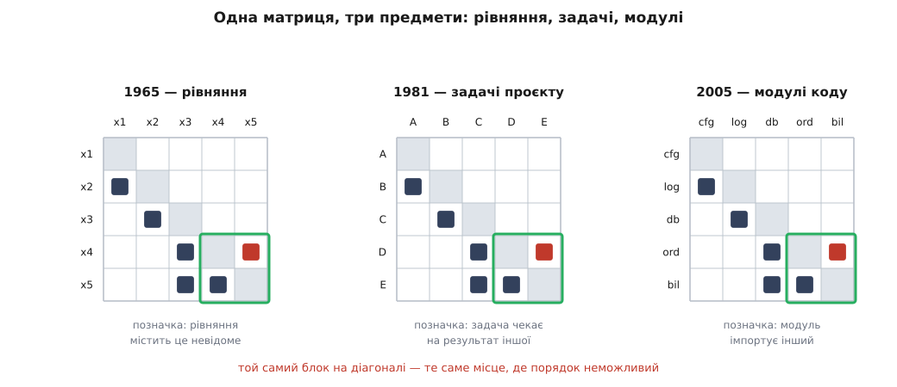

# 📜 Від систем рівнянь до перевірки на складанні: як з'явилася матриця залежностей

Слова «розбиття» й «розривання», якими сьогодні говорять про модулі, прийшли в програмування не з програмування. Це терміни числової алгебри, і придумані вони були 1965 року заради зовсім іншої задачі: як розв'язати систему з кількох тисяч рівнянь, коли машина не бере її цілком. Дорога звідти до перевірки залежностей на кожному складанні зайняла сорок років і пройшла через журнал числових методів, журнал для інженерних керівників, лабораторію MIT і Гарвардську школу бізнесу. Кожен із цих переходів щось у матриці змінив, і сліди всіх чотирьох видно в сьогоднішньому інструменті.

## Порядок рівнянь

Дональд В. Стюард (Donald V. Steward) надрукував 1965 року статтю «Partitioning and Tearing Systems of Equations» — у журналі, що тоді звався *Journal of the Society for Industrial and Applied Mathematics, Series B: Numerical Analysis* (том 2, число 2, с. 345–365), а згодом був перейменований на *SIAM Journal on Numerical Analysis*. Про проєктування в ній немає жодного слова. Ідеться про те, як рахувати.

Задача виглядала так. Є система рівнянь — багато, і здебільшого нелінійних. Брати її цілком одним прямим ходом дорого, а часто й неможливо: кожен крок виключення невідомого дописує ненулі туди, де їх не було, і те, що починалося як розріджена система, у якій кожне рівняння містить три-чотири невідомі, до середини обчислення стає щільним. Скільки саме нових ненулів з'явиться, залежить не від самої системи, а від **порядку**, у якому виключати; тим, як цей порядок визначає ціну розв'язання, займається [LU-розклад](topic:math-algebra/lu-decomposition).

Стюардів хід був такий: викинути числа й лишити саму структуру. Для кожної пари «рівняння — невідоме» є рівно одна відповідь: воно туди входить чи не входить. Це квадратна таблиця з позначками — і питання про порядок обчислення стає питанням про форму плями в цій таблиці. Якщо рівняння й невідомі можна переставити так, щоб позначки лягли нижче діагоналі, система розсипається на ланцюжок: з першого рівняння дістаємо перше невідоме, підставляємо в друге, дістаємо друге, і так до кінця. Жодних тисяч разом — тисяча дій по одній.

Коли не розсипається, лишається група рівнянь, у якій кожне потребує невідомого з іншого. Пошук таких груп Стюард назвав **розбиттям** (*partitioning*). А те, що робиться з групою далі, він назвав **розриванням** (*tearing*): вибрати всередині блоку одне невідоме, **вгадати** для нього число, розв'язати решту блоку так, ніби воно відоме, і подивитися, яке значення того самого невідомого з цього вийшло. Не збіглося — підставити нове й повторити.

**Приклад: чотири рівняння, з яких два тримаються одне за одне.**

```
 (1) x₁ = 3
 (2) x₂ = x₁ + 1
 (3) x₃ = x₂ + x₄
 (4) x₄ = (x₃ + 6) / 2

таблиця «рівняння × невідоме» після переставляння:

          x₁   x₂   x₃   x₄
   (1)    ■    ·    ·    ·
   (2)    ×    ■    ·    ·
   (3)    ·    ×    ■    ×     ← позначка вище діагоналі
   (4)    ·    ·    ×    ■
                   └─блок─┘

розривання: вгадуємо x₃, решту рахуємо як звичайний ланцюжок
   x₁ = 3,  x₂ = 4

   крок 0:  x₃ = 0      → x₄ = 3.0   → з (3) новий x₃ = 4 + 3.0  = 7.0
   крок 1:  x₃ = 7.0    → x₄ = 6.5   → новий x₃ = 4 + 6.5        = 10.5
   крок 2:  x₃ = 10.5   → x₄ = 8.25  → новий x₃ = 4 + 8.25       = 12.25
   крок 3:  x₃ = 12.25  → x₄ = 9.125 → новий x₃                  = 13.125
   ...
   точний розв'язок:  x₃ = 14,  x₄ = 10   (похибка щокроку меншає удвічі)
```

Ось звідки взялося те значення блоку, яке живе в матриці й досі. Блок — не просто негарне місце в таблиці; це рівно те місце, де **покрокового порядку не існує** і доводиться платити ітерацією. Коли через сорок років у блоці опиняються два модулі, ціна та сама за формою: їх не можна ні зібрати, ні перевірити по черзі, і замість підстановки готового значення доводиться підставляти заглушку, а потім узгоджувати обидва боки за кілька заходів.

Той самий математичний хід — переставляння двійкової матриці до блочно-трикутного вигляду — 1973 року описав Джон Н. Ворфілд (John N. Warfield) в іншій традиції, системному моделюванні: «Binary Matrices in System Modeling», *IEEE Transactions on Systems, Man, and Cybernetics*, том SMC-3, число 5, с. 441–449. Це не історична дрібниця: програмні інструменти через тридцять років посилатимуться на алгоритм розбиття саме Ворфілда поряд зі Стюардовим.

## Шістнадцять років і зміна предмета

Наступна публікація Стюарда, яка щось важить для цієї історії, вийшла 1981 року: «The Design Structure System: A Method for Managing the Design of Complex Systems», *IEEE Transactions on Engineering Management*, том EM-28, число 3, с. 71–74. Чотири сторінки.

Математика в ній та сама. Змінився предмет. Елементами стали **задачі проєктування**, а позначка почала означати «ця задача чекає на результат, який видає інша». І разом із предметом змінився сенс блоку. У рівняннях блок був обчислювальною незручністю, яку розривають наближенням. У проєктуванні блок — це група задач, які **не вишикуються в розклад**: щоб порахувати вагу, треба знати матеріал, а щоб обрати матеріал — знати навантаження, яке залежить від ваги. Стюардова відповідь: не вдавати, ніби порядок є. Визнати, що тут буде ітерація, покласти її в план, почати з відверто припущеного значення й домовитися, скільки разів усі учасники цю петлю пройдуть. Те саме розривання, тільки вгадане число тепер називається інженерним припущенням і записується в документ.



*Форма плями однакова, предмет — різний. Змінюючи те, що означає позначка, метод тричі змінював галузь, і щоразу блок на діагоналі означав одне й те саме: місця, де покрокового порядку немає і треба платити ітерацією.*

Варто помітити, **де** саме це надруковано. Не в журналі з проєктування, не в обчислювальному — у журналі з управління інженерією, чиї читачі керують проєктами, а не розв'язують системи. Між математичною статтею й цією минуло шістнадцять років. У спільноті DSM переказують, що всі ці роки статтю відхиляли кілька редакцій підряд; первинного джерела для такого твердження знайти не вдалося, тож це переказ, а не встановлений факт. Документований лише сам розрив у часі та вибір журналу — метод довго чекав на читачів, яким він був потрібен.

Звідси й назва. Система Стюарда звалася *Design Structure System*, а таблиця в ній — *design structure matrix*, «матриця структури проєкту». Літера D у скороченні DSM спершу означала саме «design».

## MIT: із методу однієї людини — дослідницька програма

Далі метод підхопили в MIT, і головна постать тут — Стівен Д. Еппінгер (Steven D. Eppinger) зі школи менеджменту Слоуна. Ключова стаття — Еппінгер, Вітні, Сміт і Ґебала, «A model-based method for organizing tasks in product development», *Research in Engineering Design*, том 6, число 1, 1994, с. 1–13; трьома роками раніше Ґебала й Еппінгер надрукували «Methods for Analyzing Design Procedures» (ASME, третя міжнародна конференція з теорії й методології проєктування, 1991, с. 227–233) — саме про алгоритми розбиття.

Що додав MIT, крім самої ваги великого університету. По-перше, **число замість позначки**: клітинка дістала силу зв'язку, і питання «яку залежність розривати» перестало бути питанням смаку. По-друге, **групування як окрема операція з власною метою**: розбиття шукає порядок і цикли, групування шукає межі — це різні задачі з різними цільовими функціями, і плутати їх не варто. По-третє — і це дало найдовші наслідки — матрицю почали будувати не лише для деталей виробу, а й для **людей**: Піммлер і Еппінгер («Integration Analysis of Product Decompositions», ASME, шоста конференція з теорії й методології проєктування, Міннеаполіс, вересень 1994) застосували групування до складу команд розробки. Щойно з'явилися дві матриці однакового вигляду — одна з деталей, друга з людей, — стало можливо їх порівнювати; емпіричну форму цього порівняння програмісти знають як [закон Конвея](topic:sf-apps/conways-law): структура системи повторює структуру спілкування тих, хто її будує.

## Хто перший побачив у ній код

У програмному світі прийнято думати, що DSM принесла туди стаття 2005 року. Її автори самі кажуть інакше: значення матриці для програм першими помітили Кевін Салліван, Вільям Ґрізволд, Юаньфан Цай і Бен Голлен у праці «The Structure and Value of Modularity in Software Design» (спільна конференція ESEC/FSE, 2001, с. 99–108) — у контексті оцінювання проєктних компромісів, тобто питання «скільки коштує ця межа й що вона дає».

Оцінювати їм було чим, бо роком раніше вийшла книжка, що дала й мову, і арифметику: Карлісс Ю. Болдвін і Кім Б. Кларк, «Design Rules, Volume 1: The Power of Modularity» (MIT Press, 2000). Їхнє розрізнення просте й дуже сильне. Модульна система розпадається на **правила проєктування** (*design rules*) — інтерфейси й домовленості, які видно всім, які узгоджують наперед і які дорого міняти, — і **приховані модулі**, які можна переробити або замінити, ні з ким не питаючись, бо назовні від них видно лише інтерфейс. У матриці це видно прямо: правила проєктування — це стовпці, від яких залежать усі, а прихований модуль — той, чий стовпець порожній за межами власної групи. Звідси і їхній аргумент про цінність: прихований модуль — це опціон, право (а не обов'язок) замінити його на кращий, і що більше в системі прихованих модулів, то більше в неї таких прав. Ідея, яку Болдвін і Кларк тут переклали мовою грошей, у програмуванні відома з початку 1970-х як [приховування інформації](topic:sf-apps/information-hiding); на Парнаса, який її сформулював, спиратиметься й стаття 2005 року — там він цитований за «Designing Software for Ease of Extension and Contraction» (*IEEE Transactions on Software Engineering*, SE-5, число 2, 1979).

## 2005: інструмент, слово і замкнена петля

Тепер та сама стаття 2005 року. Нірадж Санґал і Ев Джордан із фірми Lattix разом із Вінітом Сінхою й Деніелом Джексоном із MIT CSAIL надрукували «Using Dependency Models to Manage Complex Software Architecture» на конференції OOPSLA'05 (Сан-Дієго, 16–20 жовтня 2005, с. 167–176).

Нового в ній не картинка, а **замкнена петля**. Залежності дістаються з коду звичайним статичним аналізом; матриця будується ієрархічною, за пакетами, і користувач перебудовує ієрархію, поки вона не почне відповідати справжній архітектурі; далі він пише правила двох видів — `can-use` і `cannot-use`, зі шаблонами імен та успадкуванням від підсистеми до її складників; і кожен наступний прогін позначає порушення. Правила — це буквально клітинки матриці, дозволені й заборонені. Сама ідея звіряти код із оголошеним наміром була не нова, і автори це визнають: у розділі про суміжні роботи вони порівнюють свій підхід із моделями відображення (*Software Reflexion Models*) Мерфі, Ноткіна й Саллівана, кажучи, що їхні правила поєднують в одному записі карту відображення та ідеалізовану модель. Нове тут інше — наміром слугує сама матриця, тож перевірка росте разом із системою, а не всупереч їй; те, від чого вона боронить, має власне ім'я — [ерозія архітектури](topic:sf-apps/architecture-erosion).

Автори обережні у твердженнях про першість і формулюють їх точно: їхній підхід, схоже, є першим застосуванням DSM саме до явного керування міжмодульними залежностями, а їхній інструмент LDM (*Lattix Inc's dependency manager*) — першою загальнодоступною реалізацією DSM-аналізу для програм. Фірму Lattix заснував 2004 року Нірадж Санґал (за даними профілів компанії — не первинне джерело).

Показували все це на живому коді: розібраний випадок — Haystack, дослідницький прототип системи керування особистою інформацією з MIT, 196 707 рядків Java, що розвивалися чотири роки без жодної архітектурної схеми; як менші приклади — JUnit 3.8.1 і jEdit 4.2. Одна деталь цього розбору варта окремої уваги: робив його аспірант, який до того з DSM не працював узагалі. Стаття доводила не те, що метод потужний у руках знавця, а те, що його можна взяти й застосувати.

Є в тій статті й дрібниця, від якої добре видно, що дві гілки росли одночасно, а не одна з одної. У списку літератури емпіричне вимірювання модульності програм згадане як робочий папір Гарвардської школи бізнесу за номером 05-016 — тобто на момент OOPSLA воно ще не було надруковане.

## Коли з картинки зробили число

Той робочий папір вийшов наступного року: Ален Маккормак, Джон Руснак і Карлісс Болдвін, «Exploring the Structure of Complex Software Designs: An Empirical Study of Open Source and Proprietary Code», *Management Science*, том 52, число 7, липень 2006, с. 1015–1030. Вони порівняли Linux і Mozilla і — що виявилося важливішим — Mozilla із самою собою до й після свідомої перебудови заради модульності. Історичне значення цієї роботи не в конкретних числах, а в тому, що модульність із питання смаку стала виміряною величиною, у якої є «до» і «після».

Останній крок цієї лінії повернув у центр опису той самий блок на діагоналі. Карлісс Болдвін, Ален Маккормак і Джон Руснак, «Hidden Structure: Using Network Methods to Map System Architecture», *Research Policy*, том 43, число 8, 2014, с. 1381–1397: вони беруть найбільшу групу елементів, у якій кожен досяжний із кожного — [сильно зв'язну компоненту](topic:sf-algorithms/strongly-connected-components), — оголошують її **ядром** системи і класифікують архітектури за тим, як решта з цим ядром пов'язана: ядро-периферія, багатоядерна, ієрархічна, межова. Стюардів блок, який 1965 року був місцем, де обчислення застрягає, тут став способом назвати систему одним словом.

## Дві назви й два напрямки читання

Розкол у назві лишився назавжди. Інженерна традиція, що йде від Стюардової *Design Structure System*, каже *design structure matrix*. Програмна, що йде від заголовка статті 2005 року, каже *dependency structure matrix*. Скорочення однакове, предмет той самий, а практичний наслідок такий: шукаючи літературу, доводиться питати обома термінами — інженерні бази знають перший, програмні другий, і та сама картинка знайдеться під обома.

Гірше з напрямком читання, бо тут розбіжність не в слові, а в тому, що означає позначка. Стаття 2005 року формулює свою угоду прямо: позначка стоїть у рядку *j* і стовпці *i*, коли задача *i* залежить від задачі *j*, — тобто **стовпець залежить від рядка**. Чимало пізніших інструментів обрали дзеркальну угоду. Обидві співіснують іще з інженерних часів, і жодна з них не хибна; хибно лише читати матрицю не в тій угоді, у якій її намалювали. Самі відомості при цьому не псуються — просто кожна стрілка обертається, і орієнтована система виглядає точно навиворіт: те, що всім потрібне, здається залежним від усіх. Ні назва, ні вигляд картинки угоди не видають: її треба оголошувати окремо, і кожен акуратний інструмент саме це й робить.
