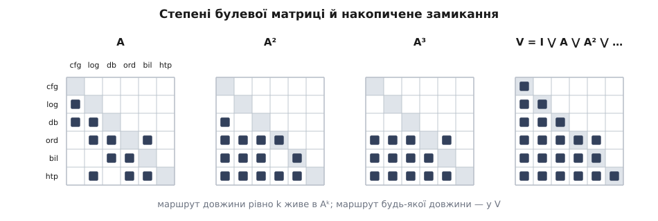

# 🧮 Булеві степені й замикання: чому ряд обривається, коли матриця трикутна і скільки це коштує

Матрицю видимості означують нескінченним рядом V = I ⋁ A ⋁ A² ⋁ A³ ⋁ …, а рахують за скінченний час. Тут доведено, чому це законно: що саме означає степінь Aᵏ й чому ряд обривається на Aⁿ⁻¹; чому «немає циклів», «Aⁿ = 0» і «матрицю можна зробити строго трикутною» — це три записи одного факту; чому щільність V однакова з обох боків читання; і за скільки дій замикання справді обчислюється.

<preknowlist>
- [Булева алгебра](root:math-logic/boolean-algebra) — операції ⋁ («або») і ⋀ («і») на множині {0, 1}, їхні таблиці й закони: уся арифметика нижче відбувається саме в них, звичайних чисел тут немає.
- [Транзитивне замикання](root:sf-algorithms/transitive-closure) — перехід від відношення «сусід» до відношення «досяжний хоч якимось шляхом»: матриця видимості це воно, записане таблицею.
- [Топологічне сортування](root:sf-algorithms/topological-sort) — порядок вершин, у якому кожна стоїть після всіх, кого потребує; існує тоді й лише тоді, коли в графі немає циклів.
</preknowlist>

Домовимося про запис раз і назавжди. Елементів n, вони занумеровані 1…n. Матриця A — квадратна, з нулів і одиниць, і **Aᵢⱼ = 1 означає «елемент i потребує елемента j»**; діагональ нульова. Дуга в графі йде від того, хто потребує, до того, кого потребують: i → j. Тоді «шлях з i у j» означає «i дістає j через ланцюжок потреб», а в матриці видимості Vᵢⱼ = 1 читається двома дзеркальними способами: i зрештою спирається на j, і зміна в j зрештою дістає i.

Наскрізний приклад — шість модулів: `cfg`, `log`, `db`, `ord`, `bil`, `htp`, занумеровані в цьому порядку числами 1…6. Залежності: `log` потребує `cfg`; `db` потребує `cfg` і `log`; `ord` потребує `log`, `db` і `bil`; `bil` потребує `db` і `ord`; `htp` потребує `log`, `ord` і `bil`.

```
       cfg log db  ord bil htp        рядок як множина стовпців
 cfg    ·   ·   ·   ·   ·   ·         A₁ = {}
 log    ×   ·   ·   ·   ·   ·         A₂ = {1}
 db     ×   ×   ·   ·   ·   ·         A₃ = {1,2}
 ord    ·   ×   ×   ·   ×   ·         A₄ = {2,3,5}
 bil    ·   ·   ×   ×   ·   ·         A₅ = {3,4}
 htp    ·   ×   ·   ×   ×   ·         A₆ = {2,4,5}
```

Єдина одиниця вище діагоналі — A₄,₅: `ord` потребує `bil`, який стоїть пізніше. Вона там не випадково, і далі буде доведено, що жодне переставляння її не прибере.

## Арифметика, у якій живе матриця

Множення матриць над числами тут не годиться: 1 + 1 = 2, а «два шляхи» нам не потрібні — потрібно «шлях є». Тож замінімо пару операцій:

```
⊕ = ⋁ («або»)          ⊗ = ⋀ («і»)
0⋁0 = 0   0⋁1 = 1      0⋀0 = 0   0⋀1 = 0
1⋁0 = 1   1⋁1 = 1      1⋀0 = 0   1⋀1 = 1

нейтральний до ⋁ — це 0;  нейтральний до ⋀ — це 1;  0 ⋀ a = 0
a ⋁ a = a                          ідемпотентність
a ⋀ (b ⋁ c) = (a⋀b) ⋁ (a⋀c)        дистрибутивність
a ⋁ (a ⋀ b) = a                    поглинання
```

Структура ({0, 1}, ⋁, ⋀, 0, 1) має всі закони кільця, окрім одного: до ⋁ немає оберненого. З рівності a ⋁ x = a ⋁ y не випливає x = y, віднімання не існує, і саме тому структуру звуть [напівкільцем](root:math-algebra/semiring), а не кільцем. Утрата серйозна: без віднімання не працює жодна хитрість, що будується на зведенні доданків — зокрема схема Штрассена, до якої ми ще повернемося. Натомість з'являється ідемпотентність, а вона дає монотонність: додавши до матриці одиниць, ми жодної не втратимо. На цій монотонності тримається вся скінченність замикання.

Добуток двох булевих матриць означено формулою, яка виглядає як звичайна:

```
(A ⊗ B)ᵢⱼ = (Aᵢ₁ ⋀ B₁ⱼ) ⋁ (Aᵢ₂ ⋀ B₂ⱼ) ⋁ … ⋁ (Aᵢₙ ⋀ Bₙⱼ)
```

Але читається вона інакше, і в цьому вся суть. Диз'юнкція по m — це квантор існування, кон'юнкція — сполучник «і». Тобто (A ⊗ B)ᵢⱼ = 1 означає рівно: **існує таке проміжне m, що i пов'язане з m у A і m пов'язане з j у B**. Множення матриць над цим напівкільцем не рахує нічого — воно шукає посередника.

Далі знак ⊗ опускаємо, як звичайно, а запис M ≤ N між булевими матрицями означає покомпонентне «менше або дорівнює», тобто «усі одиниці M є і в N».

## Степінь — це шлях заданої довжини

**Теорема 1.** Для будь-якого k ≥ 0: (Aᵏ)ᵢⱼ = 1 тоді й лише тоді, коли з i у j існує **маршрут довжини рівно k** — послідовність вершин v₀ = i, v₁, …, v_k = j, у якій кожна сусідня пара сполучена дугою.

Слово тут *маршрут*, а не *шлях*: вершини й дуги можуть повторюватися. Ця дрібниця далі виявиться вирішальною.

**Доведення індукцією по k.**

*База k = 0.* A⁰ = I за означенням, а Iᵢⱼ = 1 лише при i = j. Маршрут довжини нуль — це одна вершина без жодної дуги, і він існує рівно тоді, коли кінці збігаються. Збіг повний.

*База k = 1.* A¹ = A, а Aᵢⱼ = 1 — це наявність дуги, тобто маршруту з однієї дуги.

*Крок.* Нехай твердження правдиве для k. Розгорнімо означення добутку:

```
(Aᵏ⁺¹)ᵢⱼ = (Aᵏ ⊗ A)ᵢⱼ = ⋁ₘ ( (Aᵏ)ᵢₘ ⋀ Aₘⱼ )
```

Права частина дорівнює 1 тоді й лише тоді, коли знайдеться m, для якого водночас (Aᵏ)ᵢₘ = 1 і Aₘⱼ = 1, тобто (за припущенням індукції) є маршрут довжини k з i у m і дуга m → j. Склеївши їх, дістаємо маршрут довжини k+1 з i у j. Навпаки, будь-який маршрут довжини k+1 має передостанню вершину; візьмімо її за m — і маршрут розпадається саме на такі дві частини. Відповідність взаємно однозначна, отже рівність доведено. ∎

Порахуймо степені для нашої шістки. Рядок Aᵏ подано множиною стовпців:

```
A          A²             A³               A⁴
1: {}      1: {}          1: {}            1: {}
2: {1}     2: {}          2: {}            2: {}
3: {1,2}   3: {1}         3: {}            3: {}
4: {2,3,5} 4: {1,2,3,4}   4: {1,2,3,5}     4: {1,2,3,4}
5: {3,4}   5: {1,2,3,5}   5: {1,2,3,4}     5: {1,2,3,5}
6: {2,4,5} 6: {1,2,3,4,5} 6: {1,2,3,4,5}   6: {1,2,3,4,5}
```

Верхні три рядки згасають: `cfg`, `log`, `db` не мають довгих маршрутів уперед. А рядки 4 і 5 не згасають ніколи — вони коливаються з періодом два, бо `ord` і `bil` дивляться одне на одного, і маршрут можна нескінченно намотувати по цій парі. Ось наочна причина, чому в означенні стоїть *маршрут*, а не *шлях*: степені бачать саме маршрути, і при циклі жоден степінь не стає нульовим.



*Степені однієї матриці. Позначка в Aᵏ означає маршрут довжини рівно k, тому картинка не росте монотонно: у A³ рядок `ord` не містить того, що було в A², і навпаки. Монотонно росте лише накопичена диз'юнкція праворуч — сама матриця видимості.*

## Чому нескінченний ряд обривається

Означимо матрицю видимості як диз'юнкцію всіх степенів:

```
V = I ⋁ A ⋁ A² ⋁ A³ ⋁ … = ⋁ₖ≥₀ Aᵏ
```

Доданків нескінченно багато, тож само по собі означення нічого не обчислює. Рятує геометрична обставина: довгий маршрут завжди можна вкоротити.

**Лема про вкорочення.** Якщо з i у j є маршрут довжини k ≥ n, то з i у j є маршрут строго меншої довжини.

**Доведення.** Маршрут довжини k проходить через k+1 вершин (з повтореннями): v₀, v₁, …, v_k. Якщо k ≥ n, то цих позицій щонайменше n+1, а різних вершин усього n — за принципом Діріхле дві позиції зайняті однією вершиною: v_p = v_q при p < q. Викиньмо ділянку між ними: послідовність v₀, …, v_p, а далі v_(q+1), …, v_k лишається маршрутом (бо v_p = v_q, отже дуга v_q → v_{q+1} виходить і з v_p), кінці ті самі, а довжина зменшилася на q − p ≥ 1. ∎

**Наслідок 1.** V = I ⋁ A ⋁ A² ⋁ … ⋁ Aⁿ⁻¹.

Справді: якщо (Aᵏ)ᵢⱼ = 1 при k ≥ n, лему можна застосовувати повторно, доки довжина не впаде нижче n; отже та сама одиниця вже присутня в одному з доданків з номером ≤ n−1. Нічого нового старші степені не дають. Межа точна: найдовший маршрут без повторень має n вершин і n−1 дуг, і в ланцюжку з n елементів одиниця в куті з'являється саме в Aⁿ⁻¹.

**Наслідок 2.** V = (I ⋁ A)ᵖ для будь-якого p ≥ n−1.

Розкриймо добуток p однакових множників (I ⋁ A) за дистрибутивністю: вийде диз'юнкція 2ᵖ добутків, кожен із яких — це послідовність із I та A. Оскільки I нейтральна до множення, добуток із m входженнями A дорівнює Aᵐ. Однакові доданки злипаються через ідемпотентність, і лишається рівно ⋁ₘ₌₀..ᵖ Aᵐ, тобто V за наслідком 1. ∎

Наслідок 2 — це вже алгоритм. Беремо p найближчим степенем двійки, не меншим за n−1, і підносимо B = I ⋁ A до цього степеня послідовним піднесенням до квадрата: ⌈log₂(n−1)⌉ множень замість n−1.

**Що таке V як відношення.** Матриця V рефлексивна (I ≤ V за побудовою) і транзитивна: якщо (V ⊗ V)ᵢⱼ = 1, то є m з маршрутом i → m і маршрутом m → j; склеївши, дістаємо маршрут i → j, отже Vᵢⱼ = 1, тобто V ⊗ V ≤ V. Разом із рефлексивністю це дає V ⊗ V = V. І вона найменша з таких: якщо W рефлексивна, транзитивна й W ≥ A, то індукцією Aᵏ ≤ W для всіх k (крок: Aᵏ⁺¹ = Aᵏ ⊗ A ≤ W ⊗ W ≤ W), отже V ≤ W. Це і є означення рефлексивно-транзитивного замикання, а запис V = A* — той самий зірковий оператор, що й у регулярних виразах, де він теж означає «нуль або більше повторень» ([формальні мови](root:computability/formal-language)).

## Ациклічність = нільпотентність = трикутність

Три твердження про ту саму матрицю A розміру n × n:

```
(1) у графі залежностей немає жодного циклу;
(2) Aⁿ = 0                                  (A нільпотентна);
(3) існує матриця перестановки P, за якої PAPᵀ строго нижньотрикутна.
```

**Теорема 2.** (1), (2) і (3) рівносильні.

Доводимо колом: (1) ⟹ (3) ⟹ (2) ⟹ (1).

**(1) ⟹ (3).** Спершу переконаймося, що в скінченному ациклічному графі є вершина з порожнім рядком, тобто така, що нікого не потребує. Якби її не було, з будь-якої вершини можна було б робити крок уперед нескінченно; за n+1 крок якась вершина повторилася б, і ділянка між двома її входженнями була б циклом. Отже вершина з порожнім рядком є. Поставмо її першою й викреслімо з матриці — решта теж ациклічна, і міркування повторюється. Так будується нумерація, у якій кожен елемент стоїть після всіх, кого потребує; це і є [топологічний порядок](root:sf-algorithms/topological-sort). Перенумерація елементів — це саме одночасна перестановка рядків і стовпців, тобто перехід A ↦ PAPᵀ, а умова «кожен потребує лише раніших» означає: Tᵢⱼ = 1 ⟹ i > j, тобто T = PAPᵀ строго нижньотрикутна.

**(3) ⟹ (2).** Нехай T строго нижньотрикутна. Доведімо індукцією: (Tᵏ)ᵢⱼ = 1 ⟹ i ≥ j + k. База k = 1 — це саме означення строгої нижньої трикутності (i > j, тобто i ≥ j+1). Крок: (Tᵏ⁺¹)ᵢⱼ = 1 вимагає m з (Tᵏ)ᵢₘ = 1 і Tₘⱼ = 1, звідки i ≥ m + k і m ≥ j + 1, отже i ≥ j + 1 + k. При k = n умова i ≥ j + n неможлива, бо обидва індекси лежать у межах 1…n, а j ≥ 1. Отже Tⁿ = 0.

Лишилося перенести це на A. Матриця перестановки задовольняє PᵀP = PPᵀ = I — і над булевим напівкільцем теж, бо в добутку PᵀP кожна клітинка є диз'юнкцією добутків, серед яких щонайбільше один ненульовий, тож віднімати нічого не доводиться. Тому

```
(PAPᵀ)ᵏ = PAPᵀ · PAPᵀ · … · PAPᵀ = P Aᵏ Pᵀ
```

(усі внутрішні пари PᵀP скорочуються в I). З Tⁿ = P Aⁿ Pᵀ = 0 дістаємо Aⁿ = Pᵀ · 0 · P = 0.

**(2) ⟹ (1).** Від супротивного: нехай є цикл довжини L через вершину v. Тоді є замкнений маршрут довжини L з v у v, а намотавши його m разів — маршрут довжини mL, отже за теоремою 1 клітинка (v, v) у степені A^(mL) дорівнює 1, і це справджується для кожного m. Візьмімо m так, щоб mL ≥ n. Але з Aⁿ = 0 випливає Aᵏ = 0 для всіх k ≥ n, бо Aᵏ = Aⁿ ⊗ Aᵏ⁻ⁿ, а нуль поглинає множення. Суперечність. ∎

Практичний критерій із цього кола виходить простіший за всі три формулювання. Оскільки цикл через v — це замкнений маршрут, а замкнений маршрут дає одиницю на діагоналі відповідного степеня, маємо:

```
граф ациклічний  ⟺  діагональ A⁺ = A ⋁ A² ⋁ … ⋁ Aⁿ нульова
                 ⟺  V ⋀ Vᵀ = I
```

Друга форма особливо зручна: покомпонентна кон'юнкція V з її транспонованою залишає одиницю в (i, j) рівно тоді, коли i бачить j і j бачить i. Якщо поза діагоналлю не лишилося нічого — циклів немає.

У нашій шістці в таблиці степенів рядок 4 матриці A⁴ містить стовпець 4, а рядок 5 містить стовпець 5: (A⁴)₄,₄ = 1 і (A⁴)₅,₅ = 1. Отже цикл є, і одиниця вище діагоналі, помічена на початку, невитравна: жодна перестановка не зробить A трикутною, бо трикутність рівносильна ациклічності, а її немає.

## Взаємна досяжність розбиває матрицю на блоки

Означимо покомпонентно S = V ⋀ Vᵀ, тобто Sᵢⱼ = Vᵢⱼ ⋀ Vⱼᵢ: «i бачить j і j бачить i».

**Теорема 3.** S — [відношення еквівалентності](root:math-logic/equivalence-relation).

*Рефлексивність*: Vᵢᵢ = 1, отже Sᵢᵢ = 1. *Симетричність*: Sᵀ = Vᵀ ⋀ (Vᵀ)ᵀ = Vᵀ ⋀ V = S за комутативністю ⋀. *Транзитивність*: нехай Sᵢⱼ = Sⱼₖ = 1. Тоді Vᵢⱼ = Vⱼₖ = 1, і з транзитивності V маємо Vᵢₖ = 1; так само Vₖⱼ = Vⱼᵢ = 1 дає Vₖᵢ = 1. Отже Sᵢₖ = 1. ∎

Класи цієї еквівалентності — це [сильно зв'язні компоненти](root:sf-algorithms/strongly-connected-components) графа залежностей. Позначмо клас елемента i через [i].

**Теорема 4 (блочна сталість).** Якщо i ~ j, то рядки V у цих елементів збігаються повністю, і стовпці теж: Vᵢₖ = Vⱼₖ і Vₖᵢ = Vₖⱼ для всіх k.

**Доведення.** Нехай Vᵢₖ = 1. Оскільки j бачить i (Vⱼᵢ = 1), транзитивність дає Vⱼₖ = 1. Симетрично з обміном i та j. Для стовпців те саме міркування в Vᵀ. ∎

Звідси головний структурний факт. Значення Vᵢⱼ залежить не від самих i та j, а лише від їхніх класів: V — це «роздута» матриця досяжності конденсації. Нехай класи C₁, …, C_r, а K — матриця досяжності між класами: K(a, b) = 1, коли з класу a можна дістатися класу b, включно з випадком a = b. Тоді

```
Vᵢⱼ = K(a, b),   де a — клас елемента i, b — клас елемента j
```

і V складається з суцільних прямокутників: блок рядків C_a на стовпці C_b або весь заповнений, або весь порожній. А конденсація ациклічна за побудовою (клас, що дістає інший клас і назад, був би одним класом), тож за теоремою 2 K впорядковується топологічно й стає нижньотрикутною (з одиницями на самій діагоналі). Якщо тримати елементи одного класу поруч і йти класами в топологічному порядку, V нижньотрикутна з суцільними квадратами одиниць на діагоналі, а A нижньотрикутна з одиницями вище діагоналі **лише всередині діагональних квадратів**: одиниця Aᵢⱼ між різними класами означала б, що [i] дістає [j] і не навпаки, отже [i] стоїть у топологічному порядку пізніше, тобто i > j.


*Ліворуч: рядки `ord` і `bil` збігаються символ у символ — вони в одному класі, і теорема 4 не лишає їм вибору. Праворуч: та сама будова взагалі. Кожен заповнений прямокутник має площу |C|·|D|, і саме з цих площ складається кількість одиниць у V.*

## Скільки одиниць у матриці видимості

З блочної будови кількість одиниць рахується точно, без жодного обходу графа.

**Теорема 5.** |V| = Σ |C| · |D|, де сума береться по всіх упорядкованих парах класів (C, D), для яких C дістає D (пара C = C входить обов'язково).

**Доведення.** Кожна одиниця V сидить у якомусь прямокутнику C × D, прямокутники не перетинаються й покривають усю матрицю, а заповнений прямокутник має рівно |C|·|D| клітинок. ∎

Перевіримо на шістці. Класи: C₁ = {cfg}, C₂ = {log}, C₃ = {db}, C₄ = {ord, bil}, C₅ = {htp}. У конденсації C₅ дістає C₄, C₄ дістає C₃, C₃ дістає C₂, C₂ дістає C₁ — досяжність тут виявилася повним ланцюжком, тож кожен клас дістає себе й усіх із меншим номером.

```
C₁ (1) дістає {C₁}                  → 1·1                     = 1
C₂ (1) дістає {C₂,C₁}               → 1·(1+1)                 = 2
C₃ (1) дістає {C₃,C₂,C₁}            → 1·(1+1+1)               = 3
C₄ (2) дістає {C₄,C₃,C₂,C₁}         → 2·(2+1+1+1)             = 10
C₅ (1) дістає {C₅,C₄,C₃,C₂,C₁}      → 1·(1+2+1+1+1)           = 6
                                                        |V|   = 22

вартість поширення = |V| / n² = 22 / 36 ≈ 0.611
```

Той самий результат прямим підрахунком рядків: 1 + 2 + 3 + 5 + 5 + 6 = 22. Формула зійшлася.

**Наслідок (ціна циклу — квадратична).** Нехай клас має розмір s. Його власний діагональний квадрат дає рівно s² одиниць. Якби ті самі s елементів були розставлені між собою ациклічно, то в топологічному порядку k-й з них бачив би всередині набору щонайбільше s − k + 1 елементів, і всередині набору набралося б щонайбільше

```
s + (s−1) + … + 1 = s(s+1)/2
```

Різниця s² − s(s+1)/2 = **s(s−1)/2** — це нижня оцінка того, скільки клітинок додає сам факт злипання в цикл (насправді більше, бо ще й кожен, хто дістає бодай одного члена класу, дістає одразу всіх). Зростання квадратичне: блок із 10 елементів додає щонайменше 45 одиниць, блок із 50 — щонайменше 1225. Ось арифметична причина, чому великий цикл коштує непропорційно дорого.

## Щільність не залежить від напрямку читання

**Теорема 6.** Сума рядкових сум V дорівнює сумі стовпцевих сум V; обидві дорівнюють |V|.

**Доведення.** Обидві величини перелічують ту саму множину одиниць матриці, просто групуючи її по-різному — у першому випадку за першим індексом, у другому за другим:

```
Σᵢ ( Σⱼ Vᵢⱼ ) = |V| = Σⱼ ( Σᵢ Vᵢⱼ )
```

Це подвійний підрахунок скінченної множини, і жодних властивостей V, крім скінченності, він не вимагає. ∎

Наслідок для вимірювання: середня кількість елементів, яких бачить один елемент, дорівнює середній кількості елементів, які бачать його. Тому вартість поширення можна означувати з будь-якого боку читання — «куди дістане моя зміна» чи «звідки дістане до мене чужа», — і число вийде те саме. Не залежить воно й від порядку елементів: перестановка PVPᵀ пересуває одиниці, не змінюючи їхньої кількості.

Важливо не переплутати це з симетричністю. Рядкові й стовпцеві суми в нашій шістці такі:

```
рядки  (скільки бачу я):     cfg 1, log 2, db 3, ord 5, bil 5, htp 6   → 22
стовпці (скільки бачать мене): cfg 6, log 5, db 4, ord 3, bil 3, htp 1 → 22
```

Розподіли протилежні: `cfg` бачить одного (себе), а його бачать усі; `htp` бачить усіх, а його — ніхто. Збігається лише сума. Крайній випадок — зірка з одним ядром, яке потрібне всім і не потребує нікого: у нього стовпцева сума n, рядкова 1.

Коли ж V усе-таки симетрична? Рівність V = Vᵀ означає S = V, тобто кожна досяжність узаємна; тоді між різними класами немає жодної дуги в конденсації, і система розпадається на групи, які взагалі нічого одна про одну не знають, з |V| = Σ |C|². Симетричність матриці видимості — це не гарна властивість, а ознака того, що система не сполучена.

## Ціна обчислення

**Наївно за означенням.** n−1 множень по O(n³) кожне — O(n⁴). Через піднесення до квадрата (наслідок 2) — O(n³ log n). Обидва варіанти гірші за потрібне.

**Воршелл — O(n³).** Замикання будують не по довжинах маршрутів, а по дозволених проміжних вершинах. Схему опублікував Стівен Воршелл (*A theorem on Boolean matrices*, Journal of the ACM 9(1), 1962, с. 11–12); трьома роками раніше той самий хід для транзитивного замикання описав французький математик Бернар Руа (*Transitivité et connexité*, C. R. Acad. Sci. Paris 249, 1959, с. 216–218), а того ж 1962-го Роберт Флойд переніс його на найкоротші шляхи. Хай V⁽ᵏ⁾ᵢⱼ = 1 означає «є маршрут з i у j, усі **проміжні** вершини якого лежать у {1…k}». Тоді V⁽⁰⁾ = I ⋁ A, а перехід такий:

```
V⁽ᵏ⁾ᵢⱼ = V⁽ᵏ⁻¹⁾ᵢⱼ ⋁ ( V⁽ᵏ⁻¹⁾ᵢₖ ⋀ V⁽ᵏ⁻¹⁾ₖⱼ )
```

*Чому це правильно.* Маршрут з проміжними в {1…k} або зовсім не заходить у k — тоді його враховує перший доданок, — або заходить. У другому випадку візьмімо **перший** і **останній** візит у k і розріжмо маршрут по них: у першій частині i → k усі проміжні строго менші за k (бо візит перший), у хвості k → j — теж (бо останній), а середню петлю k → k просто викидаємо. Обидві частини враховані в V⁽ᵏ⁻¹⁾, отже другий доданок їх ловить. По завершенні k = n дозволені всі проміжні вершини, тобто V⁽ⁿ⁾ = V.

*Чому вистачає однієї матриці.* Під час фази k рядок k і стовпець k не змінюються:

```
V⁽ᵏ⁾ᵢₖ = V⁽ᵏ⁻¹⁾ᵢₖ ⋁ ( V⁽ᵏ⁻¹⁾ᵢₖ ⋀ V⁽ᵏ⁻¹⁾ₖₖ ) = V⁽ᵏ⁻¹⁾ᵢₖ
```

за законом поглинання a ⋁ (a ⋀ b) = a. Так само для рядка k. Тому оновлювати можна на місці, без копії.

**Бітові слова — O(n³/w).** Внутрішній цикл по j — це диз'юнкція двох рядків, а рядок з нулів і одиниць укладається в ⌈n/w⌉ машинних слів (w = 64). Диз'юнкція цілого рядка виконується одним циклом по словах:

```cpp
// V — n рядків по ⌈n/w⌉ слів; Row::test(k) і Row::operator|= працюють по словах.
for (int k = 0; k < n; ++k)
    for (int i = 0; i < n; ++i)
        if (V[i].test(k))
            V[i] |= V[k];          // ⌈n/64⌉ інструкцій замість n
```

Асимптотика лишається кубічною, але константа падає в 64 рази — на практиці це різниця між «неможливо» і «пів секунди»: при n = 4096 виходить близько 10⁹ операцій над словами.

**Через конденсацію — O(n·(n+m)/w).** Тут n — кількість елементів, m — кількість дуг. Спершу за O(n+m) знаходимо сильно зв'язні компоненти (Тарджан), будуємо конденсацію й топологічно її сортуємо. Далі йдемо класами у **зворотному** топологічному порядку: коли черга доходить до класу, усі класи, куди він дістає, уже пораховані, тож його рядок — це диз'юнкція власних членів із рядками зовнішніх сусідів. Кожна дуга дає одну диз'юнкцію рядків ціною ⌈n/w⌉ слів, ініціалізація n рядків коштує стільки ж, разом O(n·(n+m)/w). Теорема 4 тут не прикраса, а оптимізація: рядок рахується **раз на клас**, а решті s−1 членів просто копіюється.

Порівняння з бітовим Воршеллом: n³/w проти n·(n+m)/w — виграш у ≈ n²/(n+m) разів. У реальних кодових базах m росте приблизно як n, тож при n = 4096 це виграш на три порядки. Заразом видно й межу: сама матриця V займає n²/w слів, тому жоден алгоритм, який її будує цілком, не може бути швидшим за Ω(n²/w). Конденсаційний прохід цієї межі вже сягає з точністю до множника (n+m)/n.

**Чи можна нижче за куб асимптотично.** Так, і це давній результат: Майкл Фішер і Альберт Меєр показали, що транзитивне замикання й булеве множення матриць зводяться одне до одного з точністю до сталого множника, тобто мають однакову асимптотичну складність (*Boolean matrix multiplication and transitive closure*, Proc. 12th Ann. Symp. on Switching and Automata Theory, IEEE, 1971, с. 129–131). Пряме застосування швидких схем множення тут заборонене — вони віднімають, а в булевому напівкільці віднімання немає. Обхід стандартний: вкласти {0, 1} у цілі числа, помножити як цілі (усі елементи добутку не перевищують n, тож у машинне слово вміщаються) і замінити все ненульове на одиницю. Тоді замикання коштує O(n^ω), де ω — показник множення матриць; найкраща відома оцінка ω < 2.371339 (Alman, Duan, Williams, Xu, Xu, Zhou, SODA 2025). Практичної користі з цього немає: сталі при таких схемах величезні, пам'яті потрібно більше, а безкоштовний множник w = 64 бітового Воршелла перекриває виграш експоненти на всіх розмірах, які трапляються в коді. [Підрахунок одиничних бітів](root:sf-algorithms/popcount) у слові — теж одна інструкція, тому й сама щільність V рахується майже задарма, коли матриця вже побудована.

І остання межа, яку варто бачити чітко. Уся квадратична ціна виникає з питання «хто кого бачить» **для всіх пар**. Якщо потрібна одна відповідь — «хто дістає до модуля v» — матрицю будувати не треба зовсім: досить одного обходу транспонованого графа з вершини v за O(n+m). Ω(n²/w) — це ціна не досяжності, а таблиці досяжності.
