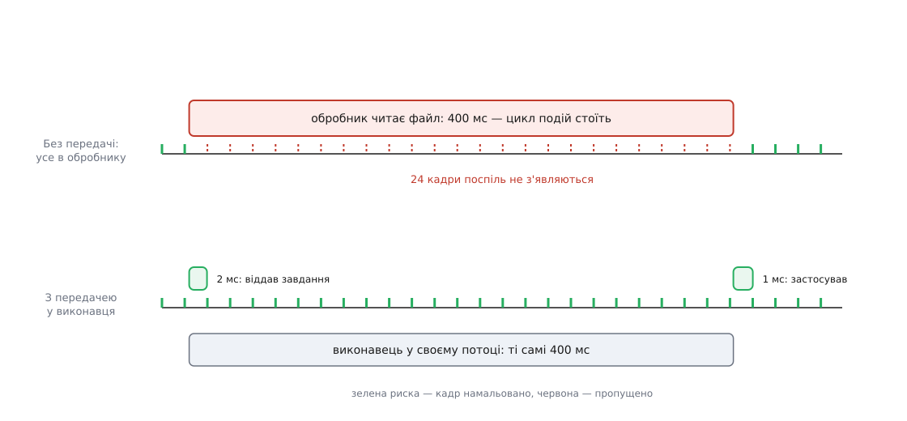
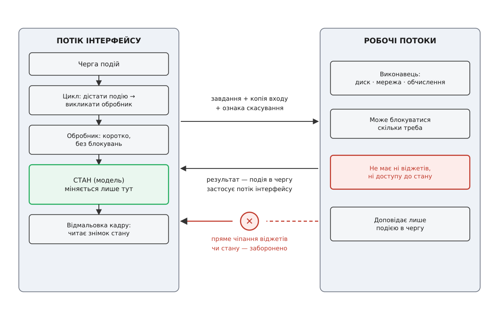
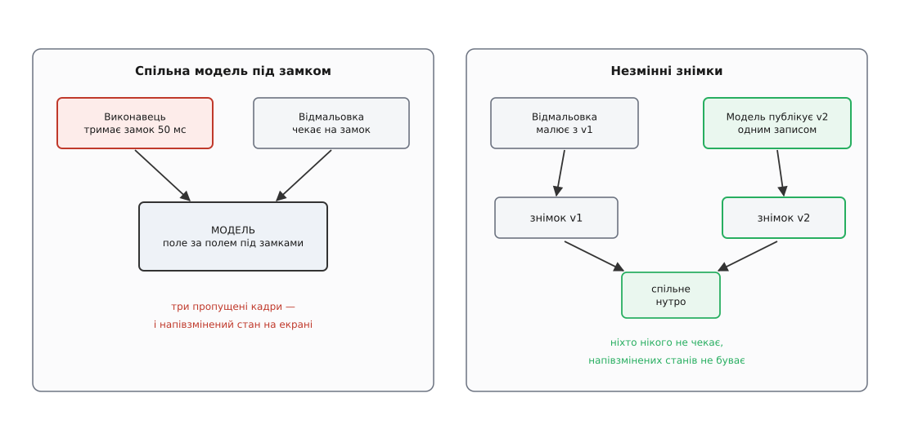
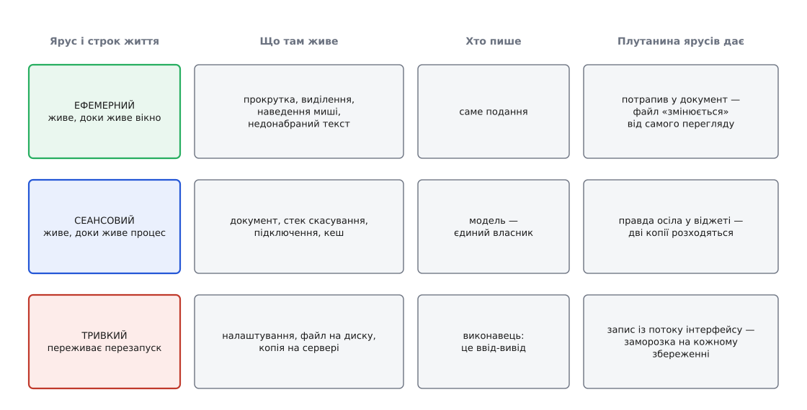

# Архітектура десктопного застосунку: шари, потоки, стан

<preknowlist>
- [Цикл подій](root:sf-tasks/event-loop) — програма крутить нескінченний цикл: дістає подію з черги, викликає обробник, повертається по наступну.
- [Процеси й потоки](root:sf-os/process-vs-thread) — що таке потік виконання і чому потоки одного процесу бачать спільну пам'ять.
- [Перегони даних і замки](root:sf-tasks/data-races-locks) — що стається, коли два потоки чіпають ті самі дані без узгодження, і що робить м'ютекс.
- [Блокуючий і неблокуючий ввід-вивід](root:sf-tasks/blocking-vs-nonblocking-io) — що означає «виклик блокується» і скільки коштує чекання на диск чи мережу.
- [Шарова архітектура](root:sf-apps/layered-architecture) — розклад коду на пласти й правило, що залежності течуть в один бік.
- [Спостерігач](root:sf-apps/observer) — джерело сповіщає підписників про зміну, не знаючи наперед, хто вони.
</preknowlist>

Серверний застосунок легко тримати в голові як конвеєр коротких життів. Запит прийшов — народився обробник, попрацював двісті мілісекунд, віддав відповідь і зник. Уся правда лежить у базі, а не в пам'яті процесу; сама пам'ять процесу між запитами майже порожня. Якщо один запит раптом затягнувся на дві секунди, решта тисячі про це не дізнається: кожен їде своєю доріжкою, і повільність одного лишається його особистою бідою.

Клієнт на столі в користувача влаштований протилежно в трьох речах одночасно. Він живе не двісті мілісекунд, а вісім годин поспіль — від ранкового запуску до вечірнього закриття. Уся його правда — відкритий документ, історія дій, підключений пристрій, півсотні налаштувань — живе **в оперативній пам'яті** й весь цей час змінюється. І найважливіше: все, що людина бачить, малює **один-єдиний потік**, і той самий потік приймає від неї весь ввід.

З цього виходить наслідок, якого на сервері просто немає. Якщо одна операція в клієнті триває дві секунди, то на ці дві секунди вмирає **весь застосунок**, а не одна операція. Вікно не перемальовується, прокрутка не рухається, натискання не доходять; операційна система за кілька секунд затуманить вікно й запропонує людині зняти програму. Повільність тут не локальна — вона тотальна.

Два факти — **картинкою володіє один потік** і **стан живе годинами й змінюється з кількох джерел** — і є та пара, з якої виводиться геть уся архітектура клієнта: як його різати на шари, скільки в ньому потоків і хто має право змінити те, що на екрані.

## Одна черга, один потік, шістнадцять мілісекунд

Спершу — звідки взагалі береться те, що потік один. Коли людина клацає мишею, ядро операційної системи не викликає жодної функції в програмі: воно кладе **подію** — «натиснуто ліву кнопку в точці (412, 260)» — у чергу, прив'язану до потоку, який створив це вікно. Програма сама, зі свого боку, крутить цикл: дістати наступну подію, знайти, кому вона адресована, викликати обробник, повернутися по наступну. Це і є [цикл подій](root:sf-tasks/event-loop) — серце будь-якого віконного застосунку.

Тепер придивись до одного оберту цього циклу. Поки виконується обробник, цикл **не крутиться** — він стоїть на рядку, де цей обробник викликано. Ніхто не дістає з черги наступну подію. Ніхто не обробляє запит системи «перемалюй себе». Черга росте, картинка не оновлюється. Тобто час життя обробника — це час, на який завмирає **вся** взаємодія.

Скільки ж він може тривати? Мірку задає не смак, а залізо: екран оновлюється з фіксованою частотою, і між двома оновленнями є рівно один проміжок, у який треба встигнути.

```
Частота оновлення екрана        = 60 Гц
Бюджет одного кадру             = 1 / 60 ≈ 16.7 мс
Читання файлу 200 МБ із SSD
   при 500 МБ/с                 = 200 / 500 = 0.40 с = 400 мс
Кадрів, які не з'являться       = 400 / 16.7 ≈ 24 кадри
```

Двадцять чотири кадри поспіль екран показує стару картинку. Людина це бачить: поріг, за яким дія перестає відчуватися миттєвою, лежить приблизно на **0.1 секунди** — учетверо менше за нашу затримку. Це не гадана величина: межі часу відгуку (0.1 с — «система відповіла миттєво», 1 с — думка не рветься, 10 с — межа утримання уваги) вимірював ще Роберт Міллер у праці 1968 року, перевіряла група Стюарта Карда 1991-го, а до широкого вжитку їх довів Якоб Нільсен 1993-го. Ці три числа — [не побажання дизайнера, а фізіологія](root:sf-apps/ui-response-time-limits), і саме вони перетворюють «швидко» на інженерну вимогу з числом.

Порівняй бюджет із вартістю звичайних речей: читання середнього файлу — сотні мілісекунд, запит по мережі — від десятків мілісекунд до секунд, розбір документа на мегабайт — теж сотні мілісекунд. Кожна з цих операцій **у десятки й сотні разів довша за кадр**. Звідси перше й найжорсткіше правило клієнтської архітектури: **обробник події не має права робити нічого, що триває довше за кадр**. Не «бажано, щоб не робив» — не має права, бо ціна одразу видима людині.

> 🔧 **Навіщо це.** Правило дає точний критерій рев'ю, який не залежить від чиєїсь думки: у коді, що виконується в потоці інтерфейсу, не має бути жодного виклику, який чекає — ні читання файлу, ні звернення до бази, ні `recv` із сокета, ні захоплення м'ютекса, який тримає хтось інший. Один такий виклик у обробнику натискання — це готовий баг «програма зависає на кілька секунд», який знайдуть користувачі, а не тести.


*Той самий обсяг роботи: усередині обробника він з'їдає два десятки кадрів, а винесений у робочий потік — жодного.*

## Чому не зробити інтерфейс багатопотоковим

Природна перша думка: якщо біда в тому, що потік один, хай малює один потік, а обробники хай крутяться в інших. Ця думка розбивається об те, що обмеження **не наше**. Його накладає сама віконна система.

У Windows чергу повідомлень операційна система заводить **для кожного потоку, який створив вікно**, і `GetMessage` дістає повідомлення лише тих вікон, що належать потоку-викликачу, — повідомлення чужих вікон він не побачить принципово. У macOS робота з ієрархією подання дозволена тільки з головного потоку. Тобто віконний об'єкт **прив'язаний** (лат. *affinis* — суміжний, споріднений) до потоку, який його створив: чіпати його з іншого потоку не заборонено правилом стилю, а просто не працює — від тихого нічого до падіння.

Що змушує системи так робити, стає видно, коли спробувати зробити навпаки. Дерево віджетів (англ. *widget* — елемент керування у графічній оболонці) — це великий змінюваний граф, у якому інваріанти зв'язують **різні вузли**: розміри дитини залежать від розкладки батька, порядок перекриття — від сусідів, фокус — від усього вікна. Замок на кожен вузол такий інваріант не захищає: щоб узгоджено переставити двох дітей, треба тримати обидва замки плюс замок батька, а це вже питання **порядку** захоплення й прямий шлях до [дедлоку](root:sf-tasks/deadlock). Гірше, що тулкіт викликає код застосунку зсередини себе (обробник події виконується, коли частина внутрішніх структур уже змінена), а той код знову гукає тулкіт — рекурсивний вхід під замками, який жоден акуратний порядок не рятує.

Тому кожен великий тулкіт цю дорогу пройшов і повернувся. Найдокладніше задокументований випадок — Java: AWT свого часу дозволяв більше багатопотокового доступу, і після досвіду з ним Swing зробили однопотоковим, а Ґрем Гамілтон із Sun 2004 року підсумував це в тексті з назвою-діагнозом «Багатопотокові тулкіти: нездійснена мрія». Незалежно одна від одної всі великі бібліотеки збіглися до **однієї моделі: один потік, одна черга подій**. Це не лінощі авторів, а межа, об яку б'ється кожен, хто пробує інакше.

Отже, потік інтерфейсу — це не деталь реалізації, яку можна замінити спритнішою. Це **зовнішня, непереговорна умова**, і решту архітектури будують навколо неї.

## Розкрій: не за родом справи, а за правом блокуватися

Класична [шарова архітектура](root:sf-apps/layered-architecture) ріже код за родом справи: подання, застосунок, домен, інфраструктура. Той розріз лишається чинним і в клієнті, але сам по собі він не рятує від заморозки, бо нічого не каже про потоки: домен, покликаний із обробника натискання, виконується так само в потоці інтерфейсу і так само його блокує.

Клієнтові потрібен **другий розріз**, поперечний до першого, — за двома правами, які в клієнті стають головними:

- хто має право **блокуватися** (чекати на диск, мережу, довге обчислення);
- хто має право **торкатися картинки** (віджетів, сцени, полотна).

Ці два права взаємно виключні, і саме тому вони й дають розкрій. Виходить три ролі.

**Подання** володіє віджетами й не володіє нічим більше. Воно живе тільки в потоці інтерфейсу, малює те, що йому дали, і перекладає рухи людини в наміри («користувач попросив зберегти»). Правди воно не зберігає — про це нижче, бо це окрема й найдорожча помилка.

**Стан** — те, заради чого застосунок відкритий: документ, історія дій, список пристроїв, результати останнього пошуку. Він живе годинами, змінюється й **має рівно одного власника**, який має право його змінювати.

**Виконавці** — усе повільне й чуже: файли, мережа, база, розбір, обчислення, розмова з пристроєм. Вони мають право блокуватися скільки завгодно й **не мають** ні віджетів, ні прямого доступу до стану.

Правило, що зв'язує трійку, коротке: **потік інтерфейсу ніколи не блокується, виконавці ніколи не чіпають картинку, стан змінюється в одному місці.** Усе інше в архітектурі клієнта — техніка виконання цього правила.


*Два дозволені канали між потоками — і один заборонений. Усе, що робочий потік хоче показати, він мусить покласти в чергу подій.*

Зверни увагу, що межа тут проходить не там, де в сервері. Серверний розріз відділяє **правила від техніки**, щоб можна було замінити базу. Клієнтський розріз відділяє **швидке від повільного** й **власника картинки від усіх інших**, щоб інтерфейс лишався живим. Обидва розрізи потрібні, і вони не конкурують: вертикальний ділить код за знанням, горизонтальний — за потоком виконання. Домен, що не знає про базу, чудово існує всередині виконавця.

## Дві передачі, і де вони ламаються

Якщо права розділені, лишається одне: як передати роботу туди й результат назад. Передач рівно дві, і кожна ламається по-своєму.

**Униз, від інтерфейсу до виконавця**, іде завдання. Спокуса тут — передати покажчик на живі дані моделі: мовляв, хай виконавець сам подивиться, що там у документі. Це вже [перегони даних](root:sf-tasks/data-races-locks): доки виконавець читає документ, людина в ньому друкує, і виконавець бачить структуру наполовину зміненою — вузол уже від'єднано, а лічильник ще старий. Тому вниз віддають **копію** входу або **незмінний знімок** — про нього трохи згодом. Разом із входом виконавець отримує ще дві речі: **спосіб доповісти про результат** і **спосіб дізнатися, що робота вже не потрібна**.

**Угору, від виконавця до інтерфейсу**, іде результат. Тут прямий шлях закритий: віджет чіпати не можна. Лишається єдиний канал — **покласти результат у чергу подій потоку інтерфейсу**. Виконавець не малює й не змінює модель; він додає в чергу подію «ось моя відповідь», яку цикл дістане, як усі інші, і виконає в правильному потоці.

Механізм у всіх тулкітах один, назв у нього багато: `PostMessage` у Win32, `dispatch_async` на головну чергу в macOS, черговане з'єднання й `QMetaObject::invokeMethod` у Qt, `SwingUtilities.invokeLater` у Java, `Dispatcher.Invoke` у .NET, повідомлення між процесами в Electron. Побачивши одне, впізнаєш решту.

Краса цього каналу в тому, **чого він позбувається**. Раз усі зміни картинки й моделі приходять у вигляді подій в одну чергу, їх виконує один потік по одній — тобто вони **впорядковані самі собою**, без жодного замка. Черга подій працює як м'ютекс, який ніхто не забуде взяти й не втримає зайву мить. Це і є головний архітектурний виграш однопотокового інтерфейсу, за який варто платити всіма незручностями передачі.

> 🔧 **Навіщо це.** Практичний висновок для коду: у клієнті не має бути жодного замка навколо моделі, якщо модель живе в потоці інтерфейсу. Замість «взяти м'ютекс і змінити» — «покласти в чергу подію, яка змінить». Такий код не має ні дедлоків, ні перегонів на моделі за побудовою, і його не треба перевіряти санітайзером потоків: небезпечних місць у ньому просто нема.

Сам прийом виносу роботи має свої тонкощі — скільки заводити потоків, коли брати [пул потоків](root:sf-tasks/thread-pool), як не породити тисячу дрібних завдань; це окрема тема про [розвантаження потоку інтерфейсу](root:sf-apps/ui-thread-offloading). Тут важливий лише каркас: завдання вниз копією, результат угору подією. Робочий кістяк такого ядра — цикл із чергою, пул виконавців, скасування й публікація знімка — розібрано в [окремому прикладі на C++](root:sf-apps/desktop-app-architecture/proj-ui-worker-handoff.md): там видно, як мало коду потрібно, щоб правило «жодного замка на моделі» трималося саме.

## Відповідь, що спізнилася

Тепер найтонше місце — те, через яке клієнти показують неправду навіть тоді, коли жодного перегону даних у них немає.

Поки виконавець працює, світ не стоїть. Людина встигла надрукувати ще дві літери, закрити вкладку, видалити рядок, від'єднати пристрій. Результат повертається у **змінений світ** і відповідає на питання, якого вже ніхто не ставить.

Форм цієї біди три, і всі трапляються щодня. Перша: **відповіді приходять не в тому порядку, у якому питали**. Користувач набирає «ки» — пошук пішов і триває 600 мс; за 200 мс він дописує «їв» — другий пошук стартує й повертається за 200 мс. На екрані спершу з'являється правильний список для «київ», а потім його **затирає** список для «ки», який просто йшов довше. Наївне «хто останній прийшов, той і правий» тут дає гарантовано хибну відповідь.

Друга: **адресат зник**. Вікно закрито, вкладку знищено, рядок видалено — а результат приходить і намагається його оновити. У мовах із ручним керуванням пам'яттю це падіння, у мовах зі збиранням сміття — «воскресіння» об'єкта, який мав померти.

Третя: **вхід уже інший**. Результат порахований для документа, у якому відтоді змінилися три абзаци, і накласти його — означає повернути частину старого тексту.

Ліки від усіх трьох одні, і це саме архітектурне правило, а не прийом: **кожна відповідь несе на собі впізнавальний знак питання**, на яке вона відповідає, а сторона інтерфейсу перед застосуванням звіряє знак із поточним. Найпростіший знак — лічильник поколінь: кожне нове питання збільшує лічильник на одиницю, відповідь тягне номер свого покоління із собою, і якщо номери не збіглися — відповідь мовчки викидають. Технікою цієї перевірки (і того, як не загубити помилку та скасування на зворотному шляху) докладно займається [розвантаження потоку інтерфейсу](root:sf-apps/ui-thread-offloading); для архітектури важливе одне: **асинхронна відповідь без позначки часу свого питання — це готова неправда на екрані**.

Прикметно, де живе той лічильник. Його збільшують, коли починають питання, і звіряють, коли застосовують відповідь, — обидва рази **в потоці інтерфейсу**. Тому йому не потрібен ні атомарний тип, ні замок: він захищений тим самим, чим і модель, — тим, що його чіпає одна нитка. Варто дати виконавцеві право самому дивитися на лічильник — і повертається вся машинерія синхронізації. Логіка ж «приймаємо зміну, лише якщо світ не зрушив під нею» — це буквально те саме, що на сервері зветься [оптимістичним блокуванням](root:sf-data/optimistic-locking): там номер версії їде в базу разом із записом, тут — у чергу подій разом із результатом.

Відкинути застарілу відповідь правильно, але марнотратно: виконавець устиг доробити роботу, якої ніхто не чекає, а при наборі тексту таких відкинутих запитів набігають десятки на хвилину — на ноутбуці це видно по батареї. Тому поряд із перевіркою поколінь у завданні від початку передбачають **скасування**, і воно неодмінно кооперативне: вбити чужий потік ззовні не можна (він лишить по собі захоплений м'ютекс і напівзаписаний файл), тому виконавцеві дають ознаку «мене скасовано», а він сам заглядає в неї в безпечних точках і згортається. Як саме про це [домовляються](root:sf-tasks/cooperative-cancellation) — окрема розмова; тут важить, що скасування **не заміняє** лічильника: прапорець виконавець побачить не миттєво, і відповідь, яка вже летить нагору, все одно прилетить. Лічильник дає коректність, скасування — економію.

## Стан: у кожного факту один власник

Тепер до третьої осі — до того, що живе годинами.

Найкоротший шлях написати вікно налаштувань — зберігати правду **в самих віджетах**: галочка *і є* відповідь на питання «чи ввімкнено автозбереження», текстове поле *і є* ім'я користувача. Це працює рівно доти, доки той самий факт показано в одному місці. Щойно те саме автозбереження треба показати ще й у меню, ще й у рядку стану, ще й ураховувати при виході — з'являються **три копії правди**, і рано чи пізно вони розходяться. Класичний баг «у меню галочка є, а насправді вимкнено» — це завжди він.

Розходяться вони не через недбалість, а тому, що синхронізувати N копій вручну — це N·(N−1) шляхів зміни, і кожен новий екран додає їх пачкою. Ту саму хворобу в іншому масштабі описує [глобальний стан](root:sf-apps/global-state): будь-яка правда, яку може писати будь-хто звідусіль, перестає бути правдою.

Ліки — інвертувати напрямок. **Правдою володіє модель; віджет — лише її проєкція на екран.** Шлях зміни один і однонапрямлений:

```
намір людини → зміна моделі → модель сповіщає → подання перечитує й малює
```

Віджет не змінює себе сам навіть тоді, коли зміна очевидна. Натиснута галочка не перемикається — вона повідомляє про намір; модель змінює факт; сповіщення повертається в **усі** подання цього факту одразу, і три копії стають трьома вікнами в одну правду. Механіка сповіщення — це [спостерігач](root:sf-apps/observer); родина класичних розкроїв навколо цієї ідеї — [MVC](root:sf-apps/mvc), [MVVM](root:sf-apps/model-view-viewmodel) та [прив'язка даних](root:sf-apps/data-binding), яка ту саму передачу робить декларативно. Розкрої різні, а інваріант у них спільний і єдино важливий: **один власник факту, один напрямок зміни** — те, що зараз частіше називають [однонапрямленим потоком даних](root:sf-apps/unidirectional-data-flow). Сам цей поділ, до речі, не був очевидним і не з'явився разом із графічними екранами: його сформулювали 1979 року в Xerox PARC, і [що саме тоді запропонував Трюґве Реєнскауґ](root:sf-apps/desktop-app-architecture/hist-mvc-birth.md), варто знати — початковий задум був точніший за три літери, на які його потім скоротили.

> 🔧 **Навіщо це.** Правило дає просту перевірку в рев'ю: якщо в коді є рядок, який змінює віджет **у відповідь на дію з тим самим віджетом** (галочка сама себе перемкнула, поле саме собі підставило текст), — правда почала жити в поданні, і це майбутнє розходження. Правильний рядок або змінює модель, або малює те, що модель уже повідомила.

У клієнта є ще одна складність, якої немає в простому прикладі з галочкою: **писати в модель хочуть двоє**. Людина — з потоку інтерфейсу. І зовнішній світ — потік телеметрії з пристрою, повідомлення з сервера, файл, який змінився на диску, завершений виконавець. Два незалежні письменники в один стан — це знову перегони, тепер уже на моделі.

Робочих відповідей дві. Перша: **зробити серіалізатором сам цикл подій** — зовнішні зміни теж кладуть у чергу подій, модель чіпають лише з потоку інтерфейсу, замків немає взагалі. Проста, надійна, і саме її обирає більшість застосунків. Друга: **віддати моделі власний потік** і скриньку вхідних повідомлень — модель стає [актором](root:sf-tasks/actor-model), який обробляє звернення по одному, а подання підписані на її сповіщення. Це варто того, коли зміни стану самі по собі дорогі (перерахунок, індексація) і не влазять у кадр. А от третій, найспокусливіший варіант — спільна модель під замками — не працює, і варто розібрати чому, бо саме до нього тягнеться рука.

## Чому м'ютекс на моделі повертає ту саму заморозку

Хай модель спільна, а кожне її поле захищене замком. Тоді код відмальовки, щоб намалювати документ, **мусить брати замки** — інакше він читатиме те, що зараз змінюють. І тут повертається рівно та біда, від якої тікали.

Виконавець, що тримає замок 50 мс, поки перебудовує індекс, зупиняє відмальовку на ті самі 50 мс — три пропущені кадри. Різниця з простою заморозкою лише в тому, що ця з'являється **не завжди**, а коли збіглося; тобто в розробника вона не відтворюється, а в користувача повторюється щодня. Замок перетворив детерміновану проблему, яку видно в коді, на плаваючу, якої не видно ніде.

Друга біда серйозніша за швидкість. Замок на поле захищає **поле**, а не **інваріант**. Зміна «пересунути точку маршруту» — це два записи: нові координати й перерахована довжина ділянки. Між ними стан суперечливий. Відмальовка, що взяла обидва замки по черзі, побачить нові координати зі старою довжиною й намалює це людині — жодного перегону даних формально не сталося, а картинка бреше.

Третя: замки на моделі + сповіщення = рекурсія. Обробник сповіщення часто хоче знову звернутися до моделі («перерахуй мені підсумок»), а сповіщення прилітає зсередини зміни, коли замок уже взято. Далі або взаємне блокування, або рекурсивний замок, який пропускає всередину напівзмінений стан.

Вихід із усіх трьох один і той самий, і він же — найкорисніший прийом клієнтського стану: **подання малює не живу модель, а незмінний знімок** (англ. *snapshot* — миттєвий відбиток). Модель, змінившись, збирає нову версію й публікує її однією операцією — записом одного покажчика. Хто вже малює зі старого знімка, спокійно домальовує зі старого: його ніхто не змінює за спиною, бо змінюваних знімків не буває. Наступний кадр візьме новий.


*Замок змушує відмальовку чекати на письменника. Знімок розводить їх у часі: читач тримає стару версію, письменник будує нову, і момент переходу — одна атомарна операція.*

```cpp
using Snapshot = std::shared_ptr<const Document>;   // незмінний — тому спільний безпечно

class Model {
    std::atomic<Snapshot> current_{std::make_shared<const Document>()};

public:
    Snapshot snapshot() const { return current_.load(); }   // відмальовка: жодного замка

    void apply(const Edit& edit) {                          // лише з потоку інтерфейсу
        auto next = std::make_shared<Document>(*current_.load());  // копіює тільки корінь:
        edit.apply_to(*next);                                      // незмінені гілки спільні
        current_.store(std::move(next));                    // публікація — один запис
        mark_dirty(edit.region());                          // перемалювати на кадрі
    }
};
```

Ціна очевидна: копіювати ввесь документ на кожну зміну — божевілля. Тому знімки роблять **зі спільним нутром**: нова версія перевикористовує всі незмінені частини й будує заново лише шлях від кореня до зміненого вузла. Це той самий принцип, що в [копіюванні при записі](root:sf-algorithms/copy-on-write-structures), і та сама причина, чому [незмінність](root:sf-apps/immutability) у клієнтському коді цінують більше, ніж у серверному: тут вона купує не чистоту, а **право малювати без замків**.

```
Документ: дерево на 50 000 вузлів, глибина ≈ 16
Повна копія на кожну зміну     = 50 000 вузлів
Знімок зі спільним нутром      = 16 нових вузлів (шлях до зміненого)
Виграш                         ≈ у 3000 разів
```

## Дві швидкості: як часто змінюється і як часто видно

Розділивши стан і подання, легко отримати нову ваду продуктивності — уже не заморозку, а рівне марнування всього процесора.

Хай застосунок показує телеметрію з пристрою: 200 пакетів на секунду, у кожному 40 полів, і всі 40 видно на екрані. Якщо кожна зміна поля тягне за собою сповіщення, а кожне сповіщення — перемальовку, виходить:

```
Сповіщень про зміну      = 200 пакетів/с × 40 полів = 8000 /с
Кадрів на екрані         = 60 /с
Корисних перемальовок    ≤ 60 /с
Марних                   = 8000 − 60 = 7940 /с   ≈ 99.25 %
```

Понад 99 % роботи відмальовки летить у нікуди: людина фізично не побачить нічого між кадрами. Причина в тому, що **швидкість зміни даних і швидкість показу — це два різні годинники**, і зчіплювати їх один в один не можна.

Розчеплюють їх **згортанням** (англ. *coalesce*, від лат. *coalescere* — зростатися): сповіщення не малює, а лише **позначає ділянку брудною**. Раз на кадр цикл проходить брудні ділянки й перемальовує кожну **один раз**, хоч би скільки разів вона змінилася за той кадр. Кількість перемальовок стає рівно такою, скільки їх може побачити око.

Тут ховається межа, яку легко перейти. Згортання **для показу** — законна втрата: проміжні значення все одно не було видно. Згортання **для стану** — це вже втрата даних: якщо застосунок будує графік або веде журнал, у моделі мусять осісти всі 200 пакетів, навіть якщо намальовано буде 60 разів. Тобто зливати можна сповіщення, а не факти. Коли ж джерело швидше, ніж клієнт устигає **обробляти** (а не малювати), потрібне вже не згортання, а [протитиск](root:sf-tasks/backpressure-local) — уповільнення самого джерела або свідоме, зафіксоване відкидання.

Друга половина того самого — **у сповіщенні має бути сказано, що саме змінилося**. Сигнал «щось у моделі стало інакшим» примушує перечитати все й перемалювати все; сигнал «змінилося поле висоти» дає перемалювати один прямокутник. Різниця між цими двома варіантами — між застосунком, що на великому документі гальмує, і тим, що не гальмує; жодні оптимізації відмальовки її не компенсують.

## Довге життя: підписки, вихід, крах

Вісім годин безперервної роботи виводять на поверхню три речі, яких сервер із його регулярними перезапусками майже не помічає.

**Підписки переживають підписників.** Подання підписалося на модель, вікно закрили — а модель і далі тримає покажчик на нього й далі шле йому сповіщення. У C++ це звернення до знищеного об'єкта, тобто падіння; у мовах зі збиранням сміття — витік, бо живе посилання з моделі не дає зібрати ні саме подання, ні все, що воно тримає (класика під назвою «згаслий слухач»). Ліків два, і вони не альтернативні, а взаємодоповнювальні: **відписка прив'язана до часу життя подання** (у C++ — об'єкт-підписка, що відписується у своєму деструкторі) і **модель тримає підписників [слабкими посиланнями](root:sf-lang/weak-references)**, які не заважають їм померти. Дисципліна тут така сама сувора, як із пам'яттю: у застосунку, що працює вісім годин, витік на кожне відкриття діалогу — це кількасот витоків за день.

**Вихід — це не `exit()`.** У момент, коли людина закрила вікно, у роботі можуть бути три виконавці, і кожен збирається покласти результат у чергу подій — тобто звернутися до об'єктів, які саме зараз руйнуються. Звідси знаменитий сорт багів «падає тільки при закритті», який до того ж не псує нічого видимого й тому роками лишається невиправленим. Правильний порядок виходу — не поспішати, а згорнутися: **перестати приймати нові завдання → попросити наявні скасуватися → дочекатися, поки виконавці справді вийшли → аж тоді руйнувати стан → зберегти те, що треба зберегти.** Це рівно та сама послідовність, що й [штатне вимкнення](root:sf-release/graceful-shutdown) сервера, і вона так само не з'являється сама: її треба закласти в архітектуру, бо дописати її в готовий застосунок, де виконавці тримають покажчики на все підряд, майже неможливо.

**Крах не питає дозволу.** Сервер після падіння підіймається й дочитує стан із бази; клієнт після падіння втрачає **все, чого людина не зберегла руками**, — і саме це вона сприймає найболючіше. Тому довговічний стан клієнта проєктують так, щоб він переживав раптову смерть процесу: періодичний знімок документа плюс журнал дій після нього — і після аварійного запуску є що запропонувати відновити. Це рішення **архітектурне**: воно вимагає, щоб модель уміла серіалізуватися цілком і щоб кожна зміна була описуваною одиницею. У готовий застосунок, де зміни — це довільні мутації полів, [автозбереження й журнал](root:sf-apps/client-crash-recovery) не вкручуються.

Останнє, до речі, чудово дружить із моделлю, збудованою на командах: якщо кожна зміна — це об'єкт із методами «застосувати» й «скасувати», то той самий список дає і [скасування-повтор](root:sf-apps/undo-redo-command-stack), і журнал для відновлення після краху. Два дорогі бажання виявляються тим самим механізмом, якщо стан спроєктовано так від початку.

## Три яруси часу життя

Лишилося звести стан докупи, бо «стан» — це не одна річ. Факти в клієнті живуть **різні строки**, і строк життя визначає, де фактові місце й хто має право його писати.

**Ефемерний** ярус живе, доки живе вікно: позиція прокрутки, поточне виділення, під яким пунктом миша, наполовину набраний текст у полі фільтра. Це справді може жити у віджеті — воно й помирає разом із ним. Помилка тут одна, зате поширена: тягнути ефемерне в документ (позиція прокрутки, збережена у файл проєкту, робить документ таким, що змінюється від самого лише перегляду, — і система контролю версій показує зміни там, де людина нічого не міняла).

**Сеансовий** ярус живе, доки живе процес: відкритий документ, стек скасування, підключення до пристрою, кеш обчисленого. Це і є модель — єдиний власник правди на час роботи.

**Тривкий** ярус переживає перезапуск: налаштування, останні відкриті файли, сам файл документа на диску й, якщо застосунок мережевий, копія на сервері. Кожен запис сюди — це ввід-вивід, тобто робота для виконавця, а не для потоку інтерфейсу.


*Строк життя факту визначає його місце. Плутанина ярусів дає впізнавані баги: то документ «змінюється» від погортання, то налаштування зникають після краху.*

Найдовший ярус має продовження, яке міняє клієнтові всю картину: **копія на сервері**. Щойно та сама правда існує ще й у мережі, з'являється питання, чиє слово головне, коли зв'язку немає або коли обидві копії змінилися. Клієнт, що робить локальну копію головною й доводить її до згоди з сервером окремим механізмом, — це вже [офлайн-перший клієнт](root:sf-apps/offline-first-client) із власним набором рішень (черга невідправлених змін, розв'язання конфліктів, [безконфліктні типи даних](root:sf-distributed/crdt)). Коріння в нього те саме: правда живе в пам'яті клієнта, і хтось мусить лишатися її єдиним власником навіть тоді, коли копій дві.

## Три питання до кожного факту

Проєктувати клієнт зручно, ставлячи три питання — не до застосунку загалом, а **до кожного окремого факту**, який у ньому заводиться.

**Хто ним володіє?** Рівно один — модель, віджет або виконавець. Двоє власників — це вже майбутнє розходження, і воно проявиться тим пізніше й тим дорожче, чим рідше обидва місця дивляться одне на одного.

**У якому потоці він змінюється?** Якщо відповідь «у будь-якому» — це або замок на дорозі відмальовки, або перегони. Здорова відповідь звучить як «тільки в потоці інтерфейсу» або «тільки в потоці цієї моделі», а решта світу шле туди події.

**Скільки він живе?** Довше за вікно? Довше за процес? Відповідь одразу каже, де його зберігати, коли зберігати й хто має право його писати.

Ні шари, ні потоки, ні знімки не випливають зі смаку архітектора чи моди на патерни — вони виведені з двох фізичних чисел: екран оновлюється шістдесят разів на секунду, а людина відчуває затримку від десятої частки секунди. Помістити всю роботу застосунку в цю щілину неможливо, тому її доводиться **розкладати**: те, що не влазить у кадр, — в інший потік; те, що звідти повертається, — назад через чергу; те, що при цьому мусить лишатися цілим, — під єдиного власника. Архітектура клієнта — це форма, якої набуває програма, коли її притиснути до частоти людського сприйняття.
