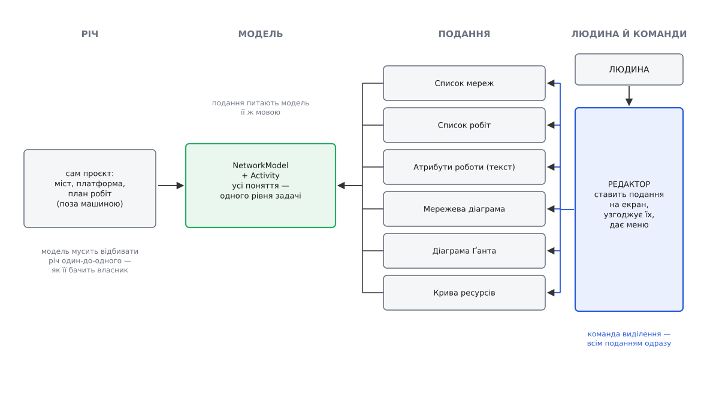
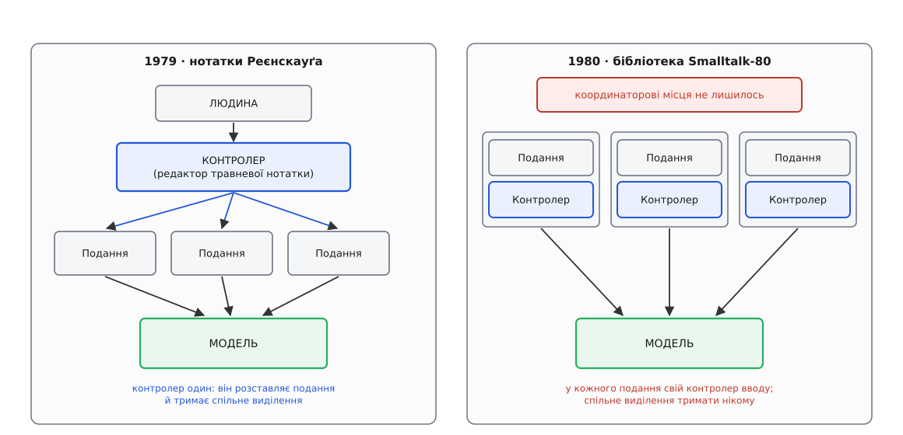

# 📜 Дві нотатки 1979 року: як народився поділ на модель і подання

Поділ інтерфейсу на «те, що застосунок знає» і «те, як він це показує» описано у двох машинописних нотатках, написаних у Xerox PARC із різницею в сім місяців, — і читати їх варто не з поваги до старовини, а тому, що початковий задум був повнішим за три літери, у які його згодом згорнули: у ньому була ще одна роль, без якої десктопний застосунок із кількома вікнами на один документ розсипається й досі.

## Норвежець, що приїхав у PARC із задачею про кораблі

**Трюґве Реєнскауґ (Trygve Reenskaug)** прийшов до графічних інтерфейсів збоку. Його середовищем були великі промислові проєкти — суднобудування, будівництво, планування робіт; свої ідеї про те, як розділити систему на шар предметних служб і шар, звернений до людини, він доповідав ще 1973 року на конференції ICCAS у Токіо, і в пізнішій праці сам посилається на ту публікацію як на першоджерело однієї зі своїх схем. *(Статус: власне свідчення автора з посиланням на друковану доповідь.)*

Задача, яку він носив із собою, звучить дуже по-десктопному. Є один великий об'єкт — проєкт будівництва мосту, електростанції, платформи. Він занадто складний, щоб побачити його одним поглядом. Тому на нього дивляться крізь кілька різних абстракцій одночасно: мережа робіт із залежностями, календарний графік, крива потреби в ресурсах, кошторис. Кожна абстракція підкреслює своє й глушить решту, і жодна не самодостатня — керівник тримає в голові всі разом. Питання Реєнскауґа: **як зробити так, щоб людина відчувала, ніби бачить сам проєкт, а не набір непов'язаних таблиць про нього.**

Ґрунт, на якому це можна було спробувати, з'явився в Пало-Альто. З літа 1978-го до літа 1979-го Реєнскауґ пробув запрошеним науковцем у групі Learning Research Group (LRG) в Xerox PARC. *(Статус: власне свідчення автора, повторене в кількох його текстах.)* Групу вів **Алан Кей (Alan Kay)** з ідеєю **Dynabook** — персонального комп'ютера завбільшки з книжку, з яким дитина працювала б, як із зошитом. Заради цієї ідеї в LRG будували мову **Smalltalk** — систему, де все є об'єктом, що обмінюється повідомленнями, і де вперше в одному місці зійшлися растровий екран, вікна, що перекриваються, і миша з трьома кнопками. Уперше можна було намалювати на екрані будь-що й упіймати натиск у будь-якій точці — і вперше стало болюче очевидно, що для цієї сили немає жодної дисципліни.

## Травнева нотатка: річ, модель, подання, редактор

**12 травня 1979 року** Реєнскауґ пише для LRG внутрішню нотатку на одинадцять сторінок: «THING-MODEL-VIEW-EDITOR — an Example from a planningsystem». У шапці стоїть навіть шлях, за яким її поклали у файловій системі, — це робочий документ для колег, а не стаття. Понять у ньому **чотири**, і в нотатці сказано, що вони відповідають ще ранішій четвірці «реальний світ — Model — view — Tool» із його ж записки про вимоги до Dynabook. *(Статус: обидві назви й посилання взято з тексту самої нотатки; дату записки про Dynabook подають вторинні джерела як 22 березня 1979 року.)*

**Thing (річ)** — те, що обходить людину: міст, мікросхема, чужа стаття, ідея. Річ живе поза комп'ютером, і саме тому вона в назві: конструкція існує, щоб людина мала справу з річчю, а не з бухгалтерією про неї.

**Model (модель)** — за означенням нотатки, діяльне подання абстракції у вигляді даних усередині обчислювальної системи. Далі йдуть дві вимоги, і обидві досі порушують щодня. Перша: між моделлю та її частинами з одного боку й тим світом, **як його бачить власник моделі**, з іншого — має бути відповідність один-до-одного. Модель відбиває не таблиці бази й не структуру файлу, а уявлення людини. Друга: усі вузли моделі мають бути на **одному рівні задачі**; змішувати поняття предметної області з дрібницями реалізації — у нотатці це названо поганим тоном, і приклад наведено вбивчий: не можна класти в одну модель зустріч у календарі й абзац тексту.

**View (подання)** — видиме зображення моделі, яке одні її риси підкреслює, інші приховує; у нотатці воно назване **фільтром показу**. Подання питає в моделі дані **мовою моделі** й може слати їй повідомлення про зміну. Звідси окреме застереження: подання має знати семантику атрибутів, а не їхнє втілення — воно може спитати ідентифікатор і чекати текст, але не має права припускати, що сама модель є текстом.

**Editor (редактор)** — посередник між людиною й **кількома** поданнями одразу. Його робота описана буквально так: поставити на екран потрібний набір подань, розмістити їх, узгодити між собою й дати людині придатну систему команд, наприклад меню, що змінюється залежно від того, що зараз робиться.

## Планувальник: шість вікон в одну модель

Абстракції в тій нотатці не висять у повітрі — за ними стоїть працююча система. Одну `NetworkModel` (мережу робіт, де кожна робота — окремий об'єкт із тривалістю, попередниками й потребою в ресурсах) показують одночасно кілька подань: список мереж, список робіт, текстове зведення атрибутів однієї роботи, мережева діаграма у великих і дрібних символах, діаграма Ґанта, крива ресурсів у часі.


*Розклад травневої нотатки 1979 року: річ лишається поза машиною, модель відбиває її одним рівнем понять, подання беруть із моделі кожне своє, а редактор ставить їх на екран і синхронізує виділення.*

Три деталі цієї реалізації важать більше за самі означення.

**Подання перестало бути вікном.** Список у нотатці — не підклас `Window`, він не вміє сам себе показати й не має власного місця на екрані. Де його рамка й коли прокручуватися, йому каже редактор. Так само з текстом: наявний у Smalltalk редактор абзаца переробили спеціально — кожну дію, яку той раніше робив прямо у відповідь на мишу, замінили на повідомлення, **щоб віджет міг працювати в парі з іншими поданнями через редактор і з різними редакторами**. Це і є сам акт поділу, зроблений руками: у готового елемента забрали право самому реагувати на людину.

**Виділення народилося спільним.** Послідовність описана по кроках: редактор ловить натиск червоної кнопки миші (у Smalltalk кнопки миші звали за кольорами), питає список, на який елемент показали, а тоді просить **цей список і всі інші подання** виділити цей елемент. Виділення від початку належить не поданню, а координаторові — інакше клацнути роботу на діаграмі Ґанта й побачити її ж підсвіченою в мережі просто нічим. Для кривої ресурсів у нотатці навіть обговорено, що на питання «хто тут» вона мала б відповідати множиною робіт, і що добре було б дозволити множинне виділення в усіх поданнях мережі.

**Власний стан подання визнано чесним.** Мережева діаграма — єдиний випадок, де дані подання не виводяться з моделі: розташування символів у моделі не записано, бо це не властивість проєкту, а спосіб на нього дивитися. Тому діаграма тримає координати сама. Розкладку стрілок вона теоретично могла б щоразу перечитувати з моделі, але це надто повільно, і вона кешує. Тобто вже в первинному документі стан поділено на той, що належить моделі, і той, що чесно належить екрану, — з явною причиною для кожного.

Ще одна дрібниця, яка проходить непоміченою: текстове зведення атрибутів має команду «прийняти», по якій воно перевіряє свій вміст і **передає його в модель як оновлення роботи**. Зміна не тече в модель за кожним натиском клавіші; є мить, коли подання свідомо віддає результат.

## Груднева нотатка: як редактор став контролером

Другий документ — «MODELS — VIEWS — CONTROLLERS», **10 грудня 1979 року**, дві сторінки. Між ним і травневим лежать півроку розмов. Сам Реєнскауґ пізніше писав, що найважчим було вигадати добрі назви — «*The hardest part was to hit upon good names*», — і що після довгих обговорень, **особливо з Адель Ґолдберґ (Adele Goldberg)**, однією з провідних постатей групи Smalltalk, він зупинився на трійці «модель — подання — контролер». *(Статус: власне свідчення автора у передмові 2007 року, якою він супроводив скани обох нотаток; незалежного підтвердження з боку інших учасників у відкритому доступі немає.)*

Що змінилося по суті. «Річ» із назви зникла — вона й далі поза машиною, класу для неї не треба. Модель і подання перейшли майже дослівно. А **вхідна роль дістала нове ім'я — контролер, і при цьому лишилася роллю редактора з травневої нотатки**.

Це головне, що втрачають переказами. Грудневий контролер означено як **зв'язок між людиною й системою**, і робить він рівно те, що робив редактор: домагається, щоб потрібні подання показали себе в потрібних місцях екрана, дає людині меню й інші способи давати команди, приймає її дії, перекладає їх у повідомлення — і шле ці повідомлення **поданням**. Не моделі. Модель контролер не чіпає взагалі; з моделлю розмовляють подання.

```
людина → контролер → повідомлення → подання → питання й зміни → модель
                        (розставляє, узгоджує, дає меню)
```

Далі — два заборони й один критерій, і саме вони показують, наскільки задум був точним.

Заборона перша: **контролер не має домальовувати за подання**. Приклад у нотатці буквальний — контролер не сміє з'єднувати подання вузлів стрілками від себе. Якщо на екрані видно лінію, за неї відповідає подання, а не координатор.

Заборона друга: **подання не має знати про ввід** — ні про мишу, ні про клавіші. Усе, що приходить від людини, приходить від контролера у вигляді повідомлення.

І критерій, який робить обидві заборони перевірними: **завжди має бути можливо написати в контролері метод, що шле поданням повідомлення й точно відтворює будь-яку послідовність людських команд**. Тобто інтерфейс мусить бути керованим програмою так само повно, як рукою. Це, по суті, вимога автоматичної тестованості й скриптованості інтерфейсу — сформульована 1979 року й виведена не з моди, а прямо з поділу ролей.

Редактор у грудневій нотатці не помер, а став окремим випадком: **особливим контролером, який дає саме подання**, коли треба щось у ньому змінити. Такий редактор вклинюється в шлях між контролером і поданням, працює, доки триває редагування, а тоді вилучається зі шляху й відкидається. І окремо: брати редактор контролер має **в самого подання** — бо редагування ведеться метафорами того подання, і більше нізвідки взяти його правильно.

## Чому три літери — не те, що було написано

Реалізацію MVC у бібліотеці класів Smalltalk-80 писав уже не Реєнскауґ. За його ж словами, це робили **Джим Алтхофф (Jim Althoff)** та інші після того, як він поїхав із PARC, і в тій роботі він участі не брав. *(Статус: свідчення автора; конкретний внесок у колективну бібліотеку класів точнішому поділу не піддається.)*

У бібліотеці слово «контролер» тихо змінило роботу. Кожне подання дістало **власний парний контролер**, чиє діло — обробляти мишу й клавіатуру саме для цього подання. Це ближче до травневого редактора, ніж до грудневого контролера. А роль, що ставила подання на екран і синхронізувала їх між собою, **імені не отримала й розчинилася**: у трійці для неї місця не лишилося.

Через двадцять із гаком років Реєнскауґ розібрав цю плутанину сам — і зробив це найкоректнішим способом: розписав MVC як мову патернів, де **1979 і 1980 роки стоять як різні патерни з різними іменами**. Розділення моделі й редактора — одне. Розділення вводу й виводу, тобто розчеплення редактора на подання й контролер, — інше, і в його переліку воно так і підписане роком 1980, бо це рішення бібліотеки Smalltalk-80. А те, що було в нотатках 1979 року, називається в нього **інструментом (Tool)**: об'єктом, який набирає потрібні редактори під конкретне завдання людини й узгоджує їх — зокрема тримає спільне виділення. *(Статус: чернетка мови патернів, опублікована автором 2003 року з доповіддю на JavaZONE і JAOO.)*


*Одне ім'я на дві різні конструкції. Праворуч поділ дрібніший і зручніший для віджета, але роль, що узгоджувала подання між собою, зникла — і разом із нею зникло місце, де живе спільне виділення.*

Широкий світ дізнався про MVC уже з другої конструкції: 1988 року **Гленн Краснер (Glenn Krasner)** і **Стівен Поуп (Stephen Pope)** надрукували в журналі JOOP «кулінарну книгу» з використання MVC у Smalltalk-80, і саме вона стала для більшості програмістів першоджерелом. Механізмом, що тримав трійцю вкупі, там був список залежних об'єктів: модель, змінившись, гукає всіх, кого не знає на ім'я, — тобто [спостерігач](topic:sf-apps/observer). Подальша доля самої абревіатури, включно з тим, чим контролер став у вебі, — це вже [окрема історія патерна](topic:sf-apps/mvc).

## Що з цього досі важить

Реєнскауґ згодом гірко зауважив, що трапляються перекручені варіанти MVC, спрямовані на протилежну мету: не дати людині керувати своїми даними, а дати комп'ютерові керувати людиною. Судити про це кожен може сам; а от чотири речі з тих двох сторінок перевіряються в будь-якому сьогоднішньому клієнті.

Модель відбиває уявлення людини, а не схему сховища. Усі поняття моделі — на одному рівні задачі. Подання не володіє правдою і не знає про ввід — воно фільтр показу, а власний стан тримає лише той, якого в моделі немає за суттю. І над поданнями є хтось, хто їх набирає, розставляє й узгоджує, — бо спільне виділення, спільна прокрутка та спільна команда «застосувати» не належать жодному вікну окремо.

**Статус доказовості цієї історії високий.** Обидві нотатки — первинні документи з датами в колонтитулі кожної сторінки; Реєнскауґ сам оприлюднив їхні скани окремим файлом 2007 року з короткою передмовою. Датування, назви й зміст перевіряються за тими сканами безпосередньо. Свідченнями автора, а не документами, підперті дві речі: що назву «контролер» ухвалили після обговорень саме з Адель Ґолдберґ і що реалізацію в Smalltalk-80 робив Алтхофф із колегами вже без нього.
