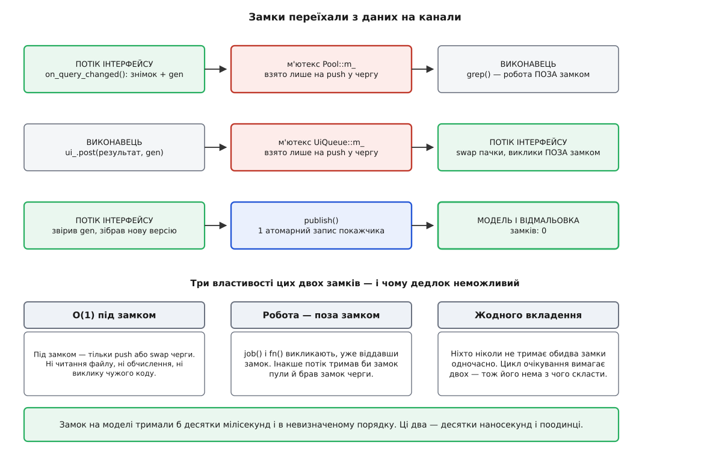
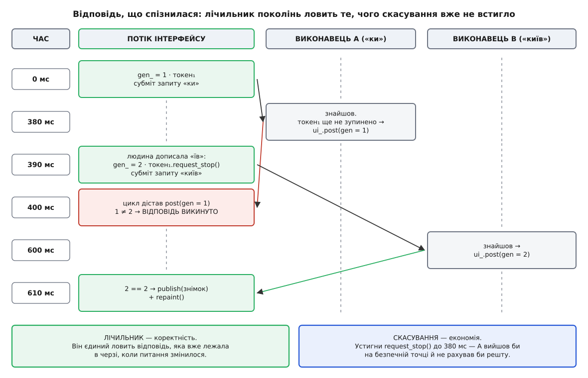

# ⚙️ Кістяк ядра на C++20: черга, пул, скасування, знімок

Це робочий кістяк ядра десктопного застосунку — приблизно сто п'ятдесят рядків C++20, після яких правило «жодного замка на моделі» перестає бути домовленістю, якої треба дотримуватися вручну, і стає властивістю коду. Далі — задача з переліком того, що кістяк мусить уміти, ідея у трьох реченнях, повний текст, який компілюється як є, і розбір: де в ньому лежать єдині два м'ютекси й чому їх звідти не видно з боку даних.

## Задача

Хай застосунок показує документ і фільтр: людина набирає рядок, застосунок шукає його по тексту й підсвічує знайдені рядки. Документ великий — пошук триває сотні мілісекунд. Ядро має витримати шість вимог, і кожна з них перевіряється в готовому коді, а не на слово.

1. Пошук не займає потік інтерфейсу ані на один кадр.
2. Результат повертається в потік інтерфейсу — і тільки туди.
3. Застаріла відповідь не потрапляє на екран навіть тоді, коли вона вже лежить у черзі, а питання встигло змінитися.
4. Скасоване завдання згортається саме, не чекаючи, доки хтось його прикінчить ззовні.
5. Модель читають і пишуть без жодного м'ютекса.
6. Вихід із застосунку не падає й не зависає.

Мірка успіху — текстова: у готовому коді має бути рівно два м'ютекси, обидва всередині черг, і жодного біля даних.

## Ідея

Три речення, з яких випливає решта.

**Перше.** Потік інтерфейсу — єдиний, хто чіпає модель. Усі інші звертаються до неї не прямо, а кладучи в його чергу лямбду: «зроби це, коли дійдеш». Черга виконує їх по одній — тобто взаємне виключення на моделі забезпечене не замком, а тим, що виконавець у неї один. Це той самий [цикл подій](topic:sf-tasks/event-loop), тільки з правом класти в нього роботу ззовні.

**Друге.** Униз, у виконавця, дані йдуть **незмінним знімком** — `std::shared_ptr<const Document>`. Виконавцеві нема чого читати наживо: те, що він тримає, ніхто не змінює, бо змінюваних знімків не буває, а нова версія — це новий об'єкт.

**Третє.** Угору дані повертаються з номером покоління. Сторона інтерфейсу приймає лише той номер, який зараз актуальний, а решту мовчки викидає.

Усе інше — сантехніка: черга з м'ютексом і умовною змінною, кілька потоків, що з неї беруть, і токен скасування, щоб не рахувати те, чого вже не питали.

## Код

```cpp
// core.hpp — ядро десктопного застосунку.
// Збірка: g++ -std=c++20 -pthread   (libstdc++ від GCC 12.1 і новіше)
#include <atomic>
#include <condition_variable>
#include <cstddef>
#include <deque>
#include <functional>
#include <memory>
#include <mutex>
#include <stop_token>
#include <string>
#include <string_view>
#include <thread>
#include <utility>
#include <vector>

// ─── 1. Стан: документ незмінний, версії публікують цілими ──────────────────
struct Document {
    std::string              text;
    std::vector<std::string> matches;
};
using Snapshot = std::shared_ptr<const Document>;

class Model {
public:
    Snapshot snapshot() const { return state_.load(std::memory_order_acquire); }
    void publish(Snapshot next) { state_.store(std::move(next), std::memory_order_release); }

private:
    std::atomic<Snapshot> state_{std::make_shared<const Document>()};
};

// ─── 2. Черга відкладених викликів у потік інтерфейсу ───────────────────────
class UiQueue {
public:
    explicit UiQueue(std::size_t cap) : cap_(cap) {}

    bool post(std::function<void()> call) {              // з БУДЬ-ЯКОГО потоку
        {
            std::lock_guard lk(m_);
            if (closed_ || q_.size() >= cap_) { ++refused_; return false; }
            q_.push_back(std::move(call));
        }
        cv_.notify_one();
        return true;
    }

    void run() {                                         // ЛИШЕ потік інтерфейсу
        for (;;) {
            std::deque<std::function<void()>> batch;
            {
                std::unique_lock lk(m_);
                cv_.wait(lk, [&] { return !q_.empty() || closed_; });
                if (q_.empty()) return;                  // закрито й порожньо — виходимо
                batch.swap(q_);                          // забрали пачку — замок віддали
            }
            for (auto& call : batch) call();             // ← виклики ПОЗА замком
        }
    }

    void close() {
        { std::lock_guard lk(m_); closed_ = true; }
        cv_.notify_all();
    }

    std::size_t refused() const { std::lock_guard lk(m_); return refused_; }

private:
    mutable std::mutex                m_;
    std::condition_variable           cv_;
    std::deque<std::function<void()>> q_;
    std::size_t cap_;
    std::size_t refused_ = 0;
    bool        closed_  = false;
};

// ─── 3. Пул виконавців ──────────────────────────────────────────────────────
class Pool {
public:
    explicit Pool(unsigned n) {
        workers_.reserve(n);
        for (unsigned i = 0; i < n; ++i) workers_.emplace_back([this] { loop(); });
    }
    ~Pool() { close(); }        // тіло — ДО знищення полів; далі workers_ гине першим

    bool submit(std::function<void()> job) {
        {
            std::lock_guard lk(m_);
            if (closed_) return false;
            jobs_.push_back(std::move(job));
        }
        cv_.notify_one();
        return true;
    }

    void close() {
        { std::lock_guard lk(m_); closed_ = true; }
        cv_.notify_all();
    }

private:
    void loop() {
        for (;;) {
            std::function<void()> job;
            {
                std::unique_lock lk(m_);
                cv_.wait(lk, [&] { return !jobs_.empty() || closed_; });
                if (closed_) return;                     // недороблене кидаємо свідомо
                job = std::move(jobs_.front());
                jobs_.pop_front();
            }
            try { job(); } catch (...) {}                // виняток звідси = std::terminate
        }
    }

    std::mutex                        m_;
    std::condition_variable           cv_;
    std::deque<std::function<void()>> jobs_;
    bool                              closed_ = false;
    std::vector<std::jthread>         workers_;   // ОСТАННЄ поле → гине ПЕРШИМ
};

// ─── 4. Застосунок: покоління, скасування, публікація ───────────────────────
class App {
public:
    void run() { ui_.run(); }

    // ↓↓↓ усе нижче викликають ЛИШЕ з потоку інтерфейсу ↓↓↓
    void on_query_changed(std::string query) {
        inflight_.request_stop();                        // попереднє питання зняте
        inflight_ = std::stop_source{};                  // нове питання — новий токен
        unsigned        gen  = ++gen_;                   // звичайний int: потік один
        std::stop_token stop = inflight_.get_token();
        Snapshot        base = model_.snapshot();        // вхід — незмінний знімок

        pool_.submit([this, query = std::move(query), base, gen, stop] {
            std::vector<std::string> found = grep(base->text, query, stop);
            if (stop.stop_requested()) return;           // економія: не турбуємо інтерфейс
            ui_.post([this, base, gen, found = std::move(found)]() mutable {
                if (gen != gen_) return;                 // коректність: відповідь застаріла
                auto next = std::make_shared<Document>(*base);
                next->matches = std::move(found);
                model_.publish(std::move(next));         // публікація — один запис
                repaint();
            });
        });
    }

    void on_close() {
        inflight_.request_stop();   // 1. попросити те, що в польоті, згорнутися
        pool_.close();              // 2. нових завдань не приймати
        ui_.close();                // 3. цикл добіжить і поверне з run()
    }

private:
    static std::vector<std::string> grep(const std::string& text, const std::string& needle,
                                         const std::stop_token& stop) {
        std::vector<std::string> out;
        if (needle.empty()) return out;
        std::size_t from = 0, line = 0;
        for (std::size_t i = 0; i <= text.size(); ++i) {
            if (i != text.size() && text[i] != '\n') continue;
            if ((++line & 0xFF) == 0 && stop.stop_requested()) return {};   // безпечна точка
            std::string_view row(text.data() + from, i - from);
            if (row.find(needle) != std::string_view::npos) out.emplace_back(row);
            from = i + 1;
        }
        return out;
    }

    void repaint() {                        // потік інтерфейсу, замків нуль
        Snapshot s = model_.snapshot();
        draw(*s);                           // s тримає версію живою, доки ми малюємо
    }
    static void draw(const Document&) { /* виклики тулкіта */ }

    Model            model_;
    unsigned         gen_ = 0;
    std::stop_source inflight_;
    UiQueue          ui_{1024};     // гине ДРУГИМ
    Pool             pool_{4};      // гине ПЕРШИМ: приєднає потоки, поки черги ще живі
};
```

Запускається це так: у `main` створюють `App`, малюють вікно, а тоді викликають `app.run()` — і потік `main` стає потоком інтерфейсу до самого виходу. Обробники тулкіта викликають `on_query_changed` і `on_close`; більше ззовні чіпати нема чого.

## Чому тут немає жодного м'ютекса на моделі

Тепер найцікавіше: пройти по коду й переконатися, що замок на даних не «забули», а йому справді нема куди стати.

**Крок 1. Письменник один — і не тому, що ми домовилися.** Єдине місце, де народжується нова версія `Document`, — це три рядки всередині лямбди, поданої в `ui_.post`. Ця лямбда виконується в тілі `UiQueue::run`, у циклі `for (auto& call : batch) call()`. Цикл крутить рівно один потік — той, що викликав `run()`. Отже, скільки б виконавців не надіслали результатів, змінює модель завжди одна нитка й завжди по одному. Взаємне виключення забезпечене не примітивом синхронізації, а топологією: черга — це вузьке горло, крізь яке всі зміни проходять послідовно.

**Крок 2. Читач не бачить того, що змінюють.** Виконавцеві дістається `base` типу `std::shared_ptr<const Document>`. Слово `const` тут не косметичне: воно робить [перегони даних](topic:sf-tasks/data-races-locks) неможливими не за домовленістю, а за системою типів — щоб щось зіпсувати, виконавцеві довелося б зняти `const`, а це видно в рев'ю з відстані. Але головне навіть не в `const`, а в тому, що `publish` ніколи не змінює наявний об'єкт: він створює новий і переставляє покажчик. Тому об'єкт, на який дивиться виконавець, не змінює **ніхто**, а не «ніхто, крім потоку інтерфейсу». Це і є [незмінність](topic:sf-apps/immutability), куплена заради права читати без узгодження.

**Крок 3. Публікація — один запис.** `state_.store(...)` над `std::atomic<Snapshot>` — атомарна операція. Читач у `snapshot()` дістає або старий покажчик, або новий; проміжного стану, у якому покажчик наполовину старий, не буває. Тому відмальовка ніколи не побачить напівзібраної версії — вона побачить або цілу стару, або цілу нову.

Порядок пам'яті тут спеціально виписаний, хоч за замовчуванням був би суворіший. `publish` робить `release`-запис: усе, що записано в `Document` **до** цього запису, стає видимим тому, хто прочитає покажчик `acquire`-читанням. Без цієї пари читач міг би побачити вже новий покажчик і ще старий вміст комірок, на які той вказує — і це не теорія, а звичайна поведінка процесора з переупорядкуванням записів. Механіку пари «звільнити — захопити» розбирає [`std::atomic` і порядок пам'яті](topic:sys-plang-cpp/std-atomic).

Одне зауваження чесності: `std::atomic<std::shared_ptr<T>>` **не обіцяє бути вільним від замків**. Стандарт лишає `is_always_lock_free` для цієї спеціалізації на розсуд реалізації, і це не випадковість: обміняти сам покажчик одним CAS можна, а от узгоджено смикнути ще й лічильник посилань — уже ні, тож поширені реалізації беруть усередині коротке блокування. До початкової біди це не повертає: те внутрішнє блокування триває кілька інструкцій навколо копіювання покажчика, а замок, від якого ми тікали, тримали, поки перебудовується індекс, — десятки мілісекунд і в невідомому наперед порядку. Різниця між ними не в назві, а в трьох порядках величини й у тому, що вкластися одне в одне вони не можуть.

**Крок 4. Лічильник поколінь — звичайний `unsigned`.** `gen_` збільшують у `on_query_changed` і звіряють у лямбді, поданій у чергу. Обидва рази — у потоці інтерфейсу. Тому йому не потрібен ні `std::atomic`, ні замок: він захищений тим самим, чим і модель. Варто було б дати виконавцеві право самому подивитися на `gen_` — і довелося б робити його атомарним, а потім думати про порядок читань. Так і виглядає розкладання архітектури: одна дрібна «зручність» тягне за собою всю машинерію, яку до того вдалося не заводити.

**Крок 5. Два м'ютекси, які є, — не на даних.** `UiQueue::m_` і `Pool::m_` охороняють по одному `deque`. Придивись, скільки часу їх тримають і що під ними роблять.


*Замок на моделі тримали б, поки триває робота. Ці два — рівно стільки, скільки триває `push` або `swap`.*

Під замком відбувається `push_back`, `pop_front` або `swap` — операції з обмеженою вартістю, без вводу-виводу й без обчислень. Ані `job()`, ані `call()` під замком не викликають: у `Pool::loop` завдання витягують у локальну змінну, виходять із блоку — і тільки тоді запускають; у `UiQueue::run` пачку забирають одним `swap` і виконують уже поза замком.

Це не оптимізація, а вимога коректності, і вона видна на двох прикладах. Якби `Pool::loop` викликав `job()`, тримаючи `m_`, то виконавець усередині завдання зробив би `ui_.post` — і взяв би другий замок, не віддавши першого. Якби `UiQueue::run` виконував виклики під своїм замком, то будь-яка лямбда, що захотіла б покласти в чергу ще одну справу (наприклад, «перемалюй на наступному кадрі»), заблокувала б сама себе: звичайний `std::mutex` не рекурсивний, і потік, що вдруге бере власний замок, чекатиме на себе вічно.

Звідси й береться остаточна властивість: **жоден потік ніколи не тримає обидва замки одночасно**. А цикл очікування, без якого [дедлоку](topic:sf-tasks/deadlock) не буває, потрібно з чогось скласти — щонайменше з двох утримуваних ресурсів. Тут їх нема з чого скласти, тому питання «а в якому порядку брати замки» просто не виникає.

Отже, підсумок вимоги «жодного м'ютекса на моделі» звучить точніше, ніж здавалося спочатку: замки нікуди не зникли, вони **переїхали з даних на канали**. На даних замок тримають стільки, скільки триває робота, і в порядку, який залежить від логіки. На каналі — стільки, скільки триває вставка в чергу, і завжди поодинці. Перше не піддається аналізу, друге аналізувати не треба.

## Покоління: чому скасування його не заміняє

У коді дві різні речі захищають від застарілої відповіді, і легко вирішити, що одна з них зайва. Вони не взаємозамінні, і найкоротший спосіб це побачити — прокрутити один сценарій по мілісекундах.


*Скасування спізнилося на десять мілісекунд — відповідь уже лежала в черзі. Викинув її лічильник.*

На нулі людина набрала «ки»: `gen_` став 1, завдання пішло виконавцеві A. На 380-й мілісекунді A дорахував, перевірив `stop.stop_requested()` — ще не скасовано — і поклав результат у чергу інтерфейсу. На 390-й людина дописала «їв»: обробник підняв `gen_` до 2, покликав `request_stop()` на старому токені й відправив завдання B. Але відповідь A **уже в черзі** — `request_stop` спізнився на десять мілісекунд і не має влади над тим, що вже відправлено. На 400-й цикл дістає цю лямбду, порівнює `gen` (1) з `gen_` (2), не збігається — викидає.

Вікно між перевіркою прапорця й потраплянням у чергу закрити не можна: воно є завжди, хай яке вузьке. Тому:

- **лічильник дає коректність** — він єдиний, хто ловить відповідь, що вже летить;
- **скасування дає економію** — якби `request_stop()` встиг до 380-ї, `grep` вийшов би на найближчій безпечній точці й не перебирав решту тексту.

Прибрати лічильник — і на екран час від часу лізтиме результат для старого запиту (рідко, невідтворювано, у клієнта, а не в розробника). Прибрати скасування — і все лишиться правильним, тільки виконавці досушуватимуть роботу, якої ніхто не чекає: при наборі тексту це десятки викинутих пошуків на хвилину й помітно тепліший ноутбук.

Прикметно, що логіка «приймаємо зміну, лише якщо світ під нею не зрушив» — це буквально [оптимістичне блокування](topic:sf-data/optimistic-locking), тільки номер версії їде не в базу разом із записом, а в чергу подій разом із результатом.

Про саму безпечну точку варто сказати окремо. `grep` заглядає в токен раз на 256 рядків, а не на кожному:

```
Перевірка stop_requested()      ≈ 1–2 нс (читання атомарного прапорця)
Обробка одного рядка            ≈ 100 нс
Перевірка на КОЖНОМУ рядку      = +1..2 % до часу пошуку
Перевірка раз на 256 рядків     = +0.006 %
Затримка реакції на скасування  = 256 · 100 нс ≈ 26 мкс
```

Двадцять шість мікросекунд — на чотири порядки менше за кадр, тобто реакція миттєва за будь-якою людською міркою, а ціна перевірки зникає в шумі. Це загальне правило безпечних точок: ставити їх треба там, де вихід залишає стан цілим, і настільки рідко, щоб перевірка не коштувала, але настільки часто, щоб скасування не чекало. Механіку самих токенів C++ описує [`stop_token`](topic:sys-plang-cpp/stop-token).

## Ціна

```
Публікація версії (store)        = 1 атомарна операція над покажчиком
Читання версії (load)            = 1 атомарна операція + інкремент лічильника посилань
Копія кореня Document            = O(розмір кореня); незмінені гілки — спільні
Час під замком черги             = push/pop/swap у deque, O(1)
Час під замком під час роботи    = 0 (job() і call() виконують поза замком)
Замків на моделі                 = 0
Можливих порядків взяття замків  = 1 (двох одразу ніхто не тримає) → дедлоку немає
```

Рядок про копію кореня — єдиний, за яким ховається справжня робота. У кістяку `std::make_shared<Document>(*base)` копіює весь документ, бо `Document` тут — плоска структура з двох полів. У реальному документі на десятки тисяч вузлів так робити не можна: там нову версію будують зі спільним нутром, перевикористовуючи всі незмінені гілки й створюючи заново лише шлях від кореня до зміненого місця. Це той самий прийом, що й [копіювання при записі](topic:sf-algorithms/copy-on-write-structures), і саме він робить публікацію знімків придатною для великих даних, а не тільки для прикладу.

Розмір пулу в `Pool pool_{4}` теж узятий стелею: чотири — розумне число для роботи, що впирається в процесор, і погане для роботи, що впирається в диск чи мережу. Як його рахувати й чому одна відповідь на всі види навантаження не працює — тема [пулу потоків](topic:sf-tasks/thread-pool).

## Пастки

Три помилки, які цей кістяк робить видимими, бо в ньому є рівно ті рядки, у яких вони живуть.

### Захоплення `this` у лямбді, що переживає власника

У коді вище `[this, …]` захоплено двічі, і обидва рази це безпечно — але не «бо так пишуть», а з названої причини, і причина ця в реальному коді майже ніколи не виконується.

Небезпечний варіант виглядає так само, і саме тому проходить рев'ю:

```cpp
void ResultsView::refresh() {                 // ← вікно, яке можна закрити
    pool.submit([this] {
        auto rows = load_rows();              // 400 мс
        ui.post([this, rows] { render(rows); });   // ← а вікна вже нема
    });
}
```

Людина закрила вкладку на 120-й мілісекунді, `ResultsView` знищено, виконавець дорахував на 400-й, лямбда виконалася на 401-й — і `render` викликано на пам'яті, яку вже віддано. У кращому разі це падіння; у гіршому — на тому місці вже живе інший об'єкт, і запис піде в нього, а виявиться це через хвилину в іншому кінці програми.

Чому це трапляється попри те, що всі про це знають: у ручному тесті ніхто не закриває вікно посеред завантаження. Помилка не має шансу проявитися до релізу.

У кістяку `this` — це `App`, і причина, чому захоплення законне, формулюється одним реченням: `pool_` оголошено після `ui_`, тож у деструкторі `App` він гине першим і приєднує потоки, доки черга ще жива; а лямбди, які не встигли виконатися, просто знищуються разом із чергою, ніколи не викликавши `this`. Ось перевірка, яку варто застосовувати до кожного захоплення `this`: **спробуй сказати вголос правило, що гарантує власникові пережити чергу**. Не кажеться — правила нема.

Коли правила нема, беруть слабке посилання:

```cpp
auto weak = weak_from_this();                 // ResultsView : enable_shared_from_this
pool.submit([weak, q] {
    auto rows = load_rows(q);
    ui.post([weak, rows = std::move(rows)]() mutable {
        if (auto self = weak.lock()) self->render(std::move(rows));   // помер — тихо нічого
    });
});
```

`lock()` виконують у потоці інтерфейсу — тобто в тому самому потоці, який єдиний має право знищувати подання. Тому між «перевірив, що живий» і «звернувся» ніхто не встигає його вбити: перевірка й використання не рознесені в часі. Механіка самих слабких посилань — [слабкі й м'які посилання](topic:sf-lang/weak-references) та [`shared_ptr` і `weak_ptr`](topic:sys-plang-cpp/shared-weak-ptr); те, що саме потрапляє в замикання і як довго воно живе, — [лямбди й захоплення](topic:sys-plang-cpp/lambdas-and-captures).

Дрібниця, що вилазить одразу поруч: захоплення переміщуваного, але не копійовного об'єкта в лямбду закриває їй шлях у `std::function`, бо той вимагає копійовності. У C++23 для цього є `std::move_only_function`; до нього обходяться `shared_ptr` на корисне навантаження. Звідки береться сама вимога копійовності — [`std::function` і стирання типу](topic:sys-plang-cpp/std-function-type-erasure).

### Черга без стелі

`UiQueue` приймає `cap` і рахує `refused_`. Спокуса викинути і те, і те — велика: без стелі код на три рядки коротший і ніколи не «губить» повідомлень.

Порахуймо, що буде, коли джерело трохи швидше за споживача. Хай пристрій шле телеметрію, кожен пакет породжує один `post`, а цикл інтерфейсу встигає виконати десь три таких виклики на кадр:

```
Джерело                       = 200 пакетів/с → 200 post/с
Цикл устигає                  = 60 кадрів/с × 3 = 180 викликів/с
Приріст черги                 = 200 − 180 = 20 записів/с
За робочий день (8 год)       = 20 · 3600 · 8 = 576 000 записів
std::function із захопленням  ≈ 64 Б + виділення в купі
Пам'ять                       ≈ 576 000 · 64 Б ≈ 37 МБ
Затримка «подія → показ»      = 576 000 / 180 ≈ 3200 с ≈ 53 хв
```

Двадцять записів на секунду — величина, яку не помітно ні в профілювальнику, ні в тесті на п'ять хвилин. А до вечора застосунок показує телеметрію майже годинної давності й тримає зайві тридцять сім мегабайтів. І він не падає — тому ніхто й не шукає причини; у баг-трекері це буде «під кінець дня чомусь гальмує».

Стеля не рятує від відставання — вона робить його **видимим** і змушує відповісти на питання, від якого код без стелі просто ухиляється: що робити, коли не встигаємо? Законних відповідей три.

**Згорнути.** Для перемальовки це найправильніше: замість класти в чергу тисячу викликів «перемалюй», ставлять прапорець «є брудна ділянка», а раз на кадр цикл малює її один раз. Кількість роботи стає рівно такою, скільки її може побачити око.

**Викинути й порахувати.** Саме для цього в коді є `refused_`. Викинуте повідомлення, якого ніхто не полічив, — це баг, якого ніхто не знайде: симптом (щось не оновилося) відірваний від причини (черга була повна) і в часі, і в місці. Полічене — це рядок у діагностиці, який одразу вказує пальцем.

**Пригальмувати джерело.** Коли зливати не можна — кожен пакет мусить осісти в моделі, — лишається сповільнити того, хто шле: [протитиск](topic:sf-tasks/backpressure-local).

Чого робити **не можна** — це блокувати того, хто кладе, доки не звільниться місце. Виглядає найчеснішим варіантом і вбиває застосунок: у чергу інтерфейсу кладе й сам потік інтерфейсу (обробник, що просить перемалювати на наступному кадрі), а він же її й розбирає. Заблокувати його на повній черзі — значить зупинити єдиного, хто може її спорожнити.

### Забуте приєднання потоків при виході

Найпідступніша з трьох, бо проявляється в момент, коли користувачеві вже байдуже, — і тому роками лишається невиправленою.

Ланцюжок такий: людина закрила вікно, `run()` повернувся, `main` виходить, поля `App` руйнуються — а виконавець у цю мить прокидається й лізе в `ui_.post`, тобто в чергу, пам'ять якої вже віддано. Впаде або ні — питання таймінгу.

C++ бореться з цим трьома способами, і між ними варто розрізняти.

**`std::thread`, знищений без `join()` і без `detach()`, викликає `std::terminate()`.** Виглядає жорстоко, а насправді це найдобріше, що могло статися: програма падає одразу й голосно, замість тихо псувати пам'ять.

**`detach()` «лагодить» це падіння й створює справжнє.** Відв'язаний потік переживає свої дані: він і далі пише в об'єкти, яких уже нема, а під час завершення процесу — ще й у зруйновані глобальні об'єкти. Це найгірший із трьох варіантів і водночас найспокусливіший, бо після нього тест перестає падати.

**`std::jthread` руйнується правильно: його деструктор кличе `request_stop()`, а тоді `join()`.** Саме тому `workers_` у `Pool` — це вектор `jthread`, і саме тому в коді ніде не видно жодного явного `join`. Прив'язку звільнення ресурсу до часу життя об'єкта — той самий принцип, що й тут, — описує [RAII](topic:sf-lang/raii), а самі `thread` і `jthread` — [`thread` і `jthread`](topic:sys-plang-cpp/std-thread-jthread).

Але автоматичне приєднання **не є автоматичною безпекою**, і в кістяку є два рядки, які це доводять.

**Перший — `~Pool() { close(); }`.** Деструктор `jthread` уміє чекати, але не вміє будити. Наші виконавці сплять на `cv_` і прокидаються від `closed_`; якщо не поставити цей прапорець і не покликати `notify_all` до того, як почнуть гинути поля, `~jthread` чесно стане на `join()` і чекатиме вічно — застосунок замість падіння при закритті просто зависне назавжди з невидимим вікном. Тіло деструктора виконується **до** знищення полів — саме тому `close()` встигає.

**Другий — порядок оголошення полів.** `workers_` стоїть у `Pool` останнім, а поля руйнуються у зворотному порядку — тож вектор потоків гине **першим**, і `join()` відбувається, поки `m_`, `cv_` і `jobs_` ще живі. Пересунь `workers_` угору — і потік чекатиме на умовній змінній, деструктор якої вже відпрацював. Компілятор про це не скаже жодного слова, а тест при закритті падатиме раз на двадцять запусків. Те саме правило працює поверхом вище: у `App` поле `pool_` оголошено після `ui_`, тому пул приєднує потоки, доки черга ще ціла.

Складається з цього такий порядок виходу, і кожен його щабель у коді має свій рядок:

```
1. Попросити те, що в польоті, згорнутися   inflight_.request_stop()
2. Перестати приймати нове                  pool_.close()  → submit() віддає false
3. Дати циклу добігти й вийти               ui_.close()    → run() повертає
4. Дочекатися виконавців                    ~Pool → ~jthread → join()   (порядок полів!)
5. Аж тоді руйнувати стан                   ~UiQueue, ~Model
```

Це рівно та сама послідовність, що й [штатне вимкнення](topic:sf-release/graceful-shutdown) серверного процесу; різниця лише в тому, що серверу її пишуть свідомо, а клієнтові — після того, як баг «падає тільки при закритті» набридне вкотре.

## Що з цього кістяка виростає далі

Три природні продовження, кожне з яких вкладається в наявні шви й нічого в них не ламає.

**Помилки виконавця.** Зараз `catch (...) {}` у `Pool::loop` мовчки ковтає виняток — це навмисне спрощення, бо виняток, що вилетів із потоку, означає `std::terminate`. Правильне продовження — упіймати його й відправити нагору тим самим каналом, що й результат: `ui_.post([this, gen, msg]{ if (gen == gen_) show_error(msg); })`. Помилка їде з тим самим номером покоління, що й успіх, і застаріла помилка викидається за тим самим правилом.

**Кілька незалежних питань одночасно.** Один `gen_` на весь застосунок — спрощення прикладу. Щойно паралельно живуть пошук, перевірка орфографії й попередній перегляд, лічильник заводять **на кожен потік запитів окремо**, бо покоління пошуку не має жодного стосунку до покоління орфографії.

**Скасовне редагування.** Якщо `publish` приймає не готову версію, а об'єкт-зміну з методами «застосувати» й «скасувати», той самий список змін дає і [скасування-повтор](topic:sf-apps/undo-redo-command-stack), і журнал для відновлення після краху. Два дорогі бажання виявляються одним механізмом — але лише якщо стан спроєктовано так від початку.

---

**Про версії стандарту.** `std::atomic<std::shared_ptr<T>>` увійшов у C++20 за пропозицією P0718R2 «Revising atomic_shared_ptr for C++20» (Алісдер Мередіт, Bloomberg, 10 листопада 2017); у бібліотеці libstdc++ вона з'явилася в GCC 12.1 і позначена макросом `__cpp_lib_atomic_shared_ptr >= 201711L`. `std::jthread` і `std::stop_token` — це P0660R10, у libstdc++ від GCC 10.1, макрос `__cpp_lib_jthread >= 201907L`. Обидва числа варто перевірити для свого компілятора: якщо `atomic<shared_ptr>` ще нема, його місце тимчасово заступають застарілі в C++20 вільні функції `std::atomic_load`/`std::atomic_store` над `shared_ptr` — інтерфейс інший, зміст той самий.
