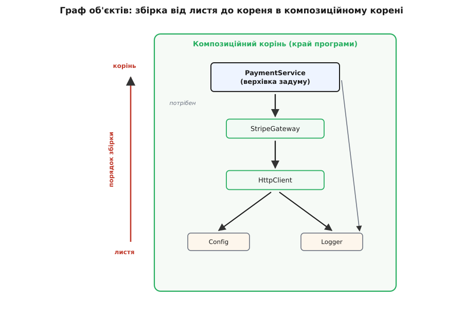
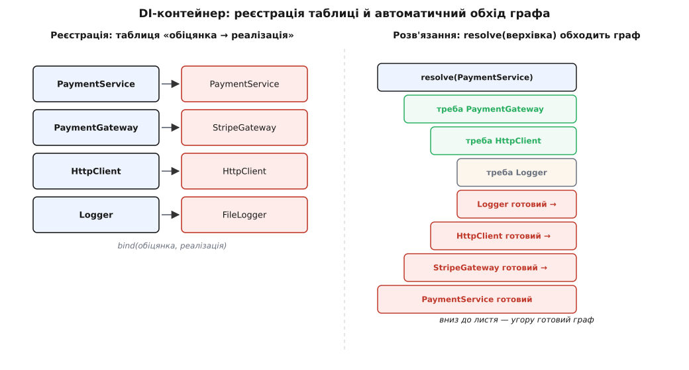

# DI-контейнер і composition root

<preknowlist>
- [Принцип інверсії залежностей (DIP)](topic:sf-apps/dependency-inversion) — чому ядро й деталь мусять обоє спиратися на абстракцію, а не одне на одного; без цього розвороту не постає й питання «а хто ж підставить конкретну реалізацію».
- [Впровадження залежностей та IoC-контейнер](topic:sf-apps/dependency-injection) — сам прийом «прийми залежність ззовні, не створюй усередині»; ця стаття — про те, ДЕ і ЧИМ ту залежність зрештою підставляють.
- [Інтерфейс проти реалізації](topic:sf-apps/interface-vs-implementation) — поділ на обіцянку зовні та її втілення всередині; складати граф об'єктів означає добирати реалізацію під кожну обіцянку.
- [Фабричний метод і абстрактна фабрика](topic:sf-apps/factory-method) — винесення рішення «який саме об'єкт створити» в окреме місце; композиційний корінь — це та сама думка, піднята на рівень цілого застосунку.
</preknowlist>

Коли залежності подають ззовні, кожен клас стає чесним і легким: він каже, що йому треба, приймає це параметром конструктора й не переймається, звідки воно взялося. `PaymentService` просить `PaymentGateway`. Той усередині просить `HttpClient` і `RetryPolicy`. `HttpClient` просить конфіг і логер. Логер просить рівень запису й місце виводу. Кожен окремо — взірець охайності. Але хтось же має нарешті сказати останнє слово: **ось конкретний Stripe, ось справжній HTTP-клієнт, ось файловий логер** — і скласти їх докупи в потрібному порядку. Питання «хто створює й хто зшиває» нікуди не зникло. Воно лише **виштовхнулося назовні**, з нутрощів кожного класу — і тепер його треба десь зустріти.

Придивімося, куди саме воно виштовхнулося. Ядро більше не називає деталі на ім'я — отже, місце, де їх називають, лежить **поза ядром**. Це найзовнішній шар програми, її поріг: `main`, точка входу вебсервера, конструктор кореневого об'єкта застосунку. Тільки там уже дозволено знати геть усе — і які є конкретні реалізації, і в якому порядку їх зчепити. Саме туди осідає весь список рішень «що є що». Ця єдина ділянка, де абстрактний задум програми вперше зустрічається з конкретним набором деталей, має усталену назву — **композиційний корінь (composition root)**, і термін цей [ввів Марк Симан](topic:sf-apps/di-container/hist-di-terms.md) у книжці про впровадження залежностей.

## Граф, а не список

Спокуса — думати про збірку як про короткий перелік: створи те, створи се, передай одне одному. Насправді ж виходить **граф**. `PaymentService` тримає `PaymentGateway`, той тримає `HttpClient` і `RetryPolicy`, `HttpClient` тримає `Config` і `Logger`, `Logger` — ще щось. Об'єкт залежить від об'єктів, які залежать від об'єктів; стрілки «мені потрібен ось цей» сходяться й розгалужуються. Зібрати граф правильно — означає піти **від листя до кореня**: спершу створити те, що ні від чого не залежить, тоді те, що спирається на вже створене, і так шар за шаром угору, аж поки не постане верхівка, заради якої все й затівалося.



*Стрілки «мені потрібен ось цей» сходяться до верхівки. Складати граф означає йти від листя (конфіг, логер) до кореня (сервіс): кожен вузол створюють лише після того, як готові всі, від кого він залежить. Список конкретних імен живе поза ядром — на межі, у композиційному корені.*

Зроблене руками, це виглядає буквально як абзац коду на порозі програми. Кожен рядок — один вузол графа; порядок рядків — це й є обхід від листя до кореня:

:::tabs
```python
def main():
    # ── листя: ні від кого не залежить ──
    config = Config.from_env()
    logger = FileLogger(config.log_path, level=config.log_level)

    # ── середина: спирається на вже створене ──
    http = HttpClient(timeout=config.http_timeout, logger=logger)
    gateway = StripeGateway(http, api_key=config.stripe_key)

    # ── корінь: заради нього все й збирали ──
    payments = PaymentService(gateway, logger=logger)

    run_app(payments)   # запускаємо — граф готовий, ядро не чуло слова «Stripe»
```
```ts
function main() {
  // ── листя: ні від кого не залежить ──
  const config = Config.fromEnv();
  const logger = new FileLogger(config.logPath, config.logLevel);

  // ── середина: спирається на вже створене ──
  const http = new HttpClient(config.httpTimeout, logger);
  const gateway = new StripeGateway(http, config.stripeKey);

  // ── корінь: заради нього все й збирали ──
  const payments = new PaymentService(gateway, logger);

  runApp(payments); // запускаємо — граф готовий, ядро не чуло слова «Stripe»
}
```
:::

Це — увесь композиційний корінь у явному вигляді. Він **великий**, і це нормально: у нього стягнулося все знання про конкретні реалізації, що його ми виполоскали з решти коду. Одне місце знає всі імена — зате всі інші не знають жодного. За можливість підмінити базу, провайдера чи логер, не чіпаючи ядра, платить рівно цей абзац, і платить один раз.

> 🔧 **Навіщо це.** Композиційний корінь варто тримати **одним** і **на самому краю** не з любові до симетрії, а тому, що це відповідь на питання «де в застосунку живуть рішення про інфраструктуру». Коли корінь один, будь-яка зміна залежностей — інший логер для тестового середовища, друга база для звітів, підмінений шлюз для демо — це правка **в одному передбачуваному місці**, а не полювання по всьому коду за схованими `new`. А ще саме тут природно вставити тест наскрізного сценарію: у корені для тесту складаєш той самий граф, але з підробками замість мережі й бази — і ганяєш крізь нього справжню бізнес-логіку за мілісекунди.

## Коли граф розростається — контейнер

Поки вузлів десяток, ручний корінь — найкраще, що є: він явний, його видно очима, він не бреше. Але уяви застосунок, де сервісів дві сотні, і кожен просить три-чотири інших. Ручний абзац розбухає в кількасот рядків, де очима стежиш, чи не забув передати логер у сорок сьомий конструктор, і чи створив базу **раніше** за всіх, хто її просить. Робота ця геть механічна: щоб зібрати `X`, треба спершу зібрати все, що `X` просить у конструкторі, — а це видно **прямо з типів параметрів**. Механічне й видно з типів — отже, це можна доручити машині.

Інструмент, що робить цю роботу, зветься **DI-контейнер** (або IoC-контейнер — «container» тут у сенсі «місткість, що тримає всі складові»). Домовляєшся з ним заздалегідь: «коли хтось попросить `PaymentGateway` — дай `StripeGateway`; коли попросить `Logger` — дай `FileLogger`». Це **реєстрація** — таблиця відповідностей «обіцянка → реалізація». А тоді просиш у контейнера верхівку: `resolve(PaymentService)`. Далі він робить сам те, що ти робив би руками — тільки не збиваючись: дивиться, чого просить конструктор `PaymentService`, бачить `PaymentGateway`, лізе в таблицю, знаходить `StripeGateway`, помічає, що тому треба `HttpClient`, збирає спершу його, і так рекурсивно спускається до листя й піднімається назад, аж поки в руках не опиниться готовий граф.

:::tabs
```python
c = Container()
# ── реєстрація: таблиця «обіцянка → реалізація» ──
c.bind(Logger,          FileLogger)
c.bind(HttpClient,      HttpClient)
c.bind(PaymentGateway,  StripeGateway)
c.bind(PaymentService,  PaymentService)

# ── один запит на верхівку — контейнер сам обійде весь граф ──
payments = c.resolve(PaymentService)   # створив Logger, HttpClient, StripeGateway, PaymentService
run_app(payments)
```
```ts
const c = new Container();
// ── реєстрація: таблиця «обіцянка → реалізація» ──
c.bind(Logger,         FileLogger);
c.bind(HttpClient,     HttpClient);
c.bind(PaymentGateway, StripeGateway);
c.bind(PaymentService, PaymentService);

// ── один запит на верхівку — контейнер сам обійде весь граф ──
const payments = c.resolve(PaymentService); // створив Logger, HttpClient, StripeGateway, PaymentService
runApp(payments);
```
:::

Зверни увагу, що контейнер **не скасовує** композиційний корінь — він **його населяє**. Реєстрація й один виклик `resolve` — це той самий корінь, тільки замість ручного абзацу тепер таблиця правил і машина, що складає граф за ними. Рішення «що є що» так само зібране в одному місці на краю програми; ми лише передоручили нудне сплітання інструментові. Усередині ж контейнер робить ту саму механіку — покроково її видно в [маленькому контейнері, зібраному вручну зі звичайного словника](topic:sf-apps/di-container/proj-hand-rolled-container.md), і там ясно, що ніякого чаклунства немає: це обхід графа за таблицею плюс кеш уже створеного.



*Ліворуч — реєстрація: пласка таблиця «інтерфейс → конкретний тип». Праворуч — розв'язання: запит на верхівку змушує контейнер піти таблицею вглиб, зібрати листя, тоді середину, тоді корінь. Той самий обхід графа, що й уручну, тільки автоматичний.*

## Час життя об'єкта

Одне рішення контейнер не вгадає сам, і його теж задають при реєстрації — **скільки живе створений об'єкт**. Логер зазвичай потрібен один на весь застосунок: скільки б разів його не просили, повертати **той самий** примірник (таку залежність звуть одинаком у межах контейнера). З'єднання з базою — навпаки, часто своє на кожен запит користувача, щоб транзакції не переплуталися. А дрібний обчислювальний помічник без стану можна щоразу створювати **новий**, бо ділити нема чого. Три типові режими — «один на весь застосунок», «один на область (запит/сесію)», «новий щоразу» — і саме контейнер стежить, коли віддати збережений об'єкт, а коли зліпити свіжий. Плутанина тут коштує дорого: віддати одне з'єднання з базою двом одночасним запитам — це стан, що тече між ними, і баг, який відтворюється раз на тисячу.

## Де контейнер кусає

Контейнер — це зручність, а не чеснота, і за зручність є ціна. Найгостріша пастка навіть не в самому контейнері, а в спокусі носити його по всьому коду. Виглядає це так: клас, замість чесно попросити залежності в конструкторі, бере **сам контейнер** і сіпає з нього потрібне зсередини — `container.resolve(Logger)` посеред методу. Ця спокуса має ім'я — **локатор служб (service locator)** — і вона нищить усе, заради чого затівали інверсію. Бо тепер клас **знову бреше** про свої залежності: сигнатура конструктора чиста, а насправді він тягне з контейнера п'ять речей, і побачити це можна лише прочитавши все тіло. Тест уже не підставить підробку через конструктор — доведеться підмінювати глобальний контейнер. Правило просте й тверде: **контейнер згадують рівно в одному місці — у композиційному корені**; глибше в код він не проникає, туди залежності приходять параметрами конструктора, як і без нього.

Друга ціна — рішення з'їжджають з **компіляції** на **запуск**. Ручний корінь не збереться, якщо забув передати аргумент, — помилку видно ще до старту. Контейнер натомість часто зшиває граф уже в рантаймі: забув зареєструвати `HttpClient` — і застосунок падає **при першому** `resolve`, а не при компіляції, іноді вже під навантаженням. Тому зрілі контейнери дають **перевірку графа на старті**: одразу після реєстрації просять пройтися всіма прив'язками й переконатися, що кожну обіцянку є ким виконати, — щоб «нема кому дати `Logger`» вилізло на першій секунді життя процесу, а не на тисячному запиті.

І третя, тонша, — **магія коштує прозорості**. Дивлячись на `resolve(PaymentService)`, ти вже не бачиш очима, що саме створиться і в якому порядку, — це вирішує таблиця десь збоку. Тому й порада виважена: доки корінь малий і зрозумілий, **ручна збірка чесніша за контейнер** — вона явна, її читаєш згори вниз, як звичайний код, і вона ламається на компіляції. Контейнер окупається, коли граф справді великий і одноманітний, а ручний абзац перетворився б на кількасот рядків механічного сплітання. Це рівно те саме застереження, що й скрізь у дизайні: не тягни важкий інструмент, поки [його ще не потребуєш](topic:sf-apps/dry-kiss-yagni) — інверсію залежностей чудово роблять голими руками через конструктор, а контейнер лише автоматизує збірку тоді, коли її стає забагато, щоб тримати в голові.

Тож розділяймо дві речі, які зливаються в одну через слово «контейнер». **Композиційний корінь** — це *місце*: єдина ділянка на краю програми, де абстрактний задум зустрічається з конкретними деталями й де живуть усі рішення «що є що». Він потрібен **завжди**, щойно ти застосував впровадження залежностей, — байдуже, руками чи контейнером. **DI-контейнер** — це *інструмент*, що населяє це місце автоматично, коли граф виріс завеликим для рук. Спершу заведи корінь; контейнер додай тоді — і лише тоді, — коли складати граф уручну стане важче, ніж описати його таблицею.
