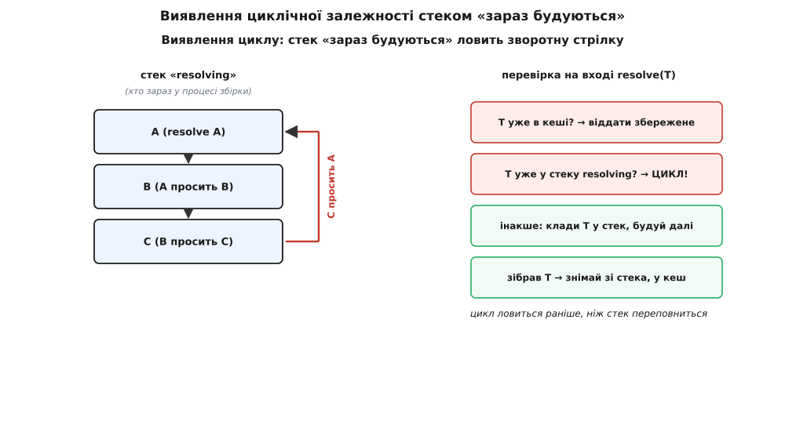

# ⚙️ Свій DI-контейнер зі звичайного словника

Слово «контейнер» звучить так, ніби всередині щось значне: реєстр, життєві цикли, рефлексія, магія. Найкращий спосіб зняти цей острах — зібрати робочий контейнер самому, з нуля, за один вечір, і побачити, що серце в нього — **звичайний словник** (мапа «ключ → значення»), а вся розумність зводиться до **обходу графа за цим словником плюс кеш уже зробленого**. Жодного чаклунства. Коли ти сам напишеш `resolve`, промислові контейнери перестануть бути чорними скриньками: ти дивитимешся на будь-який із них і впізнаватимеш ту саму механіку, тільки обвішану зручностями.

Візьмемо той самий граф, що складають руками у композиційному корені: `PaymentService` тримає `PaymentGateway` і `Logger`; `PaymentGateway` (конкретно — `StripeGateway`) тримає `HttpClient`; `HttpClient` тримає `Config` і `Logger`. Наша мета — попросити верхівку одним рядком, `resolve(PaymentService)`, і отримати готовий, зшитий граф, ні разу не назвавши в тілі програми слова «Stripe».

## Що взагалі має статися

Спершу — вголос проговоримо алгоритм, бо код без цього перетворюється на замовляння. Щоб зібрати будь-який об'єкт `T`, треба:

```
1. дізнатися, ЩО просить конструктор T (список типів-параметрів);
2. для КОЖНОГО параметра — зібрати його так само (крок 1, рекурсивно);
3. коли всі параметри в руках — покликати конструктор T із ними;
4. готовий T — віддати нагору тому, хто його просив.
```

Це — обхід у глибину (depth-first). Він **спускається** гілкою до самого листя — до об'єкта, який нічого не просить (у нас `Config` і `Logger`), — створює його першим, тоді піднімається на крок і створює того, кому цей листок був потрібен, і так далі вгору, аж поки в руках не постане верхівка. Порядок створення виходить сам собою: не «я так розставив рядки», а «рекурсія дійшла до дна й вертається». Це те саме, що робить рука в композиційному корені, коли пише вузли від листя до кореня, — тільки замість руки тепер рекурсія.

Уся хитрість — у кроці 1: **звідки контейнер знає, що просить конструктор?** Тут дороги двох мов розходяться, і саме на цьому місці найкраще видно, чим одна платформа відрізняється від іншої. У Python типи параметрів **живі під час виконання** — їх можна прочитати рефлексією просто з класу. У TypeScript типи існують лише на етапі компіляції й **зникають** до запуску, тож там доведеться список залежностей **оголосити явно**. Тримай цю розбіжність у голові — ми до неї повернемося, бо вона не дрібниця, а сама суть однієї з пасток.

## Найтонший каркас: bind і словник

Почнемо з реєстрації. `bind` не робить нічого розумного — він кладе в словник пару «за цим ключем будувати ось цю реалізацію». Ключ — це обіцянка (інтерфейс, абстрактний клас чи протокол), значення — конкретний клас, який цю обіцянку виконує.

:::tabs
```python
class Container:
    def __init__(self):
        self._bindings = {}   # обіцянка(тип) → реалізація(тип). Оце і є «контейнер».

    def bind(self, promise, impl):
        self._bindings[promise] = impl
        return self           # щоб зчіплювати виклики: c.bind(...).bind(...)
```
```ts
type Ctor<T> = new (...args: any[]) => T;   // «конструктор, що дає T»

class Container {
  // обіцянка(токен) → { реалізація, її залежності }.
  private bindings = new Map<Ctor, { impl: Ctor; deps: Ctor[] }>();

  bind<T>(promise: Ctor<T>, impl: Ctor<T>, deps: Ctor[] = []): this {
    this.bindings.set(promise, { impl, deps });
    return this;              // щоб зчіплювати: c.bind(...).bind(...)
  }
}
```
:::

Уже тут видно розходження, обіцяне вище. Python-версія кладе саму пару «обіцянка → реалізація» й на цьому все: список залежностей вона добуде пізніше, з класу. TypeScript-версія змушена приймати `deps` **третім аргументом** — бо інакше під час виконання їй нема звідки взяти, чого просить конструктор. Це не забаганка автора, а прямий наслідок того, що [типи в TypeScript стираються до запуску](root:sf-apps/type-driven-design): весь апарат типів працює, поки код компілюється, а в готовому JavaScript від нього не лишається й сліду. Промислові контейнери в цьому світі (Angular, InversifySlashtsyringe) обходять стирання декораторами й прапорцем `emitDecoratorMetadata`, який змушує компілятор **записати** типи параметрів у побічну таблицю (`design:paramtypes`), звідки їх потім дістає бібліотека `reflect-metadata`. Ми ж, щоб не тягти залежностей, чесно оголошуємо `deps` руками — і це навіть корисно, бо тримає механіку на видноті.

> 🔧 **Навіщо це.** Той факт, що Python читає залежності сам, а TypeScript вимагає їх продиктувати, — не дрібна незручність синтаксису, а **ціле рішення про архітектуру контейнера**. Він визначає, скільки «магії» ти взагалі можеш собі дозволити. Мова з живими типами під час виконання (Python, C#, Java через рефлексію) дає контейнеру побачити граф самому — тому там контейнери такі «розумні» й такі поширені. Мова, що стирає типи (TypeScript, звичайний JavaScript), або змушує оголошувати граф явно, або мусить генерувати код чи метадані окремим кроком складання. Обираючи бібліотеку DI, першим питай саме це: звідки вона бере залежності — з рефлексії, з декораторів-метаданих чи з ручного опису — бо від відповіді залежить, наскільки крихкою буде збірка й наскільки рано ловитимуться помилки.

## Серце: resolve, що обходить граф

Тепер найцікавіше — `resolve`. Він робить рівно ті чотири кроки з алгоритму вище. Наведу спершу **найпростішу** версію — без кешу, без захисту від циклів, — щоб гола механіка обходу проступила без домішок:

:::tabs
```python
import inspect

class Container:
    def __init__(self):
        self._bindings = {}

    def bind(self, promise, impl):
        self._bindings[promise] = impl
        return self

    def resolve(self, promise):
        # 1. яку реалізацію будувати за цією обіцянкою
        impl = self._bindings.get(promise, promise)   # нема прив'язки — будуємо сам тип

        # 2. що просить конструктор impl — читаємо рефлексією
        sig = inspect.signature(impl.__init__)
        params = [p for name, p in sig.parameters.items() if name != "self"]

        # 3. для КОЖНОГО параметра — рекурсивно зібрати його за типом-анотацією
        args = [self.resolve(p.annotation) for p in params]

        # 4. усі залежності в руках — покликати конструктор
        return impl(*args)
```
```ts
type Ctor<T = any> = new (...args: any[]) => T;

class Container {
  private bindings = new Map<Ctor, { impl: Ctor; deps: Ctor[] }>();

  bind<T>(promise: Ctor<T>, impl: Ctor<T>, deps: Ctor[] = []): this {
    this.bindings.set(promise, { impl, deps });
    return this;
  }

  resolve<T>(promise: Ctor<T>): T {
    // 1. яку реалізацію будувати (нема прив'язки — сам тип, без залежностей)
    const rec = this.bindings.get(promise) ?? { impl: promise, deps: [] };

    // 2+3. deps ми оголосили заздалегідь — рекурсивно збираємо кожну
    const args = rec.deps.map((dep) => this.resolve(dep));

    // 4. усі залежності в руках — покликати конструктор
    return new rec.impl(...args) as T;
  }
}
```
:::

Придивися, де саме тут рекурсія. Рядок `args = [self.resolve(p.annotation) for p in params]` (і його TS-двійник `rec.deps.map(dep => this.resolve(dep))`) — це і є **весь обхід графа**. `resolve(PaymentService)` бачить, що конструктор просить `PaymentGateway` і `Logger`, і кличе `resolve` на кожному; `resolve(PaymentGateway)` бачить `HttpClient` і кличе `resolve` на ньому; `resolve(HttpClient)` бачить `Config` і `Logger` — і так спускається, аж поки не впреться в `Config`, у якого конструктор нічого не просить. Тоді список `params` порожній, `args` порожній, і `Config()` створюється **першим**. Рекурсія починає розкручуватися назад: маючи `Config` і `Logger`, збирається `HttpClient`; маючи його — `StripeGateway`; і врешті — `PaymentService`. Той самий обхід від листя до кореня, що й уручну, лише виписаний як три рядки рекурсії.

Порахуймо, у якому саме порядку викличуться конструктори для нашого графа:

```
resolve(PaymentService)
├─ resolve(PaymentGateway)  →  StripeGateway
│  └─ resolve(HttpClient)
│     ├─ resolve(Config)    →  Config()      ← перший конструктор!
│     └─ resolve(Logger)    →  Logger()
│     ⇒ HttpClient(config, logger)
│  ⇒ StripeGateway(http)
├─ resolve(Logger)          →  Logger()      ← знову Logger (двічі!)
⇒ PaymentService(gateway, logger)            ← останній конструктор
```

Працює. Але дерево вже підказує дві проблеми, які цей наївний варіант не розв'язує, — і саме навколо них будується решта справжнього контейнера.

## Проблема перша: одне листя збирається двічі

Подивись на дерево вище: `Logger` створюється **двічі** — раз для `HttpClient`, раз для `PaymentService`. Наївний `resolve` щоразу ліпить свіжий примірник, бо він не пам'ятає, що вже робив. Часто це якраз **неправильно**: логер зазвичай має бути один на весь застосунок, інакше два різні `Logger` пишуть у той самий файл, кожен зі своїм буфером, і рядки в журналі перемішуються. Це — питання **часу життя** об'єкта, і найпоширеніший режим тут — **одинак** (singleton): скільки б разів об'єкт не просили, віддавати **той самий** примірник.

Ліки прості до сміховинного — **кеш**. Ще один словник: «цей тип уже збирали → ось готовий об'єкт, бери його, не роби нового». Перед тим, як щось будувати, `resolve` зазирає в кеш; після того, як зібрав, — кладе туди результат.

:::tabs
```python
def resolve(self, promise):
    # 0. чи вже є готовий? одинак — віддати збережене, не будувати вдруге
    if promise in self._cache:
        return self._cache[promise]

    impl = self._bindings.get(promise, promise)
    sig = inspect.signature(impl.__init__)
    params = [p for name, p in sig.parameters.items() if name != "self"]
    args = [self.resolve(p.annotation) for p in params]

    obj = impl(*args)
    self._cache[promise] = obj      # запам'ятати — наступний раз повернемо цей самий
    return obj
```
```ts
resolve<T>(promise: Ctor<T>): T {
  // 0. чи вже є готовий? одинак — віддати збережене, не будувати вдруге
  if (this.cache.has(promise)) return this.cache.get(promise) as T;

  const rec = this.bindings.get(promise) ?? { impl: promise, deps: [] };
  const args = rec.deps.map((dep) => this.resolve(dep));

  const obj = new rec.impl(...args) as T;
  this.cache.set(promise, obj);     // запам'ятати — наступний раз повернемо цей самий
  return obj;
}
```
:::

Тепер `Logger` збереться раз: перший `resolve(Logger)` покладе його в кеш, другий — забере звідти. Кеш дає ще й приємний побічний ефект — обхід стає дешевшим: спільне піддерево (те, від чого залежить багато вузлів) обходиться один раз, а не стільки разів, скільки на нього стрілок. Оцей крихітний словник `_cache` — уся реалізація режиму «одинак». Промислові контейнери навколо цієї ж думки надбудовують інші режими: **свій на область** (один на HTTP-запит чи сесію — тоді кеш живе не в самому контейнері, а в дочірньому, «областевому», який народжується на запит і вмирає з ним) і **новий щоразу** (взагалі не кешувати — щоразу свіжий, для дрібних об'єктів без стану). Але серце в усіх трьох одне: кешувати чи ні, і якщо кешувати — то **в якому** кеші.

> 🔧 **Навіщо це.** Кеш перетворює контейнер із простого «фабрикатора» на власника **часу життя** об'єктів — і саме тут ховається найпідступніший клас багів. Віддати один примірник, який тримає стан (кеш, буфер, з'єднання з базою), туди, де його не можна ділити, — і два шматки програми починають топтати спільні дані. Класика: з'єднання з базою, зроблене одинаком, віддається двом одночасним запитам; вони кладуть у нього свої транзакції, транзакції переплітаються, і ти отримуєш баг, що відтворюється раз на тисячу і не ловиться на локальній машині ніколи. Тому режим життя — не дрібна галочка при реєстрації, а рішення про **безпеку в багатопотоковості**: усе, що тримає стан спільно, має бути або справді одне (і потокобезпечне), або своє на кожну область.

## Проблема друга: цикл, що з'їдає стек

Друга біда серйозніша. Уяви, що хтось — свідомо чи ні — зробив так, що `A` просить у конструкторі `B`, `B` просить `C`, а `C` знову просить `A`. Граф перестав бути деревом: у ньому з'явилося **кільце**. Наївний `resolve(A)` піде `A → B → C → A → B → C → …` і крутитиметься, доки не впреться в межу стека рекурсії й не впаде з `RecursionError` (у Python) чи `Maximum call stack size exceeded` (у JS). Повідомлення при цьому — про переповнення стека, а не про справжню причину, і бідолаха, що читає лог, гадатиме на кавовій гущі, замість одразу побачити: «у тебе цикл `A → B → C → A»`.

Циклічна залежність — це майже завжди **знак, що дизайн скособочився**: два (чи більше) класи так міцно тримаються один за одного, що жоден не можна створити без іншого. Правильна відповідь — розірвати кільце (виділити спільну частину в третій об'єкт, від якого залежать обидва; або подавати одну із залежностей не в конструкторі, а пізніше, через метод). Але контейнер зобов'язаний хоча б **чесно й одразу сказати**, що кільце є, а не мовчки з'їсти стек.

Спосіб виявити цикл рівно той самий, яким шукають цикли в будь-якому обході графа в глибину: тримати **стек** тих, хто **зараз у процесі збірки** (їх ще називають «сірими» вузлами — почали, але не закінчили). Входячи в `resolve(T)`, кладемо `T` на цей стек; виходячи — знімаємо. Оскільки рекурсія суворо доходить до дна й вертається, знімати завжди доводиться **верхній** елемент — тим стек і зручний. Якщо ж, входячи, ми бачимо, що `T` **уже** на стеку, — це означає, що ми повернулися до вузла, збірку якого ще не завершили, тобто пройшли по кільцю; а сам стек знизу вгору — це вже готовий ланцюжок кільця для повідомлення. Ось воно, кільце, спіймане на вході, ще до того, як стек рекурсії переповнився.



*Стек тримає тих, чия збірка почалася, але не завершилася. Зворотна стрілка до вузла, що вже у стеку, — це і є цикл; він ловиться на вході в resolve, набагато раніше, ніж рекурсія переповнить стек. Той самий прийом «сірих вузлів», яким шукають цикли в будь-якому обході графа в глибину.*

Зберемо все докупи — кеш і виявлення циклу — в остаточний варіант. Це вже цілком робочий іграшковий контейнер; додати до нього нема чого, крім зручностей.

:::tabs
```python
import inspect

class Container:
    def __init__(self):
        self._bindings = {}      # обіцянка → реалізація
        self._cache = {}         # обіцянка → готовий одинак
        self._building = []       # стек тих, хто ЗАРАЗ будується (для лову циклів)

    def bind(self, promise, impl):
        self._bindings[promise] = impl
        return self

    def resolve(self, promise):
        # кеш: уже зібраний одинак — віддати, не будувати вдруге
        if promise in self._cache:
            return self._cache[promise]

        # цикл: цей тип уже будується вище по стеку — ми повернулися по кільцю
        if promise in self._building:
            chain = " → ".join(t.__name__ for t in self._building) + f" → {promise.__name__}"
            raise RuntimeError(f"Циклічна залежність: {chain}")

        self._building.append(promise)       # поклали на стек: почали будувати
        try:
            impl = self._bindings.get(promise, promise)
            sig = inspect.signature(impl.__init__)
            params = [p for name, p in sig.parameters.items() if name != "self"]
            args = [self.resolve(p.annotation) for p in params]   # ← рекурсія: обхід графа
            obj = impl(*args)
        finally:
            self._building.pop()             # зняли зі стека хоч би що (навіть на помилці)

        self._cache[promise] = obj           # запам'ятали одинак
        return obj
```
```ts
type Ctor<T = any> = new (...args: any[]) => T;

class Container {
  private bindings = new Map<Ctor, { impl: Ctor; deps: Ctor[] }>();
  private cache = new Map<Ctor, unknown>();
  private building: Ctor[] = [];             // стек тих, хто ЗАРАЗ будується

  bind<T>(promise: Ctor<T>, impl: Ctor<T>, deps: Ctor[] = []): this {
    this.bindings.set(promise, { impl, deps });
    return this;
  }

  resolve<T>(promise: Ctor<T>): T {
    // кеш: уже зібраний одинак — віддати
    if (this.cache.has(promise)) return this.cache.get(promise) as T;

    // цикл: цей тип уже будується вище по стеку
    if (this.building.includes(promise)) {
      const chain = [...this.building, promise].map((t) => t.name).join(" → ");
      throw new Error(`Циклічна залежність: ${chain}`);
    }

    this.building.push(promise);             // поклали на стек: почали будувати
    let obj: T;
    try {
      const rec = this.bindings.get(promise) ?? { impl: promise, deps: [] };
      const args = rec.deps.map((dep) => this.resolve(dep));   // ← рекурсія: обхід графа
      obj = new rec.impl(...args) as T;
    } finally {
      this.building.pop();                   // зняли зі стека хоч би що
    }

    this.cache.set(promise, obj);            // запам'ятали одинак
    return obj as T;
  }
}
```
:::

Зверни увагу на `try/finally` навколо збірки: елемент зі стека `_building` треба зняти **навіть якщо всередині щось упало**, інакше після першої ж помилки тип назавжди застрягне на стеку, і кожен наступний, цілком законний `resolve` того типу хибно кричатиме про цикл. Дрібниця, яку легко проґавити, а вилазить вона підступно — уже потім, на іншому запиті.

Прокрутимо в голові патологічний випадок `A → B → C → A`:

```
resolve(A):  A нема в кеші, нема в _building → кладу A у _building, будую
  resolve(B):  кладу B у _building, будую
    resolve(C):  кладу C у _building, будую
      resolve(A):  A ВЖЕ у _building!  → RuntimeError("Циклічна залежність: A → B → C → A")
```

Замість мовчазного переповнення стека — точне повідомлення з іменами всього кільця. Різниця між «щось десь зациклилося» о третій ночі й «ось три класи, що тримають одне одного» — це різниця між годиною марних здогадів і хвилинною правкою.

## Повний приклад, що справді запускається

Зберемо кінець-у-кінець на Python — з несправжніми, але реальними класами, щоб було видно, що це не псевдокод, а робочий код (контейнер узято з варіанта вище):

```python
# ── «інфраструктура»: несправжня, але поводиться чесно ──
class Config:
    def __init__(self):                       # листок: нічого не просить
        self.log_path = "/var/log/app.log"

class Logger:
    def __init__(self):                       # листок
        self.lines = []
    def info(self, msg): self.lines.append(msg)

class HttpClient:
    def __init__(self, config: Config, logger: Logger):
        self.config, self.logger = config, logger

class StripeGateway:
    def __init__(self, http: HttpClient):
        self.http = http
    def charge(self, cents): self.http.logger.info(f"charge {cents}")

class PaymentService:
    def __init__(self, gateway: StripeGateway, logger: Logger):
        self.gateway, self.logger = gateway, logger
    def pay(self, cents):
        self.gateway.charge(cents)
        self.logger.info("paid")

# ── композиційний корінь: реєстрація + один resolve на верхівку ──
c = (Container()
     .bind(HttpClient,     HttpClient)
     .bind(StripeGateway,  StripeGateway)
     .bind(PaymentService, PaymentService))

payments = c.resolve(PaymentService)          # обійшов увесь граф, зібрав від листя до кореня
payments.pay(500)

# ── доказ, що Logger — ОДИН на весь граф (кеш спрацював) ──
assert payments.logger is payments.gateway.http.logger    # той самий примірник!
print(payments.logger.lines)   # ['charge 500', 'paid'] — обидва рядки в ОДНОМУ журналі
```

Тут `Config` і `Logger` навіть не довелося прив'язувати: наївне правило «нема прив'язки — будуй сам тип» їх покриває, бо вони конкретні й самодостатні. `assert` наприкінці — не прикраса, а власне доказ роботи кешу: якби кеш не спрацював, `PaymentService` і `HttpClient` дістали б **різні** логери, `is` повернув би `False`, і рядки `charge 500` та `paid` розповзлися б по двох окремих журналах. А так вони в одному — саме тому, що `resolve(Logger)` вдруге повернув збережений примірник.

## Чого тут навмисно немає — і що це коштує

Іграшка на те й іграшка, що зумисне пропускає все, за що промислові контейнери беруть свою складність. Варто чесно назвати пропущене — бо кожен пропуск відповідає реальній ціні, яку ти заплатиш, якщо спробуєш цим кодом обійтися всерйоз:

- **Прив'язка до значення, а не лише до типу.** Наш `bind` уміє «обіцянка → клас». А що, як реалізацію не можна просто `new`-нути — її треба зібрати особливо (прочитати ключ із середовища, покликати асинхронну ініціалізацію)? Справжні контейнери приймають **фабрику** — функцію, що сама будує об'єкт, — а не лише клас. Додати це — рядків п'ять: зберігати у словнику не тільки клас, а й опційно `callable`, і в `resolve` кликати його замість конструктора.
- **Кілька реалізацій однієї обіцянки.** Що, як `Logger` треба **файловий** у бойовому середовищі й **консольний** у тестах? Наш плаский словник тримає рівно одну прив'язку на ключ. Контейнери дають іменовані чи позначені прив'язки, профілі середовищ, умовну реєстрацію — і саме тут таблиця «ключ → значення» починає обростати структурою.
- **Області життя.** У нас режим рівно один — одинак у межах контейнера (усе осідає в `_cache`). Немає ні «свій на запит», ні «новий щоразу». Це серйозне обмеження: вебзастосунок без області-на-запит або тече станом між запитами, або взагалі не зможе тримати те, що мусить бути своє на кожного користувача.
- **Перевірка графа на старті.** Наш контейнер ловить проблему **аж коли** до неї дійде обхід: забув зареєструвати чи оголосити залежність — дізнаєшся при `resolve`, у рантаймі, іноді вже під навантаженням. Зрілі контейнери дають прогнати всі прив'язки одразу після реєстрації й переконатися, що кожну обіцянку є ким виконати, — щоб «нема кому дати `Logger`» вилізло на першій секунді життя процесу, а не на тисячному запиті.

Останній пункт варто підкреслити, бо він — не про нашу іграшку, а про **природу контейнерів узагалі**. Ручна збірка в композиційному корені ламається на **компіляції** (у типізованій мові) чи бодай на старті: забув аргумент — програма не збереться, крапка. Контейнер натомість зшиває граф **у рантаймі** й тому зсуває цілий клас помилок із «не компілюється» на «падає під час роботи». Це фундаментальний розмін: ти купуєш автоматичну збірку великого графа ціною того, що частина помилок тепер ловиться пізніше. Тому й порада виважена — доки граф малий і читається очима згори вниз, [ручний композиційний корінь чесніший за контейнер](root:sf-apps/dependency-inversion): він явний і ламається рано. Контейнер окупається, коли ручний абзац перетворився б на кількасот рядків механічного сплітання, — і тоді ти вже знаєш, що всередині нього не магія, а рівно оці кілька десятків рядків, які щойно написав сам: словник, рекурсія, кеш і стек «зараз будуються».
