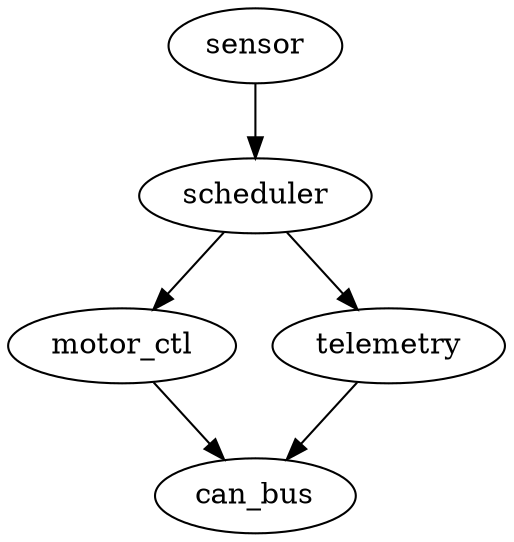
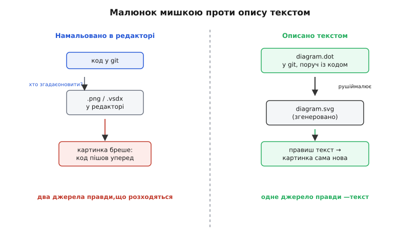
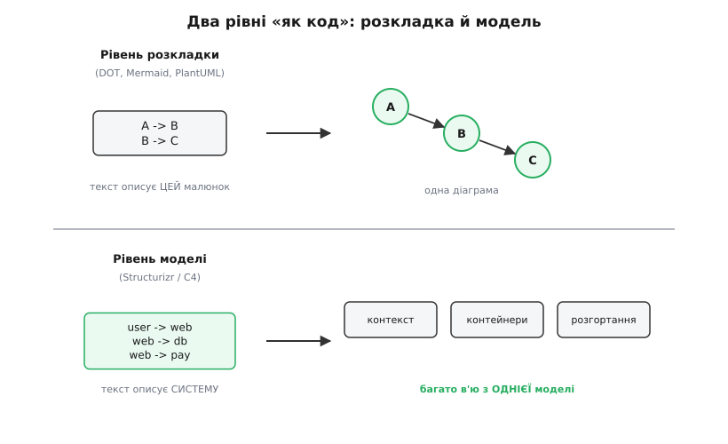
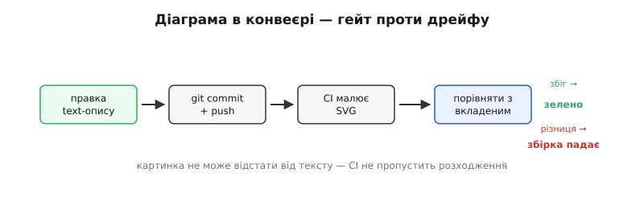

# Діаграми як код

<preknowlist>
- [Контроль версій і git](topic:sf-release/version-control) — як текст живе в репозиторії: коміти, гілки, історія змін, злиття.
- [Рев'ю коду](topic:sf-release/code-review) — розбір змін перед вливанням: читання diff, зауваги, згода на злиття.
- [Архітектурні в'ю](topic:sf-apps/architecture-views) — одна система, показана з різних боків (логіка, процеси, розгортання); діаграма — картинка одного в'ю.
</preknowlist>

Намалюй архітектуру системи в редакторі діаграм — і вже за місяць вона брехатиме. Не тому, що ти лінивий чи недбалий, а через прикру механіку: код рухається щодня, а картинка лежить у якомусь `.png`, за оновлення якого ніхто не відповідає особисто. Додали чергу повідомлень між сервісами — код це знає, а на діаграмі її нема. Прибрали проміжний кеш — код це знає, а на діаграмі він досі красується. Кожна така дрібна розбіжність накопичується, і настає день, коли новачок дивиться на гарну кольорову схему, будує за нею модель системи в голові — і ця модель хибна. Гірше за відсутню діаграму лише та, що впевнено бреше.

Корінь біди видно, щойно назвати його прямо: **картинка і код — це два окремі джерела правди, і вони неминуче розходяться.** Синхронізувати їх руками означало б після кожної зміни архітектури згадати про схему, відкрити редактор, посунути прямокутники, зберегти, перезалити. Люди так не роблять — не зі зла, а бо це окрема втомлива робота, відірвана від коду, і її завжди легше відкласти. А що відкладається завжди, те не робиться ніколи.

## Ідея: описати діаграму текстом, а картинку хай малює машина

Вихід — прибрати одне з двох джерел правди. Якщо картинку не малювати руками, а **описувати текстом**, з якого її щоразу генерує програма, то правда лишається одна: цей текст. Сама картинка стає похідною — як зкомпільований бінарник із сирців. Її не бережуть і не правлять; її **щоразу вирощують заново** з опису.

Ось найпростіший опис графа мовою DOT — тим самим текстом, з якого рушій намалює вузли й стрілки:



П'ять рядків замість години совання прямокутників мишкою — і, головне, **розкладку рахує машина**: сама розставить вузли, проведе стрілки, не даси їм налізти одне на одне. Ти кажеш *що з чим зв'язане*, а *де це намалювати* — турбота рушія. Мова DOT і її рушій народилися в дослідницькому підрозділі AT&T (колишні Bell Labs) — попередник з'явився близько 1988-го, а технічний звіт «Drawing graphs with dot» вийшов у вересні 1991-го (усталений факт). [Історія мов діаграм-як-код](topic:sf-apps/diagrams-as-code/hist-diagram-tools.md) — окрема оповідь про те, як від графового рушія AT&T дійшло до Mermaid, PlantUML і моделей C4.

Різниця з мальованою схемою не косметична, а принципова. Текст **лягає в git поруч із кодом** — у той самий репозиторій, у той самий коміт. Змінюєш архітектуру — правиш `firmware.dot` у тому ж пул-реквесті, що й код. Тепер розбіжність між картинкою й реальністю не «накопичується тихо»: вона стає **видимою правкою**, яку видно на рев'ю. А те, що видно на рев'ю, вже не проґавиш мовчки.


*Дві дороги від задуму до картинки. Мальована схема (ліворуч) — друге джерело правди: код іде вперед, а `.png` лишається позаду, і врешті картинка бреше. Текстовий опис (праворуч) робить джерело правди одним: правиш текст — картинка народжується заново, розходитися нема чому.*

> 🔧 **Навіщо це.** У прошивці архітектура — це як задачі ділять час і хто на якій шині говорить. Опиши цю структуру текстом поруч із кодом драйверів — і коли ти переносиш телеметрію з тієї самої шини, де йдуть команди мотора, ти правиш і код, і рядок у діаграмі в одному коміті. Через рік, коли забудеш, чому стоп-сигнал іде окремим каналом, схема покаже правду, а не те, як було на старті проєкту, — бо їй фізично нема як відстати від коду.

## Що це насправді дає: diff, рев'ю, версія

Коли діаграма — текст, вона підхоплює все, що інструменти вже вміють робити з текстом, і безкоштовно. Це не приємний бонус, а власне сенс підходу, тож варто пройти по цих здобутках механізмом, а не списком.

Перше — **diff**. Порівняти дві картинки годі: око не скаже, що змінилося між двома `.png`, окрім грубих зсувів. А `git diff` двох версій `.dot` покаже точно: додався рядок `scheduler -> watchdog`, зник рядок `telemetry -> sd_card`. Зміна архітектури стає читабельною, як зміна коду, — рядок додано, рядок прибрано.

Друге виростає прямо з першого — **рев'ю**. Раз є diff, архітектурну зміну можна [рецензувати](topic:sf-release/code-review) тим самим потоком, що й код: колега бачить у пул-реквесті новий зв'язок між модулями, ставить питання «а чому телеметрія тепер пише в SD-карту прямо, повз планувальник?» — і розмова про структуру відбувається **до** злиття, поки її дешево виправити. З мальованою схемою такої розмови не буває: її оновлюють (якщо взагалі) окремим тихим комітом «update diagram», який ніхто не читає.

Третє — **версія й історія**. Схема тепер має минуле: можна відкотитися до вигляду системи піврічної давнини, побачити, коли й у якому комку додався той злощасний зв'язок, звести діаграму до конкретного релізу. Картинка перестає бути завжди-тільки-теперішньою; вона отримує ту саму пам'ять, що й код, бо живе в тій самій історії git.

І над усім цим — **єдине джерело правди**. Не «код і десь іще схема», а один текст, з якого росте картинка. Розходитися нема чому: немає другого місця, де правда могла б застаріти.

## Два рівні «як код»: розкладка й модель

Тут ховається розрізнення, через яке легко перечепитися, бо словосполучення «діаграми як код» накриває дві різні за глибиною речі.

Перший рівень — **розкладка як код** (англ. *layout* — розташування). Твій текст описує **одну конкретну картинку**: оці вузли, оці стрілки між ними. Саме так працюють DOT, [Mermaid](topic:sf-apps/diagrams-as-code/comp-text-diagram-langs.md) і PlantUML: рядок `A -> B` означає «намалюй стрілку від A до B на цій діаграмі». Хочеш другу діаграму тієї самої системи з іншого боку — пишеш **другий окремий опис**. Текст прив'язаний до малюнка один-до-одного.

Другий рівень глибший — **модель як код**. Тепер текст описує не картинку, а **саму систему**: які в ній є люди, системи, контейнери, і хто з ким говорить. Це опис **семантики** (гр. *sēmantikós* — значеннєвий), а не геометрії. З однієї такої моделі рушій малює **багато різних діаграм**: загальний контекст, внутрішні контейнери, розгортання — усі з єдиного джерела, усі гарантовано узгоджені між собою, бо виросли з однієї моделі. Правиш модель — оновлюються всі в'ю разом. Найвідоміший представник — [Structurizr](topic:sf-apps/diagrams-as-code/comp-structurizr-c4.md), інструмент Саймона Брауна під його ж [модель C4](topic:sf-apps/c4-model), яка розкладає систему на чотири рівні масштабу.


*Два рівні того самого підходу. Розкладка як код (угорі) описує один малюнок — інша діаграма потребує іншого тексту. Модель як код (унизу) описує систему як сутності й зв'язки, і рушій вирощує з неї багато узгоджених в'ю. Перший рівень простіший і швидший на щодень; другий тримає велику архітектуру несуперечливою, бо всі картинки походять з одного джерела.*

Різниця не в тому, що одне краще. Розкладка як код — легка, миттєва, ідеальна для однієї схеми в README чи для послідовності викликів у пул-реквесті. Модель як код важча на вхід, зате не дасть трьом діаграмам однієї системи тихо розійтися між собою — бо вони не три джерела, а одне. [В'ю системи як окремий спосіб думати](topic:sf-apps/architecture-views) — тісно пов'язана тема: модель-як-код і є машинним утіленням ідеї, що одну систему показують з кількох боків.

## Робочий приклад: діаграма, яку не обдуриш

Візьмімо конкретну прошивку й опишімо її потік мовою Mermaid — популярною тим, що її розуміє GitHub прямо в тексті `.md`. Хай контролер читає давач, планувальник роздає час, керування мотором і телеметрія обидва пишуть у шину CAN:

```
graph LR
    sensor[Давач] --> sched[Планувальник]
    sched --> motor[Керування мотором]
    sched --> tlm[Телеметрія]
    motor -->|команди| can[Шина CAN]
    tlm -->|телеметрія| can
```

Читається як звичайний текст: `sched --> motor` — планувальник живить керування мотором; підпис `|команди|` на стрілці каже, що саме тече каналом. GitHub намалює це прямо в описі пул-реквесту — код рецензента побачить стрілки, а не сирий текст.

Тепер найцінніше. Уяви, що інженер **переносить телеметрію на ту саму шину пріоритетно з командами** — раніше вони йшли роздільно, а тепер конкурують. У коді це кілька рядків у драйвері. У діаграмі це один змінений рядок:

```
    tlm -->|телеметрія| can_shared[Спільна шина CAN]
    motor -->|команди 🔴| can_shared
```

І ось у чому сила: цю зміну **видно на рев'ю тим самим оком, що читає код**. Рецензент бачить, що команди мотора й потік телеметрії тепер в'їхали на одну шину, і ставить питання — «а команда стопу не застрягне за пакетом телеметрії під піком?» — поки правку ще можна відкотити. З мальованою схемою цей ризик проліз би мовчки: код змінили, картинку забули, розмови не сталося. Опис-текст перетворив архітектурну зміну на **предмет рев'ю** — а це і є місце, де ловлять найдорожчі вади, ті, що сидять у структурі.

## Гейт у конвеєрі: картинці нема як відстати

Є ще одна пастка, яку варто закрити. Навіть із текстовим описом хтось може згенерувати `.svg` один раз, вкласти в документацію — і далі правити текст, забуваючи перегенерувати картинку. Тоді розходження вертається чорним ходом: текст свіжий, а вкладена картинка стара.

Ліки — доручити генерацію не людині, а **конвеєру складання** (англ. *CI* — *continuous integration*, безперервна інтеграція). Правило просте: на кожному пуші CI сам малює `.svg` з тексту й **порівнює з тим, що лежить у репозиторії**. Збіглося — збірка зелена. Різниця — збірка падає з вимогою перегенерувати. Тепер картинка **фізично не може** відстати від опису: конвеєр не пропустить коміт, де вони розійшлися.


*Діаграма як крок конвеєра. CI щоразу малює картинку з тексту й звіряє з вкладеною: розходження валить збірку. Це та сама ідея, що й перевірка, чи скомпілювався код, — тільки перевіряють узгодженість картинки з її джерелом. Дрейф стає неможливим не завдяки дисципліні людей, а завдяки автоматичному гейту.*

Це окремий випадок ширшої ідеї — [фітнес-функції](topic:sf-apps/fitness-functions): автоматичної перевірки, що система тримає потрібну властивість. Тут властивість — «діаграма відповідає своєму джерелу», і гейт стереже її замість людської пам'яті, на яку не можна покластися.

> 🔧 **Навіщо це.** Дисципліна «не забудь оновити схему» не працює — забувають усі й завжди. А гейт у конвеєрі не забуває ніколи: він або пропускає узгоджену картинку, або валить збірку. Ти переносиш турботу з ненадійної людської уваги на надійну машину — і це та сама причина, чому код проганяють через збірку автоматично, а не сподіваються, що «воно скомпілюється».

## Де підхід чесний, а де ламається

Аналогія «діаграма — це зкомпільований бінарник, а текст — його сирці» точна рівно доти, доки пам'ятаєш, **де вона тріщить**.

Перша тріщина — **розкладку рахує машина, і не завжди так, як ти хочеш**. Рушій розставить вузли за своїм алгоритмом; якщо тобі кров з носа треба, щоб цей блок був саме зліва вгорі, а стрілка йшла саме отак дугою, — воюватимеш із автомату, а не намалюєш вільною рукою. Для схеми, де важлива точна композиція (плакат, ілюстрація в статті), редактор мишкою досі кращий. Діаграма-як-код виграє там, де важить **правда й свіжість**, а не мистецька розкладка.

Друга — **великі діаграми однак нечитабельні**, з тексту вони чи з мишки. Опиши текстом сотню вузлів — рушій намалює павутину, у якій нічого не видно. Порятунок не в інструменті, а в дисципліні: багато **дрібних** діаграм замість однієї величезної, кожна на своєму рівні масштабу. Тут якраз і виграє модель-як-код: з однієї моделі рушій нарізає кілька дрібних узгоджених в'ю замість одного нечитабельного клубка.

Третя — **вхідний поріг**. Мова опису — це ще одна мова, яку команда має вивчити; спершу писати текст повільніше, ніж кинути прямокутник мишкою. Поріг окупається лише там, де діаграма **житиме довго й мінятиметься** разом із кодом. Для одноразового накиду на серветку текстовий опис — зайвий обряд; малюй як завгодно.

І остання, найтихіша: **текст описує структуру, а не пояснює її**. Діаграма-як-код чесно покаже, *що з чим зв'язане*, але не скаже, *чому* саме так — чому стоп поза чергою, чому база синхронна. Це рішення й їхні причини живуть не в діаграмі, а в [журналі архітектурних рішень](topic:sf-apps/architecture-decision-records). Діаграма-як-код і журнал рішень — пара: одна тримає завжди-свіжу картину структури, другий — обґрунтування, чому вона така. Картинка без обґрунтування показує форму, але мовчить про сенс; разом вони дають і те, і те, і обидва живуть у git поруч із кодом, який описують.
