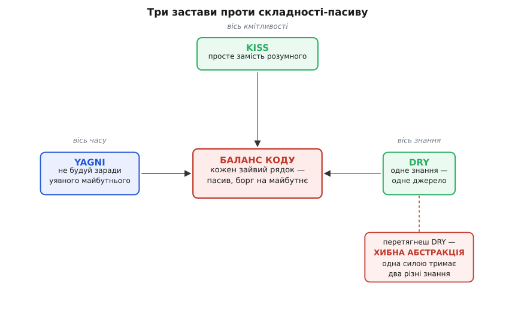

# YAGNI, DRY, KISS: складність як борг

<preknowlist>
- [Технічний борг і вартість зміни](root:sf-apps/technical-debt) — чому недоладний код збільшує ціну кожної наступної правки, а не лише поточної.
- [Принцип абстракції в програмуванні](root:sf-apps/abstraction-principle) — що таке абстракція, як вона ховає деталь за іменем і що коштує її ввести.
- [Зчеплення і зв'язність](root:sf-apps/coupling-cohesion) — коли два шматки коду справді залежать один від одного, а коли лише випадково схожі.
</preknowlist>

Три коротких гасла — **YAGNI**, **DRY**, **KISS** — повторюють на кожному рев'ю коду так часто, що вони встигли стертися до порожніх слоганів. А під ними — одна й та сама тверда думка, і варто її розкопати, бо вона змінює те, як приймаєш рішення щодня. Думка така: **кожен рядок коду — це не актив, а пасив.** Не «зроблена робота», за яку тобі дякують, а вантаж, який хтось нестиме, поки програма жива: читатиме його, тестуватиме, оновлюватиме, обходитиме в налагодженні. Тому найдешевший, найнадійніший, найшвидший рядок — той, якого нема. Усі три принципи — це різні кути того самого питання: **як не написати зайвого і як не перетворити потрібне на тягар.**

Слово «пасив» тут не метафора настрою, а точний бухгалтерський образ. Актив приносить вигоду; пасив (лат. *passivus* — «той, що зазнає дії») — зобов'язання, яке треба обслуговувати. Написавши функцію, ти взяв на баланс зобов'язання тримати її живою рівно стільки, скільки живе система. Звідси й [технічний борг](root:sf-apps/technical-debt): складність, яку додав сьогодні, — це відсотки, які виплачуватимеш кожною наступною правкою. Тримаючи цей образ, усі три гасла стають не набором заборон, а однією стратегією: **не накопичувати пасивів, яких можна уникнути.**

## YAGNI: не будуй того, що лише передбачаєш

**YAGNI** (англ. *You Aren't Gonna Need It* — «тобі це не знадобиться») народилося в екстремальному програмуванні (*Extreme Programming*, XP) наприкінці 1990-х; гасло сформулював Рон Джеффріс, один із засновників методу, поряд із Кентом Беком. Джеффріс висловив суть одним реченням: **роби річ тоді, коли вона справді потрібна, а не тоді, коли ти лише передбачаєш, що вона знадобиться.**

Здавалося б, дивна порада. Хіба не мудро — закласти на майбутнє? Ось клієнт просить читати температуру з одного давача. Ти вже бачиш: завтра давачів буде п'ять, різних виробників, тож напишемо одразу гнучкий шар з реєстром драйверів, конфігом, вибором протоколу. Виглядає далекоглядно. А тепер порахуймо, що ти щойно взяв на баланс. Три причини, чому це програш, а не виграш:

**Перша — передбачення майже завжди хибне.** Ти вгадуєш не «чи буде п'ять давачів», а *якими саме* вони будуть — який протокол, яка похибка, яка частота опитування, які помилки. Реальний другий давач приходить із вимогою, якої твій «гнучкий» шар не передбачив, — і його доводиться ламати наскрізь. Побудована наперед гнучкість не лише не допомогла — вона стала стіною, яку тепер зносиш.

**Друга — за код-привид усе одно платиш.** Гілка, яку «колись увімкнуть», уже зараз компілюється, тестується, читається, лякає в налагодженні. Вона несе свою частку [зчеплення](root:sf-apps/coupling-cohesion): чіпляється за типи, за конфіг, за збірку. Ти платиш за неї відсотки щодня, а користі — нуль, поки (і якщо) вона знадобиться.

**Третя — вона краде час у того, що потрібне зараз.** Години, вкладені в уявний реєстр драйверів, — це години, не вкладені в те, що клієнт справді просив сьогодні. YAGNI — це не лінощі; це **дисципліна платити лише за підтверджену потребу.**

Ось та сама задача двома способами:

:::tabs
```c
// Спекулятивно: гнучкість "на виріст", якої ніхто не просив.
// Реєстр драйверів, вибір протоколу, конфіг — усе заради ОДНОГО давача.
typedef struct {
    const char *name;
    int  (*read)(void *ctx, float *out);
    void *ctx;
} sensor_driver_t;

static sensor_driver_t drivers[MAX_DRIVERS];   // місце під те, чого нема
static int driver_count = 0;

int sensor_register(sensor_driver_t d) { /* ...25 рядків... */ }
int sensor_read_by_name(const char *n, float *out) { /* ...пошук у реєстрі... */ }

// Те саме, чесно за потребою: рівно те, що просили.
float read_temperature(void) {
    return bmp280_read_celsius();   // один давач — один виклик
}
```
```python
# Спекулятивно: гнучкість "на виріст", якої ніхто не просив.
# Реєстр драйверів, вибір протоколу, конфіг — усе заради ОДНОГО давача.
_drivers: dict[str, Callable[[], float]] = {}   # місце під те, чого нема

def sensor_register(name: str, read: Callable[[], float]) -> None:
    _drivers[name] = read                        # ...+ вибір протоколу, конфіг...

def sensor_read_by_name(name: str) -> float:
    return _drivers[name]()                       # ...пошук у реєстрі...

# Те саме, чесно за потребою: рівно те, що просили.
def read_temperature() -> float:
    return bmp280_read_celsius()                  # один давач — один виклик
```
:::

Праворуч — те, що працює сьогодні. Коли (і якщо) прийде другий давач, ти **побачиш його справжню форму** й виведеш абстракцію під два реальні випадки, а не під один реальний і один уявний. Друге завжди виходить кращим за перше, бо друге спирається на факт, а не на здогад.

> 🔧 **Навіщо це.** У прошивці спекулятивна гнучкість особливо дорога: реєстр драйверів на вбудованій системі — це зайвий Flash, зайвий RAM під таблицю та вказівники, зайві такти на диспетчеризацію в гарячому циклі. «Гнучкий шар давачів на майбутнє» легко з'їдає кілобайти, яких на мікроконтролері може просто не бути, — заради випадку, що не настане. YAGNI тут економить не абстрактну «складність», а буквальні байти й мікросекунди.

Межа в YAGNI одна, і її треба назвати чесно, щоб гасло не стало виправданням недбальства. YAGNI каже «не будуй **функціональності**, якої ще не потребуєш» — він **не** каже «не думай про майбутнє» і **не** дозволяє писати неохайно. Заклав контракт функції вузько, дав чіткі межі, не наплодив глобального стану — це не «на виріст», це просто якісна робота, яка полегшить будь-яку майбутню зміну. YAGNI забороняє *передчасну реалізацію*, а не *передбачливість у дизайні*. Різницю легко перевірити питанням: «це працює й потрібне вже сьогодні — чи це стоїть на випадок, який я лише уявляю?»

## KISS: найпростіше, що працює

**KISS** (англ. *Keep It Simple, Stupid* — «тримай простим, дурню») прийшло не з програмування, а з авіації. Його приписують Келлі Джонсону — головному інженерові легендарного підрозділу Lockheed *Skunk Works*, що збудував розвідники U-2 і SR-71 Blackbird. Історія, яку розповідають, влучна: Джонсон дав команді конструкторів жменю простих інструментів і поставив умову — літак має лагодити звичайний механік у польових умовах саме цими інструментами. «Дурень» тут — не образа інженерові; це про співвідношення між тим, **як складно річ ламається**, і тим, **наскільки прості засоби є під рукою її полагодити.** Що складніша конструкція, то менш імовірно, що її вдасться відновити в реальних, а не тепличних умовах. (Сам Джонсон, до слова, писав гасло без коми — *Keep it simple stupid*; кома «дурню» додалася пізніше в переказах. Доказово: усталений факт, деталь пунктуації — за спогадами.)

Ця історія майже дослівно переноситься на код. Твоя програма теж «ламатиметься в полі» — о третій ночі, коли впав продакшн, і лагодити її буде втомлена людина (часто — ти сам за півроку), яка вже забула, чому тут так хитро зроблено. Складне рішення, яким ти пишався в день написання, стає стіною в день аварії. KISS каже: обирай **найпростіше рішення, що вирішує задачу** — не найрозумніше, не найелегантніше, не таке, що демонструє, як добре ти знаєш мову.

Ключове слово — «що працює». KISS не про примітивізм і не про відмову від потрібної складності. Деякі задачі складні по суті — керування польотом дрона не спростиш до трьох рядків, і не треба. KISS проводить межу між **суттєвою складністю** (англ. *essential* — та, що йде від самої задачі, її не прибрати) і **випадковою складністю** (англ. *accidental* — та, яку ми самі привнесли рішенням, і якої могло б не бути). Перша неминуча; друга — чистий пасив, який треба нещадно вирізати. Розумний однорядковий вираз, який доводиться розшифровувати п'ять хвилин, — це випадкова складність: він робить те саме, що звичайний цикл, але коштує читачеві дорожче.

**Розумний код, яким пишаються — і той самий результат, який зрозуміє будь-хто:**

```c
// "Розумно": бітова магія, щоб порахувати одиничні біти.
// Працює. Але о третій ночі це — ребус.
int popcount(uint32_t v) {
    v = v - ((v >> 1) & 0x55555555);
    v = (v & 0x33333333) + ((v >> 2) & 0x33333333);
    return (((v + (v >> 4)) & 0x0F0F0F0F) * 0x01010101) >> 24;
}

// Просто: очевидно й правильно. Читач розуміє з першого погляду.
int popcount(uint32_t v) {
    int n = 0;
    while (v) { n += v & 1u; v >>= 1; }
    return n;
}
```

Тонкість, яка робить KISS не догмою, а інженерним рішенням: **інколи «розумний» варіант виправданий — але лише коли це доведено потрібно.** Бітова магія ліворуч має право на життя в гарячому циклі, де `popcount` викликають мільйони разів на секунду і профайлер показав, що це вузьке місце. Тоді складність — не забаганка, а плата за виміряну потребу, і поряд має стояти коментар, що пояснює *чому*. Але писати так «про всяк випадок», без вимірювання, — це вже [передчасна оптимізація](root:sf-apps/premature-optimization): та сама помилка, що й спекулятивна гнучкість у YAGNI, лише в профіль швидкодії. Доти найпростіший варіант виграє за єдиним критерієм, що справді важить у житті коду, — **вартістю розуміння.**

## DRY: одне знання — одне місце (а не однаковий текст)

**DRY** (англ. *Don't Repeat Yourself* — «не повторюйся») сформулювали Енді Гант і Дейв Томас у книжці *The Pragmatic Programmer* (1999). І майже всі, хто цитує DRY, цитують його неправильно — тому саме тут закопана найважча пастка теми. Оригінальне формулювання каже не про текст коду. Воно каже про **знання**:

> Кожен фрагмент знання повинен мати єдине, недвозначне, авторитетне представлення в системі.

Слово «знання», а не «код», — це все. DRY бореться не з тим, що два шматки коду **виглядають однаково**, а з тим, що одне й те саме **рішення, правило, факт** описано у двох місцях — бо тоді зміна вимагає правити обидва, і рано чи пізно хтось поправить одне й забуде друге. Це і є справжня шкода дублювання: не місце на диску (його не шкода), а **розсинхрон**. Курс валюти, формула податку, формат пакета, максимальна довжина буфера — якщо таке знання живе у двох місцях, система носить у собі приховану суперечність, що чекає, коли одне з місць оновлять, а друге — ні.

> 🔧 **Навіщо це.** Класичний приклад у прошивці — розмір буфера. Якщо `#define RX_BUF 256` стоїть в одному файлі, а цикл прийому в іншому написаний з жорстким `for (i=0;i<256;i++)`, то це **одне знання у двох місцях**. Хтось збільшить `RX_BUF` до 512, цикл лишиться на 256 — і половина кадрів мовчки губитиметься. DRY тут — це буквально `for (i=0; i<RX_BUF; i++)`: одна правда про розмір, одне джерело, звідки всі беруть. Розсинхрон стає неможливим за побудовою.

А тепер — інша сторона тієї ж монети, і саме тут ламається наївне DRY. Розгляньмо два шматки коду, що виглядають **байт-у-байт однаково**, але представляють **різне знання**:

:::tabs
```c
// Перевірка: чи валідний вік користувача для реєстрації.
bool age_ok(int age)      { return age >= 18 && age <= 120; }

// Перевірка: чи валідна температура з давача (в тих самих числах!).
bool temp_ok(int celsius) { return celsius >= 18 && celsius <= 120; }
```
```python
# Перевірка: чи валідний вік користувача для реєстрації.
def age_ok(age: int) -> bool:      return 18 <= age <= 120

# Перевірка: чи валідна температура з давача (в тих самих числах!).
def temp_ok(celsius: int) -> bool: return 18 <= celsius <= 120
```
:::

Наївне DRY кричить: «дублювання! винеси в одну функцію `in_range(x, 18, 120)`!» І це була б **помилка**. Ці дві перевірки збіглися числами *випадково*. Вони описують два не пов'язані факти світу: мінімальний вік реєстрації та робочий діапазон давача. Завтра закон знизить вік до 16 — і `age_ok` мусить змінитися, а `temp_ok` — ні. Якби ти їх «висушив» в одну функцію, ця зміна або зачепила б обидві (тихий баг у показах температури), або змусила б знову їх розділяти, вже болісно, з розплутуванням усіх викликів. Однаковий *текст* — не те саме, що однакове *знання*. DRY — про друге; збіг першого без другого не є дублюванням і сушити його не можна.

Тест, який відсіює хибне DRY від справжнього, звучить так: **«Якщо вимога до одного з цих місць зміниться — чи мусить із ним обов'язково змінитися й друге?»** Якщо так — це одне знання, його треба звести до одного джерела. Якщо ні (вони просто зараз збіглися) — руки геть, це два різні знання у випадково схожому вбранні. Саме [зв'язність і зчеплення](root:sf-apps/coupling-cohesion) дають точну мову для цього тесту: справжнє дублювання — це коли два місця *зв'язані по суті*; хибне — коли вони лише *випадково схожі*.

## Межа DRY: коли абстракція коштує дорожче за повтор

Найдорожча помилка з цієї трійці — не залишити повтор, а **вбити повтор передчасно, стягнувши в одну абстракцію те, що ще не мало права нею стати.** Це передчасне узагальнення, і його ціну найточніше сформулювала Сенді Метц у доповіді на RailsConf 2014, розгорнувши думку в замітці «The Wrong Abstraction» (2016). Її фраза стала гаслом-протиотрутою до наївного DRY:

> **Дублювання набагато дешевше за хибну абстракцію.**

Щоб зрозуміти, *чому* саме дешевше, простежмо, як народжується хибна абстракція — бо це не разова помилка, а **пастка, у яку сповзаєш крок за кроком, кожен раз із добрих намірів.** Спершу ти бачиш два схожі шматки й чесно виносиш спільне в одну функцію — гарне DRY, усе правильно. Потім приходить третій випадок, майже такий самий, але з дрібною відмінністю. Переписувати абстракцію ліньки — ти додаєш параметр-прапорець: `if (mode == A) ... else ...`. Тоді четвертий випадок — ще прапорець, ще `if`. Через рік ця «спільна» функція — клубок параметрів і розгалужень, який уже **не представляє жодної цілісної ідеї**: він обслуговує п'ять різних випадків, зшитих докупи лише тому, що колись двоє з них виглядали схоже. Читати його неможливо, чіпати страшно, а кожен новий випадок додає ще одне `if`. Абстракція, що починалася як чистота, стала найзаплутанішим місцем у системі.

Ключ у тому, **чому назад важче, ніж уперед.** Коли знання дубльоване у двох місцях, звести їх докупи — проста, локальна операція: побачив спільне, виніс. Коли ж хибна абстракція вже зрослася з десятком викликів, розчепити її — операція наскрізна й ризикована: треба зрозуміти, який виклик який прапорець вмикає, розплутати вкладені `if`, і не зламати жоден із п'яти випадків. **Вартість повтору лінійна** (два місця — правиш два); **вартість неправильної абстракції зростає з кожним випадком, який до неї причепили.** Ось чому Метц каже «набагато дешевше»: ти порівнюєш дешеву локальну операцію з дорогою наскрізною.

І звідси — протиотрута, яка спершу звучить як єресь: **коли абстракція виявилася хибною, найшвидший шлях уперед — це назад.** Треба **повернути дублювання**: вбудувати тіло абстрактної функції назад у кожен виклик, розлучити випадки, і аж тоді дивитися, які з них справді однакові, а які лише вдавали. Розділений на чесні копії код одразу показує правильні лінії поділу, які клубок ховав.

**Хибна абстракція в розвитку — і чому кожен наступний прапорець гірший за попередній:**

```c
// Крок 1: чесне DRY. Два формати кадру мали спільний конверт — винесли.
void send_frame(const uint8_t *payload, size_t len);

// Крок 2: третій формат майже такий самий, але з CRC. Додаємо прапорець.
void send_frame(const uint8_t *payload, size_t len, bool with_crc);

// Крок 3: четвертий — ще й зі стисненням. Ще прапорець.
void send_frame(const uint8_t *payload, size_t len, bool with_crc, bool compress);

// Крок 4: п'ятий формат вимагає порядку байтів навпаки...
void send_frame(const uint8_t *payload, size_t len,
                bool with_crc, bool compress, bool big_endian);
// Тіло — вкладені if на кожну комбінацію. Ніхто вже не знає, які комбінації валідні.
```

П'ять булевих прапорців — це 32 можливі комбінації, з яких осмислені хіба чотири, але код *дозволяє* всі 32 і жодна перевірка не боронить викликати нісенітницю. Коли доходить до цього, чесніше зупинитися й повернути назад:

```c
// Назад до чесних, окремих функцій. Кожна робить рівно одне, читається сама собою.
void send_raw(const uint8_t *payload, size_t len);
void send_crc(const uint8_t *payload, size_t len);
void send_compressed(const uint8_t *payload, size_t len);
// Спільне (сам конверт) — маленький приватний хелпер, який КОЖНА кличе явно.
// Тепер видно справжню спільність, а не вдавану.
```

Розгорнутий, крок-за-кроком розбір цього рефакторингу — як саме розплутати клубок прапорців назад у чесні функції, не зламавши жодного виклику, і як після цього побачити справжню спільність — винесено окремо: [рятування хибної абстракції](root:sf-apps/dry-kiss-yagni/proj-wrong-abstraction.md). Там повний робочий C-приклад із проміжними станами й перевіркою, що поведінка не змінилася.

Практичне правило, що тримає баланс між «не дублюй» і «не узагальнюй передчасно», старе й просте — **правило трьох**: перший раз просто пиши; другий раз, натрапивши на схоже, **зморщся, але скопіюй** (терпи дублювання); і лише на **третій** раз, коли вже бачиш три реальні випадки і форму спільного між ними стало видно, — виводь абстракцію. Два випадки ще не показують, що спільне, а що випадкове; три вже дають форму. Абстракція, виведена з трьох фактів, майже завжди влучна; виведена з двох — це знову здогад, тобто те саме передчасне узагальнення, лише замасковане під DRY.

> 🔧 **Навіщо це.** «Дублювання дешевше за хибну абстракцію» рятує в прошивці найчастіше на драйверах. Два давачі спершу здаються «однаковими SPI-пристроями» — і спокуса зробити один універсальний драйвер велика. Та коли третій має інший порядок регістрів, інший цикл скидання, інші таймінги, «універсальний» драйвер обростає прапорцями під кожну мікросхему й стає найкрихкішим місцем прошивки. Три окремі, чесні, по-своєму прості драйвери майже завжди виграють у надійності й читанні — а спільне (шинні виклики) чесно живе в одному тонкому шарі, який кожен кличе явно.

## Одна стратегія під трьома іменами

Тепер видно, що всі три гасла — про той самий пасив, лише в різних його проявах, і навіть попереджають від однієї помилки:

- **YAGNI** прибирає складність, яку додали заради **уявного майбутнього** (функція, якої ще не потребуєш).
- **KISS** прибирає складність, яку додали заради **розуму й елегантності** (хитре рішення там, де просте вирішує задачу).
- **DRY** прибирає складність **розсинхрону** (одне знання у двох місцях, що розійдуться) — але сам має межу, за якою перетворюється на свою протилежність, **передчасне узагальнення** (одна абстракція на два ще-не-схожі знання).

Спільний ворог у всіх трьох — **складність, за яку ще не заплатили доведеною потребою.** YAGNI ловить її в осі часу, KISS — в осі кмітливості, хибна абстракція — в осі узагальнення. І помилка щоразу однакова за формою: рішення, ухвалене за здогадом («знадобиться», «так елегантніше», «вони ж схожі»), а не за фактом.

Об'єднавчий образ дає діаграма нижче: кожен принцип стереже свій вхід, крізь який складність намагається пролізти на баланс без квитка.


*Три застави проти складності-пасиву. Ліворуч уявне майбутнє відбиває YAGNI, згори «розумне замість простого» відбиває KISS, праворуч розсинхрон одного знання відбиває DRY. Але сам DRY має внутрішню межу: перетягнеш його — і він упаде в передчасне узагальнення, де одна абстракція силою тримає два ще не схожі знання. Усе, що прослизнуло, лягає на баланс як борг, за який платиш кожною наступною зміною.*

І остаточний критерій, який знімає всі три гасла в одне питання, яке варто ставити над кожним рядком, що збираєшся написати: **«Я плачу за складність тут доведену ціну — чи здогад?»** Якщо доведену (це працює й потрібне сьогодні; це виміряно швидше; це справді одне знання) — плати сміливо. Якщо здогад («колись знадобиться», «так елегантніше», «вони ж схожі») — не бери на баланс. Найкращий код — не той, у який більше вклали, а той, у якому нема жодного пасиву, за який іще не заплатили потребою.

---

*Звідки взялися самі гасла — XP і Джеффріс за YAGNI, Skunk Works і Джонсон за KISS, «Прагматичний програміст» за DRY — і чому кожне народилося саме як протиотрута до конкретної хвороби свого часу, зібрано окремо: [народження трьох гасел](root:sf-apps/dry-kiss-yagni/hist-three-slogans.md).*
