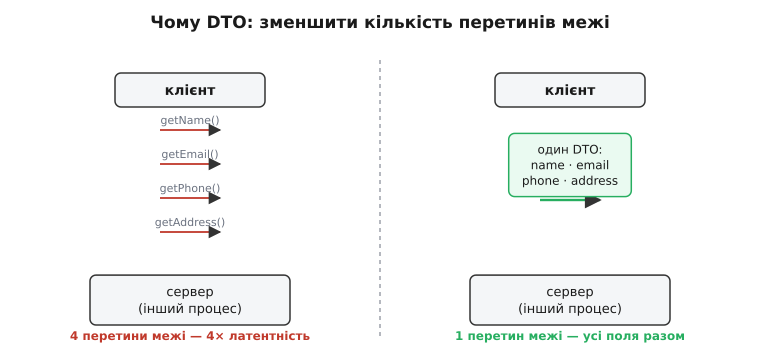

# DTO

<preknowlist>
- [Зчеплення і зв'язність](topic:sf-apps/coupling-cohesion) — скільки одна частина коду мусить знати про пристрій іншої; DTO — прийом, щоб на межі це знання звести до мінімуму.
- [Дизайн API як рішення письмом](topic:sf-apps/api-design) — межа коду переживає його нутрощі; форму цієї межі, коли по ній течуть дані, і задає DTO.
- [Інтерфейс проти реалізації](topic:sf-apps/interface-vs-implementation) — різниця між тим, що модуль показує зовні, і тим, як він влаштований усередині; DTO існує рівно на цьому шві.
</preknowlist>

Абревіатура **DTO** (англ. *Data Transfer Object* — об'єкт передавання даних) звучить поважно, а ховає за собою напрочуд просту річ: це об'єкт, у якому **немає нічого, крім даних**. Жодної поведінки, жодних правил, жодних методів, що щось вирішують, — самі поля, складені докупи, щоб їх було зручно перенести з одного місця в інше одним махом. Здавалося б, навіщо давати таке звичне гроно полів окрему назву й окремий патерн? Відповідь — не в тому, що це за об'єкт, а в тому, **яку роботу він виконує на межі між двома світами**.

Щоб побачити цю роботу, треба спершу зрозуміти, звідки взагалі береться потреба. А береться вона з того, що **перетнути межу коштує дорого** — і що дорожча ця межа, то сильніше хочеться перетинати її рідше й везти за раз якнайбільше.

## Звідки потреба: ціна перетину межі

Уяви, що твій код кличе не сусідню функцію, а щось по той бік мережі — інший процес, іншу машину. Виклик функції в тій самій програмі коштує наносекунди; виклик по мережі — сотні мікросекунд або й мілісекунди, бо дані треба спакувати, послати через сокет, дочекатися відповіді. Різниця — у десятки тисяч разів. І от уяви, що тобі треба показати картку користувача: ім'я, пошту, телефон, адресу. Наївний підхід — чотири окремі виклики:

:::tabs
```cpp
// Дрібнозернистий доступ через дорогу межу: кожен геттер — окремий похід по мережі
std::string name  = user.getName();     // перетин межі 1
std::string email = user.getEmail();    // перетин межі 2
std::string phone = user.getPhone();    // перетин межі 3
std::string addr  = user.getAddress();  // перетин межі 4
```
```python
# Дрібнозернистий доступ через дорогу межу: кожен геттер — окремий похід по мережі
name  = user.get_name()      # перетин межі 1
email = user.get_email()     # перетин межі 2
phone = user.get_phone()     # перетин межі 3
addr  = user.get_address()   # перетин межі 4
```
:::

Кожен рядок тут — окрема дорога через мережу. Чотири поля — чотири латентності, і користувач чекає вчетверо довше, ніж міг би. А тепер уяви список зі ста таких карток — і ти отримав чотириста перетинів межі там, де по суті потрібен один.

Ось де народжується DTO. Замість тягнути поля поодинці, ми складаємо їх усі в **один об'єкт-контейнер** і переносимо його через межу **за один раз**:

:::tabs
```cpp
// Один об'єкт із усіма полями — один перетин межі замість чотирьох
struct UserDto {
    std::string name;
    std::string email;
    std::string phone;
    std::string address;
};

UserDto dto = userService.getUserCard(id);  // єдиний перетин межі — усе разом
```
```python
from dataclasses import dataclass

# Один об'єкт із усіма полями — один перетин межі замість чотирьох
@dataclass
class UserDto:
    name: str
    email: str
    phone: str
    address: str

dto = user_service.get_user_card(id)  # єдиний перетин межі — усе разом
```
:::

Один похід замість чотирьох. Що більше полів, то більший виграш. Саме заради цього — **зменшити кількість дзвінків через дорогу межу, повіз­ши більше даних за раз** — і придумали DTO наприкінці 1990-х, коли масово будували розподілені застосунки й кожне звернення до сервера боляче било по швидкодії. Хто цю річ народив, як вона спершу звалася й чому Мартін Фаулер потім застерігав від її бездумного вжитку — [винесено в історію поняття](topic:sf-apps/dto/hist-dto.md).



*Та сама задача — забрати чотири поля — двома способами. Дрібнозернистий доступ платить латентність за кожне поле; DTO платить її один раз за всі. Виграш росте з кількістю полів і з дорожнечею межі.*

> 🔧 **Навіщо це.** Правило Фаулера, з якого все виросло, — «якщо межа дорога, роби її грубозернистою»: не сто дрібних викликів, а один великий. DTO — це і є та грубозерниста форма запиту. Щойно бачиш код, що поодинці смикає геттери з віддаленого об'єкта в циклі, — це майже завжди рахунок за латентність, який прибирається одним DTO. У прошивці той самий закон працює для повільної шини: не читай регістр давача по одному байту двадцять разів, а забери весь блок одним burst-читанням у структуру — це той самий DTO, лише через SPI, а не через мережу.

## Друга робота DTO: не пускати домен назовні

Швидкодія — це половина причини, і навіть не найважливіша. Друга половина тонша, і вона про **захист**. Придивімося, що саме ми відправляємо через межу.

У добре зробленій програмі всередині живе **модель домену (англ. *domain model*)** — об'єкти, що несуть не тільки дані, а й **поведінку та правила**. `Order` (замовлення) — це не просто набір полів; це об'єкт, який уміє перевірити, що сума додатна, що не можна відвантажити скасоване, що знижка не більша за ціну. Ці правила — серце застосунку, і вони мусять лишатися **всередині**, під замком, де їх ніхто не обійде.

А тепер спитай: чи хочеш ти віддати цей об'єкт цілком назовні — клієнтові, який малює вебсторінку? Ні. І на те дві причини, обидві важать.

Перша — **безпека й доречність**. Усередині `Order` може тримати внутрішній ідентифікатор бази, службові прапорці, маржу, собівартість — те, чого зовнішній світ бачити не повинен. Віддаси об'єкт як є — і ці поля просочаться туди, де їм не місце.

Друга, і головна для дизайну, — **зчеплення**. Щойно зовнішній код почав залежати від форми твого доменного об'єкта, ти **прикутий до цієї форми**. Перейменуєш поле всередині — зламаєш клієнта. Розкладеш `Order` на два класи для чистоти — зламаєш клієнта. Твоя внутрішня свобода переписувати домен помирає тієї миті, коли його форму видно назовні. Це прямий наслідок того, що вивчає [зчеплення і зв'язність](topic:sf-apps/coupling-cohesion): що більше чужого коду знає про твій пристрій, то менше ти вільний його міняти.

DTO розриває цей зв'язок. Назовні їде **не** доменний об'єкт, а його пласка копія-виписка — рівно ті поля, які зовнішньому світу треба бачити, і в тій формі, яку зручно віддати. Домен лишається всередині, вільний мінятися; DTO — на межі, як буфер.

:::tabs
```cpp
// Усередині — багатий домен з поведінкою і прихованими полями
class Order {
    OrderId   id_;            // внутрішній ключ бази — назовні не потрібен
    Money     cost_;          // собівартість — комерційна таємниця
    std::vector<Line> lines_;
    Status    status_;
public:
    Money total() const;             // правило: як рахується сума
    void  cancel();                  // правило: коли можна скасувати
    // ... інваріанти, що бережуть коректність
};

// На межі — пласка виписка: лише те, що клієнт має право й потребу бачити
struct OrderDto {
    long        id;
    double      total;               // порахований результат, не собівартість
    std::string status;
    std::vector<LineDto> lines;
};
```
```python
from dataclasses import dataclass, field

# Усередині — багатий домен з поведінкою і прихованими полями
class Order:
    def __init__(self, id, cost, lines, status):
        self._id = id            # внутрішній ключ бази — назовні не потрібен
        self._cost = cost        # собівартість — комерційна таємниця
        self._lines = lines
        self._status = status

    def total(self) -> Money:    # правило: як рахується сума
        ...
    def cancel(self) -> None:    # правило: коли можна скасувати
        ...
    # ... інваріанти, що бережуть коректність

# На межі — пласка виписка: лише те, що клієнт має право й потребу бачити
@dataclass
class OrderDto:
    id: int
    total: float              # порахований результат, не собівартість
    status: str
    lines: list[LineDto] = field(default_factory=list)
```
:::

Перетворення одного на інше — окрема відповідальність: хтось мусить узяти домен і **зібрати** з нього DTO (а на вході — навпаки, з DTO обережно збудувати чи оновити домен). Цю ділянку — маппінг, куди складати логіку збірки й чому не варто пускати її абичуди — [розібрано з робочим C++](topic:sf-apps/dto/proj-mapping.md).


*Домен лишається за межею, вільний мінятися; через межу перетинає лише DTO — пласка виписка потрібних полів. Стрілки — це робота перекладача: зібрати DTO з домену на виході, розібрати назад на вході.*

> 🔧 **Навіщо це.** Найдорожча помилка тут — віддати доменний об'єкт назовні «щоб не плодити класи». Спочатку економія, а через рік ти не можеш перейменувати жодне поле, бо на його імені висить мобільний застосунок, який оновлюють не тобою й не сьогодні. DTO коштує зайвого класу й трохи коду-перекладача — але купує тобі право переписувати нутрощі, ні в кого не питаючи. Це та сама межа, що й у [дизайні API](topic:sf-apps/api-design): назовні — стабільна обіцянка, усередині — вільна реалізація, а DTO задає форму цієї обіцянки, коли по ній течуть дані.

## DTO як контракт, що розв'язує дві сторони

З цього випливає третя, найглибша роль DTO — він стає **контрактом форми даних** між двома боками, які живуть окремо й оновлюються не разом.

Коли клієнт і сервер розгортають різні люди в різний час, у них немає розкоші «поміняли з обох боків одночасно». Сервер оновили сьогодні, старі клієнти ще ходять тижнями. Отже, **форма даних на межі мусить бути стабільною сама по собі** — не тому, що технічно не можна її змінити, а тому, що будь-яка ламка зачепить чужі системи, яких ти не контролюєш. DTO і є та зафіксована форма. Сервер вільно переписує свою внутрішню модель, клієнт читає лише потрібні йому поля — а посередині стоїть стала структура `{ id, total, items[] }`, яка тримає обидві сторони незалежними.

![Три рамки в ряд: ліворуч зелена «внутрішня модель сервера (вільно переписуй)», посередині жовта «DTO-контракт { id, total, items[] }», праворуч сіра «клієнт (читає лише потрібні поля)»; стрілки від країв до контракту, підпис знизу «стабільна форма посередині тримає обидві сторони незалежними»](img/contract.svg)

*Стала форма-контракт посередині розв'язує дві сторони: кожна еволюціонує у своєму темпі, поки контракт тримається. Змінювати його доводиться за тими самими законами, що й будь-яку публічну межу, — нарощуванням, а не ламанням.*

Оскільки DTO — це публічна межа, міняти його треба за тим самим законом асиметрії, який керує будь-яким [дизайном API](topic:sf-apps/api-design): **додати поле дешево, забрати чи перейменувати — дорого**. Нове необов'язкове поле старі клієнти просто ігнорують; прибране поле ламає кожного, хто на нього спирався. Тому DTO ростять акуратно, як і будь-який контракт: нове поруч зі старим, а не замість нього.

Ось де DTO зустрічається з іншими межами застосунку. У [шаровій архітектурі](topic:sf-apps/layered-architecture) DTO — це те, що подорожує **між шарами**, коли не хочеш пускати доменні об'єкти нагору, до вебшару. У підході [портів і адаптерів](topic:sf-apps/hexagonal-architecture) DTO живе рівно на адаптері — зовнішній формі, яку адаптер перекладає у внутрішні поняття. А коли система розрізана на [мікросервіси](topic:sf-apps/microservices) чи спілкується [подіями](topic:sf-apps/event-driven-architecture), схема повідомлення між ними — це той самий DTO, лише з іще дорожчою межею, бо по інший бік — чужа команда й чужий реліз-цикл.

## Небезпека: коли DTO зайвий

Тепер найважливіше застереження, без якого DTO перетворюється на карго-культ. **DTO коштує грошей — і платити варто лише там, де межа справді дорога.**

Кожен DTO — це зайвий клас плюс код-перекладач, що ганяє дані туди-сюди. Коли межа реальна (мережа, чужий процес, зовнішній клієнт), ця ціна виправдана — вона купує швидкодію й розв'язку сторін. Але коли **межі немає** — коли ти передаєш дані між функціями всередині однієї програми, в одному процесі, — DTO не купує нічого. Немає латентності, яку економити; немає чужого релізу, від якого захищатися. Лишається сама ціна: зайвий клас, зайвий маппінг, грубіша й незручніша модель.

Саме про це попереджав Фаулер окремою заміткою про «локальні DTO»: не просто марні в місцевому контексті, а **шкідливі** — бо грубозернистий інтерфейс важче використовувати, і бо ти дарма робиш усю роботу з перекладання даних у DTO й назад, нічого за неї не отримуючи. Найтиповіша пастка — зробити DTO «про запас, раптом колись розподілимо». Це той самий передчасний оптимізм, від якого застерігає [YAGNI](topic:sf-apps/dry-kiss-yagni): ти платиш за складність сьогодні заради розподілу, якого може ніколи й не бути, а якщо він і настане — форму DTO ти тоді все одно робитимеш під реальну межу, а не під вигадану.

> 🔧 **Навіщо це.** Практичне правило просте: **DTO з'являється там, де є справжня межа процесу, і ніде більше.** Дані їдуть по мережі, у зовнішній застосунок, у чергу між ізольованими потоками — потрібен DTO. Дані ходять між сервісом і доменом усередині того самого процесу — передавай доменні об'єкти напряму, не плоди двійників. Якщо ловиш себе на тому, що пишеш маппер `Order → OrderDto → Order` без жодної межі посередині, — ти платиш податок ні за що.

## Що лишається в руках

DTO — це об'єкт без поведінки, самі дані, і вся його суть — у роботі, яку він виконує **на межі**. Він з'явився, щоб перетинати дорогу межу рідше, везучи більше полів за раз, — і в цьому його первісний, швидкісний сенс. Але глибша його користь у тому, що він **не пускає домен назовні**: назовні їде пласка виписка, а багата модель із правилами лишається всередині, вільна мінятися. І оскільки ця виписка стає контрактом між сторонами, що живуть окремо, її форму тримають стабільною й ростять нарощуванням, як будь-яку публічну межу.

Ключ до того, щоб DTO допомагав, а не заважав, — пам'ятати, за що ти платиш. Він купує швидкодію й розв'язку там, де межа справді дорога, і не купує нічого там, де межі немає. Постав його на реальному шві між процесами — і він зробить систему і швидшою, і вільнішою до змін. Постав «про всяк випадок» усередині одного процесу — і ти заплатив податок за межу, якої не існує.
