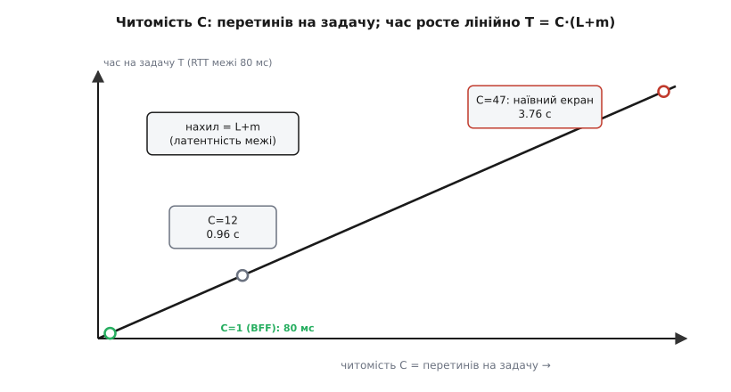

# 🧮 Математика вартості межі

«Дорога межа» — не гасло, а величина, яку можна порахувати. І щойно її рахуєш, дістаєш більше, ніж очікуєш: точну ціну кожного перетину, доказ того, що́ саме DTO купує (і що́, всупереч інтуїції, не купує), формулу оптимального обсягу пакунка й вимірне число, що каже, коли інтерфейс балакучий. Усе це виводиться з одного маленького атома вартості. Складімо його й подивімося, куди він веде.

## Атом ціни: скільки коштує один перетин

Візьмімо один-єдиний перетин межі, що везе `k` полів, і розкладімо його ціну на складники, кожен зі своєю природою.

Перший складник — **латентність** (лат. *latens* — прихований), позначмо `L`: час, поки запит долетить туди й відповідь назад. Він **не залежить від обсягу** — це плата за сам факт того, що ти постукав у чужі двері. Другий — невелика стала накладна `m` на кожне повідомлення: скласти заголовок, підняти серіалізатор, розібрати обгортку. Ці двоє разом не залежать від `k` — назвімо їхню суму **порогом** межі: фіксований податок за перетин, байдужий до того, чи несеш ти одне поле, чи сотню.

Третій складник інший — він **росте з обсягом**: `t` — плата за одне поле (запакувати, проштовхнути по проводу, розпакувати на тому боці). Плата за поле `t` — це передусім ціна [серіалізації](root:com-protocol/data-serialization): для текстових форматів на кшталт JSON вона більша (треба парсити рядки), для схемних бінарних — менша. Несеш `k` полів — платиш `k·t`.

```
поріг    = L + m               плата за сам перетин, не залежить від k
ціна(k)  = поріг + k·t          поріг раз + k полів по t
```

Ось і весь атом. Кожен розрахунок нижче — лише цей вираз, підставлений двічі й відняте одне від одного. Уся хитрість — у тому, що поріг платиться **за перетин**, а `k·t` — **за поля**, і ці дві природи поводяться на межі протилежно.

## Що насправді купує DTO

Тепер найважливіше твердження всієї теми, і його треба не завчити, а вивести — бо висновок суперечить першому враженню.

Задача: клієнтові треба `N` полів. Два крайні способи їх дістати. **Дрібнозернистий** — по одному полю за перетин, `N` перетинів. **Один DTO** — усі `N` полів за один перетин. Підставмо атом у кожен:

```
Дрібнозернисто (N перетинів по 1 полю):
   T_дрібно = N·(поріг + t)     = N·поріг + N·t

Один DTO (1 перетин на N полів):
   T_DTO    = поріг + N·t
```

Відніми одне від одного — і дивись, що зникає:

```
   T_дрібно − T_DTO = (N·поріг + N·t) − (поріг + N·t)
                    = N·поріг − поріг + (N·t − N·t)
                    = (N − 1)·поріг
```

Член `N·t` **скоротився**. І це не арифметична випадковість, а вся суть патерну одним рядком: обидва способи везуть **однакові** `N` полів, тож на самих полях витрачають **порівну** — `N·t` там і там. DTO не економить **жодного байта даних**. Усе, що він економить, — це `(N−1)` зайвих сплат **порога**. Кажучи навпростець: **DTO купує не байти, а пороги.** Він прибирає повторні податки за перетин, а не робить дані меншими.

Звідси одразу видно, від чого залежить виграш. Він дорівнює `(N−1)·поріг` — тобто росте і з кількістю полів `N`, і з висотою порога. Дешевий поріг — куций виграш, хоч скільки полів склади докупи. Дорогий поріг — і навіть кілька полів окупають пакунок. Тримаймо цей висновок: **вартий DTO лише там, де поріг високий.**

**Приклад: рахунок за N+1.** Найпоширеніша форма дрібнозернистості має ім'я — проблема N+1: список із одного запиту, а тоді по запиту на кожен елемент.

```
100 замовлень, кожному треба ім'я клієнта. Поріг межі = 1 мс, t = 1 мкс.

Наївно (N+1 = 101 перетин):
   T = 101 · 1 мс                   = 101 мс

Одним запитом (join на сервері, 1 перетин, 100 рядків по 5 полів):
   T = 1 мс + 500 · 0.001 мс        ≈ 1.5 мс

Виграш = (101 − 1) · 1 мс           = 100 мс     ← рівно (N−1)·поріг
```

Сто мілісекунд виграшу — це рівно сто зекономлених порогів. Дані ж (`500·0.001 = 0.5 мс`) в обох випадках однакові й на тлі порога майже невидимі. Тому й ліки від N+1 завжди ті самі: не «пришвидшити кожен виклик», а **прибрати перетини**.

## Звідки береться відношення 10⁵

Твердження «поріг високий» вимагає числа. Наскільки віддалений виклик дорожчий за локальний? Візьмімо канонічні орієнтири — оцінки, які **оприлюднив Пітер Норвіг**, а **популяризував Джефф Дін** (Google) доповіддю в Стенфорді 2010 року; відтоді це фактичний галузевий канон. *(Статус доказовості: усталені порядкові оцінки, вивірені за широко цитованим списком; конкретні числа — приблизні, порядок величини стабільний.)*

```
виклик функції в тому самому процесі:  ~ 5·10⁻⁹ с   (одиниці наносекунд)
похід у пам'ять (RAM):                 ~ 1·10⁻⁷ с   (100 нс)
RTT у тому самому ЦОД:                 ~ 5·10⁻⁴ с   (500 мкс)
відношення локальний / віддалений:     ~ 10⁵        (сто тисяч разів)
```

Чому саме п'ять порядків, а не два й не десять? Причина фізична, і її варто побачити. Локальний виклик CPU робить весь на кристалі: пройти кілька міліметрів доріжок, смикнути пам'ять — усе на швидкості електроніки, за одиниці наносекунд. Віддалений виклик мусить (1) пройти **мережевий стек ОС** з обох боків — системні виклики, перемикання контексту, обробку переривань, — і (2) фізично **подолати відстань**: світло у волокні йде приблизно ⅔ швидкості у вакуумі, це десь 5 мкс на кілометр туди-назад. У межах одного ЦОД ті 500 мкс — переважно стек і комутатори (відстань мала); між континентами — переважно **політ світла**: Каліфорнія ↔ Нідерланди й назад — це майже 18 тисяч кілометрів, звідки й беруться ~150 мс, хоч би яке швидке було залізо. Ніякий процесор цього не прискорить — заважає швидкість світла.

Ця прірва — і є висота порога. Зручно виразити її одним числом, що складає обидва складники атома в одне відношення:

```
   ρ = поріг / t          у скількох полях виражається один поріг
```

`ρ` каже просту річ: скільки полів можна було б передати за той час, що коштує **сам** перетин. Для віддаленої межі `ρ` величезний (поріг у мілісекундах, поле в мікросекундах), для локальної — крихітний. І що більший `ρ`, то більший виграш DTO — бо тим дорожче обходиться кожен зайвий перетин проти зайвого поля.


*ρ = (L+m)/t зростає на порядки з дорожчанням межі — від одиниць у процесі до сотень тисяч між континентами. Це той самий множник, що визначає і висоту виграшу DTO, і те, як грубо варто пакувати.*

## Дно долини: скільки полів везти за раз

Досі ми брали крайнощі — одне поле за перетин чи всі за раз. Тепер загальний випадок: везти `u` **корисних** полів пакунками по `k`. Це дасть повну криву ціни й формально — її дно.

```
   перетинів:  C = ⌈u / k⌉                скільки разів стукати, щоб зібрати всі u
   привезено:  F = C · k                  усього полів (корисних u, решта F−u — зайві)
   T(k) = C·поріг + F·t = ⌈u/k⌉·поріг + ⌈u/k⌉·k·t
```

Одна формула — а всередині неї сидять **обидві** відомі хвороби, як два її кінці:

```
   k = 1    →  C = u,  T = u·поріг + u·t        ← N+1: u перетинів, стіна латентності
   k → ∞    →  C = 1,  T = поріг + k·t          ← надвибірка: 1 перетин, гори зайвого
```

Ліворуч (`k = 1`) — граничний дрібнозернистий доступ: `u` порогів поспіль. Праворуч (`k → ∞`) — **надвибірка** (англ. *over-fetching*): один перетин, але везе купу непотрібного, `(k−u)·t` намарно. Це не два різні явища — це **та сама функція** `T(k)`, узята на двох краях. Між ними — долина.

Де її дно? Спершу — точна відповідь для **однієї відомої задачі**, якій треба рівно `u` полів. Тут дно очевидне з формули: `k = u`. Один перетин (жодного зайвого порога) і жодного зайвого поля (нуль надвибірки):

```
   T(u) = 1·поріг + u·t = поріг + u·t
```

Чому саме `u`, ні дрібніше, ні грубіше, видно з **граничного** міркування — воно ж і є формальне «дно долини». Стій на якомусь `k` і спитай, що дасть **іще одне поле** в пакунку:

- **Поки `k < u`** — додане поле наближає до того, щоб обійтися меншою кількістю перетинів; у середньому кожне поле, докладене нижче `u`, зрізає частину майбутнього перетину, а перетин коштує цілий **поріг**. Гранична економія — велика, порядку `поріг`.
- **Щойно `k > u`** — усі `u` корисних полів уже влізли в один перетин; наступне поле не прибирає **жодного** перетину, воно просто зайве й коштує чистий `t` надвибірки.

Гранична економія падає, гранична плата стала — вони зустрічаються, і для однієї задачі зустріч припадає рівно на `k = u`. А тепер тонший випадок, де дно **не** на `u`: коли ти не можеш націлитися на рівно `u` (потік сторінками, або **один** DTO, розподілений між багатьма різними задачами, і надвибірка накопичується гладко). Тоді обидва ефекти діють одночасно й неперервно. Гранична економія на латентності спадає як `поріг·u/k²`, гранична плата за зайве стала — `t`; прирівняй їх:

```
   поріг · u / k²  =  t
   k²              =  u · поріг / t
   k*             =  √(u · поріг / t)  =  √(u · ρ)
```

Це **закон квадратного кореня**: оптимальний обсяг пакунка росте як корінь із добутку «потреба × поріг ÷ плата за поле». Форма не нова — це та сама математика, що й **економічний обсяг замовлення** (англ. *Economic Order Quantity*, EOQ) у логістиці, яку **Форд Вітмен Гарріс** вивів ще 1913 року в статті «How many parts to make at once» (пізніше її наново відкрив і популяризував Р. Г. Вілсон, тож формулу часто звуть Вілсоновою). *(Статус: усталено; першоавторство Гарріса, 1913, вивірене; ширша відомість — під ім'ям Вілсона.)* Там купують партіями, врівноважуючи вартість замовлення проти вартості зберігання; тут «замовляють» дані перетинами, врівноважуючи поріг проти надвибірки — і дістають ту саму `√`. Той самий скелет моделі можна записати як звичайну функцію:

:::tabs
```py
from math import sqrt

def crossing_cost(u, k, porig, t):
    crossings = -(-u // k)           # ⌈u/k⌉: скільки перетинів, щоб зібрати u корисних полів
    fetched   = crossings * k        # реально привезено (решта fetched−u — надвибірка)
    return crossings * porig + fetched * t

def optimal_k(u, porig, t):
    return sqrt(u * porig / t)       # закон квадратного кореня (форма EOQ Гарріса)
```
```ts
function crossingCost(u: number, k: number, porig: number, t: number): number {
  const crossings = Math.ceil(u / k);   // скільки перетинів, щоб зібрати u корисних полів
  const fetched   = crossings * k;      // реально привезено (решта fetched−u — надвибірка)
  return crossings * porig + fetched * t;
}

const optimalK = (u: number, porig: number, t: number): number =>
  Math.sqrt((u * porig) / t);           // закон квадратного кореня (форма EOQ Гарріса)
```
:::


*Формальне дно долини — точка, де спадна гранична економія на латентності зрівнюється зі сталою граничною платою за зайве поле. Ліворуч кожне докладене поле ще окупається зрізаним перетином; праворуч уже лише марнує t.*

**Приклад: долина в числах.** Хай задачі треба `u = 10` полів, поріг = 1 мс, `t = 1 мкс` (тобто `ρ = 1000`).

```
k = 1    (N+1):        T = 10·1 мс + 10·0.001 мс   = 10.010 мс
k = 10   (рівно u):    T =  1·1 мс + 10·0.001 мс   =  1.010 мс   ← дно
k = 200  (god-DTO):    T =  1·1 мс + 200·0.001 мс  =  1.200 мс
```

Дно на `k = 10` — рівно потрібні поля. Але придивись до третього рядка: роздутий до 200 полів god-DTO коштує `1.2 мс` — він **гірший** за дно лише на `0.19 мс`, зате все ще у **вісім разів кращий** за дрібнозернистий `10.01 мс`. Долина несиметрична, і це наступний важливий висновок.

## Читомість: перетини як вимірне число

Множник перед порогом у нашій формулі — `C = ⌈u/k⌉` — заслуговує власного імені, бо це **вимірна метрика проєкту**, а не відчуття. Назвімо його **читомістю** (англ. *chatty* — балакучий, від *chat* — балачка): скільки перетинів межі коштує одна задача. Балакучий інтерфейс змушує клієнта багато разів «перепитувати» через межу; грубозернистий (chunky) віддає все за раз.

```
   T_латентності = C · поріг          читомість — це прямий множник латентності
```

Читомість вимірна буквально: полічи мережеві виклики, якими рендериться **один** екран. І тут ховається причина, чому мобільні застосунки часто мляві. RTT мобільної межі великий — хай `поріг = 80 мс`:

```
екран рендериться наївно, C = 47 викликів:
   T ≈ 47 · 80 мс                = 3.76 с

той самий екран через агрегат (BFF), C = 1:
   T ≈ 80 мс + дані              ≈ 0.1 с
```



*Читомість C — вимірна метрика: полічи перетини на один екран. Час росте лінійно, T = C·поріг, а нахил прямої — це латентність межі. Ось чому згортання сорока семи викликів в один (робота backend-for-frontend) перетворює тривисекундне очікування на десяту частку секунди.*

Саме тому «грубе краще за балакуче» — не стиль, а арифметика: читомість `C` множиться на `поріг`, а `поріг` на віддаленій межі величезний. Це кількісний бік давнього **першого закону розподілених об'єктів Мартіна Фаулера: «не розподіляй свої об'єкти»** (Patterns of Enterprise Application Architecture, 2002) — об'єкти надто дрібні й балакучі, щоб бути добрими мешканцями мережі. *(Статус: усталено; формулювання й авторство Фаулера вивірені.)*

## Дешева межа й асиметрія стін

Тепер граничні умови моделі — місця, де вся користь DTO або зникає, або перекошується.

**Дешева межа знищує виграш.** Ми вже бачили: абсолютний виграш `(N−1)·поріг` тане разом із порогом. Подивімося на це ще й через **відношення** часів:

```
   T_дрібно / T_DTO = N·(поріг + t) / (поріг + N·t) = N·(ρ + 1) / (ρ + N)

   ρ → ∞  (дорога межа):   → N      виграш у N разів
   ρ → 0  (дешева межа):   → 1      виграшу нема
```

Коли `ρ` малий, DTO не виграє ні абсолютно, ні відносно. Порахуймо той самий пакунок на двох різних межах:

```
Той самий DTO у процесі (поріг ≈ 5 нс), u = 8 полів:
   виграш = (8 − 1) · 5 нс           = 35 нс

Той самий DTO між континентами (поріг ≈ 150 мс):
   виграш = (8 − 1) · 150 мс         = 1.05 с
```

Та сама структура економить **у ~30 мільйонів разів менше** в процесі. Тридцять п'ять наносекунд — це менше, ніж коштує саме́ виділення й копіювання пакунка; локально DTO не рятує ні від чого, лишається сама його ціна. Ба більше: в одному процесі поле читають прямо, взагалі **не платячи порога** (це доступ до пам'яті, а не перетин), тож економити просто нема на чому — модель порогів там вироджується. Це кількісне підґрунтя правила «нема справжньої межі — нема DTO».

**Стіни несиметричні.** Придивімося до країв долини як до сходинок. Крок **ліворуч** (забрати поле з уже мінімального DTO, змусивши ще один перетин) коштує цілий `поріг`. Крок **праворуч** (додати зайве поле) коштує один `t`. Відношення крутизни — той самий `ρ`:

```
   крутизна лівої стіни / крутизна правої = поріг / t = ρ
```

Для віддаленої межі `ρ` — сотні й тисячі, тобто **ліва стіна в ρ разів крутіша за праву**. Практичний наслідок: коли вагаєшся між дрібнішим і грубішим — **бери грубіше**, бо помилка в бік надвибірки коштує в `ρ` разів дешевше за помилку в бік читомості. Ось чому навіть роздутий god-DTO у прикладі вище (`1.2 мс`) легко бив дрібнозернистий доступ (`10 мс`).

**Але надвибірка множиться на обсяг.** Права стіна дешева **на одне поле**, проте марнування — це `(K−u)·t` на **кожен** отриманий запис, і на списках воно набігає:

```
Мобільний екран читає u = 3 з K = 80 полів. Поріг = 80 мс, t = 0.01 мс.

god-endpoint, 1 перетин на запис:
   надвибірка на запис = (80 − 3)·0.01 мс          = 0.77 мс
три вузькі виклики замість одного (C = 3):
   T = 3·80 мс + дрібниця                          ≈ 240 мс
один широкий виклик (C = 1):
   T = 80 мс + 80·0.01 мс                          = 80.8 мс
```

На одному записі надвибірка `0.77 мс` — сміх проти `160 мс` за два зайві перетини, тож широкий виклик виграє з великим запасом. Та коли на екрані **50 таких рядків**, надвибірка стає `50·(80−3)·0.01 мс = 38.5 мс` — уже відчутний шматок. Звідси точний баланс: **латентність болить від кількості перетинів, надвибірка — від обсягу даних × кількість записів.** Дрібні поля можна щедро домішувати в пакунок, поки їх мало; на широких полях (великі тексти, зображення в base64) чи довгих списках надвибірка швидко наздоганяє й переганяє економію на латентності — і тоді пакунок треба **різати назад** до потрібних полів.

## Що лишається в руках

Уся вартість межі складається з одного атома — `ціна(k) = поріг + k·t` — і з нього виводиться все інше. DTO купує **пороги, а не байти**: різниця дрібнозернистого й грубого доступу дорівнює рівно `(N−1)·поріг`, бо доданок за дані `N·t` в обох однаковий і скорочується. Висота цього виграшу задана порогом, а міра дорожнечі межі — відношенням `ρ = поріг/t`, що росте від одиниць у процесі до `~10⁵` між континентами через саму фізику: мережевий стек плюс політ світла.

Ціна не спадає монотонно — вона має долину. Її два краї, N+1 і надвибірка, — це **одна формула** `T(k) = ⌈u/k⌉·поріг + ⌈u/k⌉·k·t`, узята на `k = 1` і `k → ∞`. Дно для однієї відомої задачі — рівно `k = u`; коли ж націлитися точно не можна, оптимум іде за законом квадратного кореня `k* = √(u·ρ)` — тією самою формою, що й столітній економічний обсяг замовлення. Множник перед порогом, `C = ⌈u/k⌉`, — це **читомість**, вимірне число перетинів на задачу, і саме воно (помножене на поріг) диктує, чому балакучі інтерфейси такі повільні. А стіни долини несиметричні: ліва, латентнісна, у `ρ` разів крутіша за праву, надвибіркову, — тож на віддаленій межі, вагаючись, бери грубіше, але пам'ятай, що надвибірка набігає з обсягом і на широких даних наздоганяє свою стіну.
