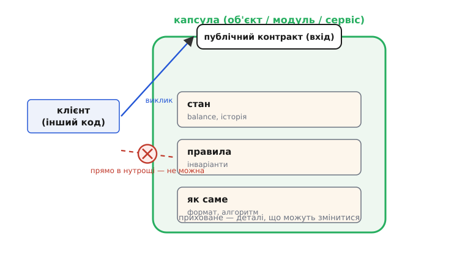
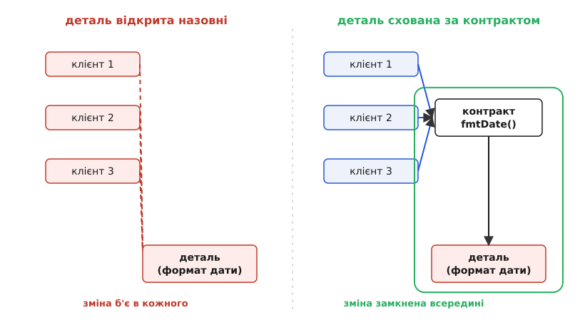

# Інкапсуляція

<preknowlist>
- [Інтерфейс проти реалізації](root:sf-apps/interface-vs-implementation) — різниця між тим, ЩО модуль обіцяє зовні, і тим, ЯК він це робить усередині; на цьому поділі стоїть уся інкапсуляція.
- [Принцип абстракції в програмуванні](root:sf-apps/abstraction-principle) — чому одну ідею ховають за назвою, а деталі лишають усередині.
</preknowlist>

Слово звучить як щось суто об'єктне — «поля приватні, до них геттери». Але це наслідок, а не суть. Інкапсуляція (лат. *in capsula* — «у коробочці», від *capsa* — скринька) — це рішення про **межу**: що з цього шматка коду видно ззовні, а що замкнено всередині й нікого поза ним не стосується. Приватні поля — лише один з інструментів провести цю межу; сама ідея старша за об'єкти й ширша за них.

Причина, чому межу взагалі проводять, проста й невблаганна. Будь-який код, який хтось напише, доведеться **міняти** — і не раз. Питання не в тому, чи прийде зміна, а в тому, **скільки місць вона зачепить**, коли прийде. І ось тут криється підступність: якщо деталь — скажімо, що баланс зберігається як число з копійками, чи що дата форматується як `дд.мм.рррр` — відома всьому коду навколо, то зміна цієї деталі тече в кожне місце, яке її знало. А якщо деталь замкнена в одній коробочці й зовні видно лише те, **що** вона робить, а не **як**, — зміна лишається всередині коробочки й назовні не витікає. Інкапсуляція — це і є свідоме керування тим, куди дотягнеться майбутня зміна.

## Дві половини одного об'єкта

Придивімося до найпростішого прикладу — рахунку, з якого знімають і на який кладуть гроші. У нього є **правило, яке не можна порушувати ніколи**: баланс не може стати від'ємним. Таке правило-обіцянку, що має триматися завжди, називають [інваріантом](root:sf-apps/invariants) — умова, істинна від народження об'єкта й після кожної дозволеної операції над ним.

Тепер уявімо, що баланс — просто відкрите поле, і будь-хто ззовні пише в нього напряму:

:::tabs
```ts
class Account {
  public balance: number = 0;   // відкрите — пише хто завгодно
}

const acc = new Account();
acc.balance = -5000;            // правило мовчки зламане, ніхто не спинив
```
```py
class Account:
    def __init__(self):
        self.balance = 0        # відкрите — пише хто завгодно

acc = Account()
acc.balance = -5000             # правило мовчки зламане, ніхто не спинив
```
:::

Проблема не в тому, що хтось *зловмисно* поставив мінус. Проблема в тому, що **інваріант тепер не має захисту**: він живе не в коді, а в головах усіх, хто торкається `balance`, і тримається лише доки кожен з них пам'ятає правило. Досить одного, хто забув, — і об'єкт опиняється в стані, який за задумом неможливий. Помилку помітять далеко від місця, де її зробили.

Інкапсуляція розрубує це так: **стан ховаємо, а замість прямого доступу даємо операції, які єдині мають право його змінювати** — і кожна така операція сама стежить за інваріантом.

:::tabs
```ts
class Account {
  #balance = 0;                 // приховане: ззовні не видно й не змінити

  deposit(sum: number): void {
    if (sum <= 0) throw new Error("сума має бути додатною");
    this.#balance += sum;
  }
  withdraw(sum: number): void {
    if (sum <= 0) throw new Error("сума має бути додатною");
    if (sum > this.#balance) throw new Error("недостатньо коштів");  // інваріант під захистом
    this.#balance -= sum;
  }
  get amount(): number { return this.#balance; }   // лише читання
}
```
```py
class Account:
    def __init__(self) -> None:
        self._balance = 0        # приховане за домовленістю (підкреслення)

    def deposit(self, sum: int) -> None:
        if sum <= 0:
            raise ValueError("сума має бути додатною")
        self._balance += sum

    def withdraw(self, sum: int) -> None:
        if sum <= 0:
            raise ValueError("сума має бути додатною")
        if sum > self._balance:
            raise ValueError("недостатньо коштів")   # інваріант під захистом
        self._balance -= sum

    @property
    def amount(self) -> int:     # лише читання
        return self._balance
```
```cpp
class Account {
    long balance = 0;            // private за замовчуванням у class — приховане
public:
    void deposit(long sum) {
        if (sum <= 0) throw std::invalid_argument("сума має бути додатною");
        balance += sum;
    }
    void withdraw(long sum) {
        if (sum <= 0) throw std::invalid_argument("сума має бути додатною");
        if (sum > balance) throw std::runtime_error("недостатньо коштів");  // інваріант
        balance -= sum;
    }
    long amount() const { return balance; }   // лише читання
};
```
:::

Тепер стан можна зачепити **лише через ці двері**, і кожні двері охороняють правило. Немає способу зробити баланс від'ємним ззовні — бо єдиний шлях до нього проходить через `withdraw`, а той перевіряє. Правило перестало залежати від пам'яті програмістів і стало властивістю самого об'єкта.

> 🔧 **Навіщо це.** Різниця відчутна не на щасливому шляху, а коли систему **розширюють**. За пів року хтось додасть переказ між рахунками, ще хтось — нарахування відсотків. Якби баланс був відкритий, кожне з цих місць мусило б *саме* пам'ятати про перевірку «не піти в мінус» — і рано чи пізно хтось забув би. З інкапсуляцією нове місце просто викликає `withdraw`, а перевірка вже всередині. Один інваріант, одна точка, де він живе, — і скільки б клієнтів не з'явилося, він тримається сам.

Зверни увагу на ще одну тонкість. У об'єкта з'явилися **дві половини**, і в них різна доля. Публічна половина — `deposit`, `withdraw`, `amount` — це **обіцянка** зовнішньому світу, і її не можна безкарно ламати: щойно хтось почав нею користуватися, вона стала контрактом. Прихована половина — що баланс лежить у полі `balance` як ціле число копійок — це **рішення**, яке ти лишаєш за собою право змінити будь-коли. Саме на цьому поділі — [що́ обіцяю зовні проти того, як роблю всередині](root:sf-apps/interface-vs-implementation) — тримається все інше.



*Об'єкт як коробочка: назовні стирчить лише вузький контракт (двері), а стан, інваріанти й спосіб роботи замкнені всередині. Клієнт має право торкатися вмісту тільки через двері — прямий шлях у нутрощі закритий.*

## Ховаємо не поля, а рішення, які зміняться

Найпоширеніше непорозуміння: вважати, ніби інкапсуляція — це «зроби всі поля приватними й додай геттер-сеттер до кожного». Це майже завжди пропускає саму суть — і часто повертає нас туди, звідки почали.

Глибшу ідею [1972 року сформулював Девід Парнас](root:sf-apps/encapsulation/hist-information-hiding.md), і назвав її **приховуванням інформації** (англ. *information hiding*). Його теза перевертає звичний хід думки. Ми звикли різати програму на модулі за кроками роботи — «спочатку прочитати файл, потім порахувати, потім вивести». Парнас каже: ні, ріж за **рішеннями, які найімовірніше зміняться**, і роби так, щоб кожне таке рішення знав рівно один модуль, а решта про нього навіть не здогадувалася. Тоді, коли рішення зміниться — а воно зміниться, — правка залишиться в одному модулі.

Ключове слово тут — **рішення**, а не «поле». Формат дати — рішення. Те, що список лежить у масиві, а не в дереві, — рішення. Те, що курс валют тягнеться з отого конкретного API, — рішення. Кожне з них має шанс колись помінятися, і кожне варто замкнути так, щоб зовні було видно лише результат, а не спосіб. Механічне «геттер на кожне поле» цю мету промахує двічі: воно захищає навіть те, що ніколи не зміниться (зайва церемонія без користі), і водночас **не** ховає справжнє рішення, якщо просто виставляє внутрішнє значення назовні під іншим ім'ям.

Ось той самий формат дати, розповзлий по коду, — і той самий прийом, що й з рахунком, тільки тепер він ховає не інваріант, а **рішення про формат**:

:::tabs
```ts
// Розповзлося: рішення "як виглядає дата" повторене в кожному клієнті
const a = `${d.day}.${d.month}.${d.year}`;
const b = `${d.day}.${d.month}.${d.year}`;
// ...перехід на ISO означає знайти й правити ВСІ такі місця
```
```py
# Розповзлося: рішення "як виглядає дата" повторене в кожному клієнті
a = f"{d.day}.{d.month}.{d.year}"
b = f"{d.day}.{d.month}.{d.year}"
# ...перехід на ISO означає знайти й правити ВСІ такі місця
```
:::

Замкнемо рішення про формат в одній точці — і зовні лишиться тільки обіцянка «повертаю рядок дати», а не її внутрішній вигляд:

:::tabs
```ts
function fmtDate(d: Date): string {
  return `${pad(d.day)}.${pad(d.month)}.${d.year}`;   // формат знає лише ця функція
}
const a = fmtDate(d);
const b = fmtDate(d);
// перехід на ISO — правка ОДНОГО тіла; жоден клієнт не зачеплений
```
```py
def fmt_date(d: Date) -> str:
    return f"{d.day:02d}.{d.month:02d}.{d.year:04d}"   # формат знає лише ця функція

a = fmt_date(d)
b = fmt_date(d)
# перехід на ISO — правка ОДНОГО тіла; жоден клієнт не зачеплений
```
:::

Функція — теж капсула. Тут немає жодного приватного поля, жодного класу, а інкапсуляція є: рішення сховане за назвою, назва — стабільна, спосіб — вільний змінюватися. Ось чому важливо було розчепити слово від об'єктів на самому початку.



*Куди тече зміна. Ліворуч деталь відкрита — кожен клієнт зчеплений із нею напряму, і правка б'є в усіх одразу. Праворуч між клієнтами й деталлю стоїть контракт: клієнти залежать лише від нього, а зміна замкнена в капсулі й назовні не витікає.*

## Геттери на все — це не інкапсуляція

Варто спинитися на пастці, у яку легко впасти саме тому, що вона *схожа* на правильну поведінку. Візьмімо клас, де кожне поле сховане, але до кожного є пара геттер-сеттер:

:::tabs
```ts
class Order {
  #items: Item[] = [];
  get items(): Item[] { return this.#items; }   // віддали внутрішній масив назовні
}

// Клієнт тепер порядкує чужими нутрощами:
order.items.push(newItem);                       // правило перевірити ЗАБУЛИ
```
```py
class Order:
    def __init__(self) -> None:
        self._items: list[Item] = []

    @property
    def items(self) -> list[Item]:
        return self._items      # віддали внутрішній список назовні

# Клієнт тепер порядкує чужими нутрощами:
order.items.append(new_item)   # правило перевірити ЗАБУЛИ
```
:::

Формально поле приватне. Насправді інкапсуляції нуль: геттер віддав назовні **живе внутрішнє посилання**, і тепер будь-хто змінює вміст замовлення повз усі правила — так само, як із відкритим полем, тільки з зайвим кроком. Стан ніби сховали, а керування ним віддали. Такий об'єкт — з даними без поведінки, з якого стирчать самі геттери-сеттери, — називають [анемічною моделлю](root:sf-apps/anemic-domain-model): вся логіка, що *мала б* бути всередині, розтікається по клієнтах, і кожен інваріант знову тримається на пам'яті.

Ліки — перевернути напрям розмови з об'єктом. Замість «дай мені свій список, я сам додам» — «**додай ось це, а вже як — твоя справа**». Клієнт каже, *що* треба зробити, а *як* і з якими перевірками вирішує сам об'єкт:

:::tabs
```ts
class Order {
  #items: Item[] = [];

  addItem(it: Item): void {
    if (this.#closed) throw new Error("замовлення закрите");   // правило всередині
    this.#items.push(it);
  }
  get itemCount(): number { return this.#items.length; }        // назовні — факт, не нутрощі
}
order.addItem(newItem);   // перевірка вже застосована, обійти нема як
```
```py
class Order:
    def __init__(self) -> None:
        self._items: list[Item] = []
        self._closed = False

    def add_item(self, it: Item) -> None:
        if self._closed:
            raise RuntimeError("замовлення закрите")   # правило всередині
        self._items.append(it)

    @property
    def item_count(self) -> int:      # назовні — факт, не нутрощі
        return len(self._items)

order.add_item(new_item)   # перевірка вже застосована, обійти нема як
```
:::

Цей розворот — «не питай стан, щоб вирішити за об'єкт; **скажи об'єктові, що зробити**» — має власне ім'я, [«кажи, не питай» (Tell, Don't Ask)](root:sf-apps/tell-dont-ask), і він природно випливає з інкапсуляції: якщо поведінка живе поряд зі станом, клієнтові нема потреби виймати стан назовні. Показувати назовні варто **факти** («скільки позицій», «чи можна ще додати»), а не **сирі нутрощі** («ось мій масив, роби що хочеш»).

## Та сама межа — на всіх масштабах

Найкорисніше в інкапсуляції те, що це не прийом одного рівня. Той самий хід — «сховай деталь, покажи обіцянку» — повторюється від найменшого до найбільшого, і на кожному рівні дає те саме: зміна замикається по цей бік межі.

**Функція** ховає свій алгоритм: клієнт знає, що `sort` упорядкує, а чи то злиттям, чи вставкою — байдуже й невидно. **Об'єкт** ховає стан та інваріанти, як рахунок вище. **Модуль** (чи пакет) ховає цілу групу класів за жменею публічних, а решту тримає внутрішньою — і сусідній модуль не може зчепитися з тим, чого не бачить. **Сервіс** у розподіленій системі ховає за своїм мережевим контрактом усе: мову, базу даних, внутрішні таблиці — назовні лише інтерфейс запитів. Саме тому [межу навколо цілісної частини предметної області (bounded context)](root:sf-apps/bounded-context) можна вважати інкапсуляцією, дорослою до масштабу цілої підсистеми: усередині — своя модель і свої правила, назовні — лише узгоджений контракт.

І скрізь однакова винагорода й однакова ціна. Винагорода: щоб безпечно змінити нутрощі капсули, треба розуміти тільки її саму, а не всіх, хто нею користується, — бо вони прив'язані до обіцянки, а обіцянку ти не чіпаєш. Ціна: сама межа — це праця. Контракт треба продумати, підтримувати стабільним, іноді проводити дані крізь зайвий шар. Тому інкапсулюють **не все підряд, а те, що справді має шанс змінитися** — рішення, деталь, інваріант. Обгортати намертво стабільне «про всяк випадок» — платити за гнучкість, якою ніхто не скористається.

І тут криється чи не найважливіше, що дає ця межа. Поки контракт тримається, **нутрощі можна переписати повністю, і жоден клієнт цього не помітить**. Масив під капотом стає деревом заради швидкості; формат копійок міняється з цілого на десятковий тип; локальний виклик перетворюється на запит до сервісу — а назовні та сама обіцянка, ті самі виклики. Інкапсуляція — це не про «сховати від чужих очей» у сенсі секретності. Це про **свободу передумати**: усе, що замкнене всередині, лишається твоїм правом переробити, а все, що просочилося назовні, стає обіцянкою, яку доведеться тримати. Тому питання «що зробити приватним» насправді звучить інакше — «що я хочу зберегти за собою право змінити завтра». І щойно так його поставити, більшість рішень про межу стають очевидними самі собою.
