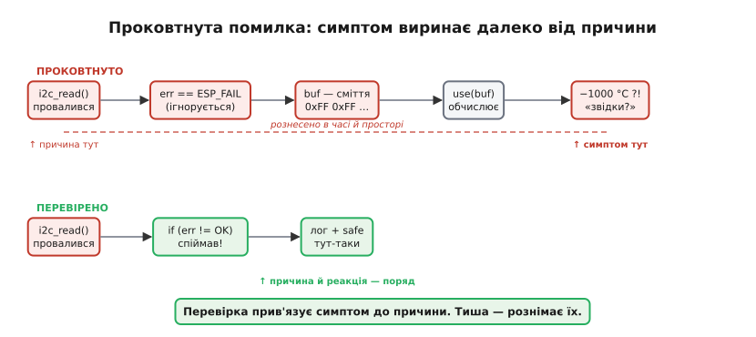
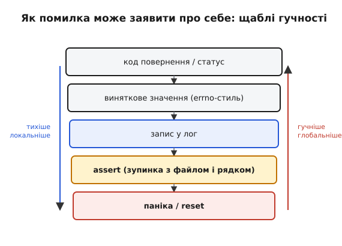

# Жодна помилка не мовчить

Найдешевший і найпідступніший збій — той, де помилка СТАЛАСЯ, але код її проковтнув і поїхав далі на зіпсованих даних. Пристрій вмирає не від того, що впав гучно, — а від того, що тихо продовжив жити неправильно. Тиша гірша за гучне падіння, бо ховає відстань між причиною й симптомом: коли пристрій нарешті поводиться дивно, місце поломки вже далеко позаду.

**Анатомія проковтнутої помилки.** Функція повертає **код помилки** (англ. *error code* — числову ознаку результату): для ESP-IDF це `esp_err_t`, для вказівника часто `NULL`, для класичного POSIX-стилю — `-1`. Викликач його не дивиться. Бере результат «як є» і рахує далі на тому, чого насправді немає. Проблема виринає не там, де помилка сталася, — а за «кілометр»: в іншій функції, через годину, у зовсім іншому місці коду. Між причиною і симптомом утворюється розрив у часі й просторі — і це головна шкода тихого збою. Кожна наступна функція, що довірилась зіпсованому результату, лише поглиблює яму.



*Проковтнута помилка розносить причину й симптом у часі та просторі. Перевірка прив'язує реакцію впритул до місця збою — тиша їх розриває.*

**Дві філософії.** «Помилка має бути ГУЧНОЮ» — це принцип **fail-fast** (англ. «впади швидко»): зупинитися якомога ближче до причини, не дати зіпсованому стану розповзтися. Протилежне — «тихо проігнорувати й поїхати далі» — здається м'якшим, але на мікроконтролері особливо дороге. Немає людини за монітором, немає типового логу «за замовчуванням», а симптом виявиться в полі через тижні. Інженер відкриє тікет «пристрій раз на тиждень показує −1000 °C», витратить день на пошук — і виявить, що причина за п'ятсот рядків вище: провалений I2C-read, який ніхто не перевірив. Один рядок `if (err != ESP_OK)` вартий того тижня.

Протиставлення «гучно проти тихо» — не те саме, що «зупинити проти продовжити». Гучно означає **зробити збій видимим** там, де він стався; що робити далі — окреме рішення. Часто правильна реакція якраз м'яка: пропустити зіпсований зразок і чекати наступного. Зле не «продовжити» — зле **продовжити мовчки, на брехливих даних**.

**Як помилка може заявити про себе — п'ять щаблів.** Від найтихішого до найгучнішого. Перший — **код повернення або статус**: функція повертає `esp_err_t`, `NULL`, `-1`, а викликач сам вирішує, що з цим робити. Другий — **виняткове значення у стилі errno**: глобальна змінна-ознака (англ. *error number*, «номер помилки»), яку можна перевірити трохи згодом. Третій — **запис у лог**: подія лишає слід для пізнішого розбору. Четвертий — **assert** (від англ. *to assert* — «стверджувати»): перевірка припущення, і при хибі — негайна зупинка з ім'ям файлу та номером рядка. П'ятий — **паніка й reset**: працювати далі небезпечно, єдиний вихід — перезапуск. Два найгучніші щаблі — [assert і паніку](root:sf-apps/assert-panic) — варто розбирати окремо, з їхніми компромісами. Тут важливий сам спектр: від локальної «розберися сам» до глобальної «зупини все».



*П'ять рівнів сигналу про помилку — від коду повернення до паніки. Що нижче, то гучніше й глобальніше; рівень добирають під природу збою.*

**«Помилка, якої не може бути» — теж помилка.** `default` у `switch`, «недосяжна» гілка `else`, «цього індексу не буває» — саме там ховаються найгірші баги. Якщо ваш `enum` має п'ять значень і `switch` покриває всі п'ять, шостого нібито не існує — але що станеться, коли через рік хтось додасть шосте й забуде оновити `switch`? Правило просте: **неможливе теж обробити** — бодай залогувати й зупинитися. Один рядок `default: ESP_LOGE(TAG, "unexpected state %d", state); abort();` рятує від годин полювання за «неможливим» багом, який раптом став можливим.

**Коди помилок чи винятки.** На мікроконтролері відповідь майже завжди — **коди повернення**, а не винятки (англ. *exception* — від латин. *exceptio*, «вилучення», тут: вихід зі звичайного шляху виконання). Причина не в моді, а в ціні; [докладне порівняння двох підходів](root:embedded/error-codes-vs-exceptions) показує, чому саме на вбудованих системах терези хиляться до кодів. Чистий C винятків не має взагалі: помилку доводиться повертати й перевіряти руками. C++ винятки існують, але в ESP-IDF вимкнені за замовчуванням — увімкнення додає кілька кілобайтів до прошивки й невидимі шляхи розкрутки стека, а на пристрої з лічених кілобайтів RAM кожен кілобайт і кожна прихована гілка на рахунку. Тож канон вбудованого C простий: функція повертає `esp_err_t`, викликач **перевіряє кожне повернення**. ESP-IDF навіть дає на це макроси: `ESP_ERROR_CHECK(x)` — fail-fast (надрукувати помилку й викликати `abort()`, коли результат не `ESP_OK`), а `ESP_RETURN_ON_ERROR` / `ESP_GOTO_ON_ERROR` — м'якша реакція з поверненням чи переходом на прибирання. Сам `ESP_OK` дорівнює нулю, тож звична перевірка `if (err != ESP_OK)` читається прямо.

**Worked-приклад.** ESP32 щохвилини зчитує температуру з давача LM75 по I2C і логує її. Той самий код без перевірки — і з нею.

**Варіант 1 — проковтнута помилка:**
```c
// ПОГАНО: помилку проковтнуто
void read_and_log_temp(void) {
    uint8_t buf[2];
    // i2c_master_read_from_device повертає esp_err_t, але ми її ігноруємо
    i2c_master_read_from_device(I2C_NUM_0, SENSOR_ADDR,
                                buf, sizeof(buf), pdMS_TO_TICKS(50));
    // якщо зчитування провалилось — buf містить сміття
    // (або нулі після ініціалізації — але нуль теж брехня)
    int16_t raw = (buf[0] << 8) | buf[1];
    float temp_c = raw * 0.0625f;           // для LM75: 0.0625 °C/біт
    ESP_LOGI(TAG, "Temp: %.2f C", temp_c);  // може вивести -1000 C
}
```
При збої I2C (обрив, зайнятість шини, тайм-аут) `buf` не оновлюється або лишається з попереднім вмістом. Скажімо, у буфері затримався патерн `0x80 0x00`:
```
raw     = (0x80 << 8) | 0x00 = 0x8000 = -32768   // int16, знаковий
temp_c  = -32768 * 0.0625    = -2048.0 C
```
Симптом «давач показує −2048 °C раз на годину» інженер не відтворить за столом, бо там I2C ніколи не падає. Він шукатиме поломку в давачі, у формулі, у живленні — усюди, крім справжньої причини.

**Варіант 2 — перевірений код:**
```c
// ДОБРЕ: помилка перевіряється й обробляється
void read_and_log_temp(void) {
    uint8_t buf[2];
    esp_err_t err = i2c_master_read_from_device(
        I2C_NUM_0, SENSOR_ADDR, buf, sizeof(buf), pdMS_TO_TICKS(50));

    if (err != ESP_OK) {
        ESP_LOGW(TAG, "I2C read failed: %s — skipping sample",
                 esp_err_to_name(err));
        return;   // не чіпаємо buf — він ненадійний; чекаємо наступного зразка
    }

    int16_t raw = (buf[0] << 8) | buf[1];
    float temp_c = raw * 0.0625f;
    ESP_LOGI(TAG, "Temp: %.2f C", temp_c);
}
```
Тепер провалений read лишає слід у логу точно там, де він стався. Пристрій не падає, але й не бреше: він просто пропускає один зразок. Інженер, що бачитиме `[WARN] I2C read failed: ESP_ERR_TIMEOUT` раз на годину, одразу знає — проблема в шині, а не в температурі. Помітьте: реакція тут якраз м'яка (`return`, чекаємо далі) — але збій став **видимим**. Це і є суть fail-fast: гучність не означає обов'язкову зупинку, вона означає, що збій не лишився непоміченим.

> 🔧 **Навіщо це.** У полі проковтнута помилка = «загадкове перезавантаження раз на тиждень» або «давач зрідка показує нісенітницю» — і інженер гадає годинами, де саме зламалось. Одна перевірка коду повернення перетворює загадку на конкретний запис у логу з файлом, рядком і назвою помилки. Це різниця між хворим місцем, що мовчить, і симптомом, що говорить.

Найдорожчий приклад цього — не на мікроконтролері, а в небі. 4 червня 1996 року перший політ ракети Ariane 5 закінчився за ~37 секунд: незахищене перетворення числа кинуло виняток, його ніхто не обробив, і блок навігації виставив на шину діагностичний код там, де керуючий комп'ютер чекав дані польоту. Ракета різко відхилила сопла, корпус почав руйнуватися, спрацював автопідрив. Повна анатомія аварії — як необроблений виняток, мертвий код і уявна надлишковість склались у ланцюг — у вставці [«Ariane 5, рейс 501»](root:sf-apps/error-handling/hist-ariane5.md).

Помітити збій — лише половина справи. Друга половина — обрати **рівень** відповіді: не кожна біда варта скидання всього пристрою, і не кожну можна пробачити мовчки. Десь доречно пропустити зіпсований зразок і піти далі, десь — зупинити все [assert'ом чи панікою](root:sf-apps/assert-panic). Спільне правило одне: між тихим «проковтнути» і гучним «зупинити» завжди свідомо обирає інженер, а не випадок.
