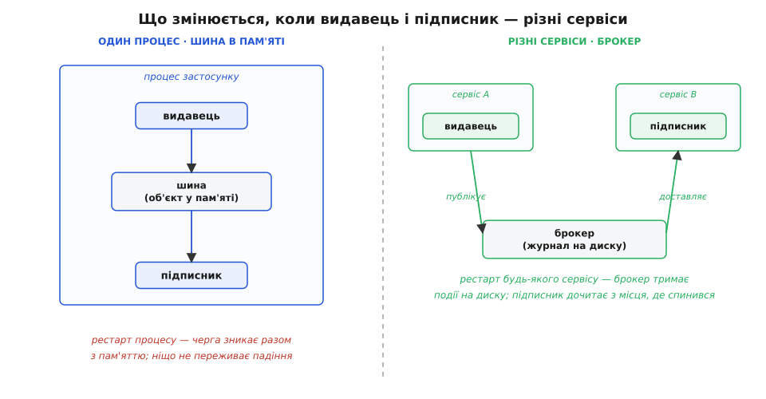
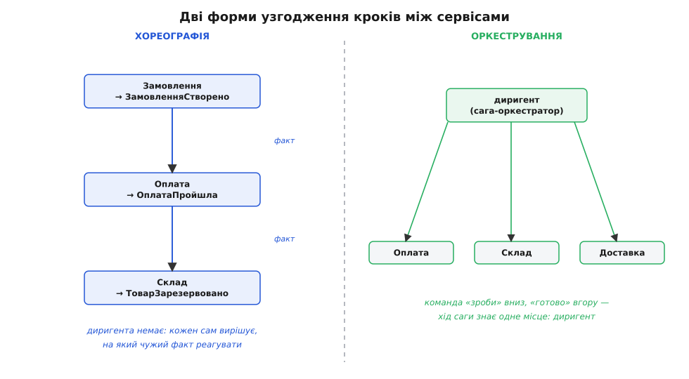

# Подієва архітектура між сервісами

<preknowlist>
- [Подієва архітектура всередині застосунку](topic:sf-apps/event-driven-architecture) — видавець оголошує факт, підписники самі реагують, шина посередині; тут та сама ідея, але видавець і підписник — різні застосунки.
- [Зчеплення і зв'язність](topic:sf-apps/coupling-cohesion) — чому пряме знання одного модуля про інший коштує грошей; між сервісами ця ціна ще вища.
- [Мікросервіси](topic:sf-apps/microservices) — навіщо систему ділять на окремі застосунки з власними базами; без цього незрозуміло, звідки взялися «різні сервіси».
- [Вісім оман розподілених обчислень](topic:sf-distributed/distributed-fallacies) — мережа ненадійна, віддалений виклик ≠ локальний, часткова відмова — норма; на цьому тримається половина статті.
- [Ідемпотентність](topic:sf-distributed/idempotency) — операція дає той самий результат, скільки разів її не повтори; без неї повтори доставки псують дані.
</preknowlist>

Уяви, що подієва шина всередині застосунку вже працює. `placeOrder` не кличе пошту й доставку поіменно — вона публікує факт `OrderPlaced`, а обробники самі на нього підписані. Зчеплення розв'язане, нові реакції додаються збоку, точка народження факту замкнена й більше не чіпається. Тепер прийшла вимога: оплату рахує окремий сервіс іншої команди, склад — узагалі стороння система, аналітику будує окремий застосунок на іншому кластері. І шина, яку ти написав як об'єкт у пам'яті, більше не годиться — бо видавець і підписники живуть у **різних процесах на різних машинах**.

Спокуса каже: та підмінімо реалізацію шини, і все. Замість `Map` у пам'яті поставимо якийсь брокер повідомлень — інтерфейс `publish`/`subscribe` лишиться тим самим. Ця спокуса не просто хибна — вона джерело найдорожчого класу помилок у розподілених системах. Бо перетнувши межу процесу, ти перетнув межу, за якою **зникають гарантії, на яких трималася вся простота шини в пам'яті**: що доставка миттєва, що вона надійна, що видавець і підписник або обидва живі, або обидва мертві, що подія не задвоїться. Жодна за межею процесу не діє, і кожну доведеться відбудовувати руками.

Сама ідея — оголошувати факт, а не кликати виконавця — переживає перехід чудово; вона навіть стає ціннішою, бо між командами розв'язка потрібніша, ніж між класами. Що не переживає перехід — це **дешевизна механізму**. Шина в пам'яті коштувала двадцять рядків. Надійний обмін подіями між сервісами коштує брокера, схеми контрактів, боротьби з дублями, узгодження порядку й окремого патерна проти розбіжності стану — і ця стаття про те, звідки береться кожна з цих цін і як не переплатити.

> 🔧 **Навіщо це.** Це та сама валюта, що й у шині в пам'яті — очевидність потоку в обмін на розв'язку, — але курс різко гірший. Усередині процесу розв'язка майже безкоштовна, тож поріг застосування низький. Між сервісами кожен обмін тягне мережу, а мережа ненадійна, тож поріг високий: зв'язок подіями окупається, коли команди мають рухатися **незалежно одна від одної**, і стає тягарем, коли ти просто розрізав надвоє те, що працювало як одне ціле. Уся стаття вчить розрізняти ці два випадки.

## Три стіни, що виростають на межі процесу

Щоб не діяти навпомацки, назвімо точно, що саме змінюється, коли подія покидає процес. Змін рівно три, і кожна — окрема стіна.

**Перша стіна: канал більше не миттєвий і не безкоштовний.** Усередині процесу `publish` — це виклик функції: керування переходить обробникові за наносекунди й гарантовано. Між сервісами `publish` — це відправлення по мережі до посередника, а звідти — доставка іншому процесу. Мережа має **затримку** (не нуль), **обмежену пропускну здатність** (не нескінченну) і **може загубити пакет** будь-коли. Тому посередник тут — не `Map`, а окремий застосунок, [брокер повідомлень](topic:sf-distributed/message-queue), що приймає події, кладе їх у **чергу на диску** й віддає підписникам. Диск — ключове слово: саме він дає те, чого пам'ять дати не могла, — переживання перезапуску.

**Друга стіна: часткова відмова стає нормою.** У шині в пам'яті видавець і підписник живуть однією долею: упав процес — упали обидва разом. Між сервісами вони вмирають **порізно**. Видавець живий, підписник лежить на деплої. Брокер живий, мережа до нього моргнула. Підписник живий, але захлинувся й відповідає з п'ятисекундною затримкою. У монолітному коді таких станів не існувало — там або все працює, або програма впала. Тут між «працює» і «впало» лежить цілий спектр напівстанів, і кожен треба передбачити.

**Третя стіна: спільної транзакції більше нема.** Найпідступніша. Усередині процесу видавець і синхронний обробник могли ділити одну транзакцію бази: все зафіксувалося або все відкотилося. Два різні сервіси з двома різними базами **не можуть бути в одній транзакції** — немає механізму, що атомарно охопив би запис у базу A й запис у базу B. А оскільки брокер — теж окрема система зі своїм сховищем, то навіть один сервіс, що пише в **свою** базу й публікує подію в брокер, робить **два незалежні записи**, які можуть розійтися. Ця тріщина породжує окрему знамениту проблему.



*Ідея та сама — оголосити факт, не кликати виконавця. Змінюється посередник: замість об'єкта в пам'яті, що вмирає з процесом, — брокер із журналом на диску, який переживає падіння й дозволяє підписникові дочитати з місця, де він спинився.*

Ці три стіни не скасувати кмітливим кодом — вони фізичні. Уся інженерія розподілених подій — це набір прийомів **жити з ними**, а не долати їх. Розберімо їх у тому порядку, у якому вони кусають на практиці.

## Проблема подвійного запису — фірмовий баг розподілених подій

Почнімо з третьої стіни, бо саме вона валить новачків найчастіше й найтихіше.

Сервіс замовлень робить дві речі в одній бізнес-операції: зберігає замовлення у свою базу й публікує `OrderPlaced` у брокер, щоб про факт дізналися оплата, склад, аналітика. У коді це виглядає невинно — два рядки поспіль:

:::tabs
```ts
async function placeOrder(cart: Cart): Promise<void> {
  const order = await db.saveOrder(cart);        // запис 1: у власну базу
  await broker.publish("OrderPlaced", {          // запис 2: у брокер
    orderId: order.id, userId: cart.userId,
  });
}
```
```python
async def place_order(cart: Cart) -> None:
    order = await db.save_order(cart)            # запис 1: у власну базу
    await broker.publish("OrderPlaced", {        # запис 2: у брокер
        "order_id": order.id, "user_id": cart.user_id,
    })
```
:::

Два рядки — два **окремі** записи у **дві різні** системи, і між ними немає спільної транзакції. Тепер уяви, що процес упав **між** рядками: база вже зафіксувала замовлення, а `publish` не встиг. Замовлення в базі є — а події немає й не буде ніколи. Оплата не дізнається, що треба брати гроші. Склад не зарезервує товар. Замовлення повисло привидом: воно ніби існує, але для решти системи його не сталося.

Або дзеркально: спершу опублікували подію, а тоді впали до `saveOrder`. Тепер оплата й склад думають, що замовлення є, беруть гроші й резервують товар — а в базі замовлень порожньо.

Це і є **проблема подвійного запису** (англ. *dual write* — «подвійний запис»): коли одна логічна операція мусить оновити дві незалежні системи, яких **не можна оновити атомарно**, будь-який збій між двома записами лишає їх у неузгодженому стані, і полагодити це вже нічим — бо немає транзакції, що обійняла б обидві. Проблема **фундаментальна**: вона виникає щоразу, коли сервіс пише і в свою базу, і кудись назовні — у брокер, у чужу базу, в індекс пошуку, в кеш.

Наївний рефлекс — «зробімо одну транзакцію на дві системи». Розподілені транзакції двофазної фіксації теоретично це вирішують, але в подієвих системах їх майже не вживають: вони тримають **блокування** через кілька систем, погано масштабуються й вимагають, щоб **усі учасники були одночасно живі** — а це прямо суперечить другій стіні, заради обходу якої ми й розв'язували сервіси. Лік має бути таким, щоб не тягнути назад єдину транзакцію.

Лік називається **транзакційна скринька** (англ. *transactional outbox* — «вихідна скринька в транзакції»), і його ідея елегантна. Сервіс має **лише одну** базу, у якій уміє робити атомарну транзакцію. То й запишемо в цю транзакцію **обидва наміри одразу**: і самі дані замовлення, і рядок «треба розіслати подію `OrderPlaced`» — в окрему табличку-скриньку, у тій самій базі, у тій самій транзакції. Атомарність однієї бази гарантує: **або зафіксувалося і замовлення, і намір його розіслати — або ні те, ні те**. Розбіжність зникла в корені, бо два записи стали одним.

:::tabs
```ts
async function placeOrder(cart: Cart): Promise<void> {
  await db.transaction(async (tx) => {
    const order = await tx.saveOrder(cart);          // дані…
    await tx.insertOutbox({                           // …і намір — в ОДНІЙ транзакції
      type: "OrderPlaced",
      payload: { orderId: order.id, userId: cart.userId },
    });
  }); // ← або зафіксувалося все разом, або нічого
}
```
```python
async def place_order(cart: Cart) -> None:
    async with db.transaction() as tx:
        order = await tx.save_order(cart)             # дані…
        await tx.insert_outbox(                        # …і намір — в ОДНІЙ транзакції
            type="OrderPlaced",
            payload={"order_id": order.id, "user_id": cart.user_id},
        )
    # ← або зафіксувалося все разом, або нічого
```
:::

А хто ж доправить подію в брокер? Окремий процес — **відправник скриньки** (relay). Він раз у раз вичитує зі скриньки нерозіслані рядки, публікує їх у брокер і позначає розісланими. Упаде посеред роботи — не біда: недопублікований рядок лишиться в скриньці, і наступний прохід його підбере. Публікація стала **надійною**, бо намір її зробити живе в базі, а не в летючій пам'яті процесу.


*Два незалежні записи неминуче колись розійдуться на збої між ними. Скринька зводить їх до одного атомарного запису в базу: намір розіслати подію фіксується разом із даними, а окремий відправник дочитує його з бази вже надійно.*

> 🔧 **Навіщо це.** Правило-детектор на щодень: щойно ти бачиш у коді **два записи в різні системи поспіль** — у базу й одразу в брокер, у базу й одразу в чужий API — зупинись, бо це подвійний запис і він колись розійдеться. Питання не «чи розійдеться», а «коли й наскільки дорого». Якщо втрата одного з двох записів терпима (лог, необов'язкова аналітика) — можна лишити як є, свідомо. Якщо ні (гроші, замовлення, юридичний факт) — потрібна скринька або споріднений прийом. Плутати ці випадки — прямий шлях до привидів у базі й списаних грошей за неіснуючий товар. Повний розбір самого патерна — [транзакційна скринька](topic:sf-distributed/outbox-pattern); тут головне впізнати сам симптом.

## Доставка ненадійна: дублі й ідемпотентність

Скринька гарантувала, що подія **не загубиться** дорогою в брокер. Але надійна доставка має зворотний бік, який дивує вперше: щоб не загубити подію, брокер **іноді доставляє її двічі**.

Логіка тут неминуча. Брокер віддав підписникові подію й чекає підтвердження «прийняв, обробив». Підтвердження йде назад по мережі — і не доходить: підписник обробив, але його «ок» загубився. Брокер стоїть перед вибором. Вважати, що дійшло, — ризик загубити подію назавжди, якщо насправді не дійшло. Надіслати ще раз — ризик дубля, якщо насправді дійшло. Загубити подію звичайно дорожче, ніж обробити двічі, тож надійні брокери обирають друге: доставляють **щонайменше один раз** (англ. *at-least-once*). А це значить прямо: підписник **побачить деякі події двічі**, і це не збій, а обіцяна поведінка.

Наслідок жорсткий. Обробник бонусів спрацював на дубль — подвійні бали. Обробник оплати — з картки зняли двічі. Обробник листа — покупцеві прийшло два однакові листи. Одна загублена «ок» перетворилася на подвійне списання грошей.

Ліки — **ідемпотентність**: властивість операції давати той самий результат, скільки б разів її не повторили. «Нарахувати +100 балів» не ідемпотентна: два виклики — двісті балів. «Встановити баланс балів у 100» ідемпотентна: хоч десять викликів — сто. Але переписати всю логіку на «встановити» вдається рідко. Практичніший загальний спосіб — **запам'ятовувати оброблені події за їхнім ідентифікатором** і глушити повтор. Для цього кожна подія мусить нести власний **унікальний id саме цього оголошення** (не id замовлення — їх на одне замовлення багато різних подій):

:::tabs
```ts
async function onOrderPlaced(e: OrderPlaced): Promise<void> {
  // дедуплікація і обробка — в ОДНІЙ транзакції споживача
  await db.transaction(async (tx) => {
    const seen = await tx.markProcessed(e.eventId);  // унікальний ключ — eventId
    if (!seen) return;                                // вже бачили цю подію — виходимо
    await tx.chargePayment(e.orderId, e.amount);      // сам ефект
  });
}
```
```python
async def on_order_placed(e: OrderPlaced) -> None:
    # дедуплікація і обробка — в ОДНІЙ транзакції споживача
    async with db.transaction() as tx:
        seen = await tx.mark_processed(e.event_id)   # унікальний ключ — event_id
        if not seen:
            return                                    # вже бачили цю подію — виходимо
        await tx.charge_payment(e.order_id, e.amount) # сам ефект
```
:::

Тут ховається та сама пастка подвійного запису, тільки на боці споживача: якщо позначити подію обробленою **окремо** від самого ефекту, вони можуть розійтися — позначили, а до `chargePayment` впали, і оплата загубилась назавжди, бо повтор тепер відсіється як «уже бачили». Тому дедуплікацію й ефект кладуть **в одну транзакцію бази споживача**. Цей приклад дедуплікації розростається у власний патерн — [вхідну скриньку](topic:sf-distributed/inbox-pattern), дзеркальну до вихідної: таблиця бачених id, звірка перед ефектом, усе атомарно.

> 🔧 **Навіщо це.** Питання, що рятує від найтихішого класу багів: «**що станеться, якщо цю подію обробити двічі?**». Постав його **кожному** обробникові, бо at-least-once — не рідкісний збій, а щоденна реальність під навантаженням. «Нічого, результат той самий» — обробник ідемпотентний, спи спокійно. «Спишемо гроші двічі» — обробник **треба** зробити ідемпотентним, інакше баг не «якщо», а «коли». Глибший розбір гарантій — [at-most-once / at-least-once / effectively-once](topic:sf-distributed/delivery-guarantees).

## Порядок, якого немає, і порядок, який купують ключем

Другий сюрприз розподіленої доставки — з порядком. У монолітному коді порядок задавав текст: що написано вище, спрацює раніше. Між сервісами порядку **немає за замовчуванням**.

Чому. Брокер, щоб масштабуватися, розкидає події по кількох незалежних смугах (їх звуть партиціями чи чергами-шардами), і кожну обробляє свій споживач у своєму темпі. Дві події, кинуті одна за одною, можуть лягти в різні смуги й прийти до різних споживачів у **будь-якому** порядку. Додай повтори: перевидана подія прилітає ще пізніше, вже після наступних. Тому закладатися, що `OrderPaid` прийде після `OrderPlaced` **просто тому, що оплата логічно пізніша**, — помилка, яка вилазить рідко й боляче.

Повного глобального порядку в масштабованій системі дешево не купити — та він майже ніколи й не потрібен. Потрібен звичайно **порядок у межах однієї сутності**: усі події про замовлення №42 мають дійти по черзі, а події замовлень №42 і №77 можуть іти як завгодно — вони незалежні. Цей вужчий порядок купується просто: подіям однієї сутності дають **спільний ключ** (тут — `orderId`), а брокер гарантує, що події з однаковим ключем лягають в **одну** смугу й доставляються по черзі. Обери ключ так, щоб усе, що мусить іти впорядковано, ділило його.

А події, які **все одно** прийшли не в тому порядку, бо спільний ключ зробити не вийшло, треба вміти терпіти. Часто рятує та сама ідемпотентність плюс перевірка версії: обробник дивиться на номер версії сутності в події й **ігнорує старіше за те, що вже бачив**. Прийшла «стан замовлення → сплачено, версія 5», а в базі вже версія 7 — значить, це запізніла стара новина, застосовувати її не можна. Так система стає **толерантною до безладу**, замість вимагати неможливого — ідеального порядку.

Коли ж між двома наслідками є **справжня залежність за порядком** — B не має сенсу без A перед ним, — це сигнал, що, можливо, B і A не два незалежні наслідки, а один крок, який не варто було розривати на два сервіси. Подія добре розв'язує **незалежні** реакції; там, де реакції жорстко впорядковані, розрив подією коштує дорожче, ніж дає.

## Тонка подія чи товста — і чому вибір гостріший між сервісами

Лишається питання, що клали й у шину в пам'яті: **що саме** нести всередині події. Але між сервісами цей вибір стає значно гострішим, бо «сходити в базу за деталями» тепер означає **мережевий виклик до чужого сервісу іншої команди**.

Мартін Фаулер у розборі «Багато значень подієвої архітектури» (стаття на martinfowler.com, 2017) розкладає подієві стилі на кілька різних речей; два з них — це прямо наші тонка й товста події, тільки названі точніше.

**Сповіщення про подію (event notification)** — тонка подія: сам факт та ідентифікатор, `{ orderId: 42 }`. Хто хоче деталей — іде по них до джерела. Плюс: подія крихітна, видавцеві не треба вгадувати, кому що знадобиться. Мінус, і між сервісами він важкий: кожен споживач мусить **зробити зворотний виклик до сервісу-джерела**, щоб дочитати замовлення. З'явилося нове зчеплення — за викликом і за доступністю: якщо сервіс замовлень лежить, споживач не може дообробити подію. Ми розв'язали видавця й підписника в одному місці й тут-таки зв'язали їх в іншому.

**Перенесення стану в події (event-carried state transfer)** — товста подія: у ній лежить усе, що споживачеві може знадобитися — сума, склад кошика, дані покупця. Плюс великий: споживач **самодостатній**, назад до джерела не ходить, а отже переживає падіння джерела й тримає в себе копію потрібного стану. Мінус: подія розбухає, видавець мусить наперед знати, що всім потрібно, а **зміна її форми зачіпає всіх споживачів через межі команд** — питання контракту, до якого ми дійдемо.

Орієнтир той самий, що й усередині процесу, але з поправкою на ціну мережі. Клади в подію те, що **описує сам факт** і застигло назавжди: які товари й за якою ціною замовлено в цю мить — це властивість події, вона не зміниться. А те, що споживачеві треба **свіжим на момент реакції** — поточний рейтинг покупця, актуальний залишок, — тонше: за ним усе одно доведеться йти до джерела, як подію не роздувай. Практичне зміщення проти монолітної шини: **між сервісами товща подія звичайно вигідніша**, бо вона гасить найдорожче — синхронну залежність від чужого сервісу. Кожен зворотний виклик до джерела повертає ту саму мережну крихкість, від якої ми тікали. Товста подія її прибирає ціною розміру й жорсткішого контракту. І тримай подію [незмінною](topic:sf-apps/immutability) — це знімок того, що вже сталося, його не редагують заднім числом.

## Хореографія чи оркестрування: хто веде багатокроковий процес

Досі кожна подія жила сама по собі. Але бізнес-операції часто **багатокрокові** й розтягнуті на кілька сервісів: оформити замовлення → взяти оплату → зарезервувати товар → запланувати доставку. Усередині моноліту це була б одна транзакція: все або нічого. Між сервісами єдиної транзакції нема, тож послідовність кроків ведуть інакше — і є два різні способи, які легко сплутати.

**Хореографія (choreography)** — танець без диригента. Кожен сервіс слухає факти інших і сам вирішує, коли вступити. Сервіс замовлень публікує `OrderPlaced`. Сервіс оплати підписаний на нього — бере гроші й публікує `PaymentTaken`. Сервіс складу підписаний уже на `PaymentTaken` — резервує товар і публікує `StockReserved`. Ніхто не командує згори; ланцюг тримається на тому, що кожен реагує на чужий факт. Це подієвість у чистому вигляді, і вона дає **максимальну автономію**: додати новий крок — підписати новий сервіс на потрібний факт, нікого не питаючи. Плата — **розмазаність логіки**: щоб зрозуміти весь процес замовлення, треба обійти всі сервіси й скласти картину з їхніх підписок; єдиного місця, де видно ланцюг цілком, немає.

**Оркестрування (orchestration)** — є диригент. Окремий компонент-координатор знає весь сценарій і **шле команди**: «оплато, візьми гроші» → чекає «готово» → «складе, зарезервуй» → чекає «готово» → «доставко, заплануй». Хід усього процесу зібраний в одному місці — диригентові, — і саме там видно, на якому кроці все стоїть. Плата дзеркальна: диригент **знає про всіх** і мусить мінятися, коли міняється сценарій; автономія нижча, зчеплення до координатора вище.



*Хореографія розсіює логіку процесу по сервісах заради автономії — ціною того, що весь ланцюг ніде не видно цілком. Оркестрування збирає логіку в диригента заради видимості — ціною того, що диригент знає про всіх і мусить мінятися разом зі сценарієм.*

А що, коли крок посеред ланцюга **провалився** — оплата пройшла, а товару на складі не виявилось? Відкотити транзакцію не можна: грошей уже нема, а спільної транзакції ніколи й не було. Тому багатокроковий процес між сервісами будують як **сагу** (англ. *saga* — «сказання, довга послідовність»): ланцюг кроків, де кожен має **компенсацію** — дію, що скасовує зроблене раніше. Провалився резерв складу — сага виконує компенсацію оплати: **повертає гроші**. Не «відкотити», а «зробити дію, яка врівноважує попередню». Повний розбір із компенсаціями й напівстанами — окрема тема [саги](topic:sf-distributed/saga-pattern); тут важливо бачити саму розвилку: узгодженість між сервісами будують **компенсаціями, а не відкотами**, бо відкочувати вже нічого.

> 🔧 **Навіщо це.** Орієнтир вибору: що дорожче в цьому процесі — **автономія команд чи видимість ходу**. Простий ланцюг із двох-трьох кроків, кожен від своєї команди, — хореографія: дешево, автономно, розсіяність терпима. Складний сценарій із розгалуженнями, компенсаціями й вимогою «завжди знати, де застрягло замовлення» — оркестрування: диригент вартий свого зчеплення, бо інакше налагоджувати процес по семи сервісах стає пеклом. Помилка обох напрямів: тягнути диригента в тривіальний ланцюг або лишати хореографію в заплутаному процесі, де ніхто не годен простежити, що по чому.

## Подія — це публічний контракт, а не структура в коді

Є різниця, невидима зсередини одного застосунку, але вирішальна між сервісами. Усередині процесу форма події — це просто тип у твоєму коді: захотів — перейменував поле, і компілятор показав усі місця, які треба поправити. Між сервісами форма події — це **публічний контракт між командами**, і компілятор тобі більше не помічник, бо споживачі — в чужих репозиторіях, зібрані окремо, задеплоєні окремо.

Наслідок суворий: **подію не можна просто взяти й змінити**. Прибрав поле, яке комусь було потрібне, — чужий сервіс упав, і ти навіть не знав, що він те поле читав. Змінив зміст поля (був `amount` у гривнях, став у копійках) — ніхто не помітив, аж поки бухгалтерія не порахувала в сто разів менше. Між сервісами діє те саме правило, що й для будь-якого публічного API: **міняй лише сумісно назад**. Додавати нові необов'язкові поля — можна, старі споживачі їх просто ігнорують. Прибирати чи змінювати наявні — не можна без узгодженого переходу через версії.

Щоб цей контракт не тримати в головах, його **записують явно** — оголошують схему події (які поля, яких типів, які обов'язкові) у спільному [реєстрі схем](topic:com-protocol/schema-registry), який ще й уміє перевіряти сумісність нової версії зі старою й не пустити несумісну зміну в прод. Схема перетворює усну домовленість між командами на перевірюваний артефакт.

Глибша причина цієї проблеми — соціальна. Подієві межі між сервісами майже завжди збігаються з межами **команд**: сервіс оплати робить команда оплати, сервіс складу — команда складу. За [законом Конвея](topic:sf-apps/conways-law) система дзеркалить структуру організації, що її будує, тож контракт події — це, по суті, **інтерфейс між двома командами людей**. Змінити його односторонньо — те саме, що змінити API, яким користуються сусіди, не сказавши їм. Тому дисципліна контрактів тут не бюрократія, а те, що взагалі дозволяє командам рухатися незалежно, — заради чого подієвий стиль між сервісами й затівали.

## Ціна, яку платиш, і коли по неї варто йти

Час чесно скласти рахунок — не оспівати переваги, а назвати, за що саме береш гроші, бо саме нетверезість щодо ціни й губить розподілені подієві системи.

**Зчеплення в просторі ти зняв, але купив зчеплення в часі.** Видавець більше не знає підписників — добре. Натомість причина й наслідок роз'їхалися в **часі**: подія оброблюється потім, десь-інде, і система стала **кінцево узгодженою** — між публікацією факту й реакцією на нього є вікно, коли різні сервіси бачать світ по-різному. Замовлення оформлене, а в аналітиці його ще нема кілька секунд. Це не баг — це природа асинхронності, і бізнес мусить із цим вікном жити свідомо.

**Видимість потоку падає ще нижче, ніж у монолітній шині.** Там підписники були хоч в одному процесі — знайшов їх пошуком по коду. Тут вони в **інших репозиторіях інших команд**, а стек викликів обривається на брокері безнадійно: над ним — сервіс A, під ним — сервіс B, зв'язку в жодному стеку немає. Тому спостережність (наскрізне трасування, кореляційні id, що пронизують подію через усі сервіси) — не розкіш, а **умова**, без якої розподілену подієву систему неможливо налагоджувати.

**З'явився цілий клас нових відмов, яких у моноліті не існувало:** подвійний запис, дублі доставки, безлад порядку, отруйні події, що падають вічно й забивають чергу, розбіжність контрактів між версіями. Кожну треба передбачити й обробити — реальний інженерний тягар, розмазаний по всій системі.

Звідси — коли по цю ціну **варто** йти. Не «бо мікросервіси модні» й не «бо подія звучить сучасно». А коли справджуються дві умови разом. Перша: реакцій на факт **багато, вони від різних команд і множаться** — той самий біль «один-до-багатьох, що росте», що й у монолітній шині, тільки зростання йде від різних відділів. Друга, специфічно розподілена: цим командам треба **рухатися й деплоїтися незалежно одна від одної**, і синхронний виклик між ними був би ланцюгом, що валить одну команду через падіння іншої. Обидві умови разом — подієвий зв'язок між сервісами окупається сторицею: команди автономні, факт розноситься сам, нові споживачі підключаються збоку.

А коли хоч однієї умови нема — придивись, чи не розрізаєш ти надвоє те, що працювало як одне ціле. Якщо два «сервіси» завжди міняються разом, деплояться разом і не мають сенсу окремо — то ти не розв'язав їх подією, а лише поставив між ними ненадійну мережу й повний набір розподілених відмов там, де раніше був виклик функції: уся ціна сплачена, а незалежності, заради якої платили, немає. Часто чесніша відповідь тут — один [модульний моноліт](topic:sf-apps/modular-monolith) із чіткими межами всередині, де подієва шина лишається **в пам'яті**, а мережа з'являється лише там, де межі команд справді того варті.

Останнє, найважливіше. Подієва архітектура між сервісами — **не наступний щабель зрілості**, на який усі колись мають зійти, а інструмент проти конкретної пари болів: розростання реакцій **плюс** потреба в незалежності команд. Там, де ці болі реальні, вона безцінна. Розкидана «бо так роблять дорослі системи» — вона перетворює просту роботу на розподілений жах, де операція з трьох кроків розмазана по п'яти сервісах, трьох брокерах і двох тижнях розслідування чергового привида в базі. Різниця між цими двома долями — не в силі інструмента, а в тверезості того, хто вирішує його дістати.
