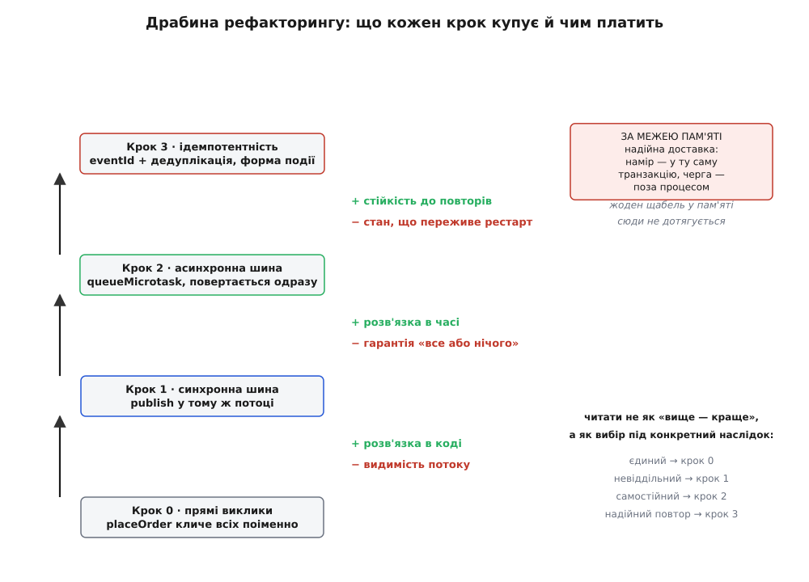

# ⚙️ Рефакторинг товстого `placeOrder` у подієвий: крок за кроком, з рахунком за кожен

Про подієвий стиль легко говорити гаслами: «розв'яжи видавця й підписників», «оголошуй факти, не викликай слухачів». Гасла правдиві, але порожні, доки не сядеш переписувати справжню функцію й не побачиш на власні очі, що кожен крок цієї розв'язки **щось дає й щось водночас забирає** — і що ціна, яку платиш, змінюється з кожним кроком. Тож візьмемо одну конкретну реалізацію оформлення замовлення, доведемо її до стану, коли вона тріщить, і перепишемо в чотири ходи: прямі виклики → синхронна шина → асинхронна шина з ловлею збоїв → ідемпотентність і виділена форма події. На кожному ході — робочий код (TypeScript і Python, обидва ідіоматично), і чесний рахунок: що цей хід **купив** (видимість, ізоляцію збою, гарантію) і чим за це **заплатив**.

Це не «подієвий стиль кращий». Це: ось стільки видимості потоку там, ось стільки ізоляції збою тут, ось де зникає непіймана помилка, ось на якому рядку розбивається ілюзія «в пам'яті — значить надійно». Різницю видно не на словах, а в самих типах і в тому, куди летить виняток.

Увесь код нижче — робочий: TypeScript компілюється як є (`strict`), Python — під 3.10+. Обидві мови тут на своєму місці: це загальний прикладний код рівня застосунку, а не регістри чи syscalls, тож жодну з них не притягнуто силоміць — обидві природні для такої задачі, і корисно бачити той самий рух двома руками.

## Крок 0. Товста функція, з якої все починається

Ось `placeOrder` такою, якою вона стає за рік життя. Спершу вона робила своє — зберегти замовлення, зарезервувати товар. Потім бізнес почав дописувати наслідки, і кожен ліг сюди ж, прямим викликом.

:::tabs
```ts
async function placeOrder(cart: Cart): Promise<Order> {
  const order = await saveOrder(cart);        // головна дія
  await reserveStock(order);                   // головна дія

  // …а далі наросли наслідки, кожен — прямий виклик чужого модуля
  await sendConfirmationEmail(order);          // пошта
  await awardLoyaltyPoints(order);             // бонуси
  await notifyShipping(order);                  // доставка
  await trackSaleAnalytics(order);             // аналітика

  return order;
}
```
```python
async def place_order(cart: Cart) -> Order:
    order = await save_order(cart)             # головна дія
    await reserve_stock(order)                 # головна дія

    # …а далі наросли наслідки, кожен — прямий виклик чужого модуля
    await send_confirmation_email(order)       # пошта
    await award_loyalty_points(order)          # бонуси
    await notify_shipping(order)               # доставка
    await track_sale_analytics(order)          # аналітика

    return order
```
:::

Придивись, що тут не так, — і не так тут не довжина. Роботу все одно треба зробити: лист має піти, бали нарахуватися. Погано інше: **`placeOrder` тримає в собі список усіх зацікавлених**. Вона імпортує пошту, доставку, аналітику, бонуси — знає про чотири чужі царини, до яких її власна справа стосунку не має. Додати п'яту вимогу (проведення в бухгалтерію) — дописати сюди п'ятий рядок і п'ятий імпорт. Ця функція стала вузлом, крізь який проходить пів системи.

І є друга, тонша біда, схована в `await`. Виклики стоять **послідовно**, і кожен блокує наступний. Пошта відповідає повільно — бали чекають на пошту. Доставка впала винятком — і цей виняток проб'ється нагору, крізь `return order`, який ніколи не виконається, і **зірве все оформлення**. Замовлення вже в базі (той `await saveOrder` відпрацював і зафіксувався), товар зарезервований — а функція кинула виняток, бо не достукалася до служби доставки. Викликач бачить провал там, де головна дія насправді вдалася. Другорядне сповіщення скасувало головний факт.

> 🔧 **Навіщо це.** Найдорожчий код — той, що змінюють найчастіше, бо кожна зміна ризикує зламати сусідні рядки. `placeOrder` — саме такий: бізнес щомісяця вигадує новий наслідок замовлення, і кожен приземляється в цю одну функцію. Поки наслідків два — це терпимо. Коли їх десять і вони від різних команд — правка одного (змінили шаблон листа) змушує відкривати й перечитувати код, що з листами не має нічого спільного. Мета всього рефакторингу нижче — вивести `placeOrder` з-під цього вогню.

## Крок 1. Синхронна шина: видавець перестає знати слухачів

Перший хід — розірвати те головне зчеплення: щоб `placeOrder` більше **не знала, кого кличе**. Замість чотирьох іменних викликів вона оголосить один факт, а хто на нього зреагує — вирішать самі реакції, підписавшись збоку.

Шина в її найпростішому вигляді — це словник «ім'я події → список обробників». Двадцять рядків.

:::tabs
```ts
type Handler = (event: unknown) => void;

class EventBus {
  private handlers = new Map<string, Handler[]>();

  subscribe(type: string, handler: Handler): void {
    const list = this.handlers.get(type) ?? [];
    list.push(handler);
    this.handlers.set(type, list);
  }

  // викликає обробників ЗАРАЗ ЖЕ, у тому самому потоці
  publish(type: string, event: unknown): void {
    for (const handler of this.handlers.get(type) ?? []) {
      handler(event);
    }
  }
}
```
```python
from collections import defaultdict
from typing import Callable

class EventBus:
    def __init__(self) -> None:
        self._handlers: dict[str, list[Callable]] = defaultdict(list)

    def subscribe(self, type_: str, handler: Callable) -> None:
        self._handlers[type_].append(handler)

    # викликає обробників ЗАРАЗ ЖЕ, у тому самому потоці
    def publish(self, type_: str, event: object) -> None:
        for handler in self._handlers[type_]:
            handler(event)
```
:::

Тепер `placeOrder` худне до самої суті. Вона робить своє й оголошує, що зробила:

:::tabs
```ts
function placeOrder(cart: Cart): Order {
  const order = saveOrder(cart);
  reserveStock(order);
  bus.publish("OrderPlaced", { orderId: order.id, userId: cart.userId });
  return order;
}
```
```python
def place_order(cart: Cart) -> Order:
    order = save_order(cart)
    reserve_stock(order)
    bus.publish("OrderPlaced", {"order_id": order.id, "user_id": cart.user_id})
    return order
```
:::

А чотири наслідки переселяються геть, кожен у свій модуль, і самі підписуються — в одному місці, у збірці застосунку:

:::tabs
```ts
// composition root: усі підписки зібрані тут, на видноті
bus.subscribe("OrderPlaced", (e) => sendConfirmationEmail(e));
bus.subscribe("OrderPlaced", (e) => awardLoyaltyPoints(e));
bus.subscribe("OrderPlaced", (e) => notifyShipping(e));
bus.subscribe("OrderPlaced", (e) => trackSaleAnalytics(e));
```
```python
# composition root: усі підписки зібрані тут, на видноті
bus.subscribe("OrderPlaced", lambda e: send_confirmation_email(e))
bus.subscribe("OrderPlaced", lambda e: award_loyalty_points(e))
bus.subscribe("OrderPlaced", lambda e: notify_shipping(e))
bus.subscribe("OrderPlaced", lambda e: track_sale_analytics(e))
```
:::

**Що цей хід купив.** Форма залежностей перевернулася. Раніше стрілки йшли **з** `placeOrder` **до** пошти, доставки, аналітики — вона залежала від усіх чотирьох, знала їхні імена, імпортувала їхній код. Тепер стрілки з обох боків указують **на шину**: `placeOrder` знає лише `bus.publish`, обробники знають лише `bus.subscribe`, а один про одного — ніхто. Додати п'яте сповіщення — дописати `subscribe` у збірці; код `placeOrder` при цьому не відкриваєш. Вузол розв'язано: точку, де народжується факт, ти замкнув раз.

**Чим заплатив.** Видимістю потоку. У кроці 0 ти відкривав `placeOrder` і бачив геть усе, що станеться після замовлення — чотири рядки, чотири наслідки, як на долоні. Тепер ти бачиш `bus.publish("OrderPlaced", …)` і **нічого більше**. Щоб дізнатися, що ж відбувається на цю подію, треба піти в збірку застосунку й прочитати список підписок. Стек викликів обірвався: над шиною — видавець, під шиною — обробник, а прямого зв'язку в стеку між ними немає. Ти виміняв очевидність на розв'язку — і поки що це все, що змінилося.

**А от чого цей хід НЕ купив — і це головна пастка кроку 1.** Шина синхронна: `publish` іде по обробниках **у тому ж потоці** й не повертається, доки останній не відпрацював. Тобто дві біди кроку 0 нікуди не поділися, лише переїхали за шину. Повільний обробник так само тримає видавця. А непійманий виняток в обробнику так само пробивається нагору — тепер крізь `publish` — і валить `placeOrder`. Дивись:

:::tabs
```ts
bus.subscribe("OrderPlaced", (e) => notifyShipping(e));
// notifyShipping лізе в зовнішній сервіс; той упав і кинув виняток.
// Виняток летить: notifyShipping → цикл у publish → placeOrder → викликач.
// Замовлення в базі є, а placeOrder «провалилася» через збій доставки.
```
```python
bus.subscribe("OrderPlaced", lambda e: notify_shipping(e))
# notify_shipping лізе в зовнішній сервіс; той упав і кинув виняток.
# Виняток летить: notify_shipping → цикл у publish → place_order → викликач.
# Замовлення в базі є, а place_order «провалилася» через збій доставки.
```
:::

Синхронна шина розв'язала залежність **у коді** (хто кого знає), але не розв'язала долі **в часі**: видавець і обробники досі живуть однією операцією, падають разом і чекають одне на одного. Іноді саме це й треба — коли наслідок невіддільний від дії (оновити зведений баланс рахунку в тій самій транзакції: не оновилось — відкочуй і проведення). Але лист, доставка, аналітика — наслідки **самостійні**; головна дія не повинна від них ні залежати, ні чекати. Щоб їх по-справжньому відв'язати, розв'язки в коді замало — потрібна розв'язка в часі.

## Крок 2. Асинхронна шина: розв'язка не лише в коді, а й у часі

Другий хід — зробити `publish` таким, що **кладе подію й одразу повертається**, а обробники йдуть окремо, наступним тактом. Тоді `placeOrder` завершується миттєво, не чекаючи ні пошти, ні доставки, і жоден повільний чи впалий обробник її вже не зачепить.

Ключ — `queueMicrotask` у TypeScript (і `asyncio` у Python): він каже «виконай це не зараз, а щойно поточна робота добіжить до паузи». У JavaScript це **мікрозадача** — вона стане в чергу мікрозадач і виконається після поточного синхронного коду, але раніше за будь-який таймер чи ввід-вивід. Саме те, що треба: видавець дороблює своє й повертається, а обробники прокидаються одразу по тому.

:::tabs
```ts
type AsyncHandler = (event: unknown) => Promise<void> | void;

class AsyncEventBus {
  private handlers = new Map<string, AsyncHandler[]>();

  subscribe(type: string, handler: AsyncHandler): void {
    const list = this.handlers.get(type) ?? [];
    list.push(handler);
    this.handlers.set(type, list);
  }

  // повертається ОДРАЗУ; обробники йдуть у наступному такті
  publish(type: string, event: unknown): void {
    const handlers = this.handlers.get(type) ?? [];
    queueMicrotask(async () => {
      for (const handler of handlers) {
        try {
          await handler(event);            // збій одного не валить видавця…
        } catch (err) {
          console.error(`handler for ${type} failed`, err);   // …ловимо тут
        }
      }
    });
  }
}
```
```python
import asyncio
from collections import defaultdict
from typing import Awaitable, Callable

AsyncHandler = Callable[[object], Awaitable[None]]

class AsyncEventBus:
    def __init__(self) -> None:
        self._handlers: dict[str, list[AsyncHandler]] = defaultdict(list)

    def subscribe(self, type_: str, handler: AsyncHandler) -> None:
        self._handlers[type_].append(handler)

    # повертається ОДРАЗУ; обробники плануються окремою задачею
    def publish(self, type_: str, event: object) -> None:
        handlers = list(self._handlers[type_])

        async def run() -> None:
            for handler in handlers:
                try:
                    await handler(event)         # збій одного не валить видавця…
                except Exception as err:         # …ловимо тут
                    print(f"handler for {type_} failed: {err!r}")

        asyncio.create_task(run())               # планує й одразу віддає керування
```
:::

Тепер `placeOrder` навіть не мусить бути асинхронною — вона нічого не чекає:

:::tabs
```ts
function placeOrder(cart: Cart): Order {
  const order = saveOrder(cart);
  reserveStock(order);
  bus.publish("OrderPlaced", { orderId: order.id, userId: cart.userId });
  return order;                    // повертається негайно; наслідки — потім
}
```
```python
def place_order(cart: Cart) -> Order:
    order = save_order(cart)
    reserve_stock(order)
    bus.publish("OrderPlaced", {"order_id": order.id, "user_id": cart.user_id})
    return order                   # повертається негайно; наслідки — потім
```
:::

**Що цей хід купив.** Розв'язку в часі. Повільна пошта більше не тримає замовлення — `publish` повернувся ще до того, як пошта прокинулась. Впала доставка — `placeOrder` цього навіть не побачить, бо давно завершилась; виняток тепер летить не нагору, а в `catch` усередині мікрозадачі. Головна дія відв'язана від долі наслідків начисто: замовлення оформлюється успішно **незалежно** від того, що станеться з листом чи доставкою. Саме цього ми й хотіли від самостійних наслідків.

**Чим заплатив — і плата тут подвійна, обидві частини нові.**

Перша: **обробку помилок більше нікому передати вгору, тож вона з'явилася прямо в шині** — той `try/catch` довкола кожного обробника не окраса. Раз збій уже не може дійти до видавця (видавця поруч нема, він пішов), його **мусить** упіймати хтось на місці, інакше він зникне без сліду. Приберіть `try/catch` — і отримаєте найгидкіший клас багів, про який окремо нижче.

Друга: **гарантія «все або нічого» зникла**. У кроці 1 (синхронно, в транзакції) або відпрацьовували всі обробники, або відкочувалось усе разом із головною дією — доля була спільна. Тепер головна дія фіксується сама, а обробники живуть окремими долями: пошта могла піти, а бали — впасти, і ніхто цього не звів докупи. Ти розв'язав долі — і тим самим **втратив право сказати «або все сталося, або нічого»**. Це не вада реалізації; це природа асинхронності. Розв'язавши в часі, ти розв'язав і долі — назад їх уже не зшити, не відмовившись від самої розв'язки.

Про глибший бік цієї механіки — чому `queueMicrotask` виконується саме тоді, а не тоді, — розказує [цикл подій](topic:sf-tasks/event-loop): вічна петля, що між тактами спорожняє чергу мікрозадач ущент, перш ніж узятися за наступний таймер чи ввід-вивід.

> 🔧 **Навіщо це.** Питання, яке треба поставити на цьому кроці до кожного наслідку окремо: «якщо він упаде — чи можна оформити замовлення попри це?». Відповідь «так, лист почекає» → наслідок самостійний, йому місце в асинхронній шині. Відповідь «ні, без цього замовлення недійсне» → наслідок невіддільний, йому місце в синхронній транзакції кроку 1, а не тут. Асинхронна шина — не «краща» за синхронну; вона для **іншого класу** наслідків. Змішати їх — покласти невіддільне в асинхрон — означає одного дня зафіксувати замовлення, якому за логікою бізнесу не можна було статися.

## Пастка кроку 2: виняток, що зникає без сліду

Зупинімося на цій пастці окремо, бо на ній обпікаються найчастіше — і обпік невидимий, що найгірше.

Синхронна шина мала одну хорошу властивість, якої асинхронна нас щойно позбавила: коли `publish` синхронний і обробник кидає виняток, ти **дізнаєшся** про це — виняток або зупинить програму, або його впіймає зовнішній `try/catch` і залогує. Збій голосний. Асинхронна шина забирає цю голосність. Обробник відпрацьовує сам по собі, окремою мікрозадачею, і якщо в ньому станеться збій, **а ти забув `try/catch`**, — цей збій нікуди не полетить, бо летіти нема куди. Подивись, як саме він зникає:

:::tabs
```ts
// НЕПРАВИЛЬНО: та сама шина, але БЕЗ try/catch
publish(type: string, event: unknown): void {
  const handlers = this.handlers.get(type) ?? [];
  queueMicrotask(async () => {
    for (const handler of handlers) {
      await handler(event);       // впав? виняток стане unhandled rejection
    }                              // — і, якщо його ніхто не слухає, ПРОСТО ЗНИКНЕ
  });
}
// placeOrder давно повернулась. Лист не пішов. У метриках чисто.
// Ніхто не впав, ніхто не залогував. Помилки наче й не було.
```
```python
# НЕПРАВИЛЬНО: та сама шина, але БЕЗ try/except
def publish(self, type_: str, event: object) -> None:
    handlers = list(self._handlers[type_])

    async def run() -> None:
        for handler in handlers:
            await handler(event)   # впав? виняток осяде у Task, який ніхто
                                   # не чекає (`await`) — і ТИХО пропаде
    asyncio.create_task(run())
# place_order давно повернулась. Лист не пішов. У метриках чисто.
```
:::

Механіка зникнення в обох мовах та сама по суті, різна за назвою. У JavaScript непійманий виняток з `async`-функції стає **unhandled rejection** — відхиленою обіцянкою, яку ніхто не «спіймав»; якщо на цю подію середовища не навісити слухач, вона в кращому разі надрукує попередження в консоль (яку ніхто не читає), у гіршому — промине геть тихо. У Python виняток осідає в об'єкті `Task`, створеному через `create_task`; поки цей `Task` ніхто не `await`-нув, виняток лежить у ньому мертвим вантажем і випливе хіба що попередженням «Task exception was never retrieved», коли задачу збиратиме прибиральник пам'яті — тобто колись, невідомо коли, а може й ніколи.

Підсумок жорсткий: **найгірша помилка — та, якої не видно**. Замовлення оформилось, покупець його оплатив, а лист-підтвердження не пішов, бонуси не нарахувались — і жодного сигналу. Ти дізнаєшся про це не з логів, а зі скарги клієнта за три дні. Звідси **залізне правило асинхронної шини: кожен обробник сам відповідає за свої збої**. Виняток не має права вилетіти з обробника неспійманим, бо ловити його вже нікому. Або обробник тихо переживає власну помилку й логує її на місці (`try/catch` у шині, як у правильній версії кроку 2), або, якщо наслідок важливий, збій треба **кудись відкласти на повтор** — записати в чергу невдач, щоб спробувати ще раз, а не вдавати, що все гаразд.

## Межа, яку не перейти в пам'яті: доставка тут ненадійна за визначенням

І поки ми на темі збоїв — розвіймо ілюзію, яка тримається найчіпкіше: ніби, доклавши `try/catch` і повторів, ми зробимо доставку надійною. Ні. **Шина в пам'яті не гарантує доставки в принципі**, і жоден `try/catch` цього не полагодить.

Ось на якому саме рядку розбивається ілюзія:

:::tabs
```ts
function placeOrder(cart: Cart): Order {
  const order = saveOrder(cart);      // ← ТРАНЗАКЦІЯ зафіксувалась: замовлення в базі НАЗАВЖДИ
  reserveStock(order);
  bus.publish("OrderPlaced", { orderId: order.id, userId: cart.userId });
  // ↑ подія лягла в чергу мікрозадач — тобто В ОПЕРАТИВНУ ПАМ'ЯТЬ
  return order;
}
// А тепер уяви: між publish і виконанням обробників процес падає.
// kill -9, OOM, перезапуск деплою, зникло живлення.
// Замовлення в базі Є (транзакція встигла). Черга подій БУЛА в пам'яті — і зникла з нею.
// Лист покупцеві не піде НІКОЛИ. Подія просто випарувалась.
```
```python
def place_order(cart: Cart) -> Order:
    order = save_order(cart)          # ← ТРАНЗАКЦІЯ зафіксувалась: замовлення в базі НАЗАВЖДИ
    reserve_stock(order)
    bus.publish("OrderPlaced", {"order_id": order.id, "user_id": cart.user_id})
    # ↑ подія лягла в задачу asyncio — тобто В ОПЕРАТИВНУ ПАМ'ЯТЬ
    return order
# Між publish і виконанням обробників процес падає — і черга подій зникає з пам'яттю.
# Замовлення в базі Є. Лист не піде НІКОЛИ.
```
:::

Асиметрія тут фатальна й неусувна: **головна зміна пережила збій, бо лежить у базі; намір її розіслати — ні, бо лежав у пам'яті**. База переживає `kill -9`, оперативна пам'ять — ні. Тому доставка через шину в пам'яті — це «**щонайбільше один раз, а може й нуль**»: подія або дійде до обробників, або тихо пропаде на перезапуску, і від тебе це не залежить. Ніякий `try/catch` не рятує, бо рятувати нічому — код, що мав би ловити, згорів разом із чергою.

Зробити доставку надійною **всередині** процесу неможливо, і це не обмеження реалізації, а закон: пам'ять не переживає падіння процесу. Висновок практичний і різкий. Якщо наслідок **не можна втратити** — гроші, юридично значуще сповіщення, — його **не тримають у пам'яті взагалі**. Намір розіслати подію записують у **ту саму транзакцію**, що й головну зміну, окремою табличкою-скринькою; а окремий процес потім вичитує ту скриньку й публікує вже надійно, через справжню чергу поза пам'яттю. Так намір поділяє долю головної зміни: **або зберігся і факт замовлення, і намір його розіслати — або ні те, ні те**. Це патерн [transactional outbox](topic:sf-distributed/outbox-pattern) — скринька в базі як міст між твоєю транзакцією й ненадійним світом черг. Він уже виходить за межі шини в пам'яті — але саме туди веде питання «а що, як цей наслідок втратити не можна».

Усередині ж процесу — для наслідків, які прикро втратити, але не смертельно (лист, аналітика), — живуть із чесним усвідомленням межі: шина в пам'яті це «краще за прямий виклик, бо дає розв'язку», а не «надійна доставка». Плутати ці два — прямий шлях до втрачених грошей і мовчазних збоїв.

> 🔧 **Навіщо це.** Одне питання рятує від найдорожчого класу помилок: «**що станеться, якщо цей обробник не спрацює НІКОЛИ?**». Відповідь «нічого страшного, наступного разу підтягнеться, клієнт і не помітить» → шина в пам'яті годиться, живи спокійно. Відповідь «клієнт заплатив і не отримає товар» або «ми порушимо закон» → події в пам'яті **недостатньо**, хоч скільки `try/catch` навколо. Це не питання акуратності коду — це питання, де фізично лежить намір у мить падіння.

## Крок 3. Ідемпотентність і форма події: коли доставка повторюється

Останній хід стосується наслідку попереднього. Щойно ти виносиш важливі події в надійну чергу (щоб не втратити їх на перезапуску), ти впираєшся в дзеркальну проблему. Надійні черги, аби **не втратити** подію, гарантують доставку «щонайменше один раз» — а це значить, що подія може прийти **двічі**. Мережа моргнула, підтвердження від обробника не дійшло до черги, черга вирішила «мабуть, не доставилось» і надіслала ще раз. Обробник бонусів спрацював двічі — покупець отримав подвійні бали. Обробник листа спрацював двічі — покупець отримав два однакові листи. Гарантія «не втратимо» неминуче тягне за собою «можемо повторити»; це не баг черги, це ціна її надійності.

Ліки — **ідемпотентність** (гр. *idem* — той самий, *potens* — здатний): властивість операції давати той самий результат, скільки б разів її не повторили. «Нарахувати +100 балів» — не ідемпотентно: двічі дасть +200. «Встановити стан замовлення на `confirmed`» — ідемпотентно: постав хоч десять разів, результат один. Не всяку дію можна переписати в ідемпотентну форму так дешево, тож загальний прийом інший — **запам'ятовувати оброблені події за їхнім ідентифікатором** і глушити повтор на вході.

Але для цього подія мусить нести **власний унікальний ідентифікатор** — не `orderId` (на одне замовлення припадає багато різних подій, і всі мали б той самий `orderId`), а id **саме цього оголошення**. Ось тут і назріла потреба виділити **форму події** в окремий тип, а не сунути сирий об'єкт-словник. Заведімо конверт, у якому в кожної події є `eventId`, `type` і корисне навантаження:

:::tabs
```ts
type DomainEvent<T = unknown> = {
  eventId: string;    // унікальний id САМЕ ЦЬОГО оголошення (не orderId!)
  type: string;
  payload: T;
};

// маленький помічник збирає конверт і проставляє свіжий id
function makeEvent<T>(type: string, payload: T): DomainEvent<T> {
  return { eventId: crypto.randomUUID(), type, payload };
}
```
```python
import uuid
from dataclasses import dataclass, field
from typing import Generic, TypeVar

T = TypeVar("T")

@dataclass(frozen=True)          # frozen — подія незмінна, знімок минулого
class DomainEvent(Generic[T]):
    type: str
    payload: T
    event_id: str = field(default_factory=lambda: str(uuid.uuid4()))
    # унікальний id САМЕ ЦЬОГО оголошення (не order_id!)
```
:::

Тепер видавець кладе не голий словник, а конверт із власним id:

:::tabs
```ts
function placeOrder(cart: Cart): Order {
  const order = saveOrder(cart);
  reserveStock(order);
  bus.publish(makeEvent("OrderPlaced", { orderId: order.id, userId: cart.userId }));
  return order;
}
```
```python
def place_order(cart: Cart) -> Order:
    order = save_order(cart)
    reserve_stock(order)
    bus.publish(DomainEvent("OrderPlaced", {"order_id": order.id, "user_id": cart.user_id}))
    return order
```
:::

А кожен не-ідемпотентний обробник обгортається дедуплікацією: побачив цей `eventId` уперше — робить справу й запам'ятовує id; побачив удруге — мовчки виходить.

:::tabs
```ts
const processed = new Set<string>();

bus.subscribe("OrderPlaced", (e: DomainEvent) => {
  if (processed.has(e.eventId)) return;      // цю подію вже бачили — виходимо
  awardLoyaltyPoints(e.payload);
  processed.add(e.eventId);                   // помічаємо як оброблену
});
```
```python
processed: set[str] = set()

def on_order_placed(e: DomainEvent) -> None:
    if e.event_id in processed:               # цю подію вже бачили — виходимо
        return
    award_loyalty_points(e.payload)
    processed.add(e.event_id)                 # помічаємо як оброблену

bus.subscribe("OrderPlaced", on_order_placed)
```
:::

**Що цей хід купив.** Стійкість до повторів. Тепер, хоч би скільки разів надійна черга доставила ту саму подію, обробник бонусів нарахує бали рівно раз, а лист піде рівно один. Дублікат упізнається за `eventId` і глухне на вході. Плюс — виділена форма події (`DomainEvent`) стала явним **контрактом** між видавцем і підписниками: не «якийсь об'єкт», а тип із гарантованими полями, який компілятор перевіряє з обох боків.

**Чим заплатив.** Двома дрібнішими цінами, але про них варто знати. Перша: `processed` у прикладі — це **множина в пам'яті**, і вона має ту саму хворобу, що й уся шина, — не переживе перезапуску. Після падіння процес забуде, що вже бачив подію, і повтор пройде як новий. У серйозній системі `processed` — не `Set`, а таблиця в базі (`INSERT` id з унікальним індексом: другий такий `INSERT` впаде — це й є ознака дубля) або запис у Redis із терміном життя. Друга ціна тонша: дедуплікація рятує від **точного** повтору тієї самої події, але не від двох **різних** подій, що логічно кажуть одне; «той самий факт» тут визначено як «той самий `eventId`», не більше. Межу цю треба тримати в голові, коли проєктуєш, що саме вважати одним оголошенням.

Повний набір гарантій — «щонайменше один раз», «щонайбільше один раз», «рівно один раз» — і чому дедуплікація за id це і є практичний спосіб дотягтися до останнього, найдорожчого, розбирає окрема тема [ідемпотентності](topic:sf-distributed/idempotency).

А те, чому конверт узято `frozen`/`readonly` не випадково, — окремий бік [незмінності](topic:sf-apps/immutability): подія це знімок того, що вже сталося, і редагувати її заднім числом так само безглуздо, як переписувати історію, — обробник, що прийде пізніше, мусить бачити той самий факт, що й перший.

## Весь рефакторинг одним поглядом: драбина обмінів

Чотири ходи — це драбина, де кожен щабель щось додає й щось віднімає, і найважливіше не переплутати, який щабель для якого наслідку.



*Кожен крок купує щось конкретне (розв'язку в коді, розв'язку в часі, ізоляцію збою, стійкість до повторів) ціною чогось конкретного (видимості потоку, гарантії «все або нічого», обробки помилок, стану, що переживає перезапуск). Праворуч — що взагалі не розв'язати в пам'яті: надійну доставку, по яку треба виходити за межі процесу.*

Читати драбину варто не як «що краще» — вгорі не «правильніше», ніж унизу. Читати її треба як **вибір під конкретний наслідок**:

- Наслідок **єдиний і стабільний** (проіндексувати запис і більше нічого, ніколи) — лишайся на кроці 0, прямий виклик чесніший за будь-яку шину: він видимий, стек веде просто до причини, розв'язувати нема чого.
- Наслідок **невіддільний** від головної дії, мусить статися з нею або не статися зовсім (оновити зведений баланс) — крок 1, синхронна шина в одній транзакції: спільна доля тут не ціна, а вимога.
- Наслідок **самостійний**, головна дія не має від нього залежати чи чекати (лист, аналітика) — крок 2, асинхронна шина; але тоді на тобі обробка збоїв на місці (крок 2 показав, куди зникає непійманий виняток).
- Наслідок самостійний, але доставляється **надійною чергою** (бо втратити прикро) — крок 3 згори, бо надійність тягне повтори, а повтори лікуються лише ідемпотентністю.
- Наслідок **втратити не можна зовсім** (гроші, закон) — жоден щабель не досить: виходь із пам'яті в надійну чергу з наміром, записаним у ту саму транзакцію.

І наскрізний висновок, заради якого весь цей рефакторинг: **подієвий стиль — не сходи, якими треба піднятися до самого верху**. Це набір інструментів під різні наслідки, і майстерність не в тому, щоб дійти до кроку 3, а в тому, щоб для кожного наслідку зупинитися на **правильному** щаблі — і жодним вище. Кожен зайвий щабель — це заплачена ціна (невидимість, втрачена гарантія, зайвий стан) за розв'язку, якої цьому наслідку не було потрібно. Тверезість тут дорожча за вправність: інструмент однаково гострий у будь-чиїх руках, різниця — в тому, хто знає, коли його не діставати.
