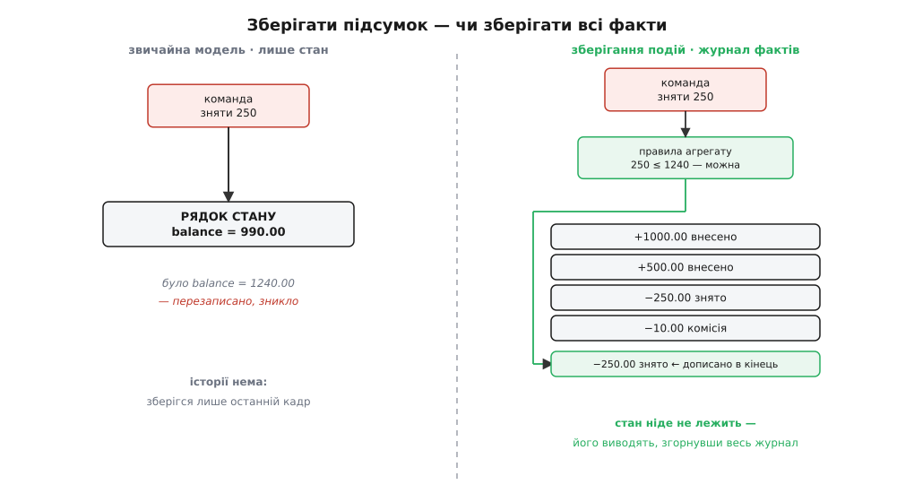
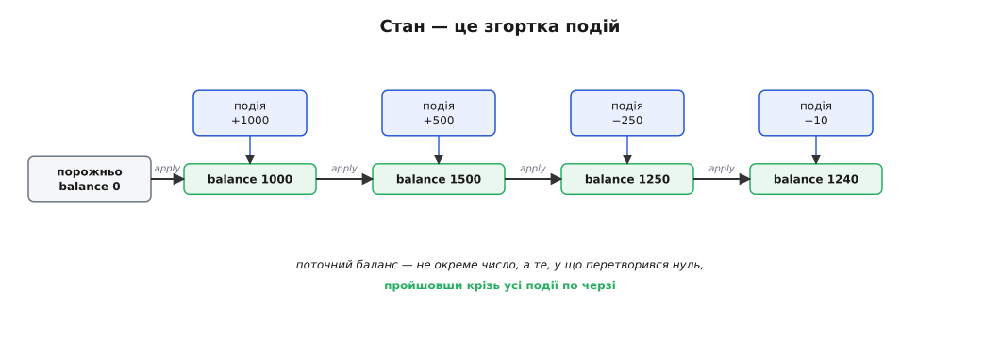
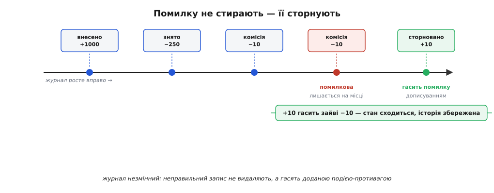

# Event sourcing

<preknowlist>
- [Незмінність як прийом дизайну](topic:sf-apps/immutability) — незмінний обʼєкт після створення вже не міняється; уся ідея зберігання подій стоїть на тому, що записаний факт — незмінний назавжди.
- [Агрегат і корінь](topic:sf-apps/aggregates-consistency) — межа узгодженості, всередині якої правила тримаються разом; потік подій зазвичай належить одному агрегату, і саме він вирішує, яку подію дозволити.
- [Подієва архітектура всередині застосунку](topic:sf-apps/event-driven-architecture) — компоненти спілкуються оголошенням фактів, що сталися, а не прямими викликами; подія тут — та сама «річ, що сталася», лише збережена назавжди.
- [CQRS](topic:sf-apps/cqrs) — розведення моделі запису й моделі читання; зберігання подій майже завжди ходить із CQRS у парі, бо читати з голого журналу подій незручно.
- [Кінцева узгодженість на практиці](topic:sf-distributed/eventual-consistency) — коли дві копії даних сходяться не миттєво, а трохи згодом; проєкції з журналу подій відстають від запису саме на цей проміжок.
</preknowlist>

Подивись на рядок у базі даних, що представляє твій банківський рахунок. Там написано: баланс `1240.00`. Одне число. Але звідки воно взялося? Хтось поклав, хтось зняв, нарахувалися відсотки, списалася комісія, повернувся платіж — і після всієї цієї історії лишилося рівно `1240.00`. Історія була, а в рядку її нема: кожна операція **перезаписувала** старе число новим, і попереднє значення зникало назавжди. База зберігає не те, що сталося, а лише **де ми опинилися** — останній відомий стан.

Здебільшого це нормально й саме те, чого хочеться: питаєш баланс — дістаєш баланс, одним читанням, без роздумів. Але придивись, скільки всього ми при цьому викинули. Ми не знаємо, **як** дійшли до `1240.00`. Не можемо сказати, яким баланс був минулого вівторка. Якщо в розрахунок закралася помилка — скажімо, комісію нарахували двічі, — ми не можемо просто «прокрутити плівку назад» і подивитися, де саме воно пішло не так, бо плівки нема: є лише останній кадр. Кожне перезаписування стирало доказ. Для рахунку, який мусить бути аудитований до копійки, це дивна втрата — ми зберігаємо підсумок і знищуємо саме те, з чого він складений.

Зберігання подій (англ. *event sourcing* — «черпання зі [збережених] подій») перевертає це рішення з ніг на голову. Замість того щоб зберігати поточний стан і перезаписувати його з кожною зміною, воно зберігає **послідовність фактів** — усе, що сталося, по порядку, назавжди — і **не зберігає поточний стан узагалі**. Баланс перестає бути тим, що ми записуємо; він стає тим, що ми **обчислюємо**, пройшовши по всіх подіях від початку. Рядок бази `balance = 1240.00` зникає. На його місце стає журнал:

```
поклали      +1000.00
поклали       +500.00
зняли         −250.00
комісія        −10.00
= баланс      1240.00   ← це вже НЕ зберігається, а виводиться з рядків вище
```

Це маленьке на вигляд рішення тягне за собою величезні наслідки — і хороші, і болючі, — тож розберімо, звідки воно взагалі береться й чому взагалі варте того, щоб перевертати звичну модель.

> 🔧 **Навіщо це.** Найпростіший сигнал, що тема ця про тебе: коли замовник питає не «який стан зараз», а «**як ми до нього дійшли**» — хто, коли й що змінив, чому баланс саме такий, покажи всю історію заявки. У системі, що зберігає лише поточний стан, ти на такі питання чесно відповісти не можеш: докази вже перезаписані. Доводиться прикручувати збоку журнал аудиту, що дублює половину змін і завжди відстає від правди. Зберігання подій прибирає цю проблему в зародку, бо журнал і **є** джерело правди, а не його бліда копія.

## Подія — це доконаний факт, а не команда

Спершу треба чітко відчути, що таке «подія» тут, бо від цього залежить усе. Подія — це **щось, що вже сталося**, записане в минулому доконаному часі: `КоштиВнесено`, `ПозиціюДодано`, `ЗамовленняСкасовано`, `АдресуЗмінено`. Не «внести кошти» (це наказ, намір), а «кошти **внесено**» (це доконаний факт). Різниця не косметична. Наказ можна відхилити — правила можуть сказати «ні, недостатньо коштів». Факт відхилити не можна: він уже стався, його лишається тільки зафіксувати.

Через це подія несе в собі непорушність. Раз `КоштиЗнято −250` записано, воно правда — і буде правдою вічно, хоч би що сталося далі. Ти не можеш «передумати» щодо минулого. Саме тому журнал подій **росте тільки вперед**: нові рядки додаються в кінець, старі не чіпаються ніколи. Це та сама [незмінність](topic:sf-apps/immutability), лише піднята з рівня одного обʼєкта до рівня цілого сховища: не «цей рядок не міняється після створення», а «**жоден** записаний факт не переписується й не видаляється, будь-коли».

Хто ж вирішує, чи дозволити подію? Тут у гру входить [агрегат](topic:sf-apps/aggregates-consistency) — межа, всередині якої тримаються правила. Приходить команда «зняти 300». Агрегат `Рахунок` бере свій поточний стан (баланс `1240`), перевіряє правило (`300 ≤ 1240` — можна) і **народжує подію** `КоштиЗнято −300`. Якби команда просила зняти `2000`, агрегат сказав би «ні» й **не народив би жодної події** — нічого не сталося, журналу не торкнулися. Тобто правила спрацьовують **на вході**, перед появою події; а сама подія, раз народжена, — уже беззаперечна.



*Дві моделі того самого рахунку. Ліворуч зберігається лише поточний баланс, і кожна зміна затирає попередній — історія втрачена. Праворуч зберігаються самі факти, дописуючись у кінець і ніколи не змінюючись; поточний баланс не лежить ніде — його щоразу виводять, пройшовши журнал від початку.*

## Стан — це згортка подій

Якщо стан ніде не зберігається, то як його взяти? Відповідь — одним прийомом, простим і глибоким водночас: стан — це **згортка** (англ. *fold*, звідси й термін «згортання») усіх подій. Починаєш з порожнього, нульового стану й **прикладаєш** до нього подію за подією по порядку; кожна подія трохи посуває стан; коли події скінчилися — маєш поточний стан.

Для рахунку «прикласти подію» — це просто арифметика: до балансу додати внесене, відняти зняте. Порожній стан — баланс `0`. Прогнав чотири події — дістав `1240`. Функцію, що з одного стану й однієї події робить наступний стан, зазвичай так і називають — `apply` (англ. «прикласти»). Уся модель тримається на ній.

Покажу кодом. Це звичайний прикладний рівень застосунку — не регістри й не залізо, — тож наведу двома мовами, якими такий код і пишуть на практиці; логіка в обох та сама.

:::tabs
```ts
// Подія — доконаний факт. Проста незмінна структура: що сталося і на скільки.
type AccountEvent =
  | { kind: "Deposited"; amount: number }
  | { kind: "Withdrawn"; amount: number };

type Account = { balance: number };

const EMPTY: Account = { balance: 0 };          // нульовий стан — з нього все починається

// apply: узяти стан і ОДНУ подію, повернути НАСТУПНИЙ стан. Без побічних ефектів.
function apply(state: Account, e: AccountEvent): Account {
  switch (e.kind) {
    case "Deposited": return { balance: state.balance + e.amount };
    case "Withdrawn": return { balance: state.balance - e.amount };
  }
}

// Поточний стан = згортка ВСІХ подій від порожнього. Ось і вся «база».
function replay(events: AccountEvent[]): Account {
  return events.reduce(apply, EMPTY);
}
```
```python
from dataclasses import dataclass
from functools import reduce

# Подія — доконаний факт. Проста незмінна структура: що сталося і на скільки.
@dataclass(frozen=True)
class Deposited:
    amount: float

@dataclass(frozen=True)
class Withdrawn:
    amount: float

@dataclass(frozen=True)
class Account:
    balance: float = 0.0                       # нульовий стан — з нього все починається

# apply: узяти стан і ОДНУ подію, повернути НАСТУПНИЙ стан. Без побічних ефектів.
def apply(state: Account, e) -> Account:
    if isinstance(e, Deposited):
        return Account(state.balance + e.amount)
    if isinstance(e, Withdrawn):
        return Account(state.balance - e.amount)
    raise ValueError(f"невідома подія: {e!r}")

# Поточний стан = згортка ВСІХ подій від порожнього. Ось і вся «база».
def replay(events) -> Account:
    return reduce(apply, events, Account())
```
:::

Зверни увагу, яка `apply` скромна: жодних правил, жодних перевірок, жодних відмов. Вона просто **вірить події**, бо подія — уже доконаний факт (правила спрацювали раніше, коли команда цю подію народжувала). Це важлива й тонка річ: **народження** події й **прикладання** події — два різні кроки. Народжуючи, ми перевіряємо все й можемо відмовити. Прикладаючи вже народжене — ніколи не відмовляємо, бо переграти минуле не можна. Через це `apply` детермінована й безпечна: ті самі події в тому самому порядку **завжди** дадуть той самий стан, скільки б разів ти їх не прогнав, на якій завгодно машині. Саме ця властивість і робить усю магію нижче можливою. Формально стан — це **лівий згорток** (англ. *left fold*) послідовності подій, і з цього означення випливають усі гарантії прийому: детермінованість переграння, коректність знімка як проміжного результату згортки, незалежність від того, коли й скільки разів ти обчислюєш. [Що таке лівий згорток, чому переграння детерміноване й чому знімок — це просто збережений проміжний стан](topic:sf-apps/event-sourcing/math-fold-determinism.md) — короткий розбір апарату, на якому все тримається.



*Згортання журналу: стан тече зліва направо крізь функцію apply, і кожна подія трохи його посуває. Поточний баланс — це не окреме збережене число, а те, у що перетворився нульовий стан, пройшовши крізь усі події по черзі.*

> 🔧 **Навіщо це.** Розділення «народити подію (з правилами)» і «прикласти подію (сліпо)» — не академічна дрібниця, а те, що вбереже тебе від найгіршого класу помилок. Якби `apply` теж перевіряла правила, сталося б лихо: правило згодом змінюється (скажімо, підняли ліміт овердрафту), ти переграєш старий журнал — і події, цілком законні у свій час, раптом «не проходять» за новими правилами, а стан не відновлюється. Тримаючи `apply` дурною й довірливою, ти гарантуєш, що минуле **завжди** переграється однаково, хоч би як мінялися сьогоднішні правила. Минуле застигле — і це саме те, чого ти хочеш.

## Помилку не стирають — її сторнують

Тепер найгостріше місце, де зберігання подій розходиться зі звичкою до непритомності. Уяви: у журнал випадково потрапила зайва подія — комісію `−10` нарахували двічі. У звичайній базі ти б просто виправив число: `UPDATE ... SET balance = balance + 10`. У зберіганні подій так **не можна**. Журнал не редагують. Дописану подію не видаляють і не переписують — ніколи, за жодних обставин.

Що ж тоді робити з помилкою? Те саме, що роблять бухгалтери століттями: не витираєш неправильний запис, а **дописуєш виправний**. Помилкову комісію лишаєш на місці, а поряд додаєш нову подію — `КомісіюСторновано +10` (англ. *compensating event* — «компенсаційна подія», подія-противага). Журнал тепер містить і помилку, і її виправлення:

```
...
комісія           −10.00
комісія           −10.00   ← помилкова, друга
комісію сторновано +10.00   ← НЕ видаляємо першу, а гасимо доданою подією
= баланс          1240.00
```

Спершу це здається марнотратством — навіщо тягнути помилку, коли можна її стерти? Але саме в цьому вся сила. Журнал лишається **правдивою розповіддю про те, що насправді відбувалося**, включно з тим, що хтось помилився й це виправили. Це рівно те, чого хоче аудитор, регулятор, слідчий: не відлакована фінальна цифра, а чесний слід кожної дії, разом із хибами й каяттям. Стерши помилку, ти сфальшував би історію; сторнувавши — зберіг її й водночас виправив стан. Одне число `1240` вийшло б і так, і так, але журнал у другому випадку не бреше.



*Виправлення без переписування історії. Помилкову подію лишають на місці — журнал незмінний. Замість неї дописують компенсаційну подію, що гасить її ефект. Стан сходиться до правильного, а розповідь зберігає і помилку, і те, як її виправили.*

Ця дисципліна — глибший родич давньої практики. **Подвійний запис** у бухгалтерії — журнал операцій, де кожна проведена сума лишається назавжди, а помилки правлять сторнувальними проведеннями, — працює так уже пʼять століть. Уперше детально описав його чернець-францисканець Лука Пачолі у трактаті «Summa de arithmetica» (Венеція, 1494), хоча італійські купці вели такі книги ще за двісті років до нього — найдавніший відомий повний подвійний реєстр належить флорентійській компанії Фаролфі й датований 1299–1300 роками. [Хто насправді вигадав подвійний запис, коли зʼявилася сама назва «event sourcing» і хто дав програмному прийому імʼя](topic:sf-apps/event-sourcing/hist-event-sourcing-lineage.md) — окрема повчальна історія про те, як стара практика бухгалтерів переродилася в архітектурний прийом. Тут досить сказати: незмінний журнал із виправленням через дописування — не вигадка програмістів, а перевірений часом спосіб вести облік, якому пів тисячоліття.

## Переграти журнал — і отримати надздатності

Ось де окупається вся незручність. Якщо поточний стан **виводиться** з журналу, а не зберігається, то стан перестає бути єдиним, священним і незамінним. Його можна викинути й відбудувати заново будь-коли. А раз так — відкривається кілька речей, неможливих у звичайній моделі.

**Стан на будь-який момент минулого.** Хочеш знати, яким був баланс минулого вівторка? Прогони згортку не по всьому журналу, а лише по подіях **до** того вівторка — і матимеш точний стан на ту мить. Це називають темпоральним запитом (англ. *temporal* — «часовий»): не «як зараз», а «як було тоді». У звичайній базі така відповідь неможлива в принципі — минулі стани перезаписані. У зберіганні подій вона безкоштовна, бо журнал і є повна історія, а взяти зріз історії до дати — тривіально.

**Нова похідна модель — заднім числом.** Найпотужніше. Уяви, через рік бізнес просить звіт, про який на старті ніхто не думав: «середній розмір поповнення по місяцях». У звичайній системі ти безсилий — дані, з яких його рахувати, ніхто не збирав. У зберіганні подій усі поповнення лежать у журналі від першого дня. Ти пишеш нову згортку, що рахує саме цей звіт, проганяєш її по всьому журналу **з минулого** — і дістаєш відповідь так, ніби збирав ці дані завжди. Журнал подій — це сирі факти; будь-яку похідну модель із них можна вивести коли завгодно, зокрема таку, якої ще не існувало, коли події записувалися. Готовий стан під показ, збудований такою згорткою, називають **проєкцією** (англ. *projection* — «проєкція», відображення журналу в зручну форму); коли проєкцій кілька й вони живуть окремо від журналу — це вже [CQRS](topic:sf-apps/cqrs), і саме тому зберігання подій майже завжди з ним у парі.

**Виправлення заднім числом.** Знайшли хибу в розрахунку відсотків, що діяла три місяці? Поправ функцію `apply`, викинь усі похідні стани й переграй журнал наново — цього разу правильно. Сирі факти (скільки й коли внесли) не постраждали; хибним був лише спосіб їх згортати, а його ти щойно виправив. У звичайній базі така помилка — катастрофа з ручним латанням тисяч рядків; тут — переобчислення з чистих даних.

Усі три надздатності стоять на одному й тому самому русі — «прочитати журнал і згорнути». [Робочий рушій відбудови стану: сховище подій, згортання зі знімками, переграння нової проєкції по всьому журналу заднім числом](topic:sf-apps/event-sourcing/proj-account-replay.md) проводить одну реалізацію рахунку від дописування подій через знімок-прискорення до побудови похідної моделі, якої не було на старті, — на робочому коді з розбором вартості кожного кроку й того, як знімок відсікає переграння всього журналу.

> 🔧 **Навіщо це.** Оце — справжня причина, чому люди йдуть на всі труднощі зберігання подій, і варто назвати її прямо. Не «модно» й не «мікросервіси». А те, що журнал подій — **актив, що з часом лише дорожчає**: записавши сирі факти, ти залишив собі відкритими двері до питань, яких ще не поставили. Звичайна база відповідає лише на питання, які ти передбачив, коли креслив схему. Журнал подій відповість і на завтрашнє питання, бо факти для відповіді вже зібрані. У сферах, де це вирішально — фінанси, медицина, склад, усе з аудитом і «а покажіть історію», — ця властивість окуповує всю ціну.

## За що платиш: журнал росте, а стара подія застигає

Дарма нічого не буває, і зберігання подій виставляє кілька рахунків, які треба назвати чесно, бо кожен із них справжній.

**Переграти все — довго.** Якщо в рахунку мільйон подій, згортати весь журнал щоразу, коли треба баланс, — безглуздо повільно. Рятунок — **знімок** (англ. *snapshot* — «миттєвий зліпок»): раз на N подій зберігаєш обчислений на той момент стан збоку, як кеш. Тоді, щоб дістати поточний стан, береш останній знімок і прикладаєш лише події **після** нього, а не з початку часів. Знімок — не джерело правди (правда завжди в журналі), а суто прискорення; його можна будь-коли викинути й перебудувати. Але це додатковий рухомий шматок, за яким треба глядіти.

**Стара подія застигла — а світ міняється.** Це найпідступніша ціна. Подію `КоштиВнесено {amount}` ти записав рік тому. Сьогодні зрозумів, що треба ще й валюту, — і додаєш поле `currency`. Але в журналі лежать **мільйони старих подій без цього поля**, і переписати їх не можна (журнал незмінний!). Отже, твій сьогоднішній код мусить уміти читати й **вчорашню** форму події, і сьогоднішню, довіку. Це зветься еволюцією схеми подій, і в зрілій системі зі зберіганням подій вона забирає чи не найбільше уваги: кожна подія живе вічно, тож кожна колишня її форма мусить лишатися придатною до читання вічно. Легко почати, боляче нести роками.

**Читати з голого журналу незручно.** Журнал чудовий, щоб **писати** факти й відбудовувати стан, але жахливий, щоб **показувати** дані на екрані: щоб намалювати список рахунків, довелося б згортати журнал кожного з них. Тому поряд майже завжди тримають готові до показу проєкції — і оновлюють їх **не миттєво**, а трохи згодом, коли нова подія долетить до проєкції. У цей проміжок проєкція показує вчорашню правду: це [кінцева узгодженість](topic:sf-distributed/eventual-consistency), той самий лаг, що й у CQRS, і його доводиться свідомо проєктувати там, де користувач чекає негайного результату після своєї дії.

## Коли окупається, а коли шкодить

Звести все до одного тверезого орієнтира. Зберігання подій — не «правильніша база» й не сходинка зрілості, яку конче треба здолати. Це прийом проти **однієї конкретної потреби**: коли історія того, що сталося, важить не менше (а часто більше) за поточний стан.

**Окупається**, коли справджується бодай одне: тобі потрібен незаперечний аудит кожної зміни (фінанси, медицина, право, склад); тобі важливі стани на минулі моменти чи темпоральні питання; ти передбачаєш, що з тих самих фактів доведеться виводити нові, ще не задумані похідні моделі; або сама предметна область **природно є** послідовністю подій (рух коштів, історія замовлення, стрічка дій пристрою). У таких місцях журнал подій — не тягар, а найцінніший актив системи, і всі його рахунки виправдані.

**Шкодить**, коли нічого з цього нема: проста читанко-записна робота, де важить лише поточний стан, історія нікому не потрібна, а екрани хочуть звичайних таблиць. Довідник товарів, налаштування профілю, реєстр із двома полями — тягнути сюди зберігання подій означає заплатити згорткою замість простого читання, вічною еволюцією схеми подій і кінцевою узгодженістю **ні за що**: усі рахунки виставлені, жодна надздатність не потрібна. Це один із тих прийомів, що найдужче спокушають своєю елегантністю й найболючіше мстяться, коли їх узяли без потреби.

Останнє й головне. Питання-запобіжник перед тим, як обрати зберігання подій, одне: «**чи потрібна мені сама історія — чи лише те, де я зараз?**». Потрібна історія, аудит, минулі зрізи, майбутні невідомі питання з тих самих фактів — бери, і всі труднощі окупляться. Потрібен лише поточний стан — зберігай поточний стан, не збирай журнал, якого ніхто не читатиме. Різниця між зберіганням подій як активом і як тягарем — не в самому прийомі, а в тверезості того, хто зважує, чи справді йому дорога історія.
