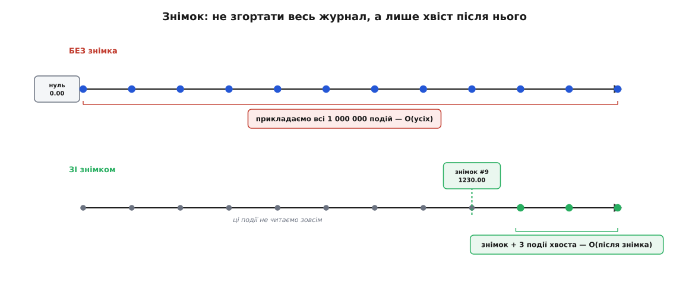
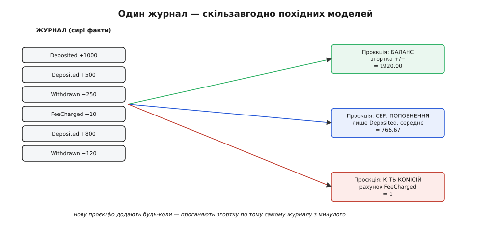

# ⚙️ Рушій відбудови рахунку: журнал, знімок, проєкція з минулого

Про згортання подій легко говорити на пальцях — «прикладай подію за подією, і матимеш стан». Але між цією фразою й системою, що не падає на мільйоні подій і не тихне під конкурентним записом, лежить купа інженерії, яку саме фраза й ховає. Тут ми пройдемо крізь неї на одному наскрізному прикладі — рахунку — і зберемо три речі, кожну з робочим кодом і чесним рахунком за неї: **сховище подій**, що безпечно росте під конкурентними записами; **згортання зі знімком**, що не читає мільйон подій там, де досить трьох; і **побудову нової проєкції заднім числом** — похідної моделі, якої не було, коли перша подія лягала в журнал.

Мова тут — звичайний прикладний бекенд, не залізо й не регістри, тож увесь код наведено двома мовами, якими такий рушій і пишуть на практиці — TypeScript і Python, — вкладками. Логіка в обох та сама, до рядка; різниця лише в ідіомах кожної мови. Читай ту вкладку, що тобі ближча, — друга нічого нового не додасть, крім синтаксису.

Одразу застережу межу. Ми пишемо рушій **у памʼяті**, зі сховищем на простому масиві, щоб уся механіка була видна без шуму драйвера бази. Кожне місце, де справжня система пішла б у Postgres чи EventStoreDB, я називаю прямо — але код лишаю таким, щоб його можна було запустити й потриматися руками. Промислове сховище відрізняється не ідеєю, а тим, що ту саму перевірку версії робить транзакція бази, а не наш `if`.

## Задача: що саме має вміти рушій

Сформулюймо чітко, бо від чіткості залежить, які пастки ми взагалі побачимо. Рушій рахунку мусить:

1. **Приймати команди** (`внести`, `зняти`), перевіряти правила й **дописувати** народжені події в кінець потоку цього рахунку — і ніколи не переписувати вже записане.
2. **Витримувати конкурентний запис.** Два процеси одночасно знімають з того самого рахунку — рушій мусить не дати їм затерти один одного, інакше баланс поїде.
3. **Швидко віддавати поточний стан** навіть тоді, коли подій мільйон, — не згортаючи щоразу весь журнал з початку часів.
4. **Будувати нові похідні моделі із журналу заднім числом** — звіти й вибірки, про які на старті ніхто не думав, з тих самих сирих фактів.

Перші два пункти — про **запис** (сховище й конкуренція). Третій — про **швидке читання стану** (знімок). Четвертий — про **читання нових моделей** (проєкція). Зберемо їх по черзі, у кожному розкриваючи пастку, яка чекає на наївну реалізацію.

## Крок 1. Append-only сховище: потік, версія, оптимістична перевірка

### Задача цього кроку

Сховище подій — це не «таблиця з рядками», а **множина потоків** (англ. *stream*), по одному на агрегат. Потік рахунку `acc-42` — це впорядкована послідовність його подій, і тільки його. Дві речі мусять триматися залізно: події в потоці **впорядковані** (у кожної своя позиція — версія), і запис **тільки в кінець** (нову подію можна лише дописати після останньої, ніколи не вставити всередину й не переписати).

Навіщо взагалі **версія** — окреме число в кожної події? Здавалося б, порядок дає вже сам масив. Але версія працює не на читанні, а на записі: вона — те, об що спотикається конкурентний запис. Ось де народжується головна пастка кроку.

### Ідея: оптимістична перевірка версії

Уяви двох касирів, що одночасно знімають з рахунку `acc-42`. Обидва прочитали журнал, обидва побачили баланс `100`, обидва вирішили зняти `80` — кожен окремо законно (`80 ≤ 100`). Якщо рушій просто допише обидві події, у журналі опиняться два зняття по `80` з рахунку, де було `100`, і баланс стане `−60` — овердрафт, якого жодне правило не дозволяло. Правило перевірялося двічі проти **того самого** старого стану, бо друге зняття не знало про перше.

Полагодити це можна двома способами. **Песимістичний** — узяти замок на потік перед читанням, щоб другий касир чекав. Дорого й крихко: замок треба тримати, звільняти, стерегтися його зависання. **Оптимістичний** — не блокувати нікого, а домовитися так: коли дописуєш подію, ти зобовʼязаний **сказати, на якій версії потоку ти будував своє рішення** (англ. *expected version* — «очікувана версія»). Сховище допише лише тоді, коли потік **досі** тієї самої довжини; якщо хтось устиг дописати раніше, реальна версія вже більша за очікувану — і твій запис відхиляється. Ти перечитуєш свіжий журнал і пробуєш ще раз.

Це та сама ідея, що в промислових сховищ подій: у EventStoreDB append приймає `expectedRevision` і падає з `WrongExpectedVersion`, якщо потік зрушив; у реалізаціях на Postgres append — це одна транзакція «звірити, що збережена версія дорівнює очікуваній, і збільшити її». Ми зберемо рівно цю логіку руками.

> 🔧 **Навіщо це.** Оптимістична перевірка — не «захист про всяк випадок», а єдине, що стоїть між тобою й **мовчазним подвоєнням списань**. Найгидкіше в цій помилці — що вона не падає й нічого не логує: обидва записи «успішні», кожен сам по собі законний, а разом дають стан, заборонений правилами. Такі баги знаходять не в тестах, а в скарзі клієнта через місяць. Версія перетворює невидиму гонку на гучну, видиму відмову запису, яку рушій обробляє тут-таки — перечитав і повторив.

### Код: сховище і команда

Почнемо з форми події та збереженого запису. Кожна збережена подія несе **тіло** (що сталося) і свою **версію** в потоці — позицію, з 1.

:::tabs
```ts
// Тіло події — доконаний факт. Мінімум полів: що і на скільки.
type AccountEvent =
  | { kind: "Deposited"; amount: number }
  | { kind: "Withdrawn"; amount: number }
  | { kind: "FeeCharged"; amount: number };

// Збережена подія = тіло + метадані потоку. version — позиція в потоці (з 1).
interface Stored {
  streamId: string;
  version: number;        // 1, 2, 3, … — монотонно росте в межах потоку
  event: AccountEvent;
  at: string;             // мітка часу, знадобиться темпоральним запитам
}

// Сигнал конфлікту версій — окремий тип, щоб виклик міг його спіймати й повторити.
class VersionConflict extends Error {
  constructor(public expected: number, public actual: number) {
    super(`очікували версію ${expected}, а потік уже на ${actual}`);
  }
}

class EventStore {
  // У реальності — таблиця (stream_id, version, payload) з PK (stream_id, version).
  // Тут — просто масив на потік.
  private streams = new Map<string, Stored[]>();

  // Прочитати весь потік (для згортання й для перевірки версії).
  read(streamId: string): Stored[] {
    return this.streams.get(streamId) ?? [];
  }

  // Поточна версія потоку = скільки в ньому подій.
  currentVersion(streamId: string): number {
    return this.read(streamId).length;
  }

  // ОСЕРДЯ append-only. Дописати нові події ТІЛЬКИ якщо потік досі на expectedVersion.
  append(streamId: string, expectedVersion: number, events: AccountEvent[]): Stored[] {
    const stream = this.streams.get(streamId) ?? [];
    const actual = stream.length;
    if (actual !== expectedVersion) {
      // Хтось дописав між нашим читанням і цим записом — відхиляємо, хай повторить.
      throw new VersionConflict(expectedVersion, actual);
    }
    const now = new Date().toISOString();
    const appended = events.map((event, i) => ({
      streamId, version: actual + i + 1, event, at: now,
    }));
    this.streams.set(streamId, [...stream, ...appended]);
    return appended;                 // ніколи не міняємо старе — лише додаємо
  }
}
```
```python
from dataclasses import dataclass
from datetime import datetime, timezone

# Тіло події — доконаний факт. Мінімум полів: що і на скільки.
@dataclass(frozen=True)
class Deposited:
    amount: float

@dataclass(frozen=True)
class Withdrawn:
    amount: float

@dataclass(frozen=True)
class FeeCharged:
    amount: float

# Збережена подія = тіло + метадані потоку. version — позиція в потоці (з 1).
@dataclass(frozen=True)
class Stored:
    stream_id: str
    version: int            # 1, 2, 3, … — монотонно росте в межах потоку
    event: object
    at: str                 # мітка часу, знадобиться темпоральним запитам

# Сигнал конфлікту версій — окремий виняток, щоб виклик міг його спіймати й повторити.
class VersionConflict(Exception):
    def __init__(self, expected: int, actual: int):
        super().__init__(f"очікували версію {expected}, а потік уже на {actual}")
        self.expected, self.actual = expected, actual

class EventStore:
    # У реальності — таблиця (stream_id, version, payload) з PK (stream_id, version).
    # Тут — просто список на потік.
    def __init__(self):
        self._streams: dict[str, list[Stored]] = {}

    # Прочитати весь потік (для згортання й для перевірки версії).
    def read(self, stream_id: str) -> list[Stored]:
        return self._streams.get(stream_id, [])

    # Поточна версія потоку = скільки в ньому подій.
    def current_version(self, stream_id: str) -> int:
        return len(self.read(stream_id))

    # ОСЕРДЯ append-only. Дописати нові події ТІЛЬКИ якщо потік досі на expected_version.
    def append(self, stream_id: str, expected_version: int, events: list) -> list[Stored]:
        stream = self._streams.get(stream_id, [])
        actual = len(stream)
        if actual != expected_version:
            # Хтось дописав між нашим читанням і цим записом — відхиляємо, хай повторить.
            raise VersionConflict(expected_version, actual)
        now = datetime.now(timezone.utc).isoformat()
        appended = [Stored(stream_id, actual + i + 1, ev, now)
                    for i, ev in enumerate(events)]
        self._streams[stream_id] = stream + appended
        return appended                # ніколи не міняємо старе — лише додаємо
```
:::

Тепер сама команда — місце, де **народжується** подія. Зверни увагу на розділення: команда читає потік, згортає його у стан, перевіряє правило проти цього стану й тільки тоді народжує подію та віддає сховищу разом з очікуваною версією. Правило спрацьовує **тут**; функція `apply` нижче не перевіряє нічого.

:::tabs
```ts
interface Account { balance: number }
const EMPTY: Account = { balance: 0 };

// apply — СЛІПА: приймає народжену подію на віру, правил не знає.
function apply(state: Account, e: AccountEvent): Account {
  switch (e.kind) {
    case "Deposited":  return { balance: state.balance + e.amount };
    case "Withdrawn":  return { balance: state.balance - e.amount };
    case "FeeCharged": return { balance: state.balance - e.amount };
  }
}

// Згорнути список збережених подій у стан.
function foldState(events: Stored[]): Account {
  return events.reduce((s, st) => apply(s, st.event), EMPTY);
}

// Команда «зняти»: правила ТУТ. Повертаємо, чи вдалося (для повтору при конфлікті).
function withdraw(store: EventStore, streamId: string, amount: number): boolean {
  const history = store.read(streamId);
  const state = foldState(history);            // стан, на якому будуємо рішення
  const expectedVersion = history.length;      // версія, яку ми бачили

  if (amount <= 0) throw new Error("сума має бути додатна");
  if (amount > state.balance) return false;    // ПРАВИЛО: не даємо піти в мінус

  const event: AccountEvent = { kind: "Withdrawn", amount };
  try {
    store.append(streamId, expectedVersion, [event]);
    return true;
  } catch (e) {
    if (e instanceof VersionConflict) return false;  // хтось випередив — хай виклик повторить
    throw e;
  }
}
```
```python
@dataclass(frozen=True)
class Account:
    balance: float = 0.0

EMPTY = Account()

# apply — СЛІПА: приймає народжену подію на віру, правил не знає.
def apply(state: Account, e) -> Account:
    if isinstance(e, Deposited):  return Account(state.balance + e.amount)
    if isinstance(e, Withdrawn):  return Account(state.balance - e.amount)
    if isinstance(e, FeeCharged): return Account(state.balance - e.amount)
    raise ValueError(f"невідома подія: {e!r}")

# Згорнути список збережених подій у стан.
def fold_state(events: list[Stored]) -> Account:
    state = EMPTY
    for st in events:
        state = apply(state, st.event)
    return state

# Команда «зняти»: правила ТУТ. Повертаємо, чи вдалося (для повтору при конфлікті).
def withdraw(store: EventStore, stream_id: str, amount: float) -> bool:
    history = store.read(stream_id)
    state = fold_state(history)                  # стан, на якому будуємо рішення
    expected_version = len(history)              # версія, яку ми бачили

    if amount <= 0:
        raise ValueError("сума має бути додатна")
    if amount > state.balance:
        return False                             # ПРАВИЛО: не даємо піти в мінус

    try:
        store.append(stream_id, expected_version, [Withdrawn(amount)])
        return True
    except VersionConflict:
        return False                             # хтось випередив — хай виклик повторить
```
:::

Тепер поглянь, як саме перевірка версії гасить гонку двох касирів. Обидва прочитали потік на версії `2` (`expectedVersion = 2`), обидва вирішили зняти. Перший викликає `append(…, 2, …)` — потік справді на `2`, запис проходить, потік стає на `3`. Другий викликає `append(…, 2, …)` — але потік **уже на `3`**, `actual (3) !== expected (2)`, летить `VersionConflict`, `withdraw` повертає `false`. Виклик, отримавши `false`, перечитує **свіжий** журнал (де вже є перше зняття), згортає новий баланс, знову перевіряє правило проти нього — і цього разу правило може чесно сказати «ні, тепер уже недостатньо». Гонка перетворилася на впорядковану чергу без жодного замка.

Петля повтору — на боці виклику, і виглядає так:

:::tabs
```ts
// Повторюємо команду, доки її не приймуть або доки правило не відмовить остаточно.
function withdrawWithRetry(store: EventStore, streamId: string, amount: number,
                           tries = 5): boolean {
  for (let i = 0; i < tries; i++) {
    const history = store.read(streamId);
    if (amount > foldState(history).balance) return false;   // правило проти СВІЖОГО стану
    if (withdraw(store, streamId, amount)) return true;      // прийнято
    // інакше — конфлікт версій, крутимо ще раз зі свіжим журналом
  }
  throw new Error("забагато конкурентних записів — здаюся");
}
```
```python
# Повторюємо команду, доки її не приймуть або доки правило не відмовить остаточно.
def withdraw_with_retry(store: EventStore, stream_id: str, amount: float,
                        tries: int = 5) -> bool:
    for _ in range(tries):
        history = store.read(stream_id)
        if amount > fold_state(history).balance:
            return False                          # правило проти СВІЖОГО стану
        if withdraw(store, stream_id, amount):
            return True                           # прийнято
        # інакше — конфлікт версій, крутимо ще раз зі свіжим журналом
    raise RuntimeError("забагато конкурентних записів — здаюся")
```
:::

### Вартість і пастки кроку 1

**Вартість.** Кожна команда зараз читає **весь** потік, щоб згорнути стан і взяти версію: O(подій у потоці) на одну команду. Для короткого рахунку — дрібниця; для потоку в мільйон подій — це стає болем, і саме його лікує крок 2. Запис — O(1) плюс вартість дописування (у справжній базі — один `INSERT`).

**Пастка: перевіряти правило проти застарілого стану.** Якщо в петлі повтору забути перечитати журнал і згорнути **свіжий** баланс — а просто гнати той самий намір, — можна дописати зняття, законне на старому балансі, але вже незаконне на новому. Версія врятує від затирання, але **не** від логічно застарілого рішення: вона стереже позицію, а не сенс. Тому свіже читання-згортання перед кожною спробою — не зайве, а обовʼязкове.

**Пастка: очікувана версія «з голови».** Якщо передати в `append` версію, узяту не з того ж читання, що дало стан (скажімо, кешовану), перевірка стає фікцією — вона пропустить конфлікт або відхилить чесний запис. Очікувана версія й згорнутий стан мусять походити з **одного** читання потоку. У коді вище це видно: `history` читається раз, з нього беруться і `state`, і `expectedVersion`.

## Крок 2. Згортання зі знімком: читати хвіст, а не весь журнал

### Задача цього кроку

Крок 1 читає весь потік на кожну команду. Поки подій сотні — байдуже. Коли їх мільйон, згортати мільйон подій, щоб дізнатися баланс перед черговим зняттям, — безглуздо: ти щоразу переобчислюєш те, що вже обчислював учора, позавчора й мільйон разів до того. Стан **накопичувальний** — кожне наступне обчислення повторює майже всю роботу попереднього. Це кричить про кешування.

### Ідея: знімок як збережений проміжний згорток

Ключ у тому, що стан — це **лівий згорток** послідовності подій, а лівий згорток має чудову властивість: будь-який **проміжний** результат — теж повноцінний стан. Стан після перших 900 000 подій — такий самий валідний стан, як фінальний; він просто «стан рахунку станом на подію 900 000». Раз так, його можна **зберегти окремо** разом із номером події, до якої він порахований, — і назвати **знімком** (англ. *snapshot*).

Тоді відбудова стану стає такою: візьми **останній** знімок, а потім прочитай і приклади лише події **після** його версії — короткий хвіст. Ти пропускаєш згортання всього, що до знімка, бо його результат уже лежить у знімку. Мільйон подій перетворюється на «знімок плюс кілька останніх».

Критично розуміти, чим знімок **не** є. Він **не** джерело правди. Правда завжди в журналі; знімок — суто кеш, похідний і одноразовий. Його можна будь-коли викинути й перебудувати з журналу, і система від цього не постраждає — лише сповільниться на одне повне згортання. Саме тому знімок нічого не «фіксує» назавжди: виправив `apply` (крок 3 покаже, коли це буває) — старі знімки просто викидаєш, бо вони пораховані старою функцією й тепер брешуть.



*Той самий журнал, дві ціни відбудови стану. Без знімка стан щоразу згортають з нуля крізь усі події — O(усіх). Зі знімком беруть останній збережений проміжний стан і докладають лише хвіст подій після нього — O(після знімка). Голову журналу — усе до знімка — не читають зовсім, бо її результат уже в знімку.*

### Код: сховище знімків і відбудова через хвіст

Знімок несе три речі: до якого потоку він, на якій версії порахований і сам стан на ту версію.

:::tabs
```ts
interface Snapshot {
  streamId: string;
  version: number;        // до якої версії потоку враховано події
  state: Account;         // згорнутий стан рівно на цю версію
}

// Кеш знімків: останній знімок на потік. У реальності — окрема таблиця/сховище.
class SnapshotStore {
  private snaps = new Map<string, Snapshot>();
  latest(streamId: string): Snapshot | undefined { return this.snaps.get(streamId); }
  save(s: Snapshot): void { this.snaps.set(s.streamId, s); }
}

// Відбудова стану ЗІ знімком: беремо базу зі знімка й докладаємо лише хвіст.
function loadState(store: EventStore, snaps: SnapshotStore, streamId: string): Account {
  const snap = snaps.latest(streamId);
  const baseState = snap ? snap.state : EMPTY;
  const fromVersion = snap ? snap.version : 0;

  const stream = store.read(streamId);
  const tail = stream.slice(fromVersion);       // події ПІСЛЯ знімка — короткий хвіст
  return tail.reduce((s, st) => apply(s, st.event), baseState);
}

// Політика знімкування: раз на SNAP_EVERY подій кладемо свіжий знімок.
const SNAP_EVERY = 100;

function maybeSnapshot(store: EventStore, snaps: SnapshotStore, streamId: string): void {
  const version = store.currentVersion(streamId);
  const last = snaps.latest(streamId);
  const since = version - (last ? last.version : 0);
  if (since >= SNAP_EVERY) {
    // Порахувати актуальний стан (через знімок — дешево) і зберегти як новий знімок.
    const state = loadState(store, snaps, streamId);
    snaps.save({ streamId, version, state });
  }
}
```
```python
@dataclass(frozen=True)
class Snapshot:
    stream_id: str
    version: int            # до якої версії потоку враховано події
    state: Account          # згорнутий стан рівно на цю версію

# Кеш знімків: останній знімок на потік. У реальності — окрема таблиця/сховище.
class SnapshotStore:
    def __init__(self):
        self._snaps: dict[str, Snapshot] = {}
    def latest(self, stream_id: str) -> Snapshot | None:
        return self._snaps.get(stream_id)
    def save(self, s: Snapshot) -> None:
        self._snaps[s.stream_id] = s

# Відбудова стану ЗІ знімком: беремо базу зі знімка й докладаємо лише хвіст.
def load_state(store: EventStore, snaps: SnapshotStore, stream_id: str) -> Account:
    snap = snaps.latest(stream_id)
    base_state = snap.state if snap else EMPTY
    from_version = snap.version if snap else 0

    stream = store.read(stream_id)
    tail = stream[from_version:]                 # події ПІСЛЯ знімка — короткий хвіст
    state = base_state
    for st in tail:
        state = apply(state, st.event)
    return state

# Політика знімкування: раз на SNAP_EVERY подій кладемо свіжий знімок.
SNAP_EVERY = 100

def maybe_snapshot(store: EventStore, snaps: SnapshotStore, stream_id: str) -> None:
    version = store.current_version(stream_id)
    last = snaps.latest(stream_id)
    since = version - (last.version if last else 0)
    if since >= SNAP_EVERY:
        # Порахувати актуальний стан (через знімок — дешево) і зберегти як новий знімок.
        state = load_state(store, snaps, stream_id)
        snaps.save(Snapshot(stream_id, version, state))
```
:::

Одна тонкість, яку легко проґавити: `slice(fromVersion)` / `stream[from_version:]` спирається на те, що версія — це саме **позиція** події в потоці, з 1. Знімок на версії 900 000 означає «враховано перші 900 000 подій», а вони лежать на індексах 0…899 999; отже, хвіст — з індексу 900 000, тобто рівно `stream[900000:]`. Якби версії мали діри (наприклад, глобальний лічильник на всі потоки, а не позиція в потоці), цей зріз був би хибним, і хвіст довелося б відбирати порівнянням `st.version > snap.version`. Тримати версію позицією в потоці — те, що робить зріз таким простим.

### Вартість і пастки кроку 2

**Вартість — головний виграш.** Відбудова стану падає з O(усіх подій) до O(подій після знімка). При `SNAP_EVERY = 100` хвіст — не більш як 100 подій, скільки б їх не було в потоці всього. Формально, якщо подій **N**, а знімок кладемо раз на **k**, то на відбудову йде щонайбільше **k** прикладань замість **N**:

```
без знімка:   вартість відбудови = O(N)          ← росте з історією без стелі
зі знімком:   вартість відбудови = O(k)          ← стеля k, від N не залежить
за N = 1 000 000, k = 100:
   було   ~ 1 000 000 прикладань apply
   стало  ~        100 прикладань apply   (плюс одне читання знімка)
   виграш ~ у 10 000 разів
```

Ціна знімка окремо — рідкісне повне (чи то пак «через попередній знімок») згортання раз на `k` подій плюс місце під збережений стан. Це вигідний обмін: дорога операція раз на сотню подій замість дорогої на кожній.

**Пастка: роздування знімків.** Наївно знімок кладуть на **кожну** команду або тримають **усі** знімки потоку назавжди. І те, й те роздуває сховище знімків так, що воно починає коштувати більше за сам журнал. Знімок раз на команду — це фактично другий журнал, лише зі станами замість подій; тримати всю історію знімків — зберігати сотні проміжних станів, з яких потрібен лише останній. Лікування: клади знімок раз на `k` подій (не на кожну) і тримай **лише останній** на потік (старі перезаписуй або чисти фоном). Знімок — кеш; кеш не архівують.

**Пастка: несумісний знімок після зміни `apply`.** Знімок пораховано **тодішньою** функцією `apply`. Змінив логіку згортання — і старий знімок тепер брехливий: у ньому стан, порахований за старими правилами. Якщо його наївно взяти за базу й докласти хвіст новою `apply`, дістанеш химеру — напівстарий, напівновий стан. Лікування просте й безжальне: під час зміни `apply` (або форми стану) **викинь усі знімки** й дай їм перебудуватися з журналу наново. Це безпечно рівно тому, що знімок — не правда, а кеш: правда в журналі ціла, перебудова її не чіпає.

**Пастка: знімок як «джерело правди».** Найгірше — почати довіряти знімку більше, ніж журналу: чистити старі події, бо «стан же в знімку». Тоді знімок перестає бути кешем і стає єдиною копією стану — а це вже звичайна база, тільки заплутана, і всі надздатності зберігання подій зникають разом з викинутими подіями. Знімок ніколи не дає права рідшати журнал.

## Крок 3. Нова проєкція заднім числом: похідна модель з минулого

### Задача цього кроку

Минув рік. Рахунок жив, події копилися. Приходить бізнес із запитом, якого на старті не існувало: «покажіть **середній розмір поповнення** й **скільки разів списувалася комісія** — за весь час». У звичайній системі, що зберігає лише баланс, ти безсилий: дані, з яких це рахувати, ніхто не збирав, бо про такий звіт ніхто не думав, коли креслив таблицю. У зберіганні подій усі поповнення й усі комісії **лежать у журналі від першого дня** — просто ніхто досі не дивився на них під цим кутом.

### Ідея: інша згортка того самого журналу

Тут спрацьовує головна властивість журналу: він — **сирі факти**, а не одна застигла модель. Баланс — лише **одна** згортка цих фактів. Нічого не заважає написати **іншу** згортку, з іншим станом-акумулятором і іншою `apply`, і прогнати її по тому самому журналу **з минулого** — дістанеш іншу похідну модель. Готовий до показу результат такої згортки й називають **проєкцією** (англ. *projection* — відображення журналу в зручну форму): журнал проєктують у ту модель, яка потрібна саме зараз.

Ключове слово — **заднім числом**. Проєкцію не треба було закладати наперед. Ти пишеш її сьогодні, а годуєш подіями, записаними торік, — і вона рахує так, ніби збирала їх завжди. Це та сама відбудова стану, лише замість «балансу» акумулятор — «сума й кількість поповнень», а замість `apply` рахунку — `apply` статистики. Механіка згортання одна; змінюється лише, **у що** згортаємо.



*Один журнал сирих фактів — скільки завгодно похідних моделей. Баланс — лише одна згортка цих подій; поряд із неї той самий журнал згортається в середнє поповнення, у кількість комісій, у будь-що ще. Нову проєкцію додають будь-коли — проганяють нову згортку по журналу з минулого й дістають модель, якої на старті не існувало.*

### Код: проєкція статистики поповнень

Проєкція — це власний акумулятор плюс власна функція прикладання. Ось модель «статистика поповнень і комісій», порахована з нуля по всьому журналу.

:::tabs
```ts
// Похідна модель, якої НЕ було на старті. Свій акумулятор, своя згортка.
interface DepositStats {
  depositCount: number;
  depositTotal: number;
  feeCount: number;
}
const STATS_ZERO: DepositStats = { depositCount: 0, depositTotal: 0, feeCount: 0 };

// applyStats — інша згортка того самого потоку подій.
function applyStats(s: DepositStats, e: AccountEvent): DepositStats {
  switch (e.kind) {
    case "Deposited":
      return { ...s, depositCount: s.depositCount + 1,
                     depositTotal: s.depositTotal + e.amount };
    case "FeeCharged":
      return { ...s, feeCount: s.feeCount + 1 };
    case "Withdrawn":
      return s;                       // цю проєкцію зняття не цікавлять — пропускаємо
  }
}

// Побудувати проєкцію ЗАДНІМ ЧИСЛОМ: прогнати applyStats по всьому журналу з минулого.
function buildDepositStats(store: EventStore, streamId: string): DepositStats {
  return store.read(streamId).reduce((s, st) => applyStats(s, st.event), STATS_ZERO);
}

// Похідна метрика: середнє поповнення = сума / кількість.
function averageDeposit(stats: DepositStats): number {
  return stats.depositCount === 0 ? 0 : stats.depositTotal / stats.depositCount;
}
```
```python
# Похідна модель, якої НЕ було на старті. Свій акумулятор, своя згортка.
@dataclass(frozen=True)
class DepositStats:
    deposit_count: int = 0
    deposit_total: float = 0.0
    fee_count: int = 0

# apply_stats — інша згортка того самого потоку подій.
def apply_stats(s: DepositStats, e) -> DepositStats:
    if isinstance(e, Deposited):
        return DepositStats(s.deposit_count + 1, s.deposit_total + e.amount, s.fee_count)
    if isinstance(e, FeeCharged):
        return DepositStats(s.deposit_count, s.deposit_total, s.fee_count + 1)
    return s                          # зняття цю проєкцію не цікавлять — пропускаємо

# Побудувати проєкцію ЗАДНІМ ЧИСЛОМ: прогнати apply_stats по всьому журналу з минулого.
def build_deposit_stats(store: EventStore, stream_id: str) -> DepositStats:
    stats = DepositStats()
    for st in store.read(stream_id):
        stats = apply_stats(stats, st.event)
    return stats

# Похідна метрика: середнє поповнення = сума / кількість.
def average_deposit(stats: DepositStats) -> float:
    return 0.0 if stats.deposit_count == 0 else stats.deposit_total / stats.deposit_count
```
:::

Порівняй `applyStats` з `apply` рахунку — вони структурно однакові: акумулятор, розбір за видом події, новий акумулятор. Уся різниця в тому, **що** накопичуємо. `apply` копить баланс; `applyStats` копить суму й кількість поповнень та число комісій. Журнал під ними один і той самий, читається однаково — просто крізь дві різні лінзи. Це і є сенс фрази «журнал — сирі факти»: факт `Deposited +500` не «належить» балансу; він однаково годиться і балансу, і статистиці, і будь-якій третій моделі, яку ти напишеш післязавтра.

Прожену наскрізний приклад, щоб числа були предметні. Хай у журналі шість подій:

**Приклад-умова: журнал рахунку acc-42.**
```
Deposited  +1000
Deposited   +500
Withdrawn   −250
FeeCharged   −10
Deposited   +800
Withdrawn   −120
```

Дві згортки того самого журналу дають дві різні моделі:
```
БАЛАНС (apply):
  0 +1000 +500 −250 −10 +800 −120 = 1920.00

СТАТИСТИКА ПОПОВНЕНЬ (applyStats):
  depositCount = 3        (три Deposited)
  depositTotal = 1000+500+800 = 2300.00
  feeCount     = 1        (один FeeCharged)
  середнє поповнення = 2300.00 / 3 = 766.67
```
Баланс не знав нічого про «середнє поповнення»; статистика не знала нічого про баланс; обидві вийшли з одного журналу, і кожну можна було написати будь-коли — хоч сьогодні, хоч через рік після останньої події.

### Темпоральний запит — та сама згортка з обрізаним журналом

Дрібний, але показовий бонус тієї самої механіки. «Яким був баланс станом на певну мить?» — це згортка **не всього** журналу, а лише подій **до** тієї мітки часу. Ми недарма поклали `at` у кожну збережену подію.

:::tabs
```ts
// Стан на момент asOf: згорнути лише події, що сталися не пізніше за asOf.
function stateAsOf(store: EventStore, streamId: string, asOf: string): Account {
  const upto = store.read(streamId).filter((st) => st.at <= asOf);
  return upto.reduce((s, st) => apply(s, st.event), EMPTY);
}
```
```python
# Стан на момент as_of: згорнути лише події, що сталися не пізніше за as_of.
def state_as_of(store: EventStore, stream_id: str, as_of: str) -> Account:
    upto = [st for st in store.read(stream_id) if st.at <= as_of]
    state = EMPTY
    for st in upto:
        state = apply(state, st.event)
    return state
```
:::

Жодної нової ідеї — це `foldState` з відфільтрованим журналом. Минуле не перезаписане, тож зріз історії до дати береться тривіально; у звичайній базі така відповідь неможлива в принципі, бо старі стани затерті.

### Вартість і пастки кроку 3

**Вартість.** Побудова проєкції з нуля — O(усіх подій у журналі), бо треба пройти всю історію хоч раз. Це роблять **одноразово** (перша побудова), а далі проєкцію **тримають на диску й доводять** новими подіями по одній, як вони прибувають, — тобто підтримка коштує O(1) на подію. Перша повна побудова великого журналу може бути довгою — її й запускають фоновим прогоном, не в запиті користувача.

**Пастка: лаг проєкції.** Проєкцію оновлюють **не миттєво**, а трохи згодом, коли нова подія долетить. У цей проміжок проєкція показує вчорашню правду: щойно зробив поповнення, а звіт середнього ще його не врахував. Це [кінцева узгодженість](topic:sf-distributed/eventual-consistency) — той самий лаг, що й у CQRS. Його не «виправляють», а **свідомо проєктують**: там, де користувач чекає негайного результату після своєї дії, або читають стан прямо з журналу (як `loadState`), або показують проєкцію з чесною позначкою «оновлено щойно / із затримкою». Небезпечно мовчки видавати відсталу проєкцію за миттєву правду.

**Пастка: переграння при зміні `apply` проєкції.** Проєкція — теж згортка, тож усе з кроку 2 стосується і її: змінив спосіб рахувати (скажімо, вирішив рахувати комісію інакше) — стару збережену проєкцію треба **перебудувати з журналу наново**, а не латати вручну. Дехто пробує «доправити» готову проєкцію дельтою — і майже завжди отримує розходження, бо ручна правка не еквівалентна чесному перепрогону. Правило те саме: похідне переграється з першоджерела, першоджерело — журнал.

**Пастка: сплутати проєкцію з журналом.** Проєкцію іноді хочеться «підправити руками» — виправити цифру у звіті напряму. Не можна: проєкція похідна, її правда — у журналі. Виправляти треба **джерело** (дописати компенсаційну подію в журнал), а проєкція перерахується сама. Пряма правка проєкції розсинхронить її з журналом, і наступна перебудова тихо затре твою правку — бо перебудова знає лише журнал.

## Що зібралося

Три кроки — і в руках рушій, який не просто «згортає події», а витримує реальність. Пройдімося ще раз по тому, що кожен крок купив і чим за це заплатив, бо саме ця пара — здобуток і ціна — і є суть кожного прийому:

```
КРОК 1 · сховище append-only з версією
   купив:  впорядкований незмінний потік + захист від конкурентного затирання
   ціна:   читання всього потоку на команду (O(подій)) — лікує крок 2
   пастка: правило проти застарілого стану; версія «з голови»

КРОК 2 · згортання зі знімком
   купив:  відбудову стану за O(після знімка) замість O(усіх)
   ціна:   знімок треба класти, чистити, викидати при зміні apply
   пастка: роздування знімків; несумісний знімок; знімок як «правда»

КРОК 3 · проєкція заднім числом
   купив:  нову похідну модель з минулого, якої не було на старті
   ціна:   перша побудова O(усіх); проєкцію треба доводити подіями
   пастка: лаг проєкції; переграння при зміні apply; правка проєкції замість журналу
```

Спільний корінь усіх трьох — одна дія: **прочитати події й згорнути їх функцією**. Сховище дає, що читати, і стереже, як дописувати. Знімок каже, звідки почати згортати, щоб не з нуля. Проєкція міняє, **у що** згортати. Але рух завжди той самий — лівий згорток послідовності фактів, — і саме тому, опанувавши його раз, ти дістаєш і швидке читання стану, і темпоральні запити, і нові моделі заднім числом як три грані однієї здатності, а не три окремі механізми. Уся ціна зберігання подій — версія, знімки, лаг проєкцій — це плата рівно за те, що стан не зберігають, а **виводять**; а виграш — що з тих самих застиглих фактів можна вивести стільки моделей, скільки питань тобі колись поставлять.
