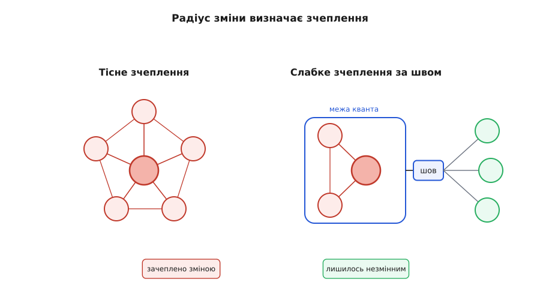
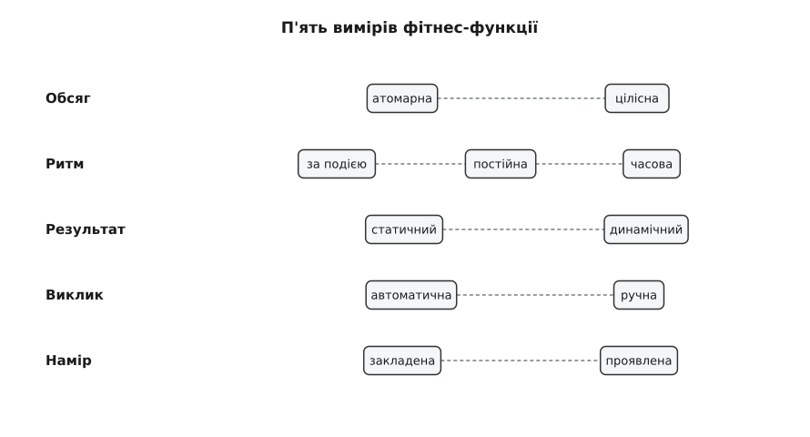
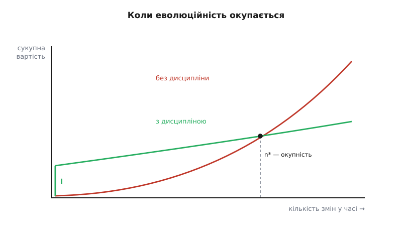

# Еволюційна архітектура як дефолт

<preknowlist>
- [Якісні атрибути («-ilities»)](topic:sf-apps/quality-attributes) — нефункціональні властивості системи (змінюваність, продуктивність, доступність) і чому за них торгуються архітектурні рішення.
- [Зворотні й незворотні рішення](topic:sf-apps/reversible-irreversible-decisions) — чому вартість відкату важливіша за розмір наслідків; двобічні й однобічні двері.
- [Тактики змінюваності](topic:sf-apps/modifiability-tactics) — шов, що ізолює зміну, і як зчеплення визначає, наскільки далеко вона розтечеться.
- [Зчеплення і зв'язність](topic:sf-apps/coupling-cohesion) — чим тісніше пов'язані частини, тим більше їх доводиться чіпати разом.
- [Trade-off-аналіз](topic:sf-apps/tradeoff-analysis) — будь-яке рішення платить одним атрибутом за інший; як цю ціну помічати.
</preknowlist>

Уяви, що тобі доручили спроєктувати систему, яка гарантовано доживе до дня, коли жодне з припущень, під які ти її будуєш, уже не діятиме. Не «можливо, зміниться» — гарантовано: інша база, інший обсяг даних, інші канали, інша команда, інші правила гри. За таких умов питання «як спроєктувати правильно з першого разу» навіть не хибне — воно **погано поставлене**, бо не має розв'язку. Правильної кінцевої форми, яку можна вгадати наперед, просто немає: та форма, що правильна сьогодні, застаріє рівно тому, що система працюватиме й самою своєю роботою змінюватиме світ навколо.

Еволюційна архітектура — це відповідь на **правильно** поставлене питання. Не «якою має бути кінцева форма», а «якою має бути система, щоб безпечно набувати будь-якої форми, якої від неї згодом зажадають». Різниця не косметична. У першому питанні цінність — у вдалому вгадуванні; у другому — у здатності **не залежати від вгадування взагалі**. І оскільки не залежати від вгадування корисно завжди, а вгадати точно не вдається майже ніколи, друге питання виявляється дефолтом: тверезим припущенням за замовчуванням для будь-якої системи, що проживе довше за квартал.

Щоб цей дефолт не лишався гаслом, його треба розібрати до механіки: чому зміна — це закон, а не невдача; що саме в системі є **одиницею, яка еволюціонує**; якою точною механікою тримається кожна з двох опор підходу; як порахувати, **коли** ця дисципліна окупається, а коли вона марна; і чому наприкінці все впирається не лише в код, а й у форму команди.

## Чому це закон, а не поради

Спокуса — читати заклик «проєктуй під зміну» як пораду досвідчених людей: мовляв, мудріше не прибивати рішення намертво. Порада — річ необов'язкова, її можна зважити й відкинути. Але за цим закликом стоїть не смак, а закономірність, яку спостерігали десятиліттями й яка тримається так само вперто, як фізичний закон.

Британський інженер **Меїр Лехман** (Meir M. Lehman), спостерігаючи в IBM за тим, як від випуску до випуску розвивається величезна операційна система, побачив дивну річ: програма **старіє**, хоча зношуватися в ній нічому. З цього виросли вісім емпіричних **законів еволюції програм**, які він формулював від 1974 до 1996 року. [Історію того, як ці закони народилися й зустрілися з ідеєю фітнес-функцій](topic:sf-apps/evolutionary-architecture/hist-evolutionary-architecture.md), винесено окремо; тут нас цікавить їхня механіка — **чому** так, а не просто **що** так.

Ключ — у Лехмановому понятті **E-type-програми** (від англ. *evolutionary* — еволюційна, і *embedded* — вбудована в реальність). E-type — це система, яка **розв'язує задачу реального світу й тим самим стає його частиною**. І ось тут виникає петля, з якої немає виходу. Система вирішує задачу → люди починають нею користуватися → їхня поведінка міняється саме тому, що система тепер існує → змінена поведінка породжує нові очікування до системи → системі доводиться мінятися → і все спочатку. Система — не спостерігач за середовищем, вона **частина** середовища, тож не може його «остаточно задовольнити»: щойно задовольнила, середовище вже інше, бо вона його змінила. Це й є перший закон — **неперервна зміна**: E-type мусить мінятися постійно, інакше стає дедалі менш придатною. Не через недбалість, а через власну вбудованість.

Протиставлення прояснює межу. Є **S-type**-програми, повністю задані незмінною формальною специфікацією — скажімо, реалізація математичної функції. Специфікація не міняється, тож і програмі мінятися нема від чого; вона не старіє. Уся неприємність Лехмана діє **виключно** для E-type. А тепер погляньмо, що ми пишемо на продаж і в експлуатацію: платіжні системи, склади, розклади, майже все. Це E-type. Ось чому «дефолт» — не перебільшення: винятки (чисті S-type) настільки рідкісні, що будувати під них загальну звичку безглуздо.

Другий закон додає до неминучості зміни її ціну — **наростання складності**: у міру змін внутрішній безлад системи росте **сам собою**, якщо не витрачати окремих зусиль, щоб його стримувати. Тут доречна точна аналогія з другим началом термодинаміки: у замкненій системі ентропія (безлад) не спадає сама; щоб її знизити, треба ввести ззовні енергію та роботу. Так само й тут: структурний безлад коду не розсмоктується сам, і кожна правка, вклинена в готове, лишає по собі трохи невпорядкованості — щось довелося підв'язати збоку, протягнути навскіс, зробити виняток. Аналогія, щоправда, ламається в одному важливому місці: термодинамічна ентропія росте за строгим законом незалежно ні від чого, а структурна — лише **«якщо не докладати роботи»**. Це не пророцтво загибелі, а **називання ціни життя**: хочеш, щоб система жила й не гнила, — плати окрему, постійну, свідому працю проти безладу.

Складімо обидва закони — і побачимо, що виходу «нічого не робити» немає. Перший каже: система **мусить** мінятися, бо інакше відстане й помре. Другий каже: кожна зміна **псує** структуру, якщо проти цього не працювати. Разом вони затискають будь-яку живу систему в лещата: застигнути й відстати або мінятися й гнити. Єдиний третій шлях — мінятися, **навмисне** витрачаючи силу на те, щоб структура лишалася придатною до зміни. Саме ця витрата уваги, зроблена систематичною, і є еволюційна архітектура. Вона не бореться з Лехмановими законами — вона **є** тією роботою, яку другий закон називає ціною.


*Два Лехманові закони діють разом і затискають систему в лещата: не мінятися не можна, а мінятися — псує структуру. Вихід не в тому, щоб уникнути зміни, а в тому, щоб зробити її керованою.*

## Означення, у яке варто вчитатися

Автори підходу — Ніл Форд, Ребекка Парсонс і Патрік Куа — дали означення навмисно щільне: **еволюційна архітектура підтримує напрямну, поступову зміну за кількома вимірами**. У ньому кожне слово несе вагу, і найглибше — те, що ховається за словами «за кількома вимірами».

**Поступова (англ. *incremental*)** означає, що система міняється малими кроками, кожен із яких безпечний і зворотний. Це не косметика: величина кроку прямо визначає ризик. Один великий стрибок «усе переписали» — це одна велика ставка, яка або виграє, або кладе систему; сто маленьких кроків — це сто дешевих ставок, кожну з яких можна відкотити, дізнавшись правду. Поступовість перетворює непідйомний ризик на серію підйомних.

**Напрямна (англ. *guided*)** означає, що після кожного кроку є спосіб перевірити: система досі задовольняє те, що для неї важливо. Без цієї перевірки поступовість обертається на швидше гниття — міняєшся легко, тільки щоразу трохи псуєшся й не помічаєш. «Напрямна» — це кермо; «поступова» — це маленькі кроки; одне без одного не працює.

А от **за кількома вимірами** — найтонше. Легко думати, що «архітектура» — це структура коду, і саме її треба тримати придатною до зміни. Але система тримає форму одразу за багатьма осями: структура коду, **схема даних**, безпека, продуктивність, спосіб розгортання, залежності між командами. Зміна, чиста за однією віссю, може зруйнувати іншу: акуратний рефакторинг коду тихо ламає сумісність даних; вдале прискорення відкриває діру в безпеці. Тому «напрямна» перевірка мусить стерегти **всі** важливі осі одночасно, а не одну. Еволюційність — це властивість системи в багатовимірному просторі якостей, і губиться вона там, де за однією віссю не дивляться.

Звідси виходить головне: еволюційність — це **окремий якісний атрибут**, поставлений поряд зі змінюваністю, продуктивністю, доступністю. Але цілиться він глибше за просту змінюваність. [Тактики змінюваності](topic:sf-apps/modifiability-tactics) роблять дешевою **одну передбачену** зміну: сховав формат за швом — і поміняв його одним рухом. Еволюційна архітектура ставить питання ширше: прийдуть і зміни, яких ти **не передбачив**, і система має пережити їхній **потік**, а не одну заготовлену. Тому вона не вгадує конкретних майбутніх правок, а спирається на дві опори, що працюють без вгадування: тримати рішення **зворотними** й тримати перевірку важливого **автоматичною**. Обидві розберемо механічно — але спершу треба назвати те, що взагалі еволюціонує.

## Одиниця, яка еволюціонує: архітектурний квант

Питання, яке зазвичай прослизає повз увагу: коли ми кажемо «система еволюціонує», що саме є найменшою частиною, здатною змінитися **самостійно**, не тягнучи за собою решту? Відповідь на нього — не філософія, а дуже практична межа, і автори підходу дали їй ім'я: **архітектурний квант** (англ. *architectural quantum*, від лат. *quantum* — «скільки», найменша неподільна порція).

Квант означено як **незалежно розгортуваний артефакт із високою функціональною зв'язністю та синхронною зчепленістю**. Розберімо три частини, бо разом вони й задають, що еволюціонує.

**Незалежно розгортуваний** — квант можна викласти в експлуатацію окремо, не викладаючи разом із ним усе інше. Це і є одиниця самостійної зміни: якщо дві частини завжди доводиться розгортати разом, вони — **один** квант, хай навіть лежать у різних теках. Незалежність розгортання — не зручність, а визначальна властивість: тільки те, що розгортається окремо, може й еволюціонувати окремо.

**Висока функціональна зв'язність** — усередині кванта зібрано те, що змінюється **з однієї причини**, працює на один зв'язний шматок задачі. Якщо в одному кванті злиплися дві незалежні відповідальності, кожна зміна однієї штовхає розгортати й другу — квант стає штучно великим і незручним до еволюції.

**Синхронна зчепленість** (англ. *synchronous connascence*) — найтонша частина, і саме вона проводить межу кванта. Дві частини перебувають у синхронній зчепленості, коли зміна однієї **вимагає, щоб другу випустили в тому самому розгортанні**: між ними не можна мати розбіжність версій у проді. Ось де ключ: **межа кванта проходить рівно там, де закінчується синхронна зчепленість**. Усе, що мусить випускатися разом, — усередині одного кванта; усе, що може випускатися нарізно (спілкуючись через сумісний контракт), — в інших квантах.

> 🔧 **Навіщо це.** Поняття кванта перетворює туманне «розбий систему на частини» на перевірне питання: чи можу я викласти цю частину в прод **сам**, не координуючи випуск із сусідньою? Якщо ні — це не окрема частина, а той самий квант, і ділити код між командами по цій межі марно: вони все одно релізитимуться в один такт. Квант — це чесна межа автономії, на відміну від намальованої на діаграмі.

Тут корисно розрізнити **два види зчеплення**, які легко плутають. **Статичне зчеплення** — те, як частини з'єднані «на монтажі»: хто кого імпортує, хто від кого залежить у складанні. Воно задає, що з чим доведеться **зібрати й розгорнути** разом. **Динамічне зчеплення** — те, як частини **звертаються одна до одної під час роботи**: синхронний виклик, чекання відповіді. Воно задає, як відмова чи затримка однієї частини під навантаженням розтікається на інші в живому. Еволюційність упирається переважно в перше (що доводиться міняти й викладати разом), а стійкість у проді — переважно в друге; плутати їх — типова помилка, бо система буває чудово розділена статично й водночас смертельно сплетена динамічно.

## Зчеплення — фізика радіуса зміни

Тепер видно, чому все впирається в зчеплення, і можна сказати це точно. Внести зміну — означає щось поправити; **радіус зміни** — це те, скільки ще всього доведеться поправити слідом, щоб система лишилася коректною. Еволюційність — це малий радіус: зміна стоїть у межах одного кванта й не розтікається далі. Ерозія — це радіус, що росте: те, що колись правилося в одному місці, з часом тягне десять правок у несподіваних кутках.

Що фізично визначає цей радіус? Міра, яку 1992 року в статті для *Communications of the ACM* увів **Меїр Пейдж-Джонс** (Meilir Page-Jones), — **зчепленість** (англ. *connascence*, від лат. *con-* — «разом» і *nasci* — «народжуватися»; «народжені разом»). Означення просте й глибоке: дві частини **зчеплені**, якщо зміна однієї змушує змінити другу, щоб система лишилася коректною. Це не про те, чи «викликає» одна одну, а про те, чи **тягне за собою при зміні**. Формальний апарат цієї міри — форми, сила, локальність — [винесено в математику зчеплення й зв'язності](topic:sf-apps/coupling-cohesion/math-metrics-connascence.md); тут візьмемо з нього рівно те, що керує еволюцією.

Пейдж-Джонс розклав зчепленість на **сходинки за силою** — від найлегшої до найважчої. Найлегша, **зчепленість іменем**: дві частини мусять узгодити лише **ім'я** сутності (усі кличуть функцію тим самим іменем). Змінити легко — перейменування ловить компілятор чи інструмент. Далі важчають: **зчепленість типом** (мусять узгодити тип), **зчепленість змістом** (мусять однаково розуміти, що означає значення — скажімо, що `1` у полі статусу — це «активний»), **зчепленість позицією** (мусять узгодити **порядок** — аргументів, полів), і найважча зі статичних — **зчепленість алгоритмом** (обидві сторони мусять реалізувати той самий алгоритм, як-от однакове хешування пароля на клієнті й сервері). Що вище сходинкою, то підступніша зміна: перейменування зловить машина, а от мовчазну домовленість про порядок чи про зміст числа не зловить ніхто — вона ламається тихо, у проді.

Різницю силою добре видно на дрібному прикладі. Ось те саме, зчеплене спершу **позицією**, а потім **іменем**:

:::tabs
```ts
// Зчеплення ПОЗИЦІЄЮ: зміст аргументів тримається на порядку.
function schedule(userId: string, retries: number, timeoutMs: number) { /* ... */ }
schedule("u-42", 3, 5000);
// Переставив 3 і 5000 місцями — типи збіглися, компілятор мовчить,
// а логіка вже бреше: 5000 спроб і таймаут 3 мс. Зламалось тихо.

// Зчеплення ІМЕНЕМ: порядок більше не несе змісту.
function schedule2(o: { userId: string; retries: number; timeoutMs: number }) { /* ... */ }
schedule2({ userId: "u-42", timeoutMs: 5000, retries: 3 });
// Порядок довільний — сенс тримає ім'я поля, переставити безпечно.
```
```py
# Зчеплення ПОЗИЦІЄЮ: зміст аргументів тримається на порядку.
def schedule(user_id: str, retries: int, timeout_ms: int): ...
schedule("u-42", 3, 5000)
# Переставив 3 і 5000 — типи збіглися, інтерпретатор мовчить,
# а логіка вже бреше: 5000 спроб і таймаут 3 мс. Зламалось тихо.

# Зчеплення ІМЕНЕМ: параметри лише за ключем, порядок не несе змісту.
def schedule2(*, user_id: str, retries: int, timeout_ms: int): ...
schedule2(user_id="u-42", timeout_ms=5000, retries=3)
# Порядок довільний — сенс тримає ім'я, переставити безпечно.
```
:::

Друга властивість, не менш важлива за силу, — **локальність**: як далеко одна від одної живуть зчеплені частини. Те саме зчеплення позицією між двома рядками однієї функції — дрібниця (усе перед очима, зміна тривіальна); те саме зчеплення позицією між двома сервісами різних команд — катастрофа (мовчазна домовленість про порядок, розтягнута через мережу й через двоє людей). Звідси випливає правило, яке й перетворює зчепленість на інструмент проєктування: **що сильніша зчепленість, то локальнішою вона мусить бути**. Сильні зв'язки тримай усередині кванта, впритул, де зміна дешева; **крізь** межу кванта пускай лише найслабші форми — узгодження іменем через сумісний контракт. Максимум зчепленості — всередині межі; мінімум — на межі. Це та сама думка, що й «висока зв'язність, низьке зчеплення», але сказана точніше: не «менше зв'язків узагалі», а «сильні зв'язки — коротко, слабкі — на відстань».


*Радіус зміни задає зчеплення. Ліворуч сильні зв'язки розтягнуті на всю систему — зміна розтікається всюди. Праворуч сильні зв'язки замкнено в кванті, а назовні винесено лише слабку зчепленість іменем через шов — і зміна не виходить за межу.*

Отут стає видно, чому **шов** (англ. *seam*) — головний технічний важіль підходу. Шов — це тонкий інтерфейс, за яким сховано конкретний вибір, а спілкування крізь нього зведене до узгодження іменем. Шов не «зменшує зв'язки» абстрактно — він **знижує силу зчепленості на межі кванта** з важкої (алгоритм, позиція, реалізація протекла в код) до легкої (ім'я контракту). Саме тому за швом можна замінити чергу, базу, провайдера, переписавши лише адаптер: усе важке зчеплення лишилося з одного боку шва, а крізь шов іде тільки те, що міняється безболісно.

## Перша опора: зворотність замість передбачення

Якщо майбутнє не передбачити — а Лехманові закони саме про те, що не передбачити, — будувати систему на вгадуванні марно. Еволюційна архітектура спирається на протилежне: зроби так, щоб **помилитися було дешево**. Не вгадай правильний вибір бази, черги, формату — зроби кожен такий вибір **зворотним**, щоб, коли він виявиться хибним (а частина виявиться), відкотити його коштувало копійки. Це прямо спирається на розрізнення [зворотних і незворотних рішень](topic:sf-apps/reversible-irreversible-decisions): система з переважно двобічних дверей еволюціонує вільно, бо будь-який хибний крок відкочується без болю; система з незворотних рішень застигає, бо кожна помилка коштує так дорого, що мінятися стає страшно.

Але зворотність — не лише про архітектурні шви в коді; вона має **дві часові площини**, і глибина підходу в тому, як вони працюють разом. Перша — зворотність **у часі проєктування**: не замуровувати незворотне, поки можна почекати. Це принцип [останнього відповідального моменту](topic:sf-apps/last-responsible-moment): рішення тримають відкритим рівно до миті, після якої зволікання коштує дорожче за вигоду від очікування. Що пізніше ухвалено, то більше знань устигло накопичитися — тож еволюційна архітектура свідомо **відкладає** незворотні вибори, лишаючи виборів відкритими, доки система сама не покаже, куди їй зручніше рости.

Друга площина — зворотність **у часі виконання**: навіть уже випущену зміну можна відкотити. Тут працюють руки експлуатації: викладати нове **поряд** зі старим і перемикати трафік поступово. Синьо-зелене розгортання тримає дві версії й перемикає їх миттєво; канаркове (англ. *canary*) пускає нову версію спершу на малу частку трафіку й нарощує, лише якщо фітнес-функції мовчать. Відкат (англ. *rollback*) — це і є граничний двобічний двері: помилка, помічена в проді, повертається одним рухом. Зворотність у часі виконання перетворює навіть випуск на дешеву ставку.

Найглибший прийом цієї опори — той, що **розбиває навіть незворотну на вигляд зміну на послідовність зворотних кроків**. Зміна контракту (перейменувати поле в базі, поламати формат API) виглядає як однобічні двері: старі клієнти зламаються тієї ж миті. Але її можна перетворити на три безпечні фази — це патерн **паралельної зміни** (англ. *parallel change*, він же *expand/contract* — «розшир і стисни»), який Даніло Сато описав на блозі Мартіна Фаулера 2014 року. Механіка тримається на одному інваріанті: **на кожному проміжному розгортанні старе й нове співіснують**, тож будь-який окремий крок відкочується.

```
Фаза 1 — РОЗШИРИТИ: додати нове поряд зі старим (нова колонка / нова версія
         контракту). Старе працює як працювало. Ніхто ще не зламався.
Фаза 2 — МІГРУВАТИ: писати в ОБИДВІ форми, читати з нової; поступово перевести
         всіх споживачів на нову. Старе ще живе — відкат безпечний.
Фаза 3 — СТИСНУТИ: коли жоден споживач не торкається старого — прибрати старе.
```

Серце тут — друга фаза, «писати в обидві». Поки система пише і в старе поле, і в нове, будь-який споживач працює на тому, на яке встиг перейти, а відкат ніколи не втрачає даних:

```ts
// Фаза «мігрувати»: пишемо в ОБИДВІ форми — тому будь-який крок зворотний.
async function saveContact(userId: string, email: string) {
  await db.update(userId, {
    email,               // нове поле — те, куди зрештою всі перейдуть
    contact_email: email // старе поле — поки ще пишемо, щоб відкат був безпечний
  });
}
```

Кожна з трьох фаз — окреме, мале, зворотне розгортання; жодна не ламає нічого миттєво. Однобічні двері розкладено на троє двобічних. [Повний код паралельної зміни зі зворотним переходом і перевіркою](topic:sf-apps/reversible-irreversible-decisions/proj-expand-contract.md) розібрано окремо; головне тут — що це і є те, як еволюційна архітектура поводиться зі змінами, які «неможливо» зробити без поломки.

## Друга опора: перевірка важливого має бути автоматичною

Зворотність дозволяє мінятися сміливо. Але сміливість без нагляду — це просто швидший шлях до гниття: система міняється легко, тільки щоразу трохи псується, і ніхто не помічає, доки не пізно. Ось де вступає «напрямна» з означення. Щоб зміна лишалася керованою, після кожного кроку треба **перевіряти**, що система досі тримає важливе, а оскільки кроків багато й вони часті, перевірка **мусить бути автоматичною** — рука людини за нею не встигне.

Механізм цієї перевірки — **фітнес-функція** (англ. *fitness function*). Термін узято з еволюційного обчислення: там фітнес-функція — міра, наскільки кандидат-розв'язок близький до мети, що напрямляє наосліпний відбір. Перенесена в архітектуру, вона стає **автоматичною перевіркою якісного атрибута**: не «чи працює функція», а «чи досі система тримає те, що для неї важливо». [Фітнес-функції](topic:sf-apps/fitness-functions) — окрема велика тема; тут важить те, що робить їх здатними стерегти **кілька вимірів одразу**: вони бувають дуже різні, і ця різність — не випадкова, а класифікована за п'ятьма осями.

**Обсяг: атомарна проти цілісної.** Атомарна фітнес-функція перевіряє **один** аспект в ізоляції — скажімо, що жоден модуль домену не імпортує шар бази. Цілісна перевіряє **комбінацію** аспектів разом, бо в реальності вони взаємодіють: перевірити, що під навантаженням у 1000 запитів час відповіді тримається **й** шифрування ввімкнене — властивість, якої не видно, якщо міряти кожне окремо. Найважливіші, найважчі властивості системи — цілісні: масштабованість чи стійкість не живуть в одному модулі, вони **проявляються** зі взаємодії, і зловити їх атомарно неможливо.

**Ритм: за подією, постійна чи часова.** Одні функції біжать **за подією** — на кожен коміт, у складанні. Інші працюють **постійно**, безперервно міряючи щось у живому проді (наприклад, час транзакції). Треті мають **часову** складову — спрацьовують за розкладом як нагадування: «за два тижні виходить нова версія бібліотеки — перевір сумісність». Ритм добирають під те, як швидко відповідна властивість може непомітно поповзти.

**Результат: статичний проти динамічного.** Статична функція має фіксований поріг: тест або пройшов, або ні (час відповіді < 100 мс). Динамічна судить за **рухомою** межею, що залежить від контексту: припустимий час відповіді вищий уночі під пакетним навантаженням і нижчий удень — поріг рухається за обставинами.

**Виклик: автоматична проти ручної.** За замовчуванням — автоматична, бо лише автоматику встигає ритм змін. Але деякі властивості (скажімо, юридична відповідність нового потоку даних) поки що потребують людини; така ручна перевірка теж фітнес-функція, тільки з людиною в петлі — і мета з часом її автоматизувати.

**Намір: закладена проти проявленої.** **Закладену** фітнес-функцію ставлять на старті під властивість, яку від початку знають критичною. **Проявлена** народжується згодом — коли система вже виросла й раптом вилізла проблема, якої ніхто не передбачав: тоді пишуть нову функцію, щоб вона більше ніколи не повернулася непоміченою. Проявлені функції — це пам'ять системи про власні болячки.


*Фітнес-функції не однакові: вони розкладаються за п'ятьма осями. Саме ця різноманітність дає змогу стерегти всі важливі виміри системи одночасно — від атомарного правила шарів до цілісної перевірки масштабованості під навантаженням.*

Разом ці осі показують, чому фітнес-функції — не «ще одні тести». Тест питає «чи правильна поведінка»; фітнес-функція питає «чи досі система тримає **форму**» — за структурою, даними, безпекою, швидкістю, розгортанням. Друге видання книжки про підхід (2022) навіть змінило підзаголовок на «автоматизоване керування програмним продуктом»: центр ваги відкрито переїхав на думку, що архітектурні правила мають бути **виконуваним кодом**, а не побажаннями на діаграмі. Правило, яке стереже лише пам'ять розробників, порушується за перший аврал; правило, вбудоване в складання фітнес-функцією, зупиняє порушення в мить, коли воно зроблене. [Робочий приклад суцільного набору фітнес-функцій — правило шарів, пошук циклічних залежностей і цілісна перевірка бюджету — з розбором і складністю](topic:sf-apps/evolutionary-architecture/proj-fitness-harness.md) винесено окремо.

> 🔧 **Навіщо це.** Найпідступніша ерозія — та, якої ніхто не робив навмисне. Ніхто не вирішував «зіпсуймо шари»; просто сотня дрібних «на швидку руку» за рік перетворила чисту структуру на клубок. Цілісна фітнес-функція на межу залежностей ловить кожне таке дрібне порушення в мить, коли до виправлення один рядок, а не тижнева розплутка. Це і є різниця між системою, що з роками тримає форму, і тією, що тихо стає болотом.

Тепер видно ворога чітко. Без цих двох опор із системою відбувається [ерозія архітектури](topic:sf-apps/architecture-erosion): реальна структура коду поволі розходиться із задуманою під тиском дрібних поступок, аж доки задуману не впізнати. Ерозія — це другий Лехманів закон у дії, наростання безладу, якому ніхто не протистоїть. Еволюційна архітектура і є те систематичне протистояння: кожна зміна проходить крізь двоє воріт — **зворотність** (помилку легко відкотити) і **фітнес-функцію** (порушення важливого не проходить).


*Дві опори підходу — це двоє воріт, крізь які пропускають кожну зміну. Разом вони відрізняють керовану еволюцію від безконтрольного гниття: перші дозволяють помилятися дешево, другі не пускають порушень важливого.*

## Економіка: коли ця дисципліна окупається

І тут — обов'язкова чесність, без якої підхід перетворюється на догму. Еволюційність, як і будь-який якісний атрибут, за щось платить, і платить помітно. Шви — це зайві шари непрямості: код повільніший (виклик через інтерфейс замість прямого) і важчий для читання (щоб знати, що виконається, треба знати, який адаптер підставлено). Фітнес-функції — це код, який хтось пише, тримає в актуальному стані й ганяє на кожному складанні. Настанова «тримати все зворотним» спокушає обвішати швами навіть те, що ніколи не зміниться. Усе це — витрати, і рішення, **де** й **наскільки** вкладатися в еволюційність, саме по собі [компроміс](topic:sf-apps/tradeoff-analysis), який треба зробити свідомо, а не за модою.

Зробімо цей компроміс кількісним, бо тут ховається точна межа розумного. Порівняймо сукупну вартість внесення `n` змін у двох світах. У світі **без дисципліни** кожна зміна лишає трохи безладу, тож наступні дорожчають — з'являється надлінійний, квадратичний член ерозії. У світі **з дисципліною** є разове вкладення (шви + фітнес-функції), зате гранична вартість зміни **не росте**: структура тримається, тож сота зміна коштує майже стільки ж, як перша.

**Скільки змін має пережити система, щоб дисципліна окупилася.** Візьмемо просту модель і підставимо числа:

```
Без дисципліни (структура гниє — надлінійний член):
    C₀(n) = a·n + b·n²
З дисципліною (гранична вартість стала, квадрата немає):
    C₁(n) = I + c·n

Числа для прикладу:
    a = 1     · вартість першої зміни в чистій структурі
    c = 1     · з дисципліною гранична вартість не росте (c = a)
    b = 0.03  · темп ерозії: кожна зміна трохи дорожчає наступні
    I = 8     · разове вкладення у шви + фітнес-функції

Точка окупності — де витрати зрівнялися, C₀(n*) = C₁(n*):
    a·n + b·n²  =  I + c·n
    b·n²        =  I              · лінійні члени скоротилися, бо c = a
    n²          =  I / b  =  8 / 0.03  ≈  266.7
    n*          =  √266.7  ≈  16.3
```

Висновок читається прямо. Якщо система за життя переживе **менше ніж ~16 змін** — вкладення не окупиться, дисципліна лише додасть витрат: рекламний лендинг на два тижні робити еволюційним безглуздо, він не проживе стільки, щоб окупити шви. Але якщо система переживе **сотні** змін — а ядро живого продукту переживає тисячі, — то без дисципліни працює квадрат: при `n = 500` ерозія додає `b·n² = 0.03·250000 = 7500` одиниць проти жалюгідних `8` вкладення. Тут дисципліна економить не відсотки, а порядки.

Дві похідні з цієї моделі важать не менше за саме число. По-перше, **чутливість до темпу ерозії `b`**: у домені, де зчеплення легко розповзається (багато команд, тісні контракти, спільна база), `b` більший — і точка окупності `n*` настає **раніше**, бо квадрат б'є швидше. По-друге, **чутливість до вкладення `I`**: чим важча машинерія (складні шви, крихкі цілісні фітнес-функції), тим `n*` пізніший — надто дорога дисципліна окупається надто нескоро. Звідси практичний висновок: еволюційність закладають **дозовано**, під очікуваний вік системи помножений на темп змін, і **дешево** — легкими швами й простими фітнес-функціями, бо роздута машинерія відсуває окупність за горизонт життя системи. [Повне виведення моделі — з дисконтуванням майбутніх витрат і трактуванням зворотності як опціону](topic:sf-apps/evolutionary-architecture/math-evolvability-economics.md) винесено окремо.


*Ліворуч від точки окупності дисципліна дорожча — тут живе система-одноденка, якій вона не потрібна. Праворуч квадратичний член ерозії бере гору, і без дисципліни вартість зміни тікає в небо. Місце точки окупності залежить від вкладення I й темпу ерозії b.*

## Соціотехніка: квант мусить збігтися з командою

Досі йшлося про код. Але є вимір, у якому найчистіша архітектура однаково не еволюціонує, — і цей вимір організаційний. Його назвав ще 1967 року Мелвін Конвей: **система повторює структуру спілкування організації, що її будує** — [закон Конвея](topic:sf-apps/conways-law). Причина проста й невблаганна: щоб дві частини системи стикувалися, люди, які їх пишуть, мусять домовитися; межі домовляння між людьми відбиваються в межах між частинами.

Складімо це з поняттям кванта — і вилізе неприємний наслідок. Усередині кванта живе **синхронна зчепленість** — те, що мусить випускатися разом. А тепер уяви, що межа кванта проходить **не там**, де межа команди: сильна, синхронна зчепленість перетинає межу між двома командами. Що станеться з еволюцією? Кожна зміна цього кванта тепер вимагає, щоб дві команди **скоординували випуск** — узгодили версії, домовилися про час, дочекалися одна одної. Технічно код може бути бездоганним; та швидкість зміни впаде, бо на кожен крок тепер потрібна міжкомандна нарада. Синхронна зчепленість, розтягнута через організаційну межу, — це та сама важка зчепленість із поганою локальністю, тільки локальність тут вимірюється не рядками коду, а людьми й нарадами.

Звідси випливає, що еволюційність — властивість **соціотехнічна**, а не суто технічна. Щоб система еволюціонувала вільно, межі квантів мусять збігтися з межами команд: усе, що випускається разом, — в одній команді; крізь межу команди — лише слабка зчепленість сумісним контрактом. Це можна робити навмисне: спроєктувати команди так, щоб бажана архітектура стала природною (**зворотний маневр Конвея** — [inverse Conway maneuver](topic:sf-apps/inverse-conway)), і різати відповідальність між командами так, щоб кожна тримала свій квант цілком, не перевантажуючись чужим ([team topologies](topic:sf-apps/team-topologies)). Без цього збігу фітнес-функції й шви ловитимуть технічну ерозію, а система все одно застигатиме — на організаційних швах, яких жоден тест не бачить.

> 🔧 **Навіщо це.** Коли команда скаржиться, що «будь-яка зміна тягне узгодження з трьома іншими командами», — це майже завжди не проблема людей, а неправильно проведена межа кванта: синхронна зчепленість перетнула організаційний шов. Лікується не старанністю на нарадах, а перекроєм меж — так, щоб те, що змінюється разом, жило в одних руках. Дешева фітнес-функція, яка стежить за напрямом залежностей між модулями команд, ловить цей розлад раніше, ніж він застигне в структурі.

## Межі: коли підхід шкодить

Чесний підхід окреслює власні межі, і в еволюційної архітектури їх кілька — усі виводяться з уже сказаного.

**Система-одноденка та чистий S-type.** Економіка вже дала межу: якщо очікуваний вік × темп змін дає менше за точку окупності, дисципліна лише додає витрат. Одноразовий скрипт, разова міграція, рекламний лендинг, реалізація незмінної специфікації — тут вкладення у шви й фітнес-функції не встигне повернутися. Не кожна система E-type, і не кожна E-type-система житиме досить довго.

**Надлишок швів.** Настанова «тримати зворотним» перероджується в антипатерн, якщо обвішувати швами те, що ніколи не зміниться. Кожен шов — це вкладення `I` й постійна плата непрямістю; шов під зміну, якої не буде, — чисті витрати без вигоди, ще й гальмо для читання. Це та сама надмірна гнучкість, від якої застерігає «не роби, доки не знадобилось»: передбачати треба **осі** можливої зміни (де реально житиме варіативність), а не обмащувати абстракцією геть усе. Зайвий шов гірший за його відсутність, бо його ще й супроводжувати.

**Гниття самих фітнес-функцій.** Фітнес-функція — це код, і вона старіє за тими самими Лехмановими законами. Недоглянута цілісна функція, що зрідка падає без причини (флапає), швидко привчає команду її ігнорувати чи вимикати — і тоді вона не стереже нічого, лише створює шум і оманливу впевненість. Фітнес-функції треба тримати **швидкими, стабільними й правдивими**; крихкий, повільний, брехливий набір гірший за його відсутність, бо йому вірять і на нього спираються.

**Ціна розподілу.** Спокуса «розділити все на дрібні незалежні частини» ігнорує другий вид зчеплення. Дрібніші [мікросервіси](topic:sf-apps/microservices) знижують статичне зчеплення (кожен розгортається окремо), але **піднімають динамічне**: те, що було викликом функції в пам'яті, стає мережевим запитом — з латентністю, відмовами, потребою в узгодженні. Ба більше, надто дрібний поділ **знижує** еволюційність: якщо розрізати квант посеред синхронної зчепленості, внутрішньопроцесна зміна перетворюється на міжсервісну координацію версій — рівно те, чого квант мав уникнути. Правило зворотне модному: квант має бути **таким великим, як дозволяє зв'язність**, і не дрібнішим. Часто [модульний моноліт](topic:sf-apps/modular-monolith) — з чіткими внутрішніми межами, але одним розгортанням — еволюціонує вільніше за розсипаний рій сервісів.

**Незворотне, яке не зробити дешевим.** Деякі двері однобічні по суті: опублікований публічний контракт, дані, які вже роздано клієнтам, вибір із регуляторними наслідками. Тут еволюційність не бореться за дешевий відкат, якого не буде, — вона зміщується на **керування** однобічними дверима: явна політика виведення з ужитку, вікна сумісності, попередження заздалегідь. Визнати незворотне незворотним і обійтися з ним обережно — теж частина дисципліни, і [рішення під невизначеністю](topic:sf-apps/deciding-under-uncertainty) саме про те, як зважувати такі кроки, коли відкату не буде.

## Як це виглядає в русі

Складімо все в один хід думки, бо саме зв'язка опор дає підхід, а не кожна окремо. Приходить нова вимога — скажімо, змінити модель клієнтських даних так, що старий формат більше не годиться. Незворотна на вигляд зміна. Ось як її зустрічає еволюційна архітектура.

Спершу питають про **межу**: чи ця зміна стоїть у межах одного кванта, чи синхронна зчепленість тягне за собою сусідів і чужі команди. Якщо тягне — це сигнал, що межу проведено криво, і, можливо, дешевше спершу перекроїти межі, ніж двадцять разів координувати випуск. Далі незворотну зміну **розкладають** паралельною зміною на троє двобічних дверей: розширити (нове поряд зі старим), мігрувати (писати в обидва, читати з нового), стиснути (прибрати старе, коли ніхто його не торкається) — і на кожному проміжному кроці старе й нове співіснують, тож будь-який крок відкочується. Розгортають кожен крок **канарково**, на малій частці трафіку, а трафік нарощують, лише поки мовчать фітнес-функції: цілісна на час відповіді (щоб подвійний запис не просадив швидкодію), атомарна на межу залежностей (щоб нова модель не протекла крізь шари), часова на видалення старого поля (нагадування прибрати його, коли настане час). І весь цей рух спирається на дешевий наскрізний зріз — [walking skeleton](topic:sf-apps/walking-skeleton), — де новий шлях уже працює від краю до краю на живому, поки з нього ще легко зійти.

Жоден із цих кроків не вимагав **угадати** майбутнє. Кожен зробив систему такою, що **переживе** будь-яке майбутнє: помилку відкотить дешево, важливе втримає автоматично, ризик перевірить на дешевому зрізі до того, як стане дорого. У цьому й уся суть — перестати проєктувати систему як **закінчену форму** й почати проєктувати її як **живий організм, здатний змінюватися напрямно**. Не «спроєктували правильно й заморозили», а «заклали здатність рости й щодня нею користуємось». Ось чому це дефолт: будь-яка E-type-система, що проживе довше за мить, однаково еволюціонуватиме — питання лише в тому, робитиме вона це керовано чи гниючи. Лехманові закони не лишають третього; еволюційна архітектура — це просто вибір першого свідомо.
