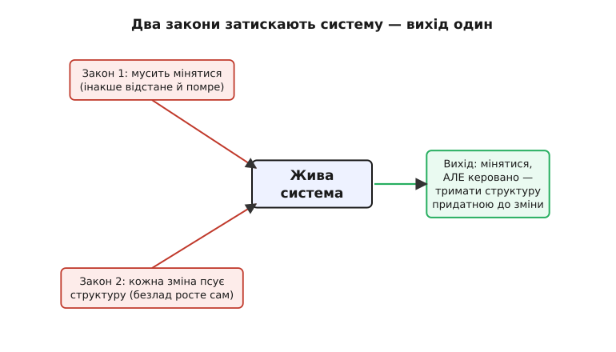
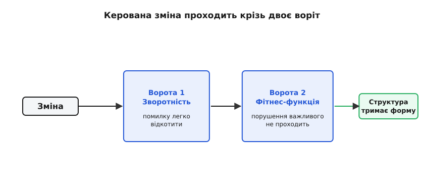
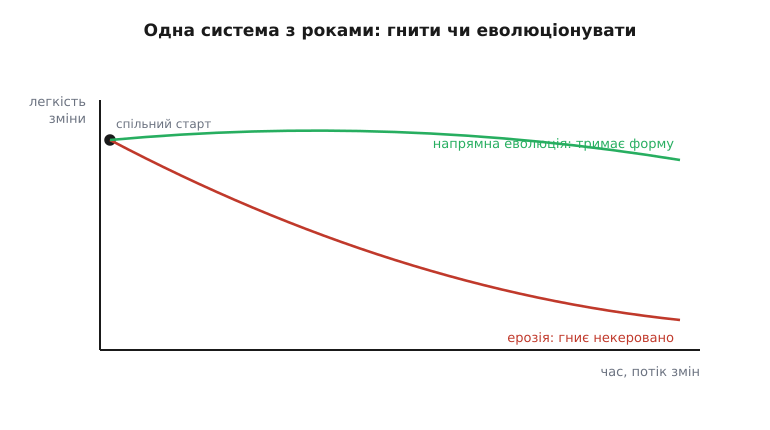

# Еволюційна архітектура як дефолт

<preknowlist>
- [Якісні атрибути («-ilities»)](root:sf-apps/quality-attributes) — нефункціональні властивості системи (змінюваність, продуктивність, доступність) і чому за них торгуються архітектурні рішення.
- [Зворотні й незворотні рішення](root:sf-apps/reversible-irreversible-decisions) — чому вартість відкату важливіша за розмір наслідків; двобічні й однобічні двері.
- [Тактики змінюваності](root:sf-apps/modifiability-tactics) — чим зчеплення й зв'язність визначають, наскільки далеко розтечеться зміна; шов, що ізолює.
- [Trade-off-аналіз](root:sf-apps/tradeoff-analysis) — будь-яке рішення платить одним атрибутом за інший; як цю ціну помічати.
</preknowlist>

Є заспокійлива картина того, як народжується програмна система. Спершу мудрі люди сідають і продумують архітектуру: малюють шари, обирають технології, кладуть межі. Тоді приходять програмісти й наповнюють ці межі кодом. Система виходить у світ — і стоїть, як спроєктували, роками. Ця картина гарна, зрозуміла й майже завжди хибна. Бо вимоги міняються, навантаження росте, з'являються нові канали, старіють бібліотеки, змінюються самі люди в команді — і жоден із цих зсувів не спитав дозволу в архітектури, накресленої на початку.

Еволюційна архітектура починається з того, що цю неприємну правду беруть **за вихідну умову**, а не за прикру неприємність. Зміна — не виняток, який колись трапиться, а **постійний фон**, у якому система живе весь свій вік. Тому питання «як спроєктувати правильно з першого разу» замінюють іншим: **як спроєктувати так, щоб система вміла безпечно мінятися далі**. Не вгадати кінцеву форму, а закласти здатність рости й перебудовуватися, не ламаючись. Ось чому «дефолт»: це не екзотичний стиль для особливих проєктів, а тверезе припущення за замовчуванням для будь-якої системи, що проживе довше за квартал.

## Чому зміна неминуча, а не випадкова

Спокуса — думати, що зміни це наслідок поганого планування: спланували б краще — не довелося б переробляти. Але зміни не породжені нашою недбалістю; вони — властивість самого явища «жива система, якою користуються». Це помітили й описали задовго до нас.

Британський дослідник **Меїр Лехман** (Meir M. Lehman) від 1974 до 1996 років сформулював вісім емпіричних **законів еволюції програм** — спостережень над тим, як поводяться реальні системи в промисловій експлуатації. Два з них тут ключові. **Закон неперервної зміни**: система, якою реально користуються, мусить постійно змінюватися, інакше вона поступово стає дедалі менш придатною — світ навколо неї рухається, а вона ні. І **закон наростання складності**: у міру змін внутрішній безлад системи росте сам собою, якщо не витрачати окремих зусиль, щоб його стримувати. [Історію цих законів і того, як із них виросла ідея еволюційної архітектури](root:sf-apps/evolutionary-architecture/hist-evolutionary-architecture.md), винесено окремо.

З цих двох законів разом випливає точна причина, чому «спланувати назавжди» не працює. Перший закон каже: система **мусить** мінятися, бо інакше помре. Другий каже: кожна зміна **псує** структуру, якщо не докладати сил проти цього. Складіть їх — і виходить, що система приречена або застигнути й відстати, або мінятися й гнити. Вихід лишається один: змінюватися, але **навмисне тримати структуру придатною до зміни**, витрачаючи на це окрему увагу. Саме ця витрата уваги й є еволюційна архітектура.

> 🔧 **Навіщо це.** Погляньте на будь-яку систему, яку ваша команда супроводжує кілька років. Швидкість, із якою в неї вносять зміни, з часом або тримається, або падає — і падіння майже ніколи не через складність нових задач. Воно через те, що структура під вагою сотень дрібних правок перестала пускати зміни легко: кожне нове поле тягне за собою десять правок у несподіваних місцях. Еволюційна архітектура — це дисципліна, яка тримає цю швидкість, не даючи структурі тихо зашкарубнути.


*Два Лехманові закони діють разом і затискають систему в лещата: не мінятися не можна, а мінятися — псує структуру. Вихід не в тому, щоб уникнути зміни, а в тому, щоб зробити її керованою.*

## Керована зміна: означення через один атрибут

Тепер зробімо поняття точним, бо «система, що вміє мінятися» звучить розпливчасто. Автори підходу — Ніл Форд, Ребекка Парсонс і Патрік Куа — дали означення, у яке варто вчитатися: **еволюційна архітектура підтримує напрямну, поступову зміну за кількома вимірами**. Розберімо його по словах, бо кожне несе вагу.

**Поступова (англ. *incremental*)** — система міняється малими кроками, кожен із яких безпечний і зворотний, а не одним великим стрибком «усе переписали». **Напрямна (англ. *guided*)** — зміна не хаотична; є спосіб щоразу перевірити, що система після кроку досі задовольняє те, що для неї важливо. **За кількома вимірами** — важливе не одне (скажімо, структура коду), а всі виміри одразу: продуктивність, безпека, дані, залежності між командами.

Іншими словами, еволюційність — це **окремий якісний атрибут** системи, поставлений поряд зі змінюваністю, продуктивністю, доступністю. Тільки цілиться він не в «легко внести одну зміну», а глибше: **легко вносити потік змін роками, не втрачаючи всього іншого, що важливо**. І як будь-який атрибут, його не отримують безкоштовно й не отримують випадково — його **закладають** як [архітектурний драйвер](root:sf-apps/architectural-drivers), коли зрозуміло, що система житиме довго й мінятиметься часто.

Тут криється тонка, але вирішальна відмінність від простої змінюваності. [Тактики змінюваності](root:sf-apps/modifiability-tactics) роблять дешевою **одну** передбачену зміну: сховав формат за швом — і поміняв його одним рухом. Еволюційна архітектура ставить питання ширше: зміни, яких ти **не передбачив**, теж прийдуть, і система має пережити їх **потік**, а не одну заготовлену. Тому вона спирається не на вгадування конкретних майбутніх правок, а на дві опори: тримати рішення **зворотними** й тримати перевірку важливого **автоматичною**.

## Перша опора: зворотність замість передбачення

Якщо майбутнє передбачити не можна — а Лехманові закони саме про те, що не можна, — то й будувати систему на вгадуванні майбутнього марно. Замість цього еволюційна архітектура спирається на протилежне: зроби так, щоб **помилитися було дешево**. Не вгадай правильний вибір бази, черги, формату — а зроби кожен такий вибір **зворотним**, щоб, коли він виявиться хибним (а частина виявиться), відкотити його коштувало копійки.

Це прямо зачіпає розрізнення [зворотних і незворотних рішень](root:sf-apps/reversible-irreversible-decisions). Система, побудована з переважно двобічних дверей, еволюціонує вільно: будь-який хибний крок відкочується без болю, тож команда може сміливо пробувати, дізнаватися правду на живому й виправлятися. Система, зіткана з незворотних рішень, застигає: кожна помилка коштує так дорого, що змінюватися стає страшно, і система тихо відстає від світу — рівно те, від чого застерігає перший Лехманів закон.

Головний технічний важіль тут — **шов** (англ. *seam*): тонкий інтерфейс, за яким захований конкретний вибір, тож замінити вибір означає переписати лише те, що за швом. Подивімося, як шов перетворює незворотне на еволюційне в коді. Ось прямий доступ до конкретної черги повідомлень — вибір, що протік у логіку й тому незворотний:

:::tabs
```cpp
// БЕЗ ШВА: конкретна черга протекла в бізнес-логіку
#include <rdkafka.h>          // тип Kafka просочився сюди

void publish_order(rd_kafka_t* k, const Order& o) {
    std::string payload = serialize(o);
    rd_kafka_producev(k, /* … купа kafka-специфіки … */);   // прибито до Kafka
}
```
```go
// БЕЗ ШВА: конкретна черга протекла в бізнес-логіку
package orders

import (
	"context"

	"github.com/segmentio/kafka-go" // тип Kafka просочився сюди
)

func PublishOrder(ctx context.Context, w *kafka.Writer, o Order) error {
	payload := serialize(o)
	// прибито до Kafka: конкретний Writer у сигнатурі, kafka.Message у тілі
	return w.WriteMessages(ctx, kafka.Message{Value: payload})
}
```
:::

А тепер той самий вибір за швом. Логіка знає лише порт `EventBus`; яка саме черга під ним — її не обходить:

:::tabs
```cpp
// ЗІ ШВОМ: логіка знає тільки порт, черга — за адаптером
struct EventBus {                              // порт: контракт без черги
    virtual void publish(const std::string& topic,
                         const std::string& payload) = 0;
    virtual ~EventBus() = default;
};

void publish_order(EventBus& bus, const Order& o) {
    bus.publish("orders", serialize(o));       // жодного сліду Kafka
}

// Конкретна черга живе в ОДНОМУ місці — в адаптері:
struct KafkaBus : EventBus { /* rdkafka саме тут */ };
// Завтра RabbitMQ чи хмарна черга — новий адаптер, publish_order не міняється.
```
```go
// ЗІ ШВОМ: логіка знає тільки порт, черга — за адаптером
package orders

// EventBus — порт: контракт без черги.
type EventBus interface {
	Publish(topic string, payload []byte) error
}

func PublishOrder(bus EventBus, o Order) error {
	return bus.Publish("orders", serialize(o)) // жодного сліду Kafka
}

// Конкретна черга живе в ОДНОМУ місці — в адаптері:
type KafkaBus struct{ /* kafka.Writer саме тут */ }

func (b *KafkaBus) Publish(topic string, payload []byte) error { /* ... */ }

// Завтра RabbitMQ чи хмарна черга — новий адаптер, PublishOrder не міняється.
```
:::

Вибір черги з незворотного став зворотним: щоб її замінити, пишуть новий адаптер, а вся система вище шва лишається на місці. Так система набуває здатності еволюціонувати саме там, де інакше застигла б.

Друга сторона тієї самої опори — **не ухвалювати незворотне, поки можна почекати**. Що пізніше ухвалено рішення, то більше знань устигло накопичитися. Це принцип [останнього відповідального моменту](root:sf-apps/last-responsible-moment): рішення тримають відкритим рівно до тієї миті, після якої зволікання вже коштує дорожче за вигоду від очікування. Еволюційна архітектура не квапиться замуровувати вибори — вона лишає їх відкритими, доки система сама не покаже, куди їй зручніше рости.

## Друга опора: перевірка важливого має бути автоматичною

Зворотність дозволяє мінятися сміливо. Але сміливість без нагляду — це шлях просто до швидшого гниття: система міняється легко, тільки щоразу трохи псується, і ніхто цього не помічає, доки не пізно. Ось тут вступає слово «напрямна» з означення. Щоб зміна була керованою, після кожного кроку треба **перевіряти**, що система досі задовольняє те, що для неї важливо. А оскільки кроків багато й вони часті, перевірка **мусить бути автоматичною** — рука людини за нею не встигне.

Механізм цієї автоматичної перевірки називають **фітнес-функцією** (англ. *fitness function*). Термін узятий з еволюційного обчислення: там, коли алгоритм наосліп перебирає варіанти розв'язку, фітнес-функція — це міра, що каже, **наскільки кандидат близький до мети**, і напрямляє відбір. Перенесені в архітектуру, фітнес-функції — це **автоматичні перевірки якісних атрибутів**: не «чи працює функція», а «чи досі система тримає те, що для неї важливо». Це окрема велика тема — [фітнес-функції](root:sf-apps/fitness-functions); тут головне вловити, навіщо вони й що без них еволюція перетворюється на деградацію.

Приклад робить ідею відчутною. Припустімо, у системі важлива вимога: рівні шарів не повинні звертатися один до одного в обхід — домен не має права смикати базу напряму, минаючи репозиторій. Це архітектурне правило. Поки його стереже лише пам'ять розробників, воно порушується за перший же аврал. Фітнес-функція робить його **виконуваним тестом**, що біжить у складанні:

:::tabs
```cpp
// Фітнес-функція: домен не сміє знати про шар доступу до бази.
// Проста форма — тест, що падає, коли правило порушено.
TEST(ArchitectureFitness, DomainDoesNotDependOnDb) {
    auto deps = scan_includes("src/domain");        // усі #include домену
    for (const auto& inc : deps) {
        // жоден файл домену не має тягнути заголовки шару БД
        EXPECT_FALSE(starts_with(inc, "db/"))
            << "Домен звертається до бази напряму: " << inc;
    }
}
```
```go
// Фітнес-функція: домен не сміє знати про шар доступу до бази.
// Проста форма — тест, що падає, коли правило порушено.
func TestDomainDoesNotDependOnDb(t *testing.T) {
	deps := scanImports("./domain/...") // усі import-и домену
	for _, imp := range deps {
		// жоден пакет домену не має тягнути пакети шару БД
		if strings.HasPrefix(imp, "app/db/") {
			t.Errorf("Домен звертається до бази напряму: %s", imp)
		}
	}
}
```
:::

Тепер правило перестало бути побажанням на діаграмі й стало умовою, без якої складання не проходить. Кожна зміна, що потай порушує архітектуру, зупиняється тут — автоматично, без наради й без рев'ю. Ось що означає «напрямна зміна»: система вільна рости, але щоразу проходить крізь ворота, які пильнують важливе.

> 🔧 **Навіщо це.** Найпідступніша форма гниття архітектури — та, що ніхто не робив навмисне. Ніхто не вирішував «а давайте зіпсуємо шари»; просто сотня дрібних «на швидку руку» за рік перетворила чисту структуру на клубок. Фітнес-функція ловить кожне таке дрібне порушення в мить, коли воно зроблене, — коли виправити його ще один рядок, а не тижнева розплутка. Це різниця між системою, що з роками тримає форму, і тією, що тихо перетворюється на болото.

## Ерозія — ось із чим це бореться

Тепер видно ворога чітко. Без цих двох опор із системою відбувається те, що звуть [ерозією архітектури](root:sf-apps/architecture-erosion): реальна структура коду поволі розходиться з задуманою, під тиском дрібних поступок, аж доки задуману вже й не впізнати. Ерозія — це другий Лехманів закон у дії: наростання безладу, якому ніхто не протистоїть.

Еволюційна архітектура — це і є те систематичне «протистояння», якого вимагає закон. Вона не обіцяє, що система не мінятиметься, — навпаки, вона припускає, що мінятиметься постійно. Вона обіцяє інше: що ці зміни не перетворять структуру на руїну, бо кожна проходить крізь двоє воріт — **зворотність** (помилку легко відкотити) і **фітнес-функцію** (порушення важливого не проходить). Там, де ерозія тягне систему вниз безконтрольно, еволюційна архітектура робить рух угору-вбік **керованим**.


*Дві опори підходу — це двоє воріт, крізь які пропускають кожну зміну. Разом вони відрізняють керовану еволюцію від безконтрольного гниття: перші дозволяють помилятися дешево, другі не пускають порушень важливого.*

Різницю добре видно, якщо простежити долю однієї системи в часі. Обидві траєкторії стартують з однієї точки — чиста структура, зміну внести легко. Далі йде той самий потік правок. Але система без воріт із кожною правкою трохи псується, і легкість зміни падає, аж поки будь-яка дрібниця не коштує тижнів. Система з воротами тримає форму: правок стільки ж, але жодна не псує структуру нишком.


*Та сама система під тим самим потоком змін розходиться на два шляхи. Без дисципліни легкість зміни неухильно падає — це другий Лехманів закон без спротиву. З дисципліною вона тримається, бо кожна зміна проходить крізь ворота.*

## Ціна: еволюційність теж не безкоштовна

І тут — обов'язкова чесність, без якої підхід перетворюється на догму. Еволюційність, як і будь-який якісний атрибут, за щось платить, і платить помітно. Це саме той компроміс, який ловить [trade-off-аналіз](root:sf-apps/tradeoff-analysis): виграв у здатності мінятися — заплатив деінде.

Чим саме платять? Шви, що дають зворотність, — це зайві шари непрямості: код стає повільнішим (виклик через інтерфейс замість прямого) і важчим для читання, бо щоб зрозуміти, що виконається, треба знати, який адаптер підставлено. Фітнес-функції — це код, який хтось пише, тримає в актуальному стані й ганяє на кожному складанні; недоглянута фітнес-функція сама стає перешкодою й брехнею. І сама настанова «тримати все зворотним» спокушає обвішати швами навіть те, що ніколи не зміниться, — а це витрачені зусилля на гнучкість, якою ніхто не скористається.

Тому еволюційність закладають **дозовано**, під конкретну потребу, а не всюди підряд. Систему-одноденку — рекламний лендинг на два тижні — робити еволюційною безглуздо: вона не проживе стільки, щоб окупити шви й фітнес-функції. А ядро продукту, що житиме роками й мінятиметься щотижня, без цієї дисципліни приречене згнити. Рішення, **де** й **наскільки** вкладатися в еволюційність, саме по собі trade-off, і його роблять свідомо — під очікуваний вік системи й темп змін, а не за модою.

## Як це виглядає в русі

Складімо все в один хід думки, бо саме зв'язка опор дає підхід, а не кожна окремо. Приходить нова вимога — скажімо, додати ще один спосіб оплати. Еволюційна архітектура зустрічає її так. По-перше, вимогу не вбудовують намертво: платіжного провайдера тримають за швом, тож новий спосіб — це новий адаптер, а не хірургія по всій системі; двері лишаються двобічними. По-друге, найризикованіше в новому — не код, а невідоме: чи витримає провайдер навантаження, чи ляже його модель у наші дані. Тому замість великого незворотного впровадження роблять тонкий наскрізний зріз, що вже працює від краю до краю, — [walking skeleton](root:sf-apps/walking-skeleton), — і на живому дізнаються правду, поки з обраного шляху ще легко зійти. По-третє, коли спосіб додано, фітнес-функції стережуть, що він не порушив важливого: не протік крізь шари, не просадив час відповіді, не зламав межу між командами.

Жоден із цих кроків не вимагає вгадати майбутнє. Кожен робить систему такою, що **переживе** будь-яке майбутнє: помилку відкотить дешево, важливе втримає автоматично, ризик перевірить на дешевому зрізі до того, як стане дорого. У цьому й уся суть підходу — перестати проєктувати систему як **закінчену форму** й почати проєктувати її як **живий організм, здатний змінюватися напрямно**. Не «спроєктували правильно й заморозили», а «заклали здатність рости й щодня нею користуються». Ось чому це дефолт: будь-яка система, що проживе довше за мить, однаково еволюціонуватиме — питання лише в тому, робитиме вона це керовано чи гниючи.
