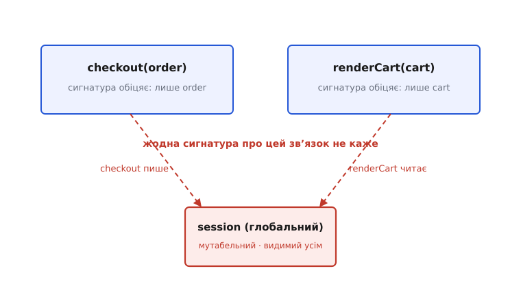

# Глобальний стан

<preknowlist>
- [Чисті функції і побічні ефекти](root:sf-apps/pure-functions-side-effects) — функція, чий результат залежить лише від аргументів і нічого зовні не чіпає; глобальний стан — це прихований вхід і прихований вихід, які цю чистоту ламають.
- [Зчеплення і зв'язність](root:sf-apps/coupling-cohesion) — скільки модуль знає про сусідів і від них залежить; глобальний стан — найпідступніший вид зчеплення, коли двоє спілкуються через спільну змінну.
- [Інкапсуляція](root:sf-apps/encapsulation) — ховати стан за інтерфейсом, щоб ним не можна було крутити ззовні; глобальний стан — рівно протилежне: стан навстіж, доступний кому завгодно.
</preknowlist>

Ось функція, яка бреше про себе — і бреше так тихо, що півроку ніхто не помічає:

:::tabs
```python
def final_price(order):
    return order.subtotal * (1 + TAX_RATE)   # TAX_RATE — звідкись іззовні
```
```ts
function finalPrice(order: Order): number {
  return order.subtotal * (1 + TAX_RATE);    // TAX_RATE — звідкись іззовні
}
```
:::

Сигнатура обіцяє чесну угоду: даси замовлення — отримаєш ціну, і нічого більше тут не діється. Але всередині причаївся `TAX_RATE` — змінна, оголошена десь на рівні модуля, доступна всій програмі й будь-ким змінна. Тепер **те саме замовлення може дати дві різні ціни** — залежно від того, чи хтось у зовсім іншому кінці коду не крутнув цю ставку між двома викликами. Справжні входи функції — це `order` **і** `TAX_RATE`, але у сигнатурі записано лише перший. Другий вхід невидимий, і саме в цьому вся хвороба, стиснута до одного рядка.

## Що тут «стан», а що «глобальне»

Розберімо слово надвоє, бо небезпечна не кожна половина, а тільки їхнє поєднання.

**Стан (від лат. *status* — становище)** — це дані, що **змінюються з часом**: лічильник відвіданих сторінок, вміст кошика, відкрите з'єднання з базою, поточний користувач. Стан сам собою не гріх — без нього програма не пам'ятала б нічого між двома рядками. Локальна змінна в функції теж стан, і з нею все гаразд: вона народжується на вході й помирає на виході, її не бачить ніхто ззовні.

**Глобальне (від лат. *globus* — куля; тут — «те, що охоплює всю програму»)** означає **досяжне звідусіль**: будь-який шматок коду може дотягтися до цього імені, прочитати його й переписати. Глобальна константа теж не гріх: якщо значення застигло раз і назавжди, то «всі його бачать» — це просто зручність, ніхто ним не зловживе.

Біда народжується, коли **обидві властивості сходяться в одному місці**: стан, який і **спільний** (видимий усій програмі), і **мутабельний** (англ. *mutable* — той, що змінюється). Тоді будь-хто, будь-коли, з будь-якого місця може мовчки змінити те, на що спирається хтось інший. Ось карта, де точно лежить небезпека:


*Небезпечна рівно одна клітина з чотирьох. Локальний стан — безпечний, хай навіть мутабельний. Спільне, але незмінне (прочитаний раз конфіг) — здебільшого безпечне. Отруйне лише перетинання: спільний І мутабельний водночас. Уся дисципліна довкола глобального стану — це способи вибратися з червоної клітини в одну із зелених.*

## Чому це болить: чотири наслідки одного кореня

Усі біди глобального мутабельного стану ростуть з одного кореня — **невидимого зв'язку між далекими місцями**. Пройдімо ланцюжок наслідків, бо кожен випливає з попереднього.

**Перше: функція перестає бути передбачуваною.** Коли результат залежить від чогось, чого немає в аргументах, зникає найцінніша властивість коду — можливість зрозуміти функцію, дивлячись **лише на функцію**. `final_price(order)` більше не має однозначної відповіді: щоб знати, що вона поверне, треба знати ще й невидимий стан світу цієї миті. Це прямий злам того, що у [чистих функціях](root:sf-apps/pure-functions-side-effects) звуть посилальною прозорістю: виклик уже не можна замінити його результатом, бо результат «пливе». Глобальний стан — це прихований **вхід** (функція таємно читає світ) і водночас прихований **вихід** (функція таємно світ переписує).

**Друге: народжується зчеплення, якого не видно.** Два модулі, що читають і пишуть один глобал, стають зв'язаними, хоч жоден про одного не згадує у своєму інтерфейсі. У [драбині зчеплення](root:sf-apps/coupling-cohesion) це має точне ім'я — **спільне зчеплення (common coupling)**, один із найтісніших і найпідступніших видів: спілкування через спільну глобальну змінну, яку будь-хто може мовчки перекрутити. Ось як це виглядає — дві функції з бездоганно чистими сигнатурами, таємно з'єднані спільним станом:



*Обидві сигнатури обіцяють незалежність — одна працює з `order`, друга з `cart`. Але через глобальний `session` вони зв'язані намертво: змінив його у `checkout` — і `renderCart` мовчки побачив інше. Це «дія на відстані»: причина в одному кінці програми, а збій вилазить зовсім в іншому, і нитку між ними в коді не видно.*

> 🔧 **Навіщо це.** Саме ця невидимість робить баги глобального стану найдорожчими у відлагодженні. Коли `renderCart` показує дурницю, ти читаєш `renderCart`, читаєш `cart` — усе правильно. Годину згодом з'ясовується, що винен `checkout`, який о іншій порі змінив `session`. Зв'язку між ними немає ні в сигнатурах, ні в типах, ні в жодному `import` — тільки в голові того, хто пам'ятає всю систему. А тримати всю систему в голові не може ніхто.

**Третє: тести перестають бути незалежними.** Тест хоче поставити систему в відомий стан, поштовхати її й перевірити результат — і зробити це в **ізоляції**, не заважаючи іншим тестам. Глобальний мутабельний стан цю ізоляцію вбиває: один тест підкрутив глобал і не прибрав — наступний дістав його брудним і впав, хоча код правильний. Тести починають залежати від **порядку запуску**, з'являється «мерехтіння» (англ. *flaky tests*) — то проходить, то ні. Тому серед [тактик тестовності](root:sf-apps/testability-tactics) прибирання глобального стану стоїть одним із перших кроків: код без спільного мутабельного стану тестується сам собою, без ритуалів «зберегти-відновити глобал» довкола кожної перевірки.

**Четверте, найгрубше: у кількох потоках це вже не баг, а гонка.** Поки програма однопотокова, безлад зі спільним станом хоч детермінований. Щойно два потоки читають і пишуть той самий глобал без узгодження — маєш **гонку даних (data race)**: результат залежить від того, чий доступ переміг цієї мілісекунди, і відтворити його неможливо. Класичний `counter += 1` із двох потоків губить інкременти, бо це насправді три кроки — прочитати, додати, записати, — і вони переплітаються. Механіка гонок і способи їх приборкати — окрема тема про [атомарність і гонки](root:sf-tasks/atomicity-races); тут досить бачити причину: спільний мутабельний стан — це і є те паливо, на якому гонки горять. Прибери спільність — і гонці нема на чому спалахнути.

## Не кожен глобал — ворог

Було б помилкою після цього оголосити хрестовий похід проти всього, що видно з двох місць. Придивімося до зелених клітин квадранта — там живе цілком законний спільний стан, і розуміти, **чому** він законний, важливіше за будь-яку заборону.

Найчистіший випадок — **незмінний спільний стан**. Прочитана раз [конфігурація](root:sf-apps/config-design) — адреса бази, ліміти, ключі — доступна всій програмі, і це нормально саме тому, що після старту її **ніхто не міняє**. Небезпеку знімає не приховування, а [незмінність (immutability)](root:sf-apps/immutability): якщо значення застигло, «спільне» перестає означати «хтось перекрутить у мене за спиною». Читати можуть усі — писати не може ніхто, тож і дії на відстані немає. Це головний важіль виходу з червоної клітини: **не можеш прибрати спільність — прибери мутабельність**.

Є й другий законний випадок, прагматичний — по-справжньому загальні, [наскрізні служби](root:sf-apps/cross-cutting-concerns): логер, лічильники метрик, джерело часу. Тягнути логер через двадцять шарів параметрів заради одного рядка «залогуй» — ліки, гірші за хворобу. Тому такі служби часто лишають доступними «звідусіль» свідомо — але за умов, що знешкоджують більшість шкоди: вони або незмінні після налаштування, або пишуть у місце, де перемежування не отруює логіку (лог-рядок ліг не в тому порядку — прикро, але розрахунок оплат від цього не зламається). Ключове слово тут — **свідомо**: це зважений виняток із чіткою причиною, а не «та хай буде глобальним, так швидше».

## Глобальний стан у чужому костюмі

Найчастіше глобальний стан не оголошують чесно словом `global` — він приходить перевдягнений, і впізнати його треба саме за поведінкою, а не за формою.

Найпоширеніший костюм — **сінглтон (англ. *singleton* — «єдиний примірник»)**. Клас, що гарантує рівно один свій екземпляр і роздає його через `Instance()`, виглядає солідно й об'єктно — але якщо всередині нього живе мутабельний стан, це **та сама глобальна змінна, лише в костюмі класу**: досяжна звідусіль, змінна ким завгодно, невидима в сигнатурах. Усі чотири болі повертаються один в один. [Сінглтон](root:sf-apps/singleton) має вужчі законні застосування (передусім там, де стан незмінний або доступ і справді мусить бути один), але за замовчуванням його варто читати як «глобальний стан, що прикинувся патерном».

Другий костюм тонший — **локатор служб (service locator)**: спільний реєстр, з якого код на вимогу дістає потрібні залежності, `locator.get(Database)`. Формою це ніби «правильно, ми ж не створюємо базу власноруч». Але суттю [локатор служб](root:sf-apps/service-locator) — знову глобальна точка, з якої тягнуть стан, і залежності знову ховаються: у сигнатурі написано `locator`, а що функція насправді звідти дістане — невідомо, доки не прочитаєш тіло. Костюм інший — хвороба та сама.

Сюди ж — мутабельні поля рівня модуля, статичні змінні класу з даними, кеш «щоб було під рукою», у який пишуть звідусіль. Спільний тест простий: **чи можу я змінити цю річ з одного місця так, що це відчує зовсім інше, яке про мене й не згадувало?** Якщо так — перед тобою глобальний стан, хоч би як він називався.

## Ліки: зробити невидиму нитку видимою

Позаяк корінь усіх бід — прихованість зв'язку, то й лікування одне: **витягти залежність із тіні на світло, у сигнатуру**. Замість того щоб функція сама тяглася в глобал, стан **передають їй** явним параметром чи через конструктор. Цей прийом зветься [впровадженням залежностей](root:sf-apps/dependency-inversion) (dependency injection): не «модуль дістає, що йому треба, зі спільного місця», а «той, хто модуль створює, вкладає йому потрібне в руки».

Порівняй два світи. Ліворуч кожен модуль лізе в один глобал; праворуч одна точка створює залежність і роздає її вниз:


*Ліворуч залежність від `Db` невидима: вона ніде не оголошена, кожен просто «знає», що глобал є. Праворуч та сама залежність стала явною — вона в сигнатурі кожного модуля, її видно з першого погляду, і в тест можна підставити підробку. Місце, де залежності створюють раз і збирають докупи, звуть [коренем композиції](root:sf-apps/di-container) (composition root).*

Ось той самий поворот у коді. Було — модуль тягне глобальні налаштування прямо зсередини:

:::tabs
```python
# settings живе на рівні модуля — глобальний мутабельний словник
settings = {"fee_rate": 0.0}

def charge(order):
    return order.total * settings["fee_rate"]   # прихований вхід
```
```ts
// settings живе на рівні модуля — глобальний мутабельний обʼєкт
export const settings = { feeRate: 0 };

export function charge(order: Order): number {
  return order.total * settings.feeRate;        // прихований вхід
}
```
:::

Щоб це протестувати, доводиться перед кожним тестом лізти в глобал `settings`, ставити `fee_rate`, а після — не забути повернути, інакше отруїш сусідній тест. Тепер передамо залежність усередину — і глобал зникає:

:::tabs
```python
class Billing:
    def __init__(self, fee_rate):      # залежність — у конструкторі, на видноті
        self._fee_rate = fee_rate

    def charge(self, order):
        return order.total * self._fee_rate

# тест тривіальний і повністю ізольований:
assert Billing(fee_rate=0.02).charge(order) == expected
```
```ts
class Billing {
  constructor(private readonly feeRate: number) {}   // залежність на видноті

  charge(order: Order): number {
    return order.total * this.feeRate;
  }
}

// тест тривіальний і повністю ізольований:
expect(new Billing(0.02).charge(order)).toBe(expected);
```
:::

Зверни увагу, що саме змінилося. Тіло `charge` майже те саме — але тепер `Billing` **чесно каже**, що йому потрібна ставка, і кожен тест дає свою, не чіпаючи нічого спільного. Ставку створюють і задають один раз — у корені композиції, — а далі вона незмінно живе всередині свого власника. Червона клітина квадранта зникла: стан більше не спільний-і-мутабельний, він або переданий, або незмінний.

> 🔧 **Навіщо це.** Це не академічна охайність, а прямий виграш у трьох валютах щодня. Читабельність: сигнатура тепер не бреше — видно, від чого функція залежить, без стрибка в тіло. Тестовність: підстановка підробки стає безкоштовною, тести не воюють за спільний глобал. Безпека в потоках: коли стан не спільний, більшість гонок просто нема де виникнути. Три різні болі, а ліки одні — витягнути залежність у сигнатуру.

Є й додатковий, глибший хід — не лише зробити стан видимим, а **зібрати його весь на одному краю** системи. Виштовхни мутабельний стан і роботу зі світом (база, мережа, годинник) в тонку зовнішню оболонку, а серцевину лиши чистою — це підхід [функціонального ядра й імперативної оболонки](root:sf-apps/functional-core-imperative-shell). Тоді більша частина коду взагалі не має стану, який можна перекрутити, а весь спільний стан живе в одному малому, оглядному місці, де за ним легко стежити.

## Звідки це все взялося

Варто знати, що глобальний стан не «поганий винахід» — колись він був **нормою за замовчуванням**. У ранньому FORTRAN (кінець 1950-х) підпрограми обмінювалися даними через спільні ділянки пам'яті — блоки `COMMON`, тобто буквально глобальне сховище, видиме всім. Локальна змінна, замкнена у своєму блоці, з'явилася як окрема ідея аж у мові ALGOL 60 (1960) з її блоковою будовою й лексичною областю видимості. Тобто спершу все було спільним, і лише поступово прийшло розуміння, що обмежувати видимість — цінно.

Переломним був короткий і гострий текст 1973 року: [Вільям Вулф і Мері Шоу назвали глобальну змінну «кандидатом на скасування»](root:sf-apps/global-state/hist-globals-lineage.md) і влучно охрестили її **«варіантом go to для даних»** — так само, як безладний стрибок `go to` заплутує потік керування, глобальний стан заплутує потік даних. Ця лінія — від глобального-за-замовчуванням до дисципліни видимості й далі до впровадження залежностей — і пояснює, чому сьогодні спільний мутабельний стан читають як запах, а не як зручність. Повний родовід із іменами, датами й тим, як сінглтон-манія 2000-х дала маятнику зворотний хід, — в окремому нарисі історії.

Хто хоче побачити лікування на живому, заплутаному прикладі — покроковий розбір, як витягти застосунок із павутини глобалів (конфіг, годинник, логер, лічильник), заводячи шов за швом і роблячи неможливі раніше тести можливими, — винесено в окремий [проєкт-рефакторинг](root:sf-apps/global-state/proj-untangle-globals.md).

## Правило, яке лишається

Глобальний стан звабливий тим, що дає миттєву дешевину: не треба нічого нікуди передавати — оголосив, і всі бачать. Ця дешевина справжня рівно доти, доки програма мала й однопотокова та живе в одній голові. Щойно вона росте, дешевина обертається боргом із процентами: невидимі зв'язки, баги на відстані, тести, що воюють між собою, гонки, які неможливо відтворити.

Тож дефолт простий і його варто тримати твердо: **за замовчуванням — жодного спільного мутабельного стану**. Стан, який мусить жити довго, роби або **незмінним** (тоді «спільний» безпечне), або **переданим** явно тому, хто його потребує (тоді видно, хто від чого залежить). Спільним-і-мутабельним лишай стан лише як свідомий, обґрунтований виняток — і навіть тоді ховай його за вузьким інтерфейсом на одному краю системи, а не розсипай навстіж. А головний вимір правильності перевіряй за сигнатурою: якщо, дивлячись на неї, не видно всього, від чого функція залежить і що вона чіпає, — десь у тіні висить дріт, і рано чи пізно за нього хтось смикне.
