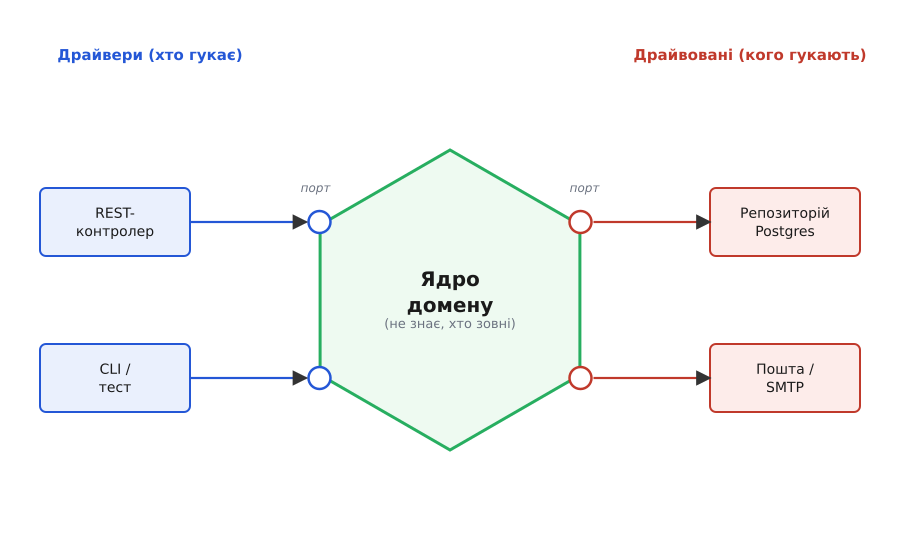
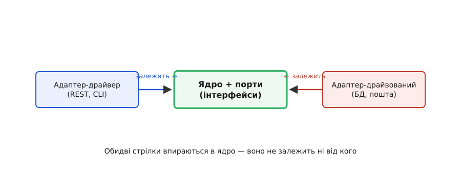

# Порти й адаптери

<preknowlist>
- [Принцип інверсії залежностей (DIP)](root:sf-apps/dependency-inversion) — як розвернути стрілку залежності, поставивши між ядром і деталлю абстракцію; порти й адаптери — той самий розворот, піднятий на рівень цілого застосунку.
- [Інтерфейс проти реалізації](root:sf-apps/interface-vs-implementation) — поділ на те, ЩО модуль обіцяє зовні, і ЯК він це робить усередині; порт — це чистий інтерфейс, адаптер — його реалізація.
- [Зчеплення і зв'язність](root:sf-apps/coupling-cohesion) — дві мірки залежності модулів; уся ця форма існує заради того, щоб зчеплення ядра із зовнішнім світом упало до нуля.
</preknowlist>

Уяви застосунок, який рахує замовлення. У ньому є щось справді цінне — правила: коли замовлення можна оформити, як порахувати знижку, що робити, якщо товар скінчився. Заради цих правил програму й писали. А довкола них наросло все інше: HTTP-обробник, який приймає запит; база даних, яка зберігає результат; поштовий сервіс, який шле лист покупцю; черга, яка складає події. Придивись, і побачиш дві геть різні речі під одним дахом. Правила — **тривкі**: вони переживуть десяток технологій. Усе довкола — **скороминуще**: базу колись поміняють, HTTP стане gRPC, пошта переїде до іншого провайдера.

Найпоширеніша біда полягає в тому, що ці дві речі змішуються в одному місиві. Правило рахувати знижку сидить у методі HTTP-контролера, поряд із розбором JSON. Логіка «чи можна оформити» гукає базу прямо посеред себе. І ось наслідок: цінне, довговічне тепер **не можна ні зрозуміти, ні перевірити, ні зрушити** без усього скороминущого. Щоб перевірити правило знижки, треба підняти веб-сервер і базу. Щоб поміняти базу, треба лізти туди, де живе бізнес-логіка. Важливе стало заручником дрібного — та сама тиха біда, яку лікує [принцип інверсії залежностей](root:sf-apps/dependency-inversion), тільки тут вона розлита по всьому застосунку, а не між двома класами.

Порти й адаптери (англ. *ports and adapters*) — це відповідь на неї в масштабі всієї програми. Ідея одним реченням: **обвести правила чіткою межею, а весь зовнішній світ тримати зовні, спілкуючись із ним лише через отвори в цій межі**. Отвір — це **порт**. Штука, що затикає отвір зовні й перекладає мову світу на мову ядра, — це **адаптер**.

## Звідки шестикутник

Автор цієї форми — Алістер Кокберн (Alistair Cockburn), і назву «шестикутна архітектура» (*hexagonal architecture*) він дав їй за малюнком: ядро малюють шестикутником. Тут ховається перша й найголовніша пастка розуміння, тож розберімо її одразу. **Число шість не значить нічого.** У ядра не шість шарів, не шість типів чогось. Кокберн узяв шестикутник просто тому, що на його гранях зручно малювати кілька портів окремо один від одного — на прямокутнику є лише «верх, низ, ліво, право», а на шестикутнику граней більше, є де розставити отвори, не збиваючи їх докупи. Форма — суто зображальна зручність. Саме тому пізніше він дав патернові другу, точнішу назву — **порти й адаптери**, — і вона краща, бо каже про суть, а не про кількість сторін. [Історія цієї подвійної назви](root:sf-apps/hexagonal-architecture/hist-cockburn-naming.md) сама по собі повчальна: вона показує, як влучне ім'я рятує ідею від хибного тлумачення.

Свій задум Кокберн сформулював у 2005 році одним точним реченням, і його варто прочитати повільно: дозволити застосунку **однаково працювати** від людей, від інших програм, від автотестів чи пакетних скриптів — **і розробляти й перевіряти його ізольовано** від пристроїв та баз, на яких він колись працюватиме. Тут уся мета. Байдуже, хто стукає в програму — жива людина через браузер чи тест через виклик функції; і байдуже, куди вона потім складає дані — у Postgres чи в масив у пам'яті. Ядро в обох випадках те саме й не помічає різниці.

> 🔧 **Навіщо це.** Найдорожче, що дає ця форма, — **швидкі чесні тести й свобода міняти інфраструктуру**. Поки правило замовлення гукає лише порт `Замовлення_сховище`, у тесті на місце бази стає крихітна підробка в пам'яті — і правило перевіряється за мілісекунди, без сервера, мережі й прихованого стану. У проді туди ж стає реалізація на Postgres. Захотіли перевести з Postgres на іншу базу — пишеться новий адаптер збоку, а ядро не чіпаємо: воно й не знало слова «Postgres». Одна межа з отворами купує і швидкі тести, і замінність усього зовнішнього.

## Дві сторони світу: хто гукає і кого гукають

Щойно ми обвели ядро межею, зовнішній світ природно розпадається надвоє — і ця різниця важливіша, ніж здається. З одного боку стоять ті, хто **гукає** застосунок: браузер шле HTTP-запит, користувач набирає команду в терміналі, тест викликає функцію. З іншого — ті, кого **гукає сам застосунок**, щоб зробити свою роботу: база даних, поштовий сервер, чужий API. Перших звуть **драйверами** (англ. *driving*, «ті, що ведуть») — вони заводять програму в дію ззовні. Других — **драйвованими** (*driven*, «ведені») — їх веде вже сама програма.

Різниця не косметична: у цих двох боків **протилежний напрямок керування**. Драйвер тримає ініціативу — це він вирішує, коли покликати ядро. Ядро тут пасивне, воно чекає, поки його гукнуть. А з драйвованим боком навпаки: ініціативу тримає ядро, воно вирішує, коли звернутися до бази чи пошти. Тому й порти цих двох боків різні на вигляд. **Вхідний порт** (з боку драйверів) — це інтерфейс, який ядро **пропонує** світу: «ось що зі мною можна робити — оформити замовлення, скасувати, порахувати». **Вихідний порт** (з боку драйвованих) — це інтерфейс, який ядро **вимагає** від світу: «щоб я працювало, мені потрібен хтось, хто вміє зберегти замовлення й надіслати лист».



*Драйвери ліворуч заводять ядро в дію — стрілка входить у порт. Драйвовані праворуч самі гукаються ядром — стрілка виходить із порту до них. Порти (кружки на межі) — це отвори, через які тільки й можна дістатися ядра.*

Ось чому «порт»: назва взята з електроніки й зі світу пристроїв — це роз'єм із чіткою формою. USB-порт не знає, що ти в нього встромиш: флешку, мишку, зарядку. Він визначає лише **форму контакту** — обіцянку, якої мусить дотриматися будь-хто, хто хоче під'єднатися. Так само програмний порт визначає лише набір операцій та їхні типи, і йому байдуже, хто по той бік. А **адаптер** (англ. *adapter*, «пристосовувач») — це перехідник, який приводить конкретну зовнішню річ до форми порту. Перехідник USB-на-Ethernet не міняє ні USB, ні Ethernet — він тлумачить одне в інше. Так само адаптер бази перекладає обіцянку «зберегти замовлення» на конкретні SQL-запити, а адаптер HTTP перекладає сирий запит браузера на виклик вхідного порту. Це рідний брат [патерна «Адаптер»](root:sf-apps/adapter) з каталогу об'єктного дизайну — тільки тут його піднято з рівня одного класу до рівня межі цілого застосунку.

## Куди дивляться стрілки — і чому ядро вільне

Тепер найтонше місце, серце всієї конструкції. Питання: **хто від кого залежить** у коді? Здавалося б, ядро гукає базу — отже, ядро залежить від бази. Але вся хитрість у тім, щоб цього **не сталося**. Порт живе **всередині** ядра — це його власний інтерфейс, писаний його мовою. А адаптер живе **зовні** й той інтерфейс **реалізує**. Тому стрілка залежності від адаптера йде **всередину, до порту**, а не навпаки. Ядро не згадує жоден адаптер на ім'я — ні той, що його гукає, ні той, кого гукає воно. Обидва боки залежать від ядра; ядро не залежить ні від кого.



*Хоч керування тече в різні боки, стрілки залежності в коді сходяться в одній точці — на ядрі з його портами. Адаптери знають про ядро; ядро про адаптери — ні.*

Це і є [принцип інверсії залежностей](root:sf-apps/dependency-inversion), доведений до масштабу застосунку. З драйвованим боком він працює просто й прямо: ядро оголошує вихідний порт `Замовлення_сховище`, адаптер на Postgres його реалізує, стрілка йде вгору до порту — точно як розворот стрілки між двома класами, тільки тут «клас» виріс до цілого домену. З драйвованим боком тонкість у тім, що абстракцію **пише той, хто нею користується**: не база нав'язує ядру свій інтерфейс, а ядро диктує базі форму, у яку та мусить влізти.

А от вхідний бік влаштований дзеркально, і тут легко заплутатися. Драйвер (HTTP-контролер) — це той, хто гукає; ядро — те, кого гукають. Отже, залежить **контролер від ядра**: він знає ім'я вхідного порту й викликає його. Ядро ж про контролер не чуло. Тому інверсію на вхідному боці **не треба спеціально влаштовувати** — вона стається сама собою: контролер природно вгорі й дивиться вниз, на порт застосунку. Порти й адаптери просто узаконюють це, вимагаючи, щоб контролер бив **тільки** у вхідний порт, а не ліз у нутрощі ядра повз нього.

Підсумок картинки: **керування** тече крізь ядро наскрізь (драйвер → ядро → драйвований), а **залежність** з обох боків тисне до центру. Саме це роз'єднання двох напрямків і робить ядро вільним.

## Як це виглядає в коді

Візьмімо той самий застосунок замовлень і виріжемо один тонкий шматок: оформити замовлення. Спершу ядро оголошує свої **порти** — те, що пропонує світу (вхідний), і те, що вимагає від світу (вихідний). Обидва — чисті інтерфейси, писані мовою домену, без жодного натяку на HTTP чи SQL:

:::tabs
```ts
// ── ПОРТИ (живуть усередині ядра) ──
// Вхідний порт: що ядро ПРОПОНУЄ світу
interface ОформленняЗамовлення {
  оформити(товари: Позиція[], пошта: string): Promise<Замовлення>;
}

// Вихідний порт: що ядро ВИМАГАЄ від світу (мовою домену, не SQL)
interface ЗамовленняСховище {
  зберегти(з: Замовлення): Promise<void>;
}
interface Сповіщувач {
  надіслатиПідтвердження(з: Замовлення): Promise<void>;
}
```
```python
from abc import ABC, abstractmethod

# ── ПОРТИ (живуть усередині ядра) ──
# Вхідний порт: що ядро ПРОПОНУЄ світу
class ОформленняЗамовлення(ABC):
    @abstractmethod
    async def оформити(self, товари: list[Позиція], пошта: str) -> Замовлення: ...

# Вихідний порт: що ядро ВИМАГАЄ від світу (мовою домену, не SQL)
class ЗамовленняСховище(ABC):
    @abstractmethod
    async def зберегти(self, з: Замовлення) -> None: ...

class Сповіщувач(ABC):
    @abstractmethod
    async def надіслати_підтвердження(self, з: Замовлення) -> None: ...
```
```go
// ── ПОРТИ (живуть усередині ядра) ──

// Вхідний порт: що ядро ПРОПОНУЄ світу
type ОформленняЗамовлення interface {
    Оформити(товари []Позиція, пошта string) (Замовлення, error)
}

// Вихідні порти: що ядро ВИМАГАЄ від світу (мовою домену, не SQL)
type ЗамовленняСховище interface {
    Зберегти(з Замовлення) error
}
type Сповіщувач interface {
    НадіслатиПідтвердження(з Замовлення) error
}
```
:::

Тепер саме ядро — реалізація вхідного порту. Воно тримає правила й гукає вихідні порти, **не знаючи**, хто за ними стоїть. Жодного слова «Postgres» чи «SMTP» тут нема й бути не може:

:::tabs
```ts
// ── ЯДРО: реалізує вхідний порт, спирається лише на вихідні порти ──
class Замовлення_сервіс implements ОформленняЗамовлення {
  constructor(
    private сховище: ЗамовленняСховище,   // вихідний порт, не база
    private сповіщення: Сповіщувач,        // вихідний порт, не SMTP
  ) {}

  async оформити(товари: Позиція[], пошта: string): Promise<Замовлення> {
    if (товари.length === 0) throw new Error("порожнє замовлення");  // ПРАВИЛО
    const з = Замовлення.створити(товари, пошта);                    // ПРАВИЛО
    await this.сховище.зберегти(з);              // гукає порт, не знає кого
    await this.сповіщення.надіслатиПідтвердження(з);
    return з;
  }
}
```
```python
# ── ЯДРО: реалізує вхідний порт, спирається лише на вихідні порти ──
class Замовлення_сервіс(ОформленняЗамовлення):
    def __init__(self, сховище: ЗамовленняСховище, сповіщення: Сповіщувач):
        self._сховище = сховище        # вихідний порт, не база
        self._сповіщення = сповіщення  # вихідний порт, не SMTP

    async def оформити(self, товари, пошта):
        if not товари:
            raise ValueError("порожнє замовлення")         # ПРАВИЛО
        з = Замовлення.створити(товари, пошта)             # ПРАВИЛО
        await self._сховище.зберегти(з)         # гукає порт, не знає кого
        await self._сповіщення.надіслати_підтвердження(з)
        return з
```
```go
// ── ЯДРО: реалізує вхідний порт, спирається лише на вихідні порти ──
type ЗамовленняСервіс struct {
    сховище   ЗамовленняСховище // вихідний порт, не база
    сповіщення Сповіщувач       // вихідний порт, не SMTP
}

func (s *ЗамовленняСервіс) Оформити(товари []Позиція, пошта string) (Замовлення, error) {
    if len(товари) == 0 {
        return Замовлення{}, errors.New("порожнє замовлення") // ПРАВИЛО
    }
    з := СтворитиЗамовлення(товари, пошта)                    // ПРАВИЛО
    if err := s.сховище.Зберегти(з); err != nil {  // гукає порт, не знає кого
        return Замовлення{}, err
    }
    return з, s.сповіщення.НадіслатиПідтвердження(з)
}
```
:::

Конкретика живе **зовні**, в адаптерах. Драйвований адаптер реалізує вихідний порт — стрілка від нього йде всередину, до `ЗамовленняСховище`:

:::tabs
```ts
// ── ДРАЙВОВАНИЙ АДАПТЕР: реалізує вихідний порт мовою Postgres ──
class PgЗамовленняСховище implements ЗамовленняСховище {
  constructor(private db: PgPool) {}
  async зберегти(з: Замовлення): Promise<void> {
    await this.db.query(                       // ось тут — і тільки тут — SQL
      "INSERT INTO orders(id, email, total) VALUES ($1,$2,$3)",
      [з.id, з.пошта, з.сума()],
    );
  }
}
```
```python
# ── ДРАЙВОВАНИЙ АДАПТЕР: реалізує вихідний порт мовою Postgres ──
class PgЗамовленняСховище(ЗамовленняСховище):
    def __init__(self, pool):
        self._pool = pool
    async def зберегти(self, з: Замовлення) -> None:
        await self._pool.execute(              # ось тут — і тільки тут — SQL
            "INSERT INTO orders(id, email, total) VALUES ($1,$2,$3)",
            з.id, з.пошта, з.сума(),
        )
```
```go
// ── ДРАЙВОВАНИЙ АДАПТЕР: реалізує вихідний порт мовою Postgres ──
type PgЗамовленняСховище struct{ db *pgxpool.Pool }

func (r *PgЗамовленняСховище) Зберегти(з Замовлення) error {
    _, err := r.db.Exec(context.Background(),  // ось тут — і тільки тут — SQL
        "INSERT INTO orders(id, email, total) VALUES ($1,$2,$3)",
        з.ID, з.Пошта, з.Сума())
    return err
}
```
:::

А драйвер-адаптер стоїть із протилежного боку й **гукає** вхідний порт, перекладаючи сирий HTTP на мову домену:

:::tabs
```ts
// ── ДРАЙВЕР-АДАПТЕР: перекладає HTTP на виклик вхідного порту ──
class ЗамовленняHttp {
  constructor(private застосунок: ОформленняЗамовлення) {}  // залежить від ПОРТУ
  async post(req: Request, res: Response) {
    const з = await this.застосунок.оформити(req.body.товари, req.body.пошта);
    res.status(201).json({ id: з.id });   // назад із домену в HTTP
  }
}
```
```python
# ── ДРАЙВЕР-АДАПТЕР: перекладає HTTP на виклик вхідного порту ──
class ЗамовленняHttp:
    def __init__(self, застосунок: ОформленняЗамовлення):  # залежить від ПОРТУ
        self._застосунок = застосунок
    async def post(self, req):
        з = await self._застосунок.оформити(req.json["товари"], req.json["пошта"])
        return {"id": з.id}, 201            # назад із домену в HTTP
```
```go
// ── ДРАЙВЕР-АДАПТЕР: перекладає HTTP на виклик вхідного порту ──
type ЗамовленняHttp struct{ застосунок ОформленняЗамовлення } // залежить від ПОРТУ

func (h *ЗамовленняHttp) Post(w http.ResponseWriter, r *http.Request) {
    var тіло requestBody
    json.NewDecoder(r.Body).Decode(&тіло)
    з, _ := h.застосунок.Оформити(тіло.Товари, тіло.Пошта)
    w.WriteHeader(201)
    json.NewEncoder(w).Encode(map[string]string{"id": з.ID}) // назад у HTTP
}
```
:::

Лишилося одне питання: **хто зшиває** ядро з конкретними адаптерами, якщо саме ядро їх не називає? Не воно — інакше знов би згадало Postgres на ім'я. Це робить **точка збірки** (англ. *composition root*) — єдине місце на самому краю програми, у `main`, де вже все дозволено знати. Там обирають реальні адаптери й подають їх ядру ззовні:

:::tabs
```ts
// ── ТОЧКА ЗБІРКИ: єдине місце, де сходяться всі конкретні імена ──
const db = new PgPool(process.env.DATABASE_URL);
const сервіс = new Замовлення_сервіс(          // ядру подали адаптери ЗВНІ
  new PgЗамовленняСховище(db),
  new SmtpСповіщувач(process.env.SMTP_URL),
);
const http = new ЗамовленняHttp(сервіс);       // а драйверу подали ядро
router.post("/orders", (req, res) => http.post(req, res));
```
```python
# ── ТОЧКА ЗБІРКИ: єдине місце, де сходяться всі конкретні імена ──
db = await create_pool(os.environ["DATABASE_URL"])
сервіс = Замовлення_сервіс(                     # ядру подали адаптери ЗВНІ
    PgЗамовленняСховище(db),
    SmtpСповіщувач(os.environ["SMTP_URL"]),
)
http = ЗамовленняHttp(сервіс)                   # а драйверу подали ядро
app.add_route("/orders", http.post, methods=["POST"])
```
```go
// ── ТОЧКА ЗБІРКИ: єдине місце, де сходяться всі конкретні імена ──
db, _ := pgxpool.New(ctx, os.Getenv("DATABASE_URL"))
сервіс := &ЗамовленняСервіс{                    // ядру подали адаптери ЗВНІ
    сховище:   &PgЗамовленняСховище{db: db},
    сповіщення: &SmtpСповіщувач{url: os.Getenv("SMTP_URL")},
}
http := &ЗамовленняHttp{застосунок: сервіс}     // а драйверу подали ядро
mux.HandleFunc("POST /orders", http.Post)
```
:::

Слово «Postgres» стоїть рівно в одному місці — у точці збірки, найдальшій від правил. Коли таких адаптерів багато й збирати їх руками стає марудно, цю роботу перекладають на [DI-контейнер](root:sf-apps/di-container), але суть від того не міняється: конкретні імена сходяться в одній точці на краю, а не розповзаються по ядру. [Робочий приклад із живою збіркою й перемиканням адаптерів](root:sf-apps/hexagonal-architecture/proj-swap-adapters.md) показує цю саму нарізку цілком — разом із тестом, що підставляє підробки замість бази й пошти.

## Тест — це просто ще один драйвер

Тепер найкраще, заради чого все й затівалося. Придивись до формулювання Кокберна: застосунок має однаково працювати «від людей **або від автотестів**». Тест у цій картині — **не щось окреме**, а звичайний драйвер, рівноправний із HTTP-контролером. Він так само гукає вхідний порт. Різниця лише в тому, що по драйвованому боці йому підсовують не Postgres і не SMTP, а крихітні підробки в пам'яті:

:::tabs
```ts
// Підробки замість бази й пошти — теж просто адаптери, тільки прості
class ПідробнеСховище implements ЗамовленняСховище {
  збережені: Замовлення[] = [];
  async зберегти(з: Замовлення) { this.збережені.push(з); }  // лише запам'ятали
}
class ПідробнеСповіщення implements Сповіщувач {
  async надіслатиПідтвердження(_: Замовлення) {}             // нічого не робимо
}

// Тест ядра — БЕЗ сервера, БЕЗ бази, БЕЗ мережі, за мілісекунди
const сховище = new ПідробнеСховище();
const сервіс = new Замовлення_сервіс(сховище, new ПідробнеСповіщення());
await сервіс.оформити([{ товар: "книга", ціна: 200 }], "a@b.com");
assert(сховище.збережені.length === 1);        // правило спрацювало
```
```python
# Підробки замість бази й пошти — теж просто адаптери, тільки прості
class ПідробнеСховище(ЗамовленняСховище):
    def __init__(self): self.збережені = []
    async def зберегти(self, з): self.збережені.append(з)   # лише запам'ятали

class ПідробнеСповіщення(Сповіщувач):
    async def надіслати_підтвердження(self, з): pass         # нічого не робимо

# Тест ядра — БЕЗ сервера, БЕЗ бази, БЕЗ мережі, за мілісекунди
сховище = ПідробнеСховище()
сервіс = Замовлення_сервіс(сховище, ПідробнеСповіщення())
await сервіс.оформити([{"товар": "книга", "ціна": 200}], "a@b.com")
assert len(сховище.збережені) == 1              # правило спрацювало
```
```go
// Підробки замість бази й пошти — теж просто адаптери, тільки прості
type ПідробнеСховище struct{ Збережені []Замовлення }
func (r *ПідробнеСховище) Зберегти(з Замовлення) error {
    r.Збережені = append(r.Збережені, з); return nil          // лише запам'ятали
}
type ПідробнеСповіщення struct{}
func (ПідробнеСповіщення) НадіслатиПідтвердження(Замовлення) error { return nil }

// Тест ядра — БЕЗ сервера, БЕЗ бази, БЕЗ мережі, за мілісекунди
сховище := &ПідробнеСховище{}
сервіс := &ЗамовленняСервіс{сховище: сховище, сповіщення: ПідробнеСповіщення{}}
сервіс.Оформити([]Позиція{{Товар: "книга", Ціна: 200}}, "a@b.com")
// перевіряємо: len(сховище.Збережені) == 1  — правило спрацювало
```
:::

Зверни увагу, чого тут **нема**: ні піднятого веб-сервера, ні тестової бази, ні очікування мережі, ні очищення стану між тестами. Правило перевіряється голим, як формула. Це не приємний побічний ефект — це **та сама мета**, заради якої ядро й обвели межею. Симетрія повна: HTTP і тест — обидва драйвери, що гукають один вхідний порт; Postgres і підробка — обидва адаптери, що реалізують один вихідний порт. Порт для того й існує, щоб з обох боків на його місце ставало що завгодно, аби воно тримало обіцянку форми.

## Де межа й де пастка

Ця форма коштує грошей, і тому її не тягнуть у кожен застосунок підряд. Кожен порт — це зайвий інтерфейс, який хтось пише, читає й супроводжує; читаючи виклик `сховище.зберегти`, ти вже не бачиш одразу, **що** саме виконається, — треба знати, який адаптер підставили в точці збірки. За розв'язаність платять **простотою й прямотою**. Тому порти й адаптери виправдані там, де є **справжнє, коштовне ядро правил**, яке житиме довго й мінятиметься окремо від інфраструктури, і де ту інфраструктуру реально колись підмінять або треба чесно тестувати без неї. У маленькому CRUD-застосунку, де «бізнес-логіка» — це переписати поле з форми в базу, ця межа лише додасть шарів і не купить нічого: там правила й база **завжди житимуть разом**, розділяти нема чого. Це те саме застереження, що й у [YAGNI](root:sf-apps/dry-kiss-yagni) — не будуй абстракцію під заміну, якої не буде.

Друга пастка тонша й трапляється частіше: **фальшивий порт**, списаний із конкретного адаптера. Ознака — вихідний порт пахне технологією. Якщо в «загальному» `ЗамовленняСховище` стирчать методи `beginTransaction`, `execSql`, `resultSet`, то це не порт над сховищем, а тонка плівка поверх однієї бази: підставити чергу чи файл під такий інтерфейс не вийде, він уже говорить мовою SQL. Порт мусить бути писаний **мовою ядра** — `зберегти(замовлення)`, а не `виконати(запит)`; коли інтерфейс диктує вже реальність по той бік, спорідненою хворобою лікується [антикорупційний шар](root:sf-apps/anti-corruption-layer), що не пускає чужу модель протекти в ядро. Перевірка одна: **чи існує друга, геть інша реалізація**, що чесно тримає ту саму обіцянку? Якщо крім Postgres під цей порт нічого не мислиться — інверсії ще нема, є лише зайвий шар.

Тому й тримаймося того, з чого почали. Порти й адаптери — це не «правильна архітектура на всі випадки», а один точний прийом: **обвести коштовне ядро межею, проколоти в ній отвори-порти мовою самого ядра, а весь скороминущий світ тримати зовні в адаптерах, що ті отвори затикають**. Тоді ядро можна зрозуміти, не читаючи бази; перевірити, не піднімаючи сервера; і зберегти, поки під ним по черзі змінюються три покоління технологій. Форма при цьому рідня [шаровій архітектурі](root:sf-apps/layered-architecture) й [функціональному ядру з імперативною оболонкою](root:sf-apps/functional-core-imperative-shell) — усі троє про одне: тримати важливе окремо від дрібного, — але саме порти й адаптери роблять межу **симетричною**, зрівнявши в правах усіх, хто стукає в програму, і все, до чого стукає вона.
