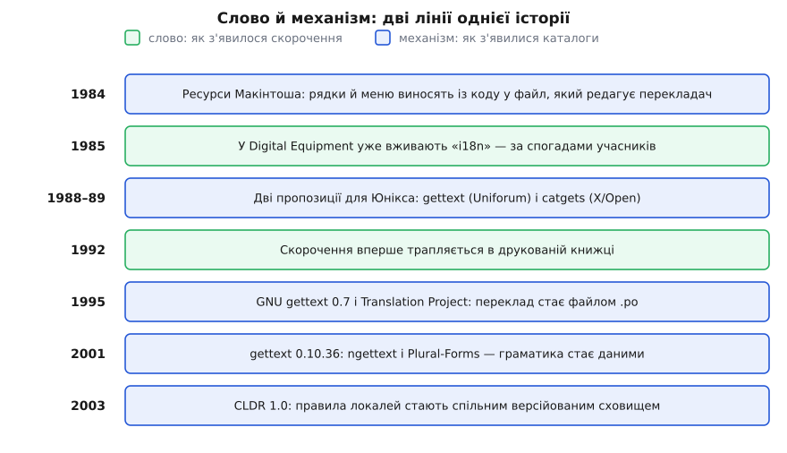

# 📜 S12n: звідки взялися i18n, l10n і перші каталоги перекладів

Скорочення «i18n» вигадали не заради стислості: його зліпили за зразком імені облікового запису, яке адміністратор видав інженерові з задовгим прізвищем. Механізм, що стоїть за цим словом, — каталог перекладів — має власну історію, і в ній найцікавіше запізнення: написи перебралися з коду в дані ще 1984 року, а правила граматики, без яких переклад не працює, — аж 2001-го.

## Прізвище, яке не вміщалося

В американській компанії Digital Equipment Corporation, що робила міні-комп'ютери, працював інженер на прізвище Схерпенгейзен (Jan Scherpenhuizen) — нідерландське за походженням, чотирнадцять літер. Система не приймала імені облікового запису такої довжини (за спогадами колишніх працівників — через обмеження у VMS, операційній системі DEC). Невідомий адміністратор вирішив це найлінивішим способом: лишив першу літеру, останню, а між ними написав, скільки літер випало.

```
Scherpenhuizen  →  S + 12 літер + n  →  S12n
```

Жарт прижився в компанії й перетворився на правило: будь-яке задовге слово можна стиснути тим самим способом. А в DEC саме тоді розросталася команда з дуже довгим словом у назві.

```
internationalization  →  i + 18 літер + n  →  i18n
localization          →  l + 10 літер + n  →  l10n
globalization         →  g + 11 літер + n  →  g11n
```

Таку конструкцію звуть **нумеронімом** (від лат. *numerus* — число і гр. *ónyma* — ім'я). Правило в ній суто механічне, тому воно й розповзлося далеко за межі перекладів: `a11y` — accessibility, `m17n` — multilingualization, `o11y` — observability, `c14n` — canonicalization, `k8s` — Kubernetes. Кожне з цих слів хтось порахував по літерах — так само, як колись порахували прізвище.

## Що з цієї історії справді документоване

Тут варто зупинитися й розмежувати, що́ підтверджено, а що́ переказ. Первинного документа — розпорядження про створення того облікового запису — не показав ніхто. Є інше: у жовтні 2002 року, у відкритому листуванні спільноти Unicode, кілька колишніх працівників DEC незалежно згадали ту саму історію. Джон Макконнелл (John McConnell) підтвердив розповідь Хідекі Хіури (Hideki Hiura) про скорочення прізвища через обмеження VMS; Тімоті Грінвуд (Timothy Greenwood) написав, що пам'ятає «Jan Scherpenhuizen and S12N» зі своїх часів у DEC, і простежив згадки аж до внутрішньої конференції DEC у квітні 1985 року. Консультант Текс Тексін (Tex Texin) зібрав ці свідчення докупи; саме з його добірки походить датування «у DEC уживали i18n щонайпізніше 1985-го». Отже: інженерний переказ, підтверджений кількома незалежними учасниками, але не документ.

Хто саме виніс слово назовні — тим паче спірно. Одна версія приписує це Гері Міллеру (Gary Miller), який нібито першим написав «i18n» на дошці на зустрічі POSIX 1991 року; Хіура заперечив, що команда i18n у DEC уживала скорочення ще з 1985-го, а до 1988-го його підхопила /usr/group — об'єднання користувачів Юнікса, яке згодом перейменувалося на UniForum. Макконнелл підозрював, що рознести слово з DEC у світ міг Еймон Макдермотт (Eamon MacDermott). Жодна з версій не спирається ні на що, крім спогаду.

Цікаво інше — розрив між усним і друкованим ужитком. Онлайн-сліди знаходять уже з 1989 року, а найранішу згадку в друкованій книжці — аж 1992-го (*Soft Landing in Japan*, видання American Electronics Association). Грінвуд додав промовисту деталь: скорочення немає ні в X/Open Internationalisation Guide за липень 1993-го, ні в літньому випуску Digital Technical Journal того ж року, цілком присвяченому інтернаціоналізації продуктів. Тобто років вісім поспіль це було слово для розмови й дошки, але не для документа — типова доля інженерного сленгу: у стандарт він потрапляє останнім, коли опиратися вже нема сенсу.

## Навіщо взагалі знадобилося слово

Скорочують те, що доводиться писати щодня. Двадцятилітерне слово почало з'являтися в кожному службовому листі й кожному порядку денному наприкінці 1970-х і в 1980-х, коли виробники обчислювальної техніки продавали ту саму машину в десятки країн і більше не могли тримати окрему гілку сирців під кожен ринок. З'явилася окрема робота, окремі команди, окремі комітети — і слово, яке цю роботу називає.

Слів, утім, знадобилося два, і саме тому в родині нумеронімів `i18n` і `l10n` стоять поруч. Робота розкололася на дві різні за природою частини, і кожній був потрібен свій ярлик — бо в розмові про графік і бюджет плутати їх було дорого. Далі — історія другої частини: як текст навчилися виносити з програми в дані.


*Слово було в ужитку з 1985-го, а правила множини стали даними лише 2001-го — шістнадцять років між назвою задачі й механізмом, який її розв'язує.*

## Перший каталог, який побачив масовий ринок

Січень 1984-го, Макінтош. Брюс Горн (Bruce Horn) закладає в систему Resource Manager — розпорядника ресурсів, — і файл на цій машині отримує дві частини: гілку даних і **гілку ресурсів**. У гілці ресурсів лежать меню, діалогові вікна, піктограми й списки рядків — кожен ресурс має тип і номер. Програма не носить написів у собі: вона просить «рядок 5 зі списку 128», а що там за текст — питання файлу, а не коду.

Наслідок з'явився негайно, і саме він був метою: текст стало можна міняти без компілятора й без сирців. Для цього зробили окремий редактор ресурсів — REdit, розрахований на людину, яка знає мову, а не програмування. Перекладач відкривав готову програму, правив написи й закривав. Ідея «рядки живуть у даних, код звертається до них за номером» стала промисловою нормою: у Windows це STRINGTABLE у файлі ресурсів і виклик `LoadString`, в AmigaOS — `GetString`.

Разом з ідеєю розійшлася і її вада. Номер нічого не каже про зміст: щоб зрозуміти, що робить `GetIndString(str, 128, 5)`, треба відкрити другий файл. Номери — це реєстр, який веде людина, і людина його плутає. А ще переклад майже завжди довший за оригінал, тому написи розсували діалог — через це координати кнопок теж довелося зробити ресурсами, які перекладач посуває руками.

## Юнікс, 1988–1989: два різні ключі до одного каталогу

Виробникам юніксових систем потрібен був не формат файлу однієї платформи, а переносний програмний інтерфейс. Наприкінці 1980-х постали дві пропозиції, і різнилися вони одним-єдиним рішенням — **що́ править за ключ до каталогу**.

X/Open унормувала `catgets` у своєму Portability Guide Issue 3 (XPG3, 1989). Ключ — номер, точніше пара «номер набору + номер повідомлення». Текстове джерело каталогу компілює утиліта `gencat` у двійковий файл, який програма відкриває на старті; яку саме мовну версію брати, підказує змінна оточення `LANG`.

```c
nl_catd cat = catopen("myapp", 0);
char *s = catgets(cat, 1, 23, "Save");   /* набір 1, повідомлення 23 */
```

Джерело каталогу для `gencat` виглядало так:

```
$set 1
23 Зберегти
```

Останній аргумент `catgets` — запасний рядок, який повернеться, якщо каталогу немає. І тут видно перший біль: оригінал живе у двох місцях одночасно — у виклику й у каталозі, — а синхронізує їх ніхто. Другий біль сильніший: додати повідомлення посеред набору спокусливо через перенумерацію, а перенумерація мовчки прив'язує всі переклади до чужих місць. Помилка не падає, вона просто показує людині не те.

Uniforum запропонувала протилежне: ключем є **сам рядок оригіналу**. Джерела датують цю пропозицію по-різному — 1988-м або 1989-м; Sun реалізувала `gettext` у своєму Юніксі на початку 1990-х, і тут дати теж розходяться (від SunOS 4 близько 1990-го до 1993-го).

```c
char *s = gettext("Save");
```

Каталог тоді — це пари «оригінал → переклад» з посиланням на місце в коді:

```
#: ui/toolbar.c:118
msgid  "Save"
msgstr "Зберегти"
```

З цього одного рішення випливає все інше. Програма без жодного перекладу працює як є — `gettext` повертає власний аргумент, тож англійська збірка ніколи не «порожня». Реєстр номерів зникає: список рядків можна витягти з сирців автоматично (`xgettext`), тому каталог фізично не може розійтися з кодом. Перекладач бачить оригінал поруч із перекладом і рядок файлу, звідки той оригінал узято, — контекст, якого номер не давав ніколи.

Плата за це теж є, і назвати її варто чесно. Змінив в англійському написі одну літеру — і ключ став інший, а всі переклади осиротіли. Відповідь знайшли пізніше: `msgmerge` зіставляє новий оригінал зі старим за схожістю і ставить уцілілому запису позначку `#, fuzzy` — «схоже, це воно, але передивись». Переклад не гине, він переходить у стан «під сумнівом». Друга вада тонша: два однакові англійські рядки в різних місцях зливаються в один ключ, хоча перекладаються по-різному (класичне «Open» як дієслово й як прикметник). Для цього згодом додали контексти — `msgctxt` і виклик `pgettext`.

І одна деталь тієї доби, яку легко проґавити: до Юнікоду каталог був прив'язаний до байтового кодування своєї локалі, тож «додати мову» часом означало «додати ще одне [кодування](topic:sf-data/ascii-utf8)», а не лише ще один файл.

> 🔧 **Навіщо це.** Розвилка 1988-го проти 1989-го нікуди не зникла — її проходить кожна бібліотека перекладу й сьогодні. Символьний ключ (`toolbar.save`) не ламається від правки оригіналу й дозволяє два різні переклади для однакових слів, але порожній каталог дає порожній екран, і хтось мусить вести реєстр імен. Ключ-оригінал (`t("Save")`) обходиться без реєстру й завжди має що показати, зате будь-яка правка тексту потребує повторного проходу перекладачів. Вибирають не «краще», а те, чого в проєкті більше: частих правок формулювань чи однакових слів у різних значеннях.

## Як gettext став тим, чим ми його знаємо

Формат сам собою нічого не змінює — треба, щоб хтось розніс його по програмах і щоб знайшлися люди, які перекладають. Обидві частини склалися за один рік.

У липні 1994-го Патрик Д'Круз (Patrick D'Cruze) взявся інтернаціоналізувати GNU fileutils 3.9.2 й запитав супровідника пакета Джима Меєринга (Jim Meyering), як це вбудувати. З цього виріс `glocale` — каркас, задум якого накидав Річард Столмен (Richard Stallman), а доводили Мітчем Д'Суза (Mitchum D'Souza), Роланд Макграт (Roland McGrath), Франсуа Пінар (François Pinard) і Пол Еггерт (Paul Eggert). Після пробних випусків стало ясно, що конструкцію треба перебирати: у квітні 1995-го Ульріх Дреппер (Ulrich Drepper) переписав усе з нуля під назвою GNU gettext, а десь у травні Столмен погодився на заміну `glocale` на `gettext`. Перший офіційний випуск — 0.7, липень 1995-го.

Паралельно склалася друга половина. У червні 1995-го Пінар разом із Грегом Макгері (Greg McGary) написав PO mode для Emacs — режим редагування каталогів, тобто робоче місце саме для перекладача, а не редактор тексту взагалі. А в травні Д'Круз завів двадцять відкритих і два модеровані списки розсилки для перекладачів; з них виріс Translation Project, координатором якого став Пінар.

Оце й був справжній зсув. З'явився постійний загін добровольців по кожній мові, які працюють з одним форматом файлу для всіх програм відразу. Робота супровідника пакета звузилася до двох дій: опублікувати шаблон `.pot` і забрати надіслані `.po`. Нова мова перестала бути подією в житті проєкту — вона просто надходила поштою.

## Граматика стає даними — і це аж 2001-й

Формат `.po` мав `msgid` і `msgstr` — і жодного слова про числа. Тому всю другу половину 1990-х програми робили те саме негарне: писали «1 file(s)» або тримали два окремі повідомлення й вибирали між ними `if`-ом у коді. Тобто англійська граматика лишалася замурованою в коді — рівно те, що скорочення `i18n` обіцяло звідти прибрати.

Розв'язали це на межі тисячоліть. У 2000-му супровід GNU gettext перебрав від Дреппера Бруно Гайбле (Bruno Haible); у березні 2001-го випуск 0.10.36 приніс загальний механізм множини — функції `ngettext`, `dngettext`, `dcngettext` і новий заголовок у самому каталозі:

```c
printf(ngettext("%d file", "%d files", n), n);
```

```
англійська   Plural-Forms: nplurals=2; plural=(n != 1);
японська     Plural-Forms: nplurals=1; plural=0;
українська   Plural-Forms: nplurals=3; plural=(n%10==1 && n%100!=11 ? 0
                         : n%10>=2 && n%10<=4 && (n%100<10 || n%100>=20) ? 1 : 2);
```

Придивімося, що тут насправді сталося. Скільки форм має мова і як за числом вибрати потрібну — це вираз, який лежить **у файлі перекладу**, а не в програмі. Код передає число й два оригінали; обчислює вираз бібліотека під час роботи. Мова тепер приносить із собою власну граматику так само, як приносить власні слова.

Не без вад: цей вираз — маленька мова всередині заголовка, яку кожен перекладач копіював собі руками, і одруківка в ньому не давала жодної помилки — просто інколи виринала не та форма. Але головне вже було зроблено, і головне тут — дата. Від слова 1985-го до правил у даних 2001-го минуло шістнадцять років. Назвати задачу дешево; винести з коду правило, яке ніхто не вважав правилом, — довго.

## Останній крок: правила перестають бути приватною справою проєкту

Вираз `Plural-Forms` жив у кожному проєкті окремо, переписаний з чужого файлу, — а отже, розходився між проєктами й старів. Наступний крок мусив зробити правила спільними, і зробила його інша лінія, що тяглася від текстових бібліотек.

Компанія Taligent — спільне підприємство Apple та IBM — увійшла до складу IBM на початку 1996-го. Sun залучила її групу тексту й інтернаціоналізації, щоб та віддала свої міжнародні класи в JDK 1.1, — і чимала частина того коду й досі живе в пакетах `java.text` та `java.util`. Ті самі класи перенесли на C і C++ — так постала ICU (International Components for Unicode); 1999 року її відкрили як «IBM Classes for Unicode», а в травні 2016-го проєкт увійшов до консорціуму Unicode окремим технічним комітетом.

Дані ж локалей зібрали в окремий репозиторій. CLDR розробляли в робочій групі LADE команди OpenI18N при Free Standards Group; засновниками групи були IBM, Sun і OpenOffice.org. Перший випуск — 19 грудня 2003-го, а версію 1.0 керівний комітет OpenI18N затвердив 16 січня 2004-го; від версії 1.1 сховище перейшло під консорціум Unicode. Серед авторів першої версії — Марк Девіс (Mark Davis), співзасновник консорціуму Unicode, який довго очолював технічний комітет CLDR.

Щоб сховище правил взагалі мало сенс, локаль потрібно було ще й однаково називати. Це владнали окремо: у березні 1995-го Гаральд Альвестранн (Harald Tveit Alvestrand) з норвезької мережі UNINETT випустив RFC 1766 «Tags for the Identification of Languages» — основна частина мітки береться з ISO 639, друга дволітерна частина тлумачиться як код країни за ISO 3166, довші коди реєструються в IANA. Звідси всі знайомі `en-US` та `uk-UA`. Пізніше документ заступили RFC 3066, а далі — родина специфікацій BCP 47.

Після цього правила локалі перестали бути тим, що кожна програма винаходить сама. Формати дат, роздільники, порядок сортування й ті самі мітки форм множини лежать у версійованому наборі даних, з якого їх тягнуть і ICU в Java та C++, і вбудований `Intl` у браузерах. Каталоги ресурсів 1984-го виносили з коду написи; шлях завершився тим, що з коду вийшли й самі правила мови.
