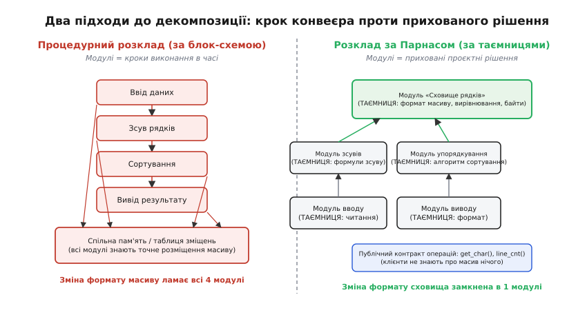
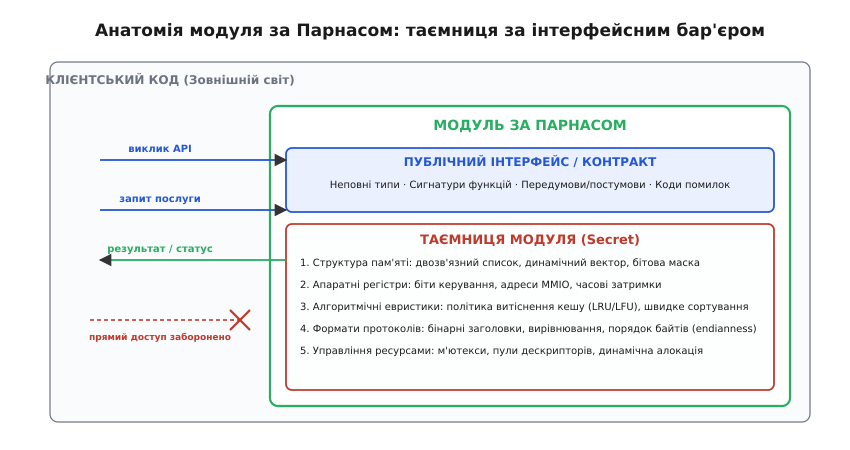
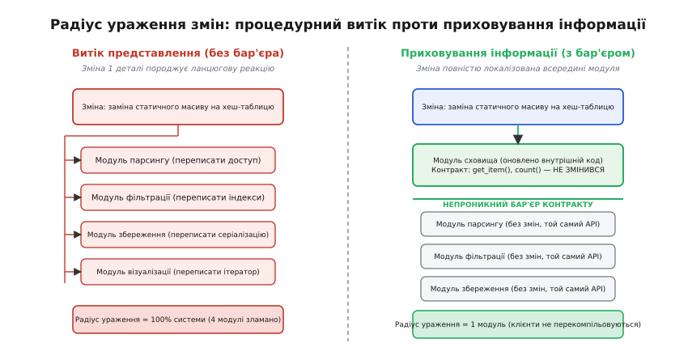
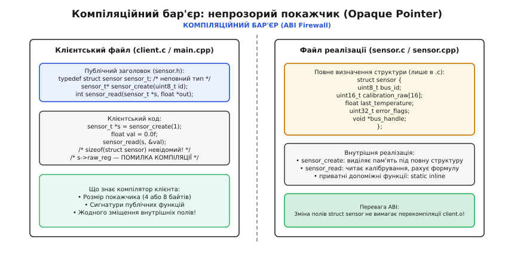

# Приховування інформації за Парнасом — детально

<preknowlist>
- [Інкапсуляція](topic:sf-apps/encapsulation) — замикання стану об'єкта та розмежування публічного й приватного.
- [Зчеплення і зв'язність](topic:sf-apps/coupling-cohesion) — ступінь залежності модулів між собою та фокус обов'язків усередині.
- [Проєктування за контрактом](topic:sf-release/design-by-contract) — передумови, постумови та інваріанти на межах викликів.
- [Assert і паніка](topic:sf-apps/assert-panic) — перевірка незмінних умов у точках межі.
</preknowlist>

Коли програма доростає до розміру в кілька десятків тисяч рядків, жоден інженер більше не може тримати в пам'яті всі її взаємозв'язки. Систему неминуче доводиться розрізати на окремі частини — модулі. Найприродніший спосіб такого поділу, який першим спадає на думку кожному розробнику, — це поділ за кроками виконання в часі: спершу модуль вводу зчитує байти з порту, потім модуль парсингу перетворює їх на структуру, потім модуль обробки рахує бізнес-логіку, а модуль виводу надсилає результат у мережу. 

Цей інтуїтивний підхід, запозичений із класичних виробничих конвеєрів та блок-схем, несе в собі приховану архітектурну міну. Щоб модулі конвеєра передавали дані один одному, розробники виносять структури даних у спільну пам'ять або спільні заголовні файли. У результаті інформація про те, як саме розміщені байти в буфері, які прапорці використовуються для статусу та які алгоритми індексації обрані, стає відомою кожному кроку програми.

У день, коли виникає потреба змінити одну деталь — замінити статичний масив динамічним списком, оновити регістрову карту мікроконтролера або змінити формат бінарного пакета, — стається катастрофа: правка одного рішення змушує переписувати всі модулі системи одночасно. Системи, спроєктовані за кроками роботи, виявляються крихкими, бо вони не ховають ухвалених інженерних рішень, а виставляють їх назовні.

---

## Критерій Парнаса: модуль як капсула для таємниці

Людиною, яка розкрила справжню причину цієї крихкості та запропонувала фундаментальний критерій декомпозиції, був канадський дослідник Девід Лорж Парнас (англ. *David Lorge Parnas*). У грудні 1972 року в журналі *Communications of the ACM* вийшла його стаття «On the Criteria To Be Used in Decomposing Systems into Modules» («Про критерії, якими слід керуватися, розкладаючи системи на модулі»), яка назавжди змінила інженерне мислення в розробці програмного забезпечення.

Головна теза Парнаса звучала радикально: починати декомпозицію системи з блок-схеми потоку даних (англ. *flowchart*) майже завжди хибно. Блок-схема показує, що робиться спочатку, а що потім у процесі виконання, але вона нічого не знає про те, які частини системи будуть змінюватися у часі під час розробки та супроводу.

Парнас запропонував принципово інший порядок мислення:
1. Перед тим як написати перший рядок коду, інженер складає список **важких проєктних рішень** (рішень, де легко помилитися або де вибір неочевидний) та рішень, які **з найбільшою ймовірністю зміняться** протягом життєвого циклу продукту.
2. Кожен модуль у системі створюється для того, щоб узяти рівно одне таке рішення, замкнути його всередині себе та зробити **абсолютно невидимим** (прихованим) для всіх інших частин програми.
3. Назовні модуль виставляє лише вузький інтерфейс операцій (контракт), який описує *що* модуль робить, але жодним словом не виказує, *як саме* він це реалізує.

```
Класичний підхід:    Задача → Кроки конвеєра (блок-схема) → Спільні структури даних
Критерій Парнаса:    Задача → Список рішень, що зміняться → Модулі, що ховають рішення
```

Саме слово *hides* («приховує») дало назву цій архітектурній парадигмі — **приховування інформації** (англ. *information hiding*). Докладний розбір історичного контексту появи статті та її зіставлення з концепцією об'єктів Smalltalk наведено у вставці [Дві нитки, що зійшлися: як народилося приховування інформації](topic:sf-apps/encapsulation/hist-information-hiding.md).


*Два підходи до декомпозиції тієї самої задачі. Ліворуч система розрізана на фази конвеєра: усі кроки прив'язані до спільної пам'яті, тому заміна структури масиву руйнує всі модулі. Праворуч система поділена за прихованими рішеннями: модуль сховища замикає в собі структуру пам'яті за вузьким контрактом, роблячи решту системи нечутливою до внутрішніх змін.*

Головна відмінність між двома схемами полягає у тому, де саме проходять межі. У процедурному розкладі межа відокремлює фази часу (момент зчитування від моменту сортування). У розкладі за Парнасом межа відокремлює **знання** (модуль, що знає про фізичну пам'ять, від модулів, яким для роботи достатньо абстрактних функцій отримання даних).

> 🔧 **Навіщо це.** Критерій Парнаса перетворює архітектуру програми на карту майбутніх змін. Якщо при проєктуванні ви запитуєте себе не «в якому порядку виконуються інструкції», а «яке рішення тут найімовірніше застаріє або зміниться під інше залізо», ви ставите захисний бар'єр саме там, де очікується удар. Коли через рік вимоги зміняться, правка не розлетиться по всьому коду, а вдариться у заздалегідь поставлену межу й зупиниться всередині одного файлу.

---

## Анатомія модуля: що кваліфікується як таємниця

Центральним поняттям концепції є **таємниця модуля** (латин. *secretum* — «відокремлене, приховане, сховане від сторонніх очей»). Таємниця — це конкретне технічне рішення або припущення про середовище, про яке дозволено знати виключно коду всередині цього модуля.

Якщо хоча б один рядок зовнішнього коду спирається на деталі цього рішення, таємниця вважається **витеклим компроматом** (англ. *leaked secret*), а межа модуля — зруйнованою.


*Анатомія модуля за Парнасом. Усередині захищеної зони замкнені проєктні рішення: структури пам'яті, регістри, алгоритми та формати протоколів. Зовнішній світ спілкується з модулем виключно через публічний інтерфейс (сигнатури функцій, передумови, постумови та коди результатів).*

У реальній системній та прикладній інженерії таємниці поділяються на п'ять фундаментальних категорій:

### 1. Фізичне представлення даних у пам'яті
Спосіб організації структур, масивів, бітових масок, вказівників та вирівнювання байтів. Чи зберігаються елементи у суцільному масиві `char[]`, двозв'язному списку, динамічному векторі чи стиснутому дереві B-Tree — це суто внутрішня таємниця модуля збереження. Зовнішній код ніколи не повинен знати про розміри буферів, індекси зміщення або внутрішні вказівники.

### 2. Апаратна специфіка та периферійні пристрої
Конкретні адреси регістрів пам'яті (MMIO), біти конфігурації у регістрах статусів, часові затримки на шинах SPI/I2C, полярність сигналів та побітові маски переривань. Модуль драйвера давача замикає в собі всі протокольні команди чіпа. Для решти програми він надає лише функції виду `sensor_read_temperature(float *out)`. Якщо в новій ревізії плати давач замінять на аналог іншого виробника з іншим I2C-адресом, жоден інший модуль програми про це навіть не дізнається.

### 3. Алгоритмічні політики та евристики
Конкретний алгоритм сортування (швидке сортування, Timsort чи порозрядне сортування), стратегія витіснення елементів із кешу (LRU, LFU чи Clock), евристика розподілу завдань між ядрами або алгоритм стиснення. Зміна алгоритму на більш оптимізований є внутрішньою справою модуля: доки його часова та просторова поведінка відповідає погодженому контракту, публічний інтерфейс залишається стабільним.

### 4. Формати зовнішніх протоколів і серіалізації
Порядок байтів у бінарному пакеті (англ. *endianness*), заголовки мережевих фреймів, схеми кодування JSON, TLV (Type-Length-Value) або Protobuf. Модуль зв'язку бере на себе парсинг сирих байтів та перетворення їх у семантичні структури подій, захищаючи бізнес-логіку програми від змін у специфікації протоколу передачі.

### 5. Керування системними ресурсами та синхронізація
Типи примітивів синхронізації (м'ютекси, спінлоки, семафори), спосіб виділення пам'яті (системна купа `malloc`, статичний арена-алокатор або пул фіксованих блоків), прив'язка до потоків виконання операційної системи. Клієнтський код викликає операцію, не знаючи, чи блокує вона м'ютекс всередині і як саме модуль керує своєю пам'яттю.

---

## Трійця понять: Абстракція, Інкапсуляція та Приховування інформації

У літературі з програмування терміни «абстракція», «інкапсуляція» та «приховування інформації» нерідко вживають як синоніми. Це груба помилка, яка заважає бачити архітектурну суть рішень. Кожен із цих термінів відповідає за свій окремий вимір у процесі побудови системи:

```
Абстракція:              КОНЦЕПТУАЛЬНА МОДЕЛЬ  (Що це таке для користувача?)
Инкапсуляція:            МОВНИЙ МЕХАНІЗМ       (Як синтаксично упакувати й обмежити доступ?)
Приховування інформації: АРХІТЕКТУРНИЙ КРИТЕРІЙ (Де саме провести межу й що сховати?)
```

### Абстракція
(Латин. *abstractio* — «відсторонення, відокремлення суттєвого від другорядного»). Це процес створення спрощеної ментальної моделі реального або цифрового об'єкта. Абстракція «файл» у системі Unix приховує циліндри жорсткого диска, кеш сторінок і блоки секторів, надаючи користувачеві просту модель послідовного потоку байтів із операціями `read` та `write`. Абстракція визначає, **яку концепцію** ми показуємо назовні.

### Інкапсуляція
(Латин. *capsula* — «скринька, захисна оболонка»). Це інструмент мови програмування, який дозволяє фізично об'єднати дані з функціями, що їх обробляють, у межах однієї мовної конструкції (структури, класу, модуля) та встановити синтаксичні бар'єри видимості (`private`, `protected`, `public` або неповні типи в C). Інкапсуляція відповідає на питання, **яким технічним засобом** ми будуємо стінку.

### Приховування інформації
Це стратегічний принцип системного дизайну, що визначає **політику розміщення цих стінок**. Можна мати бездоганну мовну інкапсуляцію, але повністю провалити приховування інформації.

### Пастка «псевдоінкапсуляції»
Класичним прикладом порушення приховування інформації за наявності мовної інкапсуляції є створення класу, де всі поля оголошені приватними, але до кожного з них додано тривіальні публічні методи читання та запису (ґеттери й сеттери):

:::tabs
```cpp
/* АНТИПАТЕРН: формальна інкапсуляція без приховування інформації */
class TelemetryEngine {
public:
    // Ґеттери й сеттери повністю виказують структуру та розмір буфера
    void set_raw_samples(const std::vector<float> &s) { raw_samples_ = s; }
    [[nodiscard]] const std::vector<float>& get_raw_samples() const noexcept { return raw_samples_; }

    void set_head_index(size_t h) { head_ = h; }
    [[nodiscard]] size_t get_head_index() const noexcept { return head_; }

private:
    std::vector<float> raw_samples_; // Таємниця витекла через сигнатури методів!
    size_t head_{0};
};
```
```c
/* Той самий антипатерн на C: структури з відкритим доступом */
typedef struct {
    float  *raw_samples;
    size_t  sample_count;
    size_t  head;
} telemetry_leak_t;

// Клієнти напряму читають і пишуть у поля t->raw_samples
```
:::

Синтаксично клас у прикладі вище використовує інкапсуляцію: поля сховані під `private`. Але архітектурно приховування інформації тут дорівнює нулю: кожен клієнтський файл знає, що всередині використовується саме `std::vector<float>`, знає про існування індексу `head_`, і будь-яка спроба замінити вектор на статичний масив чи стиснутий буфер зламає виклики `get_raw_samples()` у десятках місць. 

Істинне приховування інформації замінює розкриття структури на надання завершених операцій: `push_sample(value)` та `get_mean()`. Як ці відліки зберігаються всередині — знає лише автор модуля.

---

## Радіус ураження змін та метрики зв'язності

Головна економічна метрика будь-якої програмної архітектури — це вартість внесення змін. Коли в системі змінюється одна вимога, архітектура визначає, скільки рядків коду у скількох файлах доведеться відредагувати, перекомпілювати та протестувати наново. Цей показник називають **радіусом ураження зміни** (англ. *blast radius of change*).


*Радіус ураження при зміні представлення даних. Ліворуч зміна структури пам'яті породжує ланцюгову реакцію правок у 100% модулів конвеєра. Праворуч зміна повністю поглинається інтерфейсним бар'єром модуля сховища, не вимагаючи жодних правок у клієнтських модулях.*

### Метрика зв'язності: форми зчеплення
В теорії проектування зв'язок між модулями класифікують за шкалою спільного виникнення змін — конасценсу (англ. *connascence* — спільне народження):

1. **Зчеплення за представленням (Connascence of Representation):** Найгірша форма залежності. Два модулі покладаються на однакове фізичне розміщення бітів, полів або масивів у пам'яті. Зміна структури в одному модулі вимагає одночасної ручної правки іншого. Процедурний розклад породжує саме цю залежність.
2. **Зчеплення за іменем і типом (Connascence of Name / Type):** М'яка, керована форма залежності. Клієнтський модуль знає лише назву публічної функції та типи її формальних параметрів. Поки функція приймає ті самі типи аргументів, внутрішня будова модуля може змінюватися нескінченно.

### Теорема ізоляції змін
Якщо проєктне рішення `S` повністю замкнене всередині модуля `M(S)`, то для будь-якої зміни цього рішення множина файлів, що потребують модифікації, складається з єдиного елемента:

```
Радіус ураження = { M(S) }
Кількість змінених клієнтських файлів = 0
```

Якщо ж рішення `S` розмазане по `k` модулях (як це відбувається при спільних структурах даних), вартість кожної зміни масштабується лінійно від `k`, а ймовірність внести регресійний баг зростає експоненційно.

> 🔧 **Навіщо це.** Радіус ураження — це те, що відрізняє дорослу інженерну розробку від студентського прототипу. У поганій архітектурі зміна однієї константи або формату повідомлення викликає так зване «дробове хірургічне втручання» (англ. *shotgun surgery*), коли програміст змушений точково правити двадцять файлів по всьому репозиторію. Приховування інформації гарантує, що зміна залишається локальною хірургічною операцією над одним файлом реалізації.

---

## Втілення в системному коді: C та C++

У системному програмуванні на мовах C та C++ приховування інформації набуває матеріального змісту на рівні взаємодії компілятора, препроцесора та лінкера. Якщо заголовок містить повний опис структури, компілятор клієнта стає залежним від її розміру та внутрішніх зміщень.

Для побудови непроникного бар'єра інженери використовують два стандартизованих патерни: **неповні типи (Opaque Pointers)** у мові C та **PIMPL (Pointer to Implementation)** у мові C++.


*Компіляційний бар'єр Opaque Pointer. Клієнтська одиниця трансляції бачить лише покажчик фіксованого розміру (4 або 8 байтів). Повне визначення структури зосереджене виключно у файлі реалізації. Зміна полів структури не змінює заголовка й не потребує перекомпіляції клієнтського коду.*

### Механізм Opaque Pointer у мові C та PIMPL у C++
У публічному файлі заголовка структура лише попередньо оголошується, без переліку її полів:

:::tabs
```c
/* sensor.h — публічний контракт на C */
typedef struct sensor sensor_t; /* неповний тип */

sensor_t* sensor_create(uint8_t bus_id);
int       sensor_read_temperature(sensor_t *s, float *out_temp);
void      sensor_destroy(sensor_t *s);
```
```cpp
/* sensor.hpp — публічний контракт на C++ */
#pragma once
#include <memory>
#include <expected>
#include <cstdint>

enum class SensorError { Timeout, InvalidCrc };

class Sensor {
public:
    explicit Sensor(uint8_t bus_id);
    ~Sensor();

    Sensor(Sensor &&) noexcept;
    Sensor& operator=(Sensor &&) noexcept;

    [[nodiscard]] std::expected<float, SensorError> read_temperature() noexcept;

private:
    struct Impl;
    std::unique_ptr<Impl> pimpl_;
};
```
:::

Компілятор, транслюючи файл клієнта `main.c`, знає лише, що `sensor_t*` — це покажчик. Оскільки розмір покажчика на конкретній платформі завжди константний (8 байтів на 64-бітних архітектурах), компілятор успішно виділяє пам'ять під сам покажчик і генерує виклики функцій. Проте він принципово забороняє код виду `s->bus_id`, оскільки зміщення полів йому невідомі.

Повне тіло структури описується виключно у файлі реалізації (`sensor.c` або `sensor.cpp`):

:::tabs
```c
/* sensor.c — прихована таємниця на C */
#include "sensor.h"
#include <stdlib.h>

struct sensor {
    uint8_t  bus_id;
    uint32_t calibration_raw[16];
    float    last_reading;
    void    *spi_handle;
};

sensor_t* sensor_create(uint8_t bus_id) {
    sensor_t *s = (sensor_t*)malloc(sizeof(struct sensor));
    if (!s) return NULL;
    s->bus_id = bus_id;
    s->last_reading = 0.0f;
    return s;
}

int sensor_read_temperature(sensor_t *s, float *out_temp) {
    if (!s || !out_temp) return -1;
    *out_temp = s->last_reading;
    return 0;
}

void sensor_destroy(sensor_t *s) {
    free(s);
}
```
```cpp
/* sensor.cpp — прихована таємниця на C++ */
#include "sensor.hpp"
#include <array>

struct Sensor::Impl {
    uint8_t bus_id;
    std::array<uint32_t, 16> calibration_raw{};
    float last_reading{0.0f};

    explicit Impl(uint8_t id) : bus_id(id) {}
};

Sensor::Sensor(uint8_t bus_id) : pimpl_(std::make_unique<Impl>(bus_id)) {}
Sensor::~Sensor() = default;
Sensor::Sensor(Sensor &&) noexcept = default;
Sensor& Sensor::operator=(Sensor &&) noexcept = default;

std::expected<float, SensorError> Sensor::read_temperature() noexcept {
    if (!pimpl_) return std::unexpected(SensorError::Timeout);
    return pimpl_->last_reading;
}
```
:::

### Перевага компіляційного бар'єра
У масштабних проєктах, що складаються з тисяч файлів, додавання одного приватного поля у звичайний клас C++ призводить до так званого «шторму перекомпіляції» (англ. *rebuild storm*): кожен файл, який прямо або опосередковано підключає цей заголовок, змушений компілюватися заново. Застосування PIMPL та Opaque Pointer локалізує час компіляції: заголовок не змінюється, тому змінюється й перекомпілюється лише один файл `.cpp` чи `.c`.

Повна еталонна специфікація реалізації дескрипторів, матриця стабільності бінарного ABI та варіації роботи зі статичними пулами пам'яті для вбудованих систем наведені у вставці [Неповні типи та Opaque Pointer: контракт приховування на рівні ABI](topic:sf-apps/information-hiding/api-opaque-pointer.md).

---

## Практичний розбір: KWIC двома способами

Щоб відчути різницю між двома способами мислення на практиці, розглянемо канонічну задачу побудови покажчика ключових слів у контексті (KWIC), яку розібрав Девід Парнас.

Задача полягає у наступному: є набір рядків. Необхідно створити всі циклічні зсуви слів для кожного рядка (де кожне слово по черзі стає першим), упорядкувати ці зсуви за абеткою та надрукувати.

```
Вхідний рядок:   "дерево росте в лісі"
Циклічні зсуви:  "дерево росте в лісі"
                 "росте в лісі дерево"
                 "в лісі дерево росте"
                 "лісі дерево росте в"
```

### Процедурний розклад (за фазами конвеєра)
Програма ділиться на чотири функції:
1. `Input()` — зчитує рядки з файлу й записує їх у спільний символьний масив `chars`.
2. `CircularShift()` — проходить по масиву `chars`, знаходить пробіли та формує масив зміщень `shifts`, що вказують на початок кожного слова.
3. `Alphabetize()` — сортує індекси зсувів, порівнюючи символи безпосередньо у масиві `chars` через виклики `strcmp`.
4. `Output()` — бере відсортовані індекси, читає символи з масиву `chars` та друкує їх на екран.

Усі чотири модулі знають точне внутрішнє розміщення масиву `chars`, структуру таблиці індексів та спосіб кодування кінця рядка.

### Розклад за Парнасом (за прихованими рішеннями)
Система ділиться на чотири модулі з чіткими таємницями:
1. `LineStorage` — **Таємниця:** як саме символи зберігаються в пам'яті (суцільний буфер, масив покажчиків чи блоковий файл). Публічний контракт: `get_char(line, pos)`, `get_length(line)`, `get_line_count()`.
2. `CircularShifts` — **Таємниця:** спосіб представлення зсувів. Модуль не дублює рядки, а перераховує координати слів на льоту, надаючи абстрактний метод `get_char(shift_idx, pos)`.
3. `Alphabetizer` — **Таємниця:** алгоритм сортування та індекс перестановки. Модуль порівнює зсуви виключно через контракт `CircularShifts::get_char`.
4. `OutputFormatter` — **Таємниця:** формат виводу покажчика на термінал чи у файл.

### Результат експерименту
Коли обсяг вхідних даних зростає і масив `chars` більше не вміщається у безперервний блок пам'яті, у процедурній системі доводиться переписувати код **усіх чотирьох модулів**. У системі за Парнасом редагується виключно внутрішній файл модуля `LineStorage`: публічні функції `get_char` зберігають свої сигнатури, а решта три модулі залишаються абсолютно незмінними.

Повний робочий код обох варіантів реалізації на мовах C та C++ з детальним порівняльним аналізом наведено у практичній вставці [KWIC: два розклади на практиці — від процедурного ланцюга до прихованих рішень](topic:sf-apps/information-hiding/proj-kwic-decomposition.md).

---

## Ієрархія та масштабування приховування інформації

Принцип приховування інформації не обмежується рівнем функцій або структур мови C. Це фрактальний архітектурний патерн, який застосовується на кожному масштабі програмної інженерії:

```
Рівень інструкцій:      Локальні змінні у стековому кадрі функції
Рівень мовного модуля:  Неповні типи, приватні класи, anonymous namespaces
Рівень бібліотеки/ABI:  Експортовані символи динамічних бібліотек (.so / .dll)
Рівень підсистеми ОС:   Віртуальна файлова система (VFS), сокети, HAL
Рівень архітектури:     Мікросервіси за REST/gRPC контрактами, бази даних
```

### 1. Рівень ядра ОС та системних інтерфейсів
Класичним втіленням критерію Парнаса на системному рівні є ідея «все є файлом» в операційних системах сімейства Unix. Віртуальна файлова система (VFS) приховує конкретну будову дисків, тип файлової системи (ext4, FAT32 чи NFS), мережеві сокети та пристрої термінала за єдиною таблицею операцій `struct file_operations`. Клієнтська програма викликає функцію `read(fd, buf, size)`, не знаючи, чи читає вона байти з оперативної пам'яті, блоку NVMe-накопичувача чи віддаленого сервера.

### 2. Рівень розподілених систем і мікросервісів
У розподіленій архітектурі таємницею сервісу є його реляційна схема бази даних, конкретні SQL-таблиці та внутрішні черги повідомлень. Якщо зовнішній сервіс звертається до бази даних напряму повз API, приховування інформації порушується: зміна схеми таблиці ламає обидва сервіси. Коректний дизайн вимагає проведення межі за контрактом повідомлень (Protocol Buffers, gRPC або OpenAPI), де внутрішня база даних є непорушною приватною таємницею мікросервісу.

---

## Діагностика витоків: як виявити руйнування меж

У процесі розвитку кодової бази дисципліна приховування інформації часто зазнає невидимої ерозії. Розробники під тиском дедлайнів додають публічні ґеттери, виставляють внутрішні прапорці або використовують непрямі зв'язки. 

Виявити деградацію меж можна за чотирма класичними «архітектурними запахами» (англ. *code smells*):

1. **Заздрість до чужого функціоналу (Feature Envy):** Метод одного модуля постійно звертається до полів та ґеттерів іншого модуля для виконання власних обчислень. Це пряма ознака того, що обчислення мають бути перенесені всередину того модуля, який володіє цими даними.
2. **Розбіжні зміни (Divergent Change):** Один і той самий модуль регулярно редагується з двох абсолютно непов'язаних причин (наприклад, коли змінюється алгоритм сортування і коли змінюється формат виводу у файл). Це означає, що модуль взяв на себе дві різні таємниці й має бути розщеплений.
3. **Дробове хірургічне втручання (Shotgun Surgery):** Зміна однієї бізнес-вимоги змушує вносити дрібні правки у велику кількість файлів. Це свідчить про те, що одне проєктне рішення витекло назовні й розмазане по системі.
4. **Забруднення заголовків (Header Pollution):** Підключення одного модуля вимагає підключення десятків сторонніх системних заголовків через транзитивні залежності. Застосування Opaque Pointer або PIMPL повністю очищає дерево залежностей клієнта.

---

## Інженерна ціна, компроміси та діряві абстракції

Приховування інформації — це інструмент контролю складності та змінюваності, але воно не є безкоштовним. У реальній інженерній практиці розробник зобов'язаний зважувати архітектурні переваги проти фізичних накладних витрат обчислювальної машини.

### 1. Накладні витрати продуктивності (Performance Overhead)
Приховування внутрішніх полів структури за функціями-аксесорами породжує додаткові накладні витрати:
- **Непряма адресація (Pointer Indirection):** Звернення до полів через непрозорий покажчик або PIMPL змушує процесор виконувати додаткове читання адреси з пам'яті, що може призвести до промаху кешу даних першого рівня (L1 Data Cache Miss).
- **Втрата автовекторизації (SIMD):** Якщо обробка масиву прихована за викликами віртуальних методів або функцій з неповними типами, оптимізатор компілятора не може застосувати паралельні векторні інструкції (AVX, NEON).
- **Як вирішувати компроміс:** У критичних до затримок підсистемах (High-Frequency Trading, графічні рушії, цифрова обробка сигналів DSP) межі приховування інформації проводять **навколо підсистем**, а не навколо кожного окремого байта чи структури. Всередині гарячого обчислювального контуру дані організують у пласкі структури масивів (підхід Data-Oriented Design), а модуль як єдине ціле приховує весь контур за високорівневим інтерфейсом пакетної обробки.

### 2. Закон дірявих абстракцій (Spolsky's Law of Leaky Abstractions)
Сформульований Джоелом Спольскі закон стверджує: *«Будь-яка нетривіальна абстракція час від часу протікає»*.

Приховування інформації намагається створити ілюзію, що внутрішні деталі реалізації не мають значення для клієнта. Але фізичний світ завжди нагадує про себе:
- Модуль сховища рядків приховує, що він читає дані з диску, а не з пам'яті. Функціонально контракт дотримано, але час виконання операції `get_char()` раптово зростає з 1 наносекунди до 10 мілісекунд через очікування блоку введення-виведення.
- Модуль мережевого сокета приховує ненадійність середовища передачі за потоковим інтерфейсом TCP, але коли кабель відключають, абстракція надійного з'єднання руйнується через таймаут.

Інженерний висновок: приховувати треба **спосіб реалізації**, але не **фундаментальні системні гарантії**. Якщо операція може завершитися збоєм введення-виведення або має високу алгоритмічну складність, цей факт зобов'язаний бути явно зафіксований у публічному контракті помилок та часових обмежень модуля.

### 3. Закон Гайрама (Hyrum's Law)
Закон Гайрама Райта (інженера Google) стверджує: *«За достатньої кількості користувачів API не має значення, що ви пообіцяли в контракті: будь-яка спостережувана поведінка системи стане залежністю для когось із клієнтів»*.

Якщо модуль упорядкування випадково повертав елементи з однаковими ключами у стабільному порядку (хоча контракт гарантував лише довільне сортування), клієнти почнуть покладатися на цю неявну стабільність. Коли в наступній версії автор замінить алгоритм на нестабільне швидке сортування, клієнтський код зламається, попри формальне дотримання контракту.

Захист від закону Гайрама вимагає активного застосування дисципліни [проєктування за контрактом](topic:sf-release/design-by-contract): використання суворих тверджень ([assert](topic:sf-apps/assert-panic)), перевірки крайових умов та раннього виявлення несанкціонованих припущень під час автоматизованого тестування.

---

## Інженерний чеклист розробника: як ділити на модулі

Під час проєктування нової підсистеми або рефакторингу заплутаного монолітного коду використовуйте наступний покроковий алгоритм розкладу за Парнасом:

1. **Ідентифікація рішень, що мають шанс змінитися:**
   Складіть письмовий перелік технічних рішень. Запитайте себе:
   - Які зовнішні бібліотеки чи системні виклики тут використовуються?
   - Які формати пам'яті, файлів чи мережевих пакетів обрані?
   - Яке конкретне залізо або інтерфейс вводу-виводу задіяні?
   - Які алгоритми чи евристики обрані на першому етапі?

2. **Формування границь модулів:**
   Виділіть по одному модулю на кожне нестабільне або складне рішення зі складеного списку. Якщо рішення спільне для кількох операцій — воно повинно належати виключно одному модулю.

3. **Проєктування мінімального контракту (Minimal Surface API):**
   Сформулюйте публічний заголовок модуля. Перевірте, щоб у сигнатурах функцій не було жодного типу даних, який розкриває внутрішнє представлення:
   - Не передавайте вказівники у середину внутрішніх масивів.
   - Не використовуйте у публічних заголовках специфічні типи сторонніх бібліотек або системних структур операційної системи.
   - Використовуйте непрозорі дескриптори (Opaque Pointers) або ідіому PIMPL.

4. **Тест на заміну реалізації (The Replacement Test):**
   Уявіть, що вам потрібно замінити внутрішній масив пам'яті на мережевий сокет або базу даних SQLite. Чи доведеться змінювати файл публічного заголовка (`.h` / `.hpp`)?
   - **Так** — приховування інформації провалене, заголовок виказує деталі реалізації.
   - **Ні** — архітектурна межа проведена правильно, модуль є справжньою капсулою за Парнасом.

5. **Фіксація контрактних інваріантів:**
   Опишіть явні передумови (`require`), постумови (`ensure`) та коди помилок для кожної публічної операції. Захистіть внутрішній стан перевірками інваріантів на межах публічних функцій.
