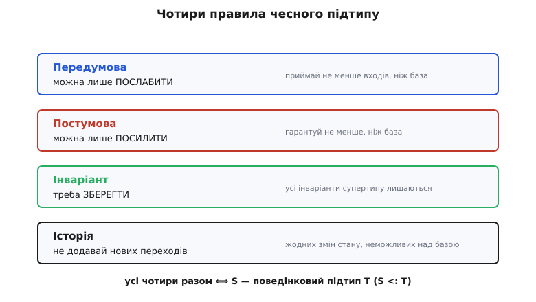
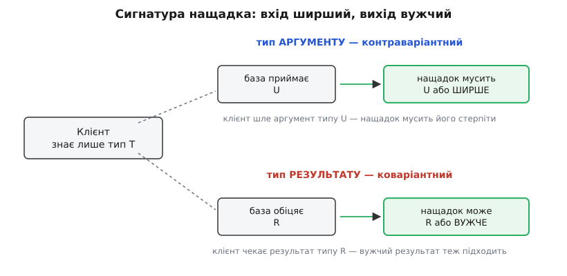

# 🧮 Правила контракту строго: варіантність, історія, відношення підтипу

Інтуїція «вимагай не більше, обіцяй не менше» тримається на чесному слові: вона переконлива, але не скаже вам, де саме проходить межа для конкретного перевизначеного методу, і не пояснить, чому тип аргументу мусить розширюватися, а тип результату — звужуватися, причому в **різні** боки. Тут ми зберемо точний апарат: що означає запис `S <: T` як математичне твердження, які рівно чотири правила роблять підтип чесним, і **звідки** береться протилежний напрям варіантності для входу й виходу — не як факт, який треба завчити, а як єдине, що взагалі можливо, якщо ви серйозно ставитеся до безпеки клієнта.

Домовимося про позначення відразу, бо далі вони працюють як інструмент:

```
S <: T        — «S є підтипом T» (S годиться скрізь, де очікували T)
P ⇒ Q         — «з P випливає Q» (P сильніше або дорівнює Q)
pre_T(m)      — передумова методу m у типі T (що клієнт мусить забезпечити)
post_T(m)     — постумова методу m у типі T (що метод гарантує)
inv_T         — інваріант типу T (що завжди істинне про будь-який його об'єкт)
```

## Що таке «підтип» як точне твердження

Спочатку доведемо до формули саму властивість Лісков, бо все решта — її наслідки. Словами вона звучить як «`S` можна підставити замість `T`, не зламавши програми». Але «не зламавши» — надто розпливчасто, щоб на ньому щось будувати. Барбара Лісков і Жанет Вінг у праці 1994 року «A Behavioral Notion of Subtyping» (ACM TOPLAS, том 16, №6) записали це як умову на **будь-яку доказову властивість**:

```
S <: T  ⟺  для кожної властивості φ, доказової про об'єкти типу T,
            φ лишається доказовою, коли об'єкт типу T замінити об'єктом типу S
```

Розберімо, чому саме «доказова властивість» (англ. *provable property*), а не «поведінка взагалі». Клієнт ніколи не бачить об'єкт цілком — він бачить його **через тип** `T`, тобто через набір тверджень, які тип обіцяє. Усе, на що клієнт має право спиратися, — це те, що можна **вивести з контракту** `T`. Якщо якась властивість не випливає з контракту (скажімо, конкретний порядок елементів там, де тип обіцяє лише «колекція»), клієнт не має права на неї спиратися, і нащадок вільний її міняти. А от усе, що з контракту **виводиться**, нащадок мусить зберегти — інакше знайдеться клієнт, чий коректний доказ раптом стане хибним. Ось чому підтипізація Лісков зветься **поведінковою** (behavioral): вона про множину тверджень, які тип уповноважує клієнта вважати істинними, а не про внутрішній устрій об'єкта.

> 🔧 **Навіщо це.** Формула пояснює, чому підтип за формою (є всі методи з тими сигнатурами) — замало. Компілятор перевіряє лише те, що методи існують і типи аргументів сходяться; він не має способу перевірити «кожну доказову властивість». Тому поведінкова частина `S <: T` завжди лишається на совісті автора нащадка — жодна система типів мейнстріму її повністю не ловить. Строгі правила нижче — це те, що ви перевіряєте очима замість компілятора.

Зверніть увагу на асиметрію напрямів, яка ще не раз спливе. `S <: T` означає, що `S` **менший** тип у сенсі множини об'єктів (кожен `S`-об'єкт є придатним `T`-об'єктом, але не навпаки), але **більший** у сенсі обіцянок: `S` обіцяє все, що `T`, і ще щось. Множина стає вужчою — набір гарантій ширшає. Ця пара «вужче за об'єктами / ширше за гарантіями» — ключ до всього, що далі.

## Чотири правила, які роблять підтип чесним

Перевіряти «кожну доказову властивість» напряму неможливо — властивостей нескінченно. Лісков і Вінг звели перевірку до скінченного набору умов на контракти окремих методів плюс дві умови на тип загалом. Ось усі чотири; перші три ви вже зустрічали як інтуїцію, четверте — суто формальне й найтонше.



*Кожне правило окремо необхідне, усі разом — достатні для поведінкового підтипу.*

**Правило передумови (contravariance of preconditions).** Для кожного перевизначеного методу `m`:

```
pre_T(m)  ⇒  pre_S(m)
```

Читається: усе, що задовольняло передумову бази, мусить задовольняти й передумову нащадка. Тобто передумова нащадка **слабша або рівна** (`pre_S` вимагає не більше, ніж `pre_T`). Стрілка йде від бази до нащадка — з вимог бази випливають вимоги нащадка, а не навпаки. Це і є той бік «вимагай не більше».

**Правило постумови (covariance of postconditions).** Для кожного перевизначеного методу `m`:

```
post_S(m)  ⇒  post_T(m)
```

Читається навпаки: усе, що гарантує нащадок, мусить тягнути за собою гарантію бази. Постумова нащадка **сильніша або рівна**. Стрілка тепер від нащадка до бази — те, що пообіцяв нащадок, покриває обіцянку бази. Це бік «обіцяй не менше».

Придивіться, що дві стрілки дивляться в **протилежні** боки: у передумові `T ⇒ S`, у постумові `S ⇒ T`. Це не випадковість і не гра слів — це та сама контра-/коваріантність, що далі виллється у правило для типів аргументів і результату. Передумова й тип аргументу — «вхід», вони поводяться контраваріантно; постумова й тип результату — «вихід», вони коваріантні. Один корінь, два обличчя.

**Правило інваріанта (invariant preservation).** Кожен інваріант супертипу лишається інваріантом підтипу:

```
inv_S  ⇒  inv_T
```

Нащадок може мати **додаткові** інваріанти (бути ще прискіпливішим до власного стану), але жоден інваріант бази не сміє впасти. Якщо `Rectangle` тримає інваріант «ширина й висота — незалежні», а `Square` натомість тримає «ширина = висота», то `inv_Square` **не** тягне `inv_Rectangle` — навпаки, суперечить йому. Правило порушено, і саме тут формально ламається класична пара квадрат-прямокутник: не в окремому методі, а в тому, що інваріант нащадка несумісний з інваріантом бази.

**Правило історії (the history rule).** Ось четверте, якого немає в наївному «контракти Меєра», і яке Лісков із Вінг додали свідомо. Воно каже про **дозволені зміни стану в часі**:

```
кожна зміна стану, яку може спричинити метод об'єкта S,
мусить бути можливою і як зміна стану об'єкта T
(з погляду доступного через тип T)
```

Простіше: якщо крізь окуляри типу `T` певний перехід стану неможливий, то нащадок не сміє його вводити. Історія — це про **траєкторію** об'єкта, а не про окремий знімок. Саме вона відрізняє строгу теорію від наївної, тож розберімо її окремо — її ж бо й найчастіше проґавлюють.

Разом ці чотири умови рівносильні `S <: T` у поведінковому сенсі: якщо всі виконано, будь-яка доказова про `T` властивість переживе підстановку `S`; якщо хоч одну порушено — знайдеться властивість і знайдеться клієнт, що на неї спирався, який зламається.

## Чому історії замало «правила методів»

Наївна модель (яку дає, скажімо, класичний Design by Contract Бертрана Меєра — [про його апарат передумов і постумов](topic:sf-release/design-by-contract) є окрема тема) перевіряє контракти **кожного методу поокремо**: слабша передумова, сильніша постумова, збережений інваріант. Здається, цього досить. Лісков і Вінг показали, що ні — і причина глибша, ніж дрібниця.

Уявімо тип `PurseView` — «гаманець, який можна лише розглядати»: у нього є метод `balance()`, що повертає суму, і **немає** способу цю суму змінити. З контракту `PurseView` клієнт доводить чудову властивість: «якщо я двічі поспіль поспитаю `balance()` і між викликами сам нічого не робив — отримаю те саме число». Баланс через цей тип **не має як** змінитися: інтерфейс не пропонує жодної операції-зміни, отже перехід «сума була 100, стала 90» крізь окуляри `PurseView` неможливий.

Тепер зробимо нащадка `MutablePurse`, що додає метод `withdraw(sum)`. Перевіримо його **поокремо**: `balance()` успадкований і чесний, `withdraw` — новий метод, у бази його немає, тож для нього немає бази-контракту, який можна порушити. Кожен метод окремо бездоганний. А властивість «два `balance()` поспіль дають те саме» — **зламано**: тепер між ними десь у програмі міг просунутися `withdraw`, і сума впала. Клієнт, що спирався на сталість балансу (цілком законно, бо вивів її з контракту `PurseView`!), отримав хибний доказ.

Ось у чому суть: **аліасинг** (aliasing) — коли на той самий об'єкт є кілька посилань. Клієнт тримає посилання типу `PurseView` і впевнений у сталості; а хтось інший тримає посилання типу `MutablePurse` на **той самий** об'єкт і смикає `withdraw`. Поокремо-перевірка методів цього не ловить, бо вона дивиться на один виклик за раз, а біда виникає **між** викликами, через інший псевдонім. Меєрова модель і рання праця П'єра Америки (Pierre America) аліасингу не враховували; головний внесок Лісков і Вінг — саме те, що правило історії його враховує, замикаючи цю щілину.

Практична мораль строгіша, ніж «пишіть слабші передумови». Вона така: **нащадок не сміє додавати способи змінити стан так, як його не можна було змінити через базовий тип**. Якщо база каже «цей об'єкт незмінний з мого погляду» — нащадок не сміє нишком зробити його змінним, навіть якщо кожен окремий новий метод виглядає бездоганно. Ось чому [незмінність](topic:sf-apps/immutability) і підстановка — близька рідня: незмінний тип майже неможливо порушити правилом історії, бо в ньому просто нема переходів стану, які нащадок міг би розширити.

> 🔧 **Навіщо це.** Правило історії — це перевірка, яку легко проґавити на код-рев'ю, бо вона не про сигнатури й не про один метод. Питання до нащадка звучить так: «чи вводиш ти зміну стану, яку крізь базовий тип побачити й спричинити було неможливо?». Додав `setter` туди, де база була фактично read-only? Додав метод, що міняє поле, яке база лишала сталим? Це майже завжди прихований злам історії — і найпідступніший, бо тести його зловлять лише там, де хтось випадково створив два псевдоніми одного об'єкта.

## Варіантність сигнатури: чому вхід і вихід дивляться в різні боки

Тепер найцікавіше — і те, заради чого ця вставка існує. Правила передумови й постумови — про **логічні умови**. Але коли нащадок перевизначає метод, він ще й оголошує **типи**: тип кожного аргументу й тип результату. Питання: якщо база має метод `T.m(arg: U): R`, якими можуть бути тип аргументу й тип результату в нащадка `S.m`, щоб підстановка лишилася безпечною?

Відповідь несиметрична й спершу контрінтуїтивна:

```
тип аргументу   — можна ЗАМІНИТИ на ширший (супертип U)     ← контраваріантно
тип результату  — можна ЗАМІНИТИ на вужчий (підтип R)        ← коваріантно
```

Не завчаймо це — **виведемо** з єдиного принципу: клієнт написаний під базу й не знає про підміну, отже все, що він робить законно з базою, мусить лишитися законним з нащадком. Поставмо себе на місце клієнта двічі — окремо для входу й для виходу.



*Вхід і вихід міряються з погляду того самого клієнта — і саме тому тягнуть варіантність у протилежні боки.*

**Аргумент — контраваріантно.** Клієнт викликає `obj.m(x)`, де `x` він приготував під тип `U`, бо так обіцяла база. Під посиланням ховається об'єкт нащадка, і саме його `m` дістане цей `x`. Щоб нащадок не вдавився, його `m` мусить **прийняти будь-який `U`** — і має право приймати навіть більше (скажімо, будь-який супертип `U`), бо ширша пащека клієнтові не заважає: він однаково подає лише `U`. А от **звузити** тип аргументу (вимагати підтип `U`, вужчий за `U`) нащадок не сміє: клієнт законно подасть `U`, який у вужчий тип не влазить, — і зламається. Отже тип аргументу росте проти напряму підтипу: `S <: T`, але `тип_аргументу_S :> тип_аргументу_T`. Це і є **контраваріантність**.

Зверніть увагу, що це той самий рух, що й «послабити передумову»: прийняти ширший тип аргументу — це окремий випадок «вимагати від входу менше». Тип аргументу — частина передумови, тому й варіантність та сама.

**Результат — коваріантно.** Тепер клієнт бере те, що метод повернув, і поводиться з результатом як із `R`, бо так обіцяла база: викликає на ньому методи `R`, кладе в змінну типу `R`. Нащадок може повернути **вужчий** тип — підтип `R`: клієнт усе одно бачитиме його як `R`, усі операції `R` на ньому працюють, ніщо не ламається. А от **ширший** результат (супертип `R`) нащадок віддати не сміє: клієнт спробує зробити з ним щось, що вміє лише `R`, а прийде голіший супертип — і зламається. Отже тип результату звужується **за** напрямом підтипу: `S <: T`, і `тип_результату_S <: тип_результату_T`. Це **коваріантність**.

І знову — це той самий рух, що «посилити постумову»: повернути вужчий, точніший тип — окремий випадок «пообіцяти більше». Тип результату — частина постумови.

Ось чому напрями протилежні, і чому інакше бути **не може**. Вхід і вихід стоять по різні боки виклику. Те, що клієнт **дає** методу, безпечно розширювати (метод стерпить), небезпечно звужувати. Те, що клієнт **отримує**, безпечно звужувати (клієнт стерпить), небезпечно розширювати. Один принцип — «клієнт не мусить постраждати» — дає два дзеркальні висновки, бо клієнт стоїть з одного боку, а метод з другого, і «безпечно» для входу означає протилежне «безпечному» для виходу.

Це правило — не винахід об'єктного програмування. Його вивів іще Джон Рейнольдс (John C. Reynolds) 1980 року в праці «Using category theory to design implicit conversions and generic operators», а широко відомим зробила стаття Луки Карделлі (Luca Cardelli) «A Semantics of Multiple Inheritance» 1984 року. Там воно записане для типів функцій у чистому вигляді:

```
якщо  U' :> U  і  R' <: R,   то   (U → R)  <:  (U' → R')
```

тобто тип функції **контраваріантний за аргументом** (`U'` — ширший) і **коваріантний за результатом** (`R'` — вужчий). Метод — це, по суті, функція, тому те саме правило керує перевизначенням. Статус цього результату — усталений математичний факт теорії типів, а не інженерна евристика.

> 🔧 **Навіщо це.** Практична пастка тут одна й дуже поширена: спокуса **звузити тип аргументу** в нащадку, бо «мій нащадок працює лише з таким входом». Це відчувається логічним, а насправді порушує підстановку — це посилена передумова в одязі типу. Пам'ятайте напрям: у нащадку аргумент вільно **розширювати**, результат вільно **звужувати**; будь-який зворотний крок — прихований злам LSP, і добре, що більшість систем типів бодай сигнатурну його частину ловить компілятором.

## Одна тонкість: чому багато мов забороняють коваріантний аргумент

Правило каже, що звужувати тип аргументу не можна. А розширювати — можна й безпечно. Але якщо зазирнути в мейнстрімні мови, виявиться дивне: перевизначення з **ширшим** типом аргументу вони теж здебільшого не дозволяють — Java та C# вимагають, щоб тип аргументу при `@Override` збігався **точно**. Чому забороняють навіть безпечний бік?

Причина не в LSP, а в **розрізненні перевантажень** (overload resolution). Якби Java пускала розширення аргументу, метод `S.m(Object x)`, покликаний перевизначити `T.m(String x)`, з погляду мови виглядав би як **інше** перевантаження (інша сигнатура) — і компілятор не знав би, чи ви хотіли перевизначити базовий метод, чи додати сусідній. Щоб уникнути цієї двозначності, мови просто вимагають точного збігу аргументу при перевизначенні: це **строгіше**, ніж вимагає LSP, зате однозначно. Безпечну гнучкість принесли в жертву передбачуваності — свідомий компроміс дизайну мови, а не вимога теорії.

А от коваріантний **результат** ті самі мови дозволяють, бо він двозначності не створює: Java з версії 5.0 і C# з 9.0 пускають перевизначення з вужчим типом результату (covariant return types). Це рівно та половина правила Рейнольдса, яку безпечно й однозначно втілити, тож її й втілили.

## Де це живе в сучасних системах типів

Дотепер ми говорили про **перевизначення методу** — там варіантність фіксована: аргумент контраваріантно, результат коваріантно, вибору немає. Але щойно з'являються **параметризовані типи** (generics), питання варіантності стає складнішим і — головне — стає **вибором**, який мова мусить якось дати виразити. Бо `Box<String>` і `Box<Object>` — це вже не «той самий метод у нащадку», а два різні типи, і чи є один підтипом другого, залежить від того, **що** `Box` робить зі своїм параметром: лише повертає (тоді коваріантно), лише приймає (контраваріантно), чи і те, й те (тоді жодного — інваріантно).

Класичний доказ, чому «і те, й те» дає інваріантність — [коваріантні масиви Java, що кидають `ArrayStoreException`](topic:sf-lang/behavioral-subtyping): масив і читають, і пишуть, тому вважати `String[]` підтипом `Object[]` небезпечно саме на записі. Мови нового покоління зробили з цього висновок і дали варіантність **виражати явно**. Три втілення того самого правила:

**Java — варіантність на місці вжитку (use-site), через wildcards.** Ви не оголошуєте варіантність у самому класі; ви задаєте її щоразу, коли тип вживаєте:

```java
// ? extends T — коваріантно: з такого можна лише ЧИТАТИ T (продюсер)
void printAll(List<? extends Number> src) {
    for (Number n : src) System.out.println(n);   // читати — можна
    // src.add(...) — заборонено компілятором: писати не можна
}

// ? super T — контраваріантно: у такий можна лише ПИСАТИ T (консюмер)
void fillWithInts(List<? super Integer> dst) {
    dst.add(42);          // писати Integer — можна
    // Number n = dst.get(0); — прийде лише Object: читати конкретне не можна
}
```

Джошуа Блох звів це до мнемоніки **PECS — Producer Extends, Consumer Super**: тип, з якого ви **дістаєте** значення (продюсер), беріть як `? extends`; тип, у який **кладете** (консюмер), — як `? super`. Це не окреме правило, а те саме «вихід коваріантний, вхід контраваріантний», перенесене з методів на параметри типу: продюсер віддає — коваріантно; консюмер приймає — контраваріантно.

**C# — варіантність на місці оголошення (declaration-site), через `out`/`in`.** Тут варіантність позначають один раз, у самому інтерфейсі, ключовими словами при параметрі типу:

```csharp
// out T — T лише на виході (у результатах) → коваріантно
interface IEnumerable<out T> { IEnumerator<T> GetEnumerator(); }

// in T — T лише на вході (в аргументах) → контраваріантно
interface IComparer<in T> { int Compare(T x, T y); }

// відтепер це коректно й безпечно:
IEnumerable<object> objs = new List<string>();   // бо out: лише читаємо string як object
```

Слова підказують позицію напряму дослівно: `out` — параметр стоїть **на виході**, тому коваріантно; `in` — **на вході**, тому контраваріантно. Компілятор ще й **перевіряє**, що ви не збрехали: якщо в `out`-інтерфейсі спробувати взяти `T` аргументом методу, буде помилка компіляції. Мова не дає оголосити варіантність, несумісну з тим, як тип насправді вживає параметр.

**Kotlin — теж declaration-site, ті самі `out`/`in`, та сама перевірка позицій:**

```kotlin
// out T — продюсер, коваріантно (T лише повертається)
interface Source<out T> { fun next(): T }

// in T — консюмер, контраваріантно (T лише приймається)
interface Sink<in T> { fun put(item: T) }

val anySource: Source<Any> = object : Source<String> { override fun next() = "x" }  // ок: out
```

`Comparable<T>` у Kotlin оголошено як `Comparable<in T>` саме тому, що `T` там з'являється лише в аргументі `compareTo` — це контраваріантна позиція, і компілятор це підтвердить. Kotlin, як і C#, дозволяє за потреби перемкнутися на use-site (проєкції типів — `Source<out T>` на місці вжитку), покриваючи обидва стилі.

Придивіться, що всі три — Java, C#, Kotlin — кодують **одне й те саме** правило Рейнольдса, лише в різних місцях і з різним синтаксисом: там, де параметр типу стоїть **на виході** (результат, продюсер), дозволена коваріантність; там, де **на вході** (аргумент, консюмер), — контраваріантність; там, де в обох позиціях, — тільки інваріантність. Той самий принцип безпеки клієнта, що ми вивели для одного перевизначеного методу, розгорнутий у систему типів для цілих параметризованих типів. Мова просто дає йому синтаксис і, головне, **компілятор, що не пускає брехню** — рівно те, чого бракувало старим коваріантним масивам.

## Де цей апарат замикається на LSP

Зведімо все до однієї картини, бо в ній видно, навіщо була строгість. LSP на рівні інтуїції каже: «нащадок мусить безпечно підставлятися». Формальний апарат розбиває це «безпечно» на перевірки, кожну з яких видно оком:

```
S <: T   ⟺   pre_T(m) ⇒ pre_S(m)      для кожного методу   (передумова слабшає)
          ∧   post_S(m) ⇒ post_T(m)     для кожного методу   (постумова міцнішає)
          ∧   inv_S ⇒ inv_T                                    (інваріанти бази живі)
          ∧   історія S не ширша за історію T                  (нових змін стану нема)
```

а варіантність типів — це та сама пара «вхід/вихід» на рівні сигнатур: тип аргументу контраваріантний (розширюй, не звужуй), тип результату коваріантний (звужуй, не розширюй). Дві логічні умови (передумова, постумова) і дві типові (аргумент, результат) — це, по суті, одна ідея в двох поверхах: **вхід можна робити лоялнішим, вихід — точнішим, і ніколи навпаки.**

Через цю сітку видно кожне класичне порушення точно, а не «на відчуття». Квадрат-прямокутник валиться на правилі інваріанта: `inv_Square` («сторони рівні») суперечить `inv_Rectangle` («сторони незалежні»), тож `inv_S ⇒ inv_T` хибне. Метод, що кидає виняток замість роботи, валиться на передумові: він неявно вимагає «клич мене лише коли не треба», тобто `pre_S` **сильніша** за `pre_T`, а мало бути слабшою. Схований `setter` у типі, що з погляду бази був незмінним, валиться на історії. Коваріантні масиви валяться на варіантності: запис робить масив консюмером свого елемента, а консюмер мусить бути контраваріантним — тому коваріантний `String[] <: Object[]` і небезпечний.

Це і є користь від строгого апарату: він перетворює розмиту вимогу «поводься як годиться» на скінченний чекліст, де кожен пункт має ім'я, напрям і причину. А той, хто проєктує типи навмисне під ці правила — тонкі інтерфейси, незмінність, точні межі відповідальності, — виявляє, що [дизайн, ведений типами](topic:sf-apps/type-driven-design), робить порушення підстановки не забороненим, а просто **невимовним**: система типів перестає пускати брехню ще до того, як хтось устигне її написати.
