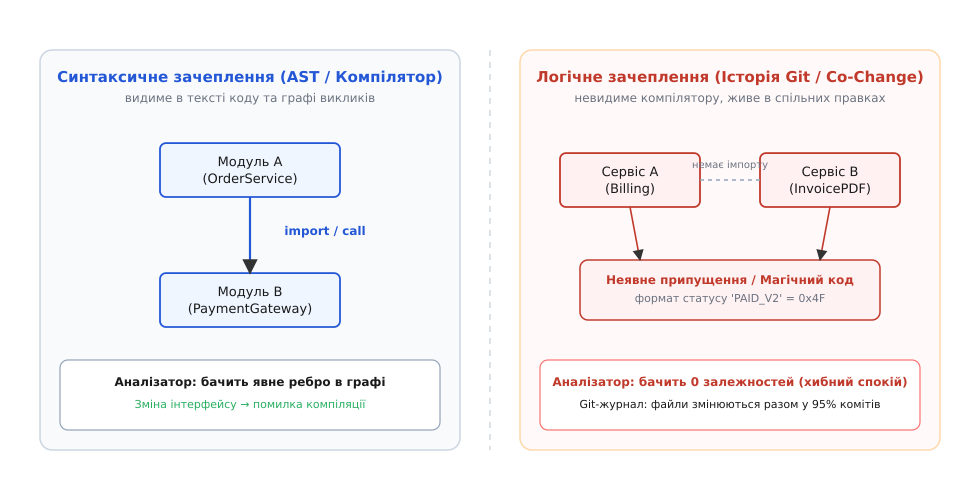
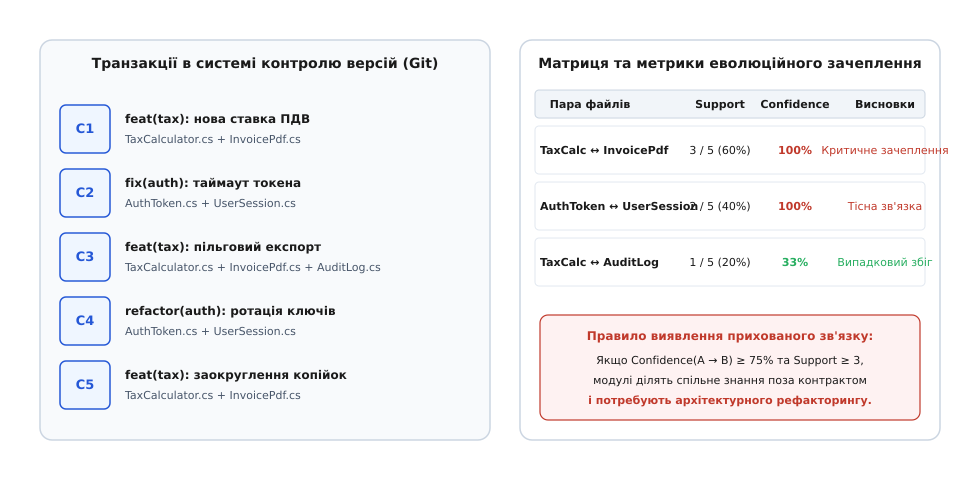
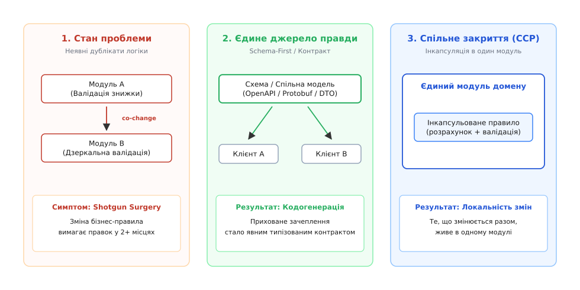

# Логічне та еволюційне зачеплення модулів

<preknowlist>
- [Зчеплення і зв'язність](topic:sf-apps/coupling-cohesion) — фундаментальні виміри модульності: ступінь залежності між модулями та внутрішня цілісність кожного з них.
- [Інкапсуляція](topic:sf-apps/encapsulation) — приховування деталей реалізації за стабільним публічним інтерфейсом задля захисту інваріантів.
- [Принцип спільного закриття (CCP)](topic:sf-apps/common-closure-principle) — правило групування компонентів, що змінюються з однакових бізнес-причин, в одну спільну одиницю розгортання.
- [Інтерфейс проти реалізації](topic:sf-apps/interface-vs-implementation) — розділення контракту взаємодії від конкретного способу його виконання.
- [Інваріант програми](topic:sf-apps/invariants) — логічна умова, яка повинна залишатися істинною під час виконання системи.
</preknowlist>

Уяви розподілену платіжну систему, де модуль нарахування тарифів `billing_service` та модуль генерації фіскальних звітів `invoice_renderer` розташовані в різних каталогах або навіть у різних репозиторіях. Вони написані різними мовами, не мають жодного спільного заголовочного файлу, не імпортують спільних типів і спілкуються через чергу повідомлень. Статичний аналізатор коду та компілятор показують нульове структурне зчеплення: у графі синтаксичних залежностей між ними немає жодного спільного ребра.

Проте під час чергового випуску команда додає нове бізнес-правило: для корпоративних клієнтів запроваджується трирівнева шкала знижок. Інженер змінює `billing_service`, запускає модульні тести — вони проходять успішно. Проте вже за годину після викатки у продакшен генератор звітів видає помилки валідації або формує рахунки з некоректними сумами. З'ясовується, що генератор звітів містив власну внутрішню копію розрахунку податкової ставки і неявно очікував, що статус транзакції завжди кодується одним символом.

Якщо заглянути в журнал системи контролю версій Git за останні два роки, виявиться показова закономірність: у 92% комітів, де змінювався файл розрахунку тарифів, автори одночасно вносили правки й у файл генератора звітів.

Цей невидимий для компілятора, але детермінований у часі зв'язок називається **логічним або еволюційним зачепленням (англ. *logical coupling*, або *co-change / temporal coupling*)** — формою залежності між програмними артефактами, за якої зміна одного компонента систематично вимагає синхронної зміни іншого, навіть за повної відсутності синтаксичних посилань між ними у вихідному коді.

## Анатомія невидимих каналів: чому компілятор сліпий

Синтаксичні залежності базуються на явних конструкціях мови програмування: операторах `import`, директивах `#include`, зверненнях до полів структур, спадкуванні класів та викликах функцій. Статичний аналізатор з легкістю будує граф таких зв'язків через аналіз абстрактного синтаксичного дерева (AST). Якщо інтерфейс змінено несумісним чином, компілятор відразу сигналізує про помилку типу або відсутній символ.


*Синтаксичне зачеплення видиме компілятору через імпорти й типи; логічне зачеплення приховане в синхронності змін у системі контролю версій.*

Натомість логічне зачеплення існує в іншій площині — у площині **неявних припущень (англ. *implicit shared assumptions*)**. Компілятор бачить лише літери та типи, але він не знає семантики бізнес-домену, яка пов'язує фізично розділені файли.

Можна виділити п'ять головних джерел виникнення прихованого зачеплення в кодових базах:

### 1. Розмазані магічні константи та протокольні коди

Коли два незалежні модулі використовують спільні числові або рядкові ідентифікатори без посилання на єдине джерело правди (Single Source of Truth), вони утворюють жорстку логічну зв'язку.

:::tabs
```c
/* Файл: billing/payment_processor.c */
#define STATUS_AUTHORIZED  1
#define STATUS_CAPTURED    2
#define STATUS_REFUNDED    3
#define STATUS_CHARGEBACK  4  /* Новий статус, доданий під час релізу */

void process_status(int status) {
    if (status == STATUS_CHARGEBACK) {
        /* спеціальна логіка блокування */
    }
}
```
```cpp
/* Файл: billing/payment_processor.cpp */
#include <cstdint>

enum class PaymentStatus : uint8_t {
    Authorized = 1,
    Captured   = 2,
    Refunded   = 3,
    Chargeback = 4  // Новий статус, доданий під час релізу
};

void process_status(PaymentStatus status) {
    if (status == PaymentStatus::Chargeback) {
        // спеціальна логіка блокування
    }
}
```
:::

Якщо модуль аналітики або генерації звітів містить власний незалежний перелік констант:

:::tabs
```c
/* Файл: analytics/report_builder.c */
/* Розробник скопіював значення вручну три місяці тому */
static const char* status_to_str(int st) {
    switch (st) {
        case 1: return "AUTH";
        case 2: return "CAPTURED";
        case 3: return "REFUNDED";
        default: return "UNKNOWN"; /* Новий статус 4 потрапить сюди і зламає звіт */
    }
}
```
```cpp
/* Файл: analytics/report_builder.cpp */
#include <string_view>

// Розробник скопіював значення вручну три місяці тому
std::string_view status_to_str(int st) {
    switch (st) {
        case 1: return "AUTH";
        case 2: return "CAPTURED";
        case 3: return "REFUNDED";
        default: return "UNKNOWN"; // Новий статус 4 потрапить сюди і зламає звіт
    }
}
```
:::

Додавання нового статусу `STATUS_CHARGEBACK = 4` компілюється без зауважень, але вимагає обов'язкової ручної синхронізації `report_builder`. Якщо автор забуде оновити другий файл, система зазнає тихої відмови. В історії репозиторію ці два файли завжди змінюватимуться парами.

### 2. Неявні формати пакетів і порядок бітових полів

У низькорівневих системах та мережевих протоколах логічне зачеплення виникає через неявні угоди про структуру бінарних пакетів або текстових рядків. Якщо відправник формує бінарний буфер через прямий запис зміщень пам'яті, а отримувач зчитує поля за фіксованими зсувами без використання спільної структури або схеми десеріалізації, зміна довжини одного заголовка руйнує роботу отримувача.

Прикладом є серіалізація структур через нетипізовані масиви байтів або конкатенацію рядків у форматі CSV/JSON без схеми: якщо модуль запису додає новий стовпчик посередині рядка, модуль зчитування мовчки записує нові дані у старі змінні, створюючи важковиправні пошкодження пам'яті або спотворення фінансових даних.

### 3. Дзеркальні валідації (Mirrored Validations)

Класичним проявом у вебсистемах є дублювання бізнес-правил між клієнтським інтерфейсом (UI) та серверним бекендом. Якщо довжина номера договору або правила розрахунку податкового номера перевіряються окремо регулярним виразом на клієнті і окремим кодом у базі даних, будь-яка зміна бізнес-вимог спричиняє обов'язкову синхронну правку в обох підсистемах.

Коли вимоги змінюються (наприклад, формат телефонного номера розширюється для підтримки міжнародних кодів), розробник оновлює форму на клієнті, але забуває про валідатор у черзі фонової обробки. Користувач успішно заповнює форму, але фоновий воркер відхиляє заявку через невідповідність застарілому регулярному виразу.

### 4. Розірвана інкапсуляція та часове зачеплення (Temporal Coupling)

Якщо для виконання бізнес-операції клієнтський код повинен викликати методи підсистеми у строго визначеному порядку (`init() → authenticate() → execute() → commit()`), знання про коректну послідовність викликів перетікає з внутрішньої реалізації назовні. Зміна внутрішнього алгоритму змушує змінювати кожен зовнішній компонент, що використовує цей сервіс.

Аналогічно, якщо два сервіси мають неявну домовленість про те, хто перший записує запис у базу даних перед відправкою події в брокер повідомлень, порушення цього часового порядку однією зі сторін призводить до стану гонитви (Race Condition), хоча в коді жодного спільного блокування не існує.

### 5. Спільна база даних без спільного сервісу (Shared Database Anti-Pattern)

Коли дві незалежні програми звертаються до одних і тих самих таблиць реляційної бази даних напряму, структура таблиць стає неявним контрактом. Зміна назви стовпця, типу даних або додавання обов'язкового обмеження `NOT NULL` в одній підсистемі миттєво ламає SQL-запити іншої підсистеми. На рівні вихідного коду сервіси не мають жодного зв'язку, але в системі контролю версій їхні файли сутностей змінюються абсолютно синхронно.

Історія розвитку методів виявлення цих прихованих каналів докладно викладена в [історичному нарисі про дослідження архівів версій](topic:sf-apps/logical-coupling/hist-co-change-mining.md).

## Спектр зачеплення: від синтаксичного до еволюційного

Щоб систематизувати різні форми зв'язку між модулями, теорія архітектури використовує концепцію **зрощеності (англ. *connascence*)**, запропоновану Мейліром Пейдж-Джонсом (Meilir Page-Jones). Зрощеність визначає, що два програмні елементи є зв'язаними, якщо зміна в одному вимагає зміни в іншому задля збереження коректності системи.

Ступені зрощеності утворюють ієрархію за силою та вартістю підтримки:

```
+-----------------------------------------------------------------------------+
|  СЛАБКА ЗРОЩЕНІСТЬ (Легко контролювати компілятором / refactoring tools)   |
|  1. За іменем (Name)        — збіг назв функцій чи полів                    |
|  2. За типом (Type)         — узгодження типів аргументів                   |
|  3. За сигнатурою (Signature)— порядок та кількість параметрів              |
+-----------------------------------------------------------------------------+
|  СИЛЬНА / ДИНАМІЧНА ЗРОЩЕНІСТЬ (Компілятор сліпий, ризик високий)           |
|  4. За значенням (Value)    — неявні спільні константи чи магічні числа     |
|  5. За алгоритмом (Algorithm)— дублювання логіки підрахунку / хешування     |
|  6. За позицією (Position)  — очікування фіксованих індексів у масивах      |
|  7. За часом (Timing)       — строгий порядок виконання кроків транзакції   |
+-----------------------------------------------------------------------------+
```

1. **Статична зрощеність (Static Connascence):**
   * *Зрощеність імені (Connascence of Name):* модулі узгоджують назву методу чи функції.
   * *Зрощеність типу (Connascence of Type):* аргумент повинен мати конкретний тип даних.
   * *Зрощеність сигнатури (Connascence of Signature):* кількість та порядок аргументів мають збігатися.
   Усі ці форми перевіряються компілятором і лінкером під час збірки. Якщо перейменувати метод в IDE, автоматичний рефакторинг оновлює всі виклики безпечно.

2. **Динамічна та еволюційна зрощеність (Dynamic / Temporal Connascence):**
   * *Зрощеність значення (Connascence of Value):* кілька файлів мають неявно погоджуватися щодо значення магічного числа або рядка.
   * *Зрощеність алгоритму (Connascence of Algorithm):* дві сторони повинні використовувати ідентичний алгоритм хешування або заокруглення сум.
   * *Зрощеність часу (Connascence of Timing):* виконання функцій повинно відбуватися в точному часовому вікні або черговості.

Логічне зачеплення — це прояв зрощеності високого порядку (Value, Algorithm, Timing), винесений за межі одного процесу компіляції. Компілятор безсилий перед такими формами зв'язку, оскільки вони виникають не у вихідному коді як статичному тексті, а в поведінці системи під час її історичної еволюції.

## Як знайти те, чого не бачить компілятор: аналіз історії версій

Єдиним надійним джерелом правди про реальну структуру залежностей у працюючій системі є її система контролю версій (Git, Mercurial, SVN). Кожен коміт фіксує **атомарну транзакцію мислення інженера**: набір файлів, які автор мусив змінити одночасно, щоб вирішити одне конкретне інженерне завдання.


*Коміти фіксують неявний зв'язок: хоча модулі не мають спільних заголовків, кожна модифікація одного вимагає синхронного оновлення іншого.*

Для математичної формалізації аналізу спільних змін (Mining Software Repositories) використовується апарат пошуку асоціативних правил.

### Ключові метрики логічного зачеплення

Нехай `N` — загальна кількість транзакцій у репозиторії, `N[A]` — кількість комітів, що містять файл `A`, а `N[A, B]` — кількість комітів, у яких файли `A` та `B` модифіковано одночасно.

1. **Підтримка (Support):**
   Частка транзакцій, що містять спільну зміну обох компонентів:
   ```
   Support(A, B) = N[A, B] / N
   ```
   Підтримка слугує фільтром статистичної значущості. Пари з `N[A, B] < 3` зазвичай вважаються випадковим шумом.

2. **Впевненість / Достовірність (Confidence):**
   Умовна ймовірність того, що зміна у файлі `A` змусить розробника змінити файл `B`:
   ```
   Confidence(A → B) = N[A, B] / N[A]
   Confidence(B → A) = N[A, B] / N[B]
   ```
   Впевненість **несиметрична**: якщо `Confidence(A → B) = 90%`, а `Confidence(B → A) = 10%`, це вказує на односторонню залежність клієнт-серверного характеру.

3. **Коефіцієнт подібності Жаккара (Jaccard Index):**
   Симетрична оцінка сили зв'язку між парою файлів:
   ```
   Jaccard(A, B) = N[A, B] / (N[A] + N[B] - N[A, B])
   ```
   Якщо `Jaccard(A, B) = 1.0`, файли ніколи не змінюються окремо, утворюючи нерозривний монолітний блок.

4. **Підйом (Lift):**
   Показує, у скільки разів спільна зміна є частішою за випадковий збіг двох незалежних подій:
   ```
   Lift(A, B) = (N[A, B] · N) / (N[A] · N[B])
   ```
   Якщо `Lift ≈ 1.0`, зв'язок є суто випадковим артефактом загальної високої активності файлів; значення `Lift > 3.0` свідчить про глибоку архітектурну залежність.

Повний математичний апарат, статистичні критерії значущості та алгоритми кластеризації докладно розглянуто в [математичному апараті аналізу спільних правок](topic:sf-apps/logical-coupling/math-coupling-metrics.md).

## Архітектурні патерни та аномалії еволюційного зачеплення

Аналіз матриці спільних змін дозволяє діагностувати специфічні архітектурні патології, які неможливо виявити під час звичайного перегляду коду (Code Review):

### 1. Дробове хірургічне втручання (Shotgun Surgery)
Симптом, за якого проста зміна однієї бізнес-вимоги викликає каскад дрібних правок у десятках незв'язаних файлів по всій системі. На графі зачеплення це виглядає як файл-концентратор, пов'язаний високим показником `Confidence` з 15–20 іншими модулями. Це пряме свідчення розмитої відповідальності та відсутності інкапсуляції бізнес-правил. Кожен новий реліз перетворюється на виснажливий пошук усіх місць у кодовій базі, де потрібно підправити умови.

### 2. Бімодальне зачеплення (Bimodal Coupling)
Файли демонструють високий ступінь спільної зміни лише в певні періоди життя проєкту (наприклад, під час релізів або міграцій схеми БД), але залишаються незалежними під час щоденної розробки фіч. Це вказує на зачеплення, зумовлене процесом розгортання або конфігурацією середовища, а не бізнес-логікою.

### 3. Зачеплення через межі команд (Cross-Team Coupling)
Коли два модулі з високим показником еволюційного зв'язку закріплені за двома різними автономними продуктовими командами. Відповідно до Закону Конвея, це породжує постійне організаційне тертя, затримки релізів через міжкомандні блокування та взаємні регресійні дефекти. Якщо команда білінгу не може випустити зміну без погодження з командою генерації PDF, їхня декларована автономія є фікцією.

### 4. Крихкі тести (Fragile Test Smells)
Синхронна зміна тестового файлу та файлу реалізації у 100% комітів є нормальною лише для функціональних вимог. Якщо ж суто внутрішній технічний рефакторинг приватного методу (без зміни контракту) вимагає переписування тестів, це сигнал надмірного зачеплення тестів за внутрішню структуру через надмірне використання моків (Mock-heavy White-Box testing). Тести мають перевіряти публічну поведінку (контракт), а не внутрішню реалізацію.

### 5. Асиметричне гальмування (Asymmetric Drag)
Ситуація, коли модуль `A` (наприклад, додатковий плагін звітності) у 95% випадків змінюється одночасно з ядром системи `Core`, але саме ядро змінюється сотні разів без участі плагіна. Це свідчить про те, що плагін не використовує стабільний SPI (Service Provider Interface), а постійно лізе у внутрішні приватні структури ядра, змушуючи розробників плагіна витрачати ресурси на постійне наздоганяння змін у ядрі.

Робочий інструмент для автоматичного розрахунку цих метрик та побудови матриці зв'язків реалізовано у [практичному аналізаторі журналу Git](topic:sf-apps/logical-coupling/proj-git-coupling.md).

## Ерозія шарової архітектури та накладення DSM

Класична шарова архітектура (Layered Architecture) передбачає суворий однонапрямлений потік залежностей: рівень представлення (UI/API) викликає шар додатку (Application Service), який керує доменною моделлю (Domain), що зберігається через рівень інфраструктури (Infrastructure/Persistence).

У статичній матриці залежностей (Dependency Structure Matrix, DSM) така система виглядає ідеальною нижньотрикутною матрицею без циклів. Проте аналіз еволюційного зачеплення часто викриває явище **архітектурної ерозії (англ. *architectural erosion*)**:

```
+-----------------------------------------------------------------------------+
|               НАКЛАДЕННЯ ЕВОЛЮЦІЙНОГО ЗЧЕПЛЕННЯ НА ШАРОВУ DSM              |
|                                                                             |
|  Шари:               [UI]     [App]    [Domain]   [Repo]    [DB Entity]     |
|  [UI]                 .         .         .         .          🔥 (85%)     |
|  [App]                0         .         .         .           .           |
|  [Domain]             0         0         .         .           .           |
|  [Repo]               0         0         0         .           .           |
|  [DB Entity]          0         0         0         0           .           |
|                                                                             |
|  Синтаксично: UI знає лише про App. DB Entity знає лише про Repo.          |
|  Еволюційно: Зміна поля в DB Entity у 85% випадків вимагає правки UI!       |
+-----------------------------------------------------------------------------+
```

Це свідчить про витік абстракцій (Leaky Abstraction): доменні сутності вироджені в анемічні структури даних, які «протикають» усі шари наскрізь. Додавання одного поля в базу даних змушує змінювати `Entity → DTO → Service → View` в одному коміті. Еволюційна матриця наочно показує вертикальні простріли, які не фіксуються компілятором.

## Феномен «Розподіленого моноліту» (Distributed Monolith)

Найбільш руйнівним проявом логічного зачеплення в сучасній інженерії є антипатерн **«розподілений моноліт» (англ. *distributed monolith*)**.

Команда розбиває монолітний застосунок на 20 мікросервісів, кожен із яких розгортається в окремому Docker-контейнері у кластері Kubernetes. Сервіси мають власні репозиторії та спілкуються через HTTP/REST або gRPC. Формально досягнуто повної синтаксичної та фізичної ізоляції.

Проте якщо завантажити журнали всіх репозиторіїв в аналізатор еволюційного зачеплення, відкривається неприємна правда:
* Зміна бізнес-логіки в `order_service` у 85% випадків супроводжується синхронними комітами в `inventory_service`, `payment_service` та `notification_service`.
* Жоден сервіс неможливо розгорнути незалежно: потрібні скоординовані релізи (Lockstep Deployments) із зупинкою трафіку.
* Будь-яка зміна формату повідомлення викликає ланцюгову відмову у суміжних процесах.

```
+-----------------------------------------------------------------------------+
|                     ІЛЮЗІЯ МІКРОСЕРВІСНОЇ АВТОНОМІЇ                        |
|                                                                             |
|  [ Order Service ] <--- HTTP/REST ---> [ Inventory Service ]                |
|         |                                      |                            |
|         +---------------- gRPC ----------------+                            |
|                                                                             |
|  Синтаксис: окремі процеси, нуль спільних типів, мережеві виклики.          |
|  Історія Git: 88% комітів синхронні -> Розподілений моноліт.               |
|  Результат: складнощі моноліта + накладні витрати розподіленої мережі.      |
+-----------------------------------------------------------------------------+
```

Розподілений моноліт поєднує всі недоліки монолітної архітектури (жорстке зачеплення, синхронні релізи) з усіма проблемами розподілених систем (мережеві затримки, часткові відмови, складність налагодження, втрата транзакційної цілісності).

Причиною цього стану є **неправильне проведення меж**: сервіси було нарізано за технічними сутностями (моделями бази даних), а не за межами обмежених контекстів (Bounded Contexts) предметної області.

## Соціотехнічний вимір та Закон Конвея

Архітектура коду не існує у вакуумі: вона нерозривно пов'язана зі структурою інженерної організації. Закон Конвея стверджує, що структура системи повторює комунікаційні канали організації, яка її розробляє.

Коли система контролю версій показує сильне логічне зачеплення між файлами, закріпленими за різними розробниками або різними командами, виникає феномен **соціотехнічного розриву**:
1. **Шторм конфліктів злиття (Merge Conflict Storms):** дві команди одночасно працюють над своїми фічами в паралельних гілках, але постійно стикаються з конфліктами під час злиття в основну гілку `main`, оскільки обидві змушені змінювати один і той самий приховано зачеплений файл.
2. **Розмивання відповідальності (Bystander Effect):** коли файл змінюється десятьма різними інженерами з різних відділів, він стає «нічиєю землею». Ніхто не відчуває відповідальності за його чистоту, архітектурний борг накопичується лавиноподібно, і файл перетворюється на неконтрольований God Object.
3. **Зниження швидкості доставки (Lead Time Degradation):** кожна зміна вимагає міжкомандних зустрічей, ручних тестувань та синхронних нічних релізів.

Архітектурний підхід **«Інверсний маневр Конвея» (Inverse Conway Maneuver)** полягає в тому, щоб за результатами аналізу еволюційного зачеплення свідомо змінити або межі коду, або межі команд. Якщо два сервіси мають `Jaccard ≥ 70%`, їх передають у володіння одній команді або об'єднують в єдиний монолітний компонент, ліквідуючи міжкомандні бар'єри.

## Стратегії архітектурного розв'язання

Коли аналізатор виявив пару або кластер компонентів із критичним логічним зачепленням (`Jaccard ≥ 60%`, `Lift ≥ 3.0`), архітектор обирає одну з чотирьох стратегій структурного розв'язання проблеми.


*Перехід від неявних припущень до явного контракту: схеми, спільне закриття або публікація подій замінюють приховане зачеплення керованим інтерфейсом.*

### Стратегія 1: Створення явного спільного контракту (Single Source of Truth)

Найпростіший спосіб усунути приховане зачеплення через значення констант або структур — перетворити неявне знання на явний компільований артефакт.

Замість того, щоб дублювати коди помилок або структуру заголовка в кожному модулі окремо, спільні визначення виносяться в окрему бібліотеку контрактів (Shared Types Library).

:::tabs
```c
/* Файл: include/contracts/payment_types.h */
#ifndef PAYMENT_TYPES_H
#define PAYMENT_TYPES_H

typedef enum {
    PAYMENT_STATUS_AUTHORIZED = 1,
    PAYMENT_STATUS_CAPTURED   = 2,
    PAYMENT_STATUS_REFUNDED   = 3,
    PAYMENT_STATUS_CHARGEBACK = 4
} PaymentStatus;

typedef struct {
    unsigned long transaction_id;
    PaymentStatus status;
    long amount_cents;
    char currency[4];
} PaymentRecord;

#endif
```
```cpp
/* Файл: include/contracts/payment_types.hpp */
#pragma once
#include <cstdint>
#include <string_view>

enum class PaymentStatus : uint8_t {
    Authorized = 1,
    Captured   = 2,
    Refunded   = 3,
    Chargeback = 4
};

struct PaymentRecord {
    uint64_t transaction_id;
    PaymentStatus status;
    int64_t amount_cents;
    char currency[4];
};
```
:::

Тепер обидва модулі підключають спільний заголовок. Якщо додається новий статус, компілятор через систему попереджень (`-Wswitch`) автоматично виявляє всі місця в усіх модулях, де новий статус ще не оброблено. Логічне зачеплення трансформувалося у контрольоване синтаксичне зачеплення за стабільним інтерфейсом.

### Стратегія 2: Підхід «Схема як перший клас» (Schema-First & Code Generation)

У поліглотних або розподілених мікросервісних системах спільна мовна бібліотека типів є недоступною або створює небажане бінарне зачеплення. У цьому разі єдиним джерелом правди стає декларативна схема:
* **Protocol Buffers / FlatBuffers:** бінарна серіалізація зі суворою схемою та гарантією зворотної сумісності;
* **OpenAPI / JSON Schema:** типізація HTTP/REST взаємодії;
* **AsyncAPI / Avro:** контракти для брокерів повідомлень (Kafka, RabbitMQ).

Під час збірки кожного сервісу компілятор схем генерує нативний код (моделі, валідатори, серіалізатори) для цільової платформи. Зміна схеми автоматично оновлює код обох підсистем, усуваючи ризик несинхронних ручних правок.

### Стратегія 3: Реорганізація меж за Принципом спільного закриття (CCP)

Якщо два модулі змінюються разом не через спільні типи, а через неподільне бізнес-правило, будь-яка спроба розділити їх штучними інтерфейсами є помилкою. 

**Принцип спільного закриття (англ. *Common Closure Principle, CCP*)** стверджує:
*Класи та файли, які змінюються з однакових причин, повинні бути об'єднані в один модуль.*

Якщо модуль розрахунку податків та модуль формування підсумків інвойсу зазнають спільних змін у 95% випадків, вони не є окремими сервісами — вони є двома частинами **одного єдиного концептуального агрегата**. Правильним архітектурним рішенням є їхнє фізичне об'єднання в один пакет чи каталог під спільну інкапсуляцію. Внутрішні правила розрахунку стають приватними, а назовні виставляється лише готовий результат.

### Стратегія 4: Подієве розв'язання та антикорупційний шар (ACL)

Якщо пряме об'єднання неможливе (наприклад, одна з систем є застарілою або зовнішньою), приховане зачеплення розривають через впровадження антикорупційного шару (Anti-Corruption Layer, ACL) та публікацію збагачених доменних подій (Domain Events).

Замість того, щоб вторинний модуль сам вираховував статус замовлення на основі сирих даних першого модуля, сервіс-виробник публікує подію, що містить повний знімок розрахованого стану (`OrderCompletedEvent { final_total, tax_amount, discount }`). Отримувач споживає готове значення як незмінний факт (Value Object), позбавляючись необхідності знати про внутрішні алгоритми відправника.

## Покроковий протокол архітектурного аудиту репозиторію

Щоб перетворити аналіз еволюційного зачеплення на регулярну інженерну практику, архітектор виконує чотири послідовні кроки аудиту:

```
+----------------------+     +-----------------------+     +------------------------+     +----------------------+
|  1. Екстракція логу  | --> |  2. Обчислення топу   | --> |  3. Діагностика причин | --> |  4. Формування ADR   |
|  (фільтрація шуму)   |     |  (Jaccard >= 50%)     |     |  (Value / Algo / Timing)|     |  (план рефакторингу) |
+----------------------+     +-----------------------+     +------------------------+     +----------------------+
```

1. **Крок 1: Екстракція та очищення даних**
   З репозиторію вивантажується журнал комітів за останні 6–12 місяців із виключенням злиттів, файлів документації, сторонніх залежностей та масових комітів форматування.

2. **Крок 2: Побудова матриці та ранжування пар**
   Аналізатор виділяє 20 пар файлів із найвищим значенням коефіцієнта Жаккара за умови підтримки `Support ≥ 5`.

3. **Крок 3: Класифікація корінних причин**
   Для кожної пари визначається природа зв'язку:
   * *Магічні значення:* вирішується через виділення спільного Enum/Struct.
   * *Дзеркальна валідація:* вирішується через перехід на Schema-First.
   * *Розірваний бізнес-концепт:* вирішується через консолідацію коду в один модуль (CCP).
   * *Здоровий зв'язок (Код ↔ Тест):* залишається без змін.

4. **Крок 4: Фіксація рішень у журналі ADR**
   Для критичних випадків створюється Запис архітектурного рішення (Architecture Decision Record, ADR), який фіксує проблему, вибрану стратегію рефакторингу та критерій успіху (зниження показника `Jaccard` нижче 20% у наступних релізах).

## Архітектурні компроміси та межі допустимого

Було б помилкою вважати, що будь-яке логічне зачеплення є злом, яке необхідно негайно знищити. Кожне архітектурне рішення є компромісом (trade-off) між різними якісними атрибутами системи.

### Коли логічне зачеплення є природним і безпечним:
1. **Файл реалізації та його модульний тест (`order.c ↔ order_test.c`):** висока кореляція змін тут є прямою ознакою активного розвитку функціоналу з належним тестовим покриттям.
2. **Скрипт міграції БД та визначення моделі (`User.entity ↔ 0042_add_user_field.sql`):** зміна реляційної структури природно супроводжується зміною коду збереження сутності.
3. **Експериментальні модулі на стадії прототипування:** введення формальних схем та спільних бібліотек на ранніх етапах розвитку може створити передчасну абстракцію (Premature Generalization) та сповільнити швидкість перевірки продуктових гіпотез.

### Ціна усунення зачеплення:
* Створення спільної бібліотеки контрактів вводить нову залежність у дерево збірки та вимагає налаштування процесів релізу й версіонування артефактів.
* Перехід на кодогенерацію вимагає ускладнення конвеєрів CI/CD та підтримки сумісності схем.
* Об'єднання модулів за принципом CCP збільшує розмір окремого компонента та може збільшити час компіляції.

### Економіка розчеплення: Maintenance Tax проти Contract Tax

Вибір між збереженням поточного стану та проведенням архітектурного розчеплення завжди підпорядковується економічному балансу двох витрат:

1. **Податок на приховане зачеплення (Maintenance Tax):**
   * *Когнітивне навантаження:* розробник змушений тримати в голові неявні правила («якщо правиш файл X, не забудь відкрити файл Y»).
   * *Ціна онбордингу:* новий інженер у команді, який не має історичного контексту, гарантовано пропустить залежний файл і створить дефект під час першого ж самостійного завдання.
   * *Ризик масових регресій:* кожна модифікація супроводжується тривалим регресійним тестуванням усього комплексу.

2. **Податок на формальний контракт (Contract Tax):**
   * *Бюрократія змін:* зміна простого поля вимагає оновлення схеми, проходження рев'ю контракту, випуску нової версії бібліотеки та оновлення версій у клієнтських маніфестах.
   * *Управління сумісністю:* необхідність підтримувати версії `v1` та `v2` одночасно під час періоду міграції.

Архітектор втручається тоді, коли сумарний Maintenance Tax (виражений у годинах на виправлення регресій та міжкомандне тертя) починає перевищувати Contract Tax. Зазвичай це відбувається при перетині таких порогів:
* Коефіцієнт логічного зачеплення між двома функціонально різними доменами перевищує поріг `Jaccard ≥ 50%`;
* Частота спільних змін перевищує `Churn > 10` комітів на квартал;
* У розробці задіяно більше ніж дві незалежні команди.

Регулярний аналіз еволюційного зачеплення в системі контролю версій перетворює архітектуру з мертвого статичного креслення на живий процес керованої еволюції. Замість того, щоб спиратися на суб'єктивні відчуття чи застарілу документацію, інженерна команда отримує об'єктивну телеметрію реальних залежностей. Це дає змогу вчасно помічати деградацію модульних меж, запобігати виникненню розподілених монолітів і підтримувати високу швидкість та безпеку розробки на всіх етапах життя програмного продукту.
