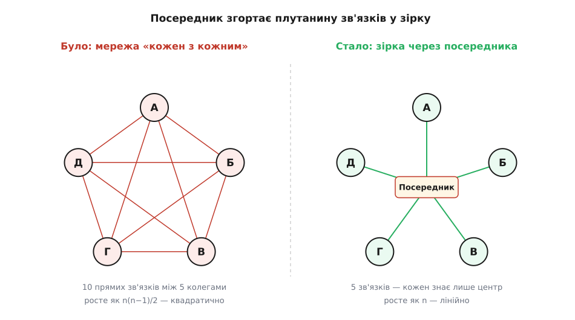

# Посередник

<preknowlist>
- [Зчеплення і зв'язність](root:sf-apps/coupling-cohesion) — чому багато прямих залежностей між об'єктами робить систему крихкою; уся мета посередника — прибрати зв'язки «кожен з кожним».
- [Інтерфейс проти реалізації](root:sf-apps/interface-vs-implementation) — різниця між тим, ЩО об'єкт обіцяє назовні, і тим, ЯК він це робить; колеги знатимуть посередника лише як інтерфейс.
- [Поліморфізм і динамічне зв'язування](root:sf-lang/polymorphism) — виклик через абстрактний тип у рантаймі йде в потрібну реалізацію; так колега кличе посередника, не знаючи його класу.
</preknowlist>

Уяви вікно замовлення в інтернет-крамниці. У ньому жменя елементів: прапорець «самовивіз, доставка не потрібна», поле адреси доставки, список країн, від якого залежить список областей, і кнопка «Оформити», що має світитися лише коли все заповнено правильно. Ці елементи не живуть окремо — вони **впливають одне на одного**. Клацнув прапорець самовивозу — поле адреси гасне й очищається. Обрав країну — перезавантажився список областей. Стер останнє обов'язкове поле — кнопка «Оформити» тьмяніє.

Найпряміший спосіб це зшити такий: хай прапорець сам гасить поле адреси, поле адреси сам вмикає-вимикає кнопку, список країн сам смикає список областей і заразом кнопку. Кожен елемент **тримає посилання на тих, кого зачіпає, і смикає їх напряму**. Працює? Так. Але подивись, що вийшло: прапорець тепер *знає* про поле адреси, поле знає про кнопку, країна знає про область і про кнопку. Кожен віджет уплетений у кількох сусідів, і ці ниточки ростуть страшно швидко.

Порахуймо чесно. П'ять елементів, де кожен може зачіпати кожного, — це до **десяти** можливих прямих ниток. Додай шостий — і ниток уже до п'ятнадцяти. Число зв'язків росте **квадратично** від числа учасників, і кожна нитка — це рядок коду, де один віджет назвав інший на ім'я. Наслідки болючі одразу з трьох боків. По-перше, **годі перевикористати** окремий елемент: витягнеш прапорець у інше вікно — а він тягне за собою знання про поле адреси, якого там немає. По-друге, **будь-яка зміна розповзається**: захотів, щоб порожня адреса ще й підсвічувалась червоним, — і правити треба не в одному місці, а всюди, звідки на адресу посилаються. По-третє — і найгірше — **логіку взаємодії ніде не видно цілком**: вона розмазана дрібними шматками по всіх віджетах, і щоб зрозуміти «що від чого залежить у цьому вікні», доводиться прочитати геть усі елементи й подумки скласти карту зв'язків у голові.

## Перевернути мережу в зірку

Ключ до розв'язку — помітити, що біда не в самих елементах, а в **прямих нитках між ними**. Отже, приберімо нитки. Заведімо один окремий об'єкт — **посередник (лат. *mediator* — «той, хто посередині», від *medius* — середина)** — і домовмося: жоден віджет більше не смикає сусіда напряму. Замість цього кожен, коли з ним щось стається, каже одну-єдину річ **посередникові**: «я змінився». А посередник — єдиний, хто знає все вікно цілком, — уже вирішує, кого через це треба увімкнути, вимкнути чи оновити, і сам їх смикає.

Що сталося зі зв'язками? Плутанина «кожен з кожним» згорнулася в **зірку**. Тепер кожен елемент знає рівно одного — посередника, — а посередник знає всіх. Десять переплетених ниток перетворилися на п'ять променів від центру. Замість квадратичного росту — лінійний: додав шостий елемент, провів один промінь до центру, і по всьому.



*Проблема не в об'єктах, а в прямих зв'язках між ними. Посередник у центрі забирає всі зв'язки на себе — кожен колега знає лише його, і квадратичне сплетіння стає лінійною зіркою.*

Це і є патерн **посередник** — один із поведінкових патернів «банди чотирьох». Його намір формулюють так: *визначити окремий об'єкт, що інкапсулює те, як група об'єктів взаємодіє між собою*. Посередник **не дає об'єктам посилатися одне на одного явно** — і саме тому дозволяє міняти їхню взаємодію незалежно від них самих. Уся логіка «хто на кого впливає» зібралась у ньому одному, у видимому й названому місці.

> 🔧 **Навіщо це.** Уяви, що завтра дизайнер додає в те саме вікно перемикач «подарункове пакування», який має розблокувати поле з побажанням і трохи зсунути ціну. Без посередника ти лізеш у кілька віджетів і всюди дописуєш згадки про новачка. З посередником ти чіпаєш **один клас**: додаєш перемикачеві рядок «крикнути посередникові» й одну гілку в його логіці. Віджети лишаються тими самими простими цеглинами, які можна перенести в наступний проєкт без хвоста залежностей.

## Три ролі

У патерні три ролі, і межа між ними — саме те, що дає всю користь.

**Колега (англ. *Colleague*)** — будь-який з об'єктів, що взаємодіють: наш прапорець, поле, кнопка. Головне про колегу: він **не тримає посилань на інших колег**. Він тримає посилання лише на посередника, і коли з ним щось стається, кличе його — «сталася подія». Куди це виллється, колега не знає й знати не хоче.

**Посередник (англ. *Mediator*)** — зазвичай спершу **інтерфейс** з одним методом на кшталт `notify(відправник, подія)`: рівно те, що колега має право покликати. Колега залежить саме від цього інтерфейсу, а не від конкретного класу, — це звичайна опора на [інтерфейс, а не реалізацію](root:sf-apps/interface-vs-implementation).

**Конкретний посередник (англ. *Concrete Mediator*)** — клас, що реалізує інтерфейс, **тримає посилання на всіх колег** і містить власне **логіку координації**: у методі `notify` він за відправником і подією вирішує, кого й як зачепити.


*Одна подія проходить два відтинки: колега сповіщає посередника вгору через інтерфейс, а посередник смикає конкретних колег униз їхніми методами. Самі колеги одне про одного не знають нічого.*

Зверни увагу на **напрям знання** — він несиметричний, і в цьому вся сіль. Колега дивиться на посередника лише через вузьку шпаринку інтерфейсу — знає одне: «є кого сповістити». Посередник же знає колег поіменно й конкретно, бо мусить ними керувати. Тому одна подія проходить два різні відтинки: вгору — колега кличе `notify` **через інтерфейс** (він же не в курсі, який клас там насправді), а вниз — посередник смикає конкретних колег їхніми справжніми методами. Той виклик угору спрацьовує через [динамічне зв'язування](root:sf-lang/polymorphism): у рантаймі виконається код того посередника, що реально підставлений.

## Найменший робочий кістяк

Зберемо патерн у найпростішому вигляді. Колегам потрібне одне: знати посередника й кликати його при зміні. Ось спільна основа й три віджети — код загальний, об'єктний, тож покажемо його двома мовами:

:::tabs
```ts
interface Mediator {
  notify(sender: Widget, event: string): void;   // єдине, що колега кличе
}

abstract class Widget {                           // КОЛЕГА
  constructor(protected mediator: Mediator) {}    // знає лише посередника
}

class Checkbox extends Widget {
  checked = false;
  toggle() {
    this.checked = !this.checked;
    this.mediator.notify(this, "toggled");        // «я змінився» — і все
  }
}

class TextField extends Widget {
  value = "";
  enabled = true;
  setValue(v: string) {
    this.value = v;
    this.mediator.notify(this, "typed");
  }
}

class Button extends Widget {
  enabled = false;
  render() { console.log(`[Оформити] ${this.enabled ? "активна" : "згасла"}`); }
}
```
```py
from typing import Protocol

class Mediator(Protocol):
    def notify(self, sender: "Widget", event: str) -> None: ...

class Widget:                                     # КОЛЕГА
    def __init__(self, mediator: Mediator) -> None:
        self._m = mediator                        # знає лише посередника

class Checkbox(Widget):
    checked = False
    def toggle(self) -> None:
        self.checked = not self.checked
        self._m.notify(self, "toggled")           # «я змінився» — і все

class TextField(Widget):
    value = ""
    enabled = True
    def set_value(self, v: str) -> None:
        self.value = v
        self._m.notify(self, "typed")

class Button(Widget):
    enabled = False
    def render(self) -> None:
        print(f"[Оформити] {'активна' if self.enabled else 'згасла'}")
```
:::

Тепер серце патерна — конкретний посередник. Він тримає всіх колег і в одному методі описує **всю поведінку вікна**:

:::tabs
```ts
class OrderDialog implements Mediator {           // КОНКРЕТНИЙ ПОСЕРЕДНИК
  readonly selfPickup = new Checkbox(this);       // тримає всіх колег
  readonly address    = new TextField(this);
  readonly submit     = new Button(this);

  notify(sender: Widget, event: string) {         // уся логіка вікна — тут
    if (sender === this.selfPickup && event === "toggled") {
      this.address.enabled = !this.selfPickup.checked;   // самовивіз → адреса зайва
      if (this.selfPickup.checked) this.address.value = "";
    }
    // кнопка активна, якщо самовивіз АБО адресу вписано
    this.submit.enabled = this.selfPickup.checked || this.address.value.trim() !== "";
    this.submit.render();
  }
}
```
```py
class OrderDialog:                                # КОНКРЕТНИЙ ПОСЕРЕДНИК
    def __init__(self) -> None:
        self.self_pickup = Checkbox(self)         # тримає всіх колег
        self.address = TextField(self)
        self.submit = Button(self)

    def notify(self, sender: Widget, event: str) -> None:   # уся логіка вікна — тут
        if sender is self.self_pickup and event == "toggled":
            self.address.enabled = not self.self_pickup.checked   # самовивіз → адреса зайва
            if self.self_pickup.checked:
                self.address.value = ""
        # кнопка активна, якщо самовивіз АБО адресу вписано
        self.submit.enabled = self.self_pickup.checked or self.address.value.strip() != ""
        self.submit.render()
```
:::

І сам сценарій. Жоден віджет не торкається іншого — усе тече через посередника:

:::tabs
```ts
const dlg = new OrderDialog();
dlg.address.setValue("вул. Хрещатик, 1");  // → [Оформити] активна
dlg.address.setValue("");                  // → [Оформити] згасла
dlg.selfPickup.toggle();                   // самовивіз: адреса не потрібна → [Оформити] активна
```
```py
dlg = OrderDialog()
dlg.address.set_value("вул. Хрещатик, 1")   # → [Оформити] активна
dlg.address.set_value("")                    # → [Оформити] згасла
dlg.self_pickup.toggle()                     # самовивіз → [Оформити] активна
```
:::

Прочитай `notify` конкретного посередника ще раз — і ти маєш **усю поведінку вікна перед очима, в одному методі**. Чому згасла кнопка? Не треба обходити три класи — відповідь тут. Віджети ж стали простими: прапорець уміє клацатись і крикнути «я змінився», і більше нічого не тямить про вікно. Саме тому той самий `Checkbox` можна поставити в будь-яке інше вікно з іншим посередником — він не тягне за собою жодного знання про сусідів.

## Справжня ціна: складність нікуди не зникає

Тут треба сказати чесно, бо це і є головний урок патерна. Посередник **не знищив** складність взаємодії — він її **перемістив**. Раніше правила «хто на кого впливає» жили в проміжках між віджетами, розсіяні й невидимі; тепер вони зібрані в одному класі. Складність нікуди не поділася — вона переїхала. Але переїзд не безкоштовний і не завжди виграшний.

Виграш реальний, коли взаємодія справді заплутана: колеги стають простими й перевикористовними, а всю каламуть видно в одному місці, де її можна прочитати й міняти. Програш чигає з іншого боку. Якщо в посередник валити геть усе підряд, він **розпухає в божественний об'єкт** — [той самий антипатерн](root:sf-apps/anti-patterns): клас, що знає все й робить усе, без якого нічого не працює і якого страшно чіпати. Логіку п'яти віджетів прочитати в одному методі — благо; логіку п'ятдесяти, та ще й упереміш із валідацією, мережею й форматуванням дат — уже монстр, гірший за початкову мережу.


*Той самий центр буває здоровим і хворим. Поки посередник лише координує — він найчитабельніше місце системи. Щойно в нього починають звалювати сторонню роботу — він тихо переростає в божественний об'єкт.*

Тому посередник — це **обмін** (англ. *trade-off*), а не безумовна перемога. Ти проміняв багато простих зв'язків на один складний вузол. Обмін чесний, коли зв'язків було справді багато й вони плуталися; невигідний, коли зв'язків мало, — тоді ти лише додав зайвий перевалочний пункт, крізь який тепер треба продиратися очима, щоб зрозуміти, хто кого зрештою зачіпає. Скільки саме зв'язків «багато» і з якої густоти зірка окупається математично — з підрахунком ребер графа й межею густоти — розкладено в [окремій нотатці](root:sf-apps/mediator/math-coupling-star.md).

> 🔧 **Навіщо це.** Оце й є та мить, коли посередник вирішує долю кодової бази. Поки в `notify` три-чотири зрозумілі гілки — це найчитабельніше місце у вікні. Щойно туди починають дописувати «раз уже я тут, хай і на сервер сходжу, і дату відформатую» — посередник тихо перероджується в божественний об'єкт, і кожна нова правда вікна робить його страшнішим. Дисципліна проста: посередник **координує** колег і більше нічого не робить сам; усе, що не координація, — виноситься в окремих виконавців, яких він лише смикає. Як утримати його тонким — типізовані події замість рядкових, розбиття великого вікна на під-посередники за групами полів, чітка межа «координація vs робота» — показано на повнішому вікні з кодом у [розборі-проєкті](root:sf-apps/mediator/proj-dialog-mediator.md).

## Не сплутати з сусідами

Посередника легко переплутати з трьома близькими речами, і плутанина коштує неправильно обраної конструкції.

**Спостерігач.** [Спостерігач (англ. *Observer*)](root:sf-apps/observer) — це односторонній потік сповіщень **один-до-багатьох**: суб'єкт змінився, підписники дізналися. Посередник — це **багато-до-багатьох координація**, зведена в центр. Вони не суперники, ба більше — посередника часто *будують на* спостерігачі: колеги сповіщають посередника подіями, а він на них реагує. Різниця в намірі: спостерігач розносить одну зміну по залежних, посередник — вирішує, як група має поводитися разом.

**Фасад.** [Фасад (англ. *Facade*)](root:sf-apps/facade) теж ставить один об'єкт поперед багатьох. Але фасад **однонапрямний**: клієнт кличе фасад, фасад кличе підсистему — і назад підсистема крізь фасад нікого не смикає. Фасад лише *спрощує доступ* ззовні до складного нутра. Посередник же **двонапрямний**: колеги кличуть його, а він кличе колег, і всі вони — рівні між собою, він їх координує, а не ховає від когось стороннього.

**Шина подій.** Це децентралізований, інфраструктурний родич посередника. У [подієвій шині](root:sf-apps/event-driven-architecture) брокер лише *маршрутизує* повідомлення й **не містить прикладної логіки** — хто на що реагує, вирішують самі передплатники. Посередник навпаки: він знає своїх колег поіменно й **тримає логіку координації в собі**. Груба підказка: якщо центр лише розносить повідомлення — це шина; якщо центр вирішує, що з тими повідомленнями робити, — це посередник.

## Де він живе сьогодні

Патерн настільки природний, що часто присутній, навіть коли слова «посередник» ніхто не вимовляв. Контролер у **MVC** чи презентер у **MVP** — це посередник між елементами екрана й моделлю: віджети не знають одне одного, вони звертаються до контролера. Централізоване сховище стану на кшталт **Redux** чи **Flux** — це посередник у масштабі всього застосунку: компоненти не смикають одне одного, а надсилають дії в сховище й читають з нього, тож зв'язок «компонент-компонент» зникає геть. У бекенді трапляється бібліотечний диспетчер запит-обробник (як **MediatR** у світі .NET) — щоправда, це вже радше диспетчер, ніж класичний посередник GoF, і сперечаються, чи чесно звати його так: він не координує рівних колег, а лише розвозить запити по обробниках.

Головна практична навичка з цього — **впізнавати** посередника в чужому коді й не тягти важку центральну машинерію туди, де об'єкти й так ледь перетинаються.

## Коли він зайвий

Патерн, що прибирає плутанину, спокушає ставити його й туди, де плутанини немає. Якщо об'єкти взаємодіють **рідко, просто і сталим чином** — А завжди й лише кличе Б, — посередник тут чистий надмір: ти прибрав прямий, чесний виклик і замінив його стрибком через центр, звідки ще треба з'ясувати, куди воно піде далі. Зірка окупає себе, лише коли павутина зв'язків **густа й мінлива**: багато учасників, кожен зачіпає багатьох, і правила часто переписують. Два об'єкти з одним викликом хай кличуть одне одного напряму — це чесніше й зрозуміліше.

## Звідки він узявся

Посередник увійшов у канон 1994 року, у книзі «банди чотирьох», як один з одинадцяти поведінкових патернів. Наскрізний приклад там — саме діалогове вікно: об'єкт-**директор** (`FontDialogDirector`) координує віджети шрифтового діалогу, а вони спілкуються тільки через нього й одне про одного нічого не знають. Слово «директор» у тій ранній назві невипадкове — воно точно передає роль: не учасник вистави, а той, хто керує нею збоку. Як патерн визрів із давнішої ідеї об'єкта-координатора й чому автори обрали саме структуру «інтерфейс плюс конкретний посередник» — у [нотатці про його народження](root:sf-apps/mediator/hist-mediator-gof.md).
